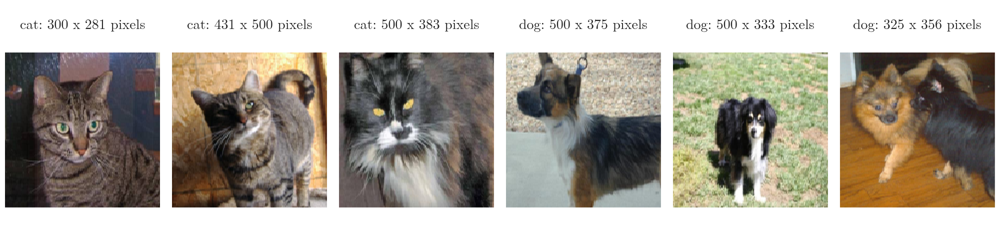
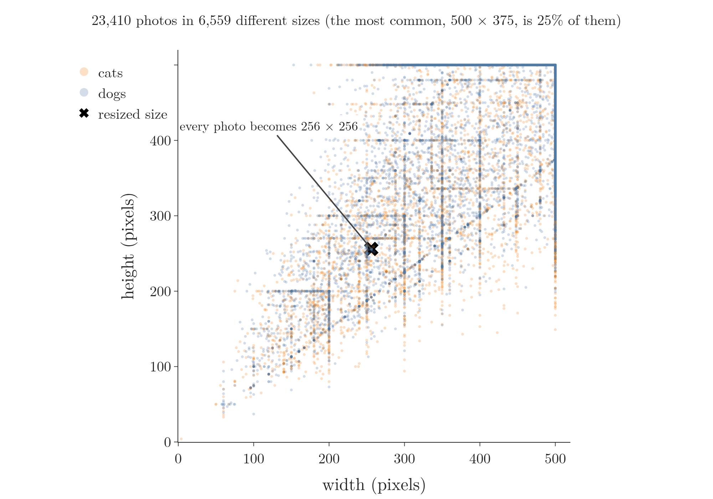
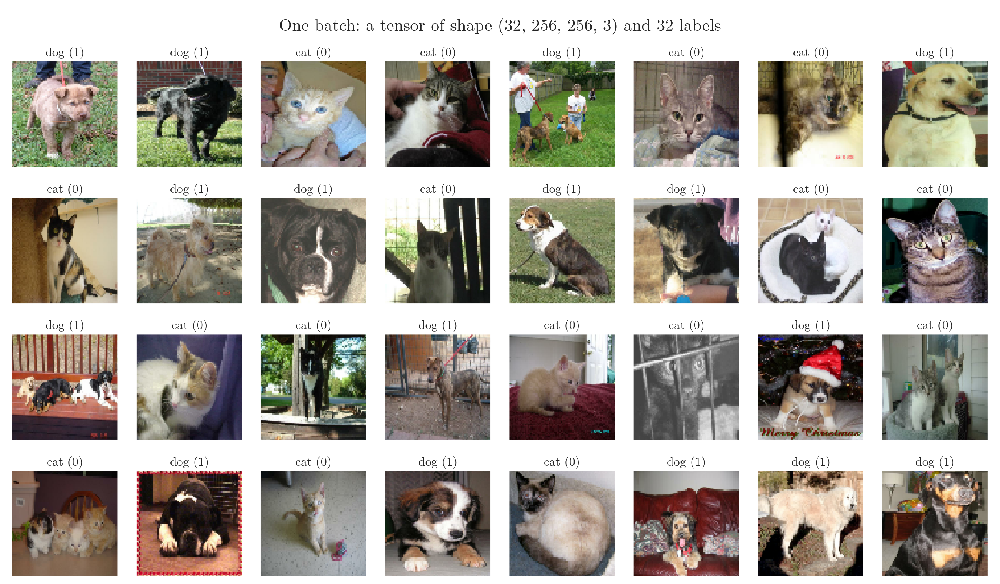
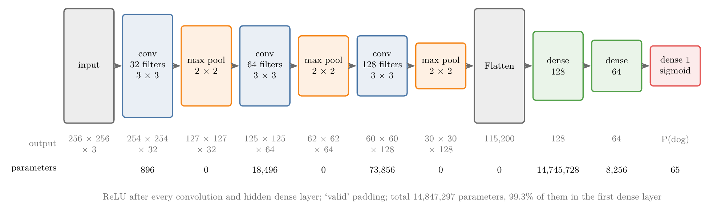
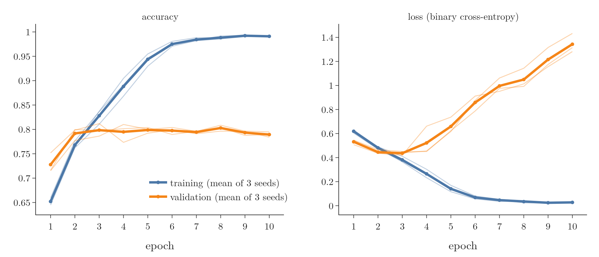
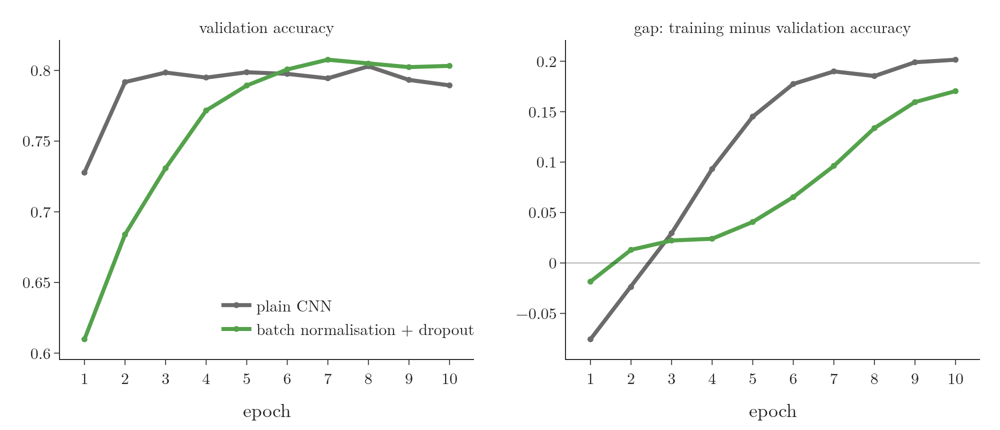
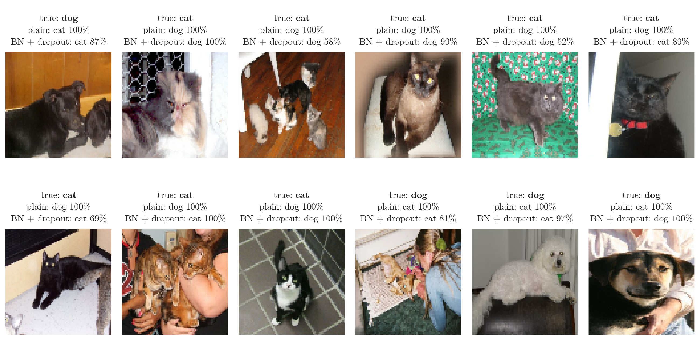

<!-- where-this-fits: generated by course_map/build_map.py; edit concepts.yaml, not this block -->
> **Where this fits:** Pipeline map step 8 (Model). See the [Course map](../../../00-course-map/00-course-map.md).
>
> 
>
> - **Builds on:** Keras workflow ([Note DL-011](../../../DL/01-basics/DL-011-customer-churn-ann/DL-011-customer-churn-ann.md)); Scaling inputs for neural networks ([Note DL-023](../../../DL/02-training/DL-023-data-scaling-in-ann/DL-023-data-scaling-in-ann.md)); CNN architecture (LeNet-5) ([Note DL-045](../../../DL/04-cnn/DL-045-lenet-5/DL-045-lenet-5.md)); Data augmentation ([Note DL-050](../../../DL/04-cnn/DL-050-data-augmentation/DL-050-data-augmentation.md)).
> - **Compare with:** Transfer learning (feature extraction and fine-tuning) ([Note DL-053](../../../DL/04-cnn/DL-053-transfer-learning/DL-053-transfer-learning.md)).
<!-- /where-this-fits -->

## 1. Overview

> **Key point:** We build a CNN that looks at a photo and says "cat" or "dog", and train it on about 19,000 real photos. It learns quickly, but it **overfits** (**overfitting**, G-1429): after 10 epochs its training accuracy is 99.1% while its validation accuracy is only 78.9%. Adding batch normalisation and dropout narrows the gap a little and halves the final validation loss, but does not remove the overfitting. The trained network still labels two new photos correctly.

This Note puts the CNN Notes into practice. The task is **binary image classification** (G-306): the input is a colour photo, and the **target** (G-1949; the output we predict) is one of two classes, cat or dog. The steps:

1. load the photos from folders, in batches (sections 3 and 4);
2. scale their pixels (section 5);
3. design a CNN of our own (section 6);
4. train it and watch it overfit (section 7);
5. try two remedies (section 8);
6. use the network on new photos (section 9).

{width=100%}

## 2. Prerequisites

- [CNN architecture and LeNet-5 Note](../DL-045-lenet-5/DL-045-lenet-5.md): convolution and pooling blocks, Flatten, dense layers.
- [Padding and strides Note](../DL-043-padding-and-strides/DL-043-padding-and-strides.md) and [pooling Note](../DL-044-pooling/DL-044-pooling.md): the size of each layer's output.
- [Customer churn ANN Note](../../01-basics/DL-011-customer-churn-ann/DL-011-customer-churn-ann.md): building, compiling and training a Keras model.
- [Data scaling Note](../../02-training/DL-023-data-scaling-in-ann/DL-023-data-scaling-in-ann.md): why inputs are scaled.
- [Regularisation Note](../../02-training/DL-026-regularization-in-dl/DL-026-regularization-in-dl.md), [dropout Note](../../02-training/DL-024-dropout/DL-024-dropout.md) and [batch normalisation Note](../../02-training/DL-031-batch-normalization/DL-031-batch-normalization.md): ways to reduce overfitting.

## 3. The dataset

> **Key point:** 25,000 photos of cats and dogs from Kaggle, in one folder per class; after removing damaged files, 23,410 remain, split 80% for training and 20% for validation.

We use the **Kaggle Cats vs Dogs** dataset (Keras documentation, Image classification from scratch), which Microsoft distributes as a download; its readme points to Microsoft Research's Asirra project. The download holds 12,500 photos of cats and 12,500 of dogs, organised as one folder per class:

```
PetImages/
    Cat/   0.jpg  1.jpg  2.jpg ...
    Dog/   0.jpg  1.jpg  2.jpg ...
```

Each photo is one **observation** (G-1374; one record of the data). Its class is not written in a table: the folder it sits in is its label.

A small number of files are damaged or are not real JPEG photos. The official Keras example deletes every file whose header lacks the "JFIF" marker of a JPEG (Keras documentation, Image classification from scratch); doing the same removes 1,590 files, the same number the example reports, and leaves 23,410 photos: 11,741 cats and 11,669 dogs.

The photos come in many sizes. Among 300 photos picked at random, the widths run from 120 to 500 pixels and the heights from 100 to 500, and there are 200 different sizes (Notebook; Figure 1). A CNN expects every input to have the same shape, so every photo will be resized to one size.



Over the whole dataset (Figure 2) there are 6,559 different sizes. The most common, 500 × 375, covers a quarter of the photos; no photo is wider or taller than 500 pixels.

Training a CNN on photos takes a lot of computation, and a GPU makes it much faster (the [what is deep learning Note](../../01-basics/DL-002-what-is-deep-learning/DL-002-what-is-deep-learning.md), section 5.2). Without a GPU of our own, a free online notebook service such as Google Colab offers one.

## 4. Loading the photos in batches

> **Key point:** `image_dataset_from_directory` reads the folders, labels each photo by its folder, resizes it, and serves the photos in batches of 32, so the whole dataset never has to fit in memory at once.

### 4.1 Why batches

> **Key point:** All the training photos at 256 × 256 would need 3.7 GB as whole numbers and 14.7 GB as decimal numbers.

We could read every file ourselves, put all photos in one big array and train on it. The problem is memory.

1. **In words:** each photo is $256 \times 256$ pixels with 3 colour values each. Stored as bytes (whole numbers 0 to 255) each value takes 1 byte; as the 32-bit decimal numbers a network computes with, 4 bytes.
2. **Formula:** $\text{memory} = \text{photos} \times 256 \times 256 \times 3 \times \text{bytes per value}$
3. **Example:** $18{,}728 \times 196{,}608 = 3.68$ billion bytes, about 3.7 GB as bytes, and $4 \times 3.68 = 14.7$ GB as 32-bit numbers.

Instead, Keras reads the photos in **batches** (G-263): small groups, here 32 photos. Only the current batch has to be in memory; when the network has learned from it, the next batch is read. An object that hands out data piece by piece in this way is called a **generator** (G-843).

### 4.2 `image_dataset_from_directory`

> **Key point:** `image_dataset_from_directory` (G-94): give it the folder, how to label, the batch size and the image size; it returns a dataset of (images, labels) batches.

> **Python:** Training and validation datasets from one folder.
>
> ```python
> import keras
> train_ds, val_ds = keras.utils.image_dataset_from_directory(
>     "PetImages", labels="inferred", label_mode="int",
>     batch_size=32, image_size=(256, 256),
>     validation_split=0.2, subset="both", seed=1337)
> ```
>
> `labels="inferred"` takes each photo's label from its folder. With `label_mode="int"` the folders get the numbers 0, 1, ... in alphabetical order: `Cat` is 0 and `Dog` is 1. `image_size=(256, 256)` resizes every photo, so each batch has the shape $(32, 256, 256, 3)$. `validation_split=0.2` with `subset="both"` keeps 20% of the photos apart as the **validation set** (G-2067); the `seed` fixes which ones.



Figure 3 shows the first batch it serves: 32 photos of all kinds, now all square, with labels 0 (cat) and 1 (dog), 16 of each here. The square resize stretches photos that were not square, which the network has to live with.

The split gives 18,728 training photos and 4,682 validation photos (Notebook). With 32 photos per batch, one pass over the training photos, an **epoch** (G-696), takes $\lceil 18{,}728 / 32 \rceil = 586$ batches. The function's defaults are `batch_size=32` and `image_size=(256, 256)` (Keras documentation, `image_dataset_from_directory`).

## 5. Scaling the pixels

> **Key point:** Divide every pixel by 255 so that inputs lie between 0 and 1.

Pixel values run from 0 to 255. Large, unscaled inputs make gradient descent slow and unstable, as the [data scaling Note](../../02-training/DL-023-data-scaling-in-ann/DL-023-data-scaling-in-ann.md) shows, so we bring every value into the range 0 to 1.

> **Python:** Apply a scaling function to every batch.
>
> ```python
> def process(image, label):
>     image = image / 255.0
>     return image, label
>
> train_ds = train_ds.map(process)
> val_ds = val_ds.map(process)
> ```
>
> `map` applies `process` to every (images, labels) pair the dataset produces. The labels pass through unchanged.

## 6. The CNN

> **Key point:** Three blocks of convolution (32, 64, 128 **filters**, G-777) and **max pooling** (G-1182), then Flatten and dense layers of 128, 64 and 1 node. Of its 14.8 million parameters, 99.3% sit in the first dense layer.

The design follows the general pattern of the [CNN architecture Note](../DL-045-lenet-5/DL-045-lenet-5.md): convolution and pooling blocks that grow the number of filters while the maps shrink, then fully connected layers (Figure 4).

{width=100%}

> **Python:** The model.
>
> ```python
> from keras import layers
> model = keras.Sequential([
>     keras.Input(shape=(256, 256, 3)),
>     layers.Conv2D(32, kernel_size=(3, 3), padding="valid", activation="relu"),
>     layers.MaxPooling2D(pool_size=(2, 2), strides=2, padding="valid"),
>     layers.Conv2D(64, kernel_size=(3, 3), padding="valid", activation="relu"),
>     layers.MaxPooling2D(pool_size=(2, 2), strides=2, padding="valid"),
>     layers.Conv2D(128, kernel_size=(3, 3), padding="valid", activation="relu"),
>     layers.MaxPooling2D(pool_size=(2, 2), strides=2, padding="valid"),
>     layers.Flatten(),
>     layers.Dense(128, activation="relu"),
>     layers.Dense(64, activation="relu"),
>     layers.Dense(1, activation="sigmoid")])
> model.summary()
> ```
>
> The output layer has one node with a **sigmoid** (G-1798): its value is the probability that the photo shows a dog (label 1).

Each output size follows from the formula of the [padding and strides Note](../DL-043-padding-and-strides/DL-043-padding-and-strides.md): a $3 \times 3$ convolution without padding removes 2 pixels ($256 \to 254$), and $2 \times 2$ pooling with stride 2 halves the size, rounding down ($254 \to 127$). After three blocks the photo has become $30 \times 30 \times 128$, which Flatten turns into $30 \times 30 \times 128 = 115{,}200$ numbers.

The parameters are counted the same way as in a dense layer: one weight per input value of the filter plus one bias per filter.

1. **In words:** a convolution layer has (filter height × filter width × input channels + 1) × filters parameters; a dense layer has (inputs + 1) × nodes.
2. **Formula:** $\text{conv: } (k \times k \times c + 1) \times f \qquad \text{dense: } (n + 1) \times m$
3. **Example:** the first convolution: $(3 \times 3 \times 3 + 1) \times 32 = 896$. The first dense layer: $(115{,}200 + 1) \times 128 = 14{,}745{,}728$.

The model has 14,847,297 parameters in total, and the first dense layer alone holds 99.3% of them; the three convolution layers together have only 93,248 (Notebook). The convolution layers share each small filter across the whole photo, while the dense layer connects every one of the 115,200 inputs to every node.

## 7. Training, and overfitting

> **Key point:** After 10 epochs the training accuracy is 99.1% but the validation accuracy 78.9%; the validation loss is lowest at epoch 3 and then rises. The model is memorising the training photos.

> **Python:** Compile and train for 10 epochs.
>
> ```python
> model.compile(optimizer="adam", loss="binary_crossentropy",
>               metrics=["accuracy"])
> history = model.fit(train_ds, epochs=10, validation_data=val_ds)
> ```
>
> `binary_crossentropy` (**binary cross-entropy**, G-303) is the loss for a two-class problem with a sigmoid output (the [loss functions Note](../../01-basics/DL-014-dl-loss-functions/DL-014-dl-loss-functions.md)). `history.history` keeps the training and validation accuracy and loss of every epoch, for plotting.

We trained the model three times with different random seeds; Figure 5 shows all three runs and their mean.

{width=100%}

| Epoch | Training accuracy | Validation accuracy | Training loss | Validation loss |
|---|---|---|---|---|
| 1 | 65.2% | 72.8% | 0.62 | 0.53 |
| 3 | 82.8% | 79.9% | 0.38 | 0.44 |
| 5 | 94.4% | 79.9% | 0.14 | 0.66 |
| 7 | 98.4% | 79.4% | 0.05 | 1.00 |
| 10 | 99.1% | 78.9% | 0.03 | 1.34 |

(Means of 3 seeds; Notebook.)

The two curves tell different stories (Figure 5). The training accuracy rises every epoch, from 65% to 99%, and the training loss falls almost to 0. The validation accuracy reaches about 80% by epoch 2 or 3 and then stays there, moving between 79% and 80%. The validation loss is lowest at epoch 3 (0.44) and then climbs every epoch, to 1.34 at epoch 10: on the photos it gets wrong, the model becomes more and more confident. By epoch 10 the gap between training and validation accuracy is 0.20.

Such a growing gap between training and validation performance is **overfitting**: the model fits details of its own training photos that do not hold for new photos (the [regularisation Note](../../02-training/DL-026-regularization-in-dl/DL-026-regularization-in-dl.md)). The [early stopping Note](../../02-training/DL-022-early-stopping/DL-022-early-stopping.md) shows how to stop training near the epoch where the validation loss is lowest.

## 8. Reducing overfitting

> **Key point:** Options: more data, data augmentation, L1/L2 regularisation, dropout, batch normalisation, or a smaller model. Batch normalisation after each convolution and dropout of 0.1 after the dense layers narrows the gap a little and halves the final validation loss, but does not remove the overfitting.

The [regularisation Note](../../02-training/DL-026-regularization-in-dl/DL-026-regularization-in-dl.md) lists the ways to fight overfitting:

- **More data.** The best remedy, but here we already use every photo we have.
- **Data augmentation:** create new training photos from the existing ones, by flipping, rotating or zooming them. The [data augmentation Note](../DL-050-data-augmentation/DL-050-data-augmentation.md) covers it.
- **L1 or L2 regularisation:** penalise large weights.
- **Dropout** (G-639): switch off random nodes during training (the [dropout Note](../../02-training/DL-024-dropout/DL-024-dropout.md)).
- **Batch normalisation** (G-266): normalise each layer's values over the batch; it also has a mild regularising effect (the [batch normalisation Note](../../02-training/DL-031-batch-normalization/DL-031-batch-normalization.md)).
- **A simpler model:** fewer layers or fewer nodes.

We try two of them together. A `BatchNormalization` layer goes after each of the three convolution layers, and a `Dropout(0.1)` layer after each of the two hidden dense layers. Everything else stays the same, and again we train 3 times.

> **Python:** One convolution block and the dense part, with the two additions.
>
> ```python
> layers.Conv2D(32, kernel_size=(3, 3), padding="valid", activation="relu"),
> layers.BatchNormalization(),
> layers.MaxPooling2D(pool_size=(2, 2), strides=2, padding="valid"),
> # ... the same for the 64- and 128-filter blocks ...
> layers.Flatten(),
> layers.Dense(128, activation="relu"),
> layers.Dropout(0.1),
> layers.Dense(64, activation="relu"),
> layers.Dropout(0.1),
> layers.Dense(1, activation="sigmoid"),
> ```

{width=100%}

| Mean of 3 seeds | Plain CNN | With batch normalisation + dropout |
|---|---|---|
| Validation accuracy, epoch 10 | 78.9% | 80.3% |
| Best validation accuracy (epoch) | 80.3% (8) | 80.8% (7) |
| Training accuracy, epoch 10 | 99.1% | 97.4% |
| Gap (training minus validation), epoch 10 | 0.202 | 0.171 |
| Validation loss: lowest (epoch), then at epoch 10 | 0.44 (3), then 1.34 | 0.46 (5), then 0.76 |

The two additions help, but only a little (Figure 6; Notebook). The validation accuracy at epoch 10 rises from 78.9% to 80.3%, the gap shrinks from 0.20 to 0.17, and the final validation loss is about half as large (0.76 against 1.34). The model with batch normalisation and dropout learns more slowly at first (61% validation accuracy after one epoch, against 73%), so it starts to overfit later: its gap stays below 0.05 until epoch 5. By epoch 10 it is overfitting too. Its training accuracy is 97.4%, and its validation loss has risen since epoch 5.

Dropout of 0.1 removes only one node in ten, and the mild regularising effect of batch normalisation is a side benefit rather than a cure (the [batch normalisation Note](../../02-training/DL-031-batch-normalization/DL-031-batch-normalization.md)). Stronger remedies for this model are more varied training data, which the [data augmentation Note](../DL-050-data-augmentation/DL-050-data-augmentation.md) creates, and stopping near the epoch of the lowest validation loss.

### 8.1 What the mistakes look like

> **Key point:** The overfitted CNN is not unsure about the photos it gets wrong: in 69% of its mistakes it gives the wrong answer a probability above 0.9. With batch normalisation and dropout this share falls to 50%.

A rising validation loss with a flat validation accuracy (section 7) means that the wrong answers are becoming more confident. To see it photo by photo, we trained each model once more (seed 0, 10 epochs; script `experiments/mistakes.py`) and kept the probability each gives to every validation photo.

| One run of each model | Plain CNN | With batch normalisation + dropout |
|---|---|---|
| Validation accuracy | 75.7% | 78.0% |
| Validation photos labelled wrongly (of 4,682) | 1,140 | 1,028 |
| ... with a probability above 0.9 for the wrong class | 789 (69%) | 512 (50%) |
| ... with a probability above 0.99 for the wrong class | 503 | 183 |

(Single runs, so the accuracies differ a little from the 3-seed means above.)

{width=100%}

Figure 7 shows the plain CNN's 12 most confident mistakes. For every one of them it gives the wrong class a probability that rounds to 100%. The regularised model gets 4 of the 12 right, and on some of the others it is less sure (58%, 52%). 467 validation photos are labelled wrongly by both models.

## 9. Predicting a new photo

> **Key point:** Prepare a new photo exactly like the training photos: resize to 256 × 256, divide by 255, and add a batch dimension. A probability above 0.5 means dog.

The network has only ever seen photos as batches of shape $(\text{batch}, 256, 256, 3)$ with values between 0 and 1. A new photo must arrive in the same form.

> **Python:** Predict one photo.
>
> ```python
> import numpy as np
> # read and resize
> img = keras.utils.load_img("dog.jpg", target_size=(256, 256))
> # (256, 256, 3), scaled like training
> x = keras.utils.img_to_array(img) / 255.0
> # a batch of one: (1, 256, 256, 3)
> x = np.expand_dims(x, axis=0)
> # probability of "dog"
> p = model.predict(x)[0, 0]
> print("dog" if p > 0.5 else "cat", p)
> ```
>
> `np.expand_dims(x, axis=0)` adds a new first axis of length 1: the model expects a batch, and this batch holds one photo.

We tried two photos from Wikimedia Commons that are not in the dataset: a tabby kitten of $1728 \times 1152$ pixels and a golden retriever of $652 \times 515$ (Notebook):

| Photo | Plain CNN: P(dog) | With batch normalisation + dropout: P(dog) |
|---|---|---|
| tabby kitten | 0.000 → cat | 0.000 → cat |
| golden retriever | 0.999 → dog | 1.000 → dog |

Both models label both photos correctly and with near certainty, even though the validation accuracy is only about 80%: these two photos are clear, close-up views of one animal each. On the 4,682 validation photos, about one in five is still labelled wrongly.

## 10. Summary

| Step | What we did |
|---|---|
| Data | 23,410 photos of cats and dogs, one folder per class; 18,728 for training, 4,682 for validation |
| Loading | `image_dataset_from_directory`: labels from folders, resized to 256 × 256, batches of 32 |
| Scaling | pixels divided by 255 |
| Model | 3 blocks of Conv2D (32, 64, 128) and MaxPooling, Flatten, Dense 128, 64, 1; 14.8 million parameters |
| Training | Adam, binary cross-entropy, 10 epochs |
| Result | 99.1% training accuracy but 78.9% validation accuracy: overfitting |
| Remedy | batch normalisation and dropout: 80.3% validation accuracy, gap 0.17 instead of 0.20 |
| New photo | resize, divide by 255, add a batch dimension, predict; above 0.5 means dog |

- Images of different sizes must be resized to one shape before they enter a CNN.
- Loading in batches keeps memory use small: the full training set would need 14.7 GB as 32-bit numbers.
- In this CNN almost all parameters sit in the first dense layer, not in the convolutions.
- A widening gap between training and validation accuracy, with a rising validation loss, signals overfitting.

## 11. Sources

**Built from**

- CampusX, "Cat Vs Dog Image Classification Project | Deep Learning Project | CNN Project", YouTube, https://www.youtube.com/watch?v=0K4J_PTgysc

**Other references**

- Keras documentation: `image_dataset_from_directory`, keras.io/api/data_loading/image (arguments and defaults: `labels="inferred"`, `label_mode`, `batch_size=32`, `image_size=(256, 256)`, `validation_split`, `subset`).
- Keras documentation: Image classification from scratch, keras.io/examples/vision/image_classification_from_scratch (the Kaggle Cats vs Dogs dataset; deleting files without "JFIF" in their header: 1,590 files).
- Microsoft Download Center: Kaggle Cats and Dogs Dataset (kagglecatsanddogs_5340.zip; 12,500 cat and 12,500 dog photos; readme pointing to the Asirra project of Microsoft Research).
- Photos for prediction: Wikimedia Commons. Kitten (David Corby, CC BY 2.5); golden retriever (Janneke Vreugdenhil, public domain).

## 12. Key terms

| Term | Meaning |
|---|---|
| Binary image classification | Sorting photos into one of two classes, such as cat or dog |
| Observation | One record of the data: here, one photo |
| Target | The output we predict: here, cat (0) or dog (1) |
| Batch (G-263) | A small group of observations processed together, here 32 photos |
| Generator | An object that hands out data piece by piece, so that not all of it has to be in memory |
| `image_dataset_from_directory` | The Keras function that loads photos from class folders as batches of (images, labels) |
| Epoch | One pass over all the training observations |
| Overfitting | Fitting the training data so closely that performance on new data suffers |
| Validation set | Observations held back from training to measure performance on unseen data |
