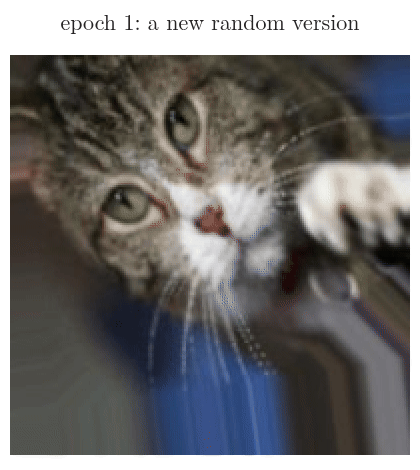
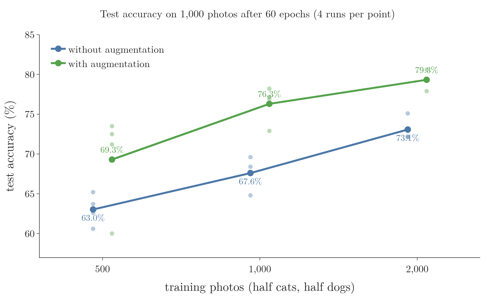
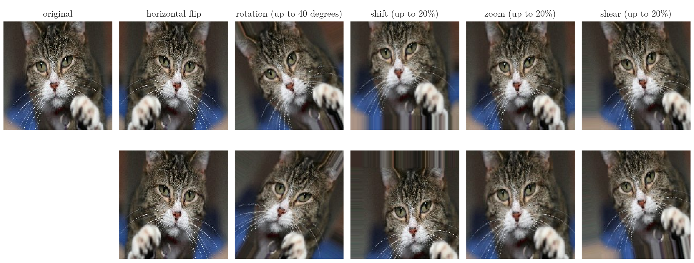
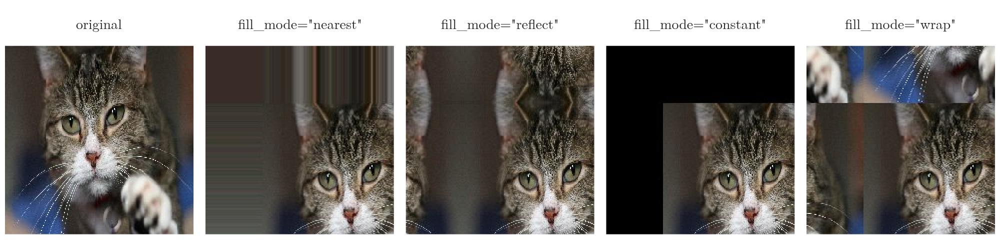
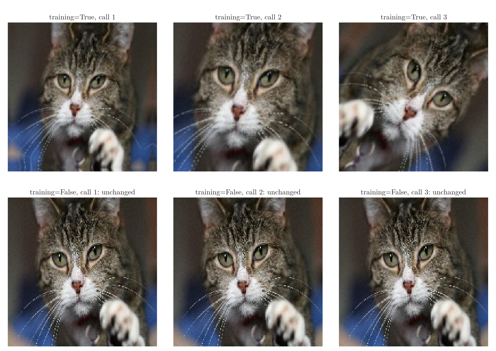
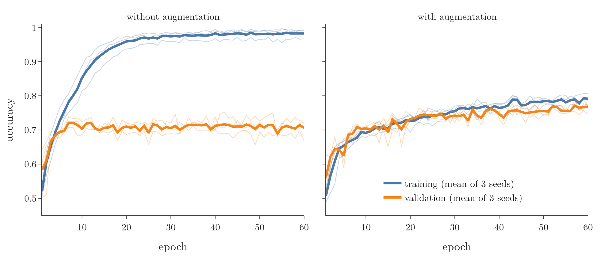

<!-- where-this-fits: generated by course_map/build_map.py; edit concepts.yaml, not this block -->
> **Where this fits:** Pipeline map step 5 (Engineer features). See the [Course map](../../../00-course-map/00-course-map.md).
>
> 
>
> - **Builds on:** [Enough data](../../../ML/01-foundations/ML-007-challenges-in-ml/ML-007-challenges-in-ml.md#3-not-enough-data); [Overfitting](../../../ML/01-foundations/ML-007-challenges-in-ml/ML-007-challenges-in-ml.md#71-overfitting); [Regularisation](../../../ML/06-regression/ML-062-ridge-regression-intuition/ML-062-ridge-regression-intuition.md#3-the-idea-penalise-large-coefficients); [Image classification with a CNN (cats vs dogs)](../../../DL/04-cnn/DL-049-cat-vs-dog-cnn/DL-049-cat-vs-dog-cnn.md#6-the-cnn).
<!-- /where-this-fits -->

## 1. Overview

> **Key point:** **Data augmentation** (G-531) makes new training images from the ones we have by changing them slightly: flipping, rotating, shifting, zooming, shearing. The label stays the same, so we get more varied training data for free. On 2,000 photos of cats and dogs, augmentation shrank the gap between training and validation accuracy from 0.28 to 0.02 and raised the test accuracy from 72.4% to 78.2%.

Deep learning needs a lot of data, and collecting and labelling images is slow and expensive. Data augmentation is a simple, smart way around part of the problem: every training image is changed a little, at random, each time the network sees it (Figure 1). A cat photo that is flipped or turned a few degrees still shows a cat, so the network gets a "new" labelled example without anyone taking a new photo.

{width=60%}

This Note covers:

- why augmentation helps (section 3);
- the common transformations (section 4);
- how to apply them in Keras (section 5);
- an experiment on cats and dogs with and without augmentation (section 6).

## 2. Prerequisites

- [The dataset](../DL-049-cat-vs-dog-cnn/DL-049-cat-vs-dog-cnn.md#3-the-dataset), [loading photos with `image_dataset_from_directory`](../DL-049-cat-vs-dog-cnn/DL-049-cat-vs-dog-cnn.md#4-loading-the-photos-in-batches) and [overfitting in a CNN](../DL-049-cat-vs-dog-cnn/DL-049-cat-vs-dog-cnn.md#7-training-and-overfitting).
- [Why neural networks overfit](../../02-training/DL-026-regularization-in-dl/DL-026-regularization-in-dl.md#3-why-neural-networks-overfit) and [the ways to reduce overfitting](../../02-training/DL-026-regularization-in-dl/DL-026-regularization-in-dl.md#4-ways-to-reduce-overfitting).

## 3. Why augment

> **Key point:** Two reasons: data is scarce and costly in many fields, and augmentation reduces **overfitting** (G-1429) by showing the network variations that do not change the label.

### 3.1 More data when data is expensive

> **Key point:** In fields such as medicine, every labelled image costs money and time; augmentation stretches a small dataset.

"The best way to make a machine learning model generalize better is to train it on more data" (Goodfellow et al. 2016, §7.4). For students, datasets come ready-made from sites such as Kaggle. For a company, collecting data is often the hardest and most expensive step.

Take a start-up that wants to detect malaria from microscope images of blood cells. Every image must come from a real patient and be labelled by an expert, so even 1,000 images cost a lot, and 10,000 cost far more. Medical image analysis is a standard example of a field without big data (Shorten and Khoshgoftaar 2019, abstract). Augmentation lets such a team get more out of the images it has.

How much more? Figure 2 trains the small network of section 6 on 500, 1,000 and 2,000 photos of cats and dogs, without and with augmentation, and tests each on the same 1,000 photos.



- **At every size, augmentation helps:** without augmentation 63.0% and with it 69.3% on 500 photos; 67.6% and 76.3% on 1,000; 73.1% and 79.3% on 2,000.
- **Augmentation can stand in for more photos:** the network trained on 1,000 augmented photos scores higher than the one trained on 2,000 plain photos.

These runs used a GPU, which does not repeat results exactly, so each point is the mean of 4 runs; the 2,000-photo numbers differ slightly from those of section 6, which come from separate runs.

### 3.2 Less overfitting

> **Key point:** If every cat in the training photos looks to the left, the network may learn "looks left" as a cat feature. Flipped copies teach it that cats look both ways.

Suppose that, by chance, every cat in our training photos faces left. A network can pick up "faces left" as a sign of a cat, a feature that is useless, even harmful, for new photos. Flipping the photos left to right gives cats facing right too, and the network learns that the direction does not matter. Augmentation removes such accidental patterns, so the network **generalises** (G-838) better: it performs well on photos it has not seen.

Goodfellow et al. (2016, §7.4) call dataset augmentation "a particularly effective technique for a specific classification problem: object recognition". AlexNet, the winner of the 2012 ImageNet competition (see [the ImageNet challenge](../DL-051-pretrained-models/DL-051-pretrained-models.md#5-the-imagenet-challenge-ilsvrc)), used random shifts and horizontal flips, and its authors report that "without this scheme, our network suffers from substantial overfitting" (Krizhevsky et al. 2012, §4.1).

## 4. The transformations

> **Key point:** Flip, rotate, shift, zoom and shear the image, each by a random amount within a limit we choose. Only transformations that keep the label are allowed.

### 4.1 Five common transformations

> **Key point:** Each transformation is applied at random, within a range; every call gives a different image.

Figure 3 shows the five transformations used most often, each applied twice to the same photo:

- **Horizontal flip** (G-903): mirror the image left to right.
- **Rotation** (with shift, zoom and shear: G-1710): turn the image by a random angle, here up to 40 degrees either way.
- **Shift (translation):** move the image up, down, left or right, here by up to 20% of its size.
- **Zoom:** enlarge or shrink the image, here by up to 20%.
- **Shear:** slant the image, as if pushing the top sideways while holding the bottom, here by up to 20%.

{width=100%}

Shorten and Khoshgoftaar (2019, pp. 7–8) list the same basic manipulations, together with changes of colour, cropping and adding noise. In practice several are combined: each time a photo is used, it gets a random flip, a random rotation, a random zoom and so on, as in Figure 1.

### 4.2 Only transformations that keep the label

> **Key point:** A transformation is safe only if the label stays true. Cats are not seen upside down, so no vertical flips; a flipped 6 can turn into a 9.

Not every transformation suits every problem. A vertical flip would show cats upside down, with their legs up and their head down. Real cat photos almost never look like that, so vertical flips teach the network nothing useful, and we leave them out.

Shorten and Khoshgoftaar (2019, p. 7) call this the **safety** (G-1719) of an augmentation: "its likelihood of preserving the label post-transformation. For example, rotations and flips are generally safe on ImageNet challenges such as cat versus dog, but not safe for digit recognition tasks such as 6 versus 9". Goodfellow et al. (2016, §7.4, p. 237) give the same warning for letters: "b" and "d" differ only by a horizontal flip.

### 4.3 Filling the empty pixels

> **Key point:** A shift or rotation leaves empty pixels at the edges. `fill_mode` (G-80) decides what goes there: the nearest edge pixel, a mirror image, a constant colour, or the opposite edge.

When the image moves, some pixels at the edge have no source any more. Figure 4 shows a large shift, 30% to the right and down, filled four ways:

- **nearest:** repeat the nearest edge pixel, which smears the border;
- **reflect:** mirror the image at its edge;
- **constant:** fill with one value, 0 (black) by default;
- **wrap:** continue with the opposite side of the image, like a tile.

{width=100%}

The choice depends on the data. For photos that already have a black border, `constant` fits naturally. Keras' random layers use `reflect` unless told otherwise, and fill with 0 when the mode is `constant` (Keras documentation, image augmentation layers).

## 5. Augmentation in Keras

> **Key point:** Keras 3 offers **random preprocessing layers** (G-1615) such as `RandomFlip`, `RandomRotation` and `RandomZoom`. Placed at the start of the model, they change every training batch and do nothing during prediction.

### 5.1 The random layers

> **Key point:** One layer per transformation; stack them in a small Sequential model.

> **Python:** An augmentation pipeline from Keras' random layers.
>
> ```python
> import numpy as np
> import keras
> from keras import layers
> augment = keras.Sequential([
>     layers.RandomFlip("horizontal"),
>     layers.RandomRotation(40 / 360, fill_mode="nearest"),   # up to 40 degrees
>     layers.RandomTranslation(0.2, 0.2, fill_mode="nearest"),  # shift up to 20%
>     layers.RandomZoom(0.2, fill_mode="nearest"),
>     layers.RandomShear(0.2, 0.2, fill_mode="nearest"),
> ])
> img = keras.utils.load_img("cat.jpg", target_size=(200, 200))
> # a batch of one image
> batch = np.expand_dims(keras.utils.img_to_array(img), 0)
> # a new random version
> new_image = augment(batch, training=True)[0]
> ```
>
> `RandomRotation` takes its range as a fraction of a full turn, so 40 degrees is $40/360$. The layers expect a batch, hence `expand_dims`. `training=True` switches the randomness on; every call returns a different image.

> **Extra:** Older code uses `ImageDataGenerator` (G-95) from `keras.preprocessing.image`, with arguments such as `rotation_range=40`, `zoom_range=0.2` and `horizontal_flip=True`, and the methods `flow` (for arrays) and `flow_from_directory` (for class folders). The class is deprecated: the TensorFlow documentation recommends loading images with `image_dataset_from_directory` and transforming them with preprocessing layers instead, and Keras 3 no longer provides it under `keras.preprocessing.image` (TensorFlow documentation, `ImageDataGenerator`; Notebook). One trap in old code: its `shear_range` is an angle in degrees (tf-keras source, `ImageDataGenerator` docstring), so `shear_range=0.2` slants an image by only 0.2 degrees, not by 20%.

### 5.2 Augmentation only during training

> **Key point:** Validation and test photos are never augmented: we want to measure the model on real photos as they are.

Augmentation changes the training photos only. The validation and test photos stay as they are, because they stand for the real photos the model will meet. The random layers handle this by themselves: "During inference time, the output will be identical to input" (Keras documentation, `RandomFlip`). Figure 5 shows it on the kitten photo, with the three random layers of section 6.1. With `training=True` each call returns a different image: a new flip, angle and zoom every time. With `training=False` all three calls return the photo exactly as it was.



Also note that the network never trains on the original photos as such. In each epoch, every training photo passes through the random layers and the network sees only the transformed version: a different one each epoch (Figure 1).

## 6. Experiment: 2,000 photos with and without augmentation

> **Key point:** With 2,000 training photos, the CNN without augmentation memorises them: 98% training accuracy but about 71% validation accuracy. With augmentation the two stay together near 77–79%, and the test accuracy rises from 72.4% to 78.2%.

### 6.1 Setup

> **Key point:** A deliberately small dataset, a small CNN, the same training settings; the only change is the three augmentation layers.

To imitate a project with little data, we use only 1,000 cat and 1,000 dog photos for training from the cats-vs-dogs dataset of [the cat vs dog dataset](../DL-049-cat-vs-dog-cnn/DL-049-cat-vs-dog-cnn.md#3-the-dataset), plus 500 + 500 for validation and 500 + 500 for a final test. The model is the small CNN of the Keras blog post "Building powerful image classification models using very little data" (Chollet 2016): three convolution layers with 32, 32 and 64 filters, each followed by **max pooling** (G-1182; keeping the largest value of each window, see [max pooling](../DL-044-pooling/DL-044-pooling.md#4-max-pooling)), then a dense layer of 64 nodes, **dropout** (G-639; switching off random nodes during training, see [how dropout works](../../02-training/DL-024-dropout/DL-024-dropout.md#4-how-dropout-works)) of 0.5 and a **sigmoid** (G-1798; a function that squeezes a number into 0 to 1) output; photos of $150 \times 150$, batches of 16 (16 photos at a time), the **RMSProp** (G-1697) optimizer (the rule that updates the weights).

The augmented model adds three layers at its start, as in Chollet (2021, ch. 8): `RandomFlip("horizontal")`, `RandomRotation(0.1)` (up to 36 degrees) and `RandomZoom(0.2)`.

> **Python:** The augmented model.
>
> ```python
> model = keras.Sequential([
>     keras.Input(shape=(150, 150, 3)),
>     layers.RandomFlip("horizontal"),
>     layers.RandomRotation(0.1),
>     layers.RandomZoom(0.2),
>     layers.Rescaling(1 / 255),
>     layers.Conv2D(32, 3, activation="relu"), layers.MaxPooling2D(2),
>     layers.Conv2D(32, 3, activation="relu"), layers.MaxPooling2D(2),
>     layers.Conv2D(64, 3, activation="relu"), layers.MaxPooling2D(2),
>     layers.Flatten(),
>     layers.Dense(64, activation="relu"),
>     layers.Dropout(0.5),
>     layers.Dense(1, activation="sigmoid")])
> model.compile(optimizer="rmsprop", loss="binary_crossentropy",
>               metrics=["accuracy"])
> ```
>
> `Rescaling(1 / 255)` divides the pixels by 255 inside the model. The model without augmentation is the same list without the three random layers.

Both models train for 60 **epochs** (G-696), three times each with different seeds; the Note quotes the means.

### 6.2 Results

> **Key point:** Without augmentation, validation accuracy peaks at epoch 7 and the validation loss then climbs from 0.57 to 3.78. With augmentation, training and validation accuracy rise together for all 60 epochs.

{width=100%}

| Mean of 3 seeds | Without augmentation | With augmentation |
|---|---|---|
| Training accuracy, epoch 60 | 98.2% | 79.1% |
| Validation accuracy, epoch 60 | 70.6% | 76.8% |
| Gap (training minus validation), epoch 60 | 0.276 (98.2% − 70.6%) | 0.023 (79.1% − 76.8%) |
| Best validation accuracy (epoch) | 72.1% (7) | 77.1% (57) |
| Validation loss: lowest (epoch), then at epoch 60 | 0.57 (7), then 3.78 | 0.53 (38), then 0.55 |
| Test accuracy (1,000 photos), range of 3 seeds | 72.4% (69.5–75.5%) | 78.2% (76.2–80.2%) |

**Without augmentation, the model overfits fast** (Figure 6, left). Its training accuracy climbs to 96.7% by epoch 25 and 98.2% by epoch 60, but its validation accuracy stops near 70% after about 7 epochs. From then on the validation loss rises steadily, from 0.57 at epoch 7 to 3.78 at epoch 60: the model becomes more and more confident on photos it gets wrong. With only 2,000 photos, it learns the training photos themselves rather than what cats and dogs look like.

**With augmentation, the two curves stay together** (Figure 6, right). The gap at epoch 60 is 0.023 instead of 0.276, and the validation loss stays near its lowest value. Because every epoch shows new versions of the photos, the model cannot memorise them, and it has to learn features that survive a flip, a rotation or a zoom.

**Augmentation learns more slowly at first, then better.** At epoch 5 the model without augmentation is ahead on validation accuracy (69.4% against 62.5%), since its training photos are easier: always the same ones. By epoch 10 both reach 70.4%. After that only the augmented model keeps improving, to 76.8% at epoch 60, and it ends 5.8 points higher on the 1,000 test photos.

Augmentation is not a full substitute for more data: the new versions are variations of the same 2,000 animals, not new animals, and the augmented model still stops near 77% validation accuracy. [Transfer learning](../DL-053-transfer-learning/DL-053-transfer-learning.md#4-how-it-works) shows a far stronger way to use little data.

## 7. Summary

| | Without augmentation | With augmentation |
|---|---|---|
| Training accuracy, epoch 60 | 98.2% | 79.1% |
| Validation accuracy, epoch 60 | 70.6% | 76.8% |
| Test accuracy | 72.4% | 78.2% |
| Overfitting | strong: gap 0.28, validation loss rising | small: gap 0.02 |

- Data augmentation creates new training images by random, label-preserving changes: flips, rotations, shifts, zooms, shears, so each change is a new labelled example without a new photo.
- It helps when data is scarce and expensive, and it reduces overfitting, because every epoch shows new versions of the photos, so the network cannot memorise them and must learn features that survive a flip, a rotation or a zoom.
- Only safe transformations: no vertical flips for cats, no flips for 6 and 9, because the label must still be true after the change.
- In Keras 3, use the random preprocessing layers; they act only during training, so the same model sees each photo unchanged at prediction time.
- Validation and test images are never augmented, because they stand for the real photos the model will meet.

## 8. Sources

**Built from**

- CampusX, "Data Augmentation in Deep Learning | CNN", YouTube, https://www.youtube.com/watch?v=sM2C-SsREgM

**Other references**

- Goodfellow, I., Bengio, Y. and Courville, A. (2016). *Deep Learning*. MIT Press. §7.4, pp. 236–237 (dataset augmentation; more data generalises better; effective for object recognition; transformations must not change the class: "b" and "d", "6" and "9").
- Shorten, C. and Khoshgoftaar, T. M. (2019). A survey on Image Data Augmentation for Deep Learning. *Journal of Big Data* 6, 60. Abstract (medical image analysis lacks big data), p. 7 (safety of an augmentation), pp. 7–8 (flipping, colour space, cropping, rotation, translation, noise injection).
- Krizhevsky, A., Sutskever, I. and Hinton, G. E. (2012). ImageNet Classification with Deep Convolutional Neural Networks. *NeurIPS 2012*. §4.1 (translations and horizontal reflections; substantial overfitting without them).
- Chollet, F. (2016). Building powerful image classification models using very little data. *The Keras Blog*, 5 June 2016 (the small CNN; 1,000 training photos per class).
- Chollet, F. (2021). *Deep Learning with Python*, 2nd ed. Manning. Ch. 8, companion notebook (augmentation layers `RandomFlip("horizontal")`, `RandomRotation(0.1)`, `RandomZoom(0.2)`).
- Keras documentation: image augmentation layers (`RandomFlip`, `RandomRotation`, `RandomTranslation`, `RandomZoom`, `RandomShear`), keras.io/api/layers/preprocessing_layers/image_augmentation ("During inference time, the output will be identical to input"; `fill_mode` options).
- TensorFlow documentation: `tf.keras.preprocessing.image.ImageDataGenerator` (deprecated; prefer `image_dataset_from_directory` and preprocessing layers). tf-keras source, `ImageDataGenerator` docstring (`shear_range`: "Shear angle in counter-clockwise direction in degrees").
- Kitten photo: Wikimedia Commons, David Corby, CC BY 2.5.

## 9. Key terms

Terms taught in this Note come first; linked terms are recaps, taught in the Note the link opens.

| Term | Meaning |
|---|---|
| Data augmentation (G-531) | Enlarging a dataset by making changed copies of its examples, such as zoomed or shifted images. |
| Horizontal flip (G-903) | Mirroring an image left to right; a data augmentation step that gives the model new training images of the same class. |
| Rotation, shift, zoom, shear (G-1710) | Four common data-augmentation changes to an image: turning it, moving it, enlarging or shrinking it, and slanting it; each makes a new training image with the same label. |
| Safety (of an augmentation) (G-1719) | Whether a transformation keeps the label true. |
| `fill_mode` (G-80) | How empty pixels after a shift or rotation are filled: nearest, reflect, constant or wrap. |
| Random preprocessing layer (G-1615) | A Keras layer, such as `RandomFlip`, that changes images at random during training and does nothing at prediction. |
| `ImageDataGenerator` (G-95) | An older Keras class for image augmentation: it makes randomly rotated, shifted, zoomed or flipped copies of training images; now deprecated in favour of `image_dataset_from_directory` and preprocessing layers. |
| [Overfitting](../../../ML/01-foundations/ML-007-challenges-in-ml/ML-007-challenges-in-ml.md#71-overfitting) (G-1429) | Learning the training data too closely, noise included; fails on new data. |
| [Generalisation (generalise)](../../../ML/07-classification/ML-070-perceptron-code/ML-070-perceptron-code.md#62-why-it-matters) (G-838) | How well a model performs on new data it was not trained on. |
| [Max pooling](../../../DL/04-cnn/DL-044-pooling/DL-044-pooling.md#4-max-pooling) (G-1182) | Pooling that keeps only the largest value in each window (usually 2 × 2), which shrinks the feature map while keeping the strongest response in each region. |
| [Dropout](../../../DL/02-training/DL-024-dropout/DL-024-dropout.md#41-switching-nodes-off) (G-639) | Switching off a random set of input and hidden nodes at every training step, to reduce overfitting. |
| [Sigmoid function](../../../ML/07-classification/ML-071-sigmoid-function/ML-071-sigmoid-function.md#4-the-sigmoid-function) (G-1798) | An S-shaped function that squashes any number into the range 0 to 1, $\sigma(z) = 1/(1 + e^{-z})$; it turns a score into a probability, as in logistic regression. |
| [RMSProp](../../../DL/03-optimizers/DL-037-rmsprop/DL-037-rmsprop.md#1-overview) (G-1697) | An optimizer that divides each parameter's step by the root of a running average (EWMA) of its recent squared gradients, $v_t = \beta v_{t-1} + (1-\beta)g_t^2$; old gradients fade, so unlike AdaGrad the learning rate does not shrink to nothing. |
| [Epoch](../../../DL/01-basics/DL-005-perceptron-trick/DL-005-perceptron-trick.md#7-loops-and-epochs) (G-696) | One full update of the parameters using the whole training set. |
