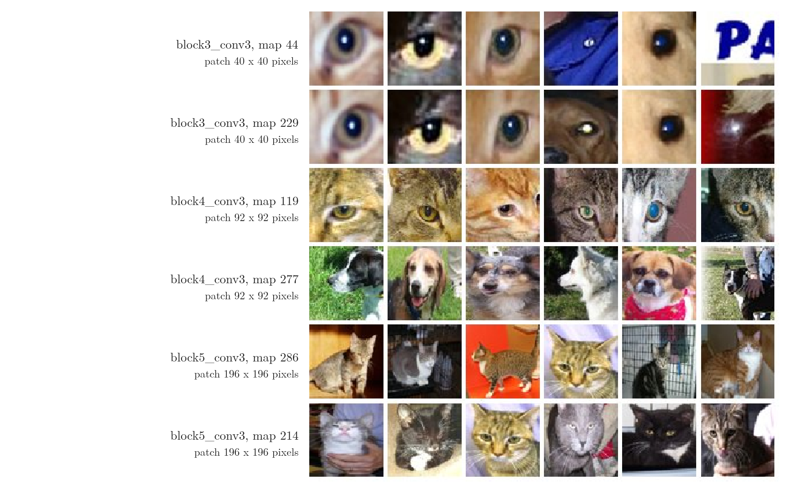
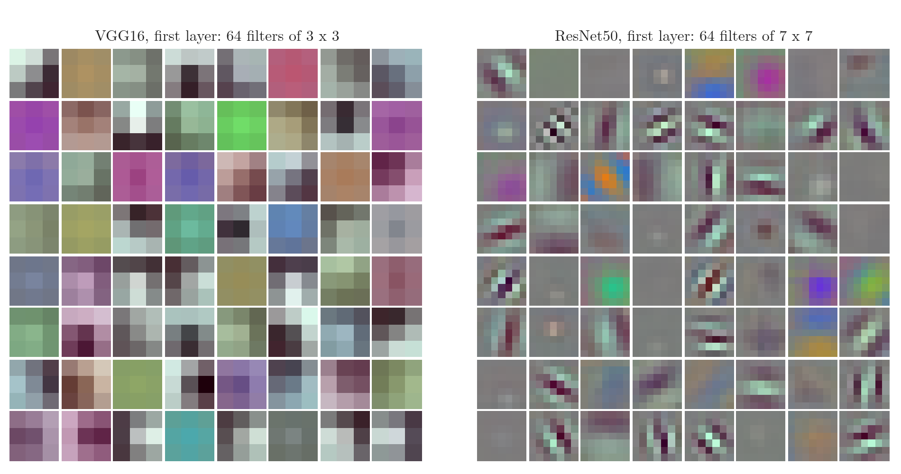
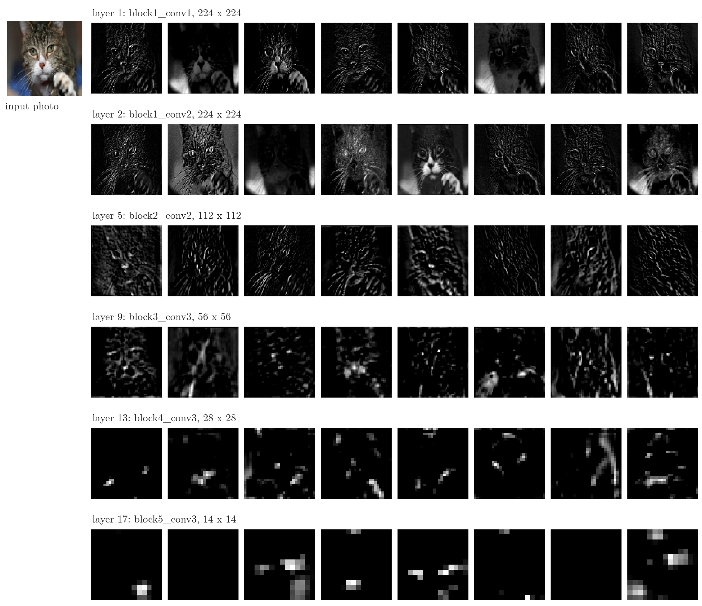
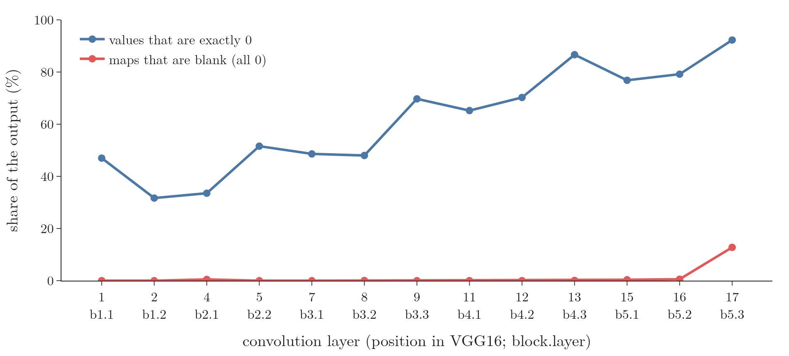
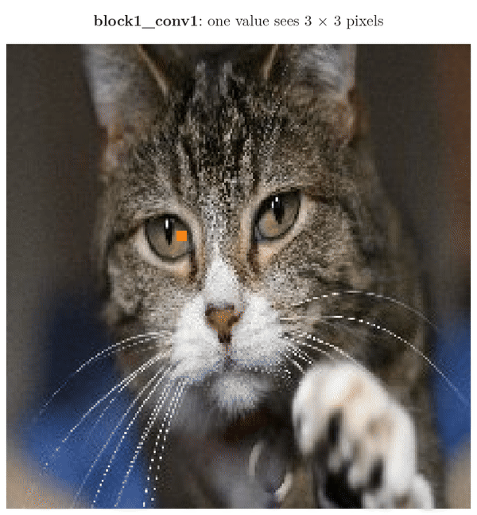

<!-- where-this-fits: generated by course_map/build_map.py; edit concepts.yaml, not this block -->
> **Where this fits:** Pipeline map step 9 (Evaluate). See the [Course map](../../../00-course-map/00-course-map.md).
>
> 
>
> - **Builds on:** [Convolution operation and feature maps](../../../DL/04-cnn/DL-042-convolution-operation/DL-042-convolution-operation.md#6-the-convolution-operation); [Pretrained models and ImageNet](../../../DL/04-cnn/DL-051-pretrained-models/DL-051-pretrained-models.md#4-imagenet-the-dataset-behind-the-models).
<!-- /where-this-fits -->

## 1. Overview

> **Key point:** We can look inside a trained CNN by drawing its **filters** (the learned weights) and its **feature maps** (what each filter outputs for a photo). In VGG16, early layers respond to edges and colours, deeper layers to parts such as eyes, and the last convolution layer to whole cats.

A neural network is often called a **black box** (G-311): a photo goes in, a good answer comes out, and what happens in between is hidden. For a CNN we can open the box a little, because every layer's weights and outputs are grids of numbers that we can draw as images.

[How a CNN recognises an image](../DL-040-cnn-intuition/DL-040-cnn-intuition.md#5-how-a-cnn-recognises-an-image) claimed that early layers find simple features such as edges and later layers find complex ones. This Note checks that claim on a real network, VGG16 trained on ImageNet. Figure 1 is the main result: for six feature maps in three deep layers, the six photo patches (out of 1,000 photos) that excite each map most.

{width=95%}

This Note covers:

- the two things we can look at (section 3);
- the network we study, VGG16 (section 4);
- its first-layer filters (section 5);
- the feature maps of one photo, layer by layer (section 6);
- how sparse the maps become with depth (section 7);
- what single deep feature maps respond to (section 8).

## 2. Prerequisites

- [The convolution operation](../DL-042-convolution-operation/DL-042-convolution-operation.md#6-the-convolution-operation): filters, feature maps, edge detectors.
- [Max pooling](../DL-044-pooling/DL-044-pooling.md#4-max-pooling): halving a feature map by keeping the largest value in each block.
- [Pretrained models in Keras](../DL-051-pretrained-models/DL-051-pretrained-models.md#6-pretrained-models-in-keras): VGG16 and loading pretrained networks.
- [ReLU](../../02-training/DL-027-activation-functions/DL-027-activation-functions.md#8-relu): the activation $\max(0, x)$, which turns every negative value into 0.

## 3. Two things to look at

> **Key point:** Filters are the weights a convolution layer has learned; feature maps are what those filters produce for one particular photo.

A **convolution layer** (G-480) holds a set of **filters** (G-777), small grids of learned weights (see [filter and feature map](../DL-042-convolution-operation/DL-042-convolution-operation.md#61-filter-and-feature-map)). Sliding one filter over its input gives one **feature map** (G-766), a grid that is large wherever the filter's pattern is present. So there are two things to inspect:

1. **The filters themselves.** They do not depend on any photo. Only the first layer's filters can be drawn directly as images, because only they act on the red, green and blue channels of the photo.
2. **The feature maps.** They show how the network reacts to one photo: where each filter finds its pattern.

## 4. The network: VGG16

> **Key point:** VGG16 has 13 convolution layers in 5 blocks, each block ending with max pooling, then three dense layers: 16 layers with weights. All its convolutions are 3 × 3.

We use **VGG16** (G-2088; Simonyan and Zisserman 2015) with its **ImageNet** (G-920) weights from `keras.applications`: the weights it learned on the [ImageNet challenge data](../DL-051-pretrained-models/DL-051-pretrained-models.md#51-the-competition), over a million labelled photos in 1,000 classes. Its structure is regular and easy to read: every convolution is $3 \times 3$ with [stride](../DL-043-padding-and-strides/DL-043-padding-and-strides.md#51-what-a-stride-is) 1 (the filter moves one cell at a time) and `same` [padding](../DL-043-padding-and-strides/DL-043-padding-and-strides.md#41-what-padding-does) (zeros added around the edge, so the output keeps the input's size), followed by **ReLU** (G-1668), and every block ends with $2 \times 2$ **max pooling** (G-1182) that halves the height and width (Figure 2).

{width=100%}

Keras lists 23 layers, at positions 0 to 22. The convolution layers sit at positions 1, 2, 4, 5, 7, 8, 9, 11, 12, 13, 15, 16 and 17: thirteen of them. With the three dense layers, VGG16 has 16 layers with weights, hence its name (Notebook). Each block doubles the number of filters, from 64 to 512, while pooling halves the size of the maps, from $224 \times 224$ to $14 \times 14$.

> **Python:** Finding the convolution layers by name.
>
> ```python
> from keras.applications.vgg16 import VGG16
> vgg = VGG16(weights="imagenet")
> conv_ids = [i for i, layer in enumerate(vgg.layers) if "conv" in layer.name]
> print(conv_ids)            # [1, 2, 4, 5, 7, 8, 9, 11, 12, 13, 15, 16, 17]
> ```
>
> `vgg.layers` is the list of layers in order; `enumerate` gives each one's position. Keras names convolution layers `block1_conv1`, `block1_conv2` and so on.

## 5. The filters of the first layer

> **Key point:** First-layer filters are small colour images. VGG16's are only 3 × 3, so they show little more than colour patches and light-to-dark changes; ResNet50's 7 × 7 filters clearly show edges at many angles and colour blobs.

### 5.1 Turning weights into a picture

> **Key point:** Rescale all the weights to the range 0 to 1, then draw each filter's three slices as red, green and blue.

The first convolution layer of VGG16 holds 64 filters of size $3 \times 3 \times 3$ (height, width, colour channel) and 64 biases: `get_weights()` returns arrays of shape $(3, 3, 3, 64)$ and $(64,)$. Goodfellow et al. (2016, §9.10) point out that for an artificial network "we can just display an image of the convolution kernel (another name for a filter) to see what the corresponding channel of a convolutional layer responds to". The weights are small numbers of either sign, so to draw them as colours we rescale them.

1. **In words:** subtract the smallest weight of the layer and divide by the range, so the smallest weight becomes 0 (black) and the largest becomes 1 (full brightness).
2. **Formula:** $w_{\text{shown}} = \dfrac{w - w_{\min}}{w_{\max} - w_{\min}}$
3. **Example:** if the weights run from $-0.6$ to $0.6$, a weight of $0.3$ becomes:

   $$w_{\text{shown}} = \frac{0.3 - (-0.6)}{0.6 - (-0.6)}$$

   $$w_{\text{shown}} = \frac{0.9}{1.2}$$

   $$w_{\text{shown}} = 0.75$$

   This is a light value. A weight of 0 becomes 0.5, a middle grey.

### 5.2 What the filters look like

> **Key point:** ResNet50's first-layer filters are edge detectors at many angles and colour-blob detectors, as the literature reports for first layers in general.

{width=100%}

In Figure 3, each small square is one filter: its three colour slices (the weights that multiply the red, green and blue channels) are drawn together as one small colour image, each slice setting the amount of its colour. Figure 3, left, shows VGG16's 64 filters. With only 9 cells each, most look like a plain colour patch or a simple change from light to dark across the patch, a tiny edge. Patterns are hard to see at this size.

ResNet50's first layer uses larger $7 \times 7$ filters (Figure 3, right), and there the pattern is clear. Many filters are **grey stripes**: a light band beside a dark band, at many different angles. Such a filter responds strongly where the photo has an edge in that direction, which makes it an **edge detector** (G-659). Other filters are **colour blobs** (G-411), a patch of one colour against grey, which respond to that colour. Some are nearly flat and respond to little.

The same picture appears in every large CNN trained on photos. AlexNet's first layer "learned a variety of frequency- and orientation-selective kernels, as well as various colored blobs" (Krizhevsky et al. 2012, §6.1). Yosinski et al. (2014) found that first-layer features resemble Gabor filters (striped edge patterns) and colour blobs whatever the dataset or task, so they call these features **general**. Goodfellow et al. (2016, §9.10) add that most cells in V1, the first visual area of the brain, have weights described by the same kind of striped Gabor patterns, and that most deep learning algorithms learn Gabor-like features in their first layer.

### 5.3 A contrast: the first layer of a dense network

> **Key point:** The first-layer weights of a dense network trained on digits do not look like edges; a CNN's first-layer filters do. A small filter that is slid over the whole image can only learn a small local pattern, and edges are such patterns.

A dense layer also has first-layer weights we can draw: each hidden node has one weight per pixel, so its weights form a picture as large as the image. [The hidden nodes as pictures](../../01-basics/DL-012-mnist-ann/DL-012-mnist-ann.md#91-the-hidden-nodes-as-pictures) draws them for a network of 128 hidden nodes. Figure 4 puts 16 of those pictures beside the first 16 of ResNet50's filters.

{width=100%}

- **Left, dense network:** each picture covers the whole 28 × 28 image, and it shows faint smudges spread over the image, with no clean edge anywhere. The network classifies digits well (see [the MNIST network](../../01-basics/DL-012-mnist-ann/DL-012-mnist-ann.md#4-the-network)), but its first layer has not learned the edge detectors we might hope for.
- **Right, CNN:** each picture is only 7 × 7 pixels. Several are clear stripes, a light band beside a dark band (edge detectors), others are colour blobs, and some are flat.

The difference comes from how the two layers are built. A dense node has a separate weight for every pixel of the image. A convolution filter is much smaller than the image and is used at every position, so it detects "small, meaningful features such as edges with kernels that occupy only tens or hundreds of pixels" (Goodfellow et al. 2016, §9.2).

## 6. Feature maps of one photo, layer by layer

> **Key point:** Cut the network after a layer and predict: the output is that layer's feature maps. Early maps look like edge drawings of the photo; deep maps are small, blotchy and mostly black.

### 6.1 How to get the feature maps

> **Key point:** A new Keras model with VGG16's input and a chosen layer's output.

To see what a layer produces, we build a new model that shares VGG16's layers but stops at the layer we want. Predicting with it on a photo returns that layer's feature maps.

> **Python:** Feature maps of six layers for one photo.
>
> ```python
> import numpy as np, keras
> from keras.applications.vgg16 import preprocess_input
> img = keras.utils.load_img("kitten.jpg", target_size=(224, 224))
> x = preprocess_input(np.expand_dims(keras.utils.img_to_array(img), 0))
> layer_ids = [1, 2, 5, 9, 13, 17]
> probe = keras.Model(inputs=vgg.inputs,
>                     outputs=[vgg.layers[i].output for i in layer_ids])
> # a list of 6 arrays, e.g. maps[0].shape == (1, 224, 224, 64)
> maps = probe.predict(x)
> ```
>
> `keras.Model(inputs=..., outputs=...)` builds a model from existing layers; no weights are copied or retrained. [Building a functional model](../DL-054-keras-functional-api/DL-054-keras-functional-api.md#4-building-a-functional-model) explains this way of building models.

### 6.2 What the maps show

> **Key point:** Layers 1 and 2 keep the kitten recognisable; by layer 9 the maps highlight spots such as the eyes and nose; at layers 13 and 17 the kitten has disappeared into a few bright cells.

{width=100%}

In Figure 5, the photo is at top left; each row is one layer, and each small square in the row is one feature map of that layer, shown as a grey image. Brighter means a larger value and black means 0. The figure shows the first 8 of each layer's maps (out of 64 to 512). Read the rows from top to bottom and watch how the squares change from copies of the kitten to a few bright cells:

- **Layers 1 and 2** ($224 \times 224$): the maps look like drawings of the kitten. Some trace its outlines: whiskers, the rims of the eyes, the edges of the paw. Others light up whole regions, such as the bright fur or the dark background. Chollet calls the first layer "a collection of various edge detectors" (Chollet 2017, §5.4; Chollet and Watson 2025, ch. 10).
- **Layer 5** ($112 \times 112$): fragments of fur texture and of the face's lines.
- **Layer 9** ($56 \times 56$): fewer, sharper bright spots. In the last map of the row, two dots sit exactly on the eyes.
- **Layers 13 and 17** ($28 \times 28$ and $14 \times 14$): a few bright cells on black. Two of the eight maps at layer 17 are completely black. Nobody could recognise the kitten from these maps.

The deeper we go, the less a map says about what the photo looks like, and the more about what it contains. Chollet describes the activations (the values in the feature maps) as becoming "increasingly abstract and less visually interpretable" with depth (Chollet and Watson 2025, ch. 10). The specific kitten is lost, and what remains are general signals, such as "an eye is here", that hold for any cat.

## 7. Feature maps get sparser with depth

> **Key point:** Over 500 photos, the share of feature-map values that are exactly 0 grows from 47% in the first layer to 92% in the last, and 13% of the last layer's maps are entirely blank.

The black areas in Figure 5 are values of exactly 0. Every convolution in VGG16 is followed by ReLU, $\max(0, x)$, which turns every negative value into 0. A value is 0 where the filter's pattern is absent. We measured this on 500 photos of cats and dogs ([the dataset](../DL-049-cat-vs-dog-cnn/DL-049-cat-vs-dog-cnn.md#3-the-dataset) is described there) for all 13 convolution layers (Figure 6; Notebook). In Figure 6 the horizontal axis lists the convolution layers from first to last, and the vertical axis is a share in percent. The blue line is the share of all output values that are exactly 0. The red line is the share of whole maps that are entirely 0. The blue line climbs and the red line stays flat until the last layer:

{width=95%}

| Layer | Values exactly 0 | Maps entirely 0 |
|---|---|---|
| block1_conv1 (position 1) | 47% | 0.0% |
| block3_conv3 (position 9) | 70% | 0.0% |
| block4_conv3 (position 13) | 87% | 0.1% |
| block5_conv3 (position 17) | 92% | 12.8% |

The trend is not perfectly smooth (layer 2 is below layer 1), but overall the maps become **sparse** (G-1846): most values are 0. A map that is entirely 0 for a photo is a **blank map** (G-313): its pattern appears nowhere in that photo. Blank maps are almost absent until the last convolution layer, where one map in eight is blank. Chollet reports the same: "in the first layer, all filters are activated by the input image, but in the following layers, more and more filters are blank. This means the pattern encoded by the filter isn't found in the input image" (Chollet and Watson 2025, ch. 10).

Sparsity fits the idea of more specific features. An edge appears somewhere in almost every photo, so early filters fire almost everywhere. A filter for cat eyes, a part, fires only where a cat's eye is, and not at all in a photo without one.

## 8. What one deep feature map responds to

> **Key point:** Search many photos for the patches that excite a single feature map most. In block 3 they are small bright-centred spots, in block 4 cat eyes or dog snouts, in block 5 whole cats: simple features combine into parts, and parts into objects.

### 8.1 The method of Zeiler and Fergus

> **Key point:** For one map, find the photos with its strongest values and cut out the patch of the photo each value depends on.

Zeiler and Fergus (2014) visualised a trained CNN by showing, for a given feature map, "the top 9 activations" (**top activations**, G-1986) over many photos (Zeiler and Fergus 2014, §4). We use a simple version:

1. Pick a feature map, for example map 119 of `block4_conv3`. To avoid choosing by hand, we take, in each of three layers, the two maps that the kitten photo excites most.
2. Run 1,000 photos of cats and dogs through VGG16 and record each photo's largest value in that map, and where it is.
3. For the six photos with the largest values, cut out the patch of the photo that this value depends on, its **receptive field** (G-1642; the region of the photo that the value depends on, explained in [simple cells](../DL-041-cnn-vs-visual-cortex/DL-041-cnn-vs-visual-cortex.md#51-simple-cells) and worked out in section 8.2).

### 8.2 How large the receptive field is

> **Key point:** Each 3 × 3 convolution widens the region a value sees; each pooling doubles how fast it widens. In VGG16 the region grows to 40, 92 and 196 pixels at the end of blocks 3, 4 and 5.

1. **In words:** a $3 \times 3$ convolution adds one cell on each side, and one cell of the current layer spans $j$ pixels of the photo, so the region grows by $2j$ pixels. A $2 \times 2$ pooling with stride 2 adds $j$ pixels and doubles $j$.
2. **Formula:** let $r$ be the size of the region of the photo (in pixels) that one value sees, and $j$ the number of photo pixels between two neighbouring cells of the current layer. On the photo itself, $r = 1$ and $j = 1$. The arrow $\leftarrow$ means "replace the left value by the right side". For each layer:
   $$\text{convolution } 3 \times 3:\ r \leftarrow r + 2j$$
   $$\text{pooling } 2 \times 2:\ r \leftarrow r + j$$
   $$\text{pooling } 2 \times 2:\ j \leftarrow 2j$$
3. **Example:** apply the rules from the photo (r = 1, j = 1) through the layers, one row per layer:

   | Layer | $r$ | $j$ |
   |---|---|---|
   | photo | 1 | 1 |
   | block 1, convolution 1 | 3 | 1 |
   | block 1, convolution 2 | 5 | 1 |
   | pooling | 6 | 2 |
   | block 2, convolution 1 | 10 | 2 |
   | block 2, convolution 2 | 14 | 2 |
   | pooling | 16 | 4 |
   | block 3, convolution 1 | 24 | 4 |
   | block 3, convolution 2 | 32 | 4 |
   | block 3, convolution 3 | 40 | 4 |
   | pooling | 44 | 8 |
   | block 4, convolution 1 | 60 | 8 |
   | block 4, convolution 2 | 76 | 8 |
   | block 4, convolution 3 | 92 | 8 |
   | pooling | 100 | 16 |
   | block 5, convolution 1 | 132 | 16 |
   | block 5, convolution 2 | 164 | 16 |
   | block 5, convolution 3 | 196 | 16 |

   So one value of `block3_conv3` depends on a $40 \times 40$ patch.

A value of `block5_conv3` thus depends on $196 \times 196$ pixels of a $224 \times 224$ photo: almost the whole photo.



Figure 7 draws these squares on the kitten. At `block3_conv3` a value sees about one eye; at `block4_conv3`, an eye with the fur and the other eye's edge around it; at `block5_conv3`, nearly the whole kitten. The top patches of section 8.3 have exactly these three sizes.

### 8.3 The results

> **Key point:** Block 3 maps fire on small round dark spots with a bright highlight, block 4 maps on cat eyes or dog snouts, block 5 maps on whole cats.

Figure 1 shows the six top patches for each of the six maps (Notebook):

- **Block 3** (maps 44 and 229, patches of $40 \times 40$): a dark round spot with a small bright highlight. Most are eyes of cats and dogs, but the list also holds a shiny button on blue cloth, a reflection on a red object and a blue printed letter. These maps detect a simple local pattern that eyes happen to have, not eyes as such.
- **Block 4** (patches of $92 \times 92$): map 119 fires on cat eyes, now with the fur and eyelid around them; all six photos are cats. Map 277 fires on dog snouts and faces; all six photos are dogs. These maps detect **parts** of animals.
- **Block 5** (patches of $196 \times 196$): map 286 fires on whole cats, sitting or standing; map 214 on cat heads seen from the front. All twelve photos are cats. These maps detect **whole objects**.

The progression matches what Zeiler and Fergus found in their network: "Layer 4 shows significant variation, but is more class-specific: dog faces ...; bird's legs .... Layer 5 shows entire objects with significant pose variation" (Zeiler and Fergus 2014, §4). Simple features in early layers combine into parts, and parts into objects. The dense layers at the end then combine these object-level features into the final class scores.

An analogy: reading a word. First we see strokes, then letters made of strokes, then the word made of letters. Each level is built from the one below.

> **Extra:** ImageNet has no "person" class: a search of the 1,000 ILSVRC class names finds no class for a person, human or face (the only match for "face" is "face powder"; Notebook). A pretrained VGG16 shown a portrait therefore cannot answer "person". Its internal maps still respond to eyes, noses and faces, because many ImageNet classes (animals in particular) have them.

## 9. Summary

| Layer | Map size | What its maps respond to | Values exactly 0 |
|---|---|---|---|
| block1 | 224 × 224 | edges and colours: the photo is still recognisable | 32–47% |
| block3 | 56 × 56 | small local patterns, such as a bright-centred dark spot | 48–70% |
| block4 | 28 × 28 | parts: cat eyes, dog snouts | 65–87% |
| block5 | 14 × 14 | whole objects: cats, cat heads | 77–92% |

- Filters are the learned weights; feature maps are their output for one photo, so filters show what a layer looks for and maps show where it finds it in that photo.
- First-layer filters are edge and colour-blob detectors (clear in ResNet50's 7 × 7 filters); a dense network's first-layer weights show no such edges, because a small filter slid over the whole image can only learn a small local pattern, and edges are such patterns.
- A model cut after any layer, `keras.Model(vgg.inputs, vgg.layers[i].output)`, returns that layer's feature maps, so any layer can be inspected without copying or retraining weights.
- With depth, maps get smaller, sparser and more abstract: from edges, to parts, to whole objects, because each layer combines the features below it, and a specific feature such as a cat's eye is absent from most of a photo. This confirms on a real network that a CNN builds simple features into complex ones.
- The receptive field of one value grows from 3 pixels to 196 pixels across VGG16's convolutions, which is why the deepest maps can respond to whole objects.

## 10. Sources

**Built from**

- CampusX, "What does a CNN see? | Visualizing CNN Filters and Feature Maps | CampusX", YouTube, https://www.youtube.com/watch?v=WJysB1RK2vM
- Sanderson, G. (3Blue1Brown), "Gradient descent, how neural networks learn" (Deep learning, chapter 2), 2017, https://www.youtube.com/watch?v=IHZwWFHWa-w (a dense network's first-layer weights drawn as pictures look almost random, not like edges; section 5.3)

**Other references**

- Simonyan, K. and Zisserman, A. (2015). Very Deep Convolutional Networks for Large-Scale Image Recognition. *ICLR 2015*. arXiv:1409.1556. §2.1 (3 × 3 convolutions, stride 1), Table 1 (configuration D, 16 weight layers).
- Zeiler, M. D. and Fergus, R. (2014). Visualizing and Understanding Convolutional Networks. *ECCV 2014*. arXiv:1311.2901. §4 and Figure 2 (top 9 activations per feature map; layer 4 class-specific parts, layer 5 entire objects).
- Yosinski, J., Clune, J., Bengio, Y. and Lipson, H. (2014). How transferable are features in deep neural networks? *NeurIPS 2014*. arXiv:1411.1792. Abstract (first-layer features resemble Gabor filters and colour blobs, and are general).
- Krizhevsky, A., Sutskever, I. and Hinton, G. E. (2012). ImageNet Classification with Deep Convolutional Neural Networks. *NeurIPS 2012*. §6.1 and Figure 3 (first-layer kernels).
- Goodfellow, I., Bengio, Y. and Courville, A. (2016). *Deep Learning*. MIT Press. §9.2 (small kernels detect features such as edges); §9.10, pp. 364–365 (displaying first-layer kernels; Gabor-like features in V1 and in the first layer of deep networks).
- Chollet, F. (2017). *Deep Learning with Python*. Manning. §5.4 (visualising intermediate activations).
- Chollet, F. and Watson, M. (2025). *Deep Learning with Python*, 3rd ed. Manning. Ch. 10 (first layer as edge detectors; activations more abstract and sparser with depth).
- He, K., Zhang, X., Ren, S. and Sun, J. (2016). Deep Residual Learning for Image Recognition. *CVPR 2016*. arXiv:1512.03385. (ResNet; its first layer uses 7 × 7 filters.)
- Keras documentation: VGG16 and ResNet50 in keras.io/api/applications; the `Model` class.
- Kitten photo: Wikimedia Commons, David Corby, CC BY 2.5. Cat and dog photos: Kaggle / Microsoft cats-vs-dogs dataset (only the small patches of Figure 1 are reproduced).

## 11. Key terms

| Term | Meaning |
|---|---|
| Black box (G-311) | A model whose inner workings are hidden: we see only its inputs and outputs |
| Filter (G-777) | A small grid of learned weights that a convolution layer slides over its input |
| Feature map (G-766) | The grid a filter produces for one input; large where the filter's pattern is present |
| Edge detector (G-659) | A filter that responds strongly where brightness changes in one direction |
| Colour blob | A filter that responds to one colour |
| VGG16 | A CNN of 13 convolution layers (all 3 × 3) in 5 blocks plus 3 dense layers, trained on ImageNet |
| Sparse | Mostly zero |
| Blank map | A feature map that is entirely zero for a given photo: its pattern is nowhere in the photo |
| Receptive field | The region of the input photo that one value in a feature map depends on |
| Top activations | The photos (or patches) that give a feature map its largest values |
