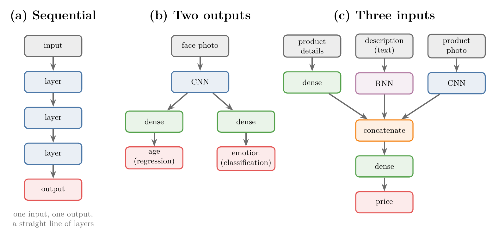
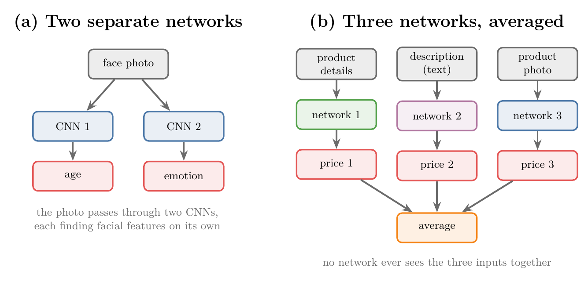
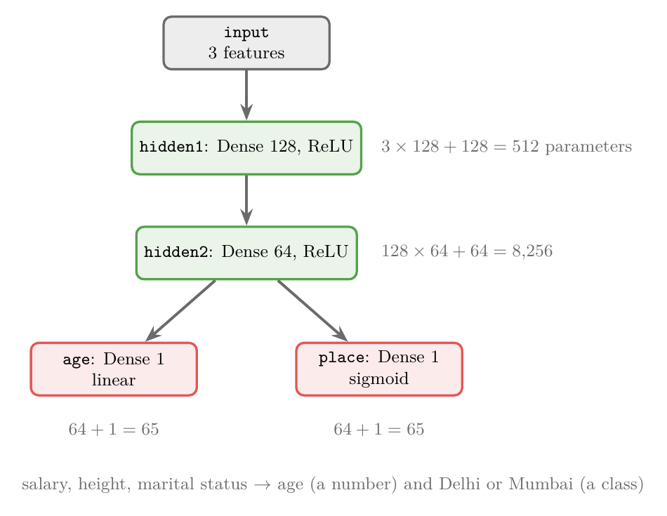
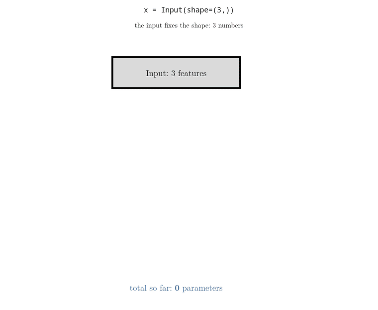
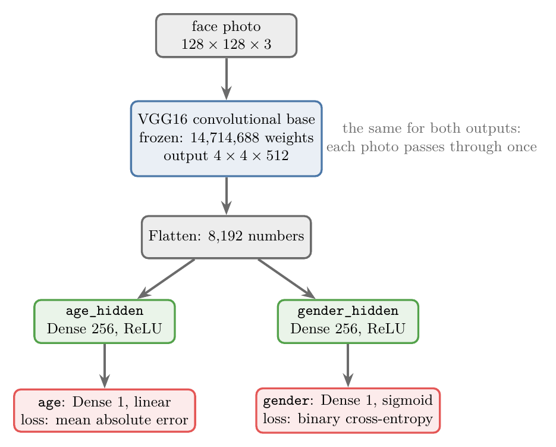
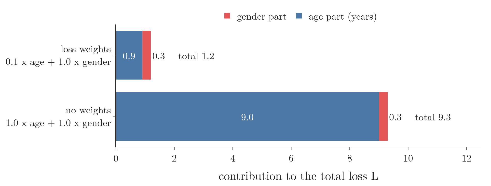
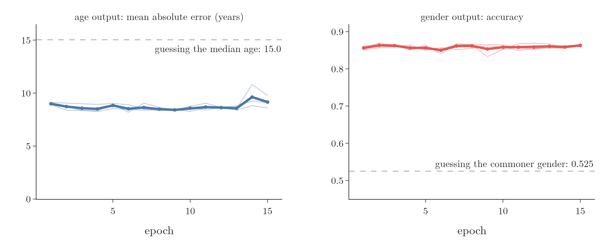

<!-- where-this-fits: generated by course_map/build_map.py; edit concepts.yaml, not this block -->
> **Where this fits:** Pipeline map step 8 (Model). See the [Course map](../../../00-course-map/00-course-map.md).
>
> 
>
> - **Builds on:** [Keras workflow](../../../DL/01-basics/DL-011-customer-churn-ann/DL-011-customer-churn-ann.md#4-building-a-network-in-keras); [Vanishing gradient](../../../DL/01-basics/DL-018-vanishing-exploding-gradients/DL-018-vanishing-exploding-gradients.md#3-the-vanishing-gradient-problem).
<!-- /where-this-fits -->

## 1. Overview

> **Key point:** Keras' `Sequential` model is a straight line of layers: one input, one output. The **functional API** connects layers like a graph: a model can have several inputs, several outputs, branches that split and join, and skip connections. Each layer is called on the output of the layer before it, and `keras.Model(inputs, outputs)` collects the graph into a model.

Every network in the deep learning Notes so far, ANN or CNN, was built with Keras' `Sequential` class, a **Sequential model** (G-1776). A Sequential model is a list of layers: data enters the first layer, passes through each layer in turn, and leaves the last. The Keras documentation calls it "appropriate for a plain stack of layers where each layer has exactly one input tensor and one output tensor" (Keras documentation, The Sequential model); Chollet describes it as "basically a Python list" and therefore "limited to simple stacks of layers" (Chollet and Watson 2025, ch. 7).

Many useful networks are not straight lines (Figure 1). The pattern of connections between a network's layers is its **topology** (G-1991). This Note introduces the **functional API** (G-818), the Keras way of building them: "The functional API can handle models with non-linear topology, shared layers, and even multiple inputs or outputs" (Keras documentation, The Functional API).

{width=100%}

This Note covers:

- when Sequential is not enough (section 3);
- how to build a functional model: two outputs, two inputs and a skip connection (section 4);
- a real model that predicts a person's age and gender from one face photo (section 5).

## 2. Prerequisites

- [Building a network in Keras](../../01-basics/DL-011-customer-churn-ann/DL-011-customer-churn-ann.md#4-building-a-network-in-keras) and [compiling and training](../../01-basics/DL-011-customer-churn-ann/DL-011-customer-churn-ann.md#5-compiling-and-training): a Keras `Sequential` model.
- [Mean absolute error](../../01-basics/DL-014-dl-loss-functions/DL-014-dl-loss-functions.md#6-mean-absolute-error) and [binary cross-entropy](../../01-basics/DL-014-dl-loss-functions/DL-014-dl-loss-functions.md#8-binary-cross-entropy).
- [Replacing the top and freezing the base](../DL-053-transfer-learning/DL-053-transfer-learning.md#42-replace-the-top-freeze-the-base): VGG16's frozen convolutional base with a new dense head.
- [Five ways to fix vanishing gradients](../../01-basics/DL-018-vanishing-exploding-gradients/DL-018-vanishing-exploding-gradients.md#65-residual-networks): residual blocks.

## 3. When a straight line is not enough

> **Key point:** Sequential assumes one input, one output and layers in a single line. Problems with several outputs or several kinds of input break that assumption.

A Sequential model rests on three assumptions:

1. it has exactly **one input**;
2. it has exactly **one output**;
3. its layers form a **single line**: each layer takes the output of the layer before it, and only that.

Two examples break them.

**Two outputs from one photo.** We have 25,000 face photos, and for each we want to predict two things: the person's age (a number, so **regression**, G-1655; [predicting a number](../../../ML/01-foundations/ML-003-types-of-ml/ML-003-types-of-ml.md#23-regression-and-classification)) and the emotion shown, such as happy, sad or angry (a class, so **classification**, G-395; predicting a category). We could train two separate networks, one per target (Figure 2a). A better design passes the photo through one CNN, which finds the facial features once, and then splits into two branches: one ends in an age, the other in an emotion (Figure 1b). A model that predicts several targets at once, each from its own output layer, is a **multi-output model** (G-1272).

**Three inputs for one output.** An online shop wants to predict the price of a product from three things: its details (a table of numbers such as size and weight), its text description and its photo. A naive approach trains three networks, one per input, and averages their three prices (Figure 2b). A better design gives each input the kind of layers that suits it, dense layers for the table, an RNN (recurrent neural network, a layer type for text; see [the idea behind an RNN](../../05-rnn/DL-055-why-rnn/DL-055-why-rnn.md#6-the-idea-behind-an-rnn)) for the text, a CNN for the photo, then **concatenates** the three results into one vector and predicts a single price from it (Figure 1c). A model that takes several inputs is a **multi-input model** (G-1269).

{width=100%}

In Figure 2b, each network guesses a price from one kind of input alone, and the average only mixes three separate guesses. In Figure 1c, the layers after `concatenate` see all three inputs at once, so they can learn how the inputs work together.

Neither network is a single line, so neither can be built with `Sequential`. The Keras guide lists exactly these cases: a Sequential model is not appropriate when the model has multiple inputs or multiple outputs, or when we want a non-linear topology, "e.g. a residual connection, a multi-branch model" (Keras documentation, The Sequential model). "The functional API makes it easy to manipulate multiple inputs and outputs. This cannot be handled with the Sequential API" (Keras documentation, The Functional API).

## 4. Building a functional model

> **Key point:** Create an `Input`, call each layer on the output of the layer it should receive from, and finally pass the inputs and outputs to `keras.Model`.

### 4.1 Two outputs from one input

> **Key point:** Three features in, two hidden layers, then a branch: one output for age (linear) and one for city (sigmoid).

Take a small table with three **features** (G-772; input variables, one per column): yearly salary, height and marital status. From them we want to predict two **targets** (G-1949; the outputs we predict) for each **observation** (G-1374; one person, one row of the table): the person's age, and whether the person lives in Delhi or Mumbai. The network has two hidden layers of 128 and 64 nodes, then branches into two output nodes (Figure 3).

{width=70%}

> **Python:** The model of Figure 3.
>
> ```python
> from keras import Model
> from keras.layers import Input, Dense
>
> x = Input(shape=(3,))                                   # 3 features
> hidden1 = Dense(128, activation="relu")(x)              # hidden1 receives x
> # hidden2 receives hidden1
> hidden2 = Dense(64, activation="relu")(hidden1)
> output1 = Dense(1, activation="linear", name="age")(hidden2)
> output2 = Dense(1, activation="sigmoid", name="place")(hidden2)
> model = Model(inputs=x, outputs=[output1, output2])
> model.summary()
> ```
>
> `Dense(128, activation="relu")` creates a layer of 128 nodes (`relu` keeps positive values and sets negative ones to 0); the second pair of brackets, `(x)`, calls it on `x` and returns its output. That call is the connection: it says where the layer's input comes from. `Model(inputs=..., outputs=...)` then collects every layer between the inputs and the outputs. With two outputs, `outputs` is a list.

The pattern is always the same: **create a layer, then call it on its input.** Figure 4 runs the code of Figure 3 line by line. Watch each call add one node and one edge to the graph, until `Model` collects them all.

{height=62%}

The age output uses a linear activation, because age is a number; the place output uses a **sigmoid** (G-1798), because it is a probability between 0 and 1 (Delhi = 0, Mumbai = 1); a sigmoid squashes any number into that range.

`model.summary()` shows a fourth column that a Sequential summary does not have: for each layer, the layer it is connected to. It reports 8,898 **parameters** (G-1065, learnable parameters; the weights and biases that training learns) in total (Notebook), the total that Figure 4 builds up. Each layer's count comes from the parameter count of a **dense layer** (G-583; every node connected to every input).

1. **In words:** every node has one weight per input plus one bias.
2. **Formula:**
   $$\text{parameters} = \text{inputs} \times \text{nodes} + \text{nodes}$$
3. **Example:** the four layers:
   $$\text{hidden1} = 3 \times 128 + 128 = 512$$
   $$\text{hidden2} = 128 \times 64 + 64 = 8{,}256$$
   $$\text{each output} = 64 \times 1 + 1 = 65$$
   $$\text{total} = 512 + 8{,}256 + 65 + 65 = 8{,}898$$

> **Extra:** Keras can draw a model as a graph:
>
> ```python
> import keras
> keras.utils.plot_model(model, "model.png", show_shapes=True)
> ```
>
> The option `show_shapes=True` adds each layer's input and output shapes (Keras documentation, The Functional API). The function needs the `pydot` package and the Graphviz program installed. The figures of this Note are drawn separately.

### 4.2 Two inputs, one output

> **Key point:** Two inputs each go through their own dense layers; a `Concatenate` layer joins the two results end to end; the joined vector continues to one output.

The second shape has two inputs: one of 32 numbers and one of 128. Each goes through its own small stack of dense layers, and the two results are joined (Figure 5a).

{width=95%}

The joining layer is `Concatenate` (G-71).

1. **In words:** concatenation places two vectors one after the other to make a longer vector. Nothing is added or multiplied. For example, joining $(1, 2)$ and $(3, 4, 5)$ gives $(1, 2, 3, 4, 5)$. The length is the sum of the two lengths:
   $$2 + 3 = 5$$
2. **Formula:** let the first vector have $m$ numbers $a_1, \dots, a_m$ and the second $n$ numbers $b_1, \dots, b_n$. Then:
   $$\text{concat}\big((a_1, \dots, a_m), (b_1, \dots, b_n)\big)$$
   $$= (a_1, \dots, a_m, b_1, \dots, b_n)$$
   The result has length $m + n$.
3. **Example:** $(0.2, 0.0, 1.3, 0.7)$ and $(0.5, 0.9, 0.0, 0.1)$ give $(0.2, 0.0, 1.3, 0.7, 0.5, 0.9, 0.0, 0.1)$: 8 numbers (Figure 6a).

{width=85%}

> **Python:** The model of Figure 5a.
>
> ```python
> from keras.layers import Concatenate
> input_a = Input(shape=(32,))
> input_b = Input(shape=(128,))
> a = Dense(8, activation="relu")(input_a)
> a = Dense(4, activation="relu")(a)
> b = Dense(64, activation="relu")(input_b)
> b = Dense(32, activation="relu")(b)
> b = Dense(4, activation="relu")(b)
> combined = Concatenate()([a, b])                        # 4 + 4 = 8 numbers
> z = Dense(2, activation="relu")(combined)
> z = Dense(1, activation="linear")(z)
> model2 = Model(inputs=[input_a, input_b], outputs=z)
> ```
>
> Reusing the names `a` and `b` is fine: each line takes the previous output and returns a new one. With two inputs, `inputs` is a list, and `predict` takes a list of two arrays, one per input.

The model has 10,789 parameters (Notebook). To predict, we pass both inputs together: `model2.predict([array_a, array_b])`.

### 4.3 A skip connection

> **Key point:** A skip connection adds a block's input to the block's output. The functional API expresses it with an `Add` layer that receives two tensors.

A **skip connection** (G-1681; also called a **residual connection**, G-1681) lets the input of a block jump over the block's layers and be added to their output (Figure 5b). The ResNet networks of [the ILSVRC winners](../DL-051-pretrained-models/DL-051-pretrained-models.md#52-the-results-year-by-year) are built from such blocks, and [residual networks](../../01-basics/DL-018-vanishing-exploding-gradients/DL-018-vanishing-exploding-gradients.md#65-residual-networks) explain why they help very deep networks train. "A common use case for this is residual connections" of models that are "not connected sequentially, which the Sequential API cannot handle" (Keras documentation, The Functional API).

> **Python:** A block of two convolutions with a skip connection.
>
> ```python
> from keras.layers import Conv2D, Add
> inputs = Input(shape=(32, 32, 16))
> y = Conv2D(16, 3, padding="same", activation="relu")(inputs)
> y = Conv2D(16, 3, padding="same")(y)
> # element by element: inputs + y
> outputs = Add()([inputs, y])
> block = Model(inputs, outputs)
> ```
>
> `Add` (G-59) adds its inputs element by element (Figure 6b), so they must have the same shape. `padding="same"` and 16 filters keep `y` at $32 \times 32 \times 16$, the shape of `inputs`.

The `Add` layer receives two tensors (grids of numbers), `inputs` and `y`: the input reaches it by two routes, which is not a single line. The block has two convolutions, each with 3 × 3 filters, 16 input channels, 16 filters and 16 biases, and all the parameters are in them (Notebook):

$$2 \times (3 \times 3 \times 16 \times 16 + 16)$$
$$2 \times 2{,}320 = 4{,}640$$

## 5. A real model: age and gender from one face photo

> **Key point:** One frozen VGG16 base reads the face; two dense branches predict age (mean absolute error) and gender (binary cross-entropy). It predicts age to within 9.2 years on average and gender with 86.3% accuracy, about as well as two separate models, while each photo passes through the 14.7-million-parameter base only once.

### 5.1 The data

> **Key point:** UTKFace: 23,705 usable face photos with the person's age (1 to 116) and gender in the file name.

UTKFace is a public dataset of over 20,000 face photos, with "annotations of age, gender, and ethnicity" and ages from 0 to 116 (Zhang et al. 2017; UTKFace dataset page). We use its aligned and cropped version, $200 \times 200$ pixels per face. The labels sit in each file name, `[age]_[gender]_[race]_[date&time].jpg`, with gender 0 for male and 1 for female. The dataset may be used for non-commercial research only, so this Note stores no face photos.

Of the 23,708 files, three lack a field in their name and are skipped. The remaining 23,705 photos have ages from 1 to 116, with a median of 29, and 47.7% of them show women (Notebook). We split them at random into 18,964 training photos (80%) and 4,741 test photos (20%), and resize each to $128 \times 128$.

The task has two **targets**: age, a number (regression), and gender, one of two classes (classification). It is the face example of section 3, with gender in place of emotion.

### 5.2 The model

> **Key point:** VGG16's frozen convolutional base, Flatten, then two branches of 256 nodes, one ending in a linear age output and one in a sigmoid gender output.

The model combines **transfer learning** (G-2005; [reusing a pretrained network](../DL-053-transfer-learning/DL-053-transfer-learning.md#4-how-it-works)) with section 4: **VGG16**'s (G-2088) convolutional base, frozen, reads the photo, and the network then branches into two heads (Figure 7).

{width=70%}

> **Python:** The age and gender model.
>
> ```python
> from keras.applications.vgg16 import VGG16
> from keras.layers import Flatten
> conv_base = VGG16(weights="imagenet", include_top=False,
>                   input_shape=(128, 128, 3))
> conv_base.trainable = False
>
> flat = Flatten()(conv_base.output)
> age_hidden = Dense(256, activation="relu")(flat)
> gender_hidden = Dense(256, activation="relu")(flat)
> age = Dense(1, activation="linear", name="age")(age_hidden)
> gender = Dense(1, activation="sigmoid", name="gender")(gender_hidden)
> model = Model(inputs=conv_base.input, outputs=[age, gender])
> ```
>
> `conv_base.input` and `conv_base.output` connect the pretrained base into the new graph: the model's input is VGG16's input, and Flatten is called on VGG16's output. The names `"age"` and `"gender"` are used below to give each output its own loss.

For a $128 \times 128$ photo the base outputs $4 \times 4 \times 512$, which a **flatten layer** (G-788) turns into 8,192 numbers. Each branch then has this many parameters:

$$(8{,}192 + 1) \times 256 + (256 + 1)$$

$$= 2{,}097{,}408 + 257$$

$$= 2{,}097{,}665$$

The whole model has 18,910,018 parameters, of which 4,195,330 (the two branches) are trainable and the 14,714,688 of the base are frozen (Notebook).

### 5.3 One loss per output

> **Key point:** Each output gets its own loss: mean absolute error for age, binary cross-entropy for gender. Training minimises their weighted sum.

A model with two outputs needs two losses, one per output. Keras lets us pass them as a dictionary keyed by the output names, together with **loss weights** (G-1131) that "modulate their contribution to the total training loss" (Keras documentation, The Functional API).

> **Python:** Compiling and training the two-output model.
>
> ```python
> model.compile(optimizer="adam",
>               loss={"age": "mae", "gender": "binary_crossentropy"},
>               loss_weights={"age": 0.1, "gender": 1.0},
>               metrics={"age": ["mae"], "gender": ["accuracy"]})
> model.fit(X_train, {"age": age_train, "gender": gender_train},
>           epochs=15, batch_size=64)
> ```
>
> The targets are passed as a dictionary with the same keys, so Keras knows which target belongs to which output.

1. **In words:** the total loss is each output's loss times its weight, added up (Figure 8). Age errors are measured in years, which are large numbers, while binary cross-entropy is usually below 1; a small weight on age keeps it from swamping the gender loss.
2. **Formula:**
   $$L = 0.1 \times L_{\text{age}} + 1.0 \times L_{\text{gender}}$$
3. **Example:** with an age error of 9 years and a gender loss of 0.30:
   $$L = 0.1 \times 9 + 1.0 \times 0.30$$
   $$L = 0.9 + 0.3$$
   $$L = 1.2$$
   Without the weight, age would contribute 9 of the 9.3.

{width=95%}

The **mean absolute error** (G-1194; MAE) is the average distance between predicted and true age, in years ([mean absolute error](../../01-basics/DL-014-dl-loss-functions/DL-014-dl-loss-functions.md#6-mean-absolute-error)). The gender output uses **binary cross-entropy** (G-303), the loss for a yes-or-no target with a sigmoid output.

> **Extra:** The base is frozen and the photos are not augmented, so the base turns each photo into the same 8,192 numbers in every epoch. The Notebook therefore runs every photo through the base once and trains only the two branches on the stored numbers. The model is the same; only the repeated work is skipped.

### 5.4 Results

> **Key point:** Both outputs learn at the same time. The two-output model matches two separate single-output models: a mean age error of about 9 years against 15 for guessing, and 86% gender accuracy against 53%.

To see whether one model with two outputs loses anything, we also trained two separate models with one branch each: one for age only, one for gender only. All three were trained for 15 epochs (full passes over the training photos) with three seeds and scored on the 4,741 test photos (Notebook):

| Model (mean of 3 seeds) | Age: mean absolute error | Gender: accuracy | Trainable parameters |
|---|---|---|---|
| One model, two outputs | 9.15 years (8.60–9.78) | 86.3% (86.3–86.3%) | 4,195,330 |
| Age only | 8.65 years (8.33–9.06) | – | 2,097,665 |
| Gender only | – | 85.9% (84.4–86.8%) | 2,097,665 |
| Guessing: the median training age; the commoner gender | 15.03 years | 52.5% | – |

{width=100%}

Both heads learn from the first epoch (Figure 9): after one epoch the age error is already 9.0 years and the gender accuracy 85.6%, far better than guessing (dashed lines). Later epochs change little: the mean age error moves between 8.4 and 9.6 years from epoch to epoch, and the gender accuracy between 85.0% and 86.3%. The two-output model does as well as the two separate models: its gender accuracy is slightly higher, its age error slightly higher too, and in both cases the ranges of the three seeds overlap.

The two branches in this model share no trainable layer, only the frozen base, so each head learns its own target much as a separate model would; the results agree with that. What the single model saves is the base: one photo passes once through VGG16's 14.7 million convolution weights and gives both answers. Two separate models would each need their own copy of the base and their own pass through it:

$$2 \times (14{,}714{,}688 + 2{,}097{,}665)$$

$$= 33{,}624{,}706 \text{ parameters}$$

The one model has 18,910,018.

## 6. Summary

| Shape | Keras building block | Example in this Note |
|---|---|---|
| One input, one output, a straight line | `Sequential` | every earlier Note |
| Several outputs | one layer feeding several output layers | salary, height, marital status to age and city; face to age and gender |
| Several inputs | several `Input`s joined by `Concatenate` | two inputs of 32 and 128 numbers |
| A skip connection | `Add` of a block's input and output | two convolutions with the input added back |

- The functional API builds a model as a graph: create a layer, call it on its input, then `Model(inputs, outputs)`, so it can build several inputs, several outputs, branches and skip connections, which a `Sequential` line of layers cannot.
- Multi-output models take one loss per output, combined with loss weights, because age and gender need different losses, and a small weight on age keeps its large errors in years from swamping the gender loss.
- On 23,705 face photos, one VGG16-based model predicted age (mean error 9.2 years) and gender (86.3%) as well as two separate models, with one pass through the base, so one model saves a second copy of the 14.7-million-parameter base.

## 7. Sources

**Built from**

- CampusX, "Keras Functional Model | How to build non-linear Neural Networks?", YouTube, https://www.youtube.com/watch?v=OvQQP1QVru8

**Other references**

- Keras documentation: The Sequential model (keras.io/guides/sequential_model): when a Sequential model is and is not appropriate.
- Keras documentation: The Functional API (keras.io/guides/functional_api): non-linear topology, shared layers, multiple inputs and outputs; a model as a directed acyclic graph of layers; `plot_model`; different losses and loss weights per output; residual connections.
- Chollet, F. and Watson, M. (2025). *Deep Learning with Python*, 3rd ed. Manning. Ch. 7 (the Sequential model "limited to simple stacks of layers"; the functional API for multiple inputs, multiple outputs or a nonlinear topology).
- Zhang, Z., Song, Y. and Qi, H. (2017). Age Progression/Regression by Conditional Adversarial Autoencoder. *CVPR 2017*. arXiv:1702.08423. (The UTKFace dataset.)
- UTKFace dataset page, susanqq.github.io/UTKFace: over 20,000 face photos, ages 0 to 116, labels in the file name (gender 0 = male, 1 = female); non-commercial research use only.
- Simonyan, K. and Zisserman, A. (2015). Very Deep Convolutional Networks for Large-Scale Image Recognition. *ICLR 2015*. arXiv:1409.1556. (VGG16.)
- He, K., Zhang, X., Ren, S. and Sun, J. (2016). Deep Residual Learning for Image Recognition. *CVPR 2016*. arXiv:1512.03385. (Residual blocks: the input added to the block's output.)

## 8. Key terms

Terms taught in this Note come first; linked terms are recaps, taught in the Note the link opens.

| Term | Meaning |
|---|---|
| Topology (G-1991) | The pattern of connections between a network's layers. |
| Functional API (G-818) | The Keras way of building a model as a graph of layers, by calling each layer on the output of the one before; unlike a Sequential model it allows several inputs or outputs, branches and skip connections. |
| Multi-output model (G-1272) | A model that predicts several targets at once, each from its own output layer. |
| Multi-input model (G-1269) | A model that takes several inputs, such as a photo and a table. |
| `Concatenate` (G-71) | A layer that joins vectors end to end into one longer vector. |
| `Add` (G-59) | A layer that adds tensors of the same shape element by element. |
| Loss weight (G-1131) | A number that scales one output's loss in the total loss of a multi-output model. |
| `Input` (`keras.Input`) (G-97) | The Keras object that stands for a model's input and fixes the shape of one input row. |
| [Sequential model](../../../DL/01-basics/DL-011-customer-churn-ann/DL-011-customer-churn-ann.md#4-building-a-network-in-keras) (G-1776) | A Keras model whose layers form one stack, each feeding the next. |
| [Regression](../../../ML/01-foundations/ML-003-types-of-ml/ML-003-types-of-ml.md#23-regression-and-classification) (G-1655) | Supervised learning with a numerical output. |
| [Classification](../../../ML/01-foundations/ML-003-types-of-ml/ML-003-types-of-ml.md#23-regression-and-classification) (G-395) | Predicting which of a fixed set of categories (classes) a row belongs to, learned from examples whose answers are known (supervised learning with a categorical output). |
| [Feature](../../../ML/01-foundations/ML-002-ai-vs-ml-vs-dl/ML-002-ai-vs-ml-vs-dl.md#52-features-chosen-by-us-or-learned) (G-772) | One piece of information about each example that a model uses (e.g. a student's CGPA). |
| [Target](../../../ML/01-foundations/ML-003-types-of-ml/ML-003-types-of-ml.md#21-learning-from-inputs-and-outputs) (G-1949) | The output column we predict, such as the class; also called the label. |
| [Observation](../../../ML/01-foundations/ML-003-types-of-ml/ML-003-types-of-ml.md#21-learning-from-inputs-and-outputs) (G-1374) | One record of a dataset: one row of the data table. |
| [Sigmoid function](../../../ML/07-classification/ML-071-sigmoid-function/ML-071-sigmoid-function.md#4-the-sigmoid-function) (G-1798) | An S-shaped function that squashes any number into the range 0 to 1, $\sigma(z) = 1/(1 + e^{-z})$; it turns a score into a probability, as in logistic regression. |
| [Learnable (trainable) parameters](../../../DL/04-cnn/DL-046-cnn-vs-ann/DL-046-cnn-vs-ann.md#51-counting-the-parameters-of-a-convolution-layer) (G-1065) | The weights and biases that training changes; for a convolution layer, the filter values and one bias per filter. |
| [Dense (fully connected) layer](../../../DL/01-basics/DL-011-customer-churn-ann/DL-011-customer-churn-ann.md#41-the-first-architecture) (G-583) | A layer whose every node receives the output of every node in the layer before. |
| [Residual connection](../../../DL/06-transformers/DL-081-transformer-encoder/DL-081-transformer-encoder.md#1-overview) (G-1681) | A path that skips a sub-layer and adds the sub-layer's input to its output; also called a skip connection. |
| [Transfer learning](../../../DL/01-basics/DL-002-what-is-deep-learning/DL-002-what-is-deep-learning.md#54-architectures-and-transfer-learning) (G-2005) | Reusing a network trained by others on a big dataset for our own problem. |
| [VGG16](../../../DL/04-cnn/DL-052-visualizing-cnn/DL-052-visualizing-cnn.md#4-the-network-vgg16) (G-2088) | An image-recognition network (a CNN) of 13 convolution layers (all 3 × 3) in 5 blocks plus 3 dense layers, trained on ImageNet. |
| [Flatten layer](../../../DL/01-basics/DL-012-mnist-ann/DL-012-mnist-ann.md#41-flatten-from-an-image-to-a-row) (G-788) | A layer that reshapes a multi-dimensional input into one dimension; no parameters. |
| [Mean absolute error (MAE)](../../../ML/06-regression/ML-051-regression-metrics/ML-051-regression-metrics.md#2-mean-absolute-error-mae) (G-1194) | The average absolute difference between actual and predicted values. |
| [Binary cross entropy (log loss)](../../../ML/07-classification/ML-072-log-loss/ML-072-log-loss.md#62-the-loss-function) (G-303) | The loss function of logistic regression for two classes: per row $-y\log a - (1 - y)\log(1 - a)$, averaged over the rows (the average cross entropy). |
