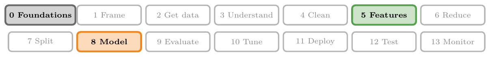
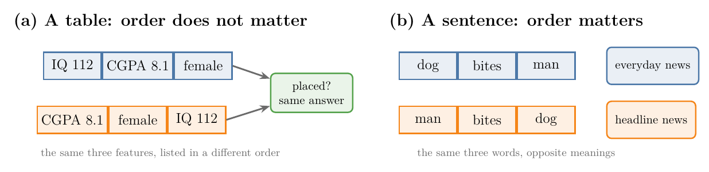
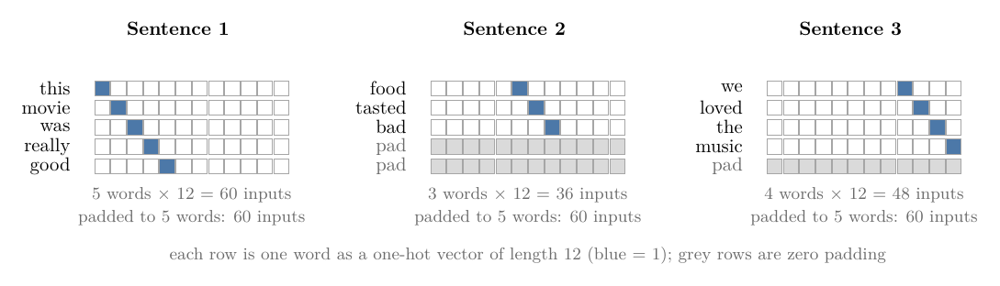
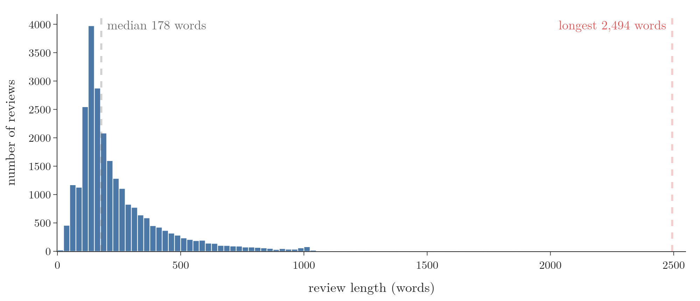
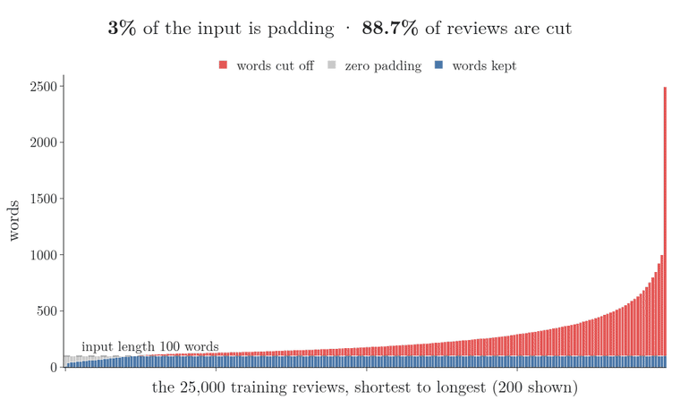
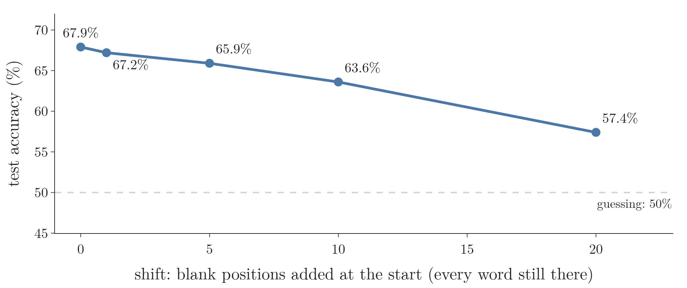
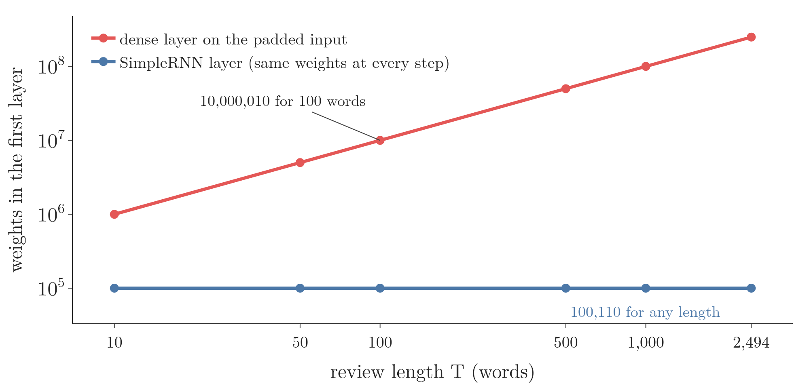

<!-- where-this-fits: generated by course_map/build_map.py; edit concepts.yaml, not this block -->
> **Where this fits:** Pipeline map steps 0 (Foundations), 5 (Engineer features), 8 (Model). See the [Course map](../../../00-course-map/00-course-map.md).
>
> 
>
> - **Builds on:** Forward propagation ([Note DL-010](../../../DL/01-basics/DL-010-forward-propagation/DL-010-forward-propagation.md)); Exploding gradient and gradient clipping ([Note DL-018](../../../DL/01-basics/DL-018-vanishing-exploding-gradients/DL-018-vanishing-exploding-gradients.md)); Tanh ([Note DL-027](../../../DL/02-training/DL-027-activation-functions/DL-027-activation-functions.md)); Parameter sharing across time steps ([Note DL-056](../../../DL/05-rnn/DL-056-rnn-forward-propagation/DL-056-rnn-forward-propagation.md)); Tokenization and integer encoding of text ([Note DL-057](../../../DL/05-rnn/DL-057-rnn-sentiment-analysis/DL-057-rnn-sentiment-analysis.md)); Word embeddings ([Note DL-057](../../../DL/05-rnn/DL-057-rnn-sentiment-analysis/DL-057-rnn-sentiment-analysis.md)).
> - **Leads to:** Types of RNN (many-to-one, one-to-many, many-to-many) ([Note DL-058](../../../DL/05-rnn/DL-058-types-of-rnn/DL-058-types-of-rnn.md)); LSTM (long short-term memory) ([Note DL-061](../../../DL/05-rnn/DL-061-lstm/DL-061-lstm.md)); GRU (gated recurrent unit) ([Note DL-064](../../../DL/05-rnn/DL-064-gru/DL-064-gru.md)); Deep (stacked) RNNs ([Note DL-065](../../../DL/05-rnn/DL-065-deep-rnns/DL-065-deep-rnns.md)); Bidirectional RNNs ([Note DL-066](../../../DL/05-rnn/DL-066-bidirectional-rnn/DL-066-bidirectional-rnn.md)).
> - **Compare with:** Multi-layer perceptron (MLP) ([Note DL-009](../../../DL/01-basics/DL-009-mlp-intuition/DL-009-mlp-intuition.md)).
<!-- /where-this-fits -->

## 1. Overview

> **Key point:** Some data comes as a **sequence**, where the order of the items carries meaning: words in a sentence, prices over time, sound over time. An ordinary neural network (ANN) handles sequences badly. Text comes in different lengths, padding it to one length wastes most of the network, and the network has to learn every pattern separately at every position. A **recurrent neural network** (RNN) reads a sequence one item at a time with the same weights and carries a memory forward.

So far the deep learning Notes have used one kind of network: the **artificial neural network** (G-216; ANN), or **multi-layer perceptron** (G-1270), from the [MLP intuition Note](../../01-basics/DL-009-mlp-intuition/DL-009-mlp-intuition.md). An ANN works well on tabular data, where each **observation** (G-1374; one record of the data, one row of the table) is a fixed list of **features** (G-772; input variables, one per column). A **convolutional neural network** (G-484; CNN) is built for data laid out on a grid, such as images.

This Note introduces a third family. A **recurrent neural network** (G-1647; RNN) is a neural network specialised for **sequential data** (G-1774): data that is a sequence of values $x^{(1)}, x^{(2)}, \dots, x^{(\tau)}$ whose order matters (Goodfellow et al., ch. 10). This Note covers:

- what makes data sequential (section 3);
- how an ANN would have to take text, and the four problems that causes (sections 4 and 5);
- the idea an RNN uses instead (section 6);
- where RNNs are used (section 7).

The RNN itself, its formula and its code come in the next Note.

## 2. Prerequisites

- [MLP intuition Note](../../01-basics/DL-009-mlp-intuition/DL-009-mlp-intuition.md): layers of nodes, weights and biases.
- [Forward propagation Note](../../01-basics/DL-010-forward-propagation/DL-010-forward-propagation.md): how many weights a fully connected layer has.
- [One-hot encoding Note](../../../ML/03-feature-engineering/ML-026-one-hot-encoding/ML-026-one-hot-encoding.md): turning a category into a vector of 0s with a single 1.
- [Vectors and feature vectors Note](../../../MA/05-linear-algebra/MA-048-vectors-and-feature-vectors/MA-048-vectors-and-feature-vectors.md), section 4.2: bag of words.

## 3. Sequential data

> **Key point:** Data is sequential when changing the order of its items changes its meaning.

Take the placement problem of earlier Notes: predict whether a student is placed from three features, IQ, CGPA and gender. If we list the same three features in a different order, the student has not changed, and a network trained on that order gives the same answer (Figure 1, left). Tabular data like this is **non-sequential** (G-1340): the order of the features carries no information.

A sentence is different. "Dog bites man" and "man bites dog" use the same three words, but they mean opposite things (Figure 1, right). When we read, we take the words one by one and keep in mind what came before. Data like this is **sequential**.

{width=100%}

Sequential data is everywhere:

- **Text:** words follow each other, and grammar depends on the order.
- **Time series:** a company's share price day by day; where it goes next depends on where it has been.
- **Speech and audio:** a sound wave is a sequence of air-pressure values over time.
- **DNA:** a sequence of the bases A, C, G and T.

Sequences also come in **different lengths**. Take a **time series** (G-1975; measurements taken over time): to predict next week's share price, we may have 9 weeks of prices for one share and only 5 for another. A network built for exactly 9 inputs has no place for the shorter series (Figure 2). Section 5.1 meets the same problem with text.

{width=100%}

In Figure 2, watch the bottom row: the boxes are the network's inputs, and their number cannot change from one series to the next.

RNNs are an old idea: they go back to the 1980s (Rumelhart et al. 1986, cited in Goodfellow et al., ch. 10). They became widely used once enough data and computing power were available, as for deep learning in general (the [what is deep learning Note](../../01-basics/DL-002-what-is-deep-learning/DL-002-what-is-deep-learning.md)).

## 4. Feeding text to an ANN

> **Key point:** To give a sentence to an ANN, we turn each word into a one-hot vector and stack the vectors into one long input. The input size is (number of words) × (vocabulary size).

Suppose we want a model that reads a short review and predicts its sentiment: 1 for positive, 0 for negative. We have three training reviews:

| Review | Words | Sentiment |
|---|---|---|
| this movie was really good | 5 | 1 |
| food tasted bad | 3 | 0 |
| we loved the music | 4 | 1 |

A network works with numbers, not words, so the first step is to turn words into vectors. The simplest way is **one-hot encoding** (G-1379; the [one-hot encoding Note](../../../ML/03-feature-engineering/ML-026-one-hot-encoding/ML-026-one-hot-encoding.md)): list every distinct word in the training data (the **vocabulary**, G-2092), then write each word as a vector of 0s with a 1 at that word's place in the list. Our three reviews use 12 distinct words, so each word becomes a vector of length 12.

To give a whole review to an ANN, we stack its word vectors one after another into one long input vector (Figure 3):

1. **In words:** the input size is the number of words times the vocabulary size. A **fully connected layer** (G-583) then has one weight per input per node.
2. **Formula:** with $T$ words, a vocabulary of $V$ words and $h$ hidden nodes,
   $$\text{inputs} = T \times V, \qquad \text{weights} = T \times V \times h$$
3. **Example:** review 1 has $T = 5$ and $V = 12$:
   $$5 \times 12 = 60 \text{ inputs}$$
   With $h = 4$ hidden nodes the first layer has:
   $$60 \times 4 = 240 \text{ weights}$$

{width=100%}

So far, so good for review 1. The trouble starts with the other two reviews.

## 5. Four problems with an ANN on text

> **Key point:** Reviews have different lengths; padding them to one length wastes most of the input; a review longer than the padding cannot be read in full; and the ANN must learn the meaning of a word separately at every position.

### 5.1 Different lengths

> **Key point:** An ANN needs the same input size for every observation, but sentences have different lengths.

Review 2 has 3 words:

$$3 \times 12 = 36 \text{ inputs}$$

Review 3 has 4 words:

$$4 \times 12 = 48 \text{ inputs}$$

The network built for review 1 expects exactly 60. An ANN's input layer has a fixed size, chosen when the network is built, so it cannot take 36 inputs one time and 48 the next.

Real text varies far more than our three reviews. The **IMDB dataset** (G-923) holds 50,000 film reviews labelled positive or negative (Maas et al. 2011; available in Keras). Among its 25,000 training reviews, the shortest has 11 words, the median 178 words and the longest 2,494 words (Figure 4).

{width=100%}

> **Python:** Loading IMDB and measuring the review lengths.
>
> ```python
> import numpy as np, keras
> (X_train, y_train), (X_test, y_test) = keras.datasets.imdb.load_data(num_words=10000)
> lengths = np.array([len(review) for review in X_train])
> lengths.min(), np.median(lengths), lengths.max()   # 11, 178.0, 2494
> ```
>
> Each review comes already turned into a list of word numbers; `num_words=10000` keeps the 10,000 most common words.

### 5.2 Zero padding wastes most of the network

> **Key point:** Padding every review with zero vectors up to the longest one fixes the size, but most of the input is then zeros, and the number of weights explodes.

The usual workaround is **zero padding** (G-1436, padding): find the longest review and fill every shorter review with all-zero word vectors until it has the same length. In Figure 3, reviews 2 and 3 get 2 and 1 rows of padding, so every review has 60 inputs.

Padding works, but it is expensive. Figure 5 shows the trade-off on the 25,000 training reviews. Watch the grey padding grow as the chosen length rises, while the red part, the words that are cut off, shrinks.



The two ends of Figure 5 are the two costs:

- **Mostly zeros.** If we pad every IMDB review to the longest one, 2,494 words, then on average 90% of each input is padding.
- **Huge layers.** Suppose we cut every review to 100 words and use the 10,000 most common words. Each review becomes one million inputs:
  $$100 \times 10{,}000 = 1{,}000{,}000$$
  A first layer with only 10 nodes then needs 10 million weights:
  $$1{,}000{,}000 \times 10 = 10{,}000{,}000$$
  Keras counts 10,000,010 with the biases.

Most of those weights only ever multiply zeros: wasted memory and wasted computation.

### 5.3 A longer input at prediction time

> **Key point:** The padded length is fixed when we build the network. A longer text at prediction time has to be cut, and the cut-off words are lost.

Padding to the longest review would make the network enormous, so in practice we pick a maximum length, for example 500 words, and cut longer reviews. The network then never sees the end of those reviews. Among the 25,000 IMDB test reviews, 7.7% are longer than 500 words (8.4% of the training reviews: the red bars in the 500-word frame of Figure 5). For those reviews, the part after word 500 cannot reach the network at all, however important it is.

### 5.4 Every position must be learned separately

> **Key point:** In an ANN, each input position has its own weights. A pattern learned at one position does not carry over to another, so the network has to learn the language separately at every position.

Goodfellow et al. (ch. 10) give an example. Take the two sentences "I went to Nepal in 2009" and "In 2009, I went to Nepal". If a model must find the year of the trip, it should recognise 2009 whether it is the sixth word or the second. In a fully connected network, the sixth word and the second word arrive through different inputs with different weights. So the network "would need to learn all the rules of the language separately at each position in the sentence" (Goodfellow et al., p. 367).

An analogy: imagine a reader who learned what "excellent" means only when it is the third word of a review. To understand it as the fifth word, the reader has to learn it all over again.

We can see the effect on the IMDB data. We train a small ANN on the first 50 words of each of the 25,000 training reviews (one-hot over the 1,000 most common words, one hidden layer of 16 nodes). Then we test it on the 25,000 test reviews, first as they are, then pushed a few places to the right by blank positions at the start. Every word is still there; only its position has changed.

| Shift (positions) | 0 | 1 | 5 | 10 | 20 |
|---|---|---|---|---|---|
| Test accuracy | 67.9% | 67.2% | 65.9% | 63.6% | 57.4% |

{width=90%}

The words are the same, yet accuracy falls steadily as they move (Figure 6): from 67.9% to 57.4% after a shift of 20 positions, where 50% is guessing. The network had tied what it learned to particular positions, exactly as Goodfellow et al. describe. (The 68% at shift 0 is modest because this small ANN sees only the first 50 words and a 1,000-word vocabulary; the drop, not the level, is the point. Averaged over 3 seeds; Notebook section 5.)

> **Extra:** Bag of words (the [vectors and feature vectors Note](../../../MA/05-linear-algebra/MA-048-vectors-and-feature-vectors/MA-048-vectors-and-feature-vectors.md), section 4.2) avoids the length problem by counting each word instead of placing it, so every text becomes one vector of length $V$. The price is that the order is gone completely: "dog bites man" and "man bites dog" give exactly the same count vector, $(1, 1, 1)$ for (bites, dog, man). Bag of words throws away exactly what makes the data sequential.

## 6. The idea behind an RNN

> **Key point:** An RNN reads one item at a time and reuses the same weights at every step. It carries a summary of what it has read so far, so its size does not depend on the length of the sequence.

The four problems share one cause: an ANN reads the whole sequence at once, through a separate set of weights for each position. An RNN is still an ordinary network, with weights, biases, layers and activations. It adds one thing: a **feedback loop**, a connection that sends the hidden layer's output back into the same layer for the next item. The hidden layer with this loop is the **recurrent layer** (G-1646). The loop changes three things:

- **One item at a time.** It reads word 1, then word 2, then word 3, in order.
- **The same weights at every step.** The weights that process word 2 are the ones that process word 50. This **parameter sharing** (G-1447) is what lets a model handle sequences of any length and recognise a pattern wherever it appears (Goodfellow et al., ch. 10).
- **A memory.** After each word, the RNN updates an internal state, a short summary of everything it has read so far, and passes it on to the next step. This state is the **hidden state** (G-891).

{width=100%}

In Figure 7, watch the weights each word meets: in the ANN they change with the word's position, in the RNN they are always the same cell.

Because the weights are shared across steps, an RNN's size does not grow with the length of the text. With the same 10,000-word vocabulary and 10 nodes, a Keras `SimpleRNN` layer has 100,110 weights, whether the review has 10 words or 2,494. The padded ANN layer of section 5.2 needed 10,000,010 for 100 words: 100 times more. Figure 8 shows how the gap grows with the length of the review.

{width=90%}

> **Python:** Counting the weights of the two layers.
>
> ```python
> dense = keras.Sequential([keras.Input(shape=(100 * 10000,)), keras.layers.Dense(10)])
> rnn = keras.Sequential([keras.Input(shape=(None, 10000)), keras.layers.SimpleRNN(10)])
> dense.count_params(), rnn.count_params()   # 10000010, 100110
> ```
>
> `shape=(None, 10000)` means "any number of steps, 10,000 numbers per step": the RNN accepts every length.

How the memory is computed, and where the number 100,110 comes from, is the subject of the next Note.

## 7. Where RNNs are used

> **Key point:** RNNs and their descendants power sentiment analysis, next-word suggestions, image captions, translation, speech recognition and forecasting.

- **Sentiment analysis** (G-1769): reading a review and deciding whether it is positive or negative. An online shop can score thousands of product reviews this way. The IMDB data of section 5 was built for exactly this task (Maas et al. 2011).
- **Next-word suggestions:** when we type in Gmail, Smart Compose suggests how the sentence continues, using a neural language model that reads the words typed so far (Chen et al. 2019). Phone keyboards suggest the next word in the same spirit.
- **Image captions:** a CNN reads a photo and an **LSTM** (G-1123), a kind of RNN, writes a sentence describing it (Vinyals et al. 2015). Such a model could describe the surroundings to a person who cannot see them.
- **Machine translation:** an LSTM reads a sentence in one language and another LSTM writes it in another (Sutskever et al. 2014).
- **Speech recognition:** deep RNNs turn a sound wave into text (Graves et al. 2013).
- **Time series** (G-1975) **forecasting:** predicting the next values of a series, such as sales or electricity demand (Hewamalage et al. 2021).

Question-answering systems, which read a paragraph and answer questions about it, now mostly use **transformers** (G-2007) such as BERT (Devlin et al. 2019) instead of RNNs. Transformers grew out of the RNN line of work and come at the end of the deep learning Notes.

The next Notes build up the RNN family step by step: the simple RNN, the types of RNN, backpropagation through time, the vanishing-gradient problem in RNNs, then LSTM and GRU, deep RNNs and bidirectional RNNs.

## 8. Summary

| Problem with an ANN on text | Why | What an RNN does instead |
|---|---|---|
| Different lengths | the input layer has a fixed size | reads one word per step, any number of steps |
| Padding is wasteful | most inputs are zeros; 10 million weights for 100 words | 100,110 weights for any length |
| Longer text at prediction | words beyond the padded length are cut | reads to the end |
| Each position learned separately | separate weights per position | the same weights at every step |

- Sequential data is data where order carries meaning: text, time series, speech, DNA.
- An ANN needs one fixed-length input, so text must be one-hot encoded, stacked and padded.
- The cost: IMDB reviews run from 11 to 2,494 words; padding to the longest makes 90% of the input zeros.
- An RNN reads one item at a time, shares its weights across steps and carries a memory forward.

## 9. Sources

**Built from**

- CampusX, "Why RNNs are needed | RNNs Vs ANNs | RNN Part 1", YouTube, https://www.youtube.com/watch?v=4KpRP-YUw6c
- StatQuest with Josh Starmer, "Recurrent Neural Networks (RNNs), Clearly Explained!!!", YouTube, https://www.youtube.com/watch?v=AsNTP8Kwu80. 02:00–04:30 (share prices as sequences of different lengths; an RNN as a network with a feedback loop).

**Other references**

- Goodfellow, I., Bengio, Y. and Courville, A. (2016). *Deep Learning*. MIT Press. Chapter 10, introduction (p. 367): RNNs as networks for sequences, parameter sharing, the Nepal example.
- Maas, A. L., Daly, R. E., Pham, P. T., Huang, D., Ng, A. Y. and Potts, C. (2011). Learning Word Vectors for Sentiment Analysis. *ACL 2011*. The IMDB review dataset.
- Rumelhart, D. E., Hinton, G. E. and Williams, R. J. (1986). Learning representations by back-propagating errors. *Nature* 323, 533–536.
- Chen, M. X. et al. (2019). Gmail Smart Compose: Real-Time Assisted Writing. *KDD 2019*. arXiv:1906.00080.
- Vinyals, O., Toshev, A., Bengio, S. and Erhan, D. (2015). Show and Tell: A Neural Image Caption Generator. *CVPR 2015*.
- Sutskever, I., Vinyals, O. and Le, Q. V. (2014). Sequence to Sequence Learning with Neural Networks. *NeurIPS 2014*.
- Graves, A., Mohamed, A. and Hinton, G. (2013). Speech Recognition with Deep Recurrent Neural Networks. *ICASSP 2013*.
- Hewamalage, H., Bergmeir, C. and Bandara, K. (2021). Recurrent Neural Networks for Time Series Forecasting: Current status and future directions. *International Journal of Forecasting* 37(1), 388–427.
- Devlin, J., Chang, M.-W., Lee, K. and Toutanova, K. (2019). BERT: Pre-training of Deep Bidirectional Transformers for Language Understanding. *NAACL 2019*.
- Keras documentation: `keras.datasets.imdb`, `SimpleRNN`. keras.io/api.

## 10. Key terms

| Term | Meaning |
|---|---|
| Sequential data | Data whose items come in an order that carries meaning, such as words in a sentence or prices over time |
| Non-sequential data | Data whose features can be listed in any order without changing the meaning, such as a table row |
| Recurrent neural network (RNN) | A neural network that reads a sequence one item at a time, with the same weights at every step, and carries a memory forward |
| Vocabulary (G-2092) | The list of distinct words a text model knows |
| Zero padding (text) | Adding all-zero word vectors to shorter texts so that every text has the same length |
| Recurrent layer | A hidden layer whose output at one step is an input to itself at the next (the feedback loop) |
| Parameter sharing | Using the same weights at different positions or time steps |
| Time series | A sequence of measurements taken over time |
| IMDB dataset | 50,000 film reviews labelled positive or negative, a standard sentiment-analysis dataset |
