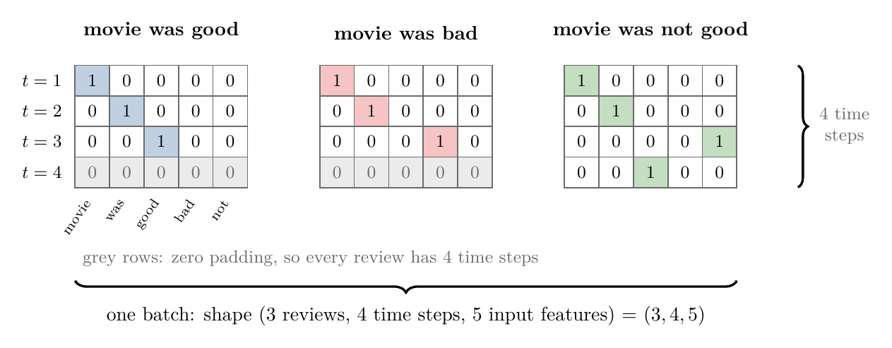

<!-- where-this-fits: generated by course_map/build_map.py; edit concepts.yaml, not this block -->
> **Where this fits:** Pipeline map step 8 (Model). See the [Course map](../../../00-course-map/00-course-map.md).
>
> 
>
> - **Builds on:** [Forward propagation](../../../DL/01-basics/DL-010-forward-propagation/DL-010-forward-propagation.md#1-overview); [Exploding gradient and gradient clipping](../../../DL/01-basics/DL-018-vanishing-exploding-gradients/DL-018-vanishing-exploding-gradients.md#7-the-exploding-gradient-problem); [Tanh](../../../DL/02-training/DL-027-activation-functions/DL-027-activation-functions.md#7-tanh); [Sequential data](../../../DL/05-rnn/DL-055-why-rnn/DL-055-why-rnn.md#3-sequential-data); [Sequence padding](../../../DL/05-rnn/DL-055-why-rnn/DL-055-why-rnn.md#1-overview); [Tokenization and integer encoding of text](../../../DL/05-rnn/DL-057-rnn-sentiment-analysis/DL-057-rnn-sentiment-analysis.md#32-tokenizing-in-keras).
> - **Leads to:** [Types of RNN (many-to-one, one-to-many, many-to-many)](../../../DL/05-rnn/DL-058-types-of-rnn/DL-058-types-of-rnn.md#6-one-to-one); [Backpropagation through time (BPTT)](../../../DL/05-rnn/DL-059-backpropagation-through-time/DL-059-backpropagation-through-time.md#1-overview); [LSTM (long short-term memory)](../../../DL/05-rnn/DL-061-lstm/DL-061-lstm.md#7-two-differences-between-an-rnn-and-an-lstm); [GRU (gated recurrent unit)](../../../DL/05-rnn/DL-064-gru/DL-064-gru.md#1-overview); [Deep (stacked) RNNs](../../../DL/05-rnn/DL-065-deep-rnns/DL-065-deep-rnns.md#4-the-architecture-of-a-deep-rnn); [Bidirectional RNNs](../../../DL/05-rnn/DL-066-bidirectional-rnn/DL-066-bidirectional-rnn.md#4-how-a-bidirectional-rnn-works).
> - **Compare with:** [Multi-layer perceptron (MLP)](../../../DL/01-basics/DL-009-mlp-intuition/DL-009-mlp-intuition.md#1-overview).
<!-- /where-this-fits -->

## 1. Overview

> **Key point:** A recurrent neural network (RNN) reads a sequence one element at a time. Its hidden layer sends its own output back to itself, so at every time step it combines the new input with a summary of everything read so far.

A **recurrent neural network** (G-1647; RNN) is a class of neural networks with a memory: it remembers past inputs, which makes it work well on sequential data. [Why an ordinary network handles sequences badly](../DL-055-why-rnn/DL-055-why-rnn.md#5-four-problems-with-an-ann-on-text) was explained earlier, with [the idea an RNN uses instead](../DL-055-why-rnn/DL-055-why-rnn.md#6-the-idea-behind-an-rnn). This Note opens the box: what an RNN looks like, how many parameters it has, and how it turns a sequence into a prediction.

{width=100%}

Figure 1 shows the whole idea. The three purple boxes are not three layers: they are the same layer, with the same weights, used again at each time step.

## 2. Prerequisites

- [Sequential data](../DL-055-why-rnn/DL-055-why-rnn.md#3-sequential-data), and [why an ANN struggles with it](../DL-055-why-rnn/DL-055-why-rnn.md#5-four-problems-with-an-ann-on-text).
- [What one node computes](../../01-basics/DL-010-forward-propagation/DL-010-forward-propagation.md#3-what-one-node-computes): a layer computes a weighted sum, adds a bias and applies an activation.
- [One-hot encoding](../../../ML/03-feature-engineering/ML-026-one-hot-encoding/ML-026-one-hot-encoding.md#22-one-column-per-category): a category becomes a vector (a list of numbers) with a single 1.
- [Tensors and their shapes](../../../ML/01-foundations/ML-010-tensors/ML-010-tensors.md#4-rank-axes-shape-and-size): shapes such as $(3, 4, 5)$, a grid with 3 layers of 4 rows and 5 columns.
- [Tanh](../../02-training/DL-027-activation-functions/DL-027-activation-functions.md#7-tanh) and [sigmoid](../../02-training/DL-027-activation-functions/DL-027-activation-functions.md#6-sigmoid): activation functions that squeeze a number into -1 to 1 and 0 to 1.

## 3. The shape of the input

> **Key point:** An RNN takes each **observation** (one review) as a table of shape (time steps, input features): one row per word, one number per feature. Keras takes a batch of them as a 3D tensor of shape (batch size, time steps, input features).

### 3.1 Words become vectors

> **Key point:** A network needs numbers, so each word becomes a vector. The simplest way is one-hot encoding over the vocabulary.

Take a sentiment analysis task: the input is a movie review, and the **target** (G-1949; the output we predict) is its sentiment, 1 for positive and 0 for negative. Each review is one **observation** (G-1374; one record of the data). Three tiny reviews:

| Review | Sentiment |
|---|---|
| movie was good | 1 |
| movie was bad | 0 |
| movie was not good | 0 |

These reviews use 5 unique words, the **vocabulary** (G-2092): movie, was, good, bad, not. With **one-hot encoding** (G-1379), each word becomes a vector of 5 numbers with a single 1:

| Word | Vector |
|---|---|
| movie | $[1, 0, 0, 0, 0]$ |
| was | $[0, 1, 0, 0, 0]$ |
| good | $[0, 0, 1, 0, 0]$ |
| bad | $[0, 0, 0, 1, 0]$ |
| not | $[0, 0, 0, 0, 1]$ |

Each of the 5 positions is one input **feature** (G-772; one input variable). Real projects use a larger vocabulary and better word vectors; [integer encoding and embeddings](../DL-057-rnn-sentiment-analysis/DL-057-rnn-sentiment-analysis.md#3-integer-encoding) do so on real reviews.

### 3.2 Time steps

> **Key point:** The words of a review enter the RNN one by one. The first word enters at **time step** (G-1976) $t = 1$, the second at $t = 2$, and so on.

We write $x_{ij}$ for word $j$ of review $i$. So the first review "movie was good" is $x_{11}, x_{12}, x_{13}$, and each $x_{ij}$ is a vector of 5 numbers.

- "movie was good" has shape $(3, 5)$: 3 time steps, 5 input features.
- "movie was bad" has shape $(3, 5)$.
- "movie was not good" has shape $(4, 5)$.

In general the shape of one observation is (time steps, input features).

### 3.3 A batch for Keras

> **Key point:** Keras' `SimpleRNN` layer takes (batch size, time steps, input features). Shorter reviews are padded to the longest one.

Keras processes several reviews at once. The three reviews above, sent together, form a **batch** (G-263): a **tensor** (G-1957; a grid of numbers with any number of axes) of shape $(3, 4, 5)$, with 3 reviews, 4 time steps (the longest review has 4 words) and 5 input features (Figure 2). The two 3-word reviews get one zero vector as **padding** (G-1436) (padding and its cost are covered in [zero padding wastes most of the network](../DL-055-why-rnn/DL-055-why-rnn.md#52-zero-padding-wastes-most-of-the-network)).

{width=100%}

> **Python:** One-hot vectors for each review, padded into one batch.
>
> ```python
> import numpy as np, keras
> vocab = ["movie", "was", "good", "bad", "not"]
> one_hot = {w: np.eye(5)[i] for i, w in enumerate(vocab)}
> reviews = ["movie was good", "movie was bad", "movie was not good"]
> X = [np.array([one_hot[w] for w in r.split()]) for r in reviews]
> batch = keras.utils.pad_sequences(X, dtype="float32", padding="post")
> print(batch.shape)        # (3, 4, 5)
> ```

Padding has a cost inside the RNN too; section 5.4 shows it once the RNN's formula is known.

## 4. The architecture of an RNN

> **Key point:** An RNN looks like an ANN with one hidden layer, with two differences: the input arrives one time step at a time, and the hidden layer feeds its own output back to itself at the next time step.

### 4.1 The smallest RNN: one node

> **Key point:** One node with a feedback loop is already an RNN. At each step the node adds the new input, times $w_i$, to its own previous output, times $w_h$. Unrolling the loop gives one copy of the node per input, all with the same weights.

Before the network for the reviews, take the smallest case: a sequence of single numbers. A share price is low (0), medium (0.5) or high (1), and in this toy market it follows a simple rule:

| Yesterday | Today | Tomorrow |
|---|---|---|
| low (0) | low (0) | low (0) |
| low (0) | medium (0.5) | high (1) |
| high (1) | medium (0.5) | low (0) |
| high (1) | high (1) | high (1) |

Today's price alone is not enough: "medium" is followed by high in one row and by low in another. The prediction needs yesterday's price too, so the network must remember it.

The network is one node with a **ReLU** (G-1668; it turns negative numbers into 0 and keeps positive ones) activation and three weights, chosen by hand: $w_i = 1.8$ on the input, $w_h = -0.5$ on the **feedback loop** (the node's output, sent back into the node at the next step) and $w_o = 1.1$ on the output. All biases are 0. Figure 3 runs the third row of the table.

{width=100%}

1. **In words:** the prices go in one at a time, oldest first. At each step the node multiplies the new price by $w_i$, adds its own previous output times $w_h$, and applies ReLU. After the last price, the output weight turns the node's output into the prediction.
2. **Formula:** with $h_0 = 0$,
   $$h_t = \text{ReLU}(x_t\thinspace w_i + h_{t-1}\thinspace w_h)$$
   $$\hat{y} = h_2\thinspace w_o$$
3. **Example:** yesterday high, today medium, so $x_1 = 1$ and $x_2 = 0.5$:
   $$h_1 = \text{ReLU}(1 \times 1.8) = 1.8$$
   $$h_2 = \text{ReLU}(0.5 \times 1.8 + 1.8 \times (-0.5))$$
   $$h_2 = \text{ReLU}(0.9 - 0.9) = 0$$
   $$\hat{y} = 0 \times 1.1 = 0$$
   The prediction is 0: low, as the rule says.

The same three weights give all four rows:

| Yesterday, today | $h_1$ | $h_2$ | $\hat{y}$ | Rule |
|---|---|---|---|---|
| 0, 0 | 0 | 0 | 0 | low |
| 0, 0.5 | 0 | 0.9 | 0.99 | high |
| 1, 0.5 | 1.8 | 0 | 0 | low |
| 1, 1 | 1.8 | 0.9 | 0.99 | high |

Compare rows 2 and 3. Today's price is the same, 0.5, but $h_1$ differs, and the feedback loop carries that difference into $h_2$. The loop is the network's memory.

Three points from this toy carry over to every RNN:

- **Unrolling.** Following a loop is confusing, so we draw one copy of the node per input and turn the loop into an arrow from each copy to the next. This drawing is **unfolding** (G-2041; also called unrolling). With 3 days of prices we draw 3 copies; with 50 days, 50 copies.
- **Shared weights.** Every copy uses the same $w_i$ and $w_h$. Unrolling for more days adds copies to the drawing but no new weights: this network has 3 weights for any number of days.
- **Only the last output is used.** The first copy could also give an output, a prediction for today. We already know today's price, so we ignore that output and read the prediction after the last input only.

The rest of this Note builds the same thing with vectors in place of single numbers: several inputs per step, several nodes in the loop.

### 4.2 Two differences from an ANN

> **Key point:** Input by time step, and a feedback connection. The feedback connection is what makes an RNN an RNN.

An ANN has an input layer, one or more hidden layers and an output layer. An RNN has the same three parts, with two differences.

1. **The input arrives one time step at a time.** An ANN takes the whole input at once. An RNN takes $x_{11}$ at $t = 1$, then $x_{12}$ at $t = 2$, then $x_{13}$ at $t = 3$.
2. **The hidden layer feeds back to itself.** An ANN is a **feed-forward network** (G-775): information only moves from input to output. In an RNN, the hidden layer's output at one time step becomes an extra input to the same layer at the next time step. This fed-back output is the network's **state**.

The hidden layer with this feedback is the **recurrent layer** (G-1646), and its output at time $t$ is the **hidden state** (G-891) $h_t$.

### 4.3 The network for our reviews

> **Key point:** 5 input nodes (one per feature), a recurrent layer of 3 nodes, and 1 sigmoid output node. Three weight matrices: $W_i$ ($5 \times 3$), $W_h$ ($3 \times 3$) and $W_o$ ($3 \times 1$).

{width=85%}

Figure 4 shows the network.

- **Input layer: 5 nodes**, because every word is 5 numbers.
- **Recurrent layer: 3 nodes** here; any number works. Between the inputs and these nodes the layer is fully connected, as in an ANN.
- **Output layer: 1 node** with a sigmoid activation, because the task is binary classification (positive or negative).

The feedback connection is the new part. Each of the 3 recurrent nodes sends its output to **all 3** recurrent nodes at the next time step, each through its own weight.

### 4.4 Counting the parameters

> **Key point:** 27 weights plus 4 biases: 31 trainable parameters.
>
> $$15 + 9 + 3 = 27 \text{ weights}$$
> $$3 + 1 = 4 \text{ biases}$$
> $$27 + 4 = 31$$

| Connection | Matrix | Shape | Count |
|---|---|---|---|
| input to recurrent layer | $W_i$ | $5 \times 3$ | 15 |
| recurrent layer to itself (feedback) | $W_h$ | $3 \times 3$ | 9 |
| recurrent layer to output | $W_o$ | $3 \times 1$ | 3 |
| biases of the recurrent layer | $b_h$ | 3 | 3 |
| bias of the output node | $b_o$ | 1 | 1 |
| **Total** | | | **31** |

Keras agrees, though it groups the parameters by layer, not by kind. The `SimpleRNN(3)` layer holds $W_i$, $W_h$ and $b_h$:

$$15 + 9 + 3 = 27$$

The `Dense(1)` layer on top holds $W_o$ and $b_o$:

$$3 + 1 = 4$$

So 27 appears twice by coincidence: 27 weights in the whole network, and 27 parameters in the `SimpleRNN` layer.

> **Python:** The same network in Keras.
>
> ```python
> model = keras.Sequential([
>     keras.Input(shape=(4, 5)),        # (time steps, features)
>     keras.layers.SimpleRNN(3),
>     keras.layers.Dense(1, activation="sigmoid")])
> model.summary()                         # 27 + 4 = 31 parameters
> for w in model.get_weights():
>     print(w.shape)    # (5, 3) (3, 3) (3,) (3, 1) (1,)
> ```

`get_weights()` returns the parameters in the order $W_i$ (Keras calls it the `kernel`), $W_h$ (the `recurrent_kernel`), $b_h$, $W_o$, $b_o$.

## 5. Forward propagation in an RNN

> **Key point:** At each time step the recurrent layer computes $h_t = \tanh(x_t W_i + h_{t-1} W_h + b_h)$, with the same weights every time. After the last word, the output layer turns the last hidden state into the prediction.

### 5.1 Unfolding through time

> **Key point:** Drawing the recurrent layer once per time step, side by side, turns the loop into a chain. The chain is the same layer used again and again.

The feedback loop of Figure 4 is hard to follow. **Unfolding** (G-2041; also called unrolling) redraws it: one copy of the recurrent layer for each time step, with an arrow carrying the hidden state from each copy to the next (Goodfellow §10.1). Figure 1 is the unfolded network for "movie was good". Every copy uses the same $W_i$, $W_h$ and $b_h$.

### 5.2 Time step by time step

> **Key point:** Step 1 uses the first word and $h_0$; every later step uses the next word and the previous hidden state.

We feed the first review, $x_{11}, x_{12}, x_{13}$, and write $x_t$ for the word at time $t$. Every vector is a row: $x_t$ is $1 \times 5$ and $h_t$ is $1 \times 3$.

- **$t = 1$:** the first word goes through $W_i$. The shapes multiply as
  $$(1 \times 5)(5 \times 3) = 1 \times 3$$
  The recurrent layer applies its activation, by default **tanh** (G-1947; a function that squeezes a number into -1 to 1), to get $h_1$, shape $1 \times 3$: one output per node.
- **$t = 2$:** the second word enters through the same $W_i$. The layer also receives $h_1$, through $W_h$:
  $$(1 \times 3)(3 \times 3) = 1 \times 3$$
  Both products are $1 \times 3$, so they can be added, and tanh of the sum is $h_2$.
- **$t = 3$:** the same again with $x_3$ and $h_2$, giving $h_3$.
- **Output:** after the last word, $h_3 W_o$ is a single number:
  $$(1 \times 3)(3 \times 1) = 1 \times 1$$
  The sigmoid turns it into the prediction $\hat{y}$.

At $t = 1$ there is no previous hidden state. To keep every step the same, we give the layer $h_0$, a vector of zeros. Keras uses zeros by default.

### 5.3 The formulas

> **Key point:** One formula for the hidden state, used at every step, and one for the output, used after the last step.

1. **In words:** multiply the new word by the input weights and the previous hidden state by the recurrent weights, add the two and the bias, then apply tanh. After the last time step $T$, multiply the hidden state by the output weights, add the output bias and apply the output activation $g$.
2. **Formula:**
   $$h_t = \tanh(x_t W_i + h_{t-1} W_h + b_h)$$
   $$h_0 = 0$$
   $$\hat{y} = g(h_T W_o + b_o)$$
   For binary classification $g$ is the sigmoid; for several classes it is the **softmax** (G-1830; a function that turns scores into probabilities that add to 1); for regression it is linear (no activation). The recurrent layer can use another activation, such as ReLU, instead of tanh. Tanh is the default because it squeezes every number of the hidden state into $-1$ to 1, so the state cannot grow without limit while the same $W_h$ is applied step after step. ReLU does not squeeze positive numbers, and with large recurrent weights its values and gradients can blow up (see [how the gradient explodes](../DL-060-problems-with-rnn/DL-060-problems-with-rnn.md#61-how-the-gradient-explodes)).
3. **Example:** small hand-picked weights, all biases 0, on "movie was good".

   $$W_i =$$

   $$\begin{bmatrix} 0.2 & -0.1 & 0.0 \cr0.0 & 0.1 & 0.1 \cr0.8 & 0.3 & -0.5 \cr-0.8 & -0.3 & 0.5 \cr-0.6 & 0.2 & 0.4 \end{bmatrix}$$

   $$W_h =$$

   $$\begin{bmatrix} 0.5 & 0.0 & 0.1 \cr0.2 & 0.4 & 0.0 \cr0.0 & -0.3 & 0.5 \end{bmatrix}$$

   $$W_o = \begin{bmatrix} 1.5 \cr0.5 \cr-1.0 \end{bmatrix}$$

   A one-hot vector times $W_i$ simply picks one row of $W_i$: the row of that word. Figure 5 runs the three steps below; watch, at each step, the word pick its row on the left and the four rows of the computation fill in on the right.

   {height=50%}

   - $t = 1$, "movie": the word picks the first row of $W_i$, and $h_0$ is all zeros:
     $$x_1 W_i = [0.2, -0.1, 0.0]$$
     $$h_0 W_h = [0, 0, 0]$$
     $$h_1 = \tanh([0.2, -0.1, 0.0])$$
     $$h_1 = [0.197, -0.100, 0.000]$$
   - $t = 2$, "was": the word picks the second row of $W_i$:
     $$x_2 W_i = [0.0, 0.1, 0.1]$$
     The feedback, one product per line (each row of $W_h$ times the matching number of $h_1$):
     $$0.197 \times [0.5, 0.0, 0.1] = [0.0985, 0, 0.0197]$$
     $$-0.100 \times [0.2, 0.4, 0.0] = [-0.020, -0.040, 0]$$
     $$0 \times [0.0, -0.3, 0.5] = [0, 0, 0]$$
     $$h_1 W_h = [0.079, -0.040, 0.020]$$
     Adding $x_2 W_i$:
     $$x_2 W_i + h_1 W_h = [0.079, 0.060, 0.120]$$
     $$h_2 = \tanh([0.079, 0.060, 0.120])$$
     $$h_2 = [0.079, 0.060, 0.119]$$
   - $t = 3$, "good": $x_3 W_i$ is the third row of $W_i$, so
     $$x_3 W_i = [0.8, 0.3, -0.5]$$
     The feedback $h_2 W_h$ with $h_2 = [0.079, 0.060, 0.119]$, one product per line (each row of $W_h$ times the matching number of $h_2$):
     $$0.079 \times [0.5, 0.0, 0.1] = [0.0395, 0, 0.0079]$$
     $$0.060 \times [0.2, 0.4, 0.0] = [0.0120, 0.0240, 0]$$
     $$0.119 \times [0.0, -0.3, 0.5] = [0, -0.0357, 0.0595]$$
     $$h_2 W_h = [0.0515, -0.0117, 0.0674]$$
     $$x_3 W_i + h_2 W_h$$
     $$= [0.8 + 0.0515,\ 0.3 - 0.0117,$$
     $$\qquad -0.5 + 0.0674]$$
     $$= [0.851, 0.288, -0.433]$$
     so
     $$h_3 = \tanh([0.851, 0.288, -0.433])$$
     $$h_3 = [0.692, 0.281, -0.407]$$
   - **Output:**
     $$0.692 \times 1.5 = 1.038$$
     $$0.281 \times 0.5 = 0.141$$
     $$-0.407 \times (-1.0) = 0.407$$
     $$h_3 W_o = 1.038 + 0.141 + 0.407 = 1.585$$
     $$\hat{y} = \sigma(1.585) = 0.83$$

   Keras' `SimpleRNN`, given the same weights, returns exactly these hidden states and this prediction (Notebook). The weights here are chosen by hand, not trained, so the 0.83 only shows the computation.

> **Extra:** Goodfellow §10.2 writes the same RNN with column vectors:
>
> $$a^{(t)} = b + W h^{(t-1)} + U x^{(t)}$$
> $$h^{(t)} = \tanh(a^{(t)})$$
> $$o^{(t)} = c + V h^{(t)}$$
>
> Their $U$, $W$ and $V$ are our $W_i$, $W_h$ and $W_o$, transposed. We use row vectors because Keras stores its weights that way: the `kernel` of shape (input features, units) multiplies the input from the right.

### 5.4 Gotcha: padded steps still run

> **Key point:** The RNN runs a step on every padded zero row, so a padded review's last hidden state is not the one after its last word. A mask makes the RNN skip padded steps.

The batch of section 3.3 gave the 3-word reviews a grey row of zeros as padding. The RNN does not know that the grey row is padding. It runs a fourth step on the zero row, so for the 3-word reviews the last hidden state is $h_4$, computed from $h_3$ alone:

$$h_4 = \tanh(0 \cdot W_i + h_3 W_h + b_h)$$

$$h_4 = \tanh(h_3 W_h + b_h)$$

$h_4$ is in general not equal to $h_3$. Keras' `Masking` layer (or `mask_zero=True` in an `Embedding` layer) tells the RNN to skip padded steps (Keras guide "Understanding masking and padding"). The worked example of section 5.3 feeds the 3 words without padding, so it stops at $h_3$.

## 6. Three properties of an RNN

> **Key point:** The layer recurs (hence the name), the weights are shared across time steps, and the last hidden state depends on every earlier input.

### 6.1 Why "recurrent"

> **Key point:** The input changes at every time step, but the same layer computes every hidden state.

The hidden layer recurs: we change the input word by word and reuse one layer to compute every output. That reuse gives the network its name, recurrent neural network.

### 6.2 Weight sharing

> **Key point:** Every time step uses the same $W_i$, $W_h$ and $b_h$, so the number of parameters does not grow with the length of the sequence.

At every time step the input is new, but the weights are the same. This reuse is **parameter sharing** (G-1447; or weight sharing) across time. The network for a 3-word review and for a 300-word review has the same 31 parameters. Goodfellow §10.1 names this as an advantage of unfolding: the model has the same input size whatever the sequence length, because it is defined as a step from one state to the next.

### 6.3 The hidden state carries the sequence forward

> **Key point:** $h_3$ contains a piece of $h_2$, which contains a piece of $h_1$. So the last hidden state depends on every word, in order.

Write out $h_3$ one step at a time (biases left out), putting each hidden state into the next:

$$h_1 = \tanh(x_1 W_i + h_0 W_h)$$
$$h_2 = \tanh(x_2 W_i + h_1 W_h)$$
$$h_3 = \tanh(x_3 W_i + h_2 W_h)$$

Replace $h_2$ and then $h_1$ in the last line, and $h_3$ is one nested expression:

$$h_3 = \tanh\big(x_3 W_i + \tanh\big(x_2 W_i + \tanh(x_1 W_i + h_0 W_h)\thinspace W_h\big)\thinspace W_h\big)$$

Every word appears, in its place in the sequence. Information from earlier words reaches the output only through the chain of $W_h$ multiplications.

A test shows the role of $W_h$. Take two reviews that differ only in the middle word, "movie was good" and "movie not good", and run the weights of section 5.3 (Notebook):

| | $h_3$ for "movie was good" | $h_3$ for "movie not good" |
|---|---|---|
| with $W_h$ | $[0.692, 0.281, -0.407]$ | $[0.532, 0.240, -0.336]$ |
| $W_h = 0$ (no feedback) | $[0.664, 0.291, -0.462]$ | $[0.664, 0.291, -0.462]$ |

With the feedback connection, the middle word changes the final hidden state. Without it, $h_3$ sees only the last word "good", and the two reviews look identical. The feedback connection is the memory.

{width=100%}

In Figure 6, watch the middle column: "was" and "not" give different $h_2$ in both runs, but only the red arrows carry that difference on into $h_3$.

How far back that memory reaches is limited in practice. Gradient-based training of a simple RNN struggles to learn dependencies across long spans: the probability of successful training of a traditional RNN with stochastic gradient descent rapidly reaches 0 for sequences of only length 10 or 20 (Goodfellow §10.7). [The vanishing gradient through time](../DL-060-problems-with-rnn/DL-060-problems-with-rnn.md#4-why-the-vanishing-gradient-through-time) explains why.

## 7. The RNN as one box

> **Key point:** An RNN is a box with two inputs, the current word and the previous hidden state, and one output, the new hidden state. After the last word, the hidden state goes to the output layer.

{width=90%}

Figure 7 sums up the whole computation.

1. At every time step, the box receives the current word $x_t$ (through $W_i$) and the previous hidden state $h_{t-1}$ (through $W_h$).
2. It adds the two products and the bias, and applies the activation (tanh by default) to get $h_t$.
3. $h_t$ goes back into the box at the next time step.
4. After the last time step $T$, $h_T$ goes through $W_o$ and the output activation $g$ (sigmoid here) to give $\hat{y}$.

## 8. Summary

| | ANN (feed-forward) | RNN |
|---|---|---|
| Input | the whole input at once | one time step at a time |
| Information flow | input to output only | hidden layer also feeds back to itself |
| Shape of one observation | (features) | (time steps, features) |
| Weights | one set per layer | the same $W_i$, $W_h$, $b_h$ at every time step |
| Example parameters | | $W_i$: 15, $W_h$: 9, $W_o$: 3, biases: 4, total 31 |

- An RNN reads a sequence one time step at a time, so each step can combine the new word with what came before; Keras takes (batch size, time steps, input features), and padded steps still run unless they are masked.
- The recurrent layer computes $h_t = \tanh(x_t W_i + h_{t-1} W_h + b_h)$, starting from $h_0 = 0$, so every step, the first included, mixes the new word with a summary of the words before it.
- After the last step, $\hat{y} = g(h_T W_o + b_o)$, with $g$ the sigmoid, softmax or linear, because only the last hidden state has seen every word.
- The layer recurs with shared weights, so the parameter count does not depend on the sequence length.
- The feedback weights $W_h$ carry earlier inputs into later hidden states: they are the network's memory: without them, $h_3$ sees only the last word.

## 9. Sources

**Built from**

- CampusX, "Recurrent Neural Network | Forward Propagation | Architecture", YouTube, https://www.youtube.com/watch?v=BjWqCcbusMM
- StatQuest with Josh Starmer, "Recurrent Neural Networks (RNNs), Clearly Explained!!!", YouTube, https://www.youtube.com/watch?v=AsNTP8Kwu80. 04:30–11:00 (a one-node RNN on scaled share prices; unrolling the feedback loop; ignoring the earlier outputs; weights shared across the copies).

**Other references**

- Goodfellow, I., Bengio, Y. and Courville, A. (2016). *Deep Learning*. MIT Press. Chapter 10, §10.1 (unfolding computational graphs), §10.2 (recurrent neural networks), §10.7 (the challenge of long-term dependencies). deeplearningbook.org/contents/rnn.html.
- Keras API documentation: `SimpleRNN` layer, keras.io/api/layers/recurrent_layers/simple_rnn (default activation tanh, initial state zeros).
- Keras guide, "Understanding masking and padding", keras.io/guides/understanding_masking_and_padding (the `Masking` layer and `mask_zero` let sequence layers skip padded time steps).

## 10. Key terms

| Term | Meaning |
|---|---|
| Recurrent neural network (RNN) | A neural network that reads a sequence one time step at a time and feeds its hidden layer's output back to itself |
| Observation | One record of the data, here one review |
| Feature | An input variable; here one of the 5 positions of a word vector |
| Target | The output we predict, here the sentiment |
| Vocabulary (G-2092) | The set of unique words in the data |
| Time step | One position in the sequence; word $j$ enters at $t = j$ |
| Recurrent layer | A hidden layer whose output at one time step is an input to itself at the next |
| Hidden state ($h_t$) | The recurrent layer's output at time step $t$; the network's summary of the inputs so far |
| $W_i$, $W_h$, $W_o$ | Input weights, recurrent (feedback) weights and output weights of an RNN |
| Unfolding (unrolling) | Drawing the recurrent layer once per time step, so the loop becomes a chain |
| Parameter sharing | Using the same weights at every time step |
| `SimpleRNN` | The Keras layer for a basic RNN; input shape (batch size, time steps, input features) |
