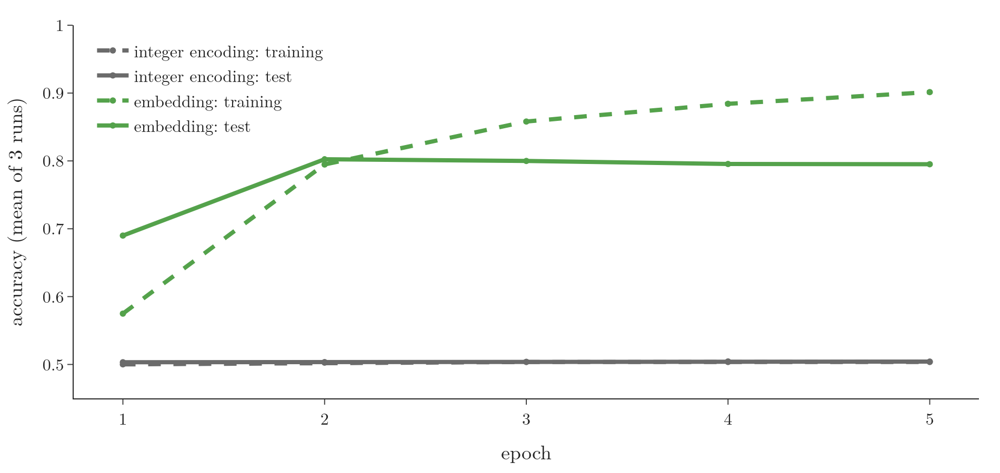
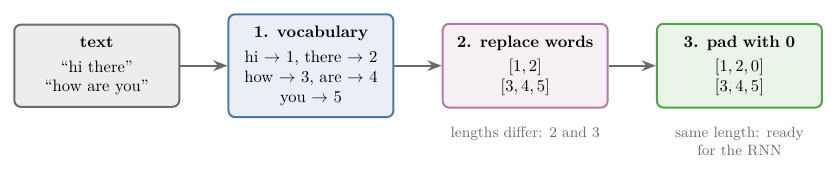
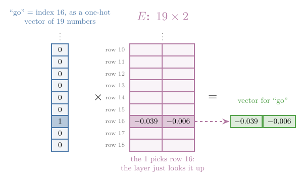
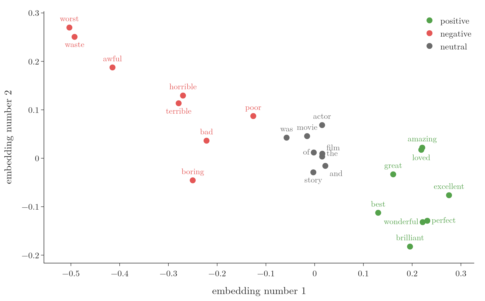

<!-- where-this-fits: generated by course_map/build_map.py; edit concepts.yaml, not this block -->
> **Where this fits:** Pipeline map steps 5 (Engineer features), 8 (Model). See the [Course map](../../../00-course-map/00-course-map.md).
>
> 
>
> - **Builds on:** [Forward propagation](../../../DL/01-basics/DL-010-forward-propagation/DL-010-forward-propagation.md#1-overview); [Exploding gradient and gradient clipping](../../../DL/01-basics/DL-018-vanishing-exploding-gradients/DL-018-vanishing-exploding-gradients.md#7-the-exploding-gradient-problem); [Tanh](../../../DL/02-training/DL-027-activation-functions/DL-027-activation-functions.md#7-tanh); [Sequential data](../../../DL/05-rnn/DL-055-why-rnn/DL-055-why-rnn.md#3-sequential-data); [Parameter sharing across time steps](../../../DL/05-rnn/DL-056-rnn-forward-propagation/DL-056-rnn-forward-propagation.md#1-overview); [Backpropagation through time (BPTT)](../../../DL/05-rnn/DL-059-backpropagation-through-time/DL-059-backpropagation-through-time.md#1-overview).
> - **Leads to:** [Types of RNN (many-to-one, one-to-many, many-to-many)](../../../DL/05-rnn/DL-058-types-of-rnn/DL-058-types-of-rnn.md#6-one-to-one); [LSTM (long short-term memory)](../../../DL/05-rnn/DL-061-lstm/DL-061-lstm.md#7-two-differences-between-an-rnn-and-an-lstm); [Next-word prediction with an LSTM](../../../DL/05-rnn/DL-063-lstm-next-word-prediction/DL-063-lstm-next-word-prediction.md#1-overview); [GRU (gated recurrent unit)](../../../DL/05-rnn/DL-064-gru/DL-064-gru.md#1-overview); [Deep (stacked) RNNs](../../../DL/05-rnn/DL-065-deep-rnns/DL-065-deep-rnns.md#4-the-architecture-of-a-deep-rnn); [Bidirectional RNNs](../../../DL/05-rnn/DL-066-bidirectional-rnn/DL-066-bidirectional-rnn.md#4-how-a-bidirectional-rnn-works).
> - **Compare with:** [One-hot encoding](../../../ML/03-feature-engineering/ML-026-one-hot-encoding/ML-026-one-hot-encoding.md#2-how-one-hot-encoding-works); [Multi-layer perceptron (MLP)](../../../DL/01-basics/DL-009-mlp-intuition/DL-009-mlp-intuition.md#1-overview).
<!-- /where-this-fits -->

## 1. Overview

> **Key point:** An RNN only reads numbers, so text must become numbers first. Two ways: integer encoding (each word becomes its index in the vocabulary) and a learned embedding (each word becomes a short, dense vector, a list of numbers, that the network learns). On IMDB movie reviews, the same SimpleRNN reaches about 0.80 test accuracy with an embedding, against 0.50 with raw integers.

**Sentiment analysis** (G-1769) is the task of predicting whether a text is positive or negative. The data is a set of texts, each with a label: 1 for positive, 0 for negative. This Note builds a sentiment analysis model with the RNN of the [RNN forward propagation](../DL-056-rnn-forward-propagation/DL-056-rnn-forward-propagation.md#4-the-architecture-of-an-rnn), in Keras, on real movie reviews.

The aim is the workflow, not the best accuracy:

- how text becomes numbers (sections 3 and 4);
- how the numbers enter a `SimpleRNN` (section 5);
- what changes when a learned embedding is added (sections 6 and 7).

{width=95%}

Figure 1 is the result of the whole Note. The horizontal axis is the epoch (one pass over the training reviews) and the vertical axis is accuracy, the share of reviews classified correctly. The grey lines are the model fed raw integers and the green lines the model with an embedding; watch how far apart the two solid lines end up.

## 2. Prerequisites

- The [RNN forward propagation](../DL-056-rnn-forward-propagation/DL-056-rnn-forward-propagation.md#3-the-shape-of-the-input): input shape (time steps, input features), the recurrent layer, counting its parameters.
- The [why RNNs](../DL-055-why-rnn/DL-055-why-rnn.md#52-zero-padding-wastes-most-of-the-network): padding sequences to a common length, and its cost.
- The [MNIST ANN](../../01-basics/DL-012-mnist-ann/DL-012-mnist-ann.md#5-compiling-and-training): `compile`, `fit` and validation data in Keras.
- The [one-hot encoding](../../../ML/03-feature-engineering/ML-026-one-hot-encoding/ML-026-one-hot-encoding.md#22-one-column-per-category): a category as a vector with a single 1.

## 3. Integer encoding

> **Key point:** Build the vocabulary, give each word an integer, replace every word by its integer, then pad the sequences to one length.

### 3.1 The three steps

> **Key point:** Vocabulary, replace, pad.

Each review is one **observation** (G-1374; one record of the data), and its label is the **target** (G-1949; the output we predict). Before an RNN can read the reviews, every word must become a number. **Integer encoding** (G-956) does it in three steps.

{width=100%}

1. **Vocabulary.** List the unique words of the whole document, the **vocabulary** (G-2092), and give each one an integer: hi is 1, there is 2, how is 3, are is 4, you is 5.
2. **Replace.** Write every sentence as the integers of its words: "hi there" becomes $[1, 2]$ and "how are you" becomes $[3, 4, 5]$.
3. **Pad.** The sequences have different lengths, so we use **padding** (G-1436): add zeros at the start or the end of the shorter ones until all have the same length: $[1, 2, 0]$ and $[3, 4, 5]$. The integer 0 is kept for padding, so no word gets it.

Figure 2 shows the three steps.

### 3.2 Tokenizing in Keras

> **Key point:** Keras' `TextVectorization` layer lower-cases the text, strips punctuation, splits it into words, builds the vocabulary and replaces each word by its index, in one step.

Splitting a text into words is **tokenization** (G-1983). Doing it by hand means lower-casing every word, removing punctuation and numbering the words; Keras does all of it.

Take a document of 10 short cheering slogans, such as "go india", "india india" and "jeetega bhai jeetega india jeetega". `adapt` reads the document and builds the vocabulary, most frequent word first. The Notebook prints 19 entries:

| Index | Entry |
|---|---|
| 0 | `""` (padding) |
| 1 | `[UNK]` (unknown word) |
| 2 | india |
| 3 | jeetega |
| ... | 15 more words |

"india" appears 4 times, more than any other word, so it gets the first free index, 2.

**Out-of-vocabulary words.** A word seen only at prediction time, never in training, has no index. The layer maps every such word to a special **out-of-vocabulary (OOV) token** (G-1416), `[UNK]`, with index 1. In the Notebook, "go pakistan" becomes $[16, 1]$: "pakistan" is not in the vocabulary.

> **Python:** Integer encoding with `TextVectorization`; it also pads the sequences with 0 at the end.
>
> ```python
> import keras
> docs = ["go india", "india india", "hip hip hurray", ...]
> vectorizer = keras.layers.TextVectorization()
> vectorizer.adapt(docs)               # build the vocabulary
> print(vectorizer.get_vocabulary())   # ['', '[UNK]', 'india', ...]
> sequences = vectorizer(docs).numpy() # one padded row per sentence
> ```

For lists of integers of different lengths, `keras.utils.pad_sequences(sequences, padding="post")` pads at the end, and `padding="pre"` (the default) at the start (Keras documentation).

> **Extra:** Older Keras code uses `keras.preprocessing.text.Tokenizer` with `fit_on_texts`, `word_index`, `word_counts` and `texts_to_sequences`, and an `oov_token` argument. Keras 3 keeps that class only as a legacy API; `TextVectorization` is its replacement, and it reserves index 0 for padding and index 1 for `[UNK]` (Keras documentation, `TextVectorization`).

## 4. The IMDB dataset

> **Key point:** 50,000 movie reviews, half for training and half for testing, already integer encoded. We pad or cut every review to 50 words.

### 4.1 Loading the reviews

> **Key point:** `keras.datasets.imdb.load_data()` returns the reviews as lists of integers, one integer per word.

The **IMDB dataset** (G-923) holds 50,000 movie reviews from the Internet Movie Database, labelled positive or negative: 25,000 for training and 25,000 for testing (Keras documentation, IMDB dataset). Keras ships it already tokenized and integer encoded, so the steps of section 3 are done. The first training review starts

$$[1, 14, 22, 16, 43, 530, 973, 1622, 1385, 65, \dots]$$

where 1 marks the start of a review and every other integer is a word. Decoded with the dataset's word index, it reads "this film was just brilliant casting location scenery story direction everyone's really suited the part they played and you ...".

> **Extra:** In `load_data`, a word's integer is its frequency rank plus 3: 0 is padding, 1 is the start marker and 2 is the out-of-vocabulary word. So the most frequent word, "the", is 4 (Keras source, `imdb.load_data`: `start_char=1`, `oov_char=2`, `index_from=3`).

### 4.2 Cutting every review to 50 words

> **Key point:** Reviews have different lengths (the first three have 218, 189 and 141 words). `pad_sequences(maxlen=50)` pads the short ones and cuts the long ones to 50 words, so training is fast.

Training on full reviews is slow, so we keep 50 words per review: `keras.utils.pad_sequences(X, maxlen=50)`. Shorter reviews get zeros in front; longer reviews are cut. Zeros in front keep the review's own words at the end, so the last hidden state, the one the output node reads, comes right after the last real word; with zeros at the end the RNN would first run extra steps on padding, which change the hidden state (see [padded steps still run](../DL-056-rnn-forward-propagation/DL-056-rnn-forward-propagation.md#54-gotcha-padded-steps-still-run)). The training data then has shape $(25000, 50)$. The cut throws information away: the median review has 178 words. When training time allows, use full reviews.

**Which 50 words?** `pad_sequences` cuts from the start by default (`truncating="pre"`), so a long review keeps its **last** 50 words, not its first 50 (Keras documentation, `pad_sequences`). Passing `truncating="post"` keeps the first 50. Figure 3 shows both cases on real training reviews.

{width=100%}

## 5. Approach 1: integer encoding into a SimpleRNN

> **Key point:** Feed each review as 50 time steps of 1 number each, into a SimpleRNN of 32 nodes and a sigmoid output node: 1,088 + 33 parameters.

### 5.1 The model

> **Key point:** Input shape $(50, 1)$: 50 time steps, 1 input feature, the word's integer.

> **Python:** The model for raw integer inputs.
>
> ```python
> model = keras.Sequential([
>     keras.Input(shape=(50, 1)),    # (time steps, input features)
>     keras.layers.SimpleRNN(32, return_sequences=False),
>     keras.layers.Dense(1, activation="sigmoid")])
> ```

Each review is 50 integers. At time step 1 the first integer enters the recurrent layer, at time step 2 the second, and so on, as in the [RNN forward propagation](../DL-056-rnn-forward-propagation/DL-056-rnn-forward-propagation.md#5-forward-propagation-in-an-rnn). After the 50th, the last hidden state goes to the sigmoid node, which gives $\hat{y}$. The **hidden state** is the vector of numbers the recurrent layer keeps as its memory and passes from each word to the next ([how it carries the sequence forward](../DL-056-rnn-forward-propagation/DL-056-rnn-forward-propagation.md#63-the-hidden-state-carries-the-sequence-forward)); $\hat{y}$ is the predicted probability that the review is positive.

### 5.2 Counting the parameters

> **Key point:** The recurrent layer has 1,088 parameters and the output layer has 33. The table adds them up.

The notation is that of RNN forward propagation: $W_i$ holds the weights from the input to the layer's nodes, $W_h$ the feedback weights from the nodes' previous hidden state back to the nodes, $b_h$ their biases, and $W_o$, $b_o$ the weights and bias of the output node.

| Part | Count |
|---|---|
| $W_i$: 1 input feature to 32 nodes | $1 \times 32 = 32$ |
| $W_h$: feedback, 32 nodes to 32 nodes | $32 \times 32 = 1024$ |
| $b_h$ | 32 |
| **SimpleRNN total** | **1,088** |
| $W_o$ and $b_o$ | $32 + 1 = 33$ |

`model.summary()` prints the same numbers.

### 5.3 `return_sequences`

> **Key point:** `return_sequences=False` (the default) returns only the last hidden state. `return_sequences=True` returns the hidden state of every time step.

The recurrent layer computes a hidden state at every time step (Figure 4). The argument `return_sequences` (G-136) chooses which of them leave the layer. With `return_sequences=False`, only the last one leaves the layer; the others stay inside and only feed the next time step. Sentiment analysis needs one answer per review, after the last word, so `False` is right here.

{width=100%}

Some tasks need an output at every word: **named entity recognition** (G-1300) labels each word (for example, is it a person's name?), and **machine translation** (G-1141) produces a sentence. Those use `return_sequences=True`. The [types of RNN](../DL-058-types-of-rnn/DL-058-types-of-rnn.md#5-many-to-many) covers these cases.

### 5.4 Training

> **Key point:** Binary cross-entropy, Adam, 5 epochs, the test reviews as validation data. Raw integers give a test accuracy near a coin toss.

We compile with **binary cross-entropy** (G-303; the loss for two classes) loss and the **Adam** (G-169; the rule that updates the weights) optimizer, train for 5 **epochs** (G-696) and pass the test reviews as `validation_data`. Averaged over 3 runs, the model reaches 0.50 training accuracy and 0.50 test accuracy after 5 epochs (grey lines in Figure 1). With two balanced classes, guessing gives 0.50.

Only 50 words per review and only 5 epochs make the task harder. But the embedding model of section 7 gets the same 50 words and the same 5 epochs and reaches 0.80. The main difference between the two models is how a word enters the RNN (the embedding model also keeps only the 10,000 most frequent words), so the representation of the words is what holds this model back.

**Why raw integers are a poor input.** The integer of a word is only its rank in a frequency list. In the IMDB data "great" is 87, "excellent" is 321 and "awful" is 373 (Notebook). Read as quantities, these numbers say that "excellent" is almost the same as "awful" and far from "great". Two words with the same meaning get unrelated numbers, so what the network learns about "great" does not carry over to "excellent". Section 6 replaces the single arbitrary number by a few learned ones.

## 6. Word embeddings

> **Key point:** An embedding turns each word into a short vector of real numbers, most of them non-zero, learned so that words used in similar ways get similar vectors.

### 6.1 Sparse and dense representations

> **Key point:** Padding and one-hot vectors are mostly zeros (sparse). An embedding is short and full of useful numbers (dense).

Two problems come with the earlier representations.

- **Sparse.** Take a 20-word review padded to the longest review of 2,000 words: 1,980 of its 2,000 numbers are padding zeros. A one-hot vector over a 10,000-word vocabulary is 9,999 zeros and one 1. A representation where most values are 0 is **sparse** (G-1845).
- **No meaning.** Integers and one-hot vectors say nothing about meaning. In one-hot space every pair of words is the same distance apart, so "good" is as far from "great" as from "awful" (Goodfellow §12.4.2).

Two one-hot vectors differ in exactly two places, each by 1, so the distance between any two words is

$$\sqrt{1^2 + 1^2} = \sqrt{2}$$

A **word embedding** (G-2127) represents each word as a real-valued vector of a chosen, small size, such as 2 or 32 numbers, most of them non-zero: a **dense** representation (G-585). The vectors are learned so that words that appear in similar contexts are close to each other, which often puts words with similar meanings next to each other (Goodfellow §12.4.2).

### 6.2 Learning the embedding with the model

> **Key point:** Keras' `Embedding` layer learns the vectors during training, by backpropagation, together with the RNN.

Word2Vec (Mikolov et al. 2013) and **GloVe** (G-851; Pennington et al. 2014) are well-known embedding methods trained on large text collections: Word2Vec learned its vectors from a text of 1.6 billion words, and GloVe was trained on texts of 1 to 42 billion tokens. In deep learning we can also learn an embedding as part of our own model: Keras' `Embedding` layer turns each integer into a dense vector of fixed size (Keras documentation, `Embedding`). Its input must be integer encoded.

`Embedding` takes two main arguments:

- `input_dim`: the vocabulary size;
- `output_dim`: the size of each word's vector, a **hyperparameter** (G-910) (2, 32, 200, ...) to tune.

> **Extra:** Older code also passes `input_length`, the number of words per sequence. Keras 3 removed that argument; the sequence length comes from the input shape (`keras.Input(shape=(50,))`) instead (Keras documentation, `Embedding`).

### 6.3 What the layer computes

> **Key point:** The layer holds a weight matrix $E$ with one row per word. A word's vector is its row of $E$: a one-hot vector times $E$, done as a lookup.

1. **In words:** the layer is like a dense layer whose input is the word's one-hot vector, with no bias and no activation. Multiplying a one-hot vector by a matrix picks one row, so the layer simply looks up row $k$ for word $k$.
2. **Formula:** for a vocabulary of $V$ words and vectors of size $d$, $E$ is $V \times d$, and
   $$\text{embedding}(k) = \text{onehot}(k)\thinspace E = E_{k,:}$$
   Here $E_{k,:}$ means row $k$ of $E$: the entry $k$ in each column, the whole row of numbers.
3. **Example:** the slogan document has $V = 19$ entries. With $d = 2$, $E$ is $19 \times 2$: 38 weights, which `model.summary()` confirms. The first word of the first slogan, "go", has index 16, and row 16 of $E$ is its 2-number vector: $[-0.039, -0.006]$ before training.

{width=80%}

$E$ starts random and is trained with the rest of the network by **backpropagation** (G-247). Figure 5 shows the lookup. The Notebook checks that the one-hot product and the layer's output are the same numbers.

Applied to a padded sequence of 5 integers, the layer returns 5 rows of 2 numbers, one per word (the padding index 0 also gets a row). For the 10 slogans, padded to 5 words, the output has shape $(10, 5, 2)$: 100 numbers.

## 7. Approach 2: an embedding into the same SimpleRNN

> **Key point:** Keep the 10,000 most frequent words, embed each in 2 numbers, and feed the 50 vectors into the SimpleRNN. Test accuracy rises to about 0.80.

### 7.1 The model

> **Key point:** Embedding (20,000 parameters), SimpleRNN (1,120), Dense (33).

`load_data(num_words=10000)` keeps the 10,000 most frequent words; every rarer word becomes the out-of-vocabulary integer 2.

> **Python:** The embedding model.
>
> ```python
> model = keras.Sequential([
>     keras.Input(shape=(50,)),             # 50 integers per review
>     keras.layers.Embedding(10000, 2),     # each word -> 2 numbers
>     keras.layers.SimpleRNN(32),
>     keras.layers.Dense(1, activation="sigmoid")])
> ```

Now each time step carries 2 numbers instead of 1, so the RNN's input is (50 time steps, 2 input features).

| Layer | Parameters |
|---|---|
| Embedding: $E$ | $10000 \times 2 = 20000$ |
| SimpleRNN: $W_i$, $W_h$, $b_h$ | $2 \times 32 + 32 \times 32 + 32 = 1120$ |
| Dense: $W_o$, $b_o$ | $32 + 1 = 33$ |

### 7.2 Results

> **Key point:** Same RNN, same 50 words, same 5 epochs: the embedding lifts test accuracy from 0.50 to 0.80. Training accuracy climbs higher still, a sign of overfitting.

| After 5 epochs, mean of 3 runs | Integer encoding | Embedding |
|---|---|---|
| Training accuracy | 0.50 | 0.90 |
| Test accuracy | 0.50 | 0.80 |

The green lines of Figure 1 show the embedding model. Test accuracy levels off at about 0.80 from epoch 2 while training accuracy keeps rising to 0.90: the model is starting to memorise the training reviews, which is **overfitting** (G-1429). The [regularization](../../02-training/DL-026-regularization-in-dl/DL-026-regularization-in-dl.md#4-ways-to-reduce-overfitting) and the [early stopping](../../02-training/DL-022-early-stopping/DL-022-early-stopping.md#4-early-stopping-in-keras) cover the remedies.

### 7.3 What the embedding learned

> **Key point:** After training, positive and negative words sit in different parts of the 2-number space.

{width=85%}

Figure 6 plots the learned vectors of 8 positive, 8 negative and 8 neutral words: the two numbers of each vector give the horizontal and vertical position of its word. Nobody told the network which words are positive. Goodfellow §12.4.2 explains the pattern: words that share features learned by the model end up close together. The only label this model learns from is the sentiment, and Figure 6 shows its embedding sorting the words by sentiment along one direction.

**How the vectors get there.** Figure 7 shows the same 24 words before training and after each epoch. Watch the green and red points: they start mixed in one small cloud and move apart, mostly during the first epoch.

{width=95%}

1. **Before training,** $E$ holds small random numbers, so the positions say nothing: the average first number is $-0.01$ for the positive words and $-0.02$ for the negative words (Notebook).
2. **At every training step,** backpropagation changes the rows of $E$ for the words of the reviews in the batch, each in the direction that lowers the loss. The rows of $E$ are weights like any others.
3. **Words used in the same kind of review get the same kind of push.** "Great" and "excellent" appear mostly in positive reviews, so their rows are moved the same way; "worst" and "awful" are moved the opposite way. After one epoch the average first number is $0.19$ for the positive words and $-0.29$ for the negative words.

Nobody placed similar words together: they end up together because they help the prediction in the same way.

The trained model can also be watched while it reads. We take the first test review of 20 to 30 words, with no rare word, that the model classifies correctly (Notebook, last section), and record the hidden state after every word. Applying the output layer to each hidden state gives the prediction the model would make if the review stopped there.

{width=100%}

In Figure 8, watch the column for "worst": the hidden state changes colour there. The next words pull the prediction part of the way back, and "script is unfunny" settles it on the negative side.

### 7.4 Learned or pre-trained embeddings

> **Key point:** We can learn the embedding with the model, as here, or load pre-trained vectors such as Word2Vec or GloVe.

A pre-trained embedding, like a **pretrained model** (G-1558), was learned on a large general text collection. An embedding learned with the model is fitted to our own data and task. Which works better depends on the data (Goodfellow §15.1.1):

- Pre-training helps most when the labelled observations are few, and when the text used for pre-training is very large.
- Words are a case where pre-training is especially useful, because one-hot words carry no similarity information (section 6.1). In natural language processing, the vectors are often learned once on a huge text of billions of words, then used as they are or fine-tuned for the task.

## 8. Summary

| | Integer encoding | Embedding |
|---|---|---|
| A word becomes | 1 number, its index | a learned vector of $d$ numbers |
| Representation | arbitrary numbers, sparse after padding | dense, similar words close |
| RNN input shape | (50, 1) | (50, $d$) |
| Extra parameters | none | vocabulary size $\times\ d$ |
| IMDB test accuracy, 5 epochs | 0.50 | 0.80 |

- Text must become numbers, because an RNN only reads numbers: build a vocabulary, replace words by integers, pad to one length so the sequences fit in one batch.
- `TextVectorization` tokenizes and integer encodes; unknown words map to `[UNK]`, so a word seen only at prediction time still gets an index; `pad_sequences` pads and cuts.
- IMDB comes integer encoded; `pad_sequences(maxlen=50)` keeps the last 50 words of each review, because it cuts from the start by default (`truncating="pre"`).
- `SimpleRNN(32)` on 1 input feature has 1,088 parameters; `return_sequences=False` returns only the last hidden state, because sentiment needs one answer per review, after the last word.
- An `Embedding` layer is a lookup table $E$, trained with the model; it turned a coin toss into about 0.80 accuracy, because a word's integer is only its frequency rank, while the learned vectors put words that help the prediction in the same way close together.

## 9. Sources

**Built from**

- CampusX, "RNN Sentiment Analysis | RNN Code Example in Keras | CampusX", YouTube, https://www.youtube.com/watch?v=JgnbwKnHMZQ
- StatQuest with Josh Starmer, "Word Embedding and Word2Vec, Clearly Explained!!!", YouTube, https://www.youtube.com/watch?v=viZrOnJclY0. 02:00–10:00 (arbitrary numbers for words of the same meaning; the embedding as weights learned by backpropagation; words plotted by their weights before and after training).

**Other references**

- Goodfellow, I., Bengio, Y. and Courville, A. (2016). *Deep Learning*. MIT Press. §12.4.2 (neural language models, word embeddings). deeplearningbook.org/contents/applications.html.
- Goodfellow, I., Bengio, Y. and Courville, A. (2016). *Deep Learning*. MIT Press. §15.1.1 (when unsupervised pretraining works). deeplearningbook.org/contents/representation.html.
- Mikolov, T., Chen, K., Corrado, G. and Dean, J. (2013). Efficient Estimation of Word Representations in Vector Space. arXiv:1301.3781.
- Pennington, J., Socher, R. and Manning, C. D. (2014). GloVe: Global Vectors for Word Representation. EMNLP 2014, 1532-1543.
- Keras API documentation: `TextVectorization`, `pad_sequences`, `Embedding`, `SimpleRNN` layers, and the IMDB dataset (`keras.datasets.imdb.load_data`), keras.io/api/. Checked against the installed Keras 3.15 source.
- Maas, A. L. et al. (2011). Learning Word Vectors for Sentiment Analysis. ACL 2011. (The IMDB dataset.)

## 10. Key terms

| Term | Meaning |
|---|---|
| Sentiment analysis | Predicting whether a text is positive or negative |
| Observation | One record of the data, here one review |
| Target | The output we predict, here the sentiment label |
| Vocabulary (G-2092) | The set of unique words in the data, each with an integer index |
| Tokenization (G-1983) | Splitting a text into words (tokens) |
| Integer encoding | Replacing each word by its index (a whole number) in the vocabulary, so a network such as an RNN can read text as numbers. |
| Out-of-vocabulary (OOV) token | A placeholder token, `[UNK]`, that stands for every word not in the vocabulary, so a word never seen in training still gets an index. |
| Padding | Adding zeros to sequences so that all have the same length |
| Sparse representation | A representation where most values are 0, such as a one-hot vector over a 10,000-word vocabulary (9,999 zeros and one 1); it wastes space compared with a dense one. |
| Dense representation | A short vector of real numbers, most of them non-zero, such as a word embedding; unlike a long, mostly-zero one-hot vector, every number carries information. |
| Word embedding | A learned real-valued vector for each word; words used in similar ways get nearby vectors |
| `Embedding` layer | The Keras layer holding the embedding matrix $E$; looks up one row per word |
| `return_sequences` | SimpleRNN argument: `False` returns the last hidden state, `True` returns every hidden state |
| IMDB dataset | 50,000 labelled movie reviews, shipped with Keras already integer encoded |
| Overfitting | Training accuracy rising while test accuracy stalls or falls |
