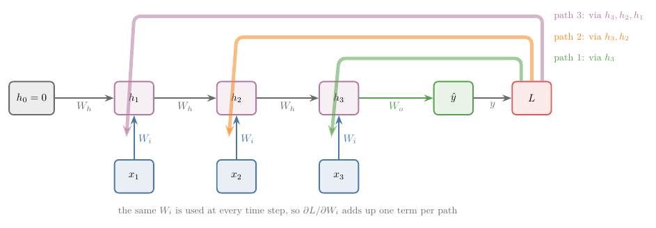
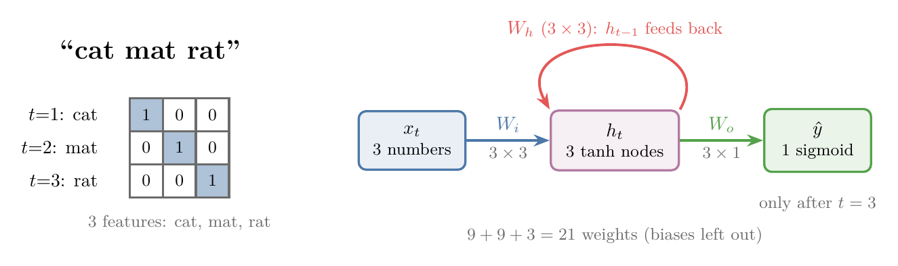
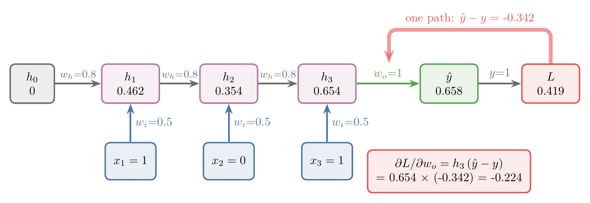
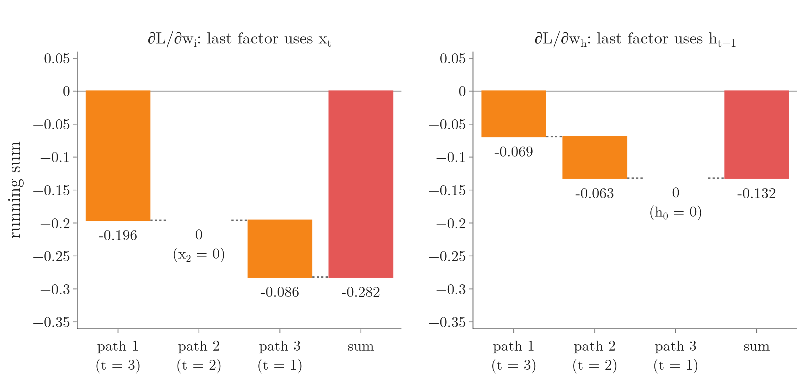
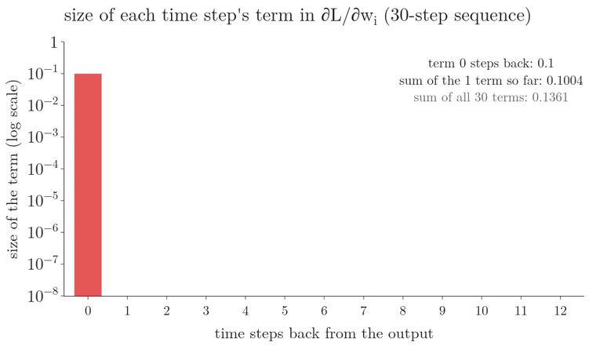
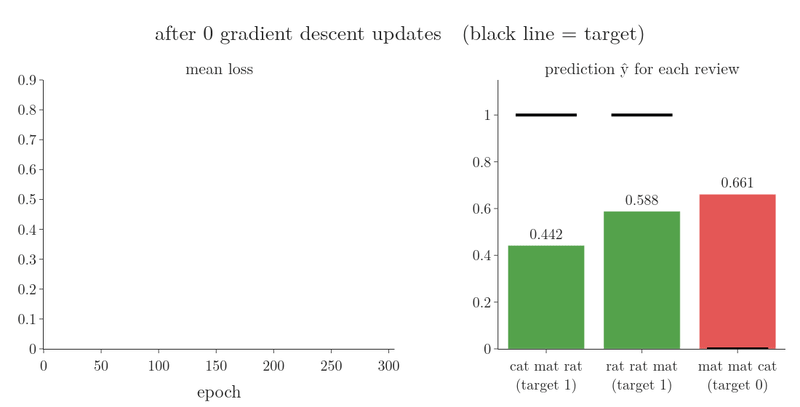

<!-- where-this-fits: generated by course_map/build_map.py; edit concepts.yaml, not this block -->
> **Where this fits:** Pipeline map step 8 (Model). See the [Course map](../../../00-course-map/00-course-map.md).
>
> 
>
> - **Builds on:** [Backpropagation](../../../DL/01-basics/DL-015-backpropagation-what/DL-015-backpropagation-what.md#4-the-steps-of-backpropagation); [Parameter sharing across time steps](../../../DL/05-rnn/DL-056-rnn-forward-propagation/DL-056-rnn-forward-propagation.md#62-weight-sharing).
> - **Leads to:** [Long-term dependency problem](../../../DL/05-rnn/DL-060-problems-with-rnn/DL-060-problems-with-rnn.md#3-the-long-term-dependency-problem).
<!-- /where-this-fits -->

## 1. Overview

> **Key point:** Backpropagation through time (BPTT) is ordinary backpropagation applied to the unfolded RNN. Because $W_i$ and $W_h$ are used at every time step, their gradient is a sum with one term per time step.

An RNN learns like any neural network: forward propagation gives a prediction and a loss, backpropagation gives the derivative of the loss with respect to every weight, and gradient descent updates the weights. In an RNN this backward pass runs over the network **unfolded** (G-2041) in time, so it is called **backpropagation through time** (G-246) (**BPTT**; Goodfellow §10.2). No special algorithm is needed: the chain rule on the unfolded graph is enough (Goodfellow §10.2.2).

{width=100%}

Figure 1 shows the one new idea. $W_i$ is the matrix of input weights (a matrix is a table of numbers) and $W_h$ the matrix of feedback weights; $h_t$ is the **hidden state** (the recurrent layer's output after word $t$). The same $W_i$ enters at every time step, so the loss reaches it along several paths. The same holds for $W_h$.

## 2. Prerequisites

- [Forward propagation in an RNN](../DL-056-rnn-forward-propagation/DL-056-rnn-forward-propagation.md#5-forward-propagation-in-an-rnn): the formula for the hidden state, the unfolded network and the notation. At step $t$, the new state is

  $$h_t = \tanh(x_t W_i + h_{t-1} W_h)$$

  where $x_t$ is the input at step $t$ and $\tanh$ squashes any number into the range $-1$ to 1.
- Backpropagation, [the steps](../../01-basics/DL-015-backpropagation-what/DL-015-backpropagation-what.md#4-the-steps-of-backpropagation) and [the algorithm in loops](../../01-basics/DL-016-backpropagation-how/DL-016-backpropagation-how.md#3-the-regression-algorithm-in-loops): gradients as chain-rule products, and the update $w \leftarrow w - \eta\thinspace\partial L/\partial w$.
- [The chain rule with several variables](../../../MA/06-calculus/MA-062-partial-derivatives-and-gradients/MA-062-partial-derivatives-and-gradients.md#6-the-chain-rule-with-several-variables): the contributions of several paths add up.
- [Binary cross-entropy](../../01-basics/DL-014-dl-loss-functions/DL-014-dl-loss-functions.md#8-binary-cross-entropy), the loss used here.

## 3. The setup: a many-to-one RNN

> **Key point:** Three reviews of three words each, a sentiment of 1 or 0, one-hot vectors of 3 numbers, a recurrent layer of 3 nodes and a sigmoid output: three weight matrices $W_i$, $W_h$ and $W_o$.

### 3.1 The data

> **Key point:** A vocabulary of three words, so every word is a vector of 3 numbers and every review is a $3 \times 3$ table.

We use a sentiment analysis task: the input is a text, and the **target** (G-1949) (the output we predict) is its sentiment, 1 for positive and 0 for negative. The toy dataset has three reviews, each one **observation** (G-1374) (one record):

| Review | Sentiment |
|---|---|
| cat mat rat | 1 |
| rat rat mat | 1 |
| mat mat cat | 0 |

The vocabulary has three words, so one-hot encoding turns each into a vector (a list) of 3 numbers: cat $= [1, 0, 0]$, mat $= [0, 1, 0]$, rat $= [0, 0, 1]$. Each of the 3 positions is one input **feature** (G-772) (one input variable). Review $i$ is $x_i$, and its word at time step $t$ is $x_{it}$.

The task is **many-to-one** (G-1155): a sequence goes in, a single output comes out (see [many-to-one](../DL-058-types-of-rnn/DL-058-types-of-rnn.md#3-many-to-one)).

### 3.2 The network

> **Key point:** $W_i$ is $3 \times 3$, $W_h$ is $3 \times 3$, $W_o$ is $3 \times 1$. We leave out the biases to keep the formulas short.

- **Input:** 3 numbers per time step.
- **Recurrent layer** (G-1646): 3 nodes, with input weights $W_i$ ($3 \times 3$) and feedback weights $W_h$ ($3 \times 3$).
- **Output:** 1 sigmoid node, with weights $W_o$ ($3 \times 1$).

The three matrices hold 21 weights. The biases (3 in the recurrent layer, 1 in the output) are learned in exactly the same way as the weights, so we leave them out here.

{width=100%}

In Figure 2, watch the loop: $W_h$ is the only weight that connects one time step to the next.

### 3.3 Forward propagation

> **Key point:** Three steps of the recurrent layer, then the output, then the loss.

For one review, with $h_0 = 0$ (no memory before the first word) and tanh in the recurrent layer (as in [the formulas of an RNN](../DL-056-rnn-forward-propagation/DL-056-rnn-forward-propagation.md#53-the-formulas)):

$$h_1 = \tanh(x_{i1} W_i + h_0 W_h)$$
$$h_2 = \tanh(x_{i2} W_i + h_1 W_h)$$
$$h_3 = \tanh(x_{i3} W_i + h_2 W_h)$$

The output node applies the sigmoid (a function that turns any number $z$ into a number between 0 and 1)

$$\sigma(z) = \frac{1}{1 + e^{-z}}$$

to $h_3 W_o$, and $\hat{y}$ ("y hat") is the predicted probability of a positive review:

$$\hat{y} = \sigma(h_3 W_o)$$

$$L = -y \log \hat{y} - (1 - y) \log(1 - \hat{y})$$

The loss $L$ is binary cross-entropy (see [binary cross-entropy](../../01-basics/DL-014-dl-loss-functions/DL-014-dl-loss-functions.md#8-binary-cross-entropy)); for $y = 1$ it is $-\log \hat{y}$, small when $\hat{y}$ is near 1. The whole flow runs in five steps:

1. $x_{i1}$ and $h_0$ give $h_1$;
2. $x_{i2}$ and $h_1$ give $h_2$;
3. $x_{i3}$ and $h_2$ give $h_3$;
4. $h_3$ gives $\hat{y}$;
5. $\hat{y}$ and $y$ give $L$.

## 4. What training needs: three derivatives

> **Key point:** Gradient descent updates $W_i$, $W_h$ and $W_o$, so we need $\partial L/\partial W_i$, $\partial L/\partial W_h$ and $\partial L/\partial W_o$.

Training looks for the values of $W_i$, $W_h$ and $W_o$ that make $L$ smallest. Gradient descent updates each one with the learning rate $\eta$:

$$W_i \leftarrow W_i - \eta\thinspace\frac{\partial L}{\partial W_i}$$

$$W_h \leftarrow W_h - \eta\thinspace\frac{\partial L}{\partial W_h}$$

$$W_o \leftarrow W_o - \eta\thinspace\frac{\partial L}{\partial W_o}$$

Here $\partial L/\partial W_i$ means how much $L$ changes for a small change of $W_i$ alone.

We have the starting weights and $\eta$. So the whole job of BPTT is to compute these three derivatives. Backpropagation goes from the back to the front, so we start with $W_o$, nearest to the output.

## 5. The gradient for $W_o$

> **Key point:** $W_o$ is used once, so there is a single path from $L$ to $W_o$, and its gradient is one chain-rule product. Nothing differs from an ANN.

$\partial L/\partial W_o$ asks: how much does the loss change if $W_o$ changes a little? $L$ depends on $\hat{y}$ only ($y$ is fixed data), and $\hat{y}$ depends on $h_3$ and $W_o$. So there is one chain:

1. **In words:** follow the single path from $L$ through $\hat{y}$ to $W_o$, multiplying the derivatives along it.
2. **Formula:**
   $$\frac{\partial L}{\partial W_o} = \frac{\partial L}{\partial \hat{y}}\thinspace\frac{\partial \hat{y}}{\partial W_o}$$
   $$= h_3^{\mathsf T}\thinspace(\hat{y} - y)$$
   For a sigmoid output with binary cross-entropy, the two factors combine into $\hat{y} - y$ times the input of the output node, $h_3$ (derived in [the gradient of logistic regression](../../../ML/07-classification/ML-074-logistic-gradient-descent/ML-074-logistic-gradient-descent.md#5-the-gradient)). The symbol ${}^{\mathsf T}$ (transpose) turns a row into a column so that the shapes fit; for one node it changes nothing.
3. **Example:** a network with **one** hidden node, so every weight is a single number: $w_i = 0.5$, $w_h = 0.8$, $w_o = 1.0$, input sequence $x = (1, 0, 1)$, target $y = 1$. Forward propagation gives
   $$h_1 = \tanh(0.5) = 0.462$$
   $$h_2 = \tanh(0.8 \times 0.462) = 0.354$$
   $$h_3 = \tanh(0.5 + 0.8 \times 0.354) = 0.654$$
   $$\hat{y} = \sigma(1.0 \times 0.654) = 0.658$$
   $$L = -\log 0.658 = 0.419$$
   Then
   $$\frac{\partial L}{\partial w_o} = h_3\thinspace(\hat{y} - y)$$
   $$= 0.654 \times (0.658 - 1)$$
   $$= 0.654 \times (-0.342) = -0.224$$

{width=100%}

In Figure 3, the red arrow stops at $w_o$: the error never needs to travel back through $h_3$, $h_2$ and $h_1$ for this weight.

## 6. The gradient for $W_i$

> **Key point:** $W_i$ is used at all three time steps, so the loss reaches it along three paths. The gradient is the sum of the three path products.

### 6.1 Three paths

> **Key point:** $h_3$ depends on $W_i$ directly, and also through $h_2$, which depends on $W_i$ directly and through $h_1$.

The unfolded network uses the same $W_i$ at every **time step** (G-1976): however many steps we draw, there is still only one $W_i$ to train. Using one set of weights at every step is **parameter sharing** (G-1447). A shared weight changes the loss once for every place it is used. Each such route from the loss back to the weight is a **path** (G-1465), and the rule for several paths is simple: work out each path's product, then add them up. [A first-layer weight with two paths](../../01-basics/DL-019-mlp-memoization/DL-019-mlp-memoization.md#44-a-weight-of-the-first-layer-two-paths) met the same rule in an ANN, where a first-layer weight reaches the loss through several nodes.

Follow the dependencies backwards from $L$:

- $L$ depends on $\hat{y}$; $\hat{y}$ depends on $h_3$ and $W_o$.
- $h_3$ depends on four things: $x_{i3}$, $W_i$, $h_2$ and $W_h$.
- $h_2$ depends on $x_{i2}$, $W_i$, $h_1$ and $W_h$.
- $h_1$ depends on $x_{i1}$, $W_i$, $h_0$ and $W_h$.

So $W_i$ affects $L$ in three ways, the three coloured paths of Figure 1. By [the chain rule with several paths](../../../MA/06-calculus/MA-062-partial-derivatives-and-gradients/MA-062-partial-derivatives-and-gradients.md#6-the-chain-rule-with-several-variables), the derivative is the sum of the three path products:

$$\text{path 1} = \frac{\partial L}{\partial \hat{y}}\frac{\partial \hat{y}}{\partial h_3}\frac{\partial h_3}{\partial W_i}$$
$$\text{path 2} = \frac{\partial L}{\partial \hat{y}}\frac{\partial \hat{y}}{\partial h_3}\frac{\partial h_3}{\partial h_2}\frac{\partial h_2}{\partial W_i}$$
$$\text{path 3} = \frac{\partial L}{\partial \hat{y}}\frac{\partial \hat{y}}{\partial h_3}\frac{\partial h_3}{\partial h_2}$$
$$\times \frac{\partial h_2}{\partial h_1}\frac{\partial h_1}{\partial W_i}$$
$$\frac{\partial L}{\partial W_i} = \text{path 1} + \text{path 2} + \text{path 3}$$

Figure 4 is an animation of the unfolded network; it lights up the three paths one after another on the one-node example of section 5. Each path starts at $L$, runs back along the hidden states and turns down at one use of $w_i$; its value is written below as it arrives, and the last frame adds the three values.

{width=100%}

In each path, the last factor $\partial h_t/\partial W_i$ is the **immediate** derivative: how $h_t$ changes with $W_i$ when $h_{t-1}$ is held fixed, so only the direct use of $W_i$ at step $t$ counts (Pascanu et al. 2013 use the same convention). The other uses of $W_i$ are covered by the other paths.

### 6.2 The compact formula

> **Key point:** The gradient of $W_i$ is a sum with one term per time step: one path product for each step at which $W_i$ is used.

Three time steps give three terms; a 10-word review would give 10. Writing them all out is not practical, so we summarise with a sum over the time steps $j$:

$$\frac{\partial L}{\partial W_i} = \sum_{j=1}^{T} \frac{\partial L}{\partial \hat{y}}\thinspace\frac{\partial \hat{y}}{\partial h_j}\thinspace\frac{\partial h_j}{\partial W_i}$$

The middle factor $\partial \hat{y}/\partial h_j$ hides a chain. $\hat{y}$ does not use $h_1$ directly: it uses $h_3$, which uses $h_2$, which uses $h_1$. Expanding it gives back the paths of section 6.1:

- $j = 1$ is path 3:
  $$\frac{\partial \hat{y}}{\partial h_1} = \frac{\partial \hat{y}}{\partial h_3}\frac{\partial h_3}{\partial h_2}\frac{\partial h_2}{\partial h_1}$$
- $j = 2$ is path 2:
  $$\frac{\partial \hat{y}}{\partial h_2} = \frac{\partial \hat{y}}{\partial h_3}\frac{\partial h_3}{\partial h_2}$$
- $j = 3$: $\partial \hat{y}/\partial h_3$ as it is, which is path 1.

> **Extra:** Goodfellow §10.2.2 makes the bookkeeping exact with dummy variables: each time step $t$ gets its own copy $W^{(t)}$ of the shared matrix, used only at that step. The gradient of the shared matrix is then the sum of the gradients of its copies. The Notebook does exactly this on a real IMDB movie review cut to 100 words, with an `Embedding` layer, a `SimpleRNN` of 16 nodes and a sigmoid output: the 100 per-step gradients for $W_h$ add up to Keras' own gradient, to within $5 \times 10^{-8}$.

### 6.3 The worked example

> **Key point:** In the one-node example, the three path terms add up to a gradient of $-0.282$ for $w_i$.

1. **In words:** for each time step, multiply the error at the output by the derivatives that carry it back to that step, then by the immediate derivative of that step.
2. **Formula:** with one node every factor is a number. Writing $d_t = 1 - h_t^2$ for the slope of tanh at step $t$ (see [the shape and slope of tanh](../../02-training/DL-027-activation-functions/DL-027-activation-functions.md#71-shape-and-slope)):
   $$\frac{\partial L}{\partial \hat{y}}\frac{\partial \hat{y}}{\partial h_3} = (\hat{y} - y)\thinspace w_o$$
   $$\frac{\partial h_t}{\partial h_{t-1}} = d_t\thinspace w_h$$
   $$\frac{\partial h_t}{\partial w_i} = d_t\thinspace x_t$$
3. **Example:** with the numbers of section 5:
   $$(\hat{y} - y)\thinspace w_o = -0.342$$
   $$d_3 = 1 - 0.654^2 = 0.572$$
   $$d_2 = 1 - 0.354^2 = 0.875$$
   $$d_1 = 1 - 0.462^2 = 0.786$$
   The factors that carry the error back one step:
   $$\frac{\partial h_3}{\partial h_2} = 0.572 \times 0.8 = 0.457$$
   $$\frac{\partial h_2}{\partial h_1} = 0.875 \times 0.8 = 0.700$$
   $$\text{path 1} = -0.342 \times 0.572 \times 1$$
   $$= -0.196$$
   $$\text{path 2} = -0.342 \times 0.457 \times 0.875 \times 0$$
   $$= 0$$
   $$\text{path 3} = -0.342 \times 0.457 \times 0.700$$
   $$\times 0.786 \times 1 = -0.086$$
   $$\frac{\partial L}{\partial w_i} = -0.196 + 0 - 0.086$$
   $$= -0.282$$

Path 2 is 0 because the second input is $x_2 = 0$: $w_i$ had no effect at that step. TensorFlow's automatic gradient gives the same $-0.282$ (Notebook).

{width=100%}

In Figure 5, watch where each zero comes from: $x_2 = 0$ removes a term for $w_i$, and $h_0 = 0$ removes a different term for $w_h$.

## 7. The gradient for $W_h$

> **Key point:** $W_h$ is also used at every time step, so its gradient has the same form: a sum over the time steps, with $\partial h_j/\partial W_h$ as the last factor.

$W_h$, the feedback weight, appears in the formula of every hidden state. So, exactly as for $W_i$:

- $L$ depends on $\hat{y}$; $\hat{y}$ depends on $W_o$ and $h_3$;
- $h_3$ depends on $x_{i3}$, $W_i$, $h_2$ and $W_h$; $h_2$ on $x_{i2}$, $W_i$, $h_1$ and $W_h$; $h_1$ on $x_{i1}$, $W_i$, $h_0$ and $W_h$.

There are again three paths, one through each use of $W_h$, and the same compact sum. Only the immediate derivative changes: at step $t$, $W_h$ multiplies $h_{t-1}$, so the immediate derivative carries $h_{t-1}$ where the one for $W_i$ carried $x_t$.

1. **In words:** same paths, same factors; the last factor uses the previous hidden state instead of the input.
2. **Formula** (one node):
   $$\frac{\partial h_t}{\partial w_h} = d_t\thinspace h_{t-1}$$
3. **Example:**
   $$\text{path 1} = -0.342 \times 0.572 \times 0.354$$
   $$= -0.069$$
   $$\text{path 2} = -0.342 \times 0.457 \times 0.875$$
   $$\times 0.462 = -0.063$$
   $$\text{path 3} = -0.342 \times 0.457 \times 0.700$$
   $$\times 0.786 \times 0 = 0$$
   $$\frac{\partial L}{\partial w_h} = -0.069 - 0.063 + 0$$
   $$= -0.132$$

   Path 3 is 0 because $h_0 = 0$: at the first step there is no previous state for $w_h$ to act on.

{width=100%}

Figure 6 runs sections 6.3 and 7 together, from right to left. Watch the disc shrink: the error reaching $h_3$, $h_2$ and $h_1$ is 0.342, 0.156 and 0.109, because each step back multiplies it by $d_t\thinspace w_h$ (0.457, then 0.700), and both factors are below 1 here. The further back a time step, the smaller the error that reaches it.

Figure 7 shows where this leads on a longer sequence: the same one-node network on 30 inputs, all equal to 1. The bars are added from the last time step backwards. Each step back multiplies the term by about 0.26, so the first three terms already give 0.1336 of the total 0.1361, and a term 10 steps back is smaller than 0.000001 (Notebook). The gradient is still a sum of 30 terms, but only the last few time steps have a say in it.

{width=90% height=45%}

This effect, the **vanishing gradient** (G-2070; the gradient shrinking towards 0 as it is carried back), is followed over long sequences in [why the gradient vanishes through time](../DL-060-problems-with-rnn/DL-060-problems-with-rnn.md#4-why-the-vanishing-gradient-through-time).

> **Extra:** With matrices, the same computation runs as a loop backwards in time (Goodfellow §10.2.2, eq. 10.21 and 10.26, here in the row-vector form of Keras). Start with the error at the last hidden state, $\delta = (\hat{y} - y)\thinspace W_o^{\mathsf T}$. Then for $t = T$ down to 1:
>
> 1. pass it through tanh: $a = \delta \odot (1 - h_t^2)$, element by element;
> 2. add step $t$'s terms: $\partial L/\partial W_i \mathrel{+}= x_t^{\mathsf T} a$ and $\partial L/\partial W_h \mathrel{+}= h_{t-1}^{\mathsf T} a$;
> 3. move the error one step back: $\delta = a\thinspace W_h^{\mathsf T}$.
>
> In the Notebook this loop, written in NumPy for the 3-node network on "cat mat rat", matches TensorFlow's gradients to within $4 \times 10^{-8}$.

## 8. The full training loop

> **Key point:** Forward through time, loss, backward through time, update; then the next review. Repeat until the loss stops falling.

1. Start with initial values of $W_i$, $W_h$ and $W_o$.
2. Take the first review. Send the first word and compute $h_1$, the second word to get $h_2$, the third word to get $h_3$; then compute $\hat{y}$ and the loss.
3. Compute the three derivatives with BPTT, and update the three matrices with gradient descent.
4. Repeat with the next review, using the new weights. Continue, epoch after epoch, until the weights reach the minimum of the loss.

> **Python:** One BPTT update by hand, for the one-node example; TensorFlow's `GradientTape` gives the same numbers.
>
> ```python
> import tensorflow as tf
> w_i, w_h, w_o = (tf.Variable(v) for v in (0.5, 0.8, 1.0))
> with tf.GradientTape() as tape:
>     h = 0.0
>     for x_t in [1.0, 0.0, 1.0]:      # forward through time
>         h = tf.tanh(w_i * x_t + w_h * h)
>     loss = -tf.math.log(tf.sigmoid(w_o * h))   # target y = 1
> grads = tape.gradient(loss, [w_i, w_h, w_o])
> # [-0.282, -0.132, -0.224]
> for w, g in zip([w_i, w_h, w_o], grads):
>     w.assign_sub(0.1 * g)            # gradient descent step
> ```

Run on the three toy reviews with gradient descent (learning rate 0.5, all three reviews averaged per update), the NumPy BPTT of the Notebook brings the mean loss from 0.809 to 0.004 in 300 epochs. The predictions become 0.997, 0.997 and 0.006 for targets 1, 1 and 0.

{width=100%}

In Figure 8, watch the third review: it starts as the most "positive" prediction (0.661) although its target is 0, and BPTT pushes it down to 0.006.

Compared with backpropagation in an ANN, the only new point is the unfolding in time, which turns one shared weight into several uses and its derivative into a sum.

## 9. Summary

| Weight | Used at | Paths from $L$ | Gradient |
|---|---|---|---|
| $W_o$ | the last step only | 1 | $(\partial L/\partial \hat{y})(\partial \hat{y}/\partial W_o)$ |
| $W_i$ | every time step | $T$ | $\sum_j (\partial L/\partial \hat{y})(\partial \hat{y}/\partial h_j)(\partial h_j/\partial W_i)$ |
| $W_h$ | every time step | $T$ | $\sum_j (\partial L/\partial \hat{y})(\partial \hat{y}/\partial h_j)(\partial h_j/\partial W_h)$ |

- BPTT is backpropagation on the RNN unfolded in time, so no special algorithm is needed: the chain rule on the unfolded graph is enough.
- A weight used at several time steps reaches the loss along several paths; its gradient is the sum of the path products, because one shared $W_i$ and one shared $W_h$ are used at every step.
- $\partial \hat{y}/\partial h_j$ is itself a chain: $\partial \hat{y}/\partial h_T$ times one factor $\partial h_{t}/\partial h_{t-1}$ for every step from $T$ back to $j$ (section 6.2). The further back the step, the longer the chain, so when its factors are below 1, early steps add almost nothing to the gradient (the vanishing gradient).
- After BPTT, gradient descent updates $W_i$, $W_h$ and $W_o$ as in any network, so the only new point in an RNN is the unfolding in time.

## 10. Sources

**Built from**

- CampusX, "How Backpropagation works in RNN | Backpropagation Through Time", YouTube, https://www.youtube.com/watch?v=OvCz1acvt-k
- StatQuest with Josh Starmer, "Recurrent Neural Networks (RNNs), Clearly Explained!!!", YouTube, https://www.youtube.com/watch?v=AsNTP8Kwu80 (the weights are shared across every unrolled copy)
- Sanderson, G. (3Blue1Brown), "Backpropagation calculus | Deep Learning Chapter 4", YouTube, https://www.youtube.com/watch?v=tIeHLnjs5U8 (a quantity that influences the cost along several paths gets the sum of the path derivatives)

**Other references**

- Goodfellow, I., Bengio, Y. and Courville, A. (2016). *Deep Learning*. MIT Press. Chapter 10, §10.2 (recurrent neural networks, the name back-propagation through time) and §10.2.2 (computing the gradient in a recurrent neural network). deeplearningbook.org/contents/rnn.html.
- Pascanu, R., Mikolov, T. and Bengio, Y. (2013). On the Difficulty of Training Recurrent Neural Networks. ICML 2013. arXiv:1211.5063. §2 (the gradient as a sum of temporal contributions; the "immediate" partial derivative).

## 11. Key terms

| Term | Meaning |
|---|---|
| Backpropagation through time (BPTT) | Backpropagation for an RNN: the chain rule runs back over the network unfolded in time, adding up the gradient from every time step at which a shared weight is used. |
| Observation | One record of the data, here one review |
| Feature | An input variable; here one of the 3 positions of a word vector |
| Target | The output we predict, here the sentiment |
| Many-to-one (G-1155) | An RNN task with a sequence as input and a single output |
| Parameter sharing | Using the same weights at every time step |
| Path (in the chain rule) | One route through the computation from the loss to a weight; the derivative is the sum over all paths |
| Immediate derivative | The part of a derivative that comes only from a weight's direct use at step $t$: the derivative of $h_t$ with respect to the weight with $h_{t-1}$ held fixed. |
| Dummy copy $W^{(t)}$ | A copy of a weight that an RNN reuses at every time step, one copy for step $t$ only; the shared weight's gradient is the sum over the copies. |
