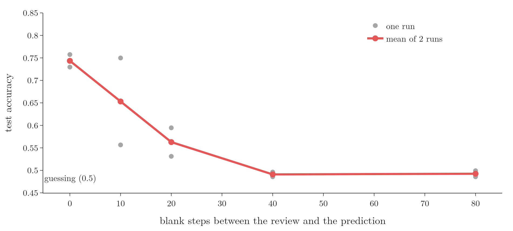
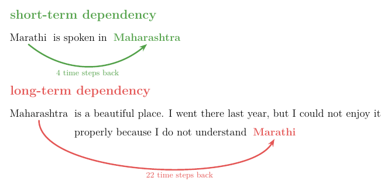
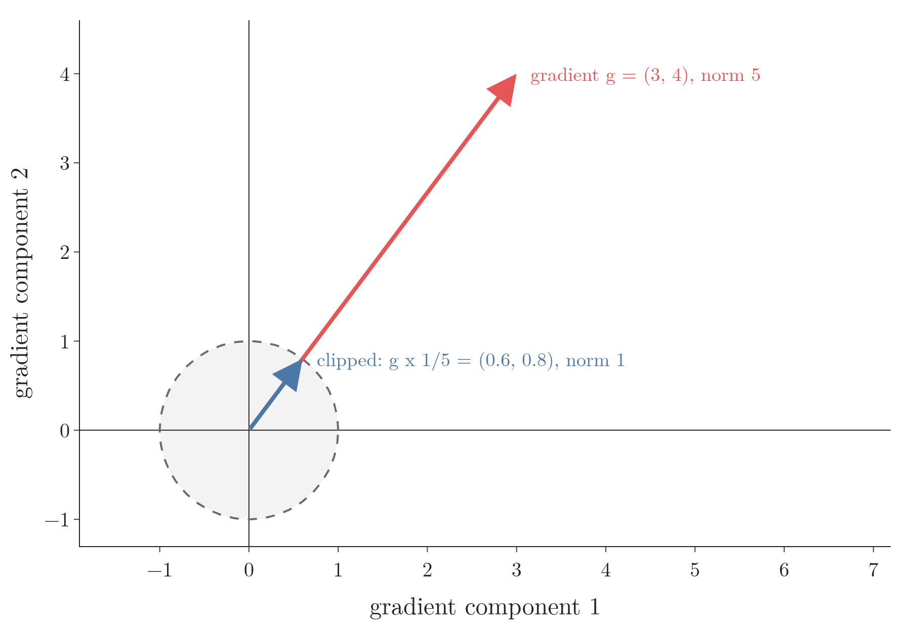

<!-- where-this-fits: generated by course_map/build_map.py; edit concepts.yaml, not this block -->
> **Where this fits:** Pipeline map step 8 (Model). See the [Course map](../../../00-course-map/00-course-map.md).
>
> 
>
> - **Builds on:** Sigmoid function ([Note ML-071](../../../ML/07-classification/ML-071-sigmoid-function/ML-071-sigmoid-function.md)); Training curves (History) ([Note DL-011](../../../DL/01-basics/DL-011-customer-churn-ann/DL-011-customer-churn-ann.md)); Backpropagation ([Note DL-015](../../../DL/01-basics/DL-015-backpropagation-what/DL-015-backpropagation-what.md)); Backpropagation through time (BPTT) ([Note DL-059](../../../DL/05-rnn/DL-059-backpropagation-through-time/DL-059-backpropagation-through-time.md)).
> - **Leads to:** LSTM (long short-term memory) ([Note DL-061](../../../DL/05-rnn/DL-061-lstm/DL-061-lstm.md)).
<!-- /where-this-fits -->

## 1. Overview

> **Key point:** A simple RNN has two problems: it cannot learn long-term dependencies, and its training can become unstable. Both come from one fact: during **backpropagation through time** (G-246) the gradient is multiplied by the same recurrent weights again and again, so it shrinks (vanishes) or grows (explodes) with distance.

RNNs suit **sequential data** (G-1774): text, time series, any data where a point depends on the points before it. Yet plain RNNs are rarely used in practice. They suffer from two problems:

1. **The long-term dependency problem**, caused by the **vanishing gradient** (G-2070).
2. **Unstable training** (G-2056), where the network fails to train, caused by the **exploding gradient** (G-731).

{width=100%}

Figure 1 shows the first problem on real data. The review is the same in every setting; only the distance between the review and the prediction grows, and the RNN loses the review's sentiment along the way. This Note explains why, and what can be done about it; the cure most used in practice, the LSTM, has its own Notes.

## 2. Prerequisites

- The [backpropagation through time Note](../DL-059-backpropagation-through-time/DL-059-backpropagation-through-time.md): the gradient of $W_i$ and $W_h$ is a sum of one term per time step.
- The [vanishing and exploding gradients Note](../../01-basics/DL-018-vanishing-exploding-gradients/DL-018-vanishing-exploding-gradients.md): a long product of small factors vanishes, of large factors explodes; gradient clipping.
- The [activation functions Note](../../02-training/DL-027-activation-functions/DL-027-activation-functions.md): the slope of tanh is between 0 and 1.
- The [RNN forward propagation Note](../DL-056-rnn-forward-propagation/DL-056-rnn-forward-propagation.md): $h_t = \tanh(x_t W_i + h_{t-1} W_h)$.

## 3. The long-term dependency problem

> **Key point:** When an output depends on an input many time steps earlier, a simple RNN fails: it remembers recent inputs and forgets old ones.

### 3.1 Short-term memory

> **Key point:** As the number of time steps grows, the RNN cannot keep information from the early steps.

In sequential data, later items depend on earlier ones. When the sequence is short, an RNN handles this well. When the sequence becomes long, with many time steps, the RNN cannot remember the early steps by the time it reaches the late ones. A simple RNN behaves like a person with short-term memory loss, such as the hero of the film *Ghajini*: recent events are clear, older ones are gone.

### 3.2 An example: predicting the next word

> **Key point:** "Marathi is spoken in ___" needs a word 4 steps back; the long sentence of Figure 2 needs one 22 steps back. A simple RNN handles the first and fails at the second.

Take next-word prediction, as on a phone keyboard.

{width=95%}

- In "Marathi is spoken in Maharashtra", the word Maharashtra depends on Marathi, 4 time steps back. The dependency is **short-term**.
- In "Maharashtra is a beautiful place. I went there last year, but I could not enjoy it properly because I do not understand ___", the missing word, Marathi, depends on Maharashtra, 22 time steps back. The dependency is **long-term** (G-1126).

A keyboard built on a simple RNN performs well on sentences like the first and poorly on sentences like the second. This failure is the **long-term dependency problem**: an output at one time step depends on an input from a much earlier time step, and the RNN does not have the memory to connect them.

Bengio, Simard and Frasconi (1994) showed why gradient-based learning faces an increasingly difficult problem as the duration of the dependencies grows. Goodfellow §10.7 summarises: the probability of successfully training a traditional RNN with **stochastic gradient descent** (G-1892) rapidly reaches 0 for sequences of only length 10 or 20.

### 3.3 The problem on real reviews

> **Key point:** The same SimpleRNN, the same reviews; only a gap of blank steps between the review and the prediction changes. Test accuracy falls from 0.743 with no gap to 0.492 with a gap of 80 steps: guessing level.

We take IMDB movie reviews: each **observation** (G-1374; one record) is a review, and the **target** (G-1949; the output we predict) is its sentiment, positive or negative. Each review is cut to its last 50 words. Then $G$ blank time steps (the padding token 0) are added after it, before the network gives its prediction. The network now has to carry the sentiment of the review across $G$ steps of nothing.

Each setting is trained on 10,000 reviews for 5 epochs and tested on 5,000, twice with different seeds (Notebook). Figure 1 and the table give the mean test accuracy:

| Gap $G$ (blank steps) | 0 | 10 | 20 | 40 | 80 |
|---|---|---|---|---|---|
| Test accuracy | 0.743 | 0.653 | 0.563 | 0.491 | 0.492 |

The information is in the data in every case: only the distance changes. The RNN cannot learn to carry it over a long distance. The next section shows why.

## 4. Why: the vanishing gradient through time

> **Key point:** The gradient of $W_i$ is a sum of short-term terms (recent inputs) and long-term terms (distant inputs). Each long-term term contains a long product of factors $\partial h_t/\partial h_{t-1}$, which shrinks towards 0. So the weights learn almost only from recent inputs.

**The idea on one weight.** Take the one-node RNN of the [RNN forward propagation Note](../DL-056-rnn-forward-propagation/DL-056-rnn-forward-propagation.md), section 4.1, unrolled over many time steps, and look only at the feedback weight $w_h$. The first input travels to the last step through the red arrows, and every arrow multiplies it by $w_h$.

1. **In words:** one multiplication by the same weight per time step. After many steps, the first input has been multiplied by that weight many times over.
2. **Formula:** after $d$ steps, the first input is multiplied by $w_h^{\thinspace d}$.
3. **Example:** with $w_h = 2$ and 4 steps, $2^4 = 16$. With 50 steps, $2^{50} \approx 1.1 \times 10^{15}$: a huge number. With $w_h = 0.5$ and 50 steps, $0.5^{50} \approx 8.9 \times 10^{-16}$: practically 0.

The same power appears in the gradient that training sends back to the first input (sections 4.1 to 4.3 derive it). Gradient descent needs steps of a sensible size:

- A huge gradient gives huge steps. The weights jump around instead of settling at a good value: the **exploding gradient**.
- A gradient near 0 gives steps so small that the weights hardly move, and training ends before they get anywhere: the **vanishing gradient**.


In Figure 3, watch the lines spread apart as the steps add up: after 10 steps the largest product is about 1,500 times the smallest; after 99 steps it is more than $10^{31}$ times the smallest.

The rest of this section finds the exact factor for a real RNN, which is not $w_h$ alone but $w_h$ times the slope of tanh.

### 4.1 Short-term and long-term terms

> **Key point:** In the BPTT sum, the term for the last input is short; the term for the first input is the longest chain.

Take a single hidden node, so every weight is one number, and three time steps: inputs $x_1, x_2, x_3$, hidden states $h_1, h_2, h_3$, prediction $\hat{y}$. From the [backpropagation through time Note](../DL-059-backpropagation-through-time/DL-059-backpropagation-through-time.md), the gradient of the input weight is a sum of three terms, one for each use of $w_i$:

$$\frac{\partial L}{\partial w_i} = \frac{\partial L}{\partial \hat{y}}\frac{\partial \hat{y}}{\partial h_3}\frac{\partial h_3}{\partial w_i} + \frac{\partial L}{\partial \hat{y}}\frac{\partial \hat{y}}{\partial h_3}\frac{\partial h_3}{\partial h_2}\frac{\partial h_2}{\partial w_i} + \frac{\partial L}{\partial \hat{y}}\frac{\partial \hat{y}}{\partial h_3}\frac{\partial h_3}{\partial h_2}\frac{\partial h_2}{\partial h_1}\frac{\partial h_1}{\partial w_i}$$

- The **first** term measures how the loss changes through the **last** input, $x_3$: a **short-term** contribution.
- The **last** term measures how the loss changes through the **first** input, $x_1$, the one farthest from the output: a **long-term** contribution.

Pascanu, Mikolov and Bengio (2013) call these the temporal contributions of the gradient and use the same split into long-term and short-term ones.

### 4.2 With 100 time steps

> **Key point:** The long-term term carries a product of 99 factors $\partial h_t/\partial h_{t-1}$.

Real sequences have 100 time steps or more. The longest term then reads

$$\frac{\partial L}{\partial \hat{y}}\thinspace\frac{\partial \hat{y}}{\partial h_{100}}\thinspace\frac{\partial h_{100}}{\partial h_{99}}\thinspace\frac{\partial h_{99}}{\partial h_{98}} \cdots \frac{\partial h_2}{\partial h_1}\thinspace\frac{\partial h_1}{\partial w_i}$$

the second-longest stops at $h_2$, the third at $h_3$, and so on. We can write the long chain compactly as a product:

$$\frac{\partial h_{100}}{\partial h_{99}} \cdots \frac{\partial h_2}{\partial h_1} = \prod_{t=2}^{100} \frac{\partial h_t}{\partial h_{t-1}}$$

### 4.3 One factor of the chain

> **Key point:** $\partial h_t/\partial h_{t-1} = \tanh'(\cdot)\thinspace w_h$: the slope of tanh times the feedback weight.

1. **In words:** $h_t$ is tanh of something that contains $h_{t-1} w_h$. Differentiating with respect to $h_{t-1}$ gives the slope of tanh at that point times $w_h$.
2. **Formula:**
   $$h_t = \tanh(x_t w_i + h_{t-1} w_h) \quad\Rightarrow\quad \frac{\partial h_t}{\partial h_{t-1}} = \tanh'(x_t w_i + h_{t-1} w_h)\thickspace w_h$$
   so the long-term term becomes
   $$\frac{\partial L}{\partial \hat{y}}\thinspace\frac{\partial \hat{y}}{\partial h_{100}} \left(\prod_{t=2}^{100} \tanh'(\cdot)\thinspace w_h\right) \frac{\partial h_1}{\partial w_i}$$
3. **Example:** the slope of tanh is between 0 and 1 (see the [activation functions Note](../../02-training/DL-027-activation-functions/DL-027-activation-functions.md)). Suppose every slope is 0.8 and $w_h = 0.9$. Each factor is $0.8 \times 0.9 = 0.72$, and 99 of them give
   $$0.72^{99} \approx 7.5 \times 10^{-15}$$

   The red line of Figure 3 draws this product step by step.

The long-term term is practically 0. Its whole contribution to the gradient disappears, and the gradient is made almost entirely of short-term terms. The weights are therefore updated to fit the **recent** inputs, and the influence of distant inputs is not learned. That is the long-term dependency problem, and it is a **vanishing gradient problem** (see the [vanishing gradients Note](../../01-basics/DL-018-vanishing-exploding-gradients/DL-018-vanishing-exploding-gradients.md)): the farther the input, the smaller its gradient.

> **Extra:** With several hidden nodes, each factor is a matrix, the **Jacobian** (G-980) $\partial h_t/\partial h_{t-1}$. In the row-vector form of the [forward propagation Note](../DL-056-rnn-forward-propagation/DL-056-rnn-forward-propagation.md) it is $W_h$ with each column scaled by that node's tanh slope; Goodfellow (§10.2.2, eq. 10.21) writes the same thing as $W^{\mathsf T}\mathrm{diag}(1 - h^2)$. Pascanu et al. (2013, §2.1) prove that if the largest absolute **eigenvalue** (G-665) of the recurrent weight matrix is below $1/\gamma$, where $\gamma$ bounds the slope of the activation ($\gamma = 1$ for tanh), the long-term contributions vanish as the distance grows.

### 4.4 What is special about an RNN

> **Key point:** A deep ANN multiplies **different** weights layer after layer; an RNN multiplies the **same** $W_h$ at every step. A number below 1 raised to a power always vanishes, and one above 1 always explodes.

The [vanishing gradients Note](../../01-basics/DL-018-vanishing-exploding-gradients/DL-018-vanishing-exploding-gradients.md) met long products in deep ANNs. An RNN is worse in one specific way: the factor is the same at every step. Goodfellow §10.7 calls this problem particular to recurrent networks. Leave out tanh and the inputs, and the recurrence is $h_t = h_{t-1} W_h$, so after $t$ steps the state, and the gradient sent back, is multiplied by $W_h$ to the power $t$. The eigenvalues of $W_h$ are raised to the power $t$: those with magnitude below 1 decay to 0, those above 1 explode (Goodfellow §10.7, eq. 10.36 to 10.39). With one node this is just $w_h^t$. A deep ANN with a different random weight at each layer can be scaled to avoid the problem; the shared weight of an RNN cannot (Goodfellow §10.7).

{width=100%}

The Notebook tests this on real reviews. A SimpleRNN with no activation gets $W_h = s\thinspace Q$, where $Q$ is an **orthogonal matrix** (G-1407; every eigenvalue has magnitude exactly 1), so every eigenvalue of $W_h$ has magnitude $s$. Figure 4 shows the result:

| $s$ | Gradient 50 steps back, relative to the last word | $s^{50}$ |
|---|---|---|
| 0.9 | 0.0062 | 0.0052 |
| 1.0 | 1.2 | 1 |
| 1.1 | 141 | 117 |

The measured ratios follow $s^{50}$: only the size of the shared weight decides whether the gradient vanishes, stays or explodes. In Figure 4, watch the three solid lines stay close to their dotted $s^d$ lines all the way to 199 steps back.

### 4.5 The trained RNN on real reviews

> **Key point:** In a tanh SimpleRNN trained on IMDB, a word 50 steps from the end moves the loss about a third as much as the last word, and a word 100 steps back about a seventh as much. The decay is gradual because Keras starts $W_h$ as an orthogonal matrix.

We train a SimpleRNN with 32 nodes on 10,000 IMDB reviews (their last 200 words) for 3 epochs, with 5 different seeds; the runs reach a mean test accuracy of 0.79 (from 0.77 to 0.83). For 500 test reviews of at least 200 words, the Notebook measures, with `tf.GradientTape`, the size of the gradient of the loss with respect to each word's vector, and divides it by the size for the last word.

{width=100%}

| Distance (steps) | 0 | 10 | 20 | 50 | 100 | 180 |
|---|---|---|---|---|---|---|
| Relative gradient, mean of 5 runs | 1 | 0.98 | 0.67 | 0.35 | 0.15 | 0.048 |

Figure 5 shows the gradient shrinking with distance: beyond the last few words, the farther a word is from the end, the weaker the training signal it sends the weights. At 180 steps, the signal is about 20 times weaker than for the last word.

The decay is slower than the $0.72^{99}$ of section 4.3. Keras starts $W_h$ as an orthogonal matrix (Keras documentation, `SimpleRNN`, `recurrent_initializer="orthogonal"`), so every eigenvalue of $W_h$ has magnitude 1 at the start: the $s = 1.0$ case of Figure 4, where $W_h$ alone neither shrinks nor grows the gradient. The shrinking left over comes from the tanh slopes, which are below 1. Starting $W_h$ well is one of the fixes of the next section, built into Keras.

> **Extra:** *The first words of the window.* At the far right of Figure 5, the curve rises again: from 0.048 at 180 steps to 0.077 at 199. The cause is where the window starts. Each 200-word window starts from $h_0 = 0$ (the Keras default), so the first hidden states are still small: their size grows from 0.33 at the first step to 1.39 at the fifteenth, and is 1.41 to 1.71 in the rest of the window (Notebook, mean of 5 runs). A small $h_t$ means a tanh slope $1 - h_t^2$ close to 1: 0.996 at the first step, against 0.90 to 0.94 in the rest of the window. Each backward step multiplies the gradient by $W_h$ with its columns scaled by these slopes (section 4.3, Extra), and the gradient of a word's vector, $\partial L/\partial x_t$, is scaled by the slope at its own step too. Larger slopes shrink the gradient less, so the first words of the window get a slightly larger gradient than the words just after them.

## 5. Fixing the vanishing gradient

> **Key point:** Four options: a different activation, a better initialisation of $W_h$, skip connections through time, or an LSTM. In practice the LSTM won.

1. **A different activation function.** The slope of tanh is between 0 and 1, which shrinks every factor. **ReLU** (G-1668) and **Leaky ReLU** (G-1064; see the [ReLU variants Note](../../02-training/DL-028-relu-variants/DL-028-relu-variants.md)) have slope 1 for positive inputs, so they do not shrink the factor; the factor is then $w_h$ alone (Figure 6).
2. **Better weight initialisation.** If $W_h$ starts with factors below 1, the product vanishes. Starting $W_h$ as the **identity matrix** (G-915; 1 on the diagonal, 0 elsewhere), an **identity initialisation** (G-914), makes a multiplication by $W_h$ leave the gradient unchanged at the start of training. Le, Jaitly and Hinton (2015) combined ReLU with an identity-initialised $W_h$ and found it comparable to an LSTM on their four benchmarks.
3. **Skip connections through time** (G-1819). Connections from a state several time steps back directly to the present give the gradient shorter paths. With a delay of $d$ steps, gradients shrink with $\tau/d$ instead of $\tau$ steps (Goodfellow §10.9.1).
4. **Switch to an LSTM.** The LSTM was designed for exactly this problem, the "insufficient, decaying error backflow" of recurrent networks (Hochreiter and Schmidhuber 1997). Gated RNNs, the **LSTM** (G-1123) and the **GRU** (G-826), are the most effective sequence models used in practical applications (Goodfellow §10.10), so the usual choice is to move to one (see the [LSTM Note](../DL-061-lstm/DL-061-lstm.md)).

{width=95%}

In Figure 6, compare the two curves at the same input: wherever tanh's slope is below ReLU's, a tanh RNN loses more of the gradient at every step.

> **Python:** The first two fixes in Keras.
>
> ```python
> layer = keras.layers.SimpleRNN(
>     32, activation="relu",
>     recurrent_initializer="identity")
> ```

## 6. Unstable training: the exploding gradient

> **Key point:** The opposite case: if the factors are above 1, the long-term terms grow huge, dominate the gradient and can reach infinity. The updates throw the weights away and the network does not train.

### 6.1 How the gradient explodes

> **Key point:** If each factor $\tanh'(\cdot)\thinspace w_h$ is above 1, the product over many steps blows up.

Now the long-term terms become so large that they dominate the short-term ones, and can grow to infinity. The gradient update then becomes huge, the weights become huge or infinite, and the model does not train. The training stagnates: the loss stops improving.

1. **In words:** a factor above 1, multiplied by itself over many steps, grows without limit.
2. **Formula:** with ReLU, the slope is 1 for a positive input (and 0 for a negative one), so the factor is $w_h$ and the product over $t$ steps is $w_h^{t}$.
3. **Example:** with $w_h = 1.1$ and 100 steps, $1.1^{100} \approx 13{,}781$; with $w_h = 1.5$, $1.5^{100} \approx 4 \times 10^{17}$.

Figure 3 (section 4) draws both examples: the orange and blue lines.

Two situations make it likely:

- **ReLU with large recurrent weights.** ReLU does not squash: its slope is 1 for every positive input. If the recurrent weights are initialised large, nothing keeps the product small, and it explodes. The $s = 1.1$ line of Figure 4 shows the same growth with no activation at all.
- **A high learning rate.** The gradient itself does not depend on the learning rate, but the step does: $\Delta W = \eta\thinspace\partial L/\partial W$. A large gradient times a large $\eta$ gives a huge step, which throws the weights far away, the case shown in section 7.1 of the [exploding gradients Note](../../01-basics/DL-018-vanishing-exploding-gradients/DL-018-vanishing-exploding-gradients.md).

Goodfellow §10.7 notes that gradients over many steps vanish most of the time and explode rarely, but with much damage to the optimisation.

### 6.2 Fixing the exploding gradient

> **Key point:** Gradient clipping, a moderate learning rate, or an LSTM.

1. **Gradient clipping** (G-861). Cap the size of the gradient: if its norm exceeds a threshold, scale it down to the threshold, keeping its direction (Figure 7). Clipping is taught in the [exploding gradients Note](../../01-basics/DL-018-vanishing-exploding-gradients/DL-018-vanishing-exploding-gradients.md); Pascanu et al. (2013, §3.2) proposed this norm clipping for RNNs, and Goodfellow §10.11.1 presents it as a fix for the cliffs that recurrent networks create in the loss.
2. **A controlled learning rate** (G-1068). A smaller $\eta$ keeps each step small even when the gradient is large.
3. **An LSTM.** The usual choice in practice, as for the vanishing gradient. The LSTM was built to stop the error from decaying (Hochreiter and Schmidhuber 1997); gradient clipping is still the standard guard against explosions in recurrent networks (Goodfellow §10.11.1).

{width=70%}

> **Python:** Clipping in Keras: every gradient is scaled down to norm at most 1 before the update.
>
> ```python
> opt = keras.optimizers.Adam(learning_rate=1e-3, clipnorm=1.0)
> ```

## 7. Summary

| | Long-term dependency | Unstable training |
|---|---|---|
| Cause | vanishing gradient through time | exploding gradient through time |
| Factor per step | $\tanh'(\cdot)\thinspace w_h$ below 1 | $\tanh'(\cdot)\thinspace w_h$ above 1 (e.g. ReLU, large $w_h$) |
| Symptom | only recent inputs influence learning | huge updates, loss stops improving or becomes NaN |
| Fixes | ReLU, identity initialisation of $W_h$, skip connections, LSTM | gradient clipping, smaller learning rate, LSTM |

- Both problems come from unstable gradients: in BPTT the long-term terms contain a product of many factors $\partial h_t/\partial h_{t-1}$.
- The factor is the same $W_h$ at every step, so the product behaves like a power: below 1 it vanishes, above 1 it explodes.
- On IMDB, a SimpleRNN's accuracy falls from 0.743 to 0.492, guessing level, when 80 blank steps separate the review from the prediction; its gradient shrinks steadily with a word's distance from the end.
- Simple RNNs are therefore rarely used; LSTMs, which address these problems, replaced them.

## 8. Sources

**Built from**

- CampusX, "Problems with RNN | 100 Days of Deep Learning", YouTube, https://www.youtube.com/watch?v=AWHSZzp96kM
- StatQuest with Josh Starmer, "Recurrent Neural Networks (RNNs), Clearly Explained!!!", YouTube, https://www.youtube.com/watch?v=AsNTP8Kwu80. 11:00–15:30 (one feedback weight raised to the number of unrolled steps: 2 to the power 50 explodes, 0.5 to the power 50 vanishes; steps too large or too small).

**Other references**

- Bengio, Y., Simard, P. and Frasconi, P. (1994). Learning Long-Term Dependencies with Gradient Descent is Difficult. *IEEE Transactions on Neural Networks* 5(2), 157–166.
- Goodfellow, I., Bengio, Y. and Courville, A. (2016). *Deep Learning*. MIT Press. Chapter 10, §10.2.2 (gradient in an RNN), §10.7 (the challenge of long-term dependencies), §10.9.1 (skip connections through time), §10.10 (gated RNNs), §10.11.1 (clipping gradients). deeplearningbook.org/contents/rnn.html.
- Hochreiter, S. and Schmidhuber, J. (1997). Long Short-Term Memory. *Neural Computation* 9(8), 1735–1780.
- Le, Q. V., Jaitly, N. and Hinton, G. E. (2015). A Simple Way to Initialize Recurrent Networks of Rectified Linear Units. arXiv:1504.00941.
- Pascanu, R., Mikolov, T. and Bengio, Y. (2013). On the Difficulty of Training Recurrent Neural Networks. ICML 2013. arXiv:1211.5063.
- Keras API documentation: `SimpleRNN` layer (keras.io/api/layers/recurrent_layers/simple_rnn), `Identity` initializer, optimizer argument `clipnorm`.

## 9. Key terms

| Term | Meaning |
|---|---|
| Observation | One record of the data, here one movie review |
| Target | The output we predict, here the sentiment of a review |
| Long-term dependency | An output that depends on an input many time steps earlier |
| Long-term dependency problem | A simple RNN's failure to learn long-term dependencies, caused by the vanishing gradient through time |
| Short-term and long-term contributions | The terms of the BPTT gradient for recent and for distant inputs |
| Unstable training | Training that does not progress because exploding gradients make the updates huge |
| Identity initialisation | Starting the recurrent weight matrix as the identity matrix |
| Skip connection through time | A connection from a hidden state several steps back directly to the present |
