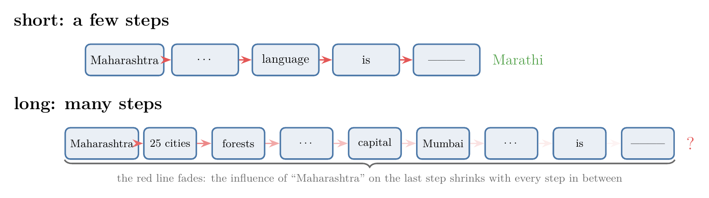
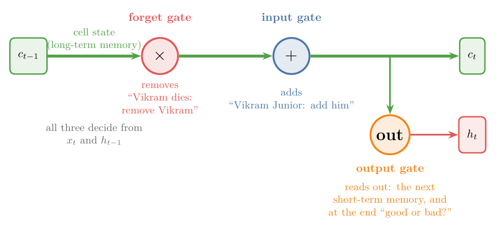
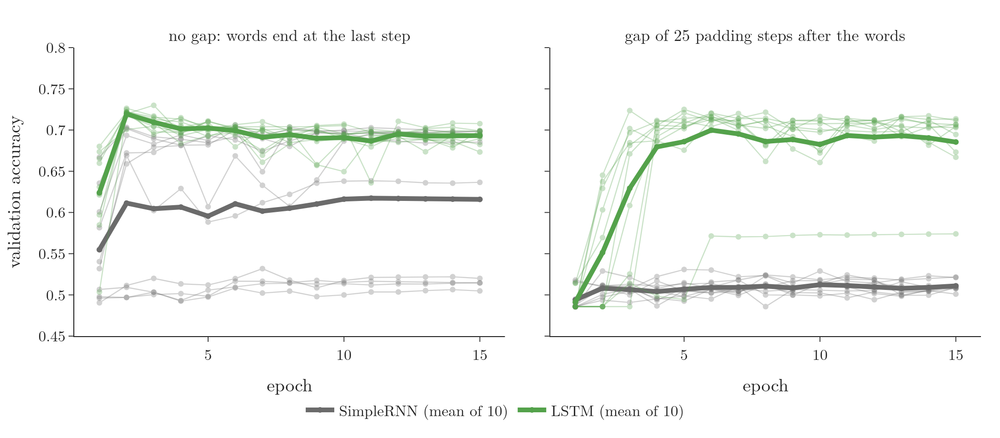

<!-- where-this-fits: generated by course_map/build_map.py; edit concepts.yaml, not this block -->
> **Where this fits:** Pipeline map step 8 (Model). See the [Course map](../../../00-course-map/00-course-map.md).
>
> 
>
> - **Builds on:** [Recurrent neural network (RNN)](../../../DL/05-rnn/DL-055-why-rnn/DL-055-why-rnn.md#1-overview); [Long-term dependency problem](../../../DL/05-rnn/DL-060-problems-with-rnn/DL-060-problems-with-rnn.md#3-the-long-term-dependency-problem); [LSTM gates (forget, input, output) and cell state](../../../DL/05-rnn/DL-062-lstm-architecture/DL-062-lstm-architecture.md#41-cell-state-and-hidden-state-are-vectors-of-the-same-length).
> - **Leads to:** [Next-word prediction with an LSTM](../../../DL/05-rnn/DL-063-lstm-next-word-prediction/DL-063-lstm-next-word-prediction.md#1-overview); [Deep (stacked) RNNs](../../../DL/05-rnn/DL-065-deep-rnns/DL-065-deep-rnns.md#4-the-architecture-of-a-deep-rnn); [Bidirectional RNNs](../../../DL/05-rnn/DL-066-bidirectional-rnn/DL-066-bidirectional-rnn.md#4-how-a-bidirectional-rnn-works); [Sequence-to-sequence (encoder-decoder)](../../../DL/06-transformers/DL-068-encoder-decoder/DL-068-encoder-decoder.md#3-why-sequence-to-sequence-is-hard).
> - **Compare with:** [GRU (gated recurrent unit)](../../../DL/05-rnn/DL-064-gru/DL-064-gru.md#1-overview); [Transformer](../../../DL/06-transformers/DL-071-introduction-to-transformers/DL-071-introduction-to-transformers.md#3-what-a-transformer-is).
<!-- /where-this-fits -->

## 1. Overview

> **Key point:** A long short-term memory network (LSTM) is an RNN with two memory paths instead of one: a long-term memory (the cell state) and a short-term memory (the hidden state), plus a cell that decides what moves between them.

A simple RNN (a network that reads a sequence one step at a time, see [the hidden state carries the sequence forward](../DL-056-rnn-forward-propagation/DL-056-rnn-forward-propagation.md#63-the-hidden-state-carries-the-sequence-forward)) carries everything it remembers along one path, its **hidden state** (a vector, a list of numbers, that sums up what it has read so far), and over long sequences the early inputs fade. A **long short-term memory network** (LSTM; G-1123; Hochreiter and Schmidhuber 1997) adds a second path that is built to keep information for a long time. Information placed on that path stays there until the network decides to remove it.

{width=90%}

Figure 1 shows the difference. This Note builds the intuition; the [building blocks of the LSTM cell](../DL-062-lstm-architecture/DL-062-lstm-architecture.md#4-the-building-blocks) open the cell and give the maths.

## 2. Prerequisites

- [RNN forward propagation](../DL-056-rnn-forward-propagation/DL-056-rnn-forward-propagation.md#63-the-hidden-state-carries-the-sequence-forward): the hidden state carries information from step to step.
- [Problems with RNNs](../DL-060-problems-with-rnn/DL-060-problems-with-rnn.md#3-the-long-term-dependency-problem): why a simple RNN forgets early inputs in long sequences.
- [Why RNNs](../DL-055-why-rnn/DL-055-why-rnn.md#3-sequential-data): sequential data.

## 3. Where a simple RNN fails

> **Key point:** An RNN works on short sentences. When the word to predict depends on a word far back, the RNN has often forgotten it.

An RNN reads a sentence one word per time step, and its hidden state $h_t$ carries the past forward (see [the hidden state carries the sequence forward](../DL-056-rnn-forward-propagation/DL-056-rnn-forward-propagation.md#63-the-hidden-state-carries-the-sequence-forward)). In theory that is enough. In practice, trouble starts when sentences get long.

Take the sentence "Maharashtra is a beautiful state. The language spoken there is \_\_\_\_". The answer, Marathi, depends on the first word, Maharashtra. With only a few words in between, an RNN can manage. Now make it longer: "Maharashtra is a beautiful state. It has 25 cities, beautiful forests, … its capital is Mumbai, … The language spoken there is \_\_\_\_". Many more time steps now separate the blank from Maharashtra, and by the end a simple RNN has largely forgotten what the paragraph was about.

{width=100%}

In Figure 2, compare the two red lines: the answer depends on the first box in both, but only the short chain still delivers it to the blank.

The cause is the **vanishing gradient** (G-2070) problem (the slopes used for learning shrink towards 0 as they travel back through many time steps), taught in [why the gradient vanishes through time](../DL-060-problems-with-rnn/DL-060-problems-with-rnn.md#4-why-the-vanishing-gradient-through-time). The effect is that recent inputs dominate the hidden state, and the influence of early inputs on far-away predictions is small. A simple RNN behaves like someone who has watched a long series but remembers only the latest episodes.

## 4. How we read a story: two kinds of context

> **Key point:** While reading, we keep a short-term context (what is happening right now) and a long-term context (what matters for the whole story). We add to and remove from the long-term context as the story goes.

Read a short story and decide, at the end, whether it is a good story or a bad one: a text classification task, exactly what a sentiment network does.

> A thousand years ago, in the Indian kingdom of Pratapgarh, there lived a king called Vikram: powerful, kind and loved by his people. One day the king of a neighbouring land, XYZ, attacked. Vikram fought bravely and drove XYZ back, but died in the war. Years later his son, Vikram Junior, even stronger than his father, became king and swore revenge. He attacked XYZ, and XYZ killed him too. Vikram Junior's son, Vikram Super Junior, was not strong, but he was clever. At fifteen he attacked XYZ; XYZ almost beat him, but he outwitted XYZ and killed him, avenging his father and grandfather.

Our mind processes such a story word by word, and keeps two kinds of context.

- **Short-term context** (G-1793): what is happening in the story right now.
- **Long-term context** (G-1124): what matters for the story as a whole. The mind builds it from the short-term context, keeping only what seems important.

The long-term context changes as the story goes:

| The story says | Long-term context afterwards |
|---|---|
| a thousand-year-old story | old story (swords, not guns) |
| in Pratapgarh | old story, Pratapgarh |
| a great king, Vikram | old story, Pratapgarh, **Vikram (hero?)** |
| XYZ attacks | old story, Pratapgarh, Vikram, **XYZ (villain)** |
| Vikram dies | old story, Pratapgarh, XYZ (Vikram removed: not the hero) |
| Vikram Junior becomes king | old story, Pratapgarh, XYZ, **Vikram Junior** |
| Vikram Junior is killed | old story, Pratapgarh, XYZ (Vikram Junior removed) |
| Vikram Super Junior kills XYZ | old story, Pratapgarh, XYZ, **Vikram Super Junior** (stays) |

When asked "good or bad?", we answer from the long-term context, not from the last sentence alone.

{width=100%}

In Figure 3, watch the upper lane: "old story" and "Pratapgarh" enter at the start and are still there at the end, while Vikram and Vikram Junior enter and leave again. The gates named in the figure are the subject of section 8.

## 5. Why one path is not enough

> **Key point:** A simple RNN has a single path, the hidden state, for both the long-term and the short-term context. On that one path, the short-term context wins.

In a simple RNN the only way to remember the past is the hidden-state line from one time step to the next. That single line must hold the long-term context and the short-term context at once. Because early contributions fade along the chain (section 3), the recent, short-term content dominates. The network keeps the latest episodes and loses the fact that Vikram was the grandfather.

## 6. The core idea: a second path for long-term memory

> **Key point:** Keep two paths: one for short-term memory, one for long-term memory. At each step, the current input decides what to add to the long-term path and what to remove. Whatever is not removed reaches the end, however long the sequence.

The fix is to run two lines through the network:

- the lower line carries the **short-term memory**, much like the RNN's hidden state;
- the upper line carries the **long-term memory**.

If something important appears at the first time step and is never removed from the long-term line, it reaches the last time step and the output, no matter how long the chain.

Why does the upper line keep things when the lower one does not? On the lower line, every time step pushes the memory through a layer of weights, and many such steps in a row make early information fade (section 3). On the upper line, no weights act on the memory directly. A step can only do two things to it: scale it down to remove something, and add something new. If a step does neither, the memory passes through exactly as it was.

An example with pronouns. A text says "Ankita is a great girl." The next sentence needs a pronoun: "\_\_\_\_ is a state topper." To choose "she", the network must remember that the subject is a girl. So when "Ankita is a great girl" arrives, the short-term memory passes "Ankita, girl" to the long-term memory. Later the text says "Rahul is a cricketer. \_\_\_\_ has scored three centuries this season." Now the long-term memory drops Ankita and girl and stores Rahul and boy, and the pronoun becomes "he". Olah (2015) uses the same picture: the cell state may hold the gender of the current subject, so that the right pronoun can be used, and forgets it when a new subject appears.

{width=100%}

In Figure 4, watch the green lane: it changes only at steps 1 and 3, when a new subject appears, and holds still in between.

> **Extra:** The name "long short-term memory" comes from the original paper (Hochreiter and Schmidhuber 1997). There, "short-term memory" means what a recurrent network stores in its activations (as opposed to "long-term memory" stored in slowly changing weights). An LSTM is a network whose short-term memory lasts long: its stored activations can bridge time lags of more than 1000 time steps on the paper's artificial tasks. The "long-term memory" and "short-term memory" of this Note are the usual teaching picture of the cell state and hidden state.

## 7. Two differences between an RNN and an LSTM

> **Key point:** An LSTM passes two states instead of one, and its cell is more complex, because the two memories must communicate.

Figure 1 puts the two side by side.

1. **Two states instead of one.** An RNN passes only the hidden state. An LSTM passes the hidden state $h_t$ (short-term memory) and the **cell state** (G-361) $c_t$ (long-term memory). This is the first and biggest difference.
2. **A more complex cell.** Inside an RNN cell there is one tanh layer (weights followed by tanh, a function that squeezes every number into the range from $-1$ to $1$). Inside an LSTM cell there is more machinery, because the cell has an extra job: making the two memories talk. When the short-term memory sees that something new and important has arrived, it must tell the long-term memory to add it; when something has become irrelevant, it must tell the long-term memory to remove it.

## 8. The three gates in one line each

> **Key point:** The machinery inside the cell is split into three gates. The forget gate removes from the long-term memory, the input gate adds to it, and the output gate reads from it to produce the output and the next short-term memory.

The parts of the LSTM cell are called **gates** (G-825), and there are three of them. Their maths starts with [the forget gate](../DL-062-lstm-architecture/DL-062-lstm-architecture.md#5-the-forget-gate); here is what each one does, based on the current input and the short-term memory.

| Gate | What it does | In the story |
|---|---|---|
| **Forget gate** (G-793) | decides what to remove from the long-term memory | Vikram dies: remove Vikram |
| **Input gate** (G-950) | decides what new information to add to the long-term memory | Vikram Junior becomes king: add him |
| **Output gate** (G-1422) | decides what to read out of the long-term memory as output, and produces the short-term memory for the next time step | at the end: answer "good or bad" |

{width=100%}

Figure 5 shows the order along the green line: first remove, then add, then read out.

The output gate works at every time step, not only at the end. At the last step it gives the output; at the steps in between, its result is the short-term memory passed to the next step.

## 9. The LSTM cell as a small computer

> **Key point:** Three inputs ($c_{t-1}$, $h_{t-1}$, $x_t$), two outputs ($c_t$, $h_t$), and two jobs inside: update the long-term memory, then compute the short-term memory.

A computer takes input, processes it and gives output. The LSTM cell at time step $t$ does the same.

{width=95%}

Figure 6 shows the cell as a box.

- **Inputs (3):** the previous cell state $c_{t-1}$ (long-term memory), the previous hidden state $h_{t-1}$ (short-term memory), and the current input $x_t$, for example the current word.
- **Processing (2 jobs):**
  1. update the long-term memory: remove old information and add new information, turning $c_{t-1}$ into $c_t$;
  2. compute the new short-term memory $h_t$.
- **Outputs (2):** the new cell state $c_t$ and the new hidden state $h_t$. Both go on to the next time step; $h_t$ can also be the output at this step.

## 10. The two paths at work

> **Key point:** An LSTM keeps an early input in its cell state across later time steps, first in a toy test with two sales series (section 10.1), then on real movie reviews (section 10.2).

### 10.1 A small test with numbers

> **Key point:** Two series are identical on days 2 to 4 and differ only on day 1. The LSTM's long-term memory splits on day 1 and stays split, so it predicts day 5 correctly for both.

Two shops report their daily sales, scaled to lie between 0 and 1. On days 2, 3 and 4 both report the same values: 0.6, 0.3, 0.9. They differ only on day 1: shop A sold 0, shop B sold 1. Day 5 repeats day 1: 0 for A, 1 for B. So the last three inputs say nothing about the answer; a network can only get day 5 right if it still remembers day 1.

We train the smallest possible LSTM on these two sequences, a single unit, so the cell state and the hidden state are one number each. Figure 7 shows them day by day.

{width=100%}

Watch the middle panel. The cell state does not stay at one fixed value: B's grows every day. What survives is the difference between the two shops. On day 1 the long-term memory goes to 0.80 for shop B and to $-0.40$ for shop A. On days 2 to 4 both shops feed in the same numbers, yet the two memories stay apart: B's keeps growing to 3.46 while A's stays between $-0.5$ and 0. After day 4 the short-term memory, which is the prediction for day 5, is 0.99 for B and 0.00 for A, against the true day-5 values 1 and 0. The same happened with all 5 random starts we tried (Notebook).

### 10.2 Real reviews

> **Key point:** On real movie reviews whose words are followed by 25 extra time steps, a SimpleRNN stays at chance in all 10 runs, while an LSTM still learns the sentiment in 9 runs of 10.

We can test the idea on real data too. The task is sentiment analysis of movie reviews from the IMDB dataset (keras.datasets): 5,000 reviews for training and 5,000 for testing, each word turned into a vector (a list of numbers) by an embedding layer, and the **target** (G-1949) (the output we predict) is positive or negative. Each review is one **observation** (G-1374) (one record of the data). **Validation accuracy** is the share of the 5,000 test reviews that the network labels correctly.

The test changes one thing: the distance between the words and the end of the sequence.

- **No gap:** we keep the first 50 words of each review; the last word sits at the last time step.
- **Gap of 25:** the same 50 words, followed by 25 padding steps that carry no information. The network must hold the sentiment for 25 extra steps before it gives its answer.

Both networks have the same embedding, 32 units in the recurrent layer and a [sigmoid](../../../ML/07-classification/ML-071-sigmoid-function/ML-071-sigmoid-function.md#1-overview) output (a function that turns the last number into a probability between 0 and 1); one uses `SimpleRNN`, the other `LSTM`. Each setting is trained 10 times with different seeds (different random starting weights), for 15 [epochs](../../../ML/06-regression/ML-056-gradient-descent/ML-056-gradient-descent.md#23-when-to-stop) (full passes over the training reviews) with the [Adam](../../01-basics/DL-011-customer-churn-ann/DL-011-customer-churn-ann.md#51-compile-loss-and-optimizer) optimizer (the rule that updates the weights).

{width=100%}

Figure 8 and the Notebook give, after 15 epochs (mean ± standard deviation over the 10 runs; the standard deviation says how far a typical run sits from the mean):

| | SimpleRNN | LSTM |
|---|---|---|
| No gap: validation accuracy | 0.62 ± 0.09 | 0.69 ± 0.01 |
| No gap: runs that learned (above 0.6) | 6 of 10 | 10 of 10 |
| Gap of 25: validation accuracy | 0.51 ± 0.01 | 0.69 ± 0.04 |
| Gap of 25: runs that learned (above 0.6) | 0 of 10 | 9 of 10 |

The chance level is 0.51 (the share of the larger class in the test set). With the gap, all ten SimpleRNN runs stay at chance (between 0.50 and 0.52): the sentiment never reaches the last step in a usable form. Nine of the ten LSTM runs reach between 0.67 and 0.71, the same as without the gap. Even without the gap, 50 words is already a long sequence for a SimpleRNN: only 6 of its 10 runs learned, and 4 stayed near chance. Goodfellow §10.7 notes that gradient-based training of a simple RNN becomes very unlikely to succeed once dependencies span only 10 or 20 steps, and §10.10.1 that LSTM networks learn long-term dependencies more easily than simple recurrent networks.

An LSTM is not guaranteed to learn: with the gap, one of its ten runs stopped at 0.57, well below the others. More easily, not always, is what the book claims (Goodfellow §10.10.1), and what the runs show. The mechanism that makes the difference is shown in [how the cell state carries information far](../DL-062-lstm-architecture/DL-062-lstm-architecture.md#64-how-the-cell-state-carries-information-far).

## 11. Summary

| | Simple RNN | LSTM |
|---|---|---|
| States passed between time steps | one: hidden state $h_t$ | two: cell state $c_t$ and hidden state $h_t$ |
| Long-term context | shares the hidden state, fades over long sequences | kept on the cell state until removed |
| Inside the cell | one tanh layer | three gates (forget, input, output) |
| Inputs, outputs per step | $x_t$, $h_{t-1}$ in; $h_t$ out | $x_t$, $h_{t-1}$, $c_{t-1}$ in; $h_t$, $c_t$ out |

- A simple RNN forgets early inputs in long sequences because one path must carry both short-term and long-term context.
- An LSTM adds a second path, the cell state, for long-term memory; the hidden state remains the short-term memory.
- Information on the cell state stays until the network removes it, so it can reach the end of a long sequence.
- The forget gate removes from the cell state, the input gate adds to it, the output gate produces the output and the next hidden state.

## 12. Sources

**Built from**

- CampusX, "LSTM | Long Short Term Memory | Part 1 | The What? | CampusX", YouTube, https://www.youtube.com/watch?v=z7IPBg6MyrU
- StatQuest with Josh Starmer, "Long Short-Term Memory (LSTM), Clearly Explained", YouTube, https://www.youtube.com/watch?v=YCzL96nL7j0 (no weights act directly on the long-term memory; the test with two series that differ only on day 1)

**Other references**

- Hochreiter, S. and Schmidhuber, J. (1997). Long Short-Term Memory. *Neural Computation* 9(8), 1735-1780.
- Goodfellow, I., Bengio, Y. and Courville, A. (2016). *Deep Learning*. MIT Press. §10.7 (long-term dependencies), §10.10.1 (LSTM). deeplearningbook.org/contents/rnn.html.
- Olah, C. (2015). Understanding LSTM Networks. Blog post, colah.github.io/posts/2015-08-Understanding-LSTMs/.
- Keras API documentation: `SimpleRNN` and `LSTM` layers, keras.io/api/layers/recurrent_layers/; IMDB dataset, keras.io/api/datasets/imdb.

## 13. Key terms

| Term | Meaning |
|---|---|
| Long short-term memory (LSTM) | An RNN that passes a cell state (long-term memory) and a hidden state (short-term memory) between time steps, controlled by gates |
| Short-term context | What is happening in the sequence right now |
| Long-term context | What matters for the sequence as a whole, kept from earlier steps |
| Cell state ($c_t$) | The LSTM's long-term memory path |
| Hidden state ($h_t$) | The LSTM's short-term memory path, also its output at each step |
| Gate | A part of the LSTM cell that controls what moves into, out of, or along the cell state |
| Forget gate (G-793) | Removes information from the cell state |
| Input gate (G-950) | Adds new information to the cell state |
| Output gate (G-1422) | Produces the output and the next hidden state from the cell state |
