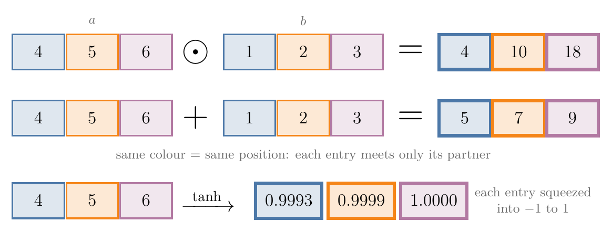
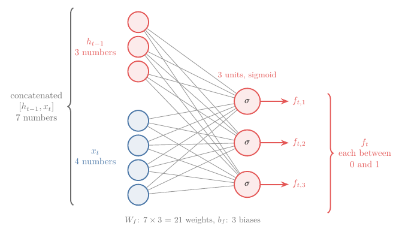
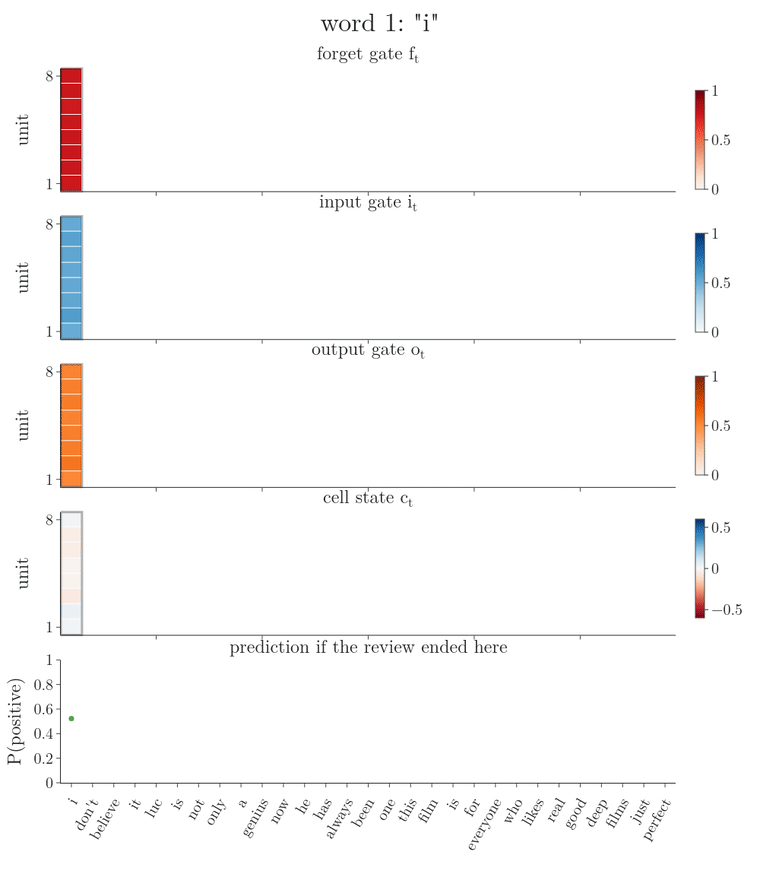

<!-- where-this-fits: generated by course_map/build_map.py; edit concepts.yaml, not this block -->
> **Where this fits:** Pipeline map step 8 (Model). See the [Course map](../../../00-course-map/00-course-map.md).
>
> 
>
> - **Builds on:** [Recurrent neural network (RNN)](../../../DL/05-rnn/DL-055-why-rnn/DL-055-why-rnn.md#1-overview); [Long-term dependency problem](../../../DL/05-rnn/DL-060-problems-with-rnn/DL-060-problems-with-rnn.md#3-the-long-term-dependency-problem).
> - **Leads to:** [Next-word prediction with an LSTM](../../../DL/05-rnn/DL-063-lstm-next-word-prediction/DL-063-lstm-next-word-prediction.md#1-overview); [GRU (gated recurrent unit)](../../../DL/05-rnn/DL-064-gru/DL-064-gru.md#1-overview); [Deep (stacked) RNNs](../../../DL/05-rnn/DL-065-deep-rnns/DL-065-deep-rnns.md#4-the-architecture-of-a-deep-rnn); [Bidirectional RNNs](../../../DL/05-rnn/DL-066-bidirectional-rnn/DL-066-bidirectional-rnn.md#4-how-a-bidirectional-rnn-works); [Sequence-to-sequence (encoder-decoder)](../../../DL/06-transformers/DL-068-encoder-decoder/DL-068-encoder-decoder.md#3-why-sequence-to-sequence-is-hard).
> - **Compare with:** [GRU (gated recurrent unit)](../../../DL/05-rnn/DL-064-gru/DL-064-gru.md#1-overview); [Transformer](../../../DL/06-transformers/DL-071-introduction-to-transformers/DL-071-introduction-to-transformers.md#3-what-a-transformer-is).
<!-- /where-this-fits -->

## 1. Overview

> **Key point:** An LSTM cell uses three gates to manage its two memories. The forget gate removes from the cell state, the input gate adds to it, and the output gate reads from it to make the new hidden state.

The [core idea of the LSTM](../DL-061-lstm/DL-061-lstm.md#6-the-core-idea-a-second-path-for-long-term-memory) is this: an LSTM keeps a long-term memory (the **cell state** (G-361) $c_t$) next to its short-term memory (the **hidden state** (G-891) $h_t$), and a more complex cell lets the two talk to each other. This Note opens that cell. Every part of it is either a small neural network layer or a simple element-by-element operation on vectors.

{width=100%}

Figure 1 is the whole cell. By the end of this Note, every symbol in it has a meaning and a formula.

## 2. Prerequisites

- [Two differences between an RNN and an LSTM](../DL-061-lstm/DL-061-lstm.md#7-two-differences-between-an-rnn-and-an-lstm): cell state and hidden state, three inputs and two outputs.
- [RNN forward propagation: the formulas](../DL-056-rnn-forward-propagation/DL-056-rnn-forward-propagation.md#53-the-formulas): time steps, row vectors, the weight matrices of a recurrent layer.
- [What one node computes](../../01-basics/DL-010-forward-propagation/DL-010-forward-propagation.md#3-what-one-node-computes) and [a layer as one matrix product](../../01-basics/DL-010-forward-propagation/DL-010-forward-propagation.md#4-layer-1-as-one-matrix-product): a layer of nodes computes weights times inputs, plus biases, through an activation.
- [The sigmoid](../../02-training/DL-027-activation-functions/DL-027-activation-functions.md#61-shape-and-slope) (output between 0 and 1) and [tanh](../../02-training/DL-027-activation-functions/DL-027-activation-functions.md#71-shape-and-slope) (output between $-1$ and 1).

## 3. What the cell must do

> **Key point:** Three inputs ($c_{t-1}$, $h_{t-1}$, $x_t$), two outputs ($c_t$, $h_t$), and three jobs: remove from the cell state, add to the cell state, compute the hidden state. One gate does each job.

As [the three gates in one line each](../DL-061-lstm/DL-061-lstm.md#8-the-three-gates-in-one-line-each) showed, the cell at time step $t$ receives the previous cell state $c_{t-1}$, the previous hidden state $h_{t-1}$ and the current input $x_t$. It returns the new cell state $c_t$ and the new hidden state $h_t$. Inside, it does three things, one per gate:

| Gate | Job | Area in Figure 1 |
|---|---|---|
| **Forget gate** (G-793) | remove unneeded information from the cell state | red |
| **Input gate** (G-950) | add new important information to the cell state | blue |
| **Output gate** (G-1422) | compute the hidden state $h_t$ from the cell state | orange |

The forget gate and the input gate together update the cell state, from $c_{t-1}$ to $c_t$. Both decide on the basis of the current input $x_t$ and the previous hidden state $h_{t-1}$.

## 4. The building blocks

> **Key point:** Everything in the cell is a vector of the same length (the number of units), except the input $x_t$. The boxes are neural network layers and the circles are pointwise operations.

### 4.1 Cell state and hidden state are vectors of the same length

> **Key point:** $c_t$ and $h_t$ are vectors, for example $[0.1, 0.95, 0.6]$, and they always have the same number of entries.

Mathematically, $c_t$ and $h_t$ are vectors: lists of numbers. If $h_t$ has 3 numbers, such as $[0.1, 0.95, 0.6]$, then $c_t$ also has exactly 3 numbers (different ones). The rule never breaks in an LSTM. The length is the number of **units** (G-2049) of the layer, a hyperparameter we choose.

### 4.2 The input is a vector of any length

> **Key point:** $x_t$ is the current word turned into a vector. Its length has nothing to do with the number of units.

Take a sentiment task whose reviews use only three words: cat, mat, rat. With one-hot encoding, cat is $[1, 0, 0]$, mat is $[0, 1, 0]$ and rat is $[0, 0, 1]$. The review "cat mat rat" has 3 time steps, and at each one the cell receives one word as $x_t$, exactly as in [words become vectors](../DL-056-rnn-forward-propagation/DL-056-rnn-forward-propagation.md#31-words-become-vectors). Any way of turning a word into a vector works (one-hot, bag of words, TF-IDF, word2vec: different recipes for the same job), and the length of $x_t$ can be larger, smaller or equal to the number of units.

### 4.3 Four more vectors inside

> **Key point:** $f_t$ (forget gate), $i_t$ and $\tilde c_t$ (input gate) and $o_t$ (output gate) all have the same length as $c_t$ and $h_t$.

The cell computes four more vectors:

- $f_t$ in the forget gate;
- $i_t$ and $\tilde c_t$ in the input gate; $\tilde c_t$ is the **candidate cell state** (G-342);
- $o_t$ in the output gate.

All six vectors, $c_t$, $h_t$, $f_t$, $i_t$, $\tilde c_t$ and $o_t$, have the same length. Section 4.5 shows why.

### 4.4 Pointwise operations

> **Key point:** The circles in Figure 1 work element by element: multiply, add, or apply tanh to each entry separately. The result has the same length as the inputs.

A **pointwise operation** (G-1508) (also called element-wise) works on each position of a vector separately. Multiplication and addition take two vectors of the same length; tanh takes one vector. We write pointwise multiplication as $\odot$.

1. **In words:** combine the first entries, then the second entries, and so on.
2. **Formula:**
   $$[a_1, a_2, a_3] \odot [b_1, b_2, b_3]$$
   $$= [a_1 b_1,\ a_2 b_2,\ a_3 b_3]$$
   $$\tanh([a_1, a_2, a_3])$$
   $$= [\tanh a_1,\ \tanh a_2,\ \tanh a_3]$$
3. **Example:** with $a = [4, 5, 6]$ and $b = [1, 2, 3]$:
   $$a \odot b = [4, 10, 18]$$
   $$a + b = [5, 7, 9]$$
   $$\tanh(a) = [0.9993,\ 0.9999,\ 1.0000]$$

tanh squeezes every entry into the range $-1$ to 1, so large values all land close to 1.

{width=90%}

In Figure 2, follow one colour: the result in each position depends only on the inputs in that position.

### 4.5 The boxes are neural network layers

> **Key point:** Each of the four boxes is a fully connected layer: three with a sigmoid activation, one with tanh. All four have the same number of units, and that number is the length of every vector in section 4.3.

Each box in Figure 1 is an ordinary layer of nodes, like a hidden layer of an ANN. Every node computes a weighted sum plus a bias and applies an activation function:

- the forget gate's layer, the input gate's $i_t$ layer and the output gate's layer use the **sigmoid** (written $\sigma$);
- the candidate layer that makes $\tilde c_t$ uses **tanh** (G-1947).

The two activations have different jobs, which is why each layer uses the one it does.

- **The sigmoid gives a share.** It turns any number into a number between 0 and 1: $\sigma(10) = 0.99995$, $\sigma(-5) = 0.007$. An output between 0 and 1 reads as "what fraction to let through": 1 is all of it, 0 is none. The three gate layers decide how much, so they use the sigmoid.
- **tanh gives a value.** It turns any number into a number between $-1$ and 1: $\tanh(2) = 0.96$, $\tanh(-5) = -1.00$. An output that can be positive or negative reads as a value to store. The candidate layer proposes what to store, so it uses tanh.

The number of nodes per layer is a hyperparameter, such as 3 or 128. Whatever we choose, all four layers get the same number. Each layer outputs one number per node, so $f_t$, $i_t$, $\tilde c_t$ and $o_t$ have as many entries as there are units, and so do $c_t$ and $h_t$.

## 5. The forget gate

> **Key point:** A sigmoid layer looks at $h_{t-1}$ and $x_t$ and outputs $f_t$, a number between 0 and 1 for every entry of the cell state. Multiplying $c_{t-1}$ by $f_t$ keeps that fraction of each entry: 1 keeps everything, 0 erases it.

### 5.1 Computing $f_t$

> **Key point:** Join $h_{t-1}$ and $x_t$ into one vector, pass it through a fully connected sigmoid layer: $f_t = \sigma([h_{t-1}, x_t]\thinspace W_f + b_f)$.

Take 3 units and a 4-number input $x_t$. Then $h_{t-1}$ and $c_{t-1}$ have 3 numbers each, because their length equals the number of units.

{width=85%}

Figure 3 draws the layer. Joining two vectors end to end is **concatenation** (G-436), written $[h_{t-1}, x_t]$: here 3 + 4 = 7 numbers. The 7 inputs connect to all 3 nodes, so the layer has 21 weights, collected in the matrix $W_f$, and 3 biases $b_f$:

$$7 \times 3 = 21$$

1. **In words:** concatenate the previous hidden state and the current input, multiply by the forget gate's weights, add its biases and apply the sigmoid.
2. **Formula:**
   $$f_t = \sigma\big([h_{t-1}, x_t]\thinspace W_f + b_f\big)$$
   The shapes multiply as
   $$(1 \times 7)(7 \times 3) = 1 \times 3$$
   The bias is $1 \times 3$ and the sigmoid keeps $1 \times 3$. So $f_t$ has 3 numbers, the same as $c_{t-1}$.
3. **Example:** if the weighted sum for one unit is 2, the sigmoid gives $\sigma(2) = 0.88$, so that entry of $f_t$ is 0.88 and the matching entry of $c_{t-1}$ keeps 88 percent of its value. Section 5.3 works through the forget gate of one unit; section 8 works through all the gates of a 2-unit cell.

### 5.2 Removing from the cell state

> **Key point:** $f_t \odot c_{t-1}$ is the old cell state with each entry scaled by its gate value.

The second step of the forget gate multiplies the old cell state, pointwise, by $f_t$. The result $f_t \odot c_{t-1}$ moves on along the cell-state line.

1. **In words:** keep, from each entry of the old cell state, the fraction given by the matching entry of $f_t$.
2. **Formula:**
   $$f_t \odot c_{t-1}$$
3. **Example:** with $c_{t-1} = [4, 5, 6]$:
   - $f_t = [0.5, 0.5, 0.5]$ gives $[2, 2.5, 3]$: half of the memory is forgotten;
   - $f_t = [1, 1, 1]$ gives $[4, 5, 6]$: nothing is forgotten;
   - $f_t = [0, 0, 0]$ gives $[0, 0, 0]$: everything is erased.

### 5.3 One unit, with numbers

> **Key point:** With one unit every quantity is a single number. An input of 1 gives $f = 0.99$ and keeps almost all of the memory; an input of $-10$ gives $f = 0.00$ and erases it.

Take an LSTM with one unit, so $h_{t-1}$, $c_{t-1}$, $x_t$ and $f_t$ are single numbers. The forget gate's layer has a weight 2.0 for $h_{t-1}$, a weight 1.5 for $x_t$ and a bias 1.0. The cell holds $h_{t-1} = 1$ and the long-term memory $c_{t-1} = 2$.

1. **The input is $x_t = 1$.**
   $$2.0 \times 1 + 1.5 \times 1 + 1.0 = 4.5$$
   $$f_t = \sigma(4.5) = 0.989$$
   $$0.989 \times 2 = 1.98$$
   The gate keeps 1.98 of the memory: almost all of it.
2. **The input is $x_t = -10$.**
   $$2.0 \times 1 + 1.5 \times (-10) + 1.0 = -12$$
   $$f_t = \sigma(-12) = 0.000006$$
   $$0.000006 \times 2 = 0.00$$
   The gate keeps nothing: the memory is erased.

The memory was the same in both cases; only the input changed, and the input decided how much to forget. Figure 4 slides the input from 1 down to $-10$: watch the red point run down the sigmoid curve and the green bar, the kept memory, shrink with it.

{width=100%}

A gate lets something through or stops it. Because the sigmoid keeps every entry of $f_t$ between 0 and 1, $f_t$ decides how much of each entry of $c_{t-1}$ passes, anywhere from 0% to 100%. And $f_t$ itself is decided by the current input and the previous hidden state. In the [story of two kinds of context](../DL-061-lstm/DL-061-lstm.md#4-how-we-read-a-story-two-kinds-of-context), the forget gate is what removes a king from memory once the story reveals his death.

> **Extra:** The first LSTM (Hochreiter and Schmidhuber 1997) had no forget gate: it had only input and output gates, and its cell state could only accumulate. Gers, Schmidhuber and Cummins (2000) added the forget gate, so that a cell can learn to reset itself at the right moments; without resets, the state could grow without limit on long continuous input streams and break the network down. Goodfellow §10.10.1 calls this context-dependent self-loop weight "a crucial addition". The LSTM used today, in Keras and elsewhere, includes the forget gate.

## 6. The input gate

> **Key point:** The input gate proposes new values ($\tilde c_t$, from a tanh layer), filters them ($i_t$, from a sigmoid layer), and adds what passes to the cell state: $c_t = f_t \odot c_{t-1} + i_t \odot \tilde c_t$.

The input gate adds new, important information to the cell state, in three stages. In the story, it is what writes the new king into memory.

### 6.1 Stage 1: the candidate cell state

> **Key point:** A tanh layer turns $[h_{t-1}, x_t]$ into candidate values, each between $-1$ and 1.

The **candidate cell state** $\tilde c_t$ holds the new values the cell might add, based on the current input and the previous hidden state. It comes from a tanh layer with its own weights $W_c$ ($7 \times 3$ in our example) and biases $b_c$:

$$\tilde c_t = \tanh\big([h_{t-1}, x_t]\thinspace W_c + b_c\big)$$

### 6.2 Stage 2: the filter $i_t$

> **Key point:** A sigmoid layer decides, entry by entry, how much of each candidate value gets in.

Not every candidate value deserves a place in the long-term memory. A sigmoid layer with weights $W_i$ and biases $b_i$ computes the filter $i_t$:

$$i_t = \sigma\big([h_{t-1}, x_t]\thinspace W_i + b_i\big)$$

The pointwise product $i_t \odot \tilde c_t$ is the filtered candidate. With $\tilde c_t = [4, 5, 6]$ for illustration and $i_t = [0.5, 0.5, 0.5]$, it is $[2, 2.5, 3]$: half of each candidate value goes in. An $i_t$ of 1 lets all of it in, 0 lets none in.

### 6.3 Stage 3: the new cell state

> **Key point:** Add what the forget gate kept and what the input gate lets in.

1. **In words:** the new long-term memory is the old memory after forgetting, plus the filtered new information.
2. **Formula:**
   $$c_t = f_t \odot c_{t-1} + i_t \odot \tilde c_t$$
3. **Example:** with $f_t \odot c_{t-1} = [2, 2.5, 3]$ and $i_t \odot \tilde c_t = [0.1, 0, 0.3]$:
   $$c_t = [2.1,\ 2.5,\ 3.3]$$

$c_t$ leaves the cell along the green line and becomes $c_{t-1}$ for the next time step.

### 6.4 How the cell state carries information far

> **Key point:** If $f_t = 1$ and $i_t = 0$, then $c_t = c_{t-1}$ exactly. The cell state can carry a value unchanged across any number of time steps.

The trouble with a simple RNN is that information from early words fades as it is passed along the chain (see [the vanishing gradient through time](../DL-060-problems-with-rnn/DL-060-problems-with-rnn.md#4-why-the-vanishing-gradient-through-time)). The cell-state line avoids that. Suppose $c_{t-1} = [4, 5, 6]$, the forget gate is fully open, $f_t = [1, 1, 1]$, and the input gate is closed, $i_t = [0, 0, 0]$:

$$c_t = [1, 1, 1] \odot [4, 5, 6] + [0, 0, 0] \odot \tilde c_t$$
$$c_t = [4, 5, 6] + [0, 0, 0]$$
$$c_t = [4, 5, 6]$$

Nothing is lost. Figure 5 holds the input gate closed for 20 steps and changes only the forget gate. With $f = 1$ the first entry stays at 4. With $f = 0.9$ it keeps 90 percent per step and falls to 0.49 after 20 steps:

$$4 \times 0.9^{20} = 0.49$$

With $f = 0.5$ it is gone after a few steps.

![The first entry of the cell state $[4, 5, 6]$ over 20 time steps with the input gate closed, for three forget-gate values. Only $f = 1$ carries the value unchanged](images/carry.png){width=90%}

If the cell decides at every step that nothing should be removed and nothing added, the information from the beginning of a long sentence reaches its end intact. The gates decide, step by step, how much of the cell state moves on.

The same line is why an LSTM can be trained on long sequences. In a simple RNN the error travelling backwards is multiplied by a weight and an activation slope at every time step, and it fades (see [one factor of the chain](../DL-060-problems-with-rnn/DL-060-problems-with-rnn.md#43-one-factor-of-the-chain)). Along the cell state it is multiplied only by the forget gate, which can stay close to 1. Producing such "paths where the gradient can flow for long durations" is the core contribution of the LSTM (Goodfellow §10.10.1; Hochreiter and Schmidhuber 1997).

> **Extra:** Goodfellow §10.10.1 describes the cell state as having a linear self-loop whose weight is the forget gate. The original paper (Hochreiter and Schmidhuber 1997) reports bridging time lags of more than 1000 discrete time steps on artificial tasks. The test on [real reviews](../DL-061-lstm/DL-061-lstm.md#102-real-reviews) shows the effect.

## 7. The output gate

> **Key point:** Squash the new cell state with tanh, then filter it with $o_t$: $h_t = o_t \odot \tanh(c_t)$.

The output gate computes the hidden state $h_t$. $h_t$ goes to the next time step as the short-term memory, and it can also be the cell's output at this step, depending on the task. So the hidden state is read out of the cell state. The output gate works in two steps.

1. **Squash:** apply tanh pointwise to $c_t$, bringing every entry between $-1$ and 1. The cell state is a running total of everything added to it, so its entries can grow past 1: in section 6.3 they reach 3.3. Squashing keeps $h_t$, which goes on to every gate of the next step, between $-1$ and 1 however large the cell state grows.
2. **Filter:** a sigmoid layer with weights $W_o$ and biases $b_o$ computes $o_t$ from $[h_{t-1}, x_t]$, and multiplies it pointwise with $\tanh(c_t)$.

   $$o_t = \sigma\big([h_{t-1}, x_t]\thinspace W_o + b_o\big)$$
   $$h_t = o_t \odot \tanh(c_t)$$

Shapes: $o_t$ and $\tanh(c_t)$ are both $1 \times 3$, so $h_t$ is $1 \times 3$, the same as $h_{t-1}$, ready for the next time step.

## 8. One time step with numbers

> **Key point:** Six formulas make one LSTM time step. With small hand-picked weights we can follow every number, and Keras gives the same result.

1. **In words:** from $h_{t-1}$ and $x_t$, compute the three gates and the candidate; update the cell state; read the hidden state out of it.
2. **Formula:**
   $$f_t = \sigma\big([h_{t-1}, x_t]\thinspace W_f + b_f\big)$$
   $$i_t = \sigma\big([h_{t-1}, x_t]\thinspace W_i + b_i\big)$$
   $$\tilde c_t = \tanh\big([h_{t-1}, x_t]\thinspace W_c + b_c\big)$$
   $$o_t = \sigma\big([h_{t-1}, x_t]\thinspace W_o + b_o\big)$$
   $$c_t = f_t \odot c_{t-1} + i_t \odot \tilde c_t$$
   $$h_t = o_t \odot \tanh(c_t)$$
3. **Example:** 2 units, vocabulary cat, mat, rat, all biases 0. The cell has $h_{t-1} = [0.3, -0.2]$ and $c_{t-1} = [0.8, -0.5]$, and reads "mat", $x_t = [0, 1, 0]$. So $[h_{t-1}, x_t] = [0.3, -0.2, 0, 1, 0]$. Each weight matrix has 5 rows (for $h_1$, $h_2$, cat, mat, rat) and 2 columns:

   $$W_f = \begin{bmatrix} 0.5 & 0 \cr0 & 0.5 \cr1 & 0 \cr2 & -1 \cr0 & 1 \end{bmatrix}$$

   $$W_i = \begin{bmatrix} 0.2 & 0 \cr0 & 0.2 \cr0.5 & 0.5 \cr-1 & 2 \cr0 & 0 \end{bmatrix}$$

   $$W_c = \begin{bmatrix} 0.1 & 0 \cr0 & 0.1 \cr0.3 & 0.3 \cr0.5 & -1 \cr0 & 0 \end{bmatrix}$$

   $$W_o = \begin{bmatrix} 0.3 & 0 \cr0 & 0.3 \cr0 & 0 \cr1 & 0.5 \cr0 & 0 \end{bmatrix}$$

   Multiplying $[0.3, -0.2, 0, 1, 0]$ by a matrix gives 0.3 times its first row, minus 0.2 times its second row, plus its "mat" row.

   - **Forget gate:**
     $$[0.15, 0] + [0, -0.1] + [2, -1]$$
     $$= [2.15, -1.10]$$
     $$f_t = \sigma([2.15, -1.10])$$
     $$f_t = [0.896, 0.250]$$
   - **Input gate:**
     $$[0.06, 0] + [0, -0.04] + [-1, 2]$$
     $$= [-0.94, 1.96]$$
     $$i_t = [0.281, 0.877]$$
   - **Candidate:**
     $$[0.03, 0] + [0, -0.02] + [0.5, -1]$$
     $$= [0.53, -1.02]$$
     $$\tilde c_t = \tanh([0.53, -1.02])$$
     $$\tilde c_t = [0.485, -0.770]$$
   - **Output gate:**
     $$[0.09, 0] + [0, -0.06] + [1, 0.5]$$
     $$= [1.09, 0.44]$$
     $$o_t = [0.748, 0.608]$$
   - **Cell state:**
     $$f_t \odot c_{t-1}$$
     $$= [0.896 \times 0.8,\ 0.250 \times (-0.5)]$$
     $$= [0.717, -0.125]$$
     $$i_t \odot \tilde c_t$$
     $$= [0.281 \times 0.485,\ 0.877 \times (-0.770)]$$
     $$= [0.136, -0.675]$$
     $$c_t = [0.717 + 0.136,\ -0.125 - 0.675]$$
     $$c_t = [0.853, -0.800]$$
   - **Hidden state:**
     $$\tanh(c_t) = [0.693, -0.664]$$
     $$h_t = [0.748, 0.608] \odot [0.693, -0.664]$$
     $$h_t = [0.518, -0.404]$$

   Unit 1 kept most of its old memory ($f = 0.896$) and added a little. Unit 2 forgot most of its old value ($f = 0.250$) and let in most of a strongly negative candidate ($i = 0.877$). Keras' `LSTM` layer, given these weights and starting states, returns the same $c_t$ and $h_t$ (Notebook).

{height=55%}

In Figure 6, watch unit 2: its forget gate (0.25) wipes most of its old value, and its input gate (0.88) lets in most of a strongly negative candidate, so its cell state turns from $-0.5$ to $-0.8$.

## 9. Counting the parameters

> **Key point:** Four layers, each with (units + input features) × units weights and units biases: $4\thinspace((u + d)\thinspace u + u)$. For 3 units and 4 input features, 96 parameters, four times a SimpleRNN's 24.

With $u$ units and input vectors of $d$ numbers, each of the four layers ($W_f$, $W_i$, $W_c$, $W_o$) has $(u + d) \times u$ weights and $u$ biases.

1. **In words:** count one layer's weights and biases, then multiply by four.
2. **Formula:**
   $$\text{parameters} = 4\thinspace\big((u + d)\thinspace u + u\big)$$
3. **Example:** $u = 3$ units and $d = 4$ input features, as in Figure 3:
   $$4\thinspace\big((3 + 4) \times 3 + 3\big)$$
   $$= 4 \times (21 + 3)$$
   $$= 96$$

Keras counts 96 for `LSTM(3)` on 4 input features, and 24 for `SimpleRNN(3)` on the same input: a simple RNN has one such layer, an LSTM four.

![Where the 96 parameters of `LSTM(3)` on 4 input features come from: four layers, each fully connected from the 7 numbers of $[h_{t-1}, x_t]$ to 3 units, so $7 \times 3$ weights plus 3 biases each](images/param_count.png){width=90%}

Figure 7 shows why the count is exactly four times a SimpleRNN's: the same layer, repeated once per gate and once for the candidate.

> **Python:** An LSTM layer in Keras, and where its weights live.
>
> ```python
> model = keras.Sequential([
>     keras.Input(shape=(None, 4)),   # any number of time steps
>     keras.layers.LSTM(3)])
> model.count_params()                # 96
> kernel, recurrent_kernel, bias = model.layers[0].get_weights()
> # kernel (4, 12): the x_t rows of all four layers
> # recurrent_kernel (3, 12): the h_(t-1) rows
> # bias (12,); columns in the order i, f, c~, o
> ```

> **Extra:** Keras does not store one $7 \times 3$ matrix per gate. It splits every gate's matrix into its $x_t$ rows (the `kernel`) and its $h_{t-1}$ rows (the `recurrent_kernel`), and places the four gates side by side in the order input, forget, candidate, output. Multiplying the concatenation $[h_{t-1}, x_t]$ by the stacked matrix is the same as $h_{t-1}$ times the top rows plus $x_t$ times the bottom rows. Keras also starts the forget gate's biases at 1 instead of 0 (`unit_forget_bias=True`), following Jozefowicz et al. (2015), as stated in the Keras documentation: the forget gate then starts mostly open, $\sigma(1) = 0.73$.

## 10. The gates on a real review

> **Key point:** In a trained LSTM, every gate value is computed fresh for every word. On a real review, the forget gate stays mostly open, while the cell state shifts at the words that carry sentiment.

To see the gates at work, we train a small LSTM on movie reviews from the IMDB dataset (keras.datasets): an embedding layer (16 numbers per word), an `LSTM(8)` layer and a sigmoid output, on 10,000 reviews cut to their last 200 words: 8,000 for training and 2,000 held back for validation. After 3 epochs (3 passes over the training reviews) it classifies 86% of the validation reviews correctly. Then we run one real test review through the trained cell by hand, word by word, and record $f_t$, $i_t$, $o_t$ and $c_t$; the hand computation gives exactly Keras' prediction (Notebook). We chose, among the 21 test reviews of 10 to 30 known words, the one whose running prediction swings the most.

{height=55%}

Figure 8 shows the review "i don't believe it luc is not only a genius now he has always been one this film is for everyone who likes real good deep films just perfect", labelled positive.

- **The forget gate stays mostly open.** Its values lie between 0.65 and 0.86 (mean 0.76) for every unit and every word, so each step keeps most of the cell state and drops a part of it.
- **The cell state moves with the meaning.** Around "not only", several units of $c_t$ turn clearly positive or negative, and the prediction falls from 0.52 to 0.31. From "good deep films" to "perfect" other units swing strongly, and the prediction climbs to 0.81.
- **The prediction comes from the cell state.** The output layer sees only $h_t = o_t \odot \tanh(c_t)$, so the shifts in $c_t$ are what move the prediction.

The gates of this small model vary only a little from word to word; the large changes come from the cell state, which adds up the filtered candidates over many words.

## 11. Summary

| Part | Formula | Activation | Job |
|---|---|---|---|
| Forget gate | $f_t = \sigma([h_{t-1}, x_t] W_f + b_f)$ | sigmoid | how much of each entry of $c_{t-1}$ to keep |
| Input gate | $i_t = \sigma([h_{t-1}, x_t] W_i + b_i)$ | sigmoid | how much of each candidate value to add |
| Candidate cell state | $\tilde c_t = \tanh([h_{t-1}, x_t] W_c + b_c)$ | tanh | the new values that could be added |
| Output gate | $o_t = \sigma([h_{t-1}, x_t] W_o + b_o)$ | sigmoid | how much of $\tanh(c_t)$ to show |
| Cell state | $c_t = f_t \odot c_{t-1} + i_t \odot \tilde c_t$ | none | the long-term memory |
| Hidden state | $h_t = o_t \odot \tanh(c_t)$ | tanh | the short-term memory and output |

- All vectors inside the cell have length equal to the number of units; only $x_t$ can differ, because each of the four layers outputs one number per unit.
- The four boxes are fully connected layers on the concatenation $[h_{t-1}, x_t]$; the circles are pointwise operations. The three gate layers use the sigmoid to give a share from 0 to 1; the candidate layer uses tanh to give a value from $-1$ to 1.
- The forget gate removes from the cell state, the input gate adds to it, the output gate reads the hidden state out of it, so the current input and the previous hidden state decide, step by step, what the long-term memory keeps.
- With $f_t = 1$ and $i_t = 0$, the cell state passes through unchanged, so information can travel far, and the error can flow back far during training.
- An LSTM layer has $4((u + d)u + u)$ parameters, four times a SimpleRNN with the same sizes, because it has four such layers where a SimpleRNN has one.

## 12. Sources

**Built from**

- CampusX, "LSTM Architecture | Part 2 | The How? | CampusX", YouTube, https://www.youtube.com/watch?v=Akv3poqqwI4
- StatQuest with Josh Starmer, "Long Short-Term Memory (LSTM), Clearly Explained", YouTube, https://www.youtube.com/watch?v=YCzL96nL7j0 (the sigmoid as the share to keep and tanh as a value; a one-unit forget gate with numbers)

**Other references**

- Hochreiter, S. and Schmidhuber, J. (1997). Long Short-Term Memory. *Neural Computation* 9(8), 1735-1780.
- Gers, F. A., Schmidhuber, J. and Cummins, F. (2000). Learning to Forget: Continual Prediction with LSTM. *Neural Computation* 12(10), 2451-2471.
- Goodfellow, I., Bengio, Y. and Courville, A. (2016). *Deep Learning*. MIT Press. §10.10.1 (LSTM). deeplearningbook.org/contents/rnn.html.
- Olah, C. (2015). Understanding LSTM Networks. Blog post, colah.github.io/posts/2015-08-Understanding-LSTMs/ (the style of the cell diagram).
- Keras API documentation: `LSTM` layer, keras.io/api/layers/recurrent_layers/lstm (default activations, `unit_forget_bias`, citing Jozefowicz, R., Zaremba, W. and Sutskever, I. (2015), An Empirical Exploration of Recurrent Network Architectures, ICML 2015).
- Keras API documentation: IMDB movie review sentiment classification dataset, keras.io/api/datasets/imdb.

## 13. Key terms

| Term | Meaning |
|---|---|
| Cell state ($c_t$) | The LSTM's long-term memory, a vector passed along the top line of the cell |
| Hidden state ($h_t$) | The LSTM's short-term memory and output at time $t$ |
| Units | The number of nodes in each of the four layers; the length of $c_t$, $h_t$ and every gate vector |
| Forget gate ($f_t$) | Sigmoid layer whose output scales each entry of $c_{t-1}$, removing information |
| Input gate ($i_t$) | The LSTM gate that adds new important information to the cell state: a sigmoid layer whose outputs, between 0 and 1, scale the candidate values before they are added. |
| Candidate cell state ($\tilde c_t$) | Output of the tanh layer: new values that could be added to the cell state |
| Output gate ($o_t$) | The LSTM gate that decides how much of the cell's memory to show as the new hidden state: a sigmoid layer gives $o_t$, between 0 and 1, which scales $\tanh(c_t)$ to give $h_t$. |
| Gate | A sigmoid output between 0 and 1 that sets what fraction of a value passes |
| Pointwise operation | An operation done entry by entry on vectors of the same length, such as $\odot$ |
| Concatenation ($[h_{t-1}, x_t]$) | Joining two vectors end to end into one longer vector, so one layer can read both at once: 3 numbers and 4 numbers give 7. |
