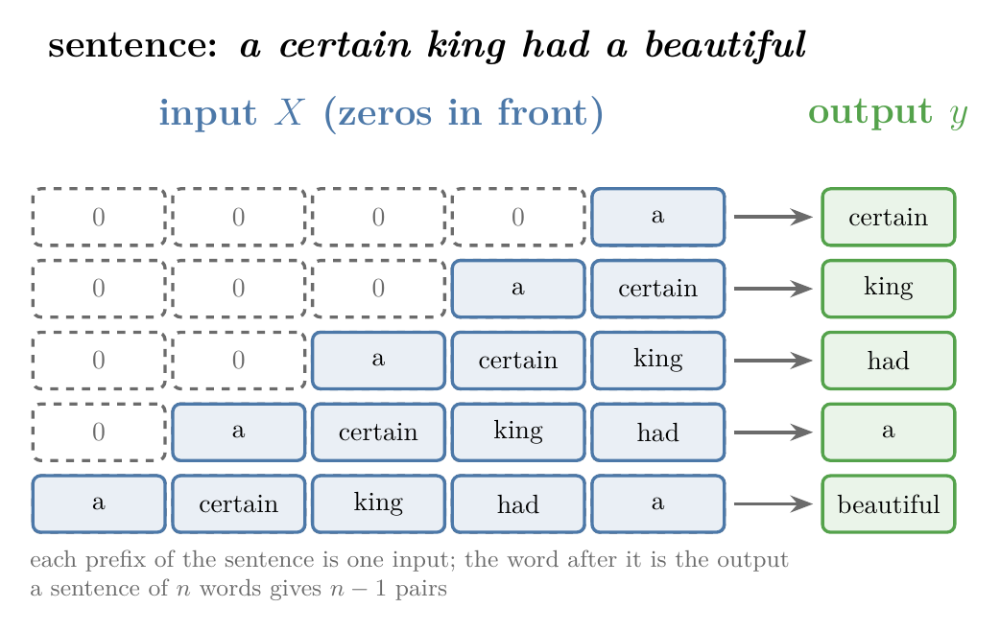
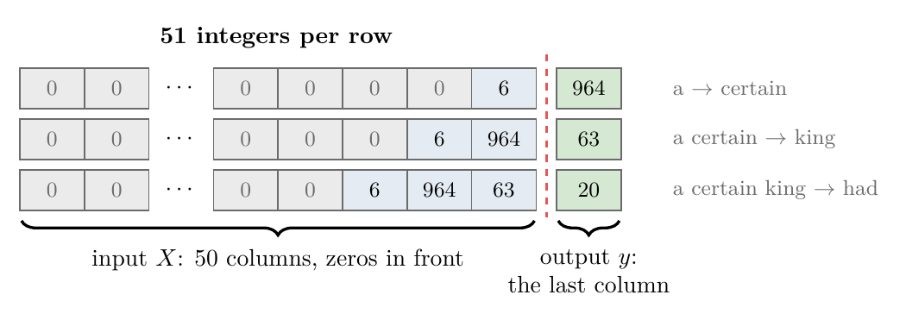
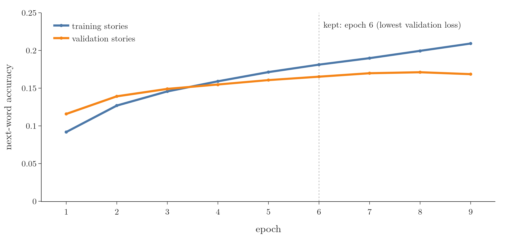
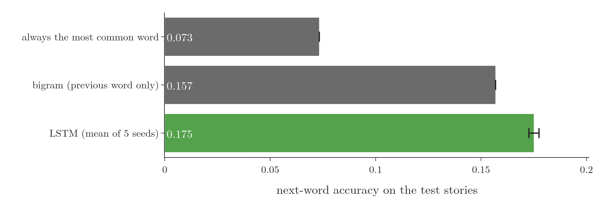

<!-- where-this-fits: generated by course_map/build_map.py; edit concepts.yaml, not this block -->
> **Where this fits:** Pipeline map step 8 (Model). See the [Course map](../../../00-course-map/00-course-map.md).
>
> 
>
> - **Builds on:** [Recurrent neural network (RNN)](../../../DL/05-rnn/DL-055-why-rnn/DL-055-why-rnn.md#1-overview); [Word embeddings](../../../DL/05-rnn/DL-057-rnn-sentiment-analysis/DL-057-rnn-sentiment-analysis.md#6-word-embeddings); [Long-term dependency problem](../../../DL/05-rnn/DL-060-problems-with-rnn/DL-060-problems-with-rnn.md#3-the-long-term-dependency-problem); [LSTM gates (forget, input, output) and cell state](../../../DL/05-rnn/DL-062-lstm-architecture/DL-062-lstm-architecture.md#41-cell-state-and-hidden-state-are-vectors-of-the-same-length).
> - **Leads to:** [Deep (stacked) RNNs](../../../DL/05-rnn/DL-065-deep-rnns/DL-065-deep-rnns.md#4-the-architecture-of-a-deep-rnn); [Bidirectional RNNs](../../../DL/05-rnn/DL-066-bidirectional-rnn/DL-066-bidirectional-rnn.md#4-how-a-bidirectional-rnn-works); [Sequence-to-sequence (encoder-decoder)](../../../DL/06-transformers/DL-068-encoder-decoder/DL-068-encoder-decoder.md#3-why-sequence-to-sequence-is-hard).
> - **Compare with:** [GRU (gated recurrent unit)](../../../DL/05-rnn/DL-064-gru/DL-064-gru.md#1-overview); [Transformer](../../../DL/06-transformers/DL-071-introduction-to-transformers/DL-071-introduction-to-transformers.md#3-what-a-transformer-is).
<!-- /where-this-fits -->

## 1. Overview

> **Key point:** A next-word predictor turns text generation into supervised learning: every beginning of a sentence is an input, and the word that follows it is the output. An Embedding layer, an LSTM and a softmax layer then learn to pick the most likely next word from the vocabulary. On stories it has never seen, the trained model beats simple guessing rules.

A **next-word predictor** (G-1322) takes some text and suggests the word that comes next. Phone keyboards that suggest the next word while we type, e-mail tools that suggest how to finish a sentence and code completion tools all do this.

Repeated, it becomes a **text generator** (G-1964): predict a word, add it to the text, predict the next one, and so on. This Note builds one with an LSTM in Keras, on a real public-domain book: Grimms' Fairy Tales.

{width=100%}

Figure 1 shows the whole model. The rest of the Note builds the training data for it, trains it, and makes it write.

## 2. Prerequisites

- [The cell state and hidden state of an LSTM](../DL-061-lstm/DL-061-lstm.md#9-the-lstm-cell-as-a-small-computer), and [how its parameters are counted](../DL-062-lstm-architecture/DL-062-lstm-architecture.md#9-counting-the-parameters): what an LSTM layer computes.
- [Integer encoding](../DL-057-rnn-sentiment-analysis/DL-057-rnn-sentiment-analysis.md#3-integer-encoding), [padding to one length](../DL-057-rnn-sentiment-analysis/DL-057-rnn-sentiment-analysis.md#42-cutting-every-review-to-50-words) and [the Embedding layer](../DL-057-rnn-sentiment-analysis/DL-057-rnn-sentiment-analysis.md#6-word-embeddings): integer encoding with `TextVectorization`, padding with `pad_sequences`, and the `Embedding` layer.
- [Many-to-one](../DL-058-types-of-rnn/DL-058-types-of-rnn.md#3-many-to-one): a many-to-one RNN reads a sequence and gives one output.
- [Categorical cross-entropy](../../01-basics/DL-014-dl-loss-functions/DL-014-dl-loss-functions.md#9-categorical-cross-entropy): categorical cross-entropy for several classes.
- [One-hot encoding](../../../ML/03-feature-engineering/ML-026-one-hot-encoding/ML-026-one-hot-encoding.md#22-one-column-per-category): a category becomes a vector with a single 1.

## 3. Text generation as a supervised learning problem

> **Key point:** We cannot train a model on raw text, but we can cut the text into pairs: the first words of a sentence (input) and the word right after them (output). A model trained on these pairs learns to predict the next word.

### 3.1 Supervised learning needs input-output pairs

> **Key point:** Supervised learning trains a model on data where every input comes with its correct output. Plain text has no such pairs, so we make them.

In **supervised learning** (G-1919), every **observation** (G-1374; one record of the data) has an input and a **target** (G-1949; the output we predict). The model learns the mapping from input to target, then predicts the target for new inputs. A text is only a list of sentences. To use supervised learning, we must create the pairs from the text itself.

### 3.2 Every prefix predicts its next word

> **Key point:** A sentence of $n$ words gives $n - 1$ pairs: the first word predicts the second, the first two predict the third, and so on.

Take the sentence "a certain king had a beautiful garden". We read it word by word:

- input "a", output "certain";
- input "a certain", output "king";
- input "a certain king", output "had";
- and so on, until input "a certain king had a beautiful", output "garden".

Each input is a **prefix** (G-1555) of the sentence (its first few words), and its output is the next word. We repeat this for every sentence of the text and collect all the pairs into one dataset.

{width=95%}

Figure 2 shows the pairs. A prefix is also called an **n-gram** (G-1287): a sequence of $n$ consecutive words.

## 4. Preparing the data

> **Key point:** Four steps: give every word a number, make the prefix pairs, pad them to one length with zeros in front, and split each row into input (all but the last number) and output (the last number).

### 4.1 The text

> **Key point:** Grimms' Fairy Tales, 62 stories and about 100,000 words. 50 stories train the model, 6 decide when to stop training, and 6 are kept aside to test it on stories it has never seen.

The text is *Grimms' Fairy Tales* by Jacob and Wilhelm Grimm, in English, a public-domain book from Project Gutenberg (eBook 2591). It has 62 stories and 100,599 words; the folder's `data/grimm.txt` holds them, one story per line.

We split the stories into three groups, so that the model is always judged on text it has not trained on:

| Group | Stories | Sentences | Used for |
|---|---|---|---|
| Training | 50 | 2,087 | fitting the weights |
| Validation | 6 (every 10th, from the 9th) | 345 | deciding when to stop training (section 7) |
| Test | 6 (every 10th, from the 10th) | 337 | the final score, used once |

Every story is split into sentences at a full stop, question mark or exclamation mark followed by a space.

### 4.2 A number for every word

> **Key point:** `TextVectorization` builds the vocabulary from the training sentences and replaces every word by its index. We keep the 3,000 most frequent words; every other word becomes `[UNK]`.

A model needs numbers, so every word gets an integer, as in [integer encoding](../DL-057-rnn-sentiment-analysis/DL-057-rnn-sentiment-analysis.md#3-integer-encoding). We build the vocabulary from the training sentences only. They contain 4,288 different words; `TextVectorization(max_tokens=3000)` keeps 3,000 entries: index 0 is the padding value, index 1 is `[UNK]`, the **out-of-vocabulary (OOV) token** (G-1416) for any word outside the vocabulary, and the 2,998 most frequent words follow ("the" is 2, "and" is 3).

The first sentence, "A certain king had a beautiful garden, and in the garden stood a tree which bore golden apples.", becomes

$$[6, 964, 63, 20, 6, 141, 263, 3, 14,$$
$$2, 263, 212, 6, 158, 75, 1211, 184, 727]$$

since `TextVectorization` lower-cases the text and removes punctuation first.

### 4.3 The prefix pairs

> **Key point:** A loop over each sentence's integers keeps the first $i + 1$ numbers for $i = 1, 2, \dots$: 72,589 training pairs.

For each sentence, a loop takes the first 2 integers, then the first 3, and so on up to the whole sentence. The last number of each slice is the output; the others are the input.

| Sequence | Input | Output |
|---|---|---|
| $[6, 964]$ | a | certain |
| $[6, 964, 63]$ | a certain | king |
| $[6, 964, 63, 20]$ | a certain king | had |

A pair whose output is `[UNK]` is dropped: no model can name a word that is not in its vocabulary. That removes 5.6% of the test pairs. The sentences give 72,589 training pairs, 11,135 validation pairs and 11,366 test pairs.

> **Python:** Building the sequences. `to_ids` turns a sentence into its list of integers.
>
> ```python
> sequences = []
> for s in train_sentences:
>     ids = to_ids(s)
>     for i in range(1, len(ids)):
>         if ids[i] != 1:              # skip [UNK] outputs
>             sequences.append(ids[:i + 1])
> ```

### 4.4 Padding with zeros in front

> **Key point:** Every sequence is brought to 51 integers: zeros in front of the short ones, and the long ones cut from the front. The last input word always sits right before the output.

The sequences have different lengths; the longest has 259 integers. We give every input the last 50 words before its output: `keras.utils.pad_sequences(sequences, maxlen=51, padding="pre", truncating="pre")` adds zeros at the start of every shorter sequence (padding and its cost are covered in [zero padding wastes most of the network](../DL-055-why-rnn/DL-055-why-rnn.md#52-zero-padding-wastes-most-of-the-network)) and cuts the start of every longer one. Only 16.1% of the training pairs have more than 50 input words. The first sequence $[6, 964]$ becomes 49 zeros followed by $6, 964$ (Figure 3, top row).

Padding in front keeps the real words at the end of every row. The last real word of the input is then always the last time step the LSTM reads, right before it predicts.

### 4.5 Input and output

> **Key point:** All columns but the last are the input $X$; the last column is the output $y$. $X$ has shape $(72589, 50)$.

Every padded row holds an input followed by its output, so we split it at the last column (Figure 3):

{width=95%}


- $X$ = all columns except the last: shape $(72589, 50)$ (72,589 rows, 50 columns), 50 time steps per observation;
- $y$ = the last column: shape $(72589,)$, one word index per observation.

> **Python:** Splitting the padded rows.
>
> ```python
> padded = keras.utils.pad_sequences(sequences, maxlen=51,
>                                    padding="pre", truncating="pre")
> X, y = padded[:, :-1], padded[:, -1]
> ```

## 5. Regression or classification?

> **Key point:** The output is a word index, a number, but the numbers are labels, not quantities. Predicting the next word is a multi-class classification problem with one class per vocabulary word.

### 5.1 Why not regression

> **Key point:** A regression model could output 2.7, and no word has the index 2.7.

The output $y$ is a number, so the task looks like regression. But the number 2 only names the word "the"; 2.7 means nothing, and a regression model can output any real number. The numbers are categories, so the task is **classification** (G-395): with 3,000 possible words, it is **multi-class classification** (G-1266). Figure 4a shows the problem with a number: 2.7 lies between "the" and "and" and names neither.

### 5.2 One-hot targets

> **Key point:** Each target becomes a one-hot vector of length 3,000; the model outputs 3,000 probabilities, and the largest one names the predicted word.

We replace every target by its one-hot vector (see [one column per category](../../../ML/03-feature-engineering/ML-026-one-hot-encoding/ML-026-one-hot-encoding.md#22-one-column-per-category)): 3,000 numbers, all 0 except a 1 at the word's index. The output layer, a **softmax output layer** (G-1832), then has 3,000 nodes with a softmax activation. The softmax gives 3,000 probabilities that add up to 1, one per vocabulary word, and the predicted word is the one with the highest probability. Figure 4b shows both for the prefix "but": the target puts all its weight on the real next word, and the trained model spreads its probability over likely words, with the most on that word.

{width=100%}

> **Python:** One-hot targets with `to_categorical` (G-151).
>
> ```python
> Y = keras.utils.to_categorical(y, num_classes=3000)
> print(Y.shape)        # (72589, 3000)
> ```

`num_classes` must be the vocabulary size including index 0, because `to_categorical` expects class indices from 0 to `num_classes` $- 1$ (Keras documentation, `to_categorical`). `TextVectorization`'s vocabulary already counts index 0, so its length, 3,000, is the right value.

> **Extra:** Older code builds the vocabulary with the legacy `Tokenizer` (see [tokenizing in Keras](../DL-057-rnn-sentiment-analysis/DL-057-rnn-sentiment-analysis.md#32-tokenizing-in-keras)). Its `word_index` numbers the words from 1 and does not list 0 (Keras source, `keras/src/legacy/preprocessing/text.py`), so `num_classes` must be `len(word_index) + 1`: with 282 words, 283. With 282, the class indices would run from 0 to 281, and the last word, index 282, would not fit.

## 6. The model: Embedding, LSTM, Dense

> **Key point:** Three layers: Embedding (each word index becomes 100 numbers), LSTM with 150 units (reads the 50 time steps), Dense with 3,000 softmax nodes (one probability per word). 903,600 parameters in total.

### 6.1 The three layers

> **Key point:** The Embedding layer gives the LSTM dense word vectors; the LSTM's last hidden state summarises the prefix; the Dense layer turns that summary into word probabilities.

Figure 1 shows the data flow for one observation.

1. **Embedding.** The input is 50 integers, often many of them padding zeros: a sparse representation. The Embedding layer (see [word embeddings](../DL-057-rnn-sentiment-analysis/DL-057-rnn-sentiment-analysis.md#6-word-embeddings)) replaces each integer by a learned vector of 100 numbers, so one observation of shape $(50,)$ becomes $(50, 100)$.
2. **LSTM.** The LSTM reads the 50 vectors one time step at a time. After the last one it outputs its hidden state $h_{50}$, 150 numbers, one per unit (see [the output gate](../DL-062-lstm-architecture/DL-062-lstm-architecture.md#7-the-output-gate)). This is a many-to-one RNN.
3. **Dense.** $h_{50}$ goes to a layer of 3,000 nodes with a softmax activation, which gives one probability per vocabulary word.

The model is compiled with the **categorical cross-entropy** (G-349) loss (the loss for multi-class classification with one-hot targets; see [categorical cross-entropy](../../01-basics/DL-014-dl-loss-functions/DL-014-dl-loss-functions.md#9-categorical-cross-entropy)), the Adam optimizer (a version of gradient descent that adapts its step size), and accuracy (the share of correct predictions) as the metric.

> **Python:** The model.
>
> ```python
> model = keras.Sequential([
>     keras.Input(shape=(50,)),
>     keras.layers.Embedding(3000, 100),
>     keras.layers.LSTM(150),
>     keras.layers.Dense(3000, activation="softmax")])
> model.compile(loss="categorical_crossentropy",
>               optimizer="adam", metrics=["accuracy"])
> ```

The number of time steps comes from `keras.Input(shape=(50,))`; Keras 3's `Embedding` no longer takes an `input_length` argument (see [the model](../DL-057-rnn-sentiment-analysis/DL-057-rnn-sentiment-analysis.md#51-the-model)).

### 6.2 Counting the parameters

> **Key point:** the three layer totals add up to the model's parameter count:
>
> $$300{,}000 + 150{,}600 + 453{,}000$$
>
> $$= 903{,}600$$

| Layer | Formula | Parameters |
|---|---|---|
| Embedding | vocabulary × vector size $= 3000 \times 100$ | 300,000 |
| LSTM | $4\thinspace((u + d)\thinspace u + u)$ with $u = 150$, $d = 100$ | 150,600 |
| Dense | $150 \times 3000$ weights $+ 3000$ biases | 453,000 |
| **Total** | | **903,600** |

The LSTM row uses the [parameter count of an LSTM](../DL-062-lstm-architecture/DL-062-lstm-architecture.md#9-counting-the-parameters):

$$(150 + 100) \times 150 + 150 = 37{,}650$$
$$4 \times 37{,}650 = 150{,}600$$

`model.summary()` gives the same numbers (Notebook).

## 7. Training, and how good the model is

> **Key point:** On 6 stories it has never seen, the LSTM names the next word correctly 17.5% of the time. Always guessing "the" gets 7.3%, and guessing from the previous word alone gets 15.7%. The model has learned patterns of the language that carry over to new text.

### 7.1 Training with early stopping

> **Key point:** We train until the validation loss stops falling, and keep the weights of the best epoch.

We train with batch size 64 (64 pairs per weight update) and check the model after every epoch on the validation pairs. **Early stopping** (G-656; see [early stopping in Keras](../../02-training/DL-022-early-stopping/DL-022-early-stopping.md#4-early-stopping-in-keras)) ends training once the validation loss has not improved for 3 epochs, and restores the weights of the epoch with the lowest validation loss. The whole run is repeated with 5 seeds.

{width=100%}

Figure 5 shows one run: the horizontal axis is the epoch and the vertical axis is the next-word accuracy, blue on the training stories and orange on the validation stories; the dotted line marks epoch 6. After epoch 6 the blue accuracy keeps rising (about 0.18 to 0.21) while the orange one stays flat and then dips (about 0.17 at epochs 7 and 8, 0.169 at epoch 9). The figure plots accuracy; the losses behave the same way. Every seed keeps epoch 6. After it, the training loss keeps falling (from 4.35 to 3.95 by epoch 9) while the validation loss rises (from 4.75 to 4.83): the model starts to fit details of the training stories that do not hold in new ones, the beginning of **overfitting** (G-1429; see [why neural networks overfit](../../02-training/DL-026-regularization-in-dl/DL-026-regularization-in-dl.md#3-why-neural-networks-overfit)). Early stopping keeps the weights from before that point.

### 7.2 Comparing with simple guessing rules

> **Key point:** A score means something only next to a **baseline** (G-2270). The LSTM beats both baselines in every one of its 5 runs.

A next-word accuracy of 17.5% sounds low, so we compare it with two simple rules, both built from the training pairs and scored on the same test pairs:

- **Most common word:** always guess the most frequent next word, "the".
- **Bigram:** guess the word that most often follows the previous word in the training text (a **bigram** (G-2269) is a pair of consecutive words). If the previous word never appeared, guess "the".

{width=95%}

Figure 6 and the Notebook give:

| Method | Test accuracy |
|---|---|
| Always "the" | 0.073 |
| Bigram (previous word only) | 0.157 |
| LSTM, mean of 5 seeds | **0.175** (from 0.172 to 0.178) |

The LSTM is right more than twice as often as always guessing "the", and every one of its 5 runs beats the bigram rule. The test stories are not in the training data, so these right answers come from patterns that carry over to new text.

The bigram rule sees only one word back; the LSTM reads up to 50. On the test pairs where the bigram guess is wrong, the LSTM (seed 0) is still right 6.7% of the time. Its accuracy on the training pairs at the kept epoch, about 0.18, is close to its test accuracy, so it is not merely reciting the training text.

## 8. Predicting the next word

> **Key point:** Encode the text, pad it in front to 50, run the model, take the index with the highest probability, and look the word up in the vocabulary.

### 8.1 One word

> **Key point:** Four steps: integers, padding, probabilities, argmax.

1. **Encode** the text with the same `TextVectorization` layer, which turns each word into its index.
2. **Pad** it in front to 50 integers, exactly as in training.
3. **Predict:** `model.predict` returns 3,000 probabilities.
4. **Pick** the index with the highest probability with `np.argmax`, and look up its word in the vocabulary. Index 0 (padding) and index 1 (`[UNK]`) are skipped.

For "a certain king had a beautiful garden and in the", the model answers "door", with probability 0.019. This sentence opens the first story, which is one of the 50 training stories, so the model has trained on this very prefix. Even so it answers wrong: the real story continues "garden". A right answer here would not have shown much either; section 7 measures the model on test stories it has never seen.

> **Python:** One prediction.
>
> ```python
> def next_word(text):
>     ids = keras.utils.pad_sequences([to_ids(text)], maxlen=50,
>                                     padding="pre", truncating="pre")
>     p = model.predict(ids, verbose=0)[0]   # 3000 probabilities
>     p[:2] = 0                              # skip padding and [UNK]
>     return vocab[np.argmax(p)]
> ```

`vocab = vectorizer.get_vocabulary()` is the list of words, so `vocab[i]` is the word with index $i$.

{width=100%}

In Figure 7, watch the guesses change with each word: after "but" the model guesses "the", "he" and "she"; after "but the" it guesses nouns of the stories such as "king" and "wolf". The real next word is among the five guesses at 3 of the 7 steps ("the" first, "said" fourth, "me" second); a new subject such as "fish" ranks 642nd.

### 8.2 Many words: text generation

> **Key point:** Add the predicted word to the text and predict again. Ten repetitions write ten words.

To write more than one word, we loop: predict the next word, append it to the text, and feed the longer text back in. Figure 8 runs the loop for the prompt "the wolf".


> **Python:** Ten words, one at a time.
>
> ```python
> for _ in range(10):
>     text = text + " " + next_word(text)
> ```

The Notebook's results, with the model of seed 0:

| Prompt | The next 10 words |
|---|---|
| a certain king had a beautiful garden and in the | door and the king was very glad to be seen |
| the king | was very angry and said to the king said the |
| the wolf | was very angry and said to the king said the |
| once upon a time | he was very angry and said to the king said |
| the old woman said | to the king said the cat said the cat said |

The words form short phrases typical of the stories, such as "was very angry" (9 times in the book). Longer stretches, such as "the king was very glad", are not copied from the book: that phrase does not occur in it.

The text is also repetitive: different prompts lead into the same phrase, and "said the cat said the cat" loops. Always taking the most likely word is known to produce bland and strangely repetitive text, even with large neural language models (Holtzman et al. 2020). Their remedy is to pick the next word at random from the small set of most likely words (nucleus sampling).

## 9. Making the predictor better

> **Key point:** Two directions: tune the hyperparameters, or change the architecture.

1. **Hyperparameter tuning** (G-909). The vocabulary size (3,000 here), the number of LSTM units (150), the size of the word vectors (100), the optimizer, the learning rate and the number of epochs can all be changed, and each choice judged on the validation stories, the **validation set** (G-2067).
2. **Other architectures.** Several LSTM layers stacked on each other ([deep RNNs](../DL-065-deep-rnns/DL-065-deep-rnns.md#4-the-architecture-of-a-deep-rnn)) or the GRU ([the four steps of the GRU](../DL-064-gru/DL-064-gru.md#8-the-four-steps-of-the-gru)) can be compared in the same way.

## 10. Summary

| Step | What we do | Result here |
|---|---|---|
| Text | Grimms' Fairy Tales, split by story into training, validation and test | 2,087 / 345 / 337 sentences |
| Vocabulary | `TextVectorization(max_tokens=3000)` on the training sentences | 3,000 entries, rare words become `[UNK]` |
| Pairs | every prefix of a sentence, with its next word | 72,589 training pairs |
| Padding | zeros in front, the last 50 words kept | $X$: $(72589, 50)$ |
| Targets | one-hot over the vocabulary | $Y$: $(72589, 3000)$ |
| Model | Embedding(100), LSTM(150), Dense(3000, softmax) | 903,600 parameters |
| Training | early stopping on the validation loss, 5 seeds | test accuracy 0.175, against 0.157 for the bigram rule |

- A next-word predictor makes text generation a supervised problem: every prefix of a sentence is an input, its next word the target, because supervised learning needs input-output pairs and plain text has none.
- The target is a word, so the task is multi-class classification with one class per vocabulary word, because the word indices are labels, not quantities: a regression output such as 2.7 names no word.
- Padding goes in front, so the last input word is the last time step the LSTM reads, right before it predicts.
- Prediction: encode, pad, predict, argmax, look up; generation repeats this and appends each new word; always taking the most likely word makes the text repetitive.
- Judge the model on text it has never seen, against simple baselines: here it beats always guessing "the" and guessing from the previous word, so its right answers come from patterns of the language that carry over to new text.

## 11. Sources

**Built from**

- CampusX, "LSTM | Part 3 | Next Word Predictor Using | CampusX", YouTube, https://www.youtube.com/watch?v=fiqo6uPCJVI

**Other references**

- Grimm, J. and Grimm, W. *Grimms' Fairy Tales*. Project Gutenberg eBook 2591, gutenberg.org/ebooks/2591 (public domain).
- Holtzman, A., Buys, J., Du, L., Forbes, M. and Choi, Y. (2020). The Curious Case of Neural Text Degeneration. ICLR 2020. arXiv:1904.09751.
- Keras API documentation: `TextVectorization`, `pad_sequences`, `to_categorical`, `Embedding`, `LSTM` layers, keras.io/api/.

## 12. Key terms

| Term | Meaning |
|---|---|
| Next-word predictor | A model that takes some text and predicts the word that comes next |
| Text generator | A next-word predictor run in a loop, each predicted word added to the text |
| Observation | One record of the data, here one prefix with its next word |
| Target | The output we predict, here the next word |
| Prefix | The first few words of a sentence; in next-word prediction each prefix is one training input and the word that follows it is the target. |
| n-gram | A sequence of $n$ consecutive words |
| Multi-class classification | Predicting one of more than two classes; here one of 3,000 words |
| `to_categorical` | The Keras function that turns class indices into one-hot vectors |
| Softmax output layer | A layer with one node per class whose outputs are probabilities that add up to 1 |
| Overfitting | Fitting the training data well but new data poorly |
| Out-of-vocabulary (OOV) token | `[UNK]`, the placeholder for every word outside the vocabulary |
| Bigram (G-2269) | A pair of consecutive words; the bigram rule guesses the word that most often follows the previous one |
| Baseline (G-2270) | A simple rule whose score a model must beat to show it has learned something |
