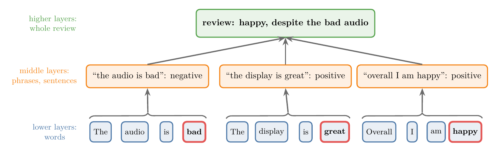
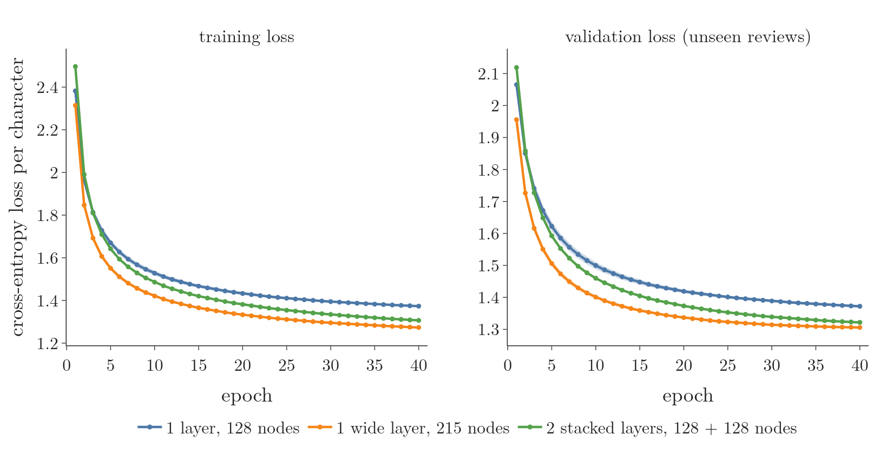

<!-- where-this-fits: generated by course_map/build_map.py; edit concepts.yaml, not this block -->
> **Where this fits:** Pipeline map step 8 (Model). See the [Course map](../../../00-course-map/00-course-map.md).
>
> 
>
> - **Builds on:** Recurrent neural network (RNN) ([Note DL-055](../../../DL/05-rnn/DL-055-why-rnn/DL-055-why-rnn.md)); LSTM (long short-term memory) ([Note DL-061](../../../DL/05-rnn/DL-061-lstm/DL-061-lstm.md)); GRU (gated recurrent unit) ([Note DL-064](../../../DL/05-rnn/DL-064-gru/DL-064-gru.md)).
<!-- /where-this-fits -->

## 1. Overview

> **Key point:** A deep RNN stacks several recurrent layers on top of each other. At every time step, each layer passes its hidden state up to the next layer and along to its own next time step. More layers give the network more representation power for complex patterns.

A **deep RNN** (G-573), also called a **stacked RNN**, is an RNN with more than one **recurrent layer** (G-1646). The idea is the same one that turns a perceptron into a **multi-layer perceptron** (G-1270): when one hidden layer cannot capture the pattern in the data, we add more layers. In an RNN, the extra layers are recurrent layers, and the whole stack is drawn once per time step: the **unfolding** (G-2041) of the [RNN forward propagation Note](../DL-056-rnn-forward-propagation/DL-056-rnn-forward-propagation.md).

{width=100%}

Figure 1 shows a deep RNN with two layers. The same stacking works with LSTM and GRU layers, which give deep LSTMs and deep GRUs.

## 2. Prerequisites

- The [RNN forward propagation Note](../DL-056-rnn-forward-propagation/DL-056-rnn-forward-propagation.md): one recurrent layer, $h_t = \tanh(x_t W_i + h_{t-1} W_h + b_h)$, and counting its parameters.
- The [RNN sentiment analysis Note](../DL-057-rnn-sentiment-analysis/DL-057-rnn-sentiment-analysis.md): the IMDB reviews, the `Embedding` layer and `return_sequences`.
- The [types of RNN Note](../DL-058-types-of-rnn/DL-058-types-of-rnn.md): many-to-one and many-to-many, and what `return_sequences=True` returns.
- The [LSTM Note](../DL-061-lstm/DL-061-lstm.md), the [LSTM architecture Note](../DL-062-lstm-architecture/DL-062-lstm-architecture.md) and the [GRU Note](../DL-064-gru/DL-064-gru.md): the two gated layers that can replace the simple recurrent layer.
- The [MLP intuition Note](../../01-basics/DL-009-mlp-intuition/DL-009-mlp-intuition.md): why more layers and more nodes let a network fit more complex patterns.

## 3. Why stack recurrent layers

> **Key point:** In an ANN, a network that underfits gets better when we add nodes or hidden layers, because its representation power grows. A deep RNN applies the same idea to recurrent layers.

Take a spiral-shaped dataset, a classic non-linear problem, and a small ANN with one hidden layer of 4 nodes. After hundreds of epochs it still labels many points wrongly: the network is too simple for the pattern. The line where its prediction switches from one class to the other, the **decision boundary** (G-555), stays almost straight, while the data curls.

- **Add nodes** to the hidden layer, and the fit improves.
- **Add a second hidden layer**, and the fit improves again.

{width=100%}

Figure 2 shows both steps on our own spiral data. With 4 nodes the decision boundary is close to a straight line and 70 percent of the points are right. With 32 nodes it bends around part of the spiral (76 percent). With a second layer of 32 nodes it follows both arms (99.8 percent).

Each change increases the **representation power** (G-1671) of the network: the variety of patterns it can express (see the [MLP intuition Note](../../01-basics/DL-009-mlp-intuition/DL-009-mlp-intuition.md)).

An RNN has the same handle. A simple RNN for sentiment analysis has one recurrent layer, unfolded over the words of a review. If its accuracy is too low, we can add a second recurrent layer above the first, and a third above that. There is no limit to the stacking. Each added layer is unfolded over the same time steps. Stacking recurrent layers and unfolding them all through time is the whole idea of a deep RNN.

## 4. The architecture of a deep RNN

> **Key point:** Layer 1 reads the input at each time step. Every higher layer reads the hidden state of the layer below at the same time step, plus its own hidden state from the previous time step.

### 4.1 One recurrent layer, as a reminder

> **Key point:** One layer: the word goes in through $W_i$, the previous hidden state through $W_h$, and the last hidden state goes to the output.

Take three toy reviews of three words each, with a sentiment of 1 (positive) or 0 (negative). Each review is one **observation** (G-1374) (one record of the data), and its sentiment is the **target** (G-1949) (the output we predict).

| Review | Sentiment |
|---|---|
| cat mat rat | 1 |
| rat rat mat | 1 |
| mat mat cat | 0 |

With **one-hot encoding** (G-1379), each word is 3 numbers: cat $= [1, 0, 0]$, mat $= [0, 1, 0]$, rat $= [0, 0, 1]$. Each of the 3 positions is one input **feature** (G-772) (one input variable). A single recurrent layer of 3 nodes reads cat at $t = 1$, mat at $t = 2$ and rat at $t = 3$, starting from $h_0 = 0$. Its input weights are $3 \times 3$, its feedback weights $3 \times 3$, and after the last word its hidden state goes to a sigmoid output node (see the [forward propagation Note](../DL-056-rnn-forward-propagation/DL-056-rnn-forward-propagation.md)).

### 4.2 Two recurrent layers

> **Key point:** Layer 1 now hands its hidden state up at **every** time step, not only at the last one. Layer 2 treats that sequence of hidden states as its input sequence.

Now we use two recurrent layers: layer 1 with 3 nodes and layer 2 with 2 nodes. The two layers can have the same or a different number of nodes.

1. **Layer 1** reads the words, exactly as before. But instead of keeping its output until the end, it sends its **hidden state** (G-891) $h_t^{(1)}$ up to layer 2 at every time step.
2. **Layer 2** receives $h_t^{(1)}$ as its input at time $t$, plus its own previous hidden state $h_{t-1}^{(2)}$. Both layers start from a vector of zeros (or random numbers).
3. After the last time step, the hidden state of the **top** layer, $h_3^{(2)}$, goes to the sigmoid output node.

The connections of the stack are:

| Connection | Shape |
|---|---|
| input to layer 1, $W_i^{(1)}$ | $3 \times 3$ |
| layer 1 to itself (feedback), $W_h^{(1)}$ | $3 \times 3$ |
| layer 1 to layer 2, $W_i^{(2)}$ | $3 \times 2$ |
| layer 2 to itself (feedback), $W_h^{(2)}$ | $2 \times 2$ |
| layer 2 to output, $W_y$ | $2 \times 1$ |

Figure 1 shows the stack unfolded over the three time steps. Each layer has its own weights, shared across all time steps, as in a single RNN (**parameter sharing**, G-1447). The information flows in two directions: along the time axis inside each layer, and up the layers at each time step.

Figure 3 runs the stack on "cat mat rat" with the numbers of the Notebook's hand forward pass. Watch the order in which the cells fill: a cell can be computed only once the cell below it and the cell to its left are known, so information moves up and to the right, and the top-right cell $h_3^{(2)}$ is the one that has seen every word.

{width=100%}

## 5. Notation: time axis and depth axis

> **Key point:** An unfolded deep RNN is a grid. $h_t^{(l)}$ is the hidden state of layer $l$ at time step $t$; it is computed from the cell below, $h_t^{(l-1)}$, and the cell to its left, $h_{t-1}^{(l)}$.

{width=75%}

Figure 4 has two axes:

- the **time axis** (G-1974), indexed by $t$: which word we are at;
- the **depth axis**, indexed by $l$: which layer we are in.

Each cell of the grid gets a name with both indices: $h_t^{(l)}$, the hidden state of layer $l$ at time $t$. The highlighted cell is $h_3^{(2)}$. Its two inputs are named the same way:

- from below: $h_t^{(l-1)}$, the same time step, the previous layer;
- from the left: $h_{t-1}^{(l)}$, the same layer, the previous time step.

Its output also goes two ways: up, as the input of layer $l + 1$, and right, as the previous hidden state of the next time step.

1. **In words:** each cell is an ordinary recurrent layer whose "input" is the hidden state of the layer below. Every layer $l$ has its own input weights $W_i^{(l)}$, feedback weights $W_h^{(l)}$ and bias $b^{(l)}$. For the first layer, the "layer below" is the input itself.
2. **Formula:**
   $$h_t^{(l)} = \tanh\big(h_t^{(l-1)} W_i^{(l)} + h_{t-1}^{(l)} W_h^{(l)} + b^{(l)}\big), \qquad h_t^{(0)} = x_t, \qquad h_0^{(l)} = 0$$
   With $L$ layers and $T$ time steps, the prediction is $\hat{y} = g\big(h_T^{(L)} W_y + b_y\big)$.
3. **Example:** layer 2 with 2 nodes, at time $t$. The layer below gives $h_t^{(1)} = [0.5, -0.2, 0.1]$; layer 2's previous state is $h_{t-1}^{(2)} = [0.3, 0.0]$; the bias is 0, and
   $$W_i^{(2)} = \begin{bmatrix} 0.4 & 0.1 \cr0.0 & 0.5 \cr-0.2 & 0.3 \end{bmatrix}, \qquad W_h^{(2)} = \begin{bmatrix} 0.6 & 0.0 \cr0.1 & 0.2 \end{bmatrix}$$
   $$h_t^{(1)} W_i^{(2)} = [0.5 \times 0.4 + 0 - 0.1 \times 0.2,\ 0.5 \times 0.1 - 0.2 \times 0.5 + 0.1 \times 0.3] = [0.18, -0.02]$$
   $$h_{t-1}^{(2)} W_h^{(2)} = [0.3 \times 0.6 + 0,\ 0.3 \times 0 + 0] = [0.18, 0.00]$$
   $$h_t^{(2)} = \tanh([0.36, -0.02]) = [0.345, -0.020]$$

The Notebook runs this two-layer forward pass by hand on the three toy reviews and gets the same predictions as Keras.

## 6. Deep RNNs in Keras

> **Key point:** Stack recurrent layers in a `Sequential` model. Every recurrent layer except the last one needs `return_sequences=True`, so the next layer receives a sequence.

### 6.1 The model

> **Key point:** An `Embedding` layer, two `SimpleRNN` layers of 5 nodes, one sigmoid node.

The IMDB reviews of the [RNN sentiment analysis Note](../DL-057-rnn-sentiment-analysis/DL-057-rnn-sentiment-analysis.md) are loaded with a vocabulary capped at 10,000 words and padded or cut to 100 words. Each word becomes a vector of 32 numbers through an `Embedding` layer.

> **Python:** A deep RNN with two recurrent layers.
>
> ```python
> model = keras.Sequential([
>     keras.Input(shape=(100,)),
>     keras.layers.Embedding(10000, 32),
>     # layer 1 hands up its hidden state at every step
>     keras.layers.SimpleRNN(5, return_sequences=True),
>     # layer 2: only its last hidden state
>     keras.layers.SimpleRNN(5),
>     keras.layers.Dense(1, activation="sigmoid")])
> ```

### 6.2 Counting the parameters

> **Key point:** Each recurrent layer is counted like a single one. The only change: the second layer's input size is the first layer's number of nodes. Embedding 320,000; layer 1: $32 \times 5 + 5 \times 5 + 5 = 190$; layer 2: $5 \times 5 + 5 \times 5 + 5 = 55$; output 6.

| Layer | Computation | Parameters |
|---|---|---|
| `Embedding(10000, 32)` | $10{,}000 \times 32$ | 320,000 |
| `SimpleRNN(5)`, layer 1 | $W_i^{(1)}$: $32 \times 5$, $W_h^{(1)}$: $5 \times 5$, bias 5 | 190 |
| `SimpleRNN(5)`, layer 2 | $W_i^{(2)}$: $5 \times 5$, $W_h^{(2)}$: $5 \times 5$, bias 5 | 55 |
| `Dense(1)` | 5 weights, 1 bias | 6 |
| **Total** | | **320,251** |

`model.summary()` in the Notebook gives the same numbers. For the toy stack of section 4.2 the counts are $9 + 9 + 3 = 21$ for layer 1, $6 + 4 + 2 = 12$ for layer 2 and $2 + 1 = 3$ for the output.

### 6.3 Why `return_sequences=True`

> **Key point:** Without it, the lower layer outputs only its last hidden state, so the upper layer has no sequence to read, and Keras refuses to build the model.

By default a Keras recurrent layer returns only its last hidden state, one vector per review (see the [types of RNN Note](../DL-058-types-of-rnn/DL-058-types-of-rnn.md)). The layer above needs one vector **per time step**: the upward arrows of Figure 1. `return_sequences=True` makes the lower layer return all of them, a tensor of shape (batch size, time steps, nodes), here (batch size, 100, 5).

{width=85%}

In Figure 5, compare the two arrows that leave the recurrent layers: the first carries (batch, 100, 5), a sequence for the next layer to read; the second carries (batch, 5), one vector for the output layer.

- **Every recurrent layer except the last** needs `return_sequences=True`. Without it the upward connections break: Keras raises an error, because the upper layer expects a 3D input and gets a 2D one (Notebook).
- **The last recurrent layer** keeps the default for a **many-to-one** (G-1155) task such as sentiment analysis, because the output layer needs only the last time step. For a **many-to-many** (G-1154) task, where the output layer needs a prediction at every time step, the last recurrent layer also returns sequences.

## 7. Why use a deep RNN

> **Key point:** Two reasons: stacked layers can learn a hierarchy, from simple features low down to more abstract ones higher up; and complex architectures, such as encoder-decoder translation systems, are built from deep RNNs.

### 7.1 Hierarchical representation

> **Key point:** Lower layers turn the raw input into simpler features; higher layers build more abstract features from them.

Text has a hierarchy: words make sentences, sentences make a review. A stack of recurrent layers can follow it, level by level. Features built in levels like this are a **hierarchical representation** (G-894). In a product review such as "The audio is bad. The display is great. Overall I am happy.":

- **lower layers** can pick up word-level features: words such as love, hate, amazing, terrible;
- **middle layers** can combine them at the level of a phrase or sentence: "the audio is bad";
- **higher layers** can combine the sentences into the overall sentiment of the review: happy, despite the bad audio.

{width=100%}

Figure 6 draws the three levels. Read it from the bottom: each level combines the outputs of the level below.

The word, sentence and review levels are an intuition about what each layer specialises in. Goodfellow §10.5 states the general idea: the lower layers of the hierarchy can be thought of as transforming the raw input into a representation that is more appropriate for the higher levels of the hidden state. Graves et al. (2013) were the first to show a significant benefit from splitting the state of an RNN into several layers this way (Goodfellow §10.5).

### 7.2 Building blocks for advanced architectures

> **Key point:** Encoder-decoder systems for machine translation use deep recurrent layers in both the encoder and the decoder.

Deep RNNs also serve as parts of larger architectures. An encoder-decoder model for **machine translation** (G-1141), with an attention mechanism, can use a deep RNN as its encoder and another as its decoder. Google's neural machine translation system used a deep LSTM network with 8 encoder and 8 decoder layers, with attention; its authors found that both had to be deep enough to reach good accuracy (Wu et al. 2016). Encoder-decoder models and attention have their own Notes later.

## 8. When to use a deep RNN

> **Key point:** Try a deep RNN for complex tasks, with a lot of data, when the computing power is there and a single-layer model is not good enough.

1. **Complex tasks.** Speech recognition and machine translation are the standard examples (Graves et al. 2013 in Goodfellow §10.5; Wu et al. 2016).
2. **Large datasets.** A deep RNN has more parameters. On a small dataset it is likely to learn the training data too closely and fail on new data (**overfitting**, G-1429), so deep RNNs need a lot of data (see the [improving a neural network Note](../../02-training/DL-021-improving-a-neural-network/DL-021-improving-a-neural-network.md)).
3. **Enough computing resources.** More layers mean more parameters and longer training; on a weak machine, training can take too long.
4. **A single layer is not good enough.** Start with a single-layer RNN as a baseline. If its results are not satisfactory, a deep RNN is a natural next step.

## 9. Experiment: one layer or two

> **Key point:** On a large task, predicting the next character of real reviews, two stacked LSTM layers beat one layer of the same width. A single wider layer with as many parameters did slightly better still within 40 epochs.

### 9.1 The task and the models

> **Key point:** 3 million characters of IMDB reviews; at every character, predict the next one. Three LSTM models, 2 seeds each.

Section 8 says a deep RNN pays off on a complex task with a lot of data. **Next-character prediction** is such a task with real data: the model reads review text one character at a time and, at every time step, predicts the next character. To do it well, the model must learn spelling, common words and some grammar.

- **Data:** the first 3 million characters of the IMDB training reviews (see the [RNN sentiment analysis Note](../DL-057-rnn-sentiment-analysis/DL-057-rnn-sentiment-analysis.md)) for training, and 300,000 characters of the test reviews for validation. The 42 characters that occur at least 50 times get their own id; the rest share one "rare" id: 43 symbols in all.
- **Observations:** windows of 100 characters, 29,999 for training and 2,999 for validation. The target at each step is the next character: a many-to-many task, so every LSTM layer has `return_sequences=True`.
- **Models:** `Embedding(43, 32)`, then the LSTM layers, then `Dense(43, activation="softmax")` at every step.
- **Training:** Adam with learning rate 0.002, batch size 128, up to 40 epochs, stopping early if the validation loss does not improve for 3 epochs (Graves et al. 2013 also trained until the validation results stopped improving). No run stopped early: every validation loss was still falling at epoch 40.

| Model | Recurrent parameters |
|---|---|
| 1 LSTM layer, 128 nodes | 82,432 |
| 2 stacked LSTM layers, 128 + 128 nodes | 214,016 |
| 1 wide LSTM layer, 215 nodes | 213,280 |

The third model has almost the same number of parameters as the stack, so it separates the effect of depth from the effect of more parameters.

### 9.2 Results

> **Key point:** The second layer lowers the validation loss from 1.372 to 1.322. The wide single layer reaches 1.306.

{width=100%}

| Model | Validation loss | Validation accuracy (next character right) | Training loss |
|---|---|---|---|
| 1 layer, 128 nodes | 1.372 | 0.578 | 1.373 |
| 2 stacked layers, 128 + 128 nodes | 1.322 | 0.590 | 1.306 |
| 1 wide layer, 215 nodes | **1.306** | **0.597** | 1.273 |

Values at epoch 40, mean of 2 seeds; the two seeds differ by less than 0.01 in every case.

- **Stacking helps.** Adding a second layer of 128 nodes to the single 128-node layer lowers the validation loss at every epoch from the third on (Figure 7), and the gap grows with training: 0.040 at epoch 10, 0.050 at epoch 40. The stack has more representation power, as section 3 says.
- **At equal parameters, width did better here.** The single 215-node layer beats the stack by 0.016 in validation loss. Graves et al. (2013) found the opposite in speech recognition: with about the same number of weights, 3 layers of 250 LSTM nodes gave 18.6% phoneme error and 1 layer of 622 nodes 23.0%, so depth mattered more than layer size. Their networks were deep bidirectional LSTMs trained until the validation results stopped improving. Our models were still improving at epoch 40.
- **The stack is harder to train, not overfitting.** The stack's training loss (1.306) is also higher than the wide layer's (1.273), so the gap comes from fitting the training data, not from overfitting. Goodfellow §10.5 notes the trade-off: extra depth adds representational capacity, but "it is easier to optimize shallower architectures".

## 10. Deep LSTMs and deep GRUs

> **Key point:** Stacking works with any recurrent layer. In practice deep RNNs are built from LSTM or GRU layers, because simple recurrent layers still suffer from vanishing and exploding gradients.

Replacing `SimpleRNN` by `LSTM` in the model of section 6 gives a **deep LSTM** (G-569); replacing it by `GRU` gives a **deep GRU**. Nothing else changes: the same `return_sequences=True` on every layer but the last.

| Model (5 nodes per layer) | Layer 1 | Layer 2 | Total with embedding and output |
|---|---|---|---|
| deep SimpleRNN | 190 | 55 | 320,251 |
| deep LSTM | 760 | 220 | 320,986 |
| deep GRU | 585 | 180 | 320,771 |

The LSTM layer has four times the weights of a simple recurrent layer, one set per gate and one for the candidate cell state (see the [LSTM architecture Note](../DL-062-lstm-architecture/DL-062-lstm-architecture.md)); the GRU layer has three (see the [GRU Note](../DL-064-gru/DL-064-gru.md)). Figure 8 compares the layers. In each model the second layer is much smaller than the first, because its input is the first layer's 5-number hidden state, not a 32-number embedding.

{width=90%}

In practice, deep RNNs are mostly built from LSTM or GRU layers: a stack of simple recurrent layers still has the vanishing and exploding gradient problems of the [problems with RNNs Note](../DL-060-problems-with-rnn/DL-060-problems-with-rnn.md).

Training works as before. Backpropagation through time (see the [BPTT Note](../DL-059-backpropagation-through-time/DL-059-backpropagation-through-time.md)) now runs over a grid instead of a chain: a gradient can travel back along the time axis, down the depth axis, or both. The bookkeeping is harder by hand, but Keras builds the computation graph and computes every gradient automatically. Dropout and the other techniques of earlier Notes apply unchanged.

## 11. Disadvantages

> **Key point:** More layers mean more parameters: a higher risk of overfitting and a longer training time.

1. **Overfitting.** A more complex network overfits more easily. Design it carefully: use [dropout](../../02-training/DL-024-dropout/DL-024-dropout.md), [regularisation](../../02-training/DL-026-regularization-in-dl/DL-026-regularization-in-dl.md), a carefully chosen learning rate and a good [weight initialisation](../../02-training/DL-030-xavier-he-initialization/DL-030-xavier-he-initialization.md).
2. **Training time.** More parameters mean more derivatives to compute and more weights to update at every step, so training takes longer, especially on a large dataset.

## 12. Summary

| | Single-layer RNN | Deep (stacked) RNN |
|---|---|---|
| Recurrent layers | 1 | 2 or more, stacked |
| Input of a recurrent layer at time $t$ | $x_t$ | $x_t$ for layer 1; $h_t^{(l-1)}$ for layer $l$ |
| Unfolded shape | a chain (time axis) | a grid (time axis and depth axis) |
| Keras | one recurrent layer | `return_sequences=True` on every recurrent layer but the last |
| Strength | simple, fast | more representation power: hierarchical features |
| Cost | | more parameters, more overfitting risk, longer training |

- A deep RNN stacks recurrent layers; each is unfolded through time.
- $h_t^{(l)} = \tanh\big(h_t^{(l-1)} W_i^{(l)} + h_{t-1}^{(l)} W_h^{(l)} + b^{(l)}\big)$, with $h_t^{(0)} = x_t$.
- Each layer has its own weights; the second layer's input size is the first layer's number of nodes.
- Use it for complex tasks with a lot of data, after a single-layer baseline.
- In practice, stack LSTM or GRU layers: deep LSTMs and deep GRUs.

## 13. Sources

**Built from**

- CampusX, "Deep RNNs | Stacked RNNs | Stacked LSTMs | Stacked GRUs | CampusX", YouTube, https://www.youtube.com/watch?v=mlDkTrlLaio

**Other references**

- Goodfellow, I., Bengio, Y. and Courville, A. (2016). *Deep Learning*. MIT Press. Chapter 10, §10.5 (deep recurrent networks). deeplearningbook.org/contents/rnn.html.
- Graves, A., Mohamed, A. and Hinton, G. (2013). Speech Recognition with Deep Recurrent Neural Networks. ICASSP 2013. arXiv:1303.5778.
- Wu, Y., Schuster, M., Chen, Z., Le, Q. V., Norouzi, M. et al. (2016). Google's Neural Machine Translation System: Bridging the Gap between Human and Machine Translation. arXiv:1609.08144.
- Keras API documentation: `SimpleRNN`, `LSTM` and `GRU` layers (`return_sequences`), keras.io/api/layers/recurrent_layers/.

## 14. Key terms

| Term | Meaning |
|---|---|
| Deep RNN (stacked RNN) | An RNN with two or more recurrent layers stacked on top of each other, all unfolded through time |
| Deep LSTM, deep GRU | A deep RNN whose recurrent layers are LSTM or GRU layers |
| Observation | One record of the data, here one review |
| Feature | An input variable; here one of the numbers that represent a word |
| Target | The output we predict, here the sentiment |
| Representation power | The variety of patterns a network can express; grows with more nodes and layers |
| Time axis and depth axis | The two directions of an unfolded deep RNN: time steps and layers |
| $h_t^{(l)}$ (G-29) | The hidden state of layer $l$ at time step $t$ |
| Hierarchical representation | Features built in levels: simple ones in lower layers, more abstract ones in higher layers |
| `return_sequences=True` (G-136) | Makes a Keras recurrent layer return its hidden state at every time step; needed on every stacked layer but the last |
