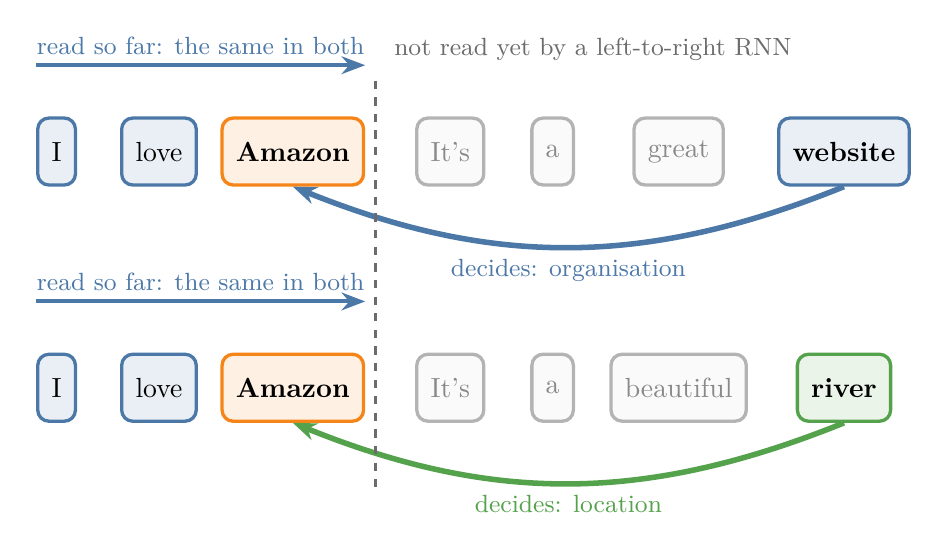
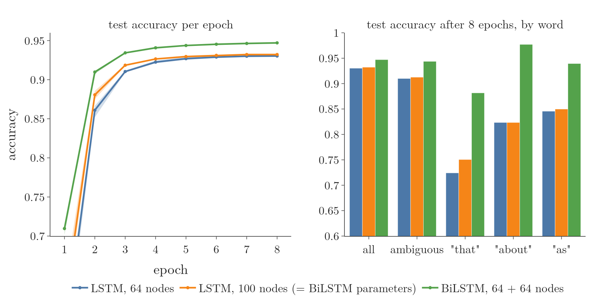
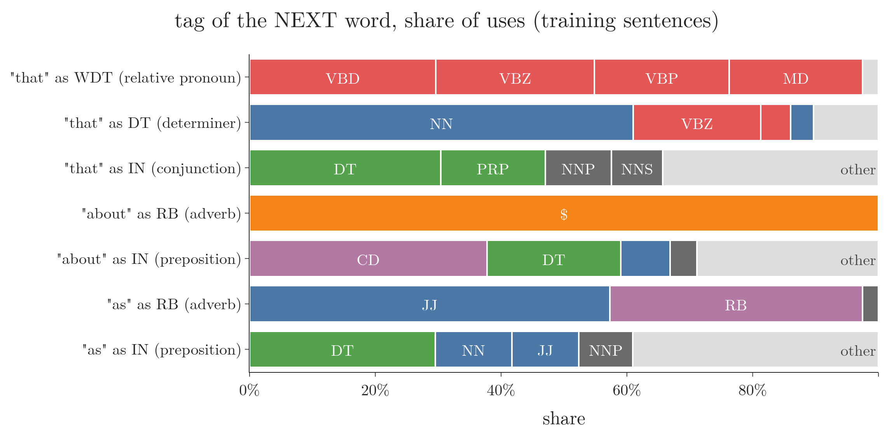
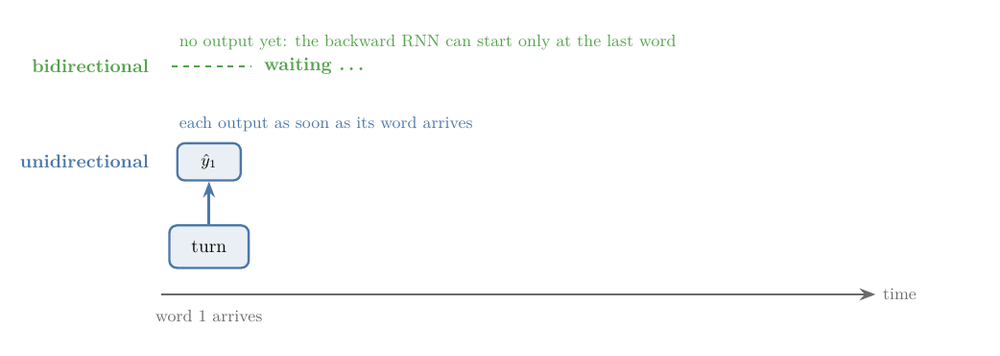

<!-- where-this-fits: generated by course_map/build_map.py; edit concepts.yaml, not this block -->
> **Where this fits:** Pipeline map step 8 (Model). See the [Course map](../../../00-course-map/00-course-map.md).
>
> 
>
> - **Builds on:** Recurrent neural network (RNN) ([Note DL-055](../../../DL/05-rnn/DL-055-why-rnn/DL-055-why-rnn.md)); LSTM (long short-term memory) ([Note DL-061](../../../DL/05-rnn/DL-061-lstm/DL-061-lstm.md)); GRU (gated recurrent unit) ([Note DL-064](../../../DL/05-rnn/DL-064-gru/DL-064-gru.md)).
<!-- /where-this-fits -->

## 1. Overview

> **Key point:** A bidirectional RNN runs two RNNs over the same sequence, one from left to right and one from right to left, and joins their hidden states at every time step. Each output can then use both the past and the future of the sequence.

An RNN keeps a **hidden state** (G-891), its summary of the inputs read so far, and updates it at every **time step** (G-1976), one word at a time. A **bidirectional RNN** (G-292) (Schuster and Paliwal 1997) combines an RNN that moves forward through time, from the start of the sequence, with another that moves backward through time, from the end (Goodfellow §10.3). The RNNs of the earlier Notes read only from left to right, so the output at a time step can depend only on the inputs up to that step. A bidirectional RNN removes that limit.

{width=100%}

Figure 1 shows the structure. The idea works with any recurrent layer: with LSTM layers it is called a **BiLSTM** (G-295), with GRU layers a **BiGRU**.

## 2. Prerequisites

- The [RNN forward propagation Note](../DL-056-rnn-forward-propagation/DL-056-rnn-forward-propagation.md): $h_t = \tanh(x_t W_i + h_{t-1} W_h + b_h)$ and counting parameters.
- The [RNN sentiment analysis Note](../DL-057-rnn-sentiment-analysis/DL-057-rnn-sentiment-analysis.md): IMDB and the `Embedding` layer.
- The [types of RNN Note](../DL-058-types-of-rnn/DL-058-types-of-rnn.md): many-to-many models and `return_sequences=True`; part-of-speech tagging and named entity recognition.
- The [LSTM architecture Note](../DL-062-lstm-architecture/DL-062-lstm-architecture.md) and the [GRU Note](../DL-064-gru/DL-064-gru.md): the gated layers that can be made bidirectional.
- The [deep RNNs Note](../DL-065-deep-rnns/DL-065-deep-rnns.md): stacking recurrent layers.

## 3. Why read a sequence in both directions

> **Key point:** In a unidirectional RNN the output at time $t$ depends only on the inputs up to $t$. Some tasks need later inputs to decide an earlier output.

### 3.1 The limit of a unidirectional RNN

> **Key point:** Information flows only forward, so the past can affect an output but the future cannot.

Every RNN so far is **unidirectional** (G-2042): it reads $x_1$, then $x_2$, then $x_3$. The output at the last step depends on $x_3$, $x_2$ and $x_1$: on all the past inputs. Goodfellow §10.3 calls this a "causal" structure: the state at time $t$ captures only information from the past and the present input.

Now suppose the correct output at an early time step depends on an input that comes later. A unidirectional RNN, whether simple, LSTM or GRU, has not yet read that input when it must give the output, so it fails.

### 3.2 An example: named entity recognition

> **Key point:** In "I love Amazon. It's a great website" the word Amazon is an organisation; in "I love Amazon. It's a beautiful river" it is a location. Reading left to right, the words that decide come after Amazon.

**Named entity recognition** (G-1300) (NER) is the task of labelling the names in a sentence with their type: a person, a location, an organisation (see the [types of RNN Note](../DL-058-types-of-rnn/DL-058-types-of-rnn.md)). Chatbots use it to pick names and places out of messages. Take two sentences:

- "I love Amazon. It's a great website." Here Amazon is an **organisation**.
- "I love Amazon. It's a beautiful river." Here Amazon is a **location**.

A tagger reading left to right reaches Amazon with exactly the same context, "I love", in both sentences. Until it reads the next sentence, it cannot tell the organisation from the river.

{width=100%}

In Figure 2, everything left of the dashed line is identical in the two sentences, so a left-to-right tagger must give "Amazon" the same label in both. The next inputs decide the output at an earlier step: that is the situation a bidirectional RNN is built for. **Machine translation** (G-1141) has the same need: a word of the output may depend on parts of the input that come later.

Goodfellow §10.3 gives a speech example: the correct interpretation of the current sound may depend on the next few sounds, and even on the next few words.

## 4. How a bidirectional RNN works

> **Key point:** Two separate RNNs read the sequence in opposite directions. At every time step their hidden states are concatenated, and the output layer reads the joined vector.

### 4.1 Two RNNs, opposite directions

> **Key point:** The forward RNN starts at $x_1$ from a vector of zeros; the backward RNN starts at $x_T$ from a vector of zeros.

Take the four words "Amazon is a website" as $x_1, x_2, x_3, x_4$.

1. **The forward RNN** (blue in Figure 1) is the RNN we know. The forward RNN starts from $\overrightarrow h_0$, zeros or random numbers, reads Amazon, is, a, website, and produces $\overrightarrow h_1, \dots, \overrightarrow h_4$.
2. **The backward RNN** (green) is a second, separate RNN with its own weights. The backward RNN starts from zeros at the other end, reads website, a, is, Amazon, and produces $\overleftarrow h_4, \dots, \overleftarrow h_1$.
3. **At every time step**, the two hidden states are **concatenated** (G-436; placed one after the other in a single vector), and the output layer turns the joined vector into $\hat y_t$.

The two RNNs do not feed each other: the outputs of the forward states are not connected to the inputs of the backward states, and the other way round (Schuster and Paliwal 1997). They meet only at the output.

### 4.2 Why the output now sees the future

> **Key point:** $\overleftarrow h_1$ is the backward RNN's last state: it has read every word. So $\hat y_1$ depends on the whole sentence.

Look at the output for Amazon, $\hat y_1$, in Figure 1.

- Its forward part, $\overrightarrow h_1$, has read only Amazon.
- Its backward part, $\overleftarrow h_1$, has read website, a, is and Amazon: it is the last state of the backward RNN.

So every word, including "website", contributes to the label of Amazon. "Website" points to an organisation, not a location. In general, the output at each step gets a summary of the past from the forward RNN and a summary of the future from the backward RNN, while staying most sensitive to the inputs around time $t$ (Goodfellow §10.3).

Figure 3 shows the two passes on a real test sentence from the experiment of section 6. Watch the word "about": the forward pass reaches it having read only "...that totaled about", and the unidirectional LSTM tags it as a preposition (IN). The backward pass reaches "about" having already read the "\$" that follows, and the BiLSTM tags it correctly as an adverb (RB).

{width=100%}

### 4.3 The equations

> **Key point:** The forward equation uses $\overrightarrow h_{t-1}$, the backward equation uses $\overleftarrow h_{t+1}$, and the output uses both, joined.

1. **In words:** the forward state at $t$ comes from the input and the forward state at $t - 1$. The backward state at $t$ comes from the input and the backward state at $t + 1$, the step it read just before. The output applies its activation to the joined pair.
2. **Formula:** the arrow over a symbol shows the direction its RNN reads: $\overrightarrow{\ }$ left to right, $\overleftarrow{\ }$ right to left. Each RNN has its own weights and bias:
   $$\overrightarrow h_t = \tanh\big(x_t \overrightarrow W_i + \overrightarrow h_{t-1} \overrightarrow W_h + \overrightarrow{b}\big), \qquad \overrightarrow h_0 = 0$$
   $$\overleftarrow h_t = \tanh\big(x_t \overleftarrow W_i + \overleftarrow h_{t+1} \overleftarrow W_h + \overleftarrow{b}\big), \qquad \overleftarrow h_{T+1} = 0$$
   $$\hat y_t = g\big([\overrightarrow h_t, \overleftarrow h_t]\thinspace W_y + b_y\big)$$
   where $[\thinspace\cdot\thinspace,\thinspace\cdot\thinspace]$ joins two row vectors into one and $g$ is the output activation, a sigmoid or a softmax.
3. **Example:** with 2 nodes in each direction, suppose $\overrightarrow h_1 = [0.3, -0.1]$ and $\overleftarrow h_1 = [0.6, 0.2]$. The output layer receives the 4 numbers
   $$[\overrightarrow h_1, \overleftarrow h_1] = [0.3, -0.1, 0.6, 0.2]$$
   so $W_y$ has 4 rows: twice as many as for one direction. With $W_y = [1.0, -1.0, 0.5, 2.0]^\top$, $b_y = 0$ and a sigmoid for $g$, one product per line:
   $$0.3 \times 1.0 = 0.30, \qquad -0.1 \times (-1.0) = 0.10$$
   $$0.6 \times 0.5 = 0.30, \qquad 0.2 \times 2.0 = 0.40$$
   $$0.30 + 0.10 + 0.30 + 0.40 = 1.10$$
   $$\hat y_1 = \sigma(1.10) = 0.75$$

The Notebook builds a Keras bidirectional layer, runs the forward and backward equations by hand with its weights, and gets exactly its output at every time step.

## 5. Bidirectional RNNs in Keras

> **Key point:** Wrap any recurrent layer in `keras.layers.Bidirectional`. The wrapper makes a second copy for the backward direction, so the layer's parameters double.

### 5.1 The wrapper

> **Key point:** One line changes: `SimpleRNN(5)` becomes `Bidirectional(SimpleRNN(5))`.

> **Python:** The IMDB model of the [RNN sentiment analysis Note](../DL-057-rnn-sentiment-analysis/DL-057-rnn-sentiment-analysis.md), made bidirectional.
>
> ```python
> model = keras.Sequential([
>     keras.Input(shape=(100,)),
>     keras.layers.Embedding(10000, 32),
>     keras.layers.Bidirectional(keras.layers.SimpleRNN(5)),
>     keras.layers.Dense(1, activation="sigmoid")])
> ```

By default the wrapper concatenates the two directions (`merge_mode="concat"`); it can also add, average or multiply them (Keras documentation, `Bidirectional`). Without `return_sequences=True`, as here, it returns the forward RNN's last state joined with the backward RNN's last state, which is $\overleftarrow h_1$.

### 5.2 Counting the parameters

> **Key point:** Two RNNs instead of one: 190 becomes 380 for `SimpleRNN(5)`. The layer after it also gets twice as many inputs.

| Recurrent layer (5 nodes, input 32) | Unidirectional | Bidirectional |
|---|---|---|
| `SimpleRNN` | 190 | 380 |
| `LSTM` | 760 | 1,520 |
| `GRU` | 585 | 1,170 |

{width=90%}

Figure 4 shows the doubling for all three layer types: the wrapper adds a second, separate copy of the layer for the backward direction.

The `Dense(1)` output layer grows too, from $5 + 1 = 6$ to $10 + 1 = 11$ parameters, because it reads 10 joined numbers instead of 5.

Wrapping an `LSTM` gives a BiLSTM and wrapping a `GRU` gives a BiGRU. The bidirectional simple RNN is rarely used; BiLSTMs and BiGRUs are the common choices in practice, for the reasons of the [problems with RNNs Note](../DL-060-problems-with-rnn/DL-060-problems-with-rnn.md).

## 6. Experiment: tagging the parts of speech

> **Key point:** On real Wall Street Journal sentences, a BiLSTM tags parts of speech more accurately than a unidirectional LSTM, also when the unidirectional one gets the same number of parameters. Most of the gain is on words whose tag depends on what follows.

### 6.1 The task and the models

> **Key point:** 8,936 training sentences, 2,012 test sentences, 44 tags. Every model reads a sentence and gives one tag per word: a **many-to-many** (G-1154) task.

**Part-of-speech tagging** (G-1456) labels every word of a sentence with its grammatical class: noun (NN), plural noun (NNS), verb in the past tense (VBD), preposition (IN), adverb (RB) and so on. The data is the CoNLL-2000 corpus: Wall Street Journal sentences, each word labelled with one of 44 tags (Tjong Kim Sang and Buchholz 2000). A copy of the word and tag columns is stored in the Note's `data` folder (from the NLTK data collection), so the Notebook runs without a download.

- Each sentence is padded to 80 words (the longest has 78). Words seen fewer than 2 times in training share one "unknown" id, giving a vocabulary of 9,676.
- Every model is `Embedding(9676, 64)`, a recurrent layer with `return_sequences=True`, and a `Dense(44, activation="softmax")` layer that gives a tag at every time step (see the [types of RNN Note](../DL-058-types-of-rnn/DL-058-types-of-rnn.md)).
- Padding positions get a sample weight of 0, so they count neither in the loss nor in the accuracy.
- Adam, 8 epochs, batch size 64, 3 seeds per model.

| Model | Recurrent parameters |
|---|---|
| LSTM, 64 nodes | 33,024 |
| BiLSTM, 64 + 64 nodes | 66,048 |
| LSTM, 100 nodes | 66,000 |

The third model checks that the gain is not only from the doubled parameters: it is a unidirectional LSTM with almost the same number of parameters as the BiLSTM.

### 6.2 Results

> **Key point:** BiLSTM 94.7% against 93.0% and 93.2%. Doubling the parameters of a unidirectional LSTM gains only 0.2 points; reading backwards gains 1.7.

{width=100%}

| Model | Test accuracy, mean of 3 seeds | Lowest | Highest |
|---|---|---|---|
| LSTM, 64 nodes | 0.930 | 0.929 | 0.932 |
| LSTM, 100 nodes (same parameters as BiLSTM) | 0.932 | 0.932 | 0.933 |
| BiLSTM, 64 + 64 nodes | **0.947** | 0.947 | 0.947 |

- The BiLSTM is ahead at every epoch (Figure 5, left), and the three seeds of each model barely differ.
- The wider unidirectional LSTM gains only 0.2 points over the narrow one. The BiLSTM, with the same number of parameters, gains 1.7. The difference comes from the backward direction, not from the extra parameters.

### 6.3 Where the gain comes from

> **Key point:** On "that", "about" and "as", whose tag depends on the next words, the BiLSTM gains 9 to 16 points.

Some words take different tags in different sentences. Call a word **ambiguous** if, in the training sentences, its second most common tag covers at least 10% of its uses. These words make up 17.3% of the test words.

| Words | LSTM, 64 | LSTM, 100 | BiLSTM |
|---|---|---|---|
| all words | 0.930 | 0.932 | 0.947 |
| ambiguous words | 0.910 | 0.913 | 0.944 |
| "that" (417 in test) | 0.724 | 0.751 | 0.882 |
| "about" (102) | 0.824 | 0.824 | 0.977 |
| "as" (242) | 0.846 | 0.850 | 0.939 |

In the training sentences, the tag of these words goes with the tag of the **next** word, which a unidirectional model has not read yet (counts from the Notebook's training data):

| Word and tag | Uses | Most common next tags |
|---|---|---|
| "that" as a relative pronoun (WDT): "the deal that collapsed" | 476 | verbs: VBD 141, VBZ 120, VBP 102, MD 101 |
| "that" as a determiner (DT): "that deal" | 272 | NN 166 |
| "that" as a conjunction (IN): "said that the deal" | 1,053 | DT 320, PRP 175 |
| "about" as an adverb (RB) | 70 | "\$" in all 70: "about \$ 5 million" |
| "about" as a preposition (IN) | 371 | CD 140, DT 79 |
| "as" as an adverb (RB): "as much as" | 117 | JJ 67, RB 47 |
| "as" as a preposition (IN) | 789 | DT 233, NN 96 |

{width=100%}

Figure 6 draws the table. Compare the rows of one word: "that" as WDT is followed by a verb, "that" as DT mostly by a noun (NN), and "about" as RB always by "\$". The next tag separates the uses of the word.

The previous word is a weaker clue: before "that", a noun is common for both WDT (NN 228) and IN (NN 195). The words after decide, and only the backward RNN has read them.

One test sentence, tagged by the LSTM with 64 nodes and by the BiLSTM (seed 1):

| Word | True tag | LSTM | BiLSTM |
|---|---|---|---|
| In | IN | IN | IN |
| the | DT | DT | DT |
| `$` | `$` | `$` | `$` |
| 300-a-share | JJ | JJ | JJ |
| buyout | NN | NNS | NN |
| , | , | , | , |
| that | WDT | WDT | WDT |
| totaled | VBD | VBD | VBD |
| **about** | **RB** | **IN** | **RB** |
| `$` | `$` | `$` | `$` |
| 76.7 | CD | CD | CD |
| million | CD | CD | CD |
| . | . | . | . |

The unidirectional LSTM tags "about" as a preposition: it has read only "...that totaled about". The BiLSTM has also read the "`$`" that follows, and in the training sentences every adverb "about" comes before "`$`".

## 7. Applications

> **Key point:** Use a bidirectional RNN when the whole sequence is available and an output may depend on later inputs: tagging, named entity recognition, translation, and often sentiment analysis.

1. **Named entity recognition**, as in section 3.2.
2. **Part-of-speech tagging**, as in section 6: each word gets its grammatical class.
3. **Machine translation.** Google's neural machine translation system made the first layer of its encoder bidirectional, to have the best possible context at each point (Wu et al. 2016).
4. **Sentiment analysis.** Bidirectional RNNs are worth trying here too; the whole review is available before the prediction.

Bidirectional RNNs have been extremely successful in handwriting recognition, speech recognition and bioinformatics (Goodfellow §10.3).

## 8. Disadvantages

> **Key point:** Twice the parameters, so more training time and more overfitting risk; and the whole sequence must be available before any output, which adds latency in real-time tasks.

1. **Complexity.** The recurrent layer has twice the parameters, so training takes longer and the network can fit the training data too closely (**overfitting**, G-1429). The usual remedies apply: [dropout](../../02-training/DL-024-dropout/DL-024-dropout.md) and [regularisation](../../02-training/DL-026-regularization-in-dl/DL-026-regularization-in-dl.md).
2. **The whole sequence must be available.** The backward RNN starts at the last input. In **real-time speech recognition**, the words arrive one by one while the person speaks, so the backward RNN cannot start until the sentence is finished. The reply is delayed: a **latency** (G-1048) problem that a unidirectional RNN does not have. Figure 7 shows the delay on a four-word command. Watch the two rows as the words arrive: the unidirectional RNN gives each output when its word arrives, while the bidirectional RNN keeps waiting and gives all four outputs only after the last word.

{width=100%}

The same constraint limits parallel computation: Google's translation system kept only its bottom encoder layer bidirectional, because a layer above a bidirectional one must wait for both directions to finish (Wu et al. 2016).

## 9. Summary

| | Unidirectional RNN | Bidirectional RNN |
|---|---|---|
| Reads | left to right | left to right and right to left |
| Output at time $t$ depends on | $x_1, \dots, x_t$ | the whole sequence $x_1, \dots, x_T$ |
| Recurrent layers | 1 | 2 separate ones, joined at every step |
| Parameters | $P$ | $2P$ (and a wider next layer) |
| Keras | `LSTM(64)` | `Bidirectional(LSTM(64))` |
| Needs the full sequence first | no | yes: latency in real-time tasks |

- A bidirectional RNN joins a forward RNN and a backward RNN at every time step: $\hat y_t = g([\overrightarrow h_t, \overleftarrow h_t] W_y + b_y)$.
- The backward state at $t$ comes from $\overleftarrow h_{t+1}$, so every output sees the future of the sequence.
- It helps when an output depends on later inputs: tagging, NER, translation.
- It doubles the parameters and needs the whole sequence before any output.

## 10. Sources

**Built from**

- CampusX, "Bidirectional RNN | BiLSTM | Bidirectional LSTM | Bidirectional GRU", YouTube, https://www.youtube.com/watch?v=k2NSm3MNdYg

**Other references**

- Goodfellow, I., Bengio, Y. and Courville, A. (2016). *Deep Learning*. MIT Press. Chapter 10, §10.3 (bidirectional RNNs). deeplearningbook.org/contents/rnn.html.
- Schuster, M. and Paliwal, K. K. (1997). Bidirectional Recurrent Neural Networks. *IEEE Transactions on Signal Processing* 45(11), 2673–2681.
- Tjong Kim Sang, E. F. and Buchholz, S. (2000). Introduction to the CoNLL-2000 Shared Task: Chunking. CoNLL 2000. (The tagged Wall Street Journal sentences.)
- Wu, Y., Schuster, M., Chen, Z., Le, Q. V., Norouzi, M. et al. (2016). Google's Neural Machine Translation System: Bridging the Gap between Human and Machine Translation. arXiv:1609.08144.
- Keras API documentation: `Bidirectional` layer (`merge_mode`, default `"concat"`), keras.io/api/layers/recurrent_layers/bidirectional.

## 11. Key terms

| Term | Meaning |
|---|---|
| Bidirectional RNN | Two RNNs reading a sequence in opposite directions, their hidden states joined at every time step |
| Unidirectional RNN | An RNN that reads in one direction only, so its output at $t$ depends only on inputs up to $t$ |
| Forward and backward RNN | The left-to-right and the right-to-left halves of a bidirectional RNN |
| BiLSTM, BiGRU | A bidirectional RNN made of LSTM or GRU layers |
| Concatenation (G-436) | Placing two vectors one after the other to form one longer vector |
| Named entity recognition (NER) | Labelling the names in a text with their type, such as person, location or organisation |
| Part-of-speech tagging | Labelling every word of a sentence with its grammatical class, such as noun or verb |
| Observation | One record of the data, here one sentence |
| Target | The output we predict, here the tag of each word |
| Latency | The delay between an input and the system's reply |
| `Bidirectional` | The Keras wrapper that makes any recurrent layer bidirectional |
