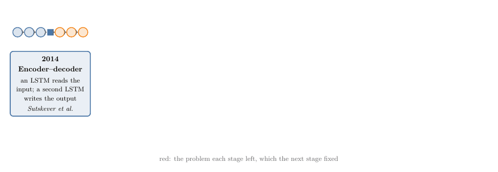
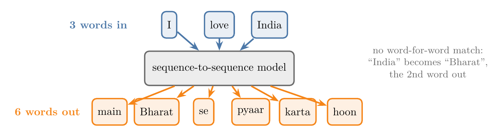
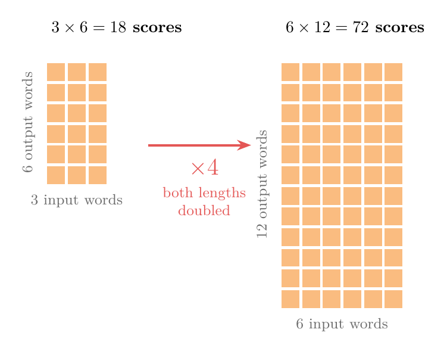
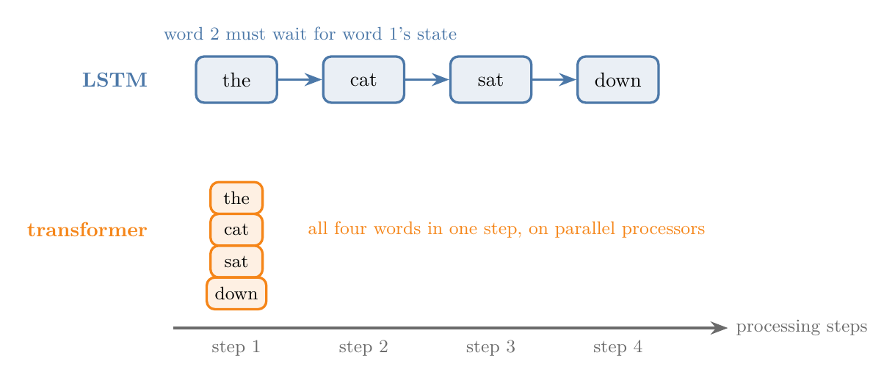
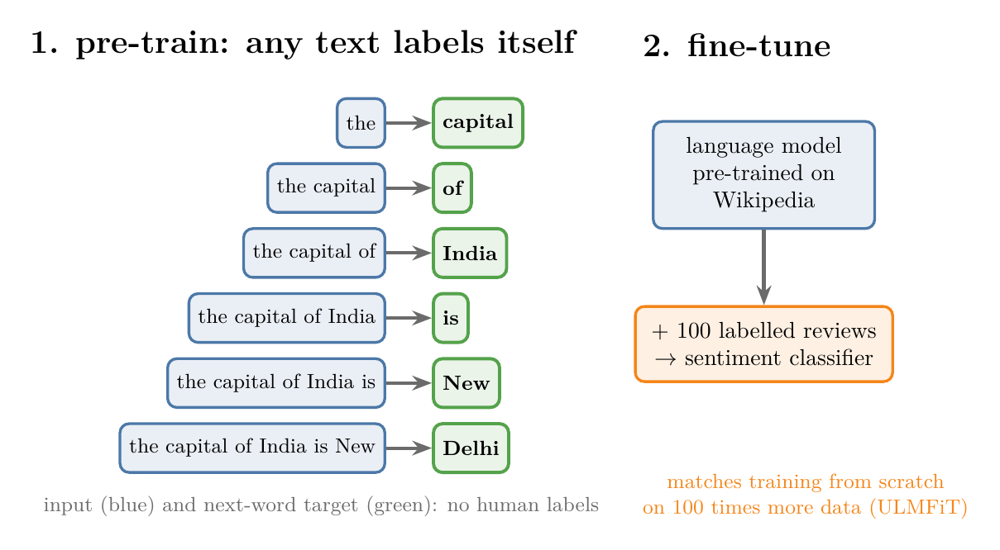
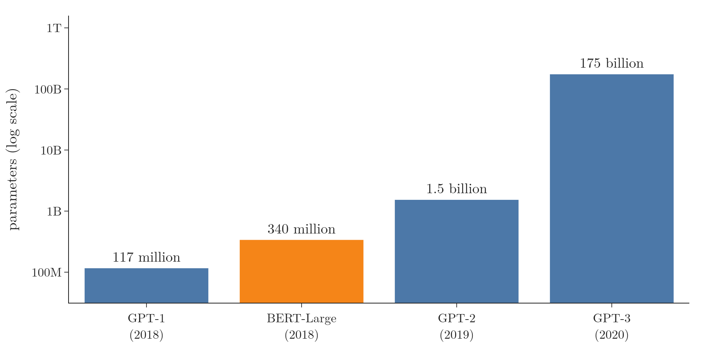
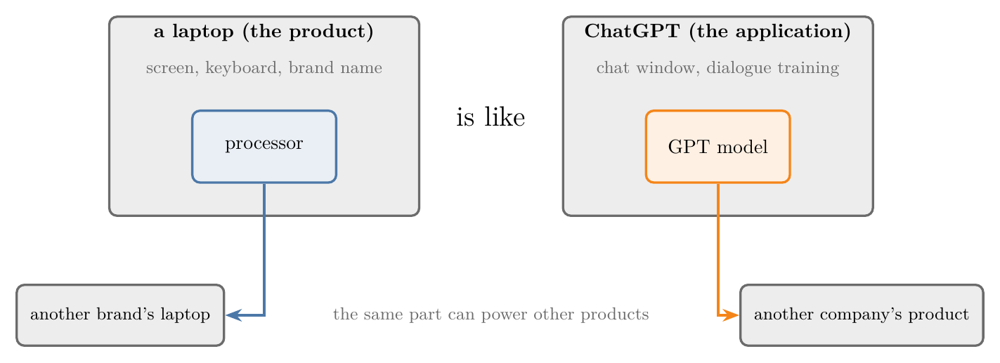
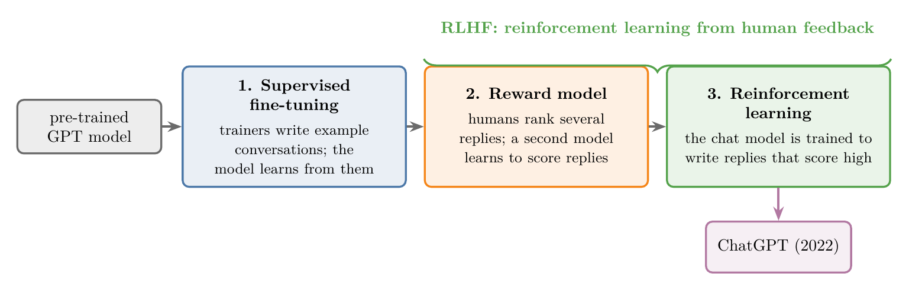

<!-- where-this-fits: generated by course_map/build_map.py; edit concepts.yaml, not this block -->
> **Where this fits:** Pipeline map step 8 (Model). See the [Course map](../../../00-course-map/00-course-map.md).
>
> 
>
> - **Builds on:** Transformer ([Note DL-071](../../../DL/06-transformers/DL-071-introduction-to-transformers/DL-071-introduction-to-transformers.md)); Decoder-only GPT ([Note DL-087](../../../DL/06-transformers/DL-087-decoder-only-gpt/DL-087-decoder-only-gpt.md)).
<!-- /where-this-fits -->

## 1. Overview

> **Key point:** Large language models grew out of five stages, each fixing the main problem of the one before:
>
> 1. The **encoder–decoder** (2014) turned one sequence into another but forgot long sentences.
> 2. **Attention** (G-226) (2014–15) let it look back at every input word, but it was slow because it still read one word at a time.
> 3. The **transformer** (G-2007) (2017) dropped the RNN and read all words in parallel, but it needed huge data.
> 4. **Transfer learning** (G-2005) (2018) removed that need: pre-train once on unlabelled text, then fine-tune.
> 5. Combining transformers with transfer learning at a vast scale gave **LLMs** such as GPT-3.
>
> Training GPT for dialogue with human feedback then gave **ChatGPT**.

The last block of the deep learning Notes works with **sequence-to-sequence** models, the family behind machine translation, chatbots and ChatGPT. This Note is the map for that block. It tells the story stage by stage: what each stage invented, who invented it, and what problem it left for the next stage. In Figure 1, watch the stages appear one at a time: each red line is the problem a stage left, and the next box is the idea that fixed it. The architectures themselves (encoder–decoder, attention, self-attention, the transformer) each get their own Notes later.

{width=100%}

## 2. Prerequisites

- [Why RNNs are needed](../../05-rnn/DL-055-why-rnn/DL-055-why-rnn.md): sequential data, and why a plain ANN struggles with it.
- [What is deep learning](../../01-basics/DL-002-what-is-deep-learning/DL-002-what-is-deep-learning.md), section 5.4: transfer learning in computer vision.
- The RNN Notes that follow 1055, especially LSTM: a network that reads a sequence step by step and keeps a memory.

## 3. Sequence-to-sequence problems

> **Key point:** A sequence-to-sequence task takes a sequence in and gives a sequence out, and the two lengths can differ.

RNN tasks come in a few shapes:

- **Sentiment analysis** (G-1769) reads a sequence and outputs one label (many inputs, one output).
- **Image captioning** (G-918) takes one image and outputs a sentence (one input, many outputs).
- **Tagging** each word of a sentence with its part of speech gives one output per input word, so the two sequences have the same length.

The hardest shape has a sequence on both sides with lengths that do not match. Translating "I love India" into Hindi gives "main Bharat se pyaar karta hoon": 3 words in, 6 words out. Tasks of this shape are called **sequence-to-sequence** (seq2seq; G-1772) tasks.

{width=95%}

In Figure 2, follow "India": it becomes "Bharat", the second output word, so the model cannot simply emit one output word per input word. Examples of such tasks:

- **Machine translation** (G-1141): a sentence in one language in, the same sentence in another language out.
- **Text summarization:** a long text in, a short summary out.
- **Question answering:** a question in, an answer out.
- **Chatbots:** a message in, a reply out.
- **Speech to text:** a sequence of sound values in, a sequence of words out, as in automatic subtitles.

## 4. Stage 1: the encoder–decoder (2014)

> **Key point:** One LSTM, the encoder, reads the input word by word and squeezes it into a single **context vector** (G-461); a second LSTM, the decoder, writes the output word by word from that vector. It works on short sentences and fails on long ones.

In 2014 Ilya Sutskever, Oriol Vinyals and Quoc Le at Google published "Sequence to Sequence Learning with Neural Networks" (Sutskever et al. 2014). Sutskever later co-founded OpenAI (OpenAI 2015). Their model has two parts (Figure 3, top):

1. **Encoder** (G-682): an LSTM reads the input sentence one word per step. Its internal state is updated at every step, so after the last word the state is a summary of the whole sentence. This summary is the **context vector**.
2. **Decoder** (G-564): a second LSTM starts from the context vector and produces the output sentence one word per step.

A simple RNN or GRU cell would also work inside each part; the paper used the **LSTM** (G-1123).

{width=88%}

The weak point is the context vector. However long the input, everything must pass through one fixed-size vector. An analogy: reading a whole paragraph once and then translating it from memory. A short sentence fits in memory; a long paragraph does not, and the start is the first part to fade.

The measurements agree. Bahdanau, Cho and Bengio (2015, Figure 2) plotted translation quality, measured by the **BLEU score** (G-315) (how many word sequences of a translation match a human reference translation), against sentence length. For the plain encoder–decoder, quality "dramatically drops as the length of the sentences increases". The [attention mechanism Note](../DL-069-attention-mechanism/DL-069-attention-mechanism.md), section 7, measures the same drop on our own data, with and without attention.

## 5. Stage 2: attention (2014–15)

> **Key point:** Instead of one context vector, the decoder gets a fresh context vector for every output word: a weighted mix of all the encoder's states, with the weights learned. The decoder can therefore always look at the right input words. The price is speed.

Dzmitry Bahdanau, Kyunghyun Cho and Yoshua Bengio proposed the fix in "Neural Machine Translation by Jointly Learning to Align and Translate" (on arXiv in 2014, published at ICLR 2015). Their abstract names the problem directly: the encoder–decoder "needs to be able to compress all the necessary information of a source sentence into a fixed-length vector", which makes long sentences hard.

**Attention** keeps every state the encoder produced, one per input word. When the decoder is about to write an output word, a small neural network, trained together with the rest, scores how useful each encoder state is for that word. The scores become weights, and the weighted mix of encoder states becomes the context vector for that one step (Figure 3, bottom). When the decoder writes "Bharat", most of the weight goes to the state for "India".

Because no word has to survive a long trip through one vector, the beginning of a long sentence is no longer lost. In the same Figure 2 of Bahdanau et al., the attention model trained on sentences of up to 50 words shows "no performance deterioration" as sentences get longer.

Attention has two costs:

1. **More computation.** With $n$ input words and $m$ output words, the model scores every input word for every output word: $n \times m$ scores per sentence pair. Doubling both lengths quadruples the work (Figure 4).

2. **Still sequential.** The encoder and decoder are still LSTMs, which must process word 1 before word 2 before word 3. Training cannot spread one sentence across many processors at once.

The second cost turned out to be the real limit.

{width=75%}

## 6. Stage 3: the transformer (2017)

> **Key point:** The transformer removes the RNN completely and uses attention alone. Every word of the input is processed at the same time, so training runs in parallel and is far faster.

In 2017 a team at Google Brain and Google Research published "Attention Is All You Need" (Vaswani et al. 2017). The paper points to the bottleneck: an RNN's "inherently sequential nature precludes parallelization within training examples". Their **transformer** keeps the encoder–decoder shape but contains no LSTM. It is built from parts the earlier Notes already know or will introduce soon: attention (in a new form called **self-attention** (G-1763), where the words of one sentence attend to each other), dense layers, normalization layers and embeddings.

{width=90%}

Figure 5 shows the difference in processing steps: four steps for four words in the LSTM, one step in the transformer.

Because the transformer sees all words of a sentence at once, the work for one sentence can be split across many processors. The paper reports better translation scores than earlier models "at a fraction of the training cost" (Vaswani et al. 2017, Table 2).

One problem remained. Trained from scratch, a transformer needs a great deal of labelled data, computing power and time. A small company with a few thousand labelled reviews could not train one well.

## 7. Stage 4: transfer learning for language (2018)

> **Key point:** Pre-train a model once on a huge amount of unlabelled text by teaching it to predict the next word, then fine-tune it on a small labelled dataset for the task at hand. With 100 labelled examples, this matched training from scratch on 100 times more data.

**Transfer learning** reuses knowledge learned on one task for a related task: someone who can ride a bicycle learns to ride a motorbike faster. In computer vision it was already standard (the [what is deep learning Note](../../01-basics/DL-002-what-is-deep-learning/DL-002-what-is-deep-learning.md), section 5.4). It works in two steps:

1. **Pre-training:** train a model on a huge general dataset, such as the millions of images of ImageNet, so that it learns general features such as edges and shapes.
2. **Fine-tuning:** keep the early layers, replace the last ones, and train on our own small dataset, for example 100 photos of cats and dogs.

For text, transfer learning had not taken hold. One reason was the choice of pre-training task: translation was tried, but it needs pairs of sentences in two languages, which are scarce.

In January 2018 Jeremy Howard and Sebastian Ruder published ULMFiT, "Universal Language Model Fine-tuning for Text Classification" (Howard and Ruder 2018). Their pre-training task was **language modelling** (G-1042): predicting the next word of a text, as in "the capital of India is ___". Language modelling suits pre-training for two reasons:

- **It teaches a lot.** To predict the next word well, a model must learn grammar, meaning and some facts about the world. In "The hotel was very clean, but the service was ___", only a negative word fits after "but".
- **It needs no labels.** Every piece of text is already its own training data: the next word is the answer. Any amount of unlabelled text can be used. Pre-training on such self-made targets is called **unsupervised pre-training** (G-2059).

{width=100%}

In Figure 6, every green target comes from the sentence itself: that is why any amount of unlabelled text can be used for pre-training.

ULMFiT pre-trained an LSTM-based language model on Wikipedia articles, then fine-tuned it on classification datasets such as IMDB reviews. The paper's headline result: "with only 100 labeled examples, it matches the performance of training from scratch on 100× more data" (Howard and Ruder 2018, abstract).

ULMFiT still used an LSTM, not a transformer. Joining the two ideas was the next step.

## 8. Stage 5: large language models (2018 onward)

> **Key point:** Transformers pre-trained as language models on enormous text collections became general-purpose models that can be fine-tuned for almost any language task. Scaled to billions of parameters, they became **large language models** (G-1046) (LLMs).

Two such models appeared in 2018:

| Model | From | Released | Architecture | Pre-training task |
|---|---|---|---|---|
| GPT | OpenAI | June 2018 | decoder only | predict the next word |
| BERT | Google | October 2018 | encoder only | predict hidden (masked) words from both sides |

GPT (Radford et al. 2018) was a language model in the ULMFiT sense, but built on a transformer. BERT (Devlin et al. 2019) used a different pre-training task, a **masked language model** (G-1170): some words of the input are hidden, and the model predicts them using the words on both sides. Both could be fine-tuned with little data for sentiment analysis, question answering, named entity recognition and more, and both set new records. The difference between encoder-only and decoder-only models is explained in the transformer Notes.

OpenAI kept scaling GPT up. Each new version had many more **parameters** (G-1450) (weights) than the last (Figure 7): 117 million in GPT-1, 1.5 billion in GPT-2 (Radford et al. 2019) and 175 billion in GPT-3 (Brown et al. 2020). At this size people started to say **large** language model.

{width=82%}

What makes a language model "large" shows up in five places, here with GPT-3's numbers:

1. **Data.** GPT-3 was trained on 300 billion tokens (words and word pieces). Its largest source, a crawl of the web, was 45 terabytes of compressed text before filtering, of which 570 gigabytes survived the quality filters: about 1.3% (Brown et al. 2020, section 2.2). Other sources included books, Wikipedia and web pages linked from Reddit.
2. **Hardware.** GPT-3 was trained on 10,000 NVIDIA V100 GPUs (Patterson et al. 2021, Table 4), "part of a high-bandwidth cluster provided by Microsoft" (Brown et al. 2020).
3. **Time.** Even on 10,000 GPUs, training took about 15 days (14.8 days; Patterson et al. 2021, Table 4). Counted in operations, GPT-3's training took about $3.14 \times 10^{23}$ floating-point operations (Brown et al. 2020, Table D.1). A computer doing a billion ($10^9$) operations every second would need:

   $$\frac{3.14 \times 10^{23}}{10^{9}} = 3.14 \times 10^{14} \text{ seconds}$$
   $$60 \times 60 \times 24 \times 365 = 3.15 \times 10^{7} \text{ seconds in a year}$$
   $$\frac{3.14 \times 10^{14}}{3.15 \times 10^{7}} \approx 10^{7} \text{ years}$$

   That is about **10 million years** (Notebook). The 10,000 GPUs did it in two weeks only because each one did about 2.5 trillion operations per second on average ($3.14 \times 10^{23}$ divided by 10,000 GPUs and $14.8 \times 86{,}400$ seconds), all at the same time (Sanderson 2024, "Large Language Models explained briefly", uses the same yardstick for the largest models).
4. **Cost.** 10,000 GPUs for 14.8 days is $10{,}000 \times 14.8 \times 24 \approx 3.6$ million GPU-hours, before counting the people, the buildings and the failed attempts. Only large companies, governments and large research institutes can pay for that.
5. **Energy.** Training GPT-3 used an estimated 1,287 megawatt-hours of electricity and emitted about 552 tonnes of CO₂ (Patterson et al. 2021). An average American home uses about 10.8 megawatt-hours a year (EIA 2023), so training GPT-3 used about as much electricity as 119 such homes use in a whole year.

## 9. From GPT-3 to ChatGPT

> **Key point:** GPT is the model; ChatGPT is an application built on it. ChatGPT came from fine-tuning a GPT model on dialogue, then improving it with **reinforcement learning from human feedback** (RLHF).

**A chatbot is a next-word predictor in a script.** A language model only continues text. A chat application turns it into an assistant by writing a script around the user's message: a short setup text ("What follows is a conversation between a user and a helpful AI assistant"), then the user's words after "User:", then "Assistant:". The model predicts the next word, the word is appended, and the loop repeats; whatever it writes after "Assistant:" is shown as the reply (Sanderson 2024, "Large Language Models explained briefly" and Ch 5). The format alone is not enough. The Notebook gives exactly this script with the question "What is the capital of France?" to GPT-2 small, a pre-trained model with no further training, and lets it choose the most likely word 30 times. It writes "Assistant: I'm a French citizen." and then goes on to invent the user's next turn itself. It continues the layout of the text, but it is not a helpful assistant. The training steps below are what make the reply helpful.

GPT and ChatGPT are often confused. GPT is a model; ChatGPT is a chat application built on a GPT model and released by OpenAI on 30 November 2022 (OpenAI 2022). An analogy: a laptop brand and the processor inside it. We call the laptop by its brand, not by its processor, and the same processor can power other brands' laptops. In the same way, other companies build their own products on GPT models through OpenAI's paid interface.

{width=90%}

In Figure 8, the inner box is the part that does the computing and the outer box is what the user sees and names.

ChatGPT was trained with the method of InstructGPT (Ouyang et al. 2022; OpenAI 2022), in three steps:

1. **Supervised fine-tuning.** Human trainers wrote example conversations, playing both the user and the assistant. A GPT model was fine-tuned on these examples, so it learned what a good reply looks like.
2. **A reward model.** The model wrote several replies to the same prompt, and humans ranked them from best to worst. A second model learned to predict these rankings, giving a score for any reply.
3. **Reinforcement learning.** The chat model was trained further to produce replies that score highly with the reward model.

{width=100%}

Figure 9 shows the order: the human examples of step 1 come first, the human rankings of step 2 build the reward model, and step 3 uses that reward model.

Steps 2 and 3 together are **RLHF** (G-1695). Through the human rankings, the model learned to be more helpful and to refuse harmful requests, such as instructions for making weapons. Because ChatGPT is trained on dialogue, it can answer follow-up questions that refer to earlier parts of the conversation (OpenAI 2022). The thumbs-up and thumbs-down buttons in the app collect more feedback from users. In March 2023 OpenAI released GPT-4, a larger and more capable model (OpenAI 2023).

## 10. Summary

| Stage | Year | Idea | Problem it left |
|---|---|---|---|
| 1. Encoder–decoder | 2014 | LSTM encoder squeezes the input into a context vector; LSTM decoder writes the output | long sentences are forgotten |
| 2. Attention | 2014–15 | a new context vector for every output word, mixing all encoder states | still one word at a time: slow |
| 3. Transformer | 2017 | attention only, no RNN; all words in parallel | needs huge labelled data from scratch |
| 4. Transfer learning | 2018 | pre-train a language model on unlabelled text, fine-tune on little data | still LSTM-based |
| 5. LLMs | 2018– | transformer language models pre-trained at vast scale (GPT, BERT, GPT-3) | — |
| ChatGPT | 2022 | GPT fine-tuned on dialogue, then RLHF | — |

- Sequence-to-sequence tasks map an input sequence to an output sequence of a different length.
- Each stage of the history fixed the main problem of the stage before.
- Language modelling makes pre-training possible on any text, because the next word is its own label.
- "Large" means huge data, clusters of GPUs, weeks of training, high cost and high energy use.

## 11. Sources

**Built from**

- CampusX, "The Epic History of Large Language Models (LLMs) | From LSTMs to ChatGPT | CampusX", YouTube, https://www.youtube.com/watch?v=8fX3rOjTloc
- Sanderson, G. (3Blue1Brown), "Large Language Models explained briefly", 2024, 3blue1brown.com/lessons/mini-llm, https://www.youtube.com/watch?v=LPZh9BOjkQs. 0:01–0:33 (a chatbot as a script plus repeated next-word prediction); 3:13 (training compute as years of a computer doing a billion operations per second).
- Sanderson, G. (3Blue1Brown), "Transformers, the tech behind LLMs | Deep Learning Chapter 5", 2024, 3blue1brown.com/lessons/gpt, https://www.youtube.com/watch?v=wjZofJX0v4M. 5:42 (system prompt, user prompt, continuation).

**Other references**

- Sutskever, I., Vinyals, O. and Le, Q. V. (2014). Sequence to Sequence Learning with Neural Networks. *NeurIPS 2014*.
- OpenAI (2015). Introducing OpenAI. openai.com/blog, 11 December 2015.
- Bahdanau, D., Cho, K. and Bengio, Y. (2015). Neural Machine Translation by Jointly Learning to Align and Translate. *ICLR 2015*. arXiv:1409.0473. Abstract; Figure 2 and section 5.2.1.
- Vaswani, A. et al. (2017). Attention Is All You Need. *NeurIPS 2017*. Section 1 and Table 2.
- Howard, J. and Ruder, S. (2018). Universal Language Model Fine-tuning for Text Classification. *ACL 2018*. arXiv:1801.06146.
- Radford, A., Narasimhan, K., Salimans, T. and Sutskever, I. (2018). Improving Language Understanding by Generative Pre-Training. OpenAI. §4.1 (12 layers, 768-dimensional states, 12 heads; no parameter count).
- Devlin, J., Chang, M.-W., Lee, K. and Toutanova, K. (2019). BERT: Pre-training of Deep Bidirectional Transformers for Language Understanding. *NAACL 2019*. Section 3 (masked language model; BERT-Large has 340M parameters).
- Radford, A. et al. (2019). Language Models are Unsupervised Multitask Learners. OpenAI. §2.3 (the smallest model "is equivalent to the original GPT"); Table 2 (117M to 1,542M parameters).
- Brown, T. et al. (2020). Language Models are Few-Shot Learners. *NeurIPS 2020*. arXiv:2005.14165. Section 2 (175B parameters, 300 billion tokens, V100 cluster provided by Microsoft); section 2.2 (45 TB before and 570 GB after filtering); Appendix D, Table D.1 (GPT-3 175B: 3.14E+23 training FLOPs).
- OpenAI. GPT-2 small weights, `openai-community/gpt2` (model.safetensors and model card: "the smallest version of GPT-2, with 124M parameters"), huggingface.co.
- Patterson, D. et al. (2021). Carbon Emissions and Large Neural Network Training. arXiv:2104.10350. Table 4 (GPT-3: 10,000 V100 GPUs, 14.8 days, 1,287 MWh, 552 tCO₂e).
- U.S. Energy Information Administration (2023). How much electricity does an American home use? eia.gov/tools/faqs (10,791 kWh per residential customer in 2022).
- Ouyang, L. et al. (2022). Training language models to follow instructions with human feedback. *NeurIPS 2022*. arXiv:2203.02155. Figure 2 (the three steps).
- OpenAI (2022). Introducing ChatGPT. openai.com/blog, 30 November 2022.
- OpenAI (2023). GPT-4 Technical Report. arXiv:2303.08774.

## 12. Key terms

| Term | Meaning |
|---|---|
| Sequence-to-sequence (seq2seq) task | A task with a sequence as input and a sequence as output, possibly of different lengths, such as translation |
| Encoder | The part of a seq2seq model that reads the input sequence and summarises it |
| Decoder | The part of a seq2seq model that writes the output sequence |
| Context vector | The summary of the input that the decoder works from; one fixed vector in the plain encoder–decoder, a new one per output word with attention |
| BLEU score | A measure of translation quality: how many word sequences of a translation match a human reference |
| Attention | A mechanism that lets each output step weigh all input positions and focus on the useful ones |
| Transformer | A seq2seq architecture built from attention and dense layers, with no RNN, that processes all words in parallel |
| Self-attention (G-1763) | Attention in which the words of one sequence attend to each other |
| Transfer learning | Reusing a model trained on one task as the starting point for a related task |
| Pre-training | The first, general training of a model on a large dataset |
| Fine-tuning | Training a pre-trained model further on a small dataset for a specific task |
| Language modelling | Training a model to predict the next word of a text |
| Unsupervised pre-training | Pre-training on targets taken from the data itself, such as the next word, so no labels are needed |
| Masked language model | A pre-training task that hides some words and asks the model to predict them from both sides (BERT) |
| Large language model (LLM) | A transformer language model with billions of parameters, trained on a vast amount of text |
| RLHF | Reinforcement learning from human feedback: improving a model with a reward model trained on human rankings of its outputs |
