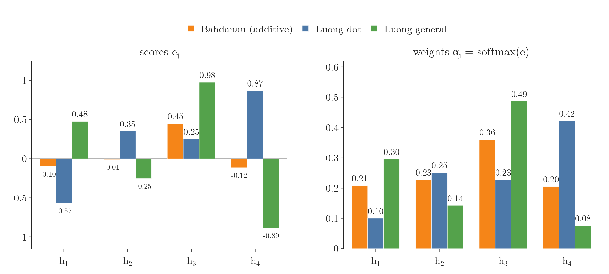
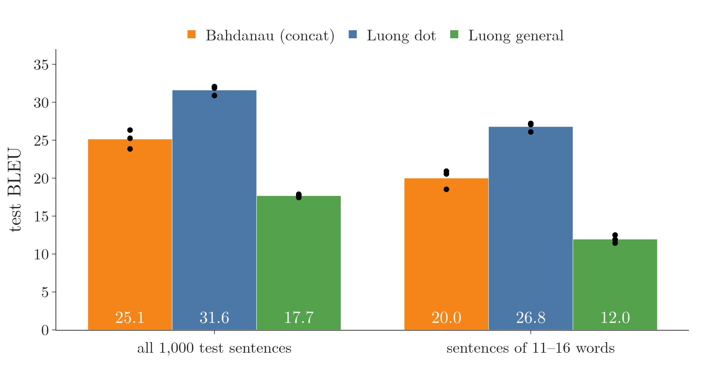
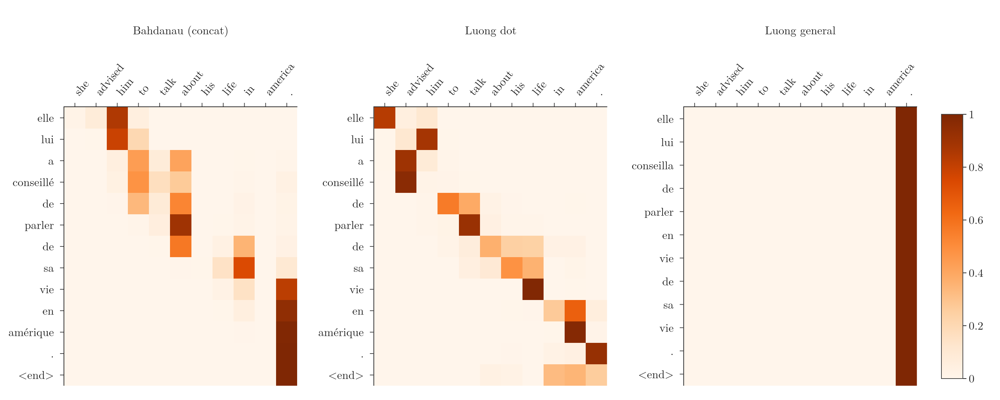

<!-- where-this-fits: generated by course_map/build_map.py; edit concepts.yaml, not this block -->
> **Where this fits:** Pipeline map step 8 (Model). See the [Course map](../../../00-course-map/00-course-map.md).
>
> 
>
> - **Builds on:** Attention mechanism ([Note DL-069](../../../DL/06-transformers/DL-069-attention-mechanism/DL-069-attention-mechanism.md)).
> - **Compare with:** Cross-attention ([Note DL-083](../../../DL/06-transformers/DL-083-cross-attention/DL-083-cross-attention.md)).
<!-- /where-this-fits -->

## 1. Overview

> **Key point:** Both attentions build the context vector as a weighted mix of the encoder states, $c_i = \sum_j \alpha_{ij} h_j$. They differ in two things: how they score each encoder state, and where the context enters the decoder. **Bahdanau** (additive) attention scores the previous decoder state $s_{i-1}$ against $h_j$ with a small neural network, and feeds $c_i$ *into* the LSTM step. **Luong** (multiplicative) attention scores the current state $s_i$ against $h_j$ with a dot product, and joins $c_i$ to the LSTM's *output*.

The [attention Note](../DL-069-attention-mechanism/DL-069-attention-mechanism.md) introduced attention in the encoder–decoder: at every decoder step, the **context vector** (G-460) is a weighted sum of all the encoder's hidden states. The weights are the **attention weights** (G-224) $\alpha_{ij}$, and they come from a **softmax** (G-1830) over raw scores, the **alignment scores** (G-190) $e_{ij}$. That Note left open how the scores are computed. This Note opens the two best-known answers: Bahdanau et al. (2015) and Luong et al. (2015). Luong's dot-product score is, apart from a scaling factor, the one the transformer uses (Vaswani et al. 2017, section 3.2.1).

{width=78%}

## 2. Prerequisites

- [Attention Note](../DL-069-attention-mechanism/DL-069-attention-mechanism.md): context vectors, alignment scores, softmax over the input positions.
- [Encoder–decoder Note](../DL-068-encoder-decoder/DL-068-encoder-decoder.md): encoder, decoder, teacher forcing.
- [Dot product and cosine similarity Note](../../../MA/05-linear-algebra/MA-050-dot-product-and-cosine-similarity/MA-050-dot-product-and-cosine-similarity.md): the dot product as a measure of similarity.
- [Forward propagation Note](../../01-basics/DL-010-forward-propagation/DL-010-forward-propagation.md): a dense layer as a matrix product.

## 3. Recap: what both must compute

> **Key point:** Both designs do the same three things at every decoder step: score every encoder state ($e_{ij}$), turn the scores into weights with a softmax ($\alpha_{ij}$), and add up the weighted states into the context $c_i = \sum_j \alpha_{ij} h_j$. Only the score function and the wiring differ.

For "turn off the lights" → "light band karo", decoder step 1 needs a context vector $c_1$, a weighted sum of the four encoder states:

$$c_1 = \alpha_{11}h_1 + \alpha_{12}h_2$$

$$\phantom{c_1} + \alpha_{13}h_3 + \alpha_{14}h_4$$

Step 2 needs $c_2$ with new weights, and so on: (number of input words) × (number of output words) weights in all. Each weight is a word-to-word similarity: $\alpha_{11}$ says how much "turn" counts when writing "light". The question of this Note is how to get the raw scores $e_{ij}$: the choice of **score function** (G-1752).

{width=90%}

In Figure 2, the softmax and the weighted sum are fixed; everything this Note compares happens inside the grey box.

## 4. Bahdanau attention

> **Key point:** A small neural network with one hidden layer looks at the decoder's previous state and one encoder state, and gives the pair a score: $e_{ij} = v^\top \tanh(W[s_{i-1}; h_j])$. The context vector is then an input of decoder step $i$.

### 4.1 What the score depends on

> **Key point:** On the encoder state $h_j$ and on the decoder's *previous* state $s_{i-1}$, which holds what has been translated so far.

As the [attention Note](../DL-069-attention-mechanism/DL-069-attention-mechanism.md) (section 6) explains, $\alpha_{ij}$ must depend on $h_j$, the input word being judged, and on what the decoder has already written, which is stored in $s_{i-1}$. To compute $\alpha_{11}$, the weight of "turn" for the first output word, we need $h_1$ and $s_0$; for $\alpha_{21}$ we need $h_1$ and $s_1$. Bahdanau et al. (2015) do not choose a formula for the score; they let a small **feed-forward network** (G-775) learn it, the **alignment model** (G-189).

### 4.2 The alignment network, step by step

> **Key point:** Concatenate $s_{i-1}$ with every $h_j$, pass the rows through a hidden layer with tanh, then through one output unit: one score per input word. Softmax gives the weights.

Take hidden states of size 4 and an alignment network with 3 hidden units and 1 output unit. At decoder step 1:

1. **Concatenate.** Join $s_0$ (4 numbers) with each of $h_1, \dots, h_4$ (4 numbers each). Stacked, the four rows form a $4 \times 8$ matrix $X$, one row per input word.
2. **Hidden layer.** Multiply by the $8 \times 3$ weight matrix $W$ and apply tanh: a $4 \times 3$ matrix. A bias can be added before the tanh.
3. **Output unit.** Multiply by the $3 \times 1$ vector $v$: 4 numbers, the scores $e_{11}, \dots, e_{14}$.
4. **Softmax** over the 4 scores gives $\alpha_{11}, \dots, \alpha_{14}$, and the weighted sum gives $c_1$.
5. **Decoder step.** $c_1$, $s_0$ and the input $y_0$ (`<start>`) go into the LSTM, which outputs the first word, "light", and the new state $s_1$.

At step 2 the same network runs again with $s_1$ in place of $s_0$. In the $4 \times 8$ matrix only the left half changes; the encoder states on the right stay the same. The changing decoder state is why every step gets different weights. The network's weights are shared across all decoder steps, like a time-distributed dense layer, and are updated by backpropagation together with the two LSTMs.

1. **In words:** concatenate the two states, apply one tanh hidden layer, then one output unit; softmax over the input positions.
2. **Formula** (Bahdanau et al. 2015, appendix A.1.2):
   $$e_{ij} = v^\top \tanh\left(W [s_{i-1}; h_j]\right)$$

   $$e_{ij} = v^\top \tanh\left(W_a s_{i-1} + U_a h_j\right)$$

   $$\alpha_{ij} = \frac{\exp(e_{ij})}{\sum_k \exp(e_{ik})}$$

   $$c_i = \sum_j \alpha_{ij} h_j$$
   The two forms are the same: multiplying the joined vector $[s; h]$ by $W$ equals multiplying $s$ by the left half of $W$ and $h$ by the right half, and adding.
3. **Example:** the decoder state $s = [0.5, -0.2, 0.8, 0.1]$ and four encoder states, the first being $h_1 = [0.3, -0.5, -0.9, -1.0]$ (the Notebook lists all four and the weights $W$ and $v = [0.1, -0.4, 0.2]$). For $j = 1$, the joined row is $[0.5, -0.2, 0.8, 0.1, 0.3, -0.5, -0.9, -1.0]$.

   Multiplying the joined row by $W$ gives 3 numbers, one per hidden unit. Each number is the sum of 8 products: an input times its weight in that unit's column of $W$. Every product, then the column sums:

   | Input | $W$, unit 1 | $W$, unit 2 | $W$, unit 3 | Product, unit 1 | Product, unit 2 | Product, unit 3 |
   |---|---|---|---|---|---|---|
   | 0.5 | 0.7 | 0.1 | -0.4 | 0.35 | 0.05 | -0.20 |
   | -0.2 | -0.2 | -0.9 | -0.8 | 0.04 | 0.18 | 0.16 |
   | 0.8 | 0.3 | 0.3 | 0.2 | 0.24 | 0.24 | 0.16 |
   | 0.1 | -0.2 | 1.0 | 1.0 | -0.02 | 0.10 | 0.10 |
   | 0.3 | 0.4 | 0.3 | 0.4 | 0.12 | 0.09 | 0.12 |
   | -0.5 | -0.2 | -0.7 | 0.4 | 0.10 | 0.35 | -0.20 |
   | -0.9 | 0.1 | -0.4 | 0.0 | -0.09 | 0.36 | 0.00 |
   | -1.0 | 0.8 | 0.9 | -0.3 | -0.80 | -0.90 | 0.30 |
   | **Sum** | | | | $-0.06$ | $0.47$ | $0.44$ |

   The three sums are $[-0.06, 0.47, 0.44]$. The tanh of each gives $[-0.060, 0.438, 0.414]$. Then each is multiplied by its weight in $v$ and the results are added:
   $$0.1 \times (-0.060) = -0.0060$$
   $$-0.4 \times 0.438 = -0.1752$$
   $$0.2 \times 0.414 = 0.0828$$
   $$e_1 = -0.0060 - 0.1752 + 0.0828 = -0.0984$$

   The Notebook, using unrounded values, gives $e_1 = -0.099$.

   The four scores are $(-0.099, -0.011, 0.449, -0.116)$, and softmax turns them into the weights $(0.208, 0.227, 0.360, 0.205)$. The score function has 27 learned numbers:

   $$8 \times 3 + 3 = 27$$

{width=100%}

Figure 3 puts this example next to the two Luong scores of section 5.1. Each function ranks the four states differently: the additive network favours $h_3$, the dot score $h_4$, the general score $h_3$ again but more strongly. The softmax keeps the order of the scores and turns them into weights that add up to 1.

Because the score adds a term from $s_{i-1}$ to a term from $h_j$ inside the tanh, Bahdanau attention is also called **additive attention** (G-255; Vaswani et al. 2017, section 3.2.1). Since $U_a h_j$ does not depend on $i$, it can be computed once per sentence (Bahdanau et al. 2015, appendix A.1.2).

## 5. Luong attention

> **Key point:** Two changes. The score uses the *current* decoder state $s_i$, and it is a simple product: $e_{ij} = s_i^\top h_j$ (dot) or $s_i^\top W_a h_j$ (general). The context vector is joined to $s_i$ after the LSTM step, not fed into it.

Luong, Pham and Manning (2015) kept the goal and changed the means.

### 5.1 A simpler score

> **Key point:** Two similar vectors have a large dot product. Using the dot product as the score needs no network at all.

The aim of the score is not to approximate some exact function; it is to find which encoder states are useful now. A similarity measure does that job, and the simplest one is the **dot product** (G-634) (the [dot product Note](../../../MA/05-linear-algebra/MA-050-dot-product-and-cosine-similarity/MA-050-dot-product-and-cosine-similarity.md)): large when two vectors point the same way, small or negative when they do not. Luong et al. (2015, section 3.1) proposed three content-based scores:

| Name | Score $e_{ij}$ | Learned parameters |
|---|---|---|
| dot | $s_i^\top h_j$ | none |
| general | $s_i^\top W_a h_j$ | one matrix $W_a$ |
| concat | $v_a^\top \tanh(W_a [s_i; h_j])$ | $W_a$ and $v_a$, as in Bahdanau |

The dot score requires $s_i$ and $h_j$ to have the same size; the general score lifts that requirement and lets the model learn which directions of similarity matter (SLP3 §14.8). Because the score multiplies the two states, this family is called **multiplicative attention** (G-1137; Vaswani et al. 2017, section 3.2.1).

1. **In words:** multiply the decoder state and each encoder state element by element and add up (dot), or first transform the encoder state by a learned matrix (general).
2. **Formula:**
   $$e_{ij} = s_i^\top h_j \ \ \text{(dot)}, \qquad e_{ij} = s_i^\top W_a h_j \ \ \text{(general)}$$
3. **Example:** the same $s = [0.5, -0.2, 0.8, 0.1]$ and $h_1 = [0.3, -0.5, -0.9, -1.0]$:
   $$e_1 = 0.5(0.3) + (-0.2)(-0.5)$$

   $$\phantom{e_1} + 0.8(-0.9) + 0.1(-1.0)$$

   $$e_1 = 0.15 + 0.10 - 0.72 - 0.10$$

   $$e_1 = -0.57$$
   The four dot scores are $(-0.57, 0.35, 0.25, 0.87)$, with weights $(0.100, 0.251, 0.227, 0.422)$: no learned numbers at all. With a $4 \times 4$ matrix $W_a$ (16 learned numbers, in the Notebook) the general scores are $(0.477, -0.254, 0.975, -0.887)$, with weights $(0.296, 0.142, 0.486, 0.076)$. The three functions rank the four states differently. Here the states and the weights are random numbers; in a trained model, training sets them so that the useful encoder states get the high scores, whichever function is used.

### 5.2 The current state, and the context on the output side

> **Key point:** The LSTM step runs first. Its new state $s_i$ is scored against the encoder states, and $\tilde h_i = \tanh(W_c[c_i; s_i])$ feeds the softmax.

Bahdanau's decoder goes $s_{i-1} \to \alpha_i \to c_i \to s_i$: the context must be ready before the LSTM step. Luong's goes $s_i \to \alpha_i \to c_i \to \tilde h_i$ (Luong et al. 2015, section 3.1):

1. The decoder LSTM takes $y_{i-1}$ and $s_{i-1}$ and produces $s_i$, with no context vector.
2. $s_i$ is scored against every $h_j$; softmax gives $\alpha_{ij}$; the weighted sum gives $c_i$.
3. $c_i$ and $s_i$ are joined and passed through a dense layer with tanh: the **attentional hidden state** (G-227) $\tilde h_i = \tanh(W_c[c_i; s_i])$.
4. A softmax layer on $\tilde h_i$ gives the next word: $p(y_i) = \text{softmax}(W_s \tilde h_i)$.
5. $s_i$ (not $\tilde h_i$) and the word $y_i$ go on to step $i+1$.

Scoring with $s_i$ uses the most recent state, which already includes the latest word written. Figure 1 shows the two wirings side by side.

{height=55%}

Figure 4 builds the same step in both designs, one operation at a time, from the bottom up. Watch where the green context box lands: below the LSTM step on the left, above it on the right.

> **Python:** Luong attention for all decoder steps at once (training, teacher forcing). `S`: decoder states, shape (batch, $m$, 256); `hs`: encoder states, (batch, $n$, 256).
>
> ```python
> keys = Wa(hs) if general else hs                       # general: s^T W h = s . (W h)
> e = tf.einsum("bid,bjd->bij", S, keys)                 # scores, (batch, m, n)
> a = tf.nn.softmax(e - 1e9 * pad[:, None, :], axis=-1)  # padding gets weight 0
> ctx = tf.einsum("bij,bjd->bid", a, hs)                 # context vectors, (batch, m, 256)
> logits = out(Wc(tf.concat([ctx, S], -1)))              # Wc: Dense(256, "tanh")
> ```

> **Extra:** Luong et al. (2015, section 3.3) also propose **input feeding** (G-949): $\tilde h_{i-1}$ is joined to the next input, so that the model remembers its past alignment choices. With input feeding the LSTM again needs the previous step's attention before it can run. The Notebook leaves it out, as in Luong's basic global model of section 3.1.

## 6. The two compared

> **Key point:** On the same data, Luong's dot attention was the best of the three and the fastest to train: test BLEU 31.6 against 25.1 for Bahdanau's additive attention, with a third fewer parameters and less than half the time per epoch. Luong's general score did worst (17.7): its model learned to put all its weight on the last word.

### 6.1 Summary of the differences

> **Key point:** Which decoder state, which score, where the context goes.

| | Bahdanau (2015) | Luong (2015) |
|---|---|---|
| Decoder state scored | previous, $s_{i-1}$ | current, $s_i$ |
| Score $e_{ij}$ | $v^\top \tanh(W_a s_{i-1} + U_a h_j)$ | $s_i^\top h_j$ (dot) or $s_i^\top W_a h_j$ (general) |
| Other name | additive attention | multiplicative attention |
| Learned parameters in the score | $W_a$, $U_a$, $v$ | none (dot) or $W_a$ (general) |
| Where $c_i$ goes | input of the LSTM step | joined to $s_i$ after the step: $\tilde h_i = \tanh(W_c[c_i; s_i])$ |

Luong et al. (2015, section 3.1) describe their path $s_i \to \alpha_i \to c_i \to \tilde h_i$ as "simpler" than Bahdanau's. Vaswani et al. (2017, section 3.2.1) add that the two are similar in theoretical complexity, but dot-product attention "is much faster and more space-efficient in practice, since it can be implemented using highly optimized matrix multiplication code".

### 6.2 The experiment

> **Key point:** Three attention models on the same 60,000 sentence pairs, 3 runs each.

The Notebook trains the attention model of the [attention Note](../DL-069-attention-mechanism/DL-069-attention-mechanism.md) (Bahdanau) and two Luong models (dot and general) on the same English–French data, with the same bidirectional encoder and the same decoder LSTM of 256 units, for 12 epochs, 3 runs each. Translation quality is measured by the **BLEU score** (G-315): how many word sequences of a translation match a human reference. The Luong models follow equations 5–7 of Luong et al. (2015) without input feeding.

| | Bahdanau (concat) | Luong dot | Luong general |
|---|---|---|---|
| Parameters | 8.42 million | 5.66 million | 5.73 million |
| Seconds per epoch (median, shared GPU) | 51 | 22 | 20 |
| Final training loss | 0.77 | 0.80 | 1.06 |
| Test BLEU, all 1,000 sentences | 25.1 | **31.6** | 17.7 |
| Test BLEU, sentences of 11–16 words | 20.0 | **26.8** | 12.0 |

{width=90%}

In Figure 5 the runs of each model sit close together, while the gaps between the models are several BLEU points: the ranking dot, then Bahdanau, then general holds for every run and both sentence groups.

The Bahdanau numbers differ slightly from those of the [attention Note](../DL-069-attention-mechanism/DL-069-attention-mechanism.md) (25.7) because GPU training is not exactly repeatable. The differences between the models are much larger than that.

**Parameters.** Bahdanau's model has more because its output layer reads $[s_i; c_i]$ (512 numbers) and its LSTM reads $[y_{i-1}; c_i]$; Luong's output layer reads the 256-number $\tilde h_i$. The scores themselves are a small part: the dot score has no parameters, and general adds one $256 \times 256$ matrix (65,536 numbers).

**Time.** In Bahdanau's model, $c_i$ is an input of LSTM step $i$, so each step must wait for the attention of that step: the decoder runs as a loop of small operations. In Luong's model the LSTM never needs $c_i$, so during training (with **teacher forcing**, G-1955) the decoder LSTM runs over the whole gold sentence in one call, and the attention for all steps at once is two matrix products, $S H^\top$ for the scores and $A H$ for the contexts. Each epoch took less than half the time.

**Quality.** Luong's dot attention gave the best translations at all lengths. The general score did worst; Luong et al. (2015, Table 4) also found dot better than general for global attention (BLEU 18.6 against 17.3 on English–German).

{width=100%}

Figure 6 shows why the general model did badly. On the test sentence "she advised him to talk about his life in america .", the dot model's weights form a clean diagonal: "elle" looks at "she", "lui" at "him", "conseillé" at "advised", "parler" at "talk", "vie" at "life", "amérique" at "america". Bahdanau's model also forms a band, but it often sits to the right of the matching word ("parler" looks at "about"). Attention weights need not match a word alignment, and the same off-by-one attention has been reported in a trained Bahdanau-type system ([attention Note](../DL-069-attention-mechanism/DL-069-attention-mechanism.md), section 8). The general model puts a weight of 1 on the final "." at every step. Its context vector is then the same at every step: the state of the last word, whose forward half has read the whole sentence. The model has turned itself back into a plain encoder–decoder with one fixed summary, and its translation of this sentence goes wrong at the end ("elle lui conseilla de parler en vie de sa vie .").

## 7. Summary

| | Bahdanau | Luong |
|---|---|---|
| Score | additive: small network on $[s_{i-1}; h_j]$ | multiplicative: $s_i^\top h_j$ or $s_i^\top W_a h_j$ |
| Decoder state used | previous ($s_{i-1}$) | current ($s_i$) |
| Context vector enters | the LSTM step | the output layer, via $\tilde h_i$ |
| In the Notebook | BLEU 25.1, 51 s per epoch | dot: BLEU 31.6, 22 s per epoch |

- Both compute weights $\alpha_{ij}$ by a softmax over scores and a context vector $c_i = \sum_j \alpha_{ij} h_j$.
- Bahdanau scores the previous decoder state with a one-hidden-layer network; the context is an input of the next LSTM step.
- Luong scores the current decoder state with a dot product (or a bilinear form), and joins the context to the state after the LSTM step.
- The dot product needs no parameters and, without input feeding, lets attention for all decoder steps be computed with matrix products.
- The dot-product score is the one the transformer's self-attention builds on.

## 8. Sources

**Built from**

- CampusX, "Bahdanau Attention Vs Luong Attention", YouTube, https://www.youtube.com/watch?v=0hZT4_fHfNQ

**Other references**

- Bahdanau, D., Cho, K. and Bengio, Y. (2015). Neural Machine Translation by Jointly Learning to Align and Translate. *ICLR 2015*. arXiv:1409.0473. Section 3.1 (eq. 4–6); appendix A.1.2 (the alignment model $v_a^\top \tanh(W_a s_{i-1} + U_a h_j)$, pre-computing $U_a h_j$).
- Luong, M.-T., Pham, H. and Manning, C. D. (2015). Effective Approaches to Attention-based Neural Machine Translation. *EMNLP 2015*. arXiv:1508.04025. Section 3 (eq. 5–8: attentional hidden state, the dot, general and concat scores); 3.1 (comparison with Bahdanau et al.); 3.3 (input feeding); Table 4 and section 5.3 (choice of score function).
- Vaswani, A. et al. (2017). Attention Is All You Need. *NeurIPS 2017*. arXiv:1706.03762. Section 3.2.1 (additive and dot-product (multiplicative) attention).
- Jurafsky, D. and Martin, J. H. *Speech and Language Processing*, 3rd ed. draft (19 August 2026), web.stanford.edu/~jurafsky/slp3. Chapter 14, §14.8 (dot-product attention; the bilinear score allows states of different sizes). Cited as SLP3.
- Tatoeba project and manythings.org/anki: the English–French sentence pairs, distributed as `fra-eng.zip` with the Keras examples.

## 9. Key terms

| Term | Meaning |
|---|---|
| Bahdanau attention (additive) | Attention whose score is a one-hidden-layer network on the previous decoder state and an encoder state: $v^\top \tanh(W_a s_{i-1} + U_a h_j)$ |
| Luong attention (multiplicative) (G-1137) | Attention whose score multiplies the current decoder state with an encoder state: $s_i^\top h_j$ or $s_i^\top W_a h_j$ |
| Score function | The function that gives the raw score $e_{ij}$ of encoder state $j$ for decoder step $i$ |
| Dot score | $s_i^\top h_j$; needs no parameters and states of equal size |
| General score | $s_i^\top W_a h_j$, with a learned matrix $W_a$ |
| Concat score | $v_a^\top \tanh(W_a[s_i; h_j])$, the additive form |
| Attentional hidden state $\tilde h_i$ | $\tanh(W_c[c_i; s_i])$: the decoder state combined with the context vector, read by Luong's output layer |
| Input feeding | Luong's option of feeding $\tilde h_{i-1}$ into the next decoder step |
