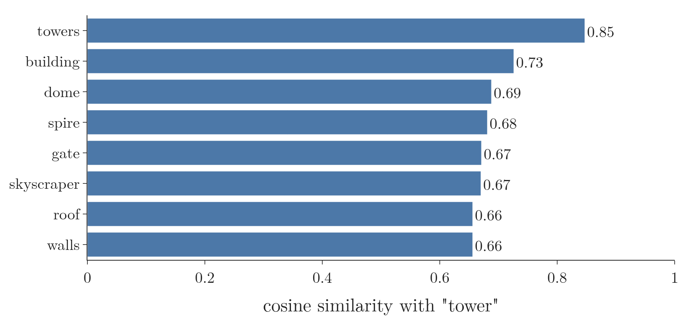
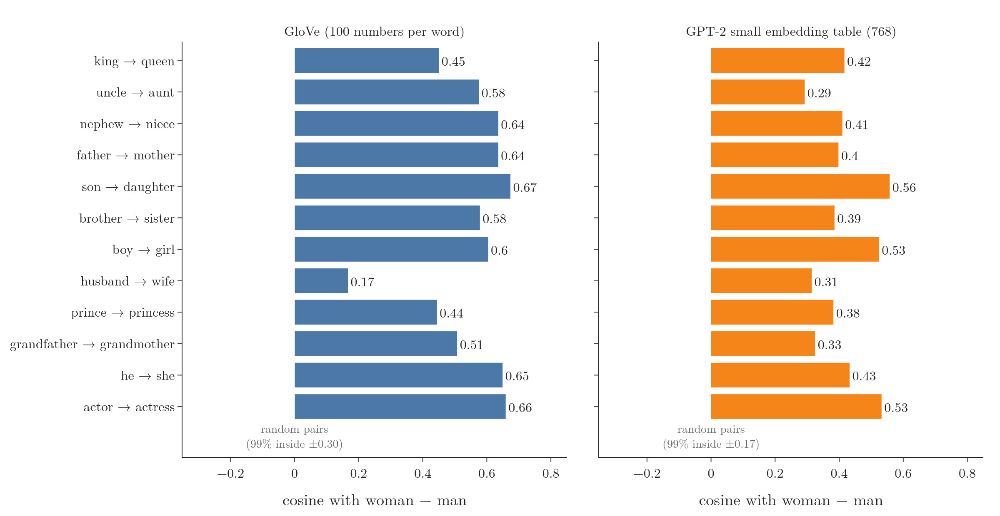
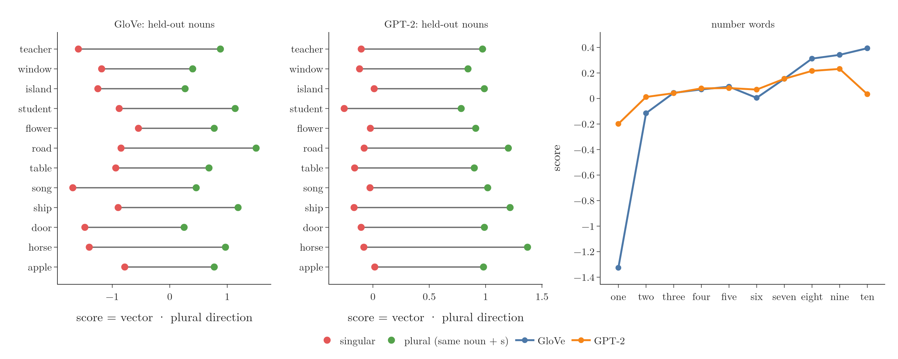
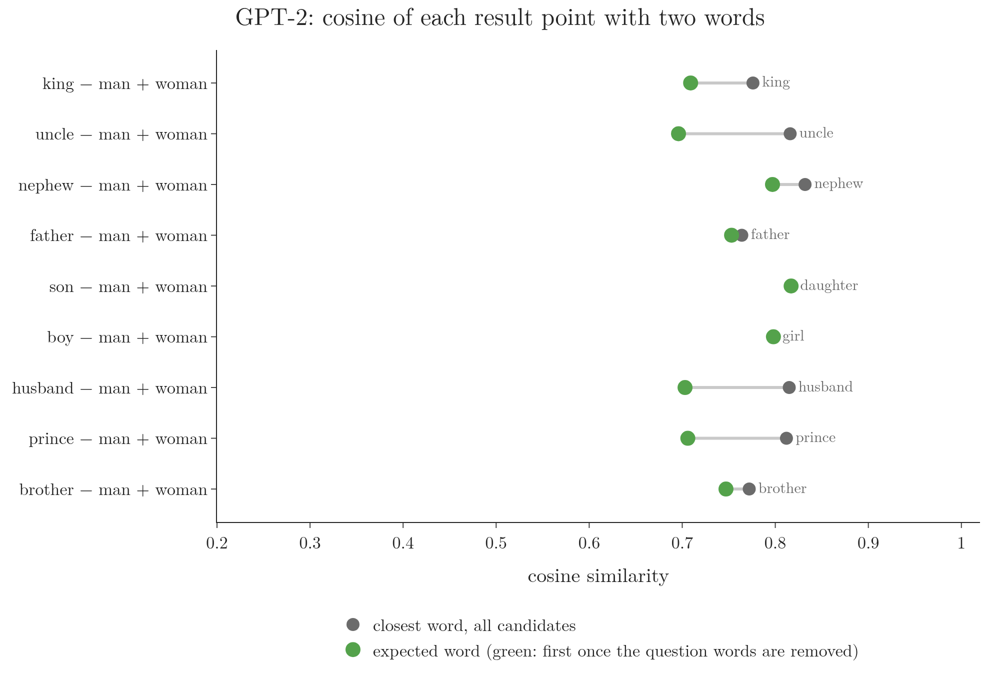

<!-- where-this-fits: generated by course_map/build_map.py; edit concepts.yaml, not this block -->
> **Where this fits:** Pipeline map step 5 (Engineer features). See the [Course map](../../../00-course-map/00-course-map.md).
>
> 
>
> - **Builds on:** [Dot product](../../../MA/05-linear-algebra/MA-050-dot-product-and-cosine-similarity/MA-050-dot-product-and-cosine-similarity.md#3-computing-the-dot-product); [Word embeddings](../../../DL/05-rnn/DL-057-rnn-sentiment-analysis/DL-057-rnn-sentiment-analysis.md#6-word-embeddings).
> - **Leads to:** [Superposition and nearly perpendicular directions](../../../DL/06-transformers/DL-090-superposition/DL-090-superposition.md#8-the-superposition-hypothesis-and-a-toy-model).
<!-- /where-this-fits -->

## 1. Overview

> **Key point:** In a trained **word embedding** (G-2127), meaning lives in **directions** (G-613): the arrow from "man" to "woman" points roughly the same way as the arrow from "uncle" to "aunt", so adding it to "uncle" lands next to "aunt". A **dot product** (G-634) with a direction measures how much of that meaning a word carries, in GloVe and in GPT-2's first layer alike.

A [word embedding](../../05-rnn/DL-057-rnn-sentiment-analysis/DL-057-rnn-sentiment-analysis.md#6-word-embeddings) gives each word a dense vector (a short list of numbers, for example 100), learned so that words used in similar ways get similar vectors. The [first look at embeddings](../../05-rnn/DL-057-rnn-sentiment-analysis/DL-057-rnn-sentiment-analysis.md#73-what-the-embedding-learned) used *distances*: similar words sit close together. This Note looks at *directions*: what the arrow between two word vectors means, and what we can do with it.

We use two real embedding tables:

1. **GloVe** (G-851), 100 numbers per word, trained on 6 billion **tokens** (G-1981; here single words and punctuation marks) of Wikipedia and news text (Pennington et al. 2014). We keep its 100,000 most frequent words.
2. **GPT-2 small's token-embedding table** (G-1980), 768 numbers per token (for GPT-2, a word or a piece of a word), the first layer of a real transformer (Radford et al. 2019).

Figure 1 shows the central idea on real GloVe vectors. We cannot draw 100 dimensions (each of a vector's 100 numbers is one dimension), so the figure draws the flat sheet (a plane) that passes through the points for man, woman and king. Watch the orange arrow "woman − man" being lifted onto "king": its tip lands near "queen", but not on it.

{width=100%}

> **Extra:** Two ideas of this Note follow Sanderson's "Transformers, the tech behind LLMs" (3Blue1Brown, Deep Learning Chapter 5, 2024): adding the woman − man difference to king and searching for the nearest word, which he notes lands only "kind of" near queen, with family relations working better (14:37–15:39); and taking the dot product of cats − cat with singular and plural nouns and with one, two, three, … as a plurality probe (16:44–17:44). The figures, their design and their data are our own.

## 2. Prerequisites

- [Word embeddings](../../05-rnn/DL-057-rnn-sentiment-analysis/DL-057-rnn-sentiment-analysis.md#6-word-embeddings): dense, learned vectors; the embedding layer as a lookup table.
- [Cosine similarity](../../../MA/05-linear-algebra/MA-050-dot-product-and-cosine-similarity/MA-050-dot-product-and-cosine-similarity.md#6-cosine-similarity): the dot product, its sign, and cosine similarity as the angle between two vectors.
- [The dot product as a projection](../../../MA/05-linear-algebra/MA-055-dot-product-and-duality/MA-055-dot-product-and-duality.md#2-the-dot-product-as-a-projection): the dot product with a unit vector is the length of the projection onto it.
- [Three views of a vector](../../../MA/05-linear-algebra/MA-048-vectors-and-feature-vectors/MA-048-vectors-and-feature-vectors.md#22-three-views-arrow-list-and-point): a vector as a point or an arrow in $n$ dimensions; subtracting two vectors gives the arrow from one to the other.

## 3. A word is a point; nearby points share meaning

> **Key point:** Each word is one point in a 100-dimensional space (a vector of 100 numbers, one number per dimension). Words whose vectors make a small angle (high cosine similarity) are used in similar ways.

GloVe gives each word a vector of 100 numbers. We cannot draw 100 dimensions, but we can measure angles. The **cosine similarity** (G-491) of two vectors (see [the definition and range](../../../MA/05-linear-algebra/MA-050-dot-product-and-cosine-similarity/MA-050-dot-product-and-cosine-similarity.md#62-definition-and-range)) is 1 when they point the same way and 0 when they are perpendicular. The 8 words with the highest cosine similarity to "tower" are (Notebook): towers (0.85), building (0.73), dome (0.69), spire (0.68), gate (0.67), skyscraper (0.67), roof (0.66) and walls (0.66) (Figure 2).

{width=75%}

All of them are tall structures or parts of buildings. Distances say *which* words are alike. They do not yet say *how* two words differ. For that we look at the arrow between them.

## 4. The difference between two words is a direction

> **Key point:** The arrow from a male word to its female counterpart points roughly the same way for many pairs. In GloVe its cosine with woman − man is between 0.44 and 0.67 for 11 of 12 pairs, while 99 percent of random word pairs stay within ±0.30.

Subtracting two vectors gives the arrow from one point to the other. Call $g = e_{\text{woman}} - e_{\text{man}}$ the "woman − man" arrow. If the embedding stores gender as a direction, then $e_{\text{aunt}} - e_{\text{uncle}}$, $e_{\text{mother}} - e_{\text{father}}$ and so on should point roughly along $g$.

We test this with the cosine between each pair's arrow and $g$ (Figure 3). As a baseline, the Notebook draws 5,000 random pairs of common words and measures the same cosine for their arrows.

{width=100%}

- **GloVe:** 11 of the 12 pairs have cosines from 0.44 (prince → princess) to 0.67 (son → daughter). Random pairs average 0.00, and 99 percent lie within ±0.30. The exception is husband → wife, at 0.17.
- **GPT-2:** all 12 pairs lie between 0.29 and 0.56, above its random band of ±0.17.

The arrows are far from identical: a cosine of 0.6 is an angle of about 53 degrees. But they all lean the same way, much more than chance allows. Somewhere among the 100 directions, one direction tracks "female versus male".

**Why training produces directions.** GloVe was designed for exactly this. Its authors start from co-occurrence counts: how often word $k$ appears near word $i$, giving a **co-occurrence probability** (G-404) $P_{ik}$. Their Table 1 shows that a *ratio* of two such probabilities picks out what distinguishes two words: "solid" appears 8.9 times more often near "ice" than near "steam", "gas" about 12 times less often, and "water", related to both, about equally often (ratio 1.36). GloVe trains the vectors so that a word vector $w_i$ dotted with a context vector $\tilde w_k$ gives the log of the probability (Pennington et al. 2014, §3, eqs. 1–7). For two words $i$ and $j$ and the same context word $k$:

$$w_i \cdot \tilde w_k \approx \log P_{ik}$$
$$w_j \cdot \tilde w_k \approx \log P_{jk}$$

Subtract the second line from the first, and use the rule $\log a - \log b = \log(a/b)$:

$$(w_i - w_j) \cdot \tilde w_k \approx \log P_{ik} - \log P_{jk}$$
$$(w_i - w_j) \cdot \tilde w_k \approx \log \frac{P_{ik}}{P_{jk}}$$

For $i$ = ice, $j$ = steam and $k$ = solid, the ratio is 8.9, so the right side is (natural log):

$$\log 8.9 = 2.19$$

The arrow from steam to ice has a large dot product with the context vector of "solid".

So the arrow between two words is trained to encode how their contexts differ. "Uncle" and "aunt" differ in their contexts much as "man" and "woman" do (for example, in how often "he" or "she" appears nearby), so their arrows end up pointing in similar directions. GPT-2 learns its table differently, by predicting the next token, yet Figure 3 shows the same structure.

## 5. Arithmetic with directions

> **Key point:** Adding the woman − man arrow to "uncle", "nephew" or "father" lands closest to "aunt", "niece" and "mother". For "king" the result is a near miss: "king" itself stays the closest word, and "queen" is second.

If $g$ means "more female", then adding $g$ to "king" should land near "queen":

$$e_{\text{king}} + g$$
$$= e_{\text{king}} - e_{\text{man}} + e_{\text{woman}}$$

Pennington et al. (2014, §4.1) answer such an **analogy question** (G-196), "a is to b as c is to ?", with the word whose vector has the largest cosine similarity with $w_b - w_a + w_c$. Figure 1 animates this rule on the real GloVe vectors, and the table gives the results (Notebook). "Rank" is the place of the expected word when the three question words are removed from the candidates. Figure 4 draws the same results.

{width=95%}

| Question | Closest word, all candidates | Closest without the question words | Rank of the expected word | Its cosine |
|---|---|---|---|---|
| king − man + woman | **king** (0.855) | queen, monarch, throne | 1 (queen) | 0.783 |
| uncle − man + woman | aunt | aunt, daughter, mother | 1 | 0.828 |
| nephew − man + woman | niece | niece, daughter, granddaughter | 1 | 0.866 |
| father − man + woman | mother | mother, daughter, wife | 1 | 0.914 |
| son − man + woman | daughter | daughter, wife, mother | 1 | 0.919 |
| boy − man + woman | girl | girl, mother, child | 1 | 0.911 |
| prince − man + woman | **prince** | princess, daughter, queen | 1 | 0.762 |
| husband − man + woman | **husband** | wife, mother, daughter | 1 | 0.844 |
| brother − man + woman | daughter | daughter, wife, mother | **6** (sister) | 0.828 |
| hitler − germany + italy | mussolini | mussolini, fascist, stalin | 1 | 0.816 |
| sushi − japan + germany | pastry | pastry, ducasse, gourmet | **123** (bratwurst) | 0.396 |

Three things stand out.

1. **Family words work best.** For uncle, nephew, father, son and boy the expected word is the closest word of all 100,000, even with the question words left in.
2. **King → queen is a near miss.** With every word allowed, the closest word to king − man + woman is "king" itself (cosine 0.855); "queen" is second (0.783). By plain distance the point is also closer to king (3.36) than to queen (4.08). In Figure 1's flat slice, queen appears close by, but its true position is 3.6 units off that slice. The arrow moves "king" *towards* "queen" without reaching it.
3. **Not every pair works.** brother − man + woman ranks "sister" only sixth, behind daughter, wife, mother, husband and father. And in GloVe, sushi − japan + germany gives "pastry"; "bratwurst" ranks 123rd.

> **Extra:** The direction is learned from how words are used, so it carries whatever the text associates with each word. "Queen" is used for monarchs, but also for bands, chess pieces and card games, so its vector is not just "female king". [Static embeddings hold an average meaning](../DL-073-what-is-self-attention/DL-073-what-is-self-attention.md#4-static-embeddings-hold-an-average-meaning) measures the same averaging effect for "bank".

## 6. A dot product reads how much of a direction a word has

> **Key point:** Average the arrows from singular to plural over 10 nouns to get a "plural direction". Its dot product with a word's vector scores how plural the word is: on 12 nouns not used to build it, every plural scores above its singular, in GloVe and in GPT-2.

Section 4 compared two arrows. A direction can also be used as a **probe** (G-1575) for a single word. Take a **unit vector** (G-2048) $p$ (length 1). By [the dot product as a projection](../../../MA/05-linear-algebra/MA-055-dot-product-and-duality/MA-055-dot-product-and-duality.md#2-the-dot-product-as-a-projection), the dot product $e \cdot p$ is the length of the shadow of $e$ on the line through $p$: large and positive when $e$ points along $p$, zero when it is perpendicular, negative when it points away.

A tiny case with 2-number vectors: the unit vector is $p = (0.6, 0.8)$. Its length is 1:

$$\sqrt{0.36 + 0.64} = 1$$

A word with $e = (2, 1)$ and another with $e = (-1, 0.5)$ score:

$$e \cdot p = 2 \times 0.6 + 1 \times 0.8 = 2.0$$
$$e \cdot p = (-1) \times 0.6 + 0.5 \times 0.8 = -0.2$$

The first word points along $p$ (large, positive), the second slightly away from it (small, negative). The three steps of the probe:

1. **Build the direction:** average the arrows (plural − singular) of 10 pairs, such as cat → cats, dog → dogs, city → cities, then scale the result to length 1. This is $p$, the **plural direction** (G-1506).
2. **Score a word:** compute $e_{\text{word}} \cdot p$.
3. **Test on new words:** 12 other pairs, from apple/apples to teacher/teachers, none of them used in step 1.

{width=100%}

Figure 5 gives the results (Notebook):

| | GloVe | GPT-2 small |
|---|---|---|
| Held-out pairs where the plural scores higher | 12 of 12 | 12 of 12 |
| Mean score, singular nouns | −1.12 | −0.09 |
| Mean score, plural nouns | 0.77 | 1.02 |
| Rank correlation of the scores of one … ten with 1 … 10 (1 means the scores rise in exactly the order of the numbers) | 0.93 | 0.62 |

The probe separates singular from plural for every new noun. On the number words the picture is rougher. In GloVe, "one" scores lowest by far (−1.33), and the scores rise, with small dips, up to "ten" (0.39). In GPT-2 they rise from "one" (−0.20) to "nine" (0.23), but "ten" drops back to 0.03. The direction captures "one versus many" clearly and "how many" only roughly.

This is the same dot product that attention uses to compare a query with a key (see [dot products as similarity](../DL-074-self-attention-step-by-step/DL-074-self-attention-step-by-step.md#41-dot-products-as-similarity)): a large dot product means the two vectors point the same way.

## 7. The same structure inside a transformer

> **Key point:** GPT-2 small's token-embedding table, the first layer of a real transformer, passes the same tests: all 9 family analogies put the expected word first once the question words are removed, and the plural probe scores 12 of 12.

GPT-2 small turns each token into a 768-number vector by looking it up in a table of 50,257 rows (see [token and position embeddings](../DL-087-decoder-only-gpt/DL-087-decoder-only-gpt.md#5-from-tokens-to-vectors-token-and-position-embeddings)). The table is learned while the model learns to predict the next token, not by a co-occurrence objective like GloVe. Every word we test is a single GPT-2 token with a leading space, such as " king".

| Question | Closest, all candidates | Closest without the question words | Its cosine |
|---|---|---|---|
| king − man + woman | king | queen | 0.709 |
| uncle − man + woman | uncle | aunt | 0.696 |
| nephew − man + woman | nephew | niece | 0.797 |
| father − man + woman | father | mother | 0.753 |
| son − man + woman | daughter | daughter | 0.817 |
| boy − man + woman | girl | girl | 0.798 |
| husband − man + woman | husband | wife | 0.703 |
| prince − man + woman | prince | princess | 0.706 |
| brother − man + woman | brother | sister | 0.747 |

Once the three question words are removed, all 9 expected words come first (Figure 6), including "sister", which GloVe ranked sixth. With every word allowed, the starting word itself is the closest in 7 of the 9 questions: the arrow moves the point towards the answer, but in GPT-2's table it usually does not carry it past the starting word.

{width=95%}

Two links to later Notes:

- These are only the *first* vectors of GPT-2. Its attention layers then change each vector according to the words around it ([static and contextual embeddings](../DL-073-what-is-self-attention/DL-073-what-is-self-attention.md#5-static-and-contextual-embeddings)).
- GPT-2 uses this same table a second time, at the very end, to turn its last vector into a score for every token (see [the unembedding](../DL-088-unembedding-and-sampling/DL-088-unembedding-and-sampling.md#3-the-unembedding-one-dot-product-per-token)). A direction in this table is therefore also a direction the model can read out.

## 8. Summary

| Idea | What we measured (GloVe) | GPT-2 small table |
|---|---|---|
| Nearby points share meaning | the 8 nearest words to "tower" are all structures | (not measured) |
| A word pair's arrow is a direction | female − male arrows: cosine 0.44–0.67 with woman − man for 11 of 12 pairs; random pairs within ±0.30 | 0.29–0.56; random within ±0.17 |
| Arithmetic with directions | uncle, nephew, father, son, boy → right word first; king → "queen" second, after "king"; brother → "sister" sixth | all 9 right once the question words are removed |
| A dot product is a probe | plural direction: 12 of 12 held-out plurals above their singular | 12 of 12 |

- Meaning sits in directions: the arrow between two related words points the same way for many pairs.
- Adding a direction to a word moves it towards the matching word. In GloVe it lands on the answer for uncle, nephew, father, son and boy; for king, prince and husband the starting word stays closest; brother → sister ranks only sixth.
- A dot product with a unit direction measures how much of that meaning a word carries.
- GloVe is trained so that word differences encode context differences; GPT-2's embedding table, trained only to predict the next token, shows the same structure.

## 9. Sources

**Built from**

- Sanderson, G. (3Blue1Brown), "Transformers, the tech behind LLMs | Deep Learning Chapter 5", 2024, 3blue1brown.com/lessons/gpt, https://www.youtube.com/watch?v=wjZofJX0v4M. Directions carry meaning; king plus woman − man lands near queen, only roughly; the cats − cat plurality probe and the number words (13:33–17:44).
- Pennington, J., Socher, R. and Manning, C. D. (2014). GloVe: Global Vectors for Word Representation. *EMNLP 2014*, pp. 1532–1543. aclanthology.org/D14-1162. Abstract and §1 (king − queen = man − woman); §3, Table 1 (ice/steam co-occurrence ratios) and eqs. 1–7 (vector differences encode log ratios of co-occurrence probabilities); §4.1 (analogy questions answered by the largest cosine with $w_b - w_a + w_c$); §4.2 (the 6-billion-token Wikipedia 2014 + Gigaword 5 corpus, 400,000-word vocabulary).

**Other references**

- GloVe project page, nlp.stanford.edu/projects/glove (checked 3 October 2026): download `glove.6B.zip` ("Wikipedia 2014 + Gigaword 5 (6B tokens, 400K vocab, uncased, 50d, 100d, 200d, & 300d vectors, 822 MB download)"). The Notebook reads only the 100-d file out of it.
- Radford, A., Wu, J., Child, R., Luan, D., Amodei, D. and Sutskever, I. (2019). Language Models are Unsupervised Multitask Learners. OpenAI. Weights: `openai-community/gpt2` (GPT-2 small: 50,257 tokens, 768 numbers per token), huggingface.co.

## 10. Key terms

| Term | Meaning |
|---|---|
| Word embedding | A learned table that gives each word (or token) a dense vector of numbers |
| Direction | The orientation of an arrow in the embedding space, regardless of its length; here, often the arrow between two related words |
| Cosine similarity | The cosine of the angle between two vectors: 1 for the same direction, 0 for perpendicular, −1 for opposite |
| Analogy question | "a is to b as c is to ?", answered by the word closest to $c - a + b$ |
| Probe | A fixed direction used to score words: the dot product of a word's vector with it |
| Plural direction | The average of the arrows from singular to plural nouns, scaled to length 1 |
| GloVe | Word vectors trained so that dot products match the logs of co-occurrence probabilities (Pennington et al. 2014) |
| Token | The unit a language model reads: a word or a piece of a word |
| Token-embedding table (G-1980) | GPT-2's table of 50,257 vectors of 768 numbers, one per token |
| Co-occurrence probability | $P_{ik}$: how likely word $k$ is to appear near word $i$ in the training text |
