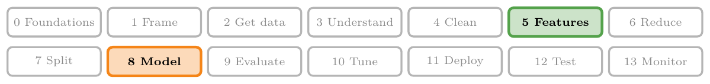
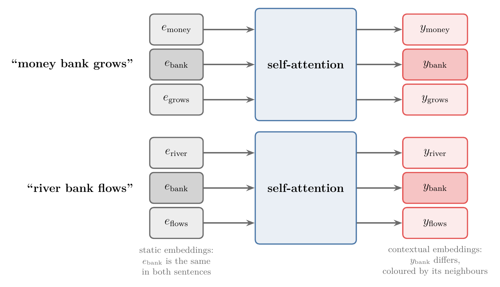
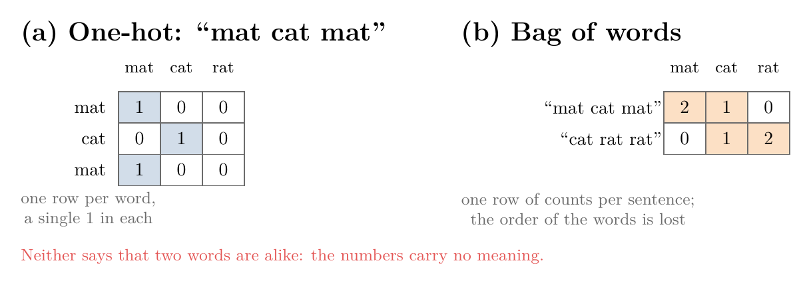
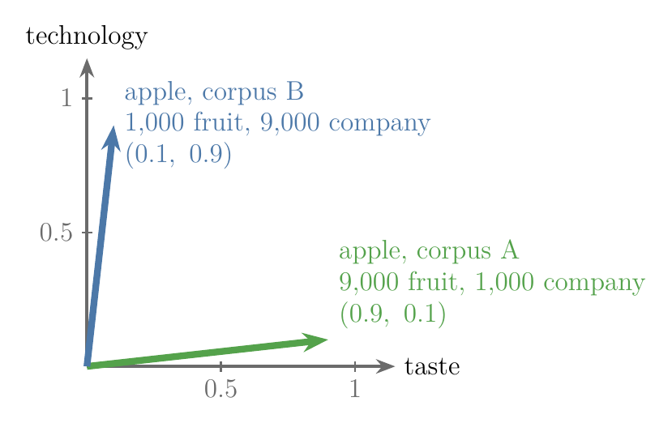
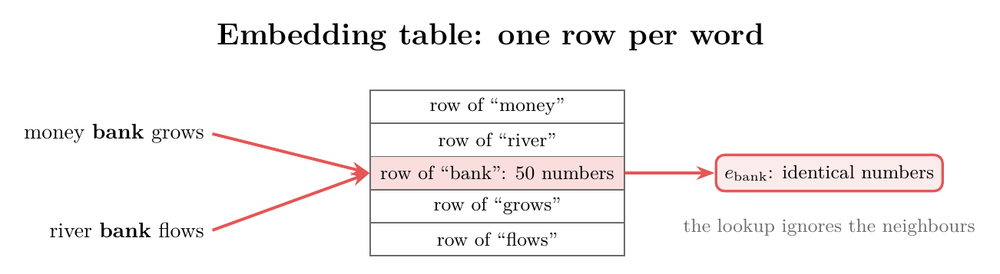
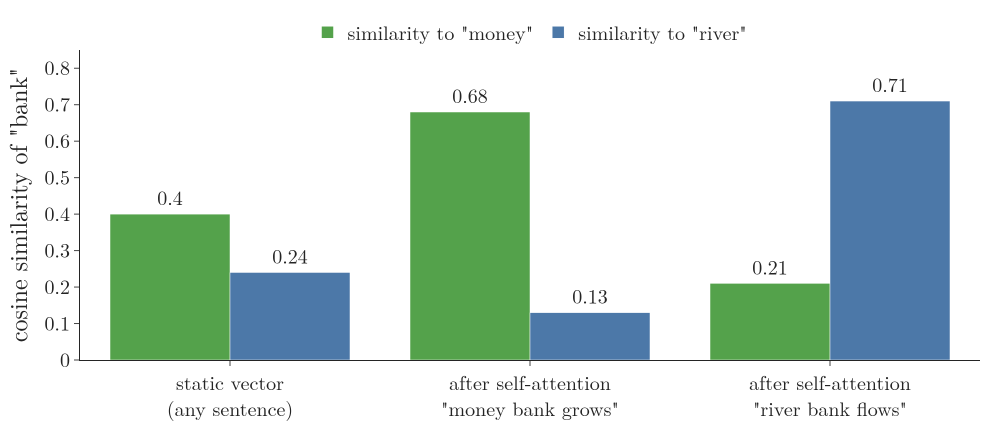

<!-- where-this-fits: generated by course_map/build_map.py; edit concepts.yaml, not this block -->
> **Where this fits:** Pipeline map steps 5 (Engineer features), 8 (Model). See the [Course map](../../../00-course-map/00-course-map.md).
>
> 
>
> - **Builds on:** [Word embeddings](../../../DL/05-rnn/DL-057-rnn-sentiment-analysis/DL-057-rnn-sentiment-analysis.md#6-word-embeddings); [Attention mechanism](../../../DL/06-transformers/DL-069-attention-mechanism/DL-069-attention-mechanism.md#11-sources); [Meaning as direction in embedding space](../../../DL/06-transformers/DL-072-meaning-as-direction/DL-072-meaning-as-direction.md#1-overview).
> - **Leads to:** [Scaled dot-product attention](../../../DL/06-transformers/DL-075-scaled-dot-product-attention/DL-075-scaled-dot-product-attention.md#1-overview); [Positional encoding](../../../DL/06-transformers/DL-079-positional-encoding/DL-079-positional-encoding.md#1-overview); [Masked self-attention](../../../DL/06-transformers/DL-082-masked-self-attention/DL-082-masked-self-attention.md#1-overview).
> - **Compare with:** [Cross-attention](../../../DL/06-transformers/DL-083-cross-attention/DL-083-cross-attention.md#7-what-a-trained-models-cross-attention-looks-like).
<!-- /where-this-fits -->

## 1. Overview

> **Key point:** A word embedding (a list of numbers, a **vector** (G-2081), that stands for a word) gives each word one fixed vector, learned from the average way the word is used. The word "bank" gets the same vector in "money bank grows" and in "river bank flows". **Self-attention** (G-1763) is a mechanism that takes the static embeddings of all the words of a sentence and returns new, **contextual embeddings** (G-462), in which each word's vector depends on the words around it.

Every **natural language processing** (G-1305; NLP) application, whether sentiment analysis, named entity recognition or machine translation, starts from words, and computers work with numbers. The first step is always to turn words into numbers. Word embeddings do this well, but they have one weakness: they are **static** (G-1877), the same in every sentence. Self-attention is the transformer's answer to that weakness, and it is the core of the [transformer](../DL-071-introduction-to-transformers/DL-071-introduction-to-transformers.md#3-what-a-transformer-is).

This Note explains **what** self-attention does and why it is needed. [The idea of a word as a mix of its sentence](../DL-074-self-attention-step-by-step/DL-074-self-attention-step-by-step.md#3-the-idea-a-word-as-a-mix-of-its-sentence) explains **how** it works inside.

{width=95%}

## 2. Prerequisites

- [How one-hot encoding works](../../../ML/03-feature-engineering/ML-026-one-hot-encoding/ML-026-one-hot-encoding.md#2-how-one-hot-encoding-works): a category as a vector of 0s with one 1.
- [Bag of words](../../../MA/05-linear-algebra/MA-048-vectors-and-feature-vectors/MA-048-vectors-and-feature-vectors.md#42-bag-of-words): a text as a vector of word counts.
- [Word embeddings](../../05-rnn/DL-057-rnn-sentiment-analysis/DL-057-rnn-sentiment-analysis.md#6-word-embeddings) and Keras' `Embedding` layer.
- [Cosine similarity](../../../MA/05-linear-algebra/MA-050-dot-product-and-cosine-similarity/MA-050-dot-product-and-cosine-similarity.md#6-cosine-similarity): how similar two vectors are.

## 3. Turning words into numbers

> **Key point:** One-hot encoding and bag of words turn words into numbers but carry no meaning. Word embeddings carry meaning: similar words get similar vectors.

Turning text into numbers is called **vectorization** (G-2084). The early methods count words (Figure 2):

- **One-hot encoding** (G-1379) lists the **vocabulary** (G-2092; the distinct words) and writes each word as a vector with a 1 at its own place. For the vocabulary mat, cat, rat: mat is $[1, 0, 0]$, cat is $[0, 1, 0]$, rat is $[0, 0, 1]$. The sentence "mat cat mat" becomes $[1,0,0],\ [0,1,0],\ [1,0,0]$.
- **Bag of words** (G-250) counts how often each vocabulary word appears in a sentence: "mat cat mat" becomes $[2, 1, 0]$ (two mats, one cat, no rat) and "cat rat rat" becomes $[0, 1, 2]$.
- **TF-IDF** improves bag of words by weighting each count by how rare the word is across documents (SLP3 ch. 5).

{width=95%}

In Figure 2, each row is one vector and each column is one vocabulary word; each cell holds a number (0 when the word is absent; the cell is shaded when the number is not 0). Read across a row to see that word's (or sentence's) vector.

None of these says anything about meaning: in one-hot space, every pair of words is equally far apart. **Word embeddings** (G-2127) fix this (see [word embeddings](../../05-rnn/DL-057-rnn-sentiment-analysis/DL-057-rnn-sentiment-analysis.md#6-word-embeddings)). A neural network reads a large text collection, such as all of Wikipedia, sees how each word is used, and represents every word as a dense vector of $n$ numbers, where $n$ is typically 64, 256 or 512. Words used in similar ways get similar vectors.

A useful picture: each embedding is an arrow, and **each direction in the space is one aspect of meaning**, not each number. King and queen point in similar directions, and cricketer points elsewhere. The step from "man" to "woman" is roughly the same arrow as the step from "king" to "queen", so that arrow can be read as a direction for gender, and the **dot product** (G-634; multiply two vectors entry by entry and add, as in the example below; see [computing the dot product](../../../MA/05-linear-algebra/MA-050-dot-product-and-cosine-similarity/MA-050-dot-product-and-cosine-similarity.md#3-computing-the-dot-product)) of a word's vector with it measures how much of that aspect the word carries (Sanderson 2024, Ch 5). The single numbers of an embedding have no labels and rarely a clean meaning of their own; the meaning lives in directions, which mix many numbers. [A word is a point](../DL-072-meaning-as-direction/DL-072-meaning-as-direction.md#3-a-word-is-a-point-nearby-points-share-meaning) shows this on real word vectors. For this Note one fact is enough: similar words lie close together.

The dot product of the vectors $(1, 2)$ and $(3, 4)$, one step per line:

$$(1, 2) \cdot (3, 4) = 1 \times 3 + 2 \times 4$$

$$= 3 + 8 = 11$$

## 4. Static embeddings hold an average meaning

> **Key point:** An embedding is trained once on a whole corpus, so a word's vector reflects how the word is used **on average** in that corpus. Whatever the sentence, the word gets that one vector.

### 4.1 The average, worked out

> **Key point:** If "apple" is a fruit in 9 of 10 sentences, its vector leans 9 to 1 towards fruit.

Suppose we train embeddings with two dimensions, which we read as **taste** and **technology**. Sentences such as "an apple a day keeps the doctor away", "apple is healthy" and "apple is better than orange" pull the vector of "apple" towards taste; "apple makes great phones" pulls it towards technology.

1. **In words:** each use of the word pulls its vector towards the meaning of that use. The final vector is the average pull over the whole corpus. For example, 3 fruit sentences and 1 company sentence give the average pull:
   $$\frac{3 \times (1, 0) + 1 \times (0, 1)}{4}$$
   $$= (0.75,\ 0.25)$$
2. **Formula:** with $n_f$ fruit sentences pulling towards $(1, 0)$ and $n_c$ company sentences pulling towards $(0, 1)$,
   $$e_{\text{apple}} = \frac{n_f\thinspace(1, 0) + n_c\thinspace(0, 1)}{n_f + n_c}$$
3. **Example:** corpus A has 9,000 fruit sentences and 1,000 company sentences:
   $$e_{\text{apple}} = \frac{9000\thinspace(1, 0) + 1000\thinspace(0, 1)}{10000}$$
   $$e_{\text{apple}} = (0.9,\ 0.1)$$
   Corpus B, with the numbers swapped, gives $(0.1,\ 0.9)$ (Figure 3).

{width=60%}

Figure 3 is one plane with taste on the horizontal axis and technology on the vertical axis. Each arrow is the vector of "apple" in one corpus: it leans towards taste in corpus A (green) and towards technology in corpus B (blue).

The formula is a simplification: real embedding methods do not literally average. But they are built from counts of which words appear near which, summed over every occurrence of the word (SLP3 ch. 5), so the vector is fixed by the mix of uses in the corpus.

### 4.2 The same effect in real text

> **Key point:** Embeddings learned from 116,830 real English sentences put "bank" next to shop and supermarket: in that text, a bank is always a building where money is kept.

The Notebook learns 50-number embeddings from the 116,830 distinct English sentences of the Keras English–French translation dataset. It counts which words appear within 4 words of each other and compresses the counts with the **singular value decomposition** (G-1813; SVD, a way to squeeze a big table of numbers into a few strong directions), the method of **latent semantic analysis** (G-1049) (see [latent semantic analysis](../../../MA/05-linear-algebra/MA-060-svd-in-machine-learning/MA-060-svd-in-machine-learning.md#3-latent-semantic-analysis)).

> **Extra:** The counts are first weighted by **positive pointwise mutual information** (G-1544; PPMI), which scores how much more often two words appear together than chance would give, and sets negative scores to 0. The SVD then keeps the 50 strongest directions. Word2vec, the best-known embedding method, can be seen as implicitly working with such a PPMI-weighted count matrix (Levy and Goldberg 2014, cited in SLP3 ch. 5).

The **nearest neighbours** (G-1306; the words whose vectors are closest) of a few words, by **cosine similarity** (G-491; a score from $-1$ to 1 for how closely two vectors point the same way: 1 means the same direction):

| Word | Six nearest words |
|---|---|
| bank | shop, bookstore, supermarket, hall, convenience, hospital |
| river | lake, sea, across, flows, village, bridge |
| apple | pie, fruit, apples, baked, banana, orange |
| phone | telephone, cell, passport, address, number, card |

"Bank" appears in 95 sentences of this corpus, and none of them mentions a river ("he works at a bank", "is there a bank near here?"). So its static vector is the money kind of bank: its cosine similarity is 0.40 with "money" and only 0.24 with "river". "Apple" is a fruit here, because the corpus never mentions the company.

## 5. Static and contextual embeddings

> **Key point:** A static embedding gives a word the same vector in every sentence. A **contextual embedding** changes the word's vector according to the other words of the sentence.

Static embeddings are trained once and then used again and again, in every sentence. That is the problem. Suppose we translate into Hindi the sentence

> "Apple launched a new phone while I was eating an orange."

With static embeddings, "apple" enters the translation model with its average vector, $(0.9, 0.1)$ in corpus A: a fruit. In this sentence, it is the company. What we want is an embedding that notices "launched" and "phone", raises the technology part and lowers the taste part. It should also not be misled by "orange", which belongs to a different part of the sentence.

The same holds for two shorter phrases, "money bank grows" and "river bank flows". The word "bank" means a financial institution in the first and the side of a river in the second, but a static embedding gives it exactly the same vector in both. In the Notebook, Keras' `Embedding` layer, loaded with the embeddings of section 4.2, returns identical numbers for "bank" in the two phrases: an embedding layer is a **lookup table**, and the lookup ignores the neighbours (Figure 4).

{width=95%}

SLP3 (ch. 7) makes the same point: with static embeddings, a word's representation "is always the same vector irrespective of the context".

An embedding that changes with the sentence is a **contextual embedding** (SLP3 ch. 7).

## 6. Self-attention: static in, contextual out

> **Key point:** Self-attention is a function: the static embeddings of all the words of a sentence go in, one contextual embedding per word comes out. In the Notebook, "bank" moves towards "river" in "river bank flows" and towards "money" in "money bank grows".

**Self-attention** is a mechanism that turns static embeddings into contextual embeddings. Think of it as a box (Figure 1). The embeddings of all the words of a sentence go in together ($e$ for an input embedding): $e_{\text{river}}, e_{\text{bank}}, e_{\text{flows}}$. Some calculations happen inside, and one new vector per word comes out ($y$ for an output): $y_{\text{river}}, y_{\text{bank}}, y_{\text{flows}}$. Each output is a **contextual embedding**: it takes into account how the word is used in this sentence. The original paper describes self-attention as "an attention mechanism relating different positions of a single sequence in order to compute a representation of the sequence" (Vaswani et al. 2017, section 2). The transformer then uses these contextual embeddings in its later layers.

The Notebook passes the two phrases through the simplest form of self-attention, the one the next Note builds from scratch, with the real embeddings of section 4.2. The cosine similarity of the vector for "bank" with "money" and with "river":

| Vector for "bank" | Similarity to "money" | Similarity to "river" |
|---|---|---|
| static, in any sentence | 0.40 | 0.24 |
| after self-attention, "money bank grows" | **0.68** | 0.13 |
| after self-attention, "river bank flows" | 0.21 | **0.71** |

{width=90%}

The static vector leans a little towards money, the average meaning of the corpus. After self-attention, the vector for "bank" in "river bank flows" is now much closer to "river" than to "money", although the corpus never once used "bank" in that sense. The neighbours alone changed it.

{width=95%}

Figure 6 shows the same thing on a map. The map keeps only 2 of the 50 directions, so distances on it are approximate; the table gives the exact similarities.

How the box computes its output, and how it learns to do so for a particular task, is the subject of [the idea of a word as a mix of its sentence](../DL-074-self-attention-step-by-step/DL-074-self-attention-step-by-step.md#3-the-idea-a-word-as-a-mix-of-its-sentence).

## 7. Summary

| | Static embedding | Contextual embedding |
|---|---|---|
| Vector for a word | one, fixed after training | different in every sentence |
| Learned from | the average use of the word in the training corpus | the word **and** its neighbours in the current sentence |
| "bank" in "river bank flows" | the money meaning (similarity 0.24 to "river") | moved to the river meaning (0.71) |
| Produced by | an embedding (Word2Vec, GloVe, Keras `Embedding`) | self-attention |

- Every NLP task starts by turning words into numbers, because computers work with numbers: one-hot, bag of words, TF-IDF, then word embeddings, which capture meaning where the counting methods keep every pair of words equally far apart.
- A static embedding holds the average meaning of a word in its training corpus, because it is trained once over every use of the word and then looked up from a table that ignores the neighbours.
- A word with several meanings needs a vector that depends on the sentence: a contextual embedding, because otherwise "bank" in "river bank flows" keeps the money meaning.
- Self-attention takes the static embeddings of a sentence and returns contextual embeddings, one per word, so the neighbours alone can move "bank" to the river meaning (0.71 to "river").
- That is what self-attention is for: fixing the one weakness of word embeddings, that they are the same in every sentence.

## 8. Sources

**Built from**

- CampusX, "What is Self Attention | Transformers Part 2 | CampusX", YouTube, https://www.youtube.com/watch?v=XnGGmvpDLA0
- Sanderson, G. (3Blue1Brown), "Transformers, the tech behind LLMs | Deep Learning Chapter 5", 2024, 3blue1brown.com/lessons/gpt, https://www.youtube.com/watch?v=wjZofJX0v4M. 13:33–17:44 (directions in embedding space carry meaning; woman − man ≈ queen − king; the dot product measures how much of a direction a vector has).

**Other references**

- Jurafsky, D. and Martin, J. H. *Speech and Language Processing*, 3rd ed. draft (19 August 2026), web.stanford.edu/~jurafsky/slp3. Chapter 5 (static embeddings; tf-idf; word2vec and PPMI, citing Levy and Goldberg 2014; SVD on word co-occurrence counts); chapter 7, section 7.1 (static embeddings are the same "irrespective of the context"; contextual embeddings; the "bank" of a river).
- Vaswani, A. et al. (2017). Attention Is All You Need. *NeurIPS 2017*. arXiv:1706.03762. Section 2 (definition of self-attention).
- Levy, O. and Goldberg, Y. (2014). Neural Word Embedding as Implicit Matrix Factorization. *NeurIPS 2014*. Cited in SLP3 ch. 5.
- Tatoeba (tatoeba.org) English–French sentence pairs, prepared by manythings.org/anki (file of 7 April 2019) and distributed for the Keras examples at storage.googleapis.com/download.tensorflow.org/data/fra-eng.zip. Licence CC BY 2.0.

## 9. Key terms

| Term | Meaning |
|---|---|
| Vectorization (G-2084) | Turning words or text into vectors of numbers |
| Vocabulary (G-2092) | The list of distinct words in the data |
| Bag of words | A sentence as the count of each vocabulary word in it |
| Word embedding | A dense vector of real numbers for each word, learned so that words used similarly get similar vectors |
| Static embedding | An embedding that gives a word the same vector in every sentence, so "bank" gets one vector in both "money bank" and "river bank"; self-attention fixes this by making the vector depend on context. |
| Average meaning | What a static embedding stores: the word's meaning averaged over all its uses in the training corpus |
| Contextual embedding | A vector for a word that changes with the other words of its sentence, so "bank" gets one vector in "river bank" and another in "money bank". Self-attention produces it. |
| Self-attention (G-1763) | A mechanism that takes the embeddings of all the words of a sequence and returns a contextual embedding for each |
| PPMI | Positive pointwise mutual information: a score of how much more often two words appear together than by chance, with negative scores set to 0 |
