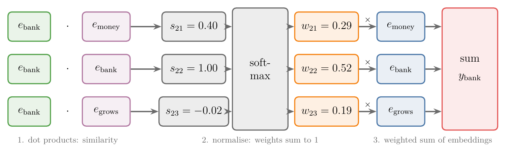
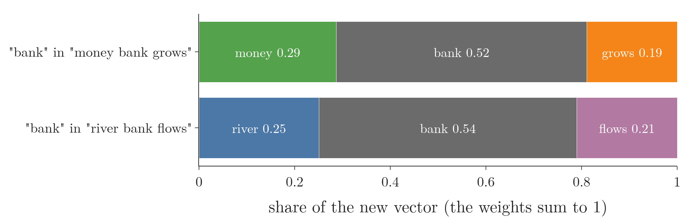
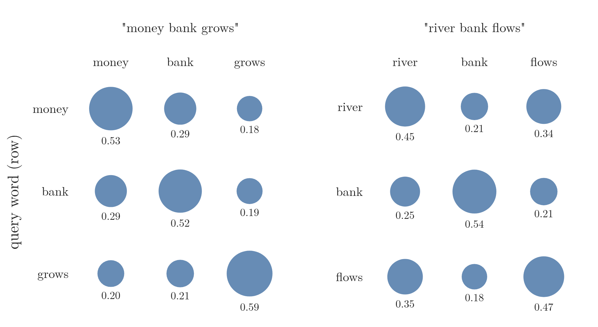
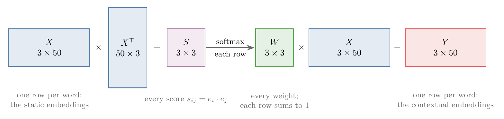
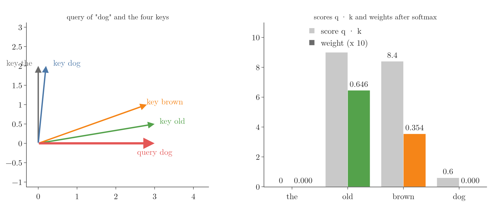
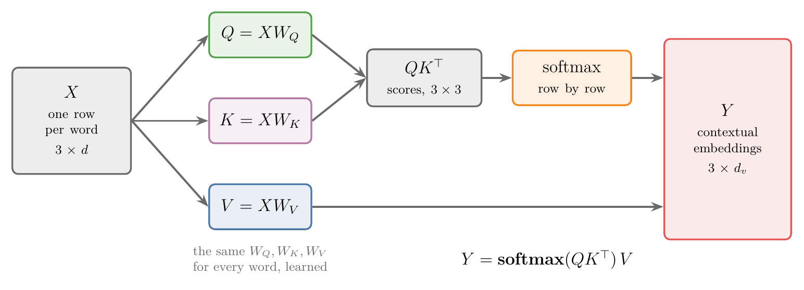
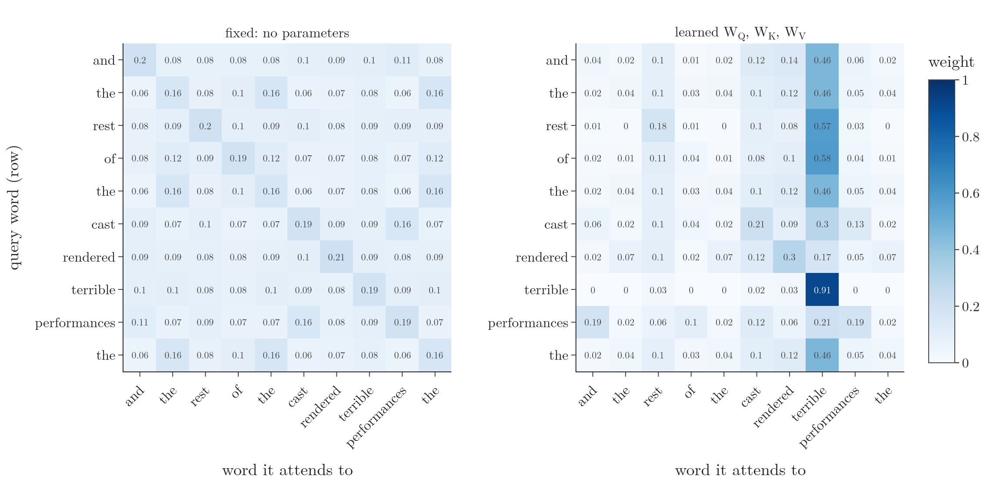
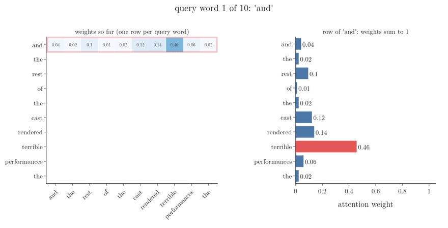

<!-- where-this-fits: generated by course_map/build_map.py; edit concepts.yaml, not this block -->
> **Where this fits:** Pipeline map step 8 (Model). See the [Course map](../../../00-course-map/00-course-map.md).
>
> 
>
> - **Builds on:** Attention mechanism ([Note DL-069](../../../DL/06-transformers/DL-069-attention-mechanism/DL-069-attention-mechanism.md)).
> - **Leads to:** Scaled dot-product attention ([Note DL-075](../../../DL/06-transformers/DL-075-scaled-dot-product-attention/DL-075-scaled-dot-product-attention.md)); Positional encoding ([Note DL-079](../../../DL/06-transformers/DL-079-positional-encoding/DL-079-positional-encoding.md)); Masked self-attention ([Note DL-082](../../../DL/06-transformers/DL-082-masked-self-attention/DL-082-masked-self-attention.md)).
> - **Compare with:** Cross-attention ([Note DL-083](../../../DL/06-transformers/DL-083-cross-attention/DL-083-cross-attention.md)).
<!-- /where-this-fits -->

## 1. Overview

> **Key point:** **Self-attention** (G-1763) builds each word's new vector as a **weighted sum** of the embeddings of all the words in the sentence. The weights come from **dot products** (how similar two words are), normalised by a **softmax** (G-1830). Each embedding plays three roles, **query**, **key** (G-1011) and **value** (G-2068), so three learned matrices $W_Q$, $W_K$, $W_V$ turn it into three vectors, one per role. For a whole sentence at once: $Y = \text{softmax}(QK^{\top})\thinspace V$.

The [what is self-attention Note](../DL-073-what-is-self-attention/DL-073-what-is-self-attention.md) treated self-attention as a box: static embeddings go in, contextual embeddings come out. This Note opens the box. We build self-attention from first principles, as if inventing it:

1. a simple version with no parameters (sections 3 to 5);
2. its two properties: it runs in parallel, and it cannot learn (section 6);
3. the fix: query, key and value vectors from learned matrices (sections 7 and 8);
4. a test on real movie reviews: fixed against learned (section 9).

{width=100%}

## 2. Prerequisites

- [What is self-attention](../DL-073-what-is-self-attention/DL-073-what-is-self-attention.md): static and contextual embeddings.
- [Dot product and cosine similarity](../../../MA/05-linear-algebra/MA-050-dot-product-and-cosine-similarity/MA-050-dot-product-and-cosine-similarity.md): the dot product as a measure of similarity.
- [Softmax regression](../../../ML/07-classification/ML-078-softmax-regression/ML-078-softmax-regression.md): softmax turns any numbers into positive weights that sum to 1.
- [Matrix multiplication as composition](../../../MA/05-linear-algebra/MA-054-matrix-multiplication-as-composition/MA-054-matrix-multiplication-as-composition.md) and [linear transformations](../../../MA/05-linear-algebra/MA-053-linear-transformations-and-matrices/MA-053-linear-transformations-and-matrices.md): a vector times a matrix is a new vector.

## 3. The idea: a word as a mix of its sentence

> **Key point:** Write each word's new meaning as a mix of all the words of its sentence. "Bank" in "money bank grows" becomes mostly bank, some money, a little grows.

Take two short phrases, "money bank grows" and "river bank flows". "Bank" means something different in each, but a static embedding gives it the same vector in both. Suppose we describe each word not by itself but as a mix of the words around it:

$$\text{bank} _{\text{new}} = 0.29\thinspace\text{money} + 0.52\thinspace\text{bank} + 0.19\thinspace\text{grows}$$
$$\text{bank} _{\text{new}} = 0.25\thinspace\text{river} + 0.54\thinspace\text{bank} + 0.21\thinspace\text{flows}$$

The left-hand sides are the same word, but the right-hand sides differ, because the neighbours differ. The meaning of "bank" now depends on its context (Figure 2).

{width=95%}

We can do the same for every word of each phrase: "money" becomes a mix of money, bank and grows, and so on.

Machines work with vectors, not words, so we write the mix with embeddings. With $e_{\text{money}}$ the embedding of "money" (a vector of $n$ numbers), the new vector of "bank" is

$$y_{\text{bank}} = 0.29\thinspace e_{\text{money}} + 0.52\thinspace e_{\text{bank}} + 0.19\thinspace e_{\text{grows}}$$

A weighted sum of $n$-number vectors is again an $n$-number vector. The new vectors are the **contextual embeddings** (G-462) we wanted. Two questions remain: where do the weights come from, and how do we make them sum to 1?

## 4. Weights from similarity

> **Key point:** A weight says how much one word should borrow from another, so it should measure how similar the two words are. The dot product of their embeddings measures similarity; the softmax turns the dot products into weights that sum to 1.

### 4.1 Dot products as similarity

> **Key point:** Two vectors that point the same way have a large dot product.

The weight $0.29$ means: "bank" takes 29% of its new meaning from "money". The more related two words are, the larger that share should be. The **dot product** (G-634) of two vectors is a simple measure of how similar they are (the [dot product Note](../../../MA/05-linear-algebra/MA-050-dot-product-and-cosine-similarity/MA-050-dot-product-and-cosine-similarity.md)).

1. **In words:** multiply the vectors number by number, then add.
2. **Formula:** $a \cdot b = a_1 b_1 + a_2 b_2 + \dots + a_n b_n$.
3. **Example:** with $a = (6, 1)$, $b = (4, 2)$ and $c = (1, 5)$:
   $$a \cdot b = 6 \times 4 + 1 \times 2 = 26, \qquad a \cdot c = 6 \times 1 + 1 \times 5 = 11$$
   $a$ is more similar to $b$ than to $c$, and the dot products say so.

In the Notebook every embedding has length 1, so the dot product is exactly the **cosine similarity** (G-491): 1 for a word with itself, near 0 for unrelated words.

### 4.2 Softmax turns scores into weights

> **Key point:** Raw dot products can be any size and even negative. The softmax makes them positive and makes them sum to 1.

Call $s_{ij} = e_i \cdot e_j$ the **score** (G-223, attention score) of word $i$ with word $j$. Scores can be large, small or negative, for example 36, $-15$ and 32. We want weights that are positive and sum to 1, so they read as shares: "bank is 52% bank, 29% money, 19% grows". The **softmax** function does exactly this.

1. **In words:** raise $e$ to the power of each score, then divide by the total.
2. **Formula:** for word $i$ in a sentence of $N$ words,
   $$w_{ij} = \frac{e^{s_{ij}}}{e^{s_{i1}} + e^{s_{i2}} + \dots + e^{s_{iN}}}$$
3. **Example:** the real scores of "bank" (word 2) in "money bank grows", from the Notebook's embeddings, are $s_{21} = 0.40$ (with money), $s_{22} = 1.00$ (with itself) and $s_{23} = -0.02$ (with grows):
   $$e^{0.40} = 1.49,\quad e^{1.00} = 2.72,\quad e^{-0.02} = 0.98,\qquad \text{total} = 5.19$$
   $$w_{21} = \frac{1.49}{5.19} = 0.29,\quad w_{22} = \frac{2.72}{5.19} = 0.52,\quad w_{23} = \frac{0.98}{5.19} = 0.19$$
   The weights sum to 1, and they are the numbers of section 3.

### 4.3 The whole computation for one word

> **Key point:** Three steps: dot products with every word, softmax, weighted sum.

Figure 1 puts the steps together for "bank":

1. **Scores:** the dot product of $e_{\text{bank}}$ with each embedding of the sentence gives $s_{21}, s_{22}, s_{23}$.
2. **Weights:** the softmax of the scores gives $w_{21}, w_{22}, w_{23}$, which sum to 1.
3. **Output:** the weighted sum $y_{\text{bank}} = w_{21}\thinspace e_{\text{money}} + w_{22}\thinspace e_{\text{bank}} + w_{23}\thinspace e_{\text{grows}}$.

The same three steps, with "money" and then "grows" in place of "bank", give $y_{\text{money}}$ and $y_{\text{grows}}$. This simple version of attention, scores by dot product, softmax, weighted sum, is the one SLP3 (§7.1) presents before adding parameters.

{width=90%}

Figure 3 shows all the weights, one dot per pair of words, so the large ones stand out at a glance (a picture of the weights used by Sanderson 2024, Ch 6). Each word keeps about half of its own meaning (the diagonal: a vector is most similar to itself) and borrows the rest from its neighbours. The row of "bank" differs between the two phrases: it borrows 0.29 from "money" in one, 0.25 from "river" in the other. In the previous Note, these outputs moved "bank" towards "river" in "river bank flows".

## 5. All words at once, with matrices

> **Key point:** Stack the embeddings as the rows of a matrix $X$. Then $XX^{\top}$ holds every score, a row-wise softmax gives every weight, and multiplying by $X$ gives every output: $Y = \text{softmax}(XX^{\top})\thinspace X$.

Nothing in the computation for "grows" waits for the computation for "bank": each word's new vector needs only the embeddings, which are all known at the start. So all the words can be processed at the same time, using matrices.

1. **In words:** put the embeddings of the $N$ words as the rows of a matrix; multiply it by its own transpose to get all the scores; apply the softmax to each row; multiply the weights by the embeddings.
2. **Formula:** with $X$ of shape $N \times n$ (one row per word),
   $$S = XX^{\top}\ (N \times N), \qquad W = \text{softmax} _{\text{rows}}(S), \qquad Y = WX\ (N \times n)$$
   Entry $(i, j)$ of $S$ is $e_i \cdot e_j = s_{ij}$, and row $i$ of $Y$ is $y_i$.
3. **Example:** for "money bank grows", $X$ is $3 \times 50$ (3 words, 50 numbers each), $S$ and $W$ are $3 \times 3$ (Figure 3, left) and $Y$ is $3 \times 50$. For "i put my money in the bank", $X$ is $7 \times 50$, $S$ is $7 \times 7$ and $Y$ is again $7 \times 50$. In the Notebook, the matrix version gives exactly the same numbers as a loop over the words, one at a time. Figure 4 shows the shapes.

{width=100%}

Whether the sentence has 3 words or 3,000, the work is a few matrix multiplications, which a GPU does in parallel. This parallelism is what lets transformers train fast (the [introduction to transformers Note](../DL-071-introduction-to-transformers/DL-071-introduction-to-transformers.md), section 5).

The parallel computation has a cost. Nothing in $Y = \text{softmax}(XX^{\top})X$ depends on the order of the rows: shuffle the words and each word gets the same new vector, only in a different row. The order of words is lost, although word order matters in text. The transformer restores it separately, with **positional encoding** (G-1528; the [positional encoding Note](../DL-079-positional-encoding/DL-079-positional-encoding.md)).

## 6. The problem: nothing to learn

> **Key point:** The simple version has no parameters. Its contextual embeddings are general: the same for every task and every dataset. A task often needs **task-specific** contextual embeddings, so we must add learnable weights.

The three steps are a dot product, a softmax and another product. None of them has a weight or a bias. With no parameters there is nothing to train: the output for a sentence depends only on the static embeddings, never on the task or its data.

The resulting contextual embeddings are **general** (G-836, general contextual embeddings): they use the context, but in the same way for every task. Sometimes that is not enough. Suppose we train an English-to-Hindi translator whose data contains

- "how are you" → "main theek hoon" (as a reply), and
- "that task is a piece of cake" → "vah kaam bahut aasaan hai" ("that work is very easy").

General contextual embeddings of "piece of cake" lean towards the literal meaning, a slice of cake. A good translator must learn from its data that the phrase means "very easy". In the same way, "break a leg" should become "shubh kaamnaayein" ("good wishes") and not a sentence about a broken leg. What the model needs are **task-specific contextual embeddings** (G-1952): still built from the neighbouring words, but in a way learned from the task's data. For that, self-attention needs learnable parameters.

Where can they go? The softmax is a fixed formula. The parameters can only enter in the two products: the one that computes the scores and the one that forms the weighted sum.

## 7. Three roles: query, key and value

> **Key point:** In the computation, every embedding is used three times, in three roles: as the **query** that asks "how similar are you to me?", as the **key** that is compared with the query, and as the **value** that is mixed into the output.

Look again at Figure 1. The embedding of "bank" appears in three different places:

- **Query** (green): $e_{\text{bank}}$ asks every word of the sentence, "how similar are you to me?". It is the word whose new vector we are computing.
- **Key** (purple): $e_{\text{money}}$, $e_{\text{bank}}$, $e_{\text{grows}}$ answer: their dot product with the query gives the scores. In the computation for "money" or "grows", $e_{\text{bank}}$ also serves as a key.
- **Value** (blue): the same embeddings are mixed with the weights to form the output.

The names come from dictionaries in programming. A Python dictionary `d = {"a": 2, "b": 3, "c": 4}` stores **keys** ("a", "b", "c") with their **values** (2, 3, 4). The lookup `d["a"]` is a **query**: it is compared with every key, and the value of the matching key, 2, is returned. Self-attention is a soft version of this lookup: the query is compared with every key, and instead of returning one value, it returns a mix of all the values, weighted by how well each key matches. SLP3 (§7.1) describes the same three roles.

The problem with the simple version is that one vector, the static embedding, plays all three roles. An analogy shows why that is a poor design. A writer is looking for a partner on a matrimonial website. His full life story is in his 300-page autobiography: his embedding. The website needs three things from him:

- a **profile** that others see when they search (his key);
- a **search** describing whom he is looking for (his query);
- what he says once there is a **match** (his value).

Uploading the whole autobiography as profile, search and first message would work badly in all three places. Instead he writes three short, focused texts, each drawn from the autobiography but shaped for its job. And he learns from experience what to put in each. If he gets matched with people who love politics when he does not, he removes "I write about politics" from his profile; if a broad search works better than a narrow one, he widens it. Each version is tuned from the results, that is, from data.

Self-attention should do the same: from each embedding, derive three separate vectors, a query vector, a key vector and a value vector, and learn from the training data how to derive them.

**What a query and a key could compute: an invented example.** Suppose the model would like nouns to take in the adjectives in front of them, as in "the old brown dog". Imagine that each noun's query asks "are there adjectives before me?" and that each adjective's key answers "I am an adjective here". If the matrices put such questions and answers into the same direction, a large dot product means a match (Sanderson 2024, Ch 6, who builds the same kind of imagined example). With 2 numbers per query and key:

1. **In words:** the query of "dog" points along the first axis (looking for adjectives); the keys of "old" and "brown" point mostly the same way; the keys of "the" and "dog" point along the second axis.
2. **Formula:** $s_{\text{dog},j} = q_{\text{dog}} \cdot k_j$, then the softmax over $j$.
3. **Example:** $q_{\text{dog}} = (3, 0)$, $k_{\text{the}} = (0, 2)$, $k_{\text{old}} = (3, 0.5)$, $k_{\text{brown}} = (2.8, 1)$, $k_{\text{dog}} = (0.2, 2)$. The scores are $0$, $9$, $8.4$ and $0.6$, and the softmax gives the weights $0.000$, $0.646$, $0.354$ and $0.000$: "dog" takes its new meaning from "old" and "brown" only (Figure 5).

{width=100%}

In a trained model nobody chooses these directions, and what a matrix actually learns is much harder to read; the example only shows the kind of job a query and a key can do together. Section 9.3 shows a real one: learned matrices that make every word look for the sentiment word.

## 8. Query, key and value vectors from learned matrices

> **Key point:** Multiply each embedding by three matrices: $q = eW_Q$, $k = eW_K$, $v = eW_V$. The same three matrices serve every word. They start random and are trained by backpropagation, so the contextual embeddings become task-specific.

### 8.1 A linear transformation per role

> **Key point:** A new vector from an old one: multiply by a matrix.

To make a new vector from an old one, scaling alone (making it longer or shorter) is too limited: the direction must change as well. The standard way is a **linear transformation** (G-1097), multiplying the vector by a matrix (the [linear transformations Note](../../../MA/05-linear-algebra/MA-053-linear-transformations-and-matrices/MA-053-linear-transformations-and-matrices.md)). We use three matrices, $W_Q$, $W_K$ and $W_V$, one per role.

1. **In words:** each embedding, written as a row vector, times each of the three matrices gives the word's query, key and value vectors.
2. **Formula:**
   $$q_i = e_i W_Q, \qquad k_i = e_i W_K, \qquad v_i = e_i W_V$$
   which is the form of SLP3 (eq. 7.9).
3. **Example:** in 2-D, with $e = (1, 2)$,
   $$W_Q = \begin{pmatrix} 1 & 0 \cr1 & 1 \end{pmatrix}, \quad W_K = \begin{pmatrix} 0 & 1 \cr1 & 0 \end{pmatrix}, \quad W_V = \begin{pmatrix} 2 & 0 \cr0 & 0.5 \end{pmatrix}$$
   $$q = (1 \cdot 1 + 2 \cdot 1,\ 1 \cdot 0 + 2 \cdot 1) = (3, 2), \quad k = (2, 1), \quad v = (2, 1)$$
   One embedding has become three different vectors (Figure 6; here $k$ and $v$ happen to be equal, because $W_K$ and $W_V$ map this particular $e$ to the same point).

{height=50%}

**The same matrices for every word.** The $W_Q$ used for "money" is exactly the $W_Q$ used for "bank" and for "grows", number for number, and the same holds for $W_K$ and $W_V$. Three words give $3 \times 3 = 9$ vectors from only three matrices.

**Learned from data.** Nobody chooses the numbers in $W_Q$, $W_K$ and $W_V$. They start random. The model translates (or classifies) a sentence, makes mistakes, and backpropagation changes the matrices to reduce the loss; the next sentence gets slightly better query, key and value vectors. At the end of training the matrices hold the numbers that produce the best vectors for this task.

### 8.2 The refined computation

> **Key point:** Same three steps as before, with queries in the dot product, keys as what they are compared with, and values in the weighted sum.

The computation of section 4 stays the same; each use of an embedding is replaced by the vector for its role. For "bank":

$$s_{2j} = q_{\text{bank}} \cdot k_j, \qquad w_{2j} = \text{softmax} _j(s_{2j}), \qquad y_{\text{bank}} = \sum_j w_{2j}\thinspace v_j$$

### 8.3 All words at once

> **Key point:** $Q = XW_Q$, $K = XW_K$, $V = XW_V$, and then $Y = \text{softmax}(QK^{\top})\thinspace V$. Still fully parallel.

The matrix form of section 5 carries over (Figure 7, and SLP3 eq. 7.33):

1. **In words:** multiply the embedding matrix by the three weight matrices; compare every query with every key in one product; softmax each row; mix the values.
2. **Formula:**
   $$Q = XW_Q, \quad K = XW_K, \quad V = XW_V, \qquad Y = \text{softmax}(QK^{\top})\thinspace V$$
3. **Example:** for "money bank grows" with 50-number embeddings and $50 \times 50$ matrices: $X$ is $3 \times 50$; $Q$, $K$ and $V$ are $3 \times 50$; $QK^{\top}$ is $3 \times 3$, one score for every pair of words; $Y$ is $3 \times 50$. The Notebook checks that the matrix form equals the word-by-word loop.

{width=100%}

**The same steps with every number.** Give the three words invented embeddings of 2 numbers, and reuse the matrices $W_Q$, $W_K$, $W_V$ of section 8.1. Figure 8 runs the computation, one matrix operation per frame.

$$X = \begin{pmatrix} 1 & 2 \cr2 & 0 \cr0 & 1 \end{pmatrix} \quad \text{(rows: money, bank, grows)}$$

1. **Queries, keys, values:** each row of $X$ times each matrix.
   $$Q = XW_Q = \begin{pmatrix} 3 & 2 \cr2 & 0 \cr1 & 1 \end{pmatrix}, \quad K = XW_K = \begin{pmatrix} 2 & 1 \cr0 & 2 \cr1 & 0 \end{pmatrix}, \quad V = XW_V = \begin{pmatrix} 2 & 1 \cr4 & 0 \cr0 & 0.5 \end{pmatrix}$$
2. **Scores:** every query with every key. For the query of "money", $(3, 2)$: with the key of "money", $3 \times 2 + 2 \times 1 = 8$; with the key of "bank", $3 \times 0 + 2 \times 2 = 4$; with the key of "grows", $3 \times 1 + 2 \times 0 = 3$.
   $$QK^{\top} = \begin{pmatrix} 8 & 4 & 3 \cr4 & 0 & 2 \cr3 & 2 & 1 \end{pmatrix}$$
3. **Weights:** the softmax of each row. For the row of "grows", $(3, 2, 1)$: $e^3 = 20.09$, $e^2 = 7.39$, $e^1 = 2.72$, total $30.19$, so the weights are $0.67$, $0.24$, $0.09$.
   $$\text{softmax}(QK^{\top}) = \begin{pmatrix} 0.98 & 0.02 & 0.01 \cr0.87 & 0.02 & 0.12 \cr0.67 & 0.24 & 0.09 \end{pmatrix}$$
4. **Output:** each row of weights mixes the rows of $V$. For "grows": $0.67 \times (2, 1) + 0.24 \times (4, 0) + 0.09 \times (0, 0.5) = (2.31, 0.71)$.
   $$Y = \begin{pmatrix} 2.02 & 0.98 \cr1.80 & 0.93 \cr2.31 & 0.71 \end{pmatrix}$$

{width=100%}

In Figure 8, watch the row of "money" in the weights: a score of 8 against 4 and 3 already takes 0.98 of the weight, because the softmax works with $e$ to the power of the score. Large scores make the softmax nearly all-or-nothing, which is the problem the next Note solves.

The order matters: $QK^{\top}$, queries times the transpose of the keys, so that entry $(i, j)$ is $q_i \cdot k_j$.

The self-attention inside a transformer works this way, with one more step: the scores are divided by $\sqrt{d_k}$ before the softmax. Why that scaling is needed is the subject of the [scaled dot-product attention Note](../DL-075-scaled-dot-product-attention/DL-075-scaled-dot-product-attention.md). Inside a transformer, $Y$ also does not replace $X$: it is added to $X$, so attention supplies a change to each word's vector (the residual connection of the [transformer encoder Note](../DL-081-transformer-encoder/DL-081-transformer-encoder.md)).

## 9. Learned matrices on real reviews

> **Key point:** On IMDB movie reviews, with the same frozen embeddings, self-attention with learned $W_Q$, $W_K$, $W_V$ reaches 0.84 test accuracy against 0.69 without parameters. The learned weights concentrate on the word that matters for the task: "terrible".

### 9.1 The experiment

> **Key point:** Two models identical except for the three matrices, which start at the identity, so both begin as the same function.

Section 6 claimed that learnable matrices make the contextual embeddings task-specific. The Notebook tests the claim on sentiment analysis of IMDB movie reviews (the [RNN sentiment analysis Note](../../05-rnn/DL-057-rnn-sentiment-analysis/DL-057-rnn-sentiment-analysis.md)): 25,000 training and 25,000 test reviews, each an **observation** (G-1374; one record of the data), with the sentiment, positive or negative, as the **target** (G-1949; the output we predict). The words are the 10,000 most frequent, and each review is cut to 200 words.

- **Static embeddings:** 50 numbers per word, learned from the training reviews themselves by the counting method of the [what is self-attention Note](../DL-073-what-is-self-attention/DL-073-what-is-self-attention.md), section 4.2, then **frozen**, so they cannot adapt to the task. They do capture meaning: the nearest words to "great" are wonderful, fine, fantastic, excellent, marvelous, superb.
- **Model:** embeddings → self-attention → the average of the contextual embeddings over the words of the review → one sigmoid node.
- **Fixed:** self-attention without parameters, $Y = \text{softmax}(XX^{\top})X$. The only trainable weights are the 51 of the final node.
- **Learned:** $Y = \text{softmax}(QK^{\top})V$ with $W_Q$, $W_K$, $W_V$ of size $50 \times 50$, which adds 7,500 trainable weights. The three matrices start at the **identity matrix** (G-915), so at the start the learned model computes exactly what the fixed model computes.

Both train with Adam for 5 epochs, batch size 64, 3 runs each with different seeds.

### 9.2 Results

> **Key point:** The learned model is about 15 points more accurate, in every run.

| Model | Trainable weights | Test accuracy (mean of 3 runs) |
|---|---|---|
| Fixed: no parameters | 51 | 0.69 |
| Learned $W_Q$, $W_K$, $W_V$ | 7,551 | **0.84** |

The three runs of each model agree to within 0.004. Both models have exactly the same information: the same frozen embeddings and the same reviews. The only difference is that the learned model can change how each word looks for, and mixes in, the other words, based on the labelled reviews.

### 9.3 What the weights learned

> **Key point:** Without parameters, each word mostly attends to itself. After training, almost every word attends to "terrible".

What did the matrices learn? Figure 9 takes a real 10-word stretch from a test review, "and the rest of the cast rendered terrible performances the", and shows the attention weights of both models.

{width=100%}

- **Fixed (left):** the largest weight in each row is on the diagonal, about 0.2: each word is most similar to itself. The rest is spread evenly, about 0.08 per word. The weights know nothing about sentiment.
- **Learned (right):** the column of "terrible" lights up. "Rest" puts 0.57 of its weight on "terrible", "of" 0.58, "the" 0.46, and "terrible" itself 0.91. After averaging, the review's vector is dominated by the meaning of "terrible", which is exactly what a sentiment classifier needs.

For this task, the learned matrices turned self-attention into a detector of sentiment words. A translation model trained on the same embeddings would learn different matrices, and attend differently. These are the task-specific contextual embeddings of section 6, measured.

{height=55%}

## 10. Summary

| Step | Simple version | Refined version (used in transformers) |
|---|---|---|
| Vectors per word | the embedding $e_i$, used in all three roles | query $q_i = e_iW_Q$, key $k_i = e_iW_K$, value $v_i = e_iW_V$ |
| Scores | $s_{ij} = e_i \cdot e_j$ | $s_{ij} = q_i \cdot k_j$ |
| Weights | softmax over $j$ | softmax over $j$ |
| Output | $y_i = \sum_j w_{ij}\thinspace e_j$ | $y_i = \sum_j w_{ij}\thinspace v_j$ |
| Whole sentence | $Y = \text{softmax}(XX^{\top})\thinspace X$ | $Y = \text{softmax}(QK^{\top})\thinspace V$ |
| Parameters | none: general contextual embeddings | $W_Q$, $W_K$, $W_V$, learned: task-specific |

- A word's contextual embedding is a weighted sum of the vectors of all the words in its sentence.
- The weights are similarities (dot products) normalised by a softmax, so each row sums to 1.
- All words are processed at once with matrix products, which runs in parallel on a GPU but ignores word order.
- Learned matrices $W_Q$, $W_K$, $W_V$, the same for every word, make the result task-specific: on IMDB, 0.84 accuracy against 0.69, with attention concentrated on sentiment words.
- The transformer adds one more step, dividing the scores by $\sqrt{d_k}$ (the [scaled dot-product attention Note](../DL-075-scaled-dot-product-attention/DL-075-scaled-dot-product-attention.md)).

## 11. Sources

**Built from**

- CampusX, "Self Attention in Transformers | Deep Learning | Simple Explanation with Code!", YouTube, https://www.youtube.com/watch?v=-tCKPl_8Xb8
- StatQuest with Josh Starmer, "The matrix math behind transformer neural networks, one step at a time!!!", YouTube, https://www.youtube.com/watch?v=KphmOJnLAdI. 04:30–12:00 (self-attention written out as matrices with every number: queries, keys and values, the scores, the row softmax, the weighted values).
- Sanderson, G. (3Blue1Brown), "Attention in transformers, step-by-step | Deep Learning Chapter 6", 2024, 3blue1brown.com/lessons/attention, https://www.youtube.com/watch?v=eMlx5fFNoYc. 5:52–10:03 (an imagined head in which nouns' queries look for preceding adjectives and adjectives' keys answer; the attention pattern drawn as a grid of dots).

**Other references**

- Jurafsky, D. and Martin, J. H. *Speech and Language Processing*, 3rd ed. draft (19 August 2026), web.stanford.edu/~jurafsky/slp3. Chapter 7, section 7.1 (simplified attention: dot-product scores, softmax, weighted sum, eqs. 7.6–7.8; the three roles query, key and value and the matrices $W_Q$, $W_K$, $W_V$, eq. 7.9); section 7.3 (all positions at once: $Q = XW_Q$, $K = XW_K$, $V = XW_V$ and $QK^{\top}$, eq. 7.33 and Figure 7.9).
- Vaswani, A. et al. (2017). Attention Is All You Need. *NeurIPS 2017*. arXiv:1706.03762. Section 3.2 (queries, keys and values; the output is a weighted sum of the values).
- Maas, A. L., Daly, R. E., Pham, P. T., Huang, D., Ng, A. Y. and Potts, C. (2011). Learning Word Vectors for Sentiment Analysis. *ACL 2011*. The IMDB review dataset.
- Tatoeba (tatoeba.org) English–French sentence pairs, prepared by manythings.org/anki and distributed for the Keras examples. Licence CC BY 2.0. Source of the embeddings of sections 3 to 5.

## 12. Key terms

| Term | Meaning |
|---|---|
| Self-attention (G-1763) | A mechanism that gives each word of a sequence a new vector: a weighted sum over all the words, with weights from query–key similarity |
| Score | The dot product of a query with a key: how well two words match |
| Attention weight | A score after the softmax; the weights of one word sum to 1 |
| Query (G-1607) | The vector of the word whose new vector is being computed; it is compared with every key |
| Key | The vector a word offers to be compared with a query |
| Value | The vector a word contributes to the weighted sum |
| $W_Q$, $W_K$, $W_V$ | The learned matrices that turn an embedding into its query, key and value vectors; the same for every word |
| General contextual embedding | A contextual embedding computed without learned parameters, the same for every task |
| Task-specific contextual embedding | A contextual embedding computed with parameters learned from the task's data |
| Observation | One record of the data: here, one review |
| Target | The output we predict: here, the sentiment of a review |
