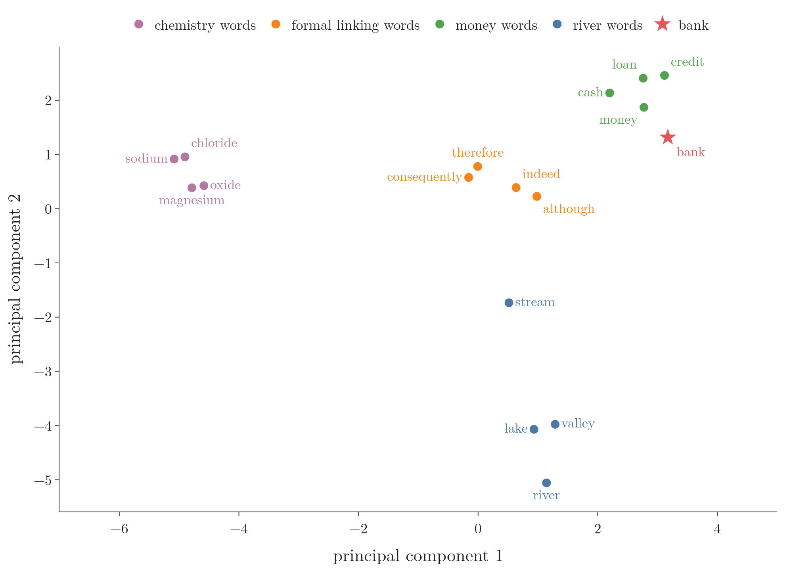
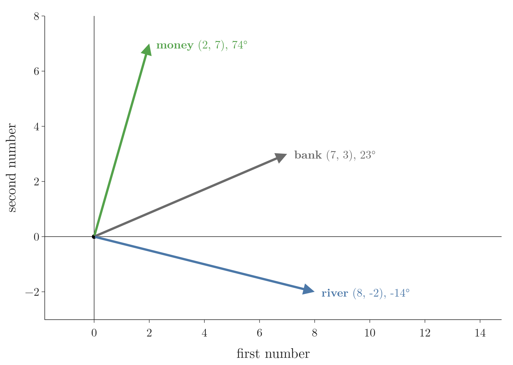
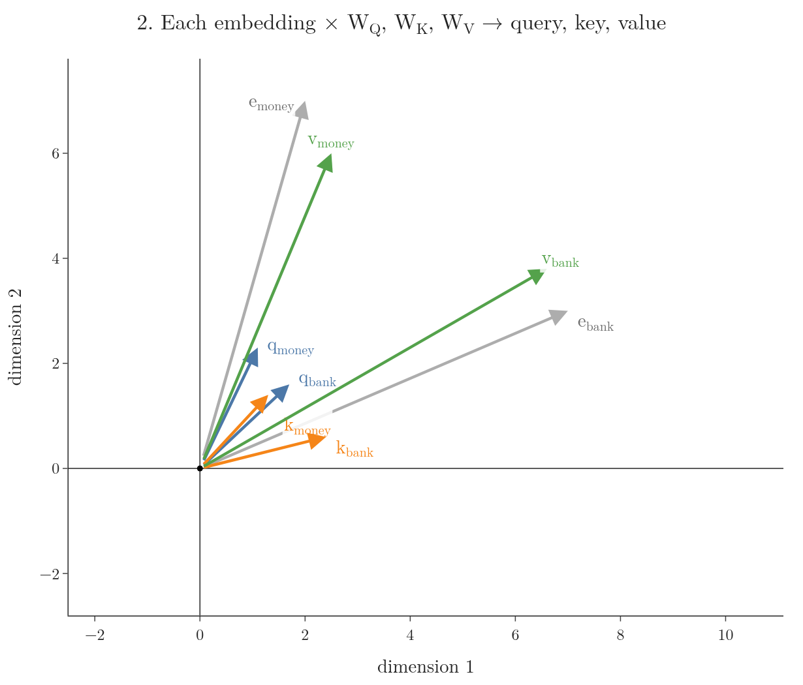
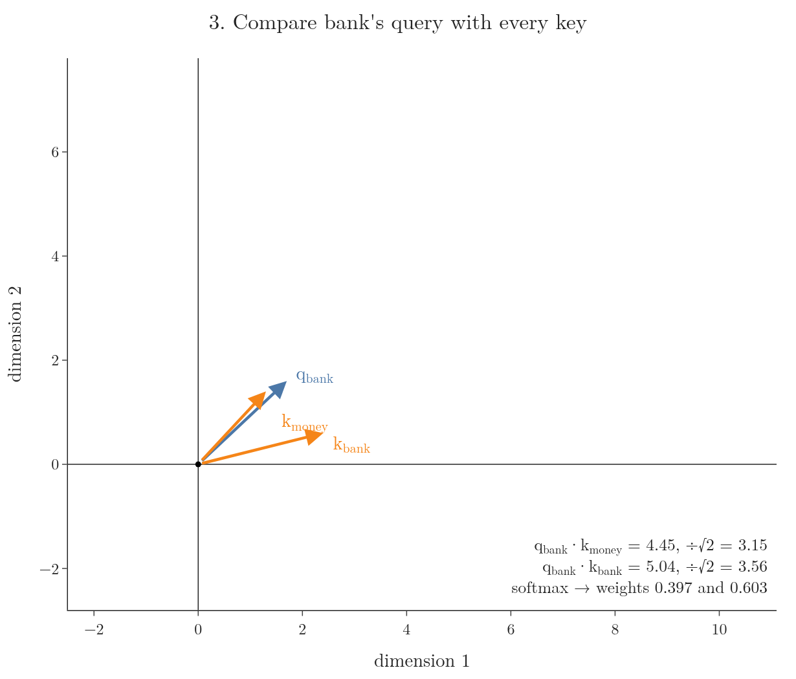
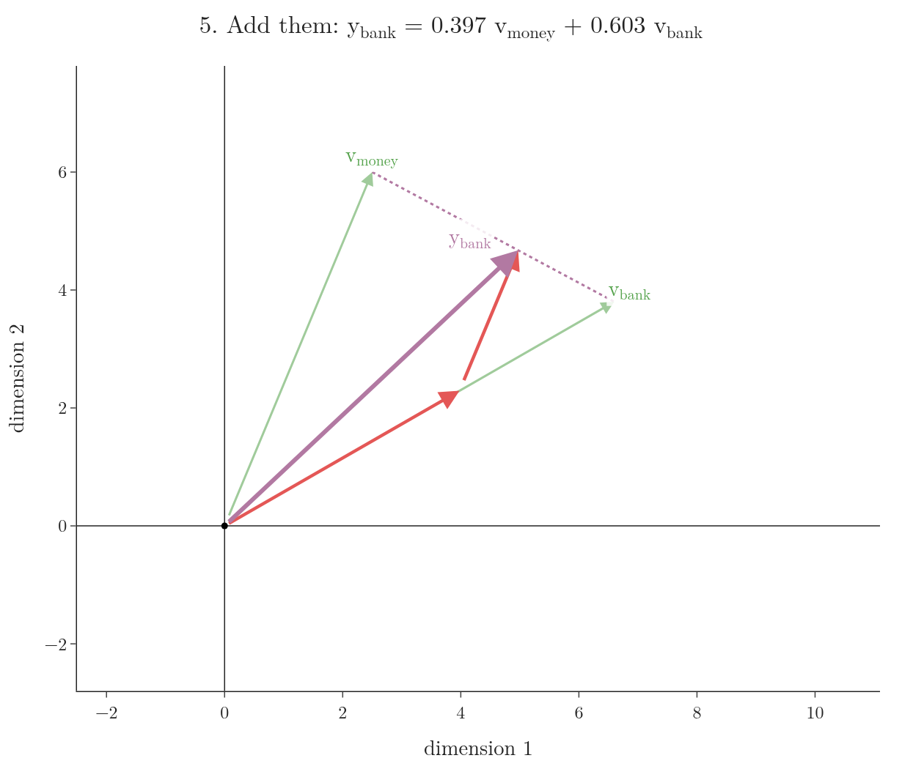
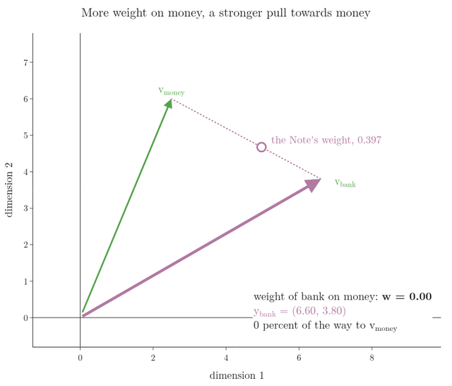
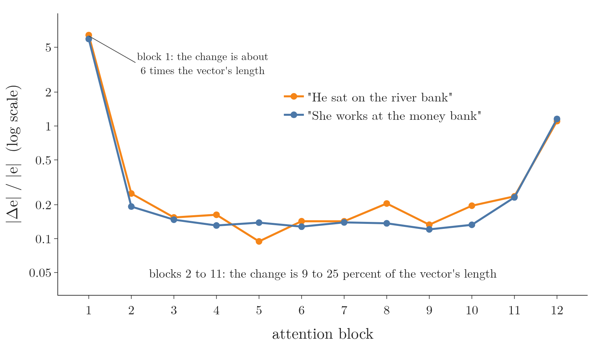

<!-- where-this-fits: generated by course_map/build_map.py; edit concepts.yaml, not this block -->
> **Where this fits:** Pipeline map step 8 (Model). See the [Course map](../../../00-course-map/00-course-map.md).
>
> 
>
> - **Builds on:** [Attention mechanism](../../../DL/06-transformers/DL-069-attention-mechanism/DL-069-attention-mechanism.md#4-the-idea-look-back-at-the-input-while-writing).
> - **Compare with:** [Cross-attention](../../../DL/06-transformers/DL-083-cross-attention/DL-083-cross-attention.md#5-processing-queries-from-one-side-keys-and-values-from-the-other).
<!-- /where-this-fits -->

## 1. Overview

> **Key point:** Drawn as arrows, self-attention does three things to a word's vector. Self-attention projects the embedding into a query, a key and a value vector; it measures how well the word's query points along every key; and it replaces the word by a weighted average of the value vectors. The new vector lies between the value vectors, pulled towards the words that got the most weight, so the same word lands in a different place in a different sentence.

The [self-attention step by step](../DL-074-self-attention-step-by-step/DL-074-self-attention-step-by-step.md#83-all-words-at-once) and the [scaled dot-product attention](../DL-075-scaled-dot-product-attention/DL-075-scaled-dot-product-attention.md#6-choosing-the-scaling-factor) gave the formula for self-attention:

$$Y = \text{softmax}\negthinspace\left(\frac{QK^T}{\sqrt{d_k}}\right)V$$

Here $Q$, $K$ and $V$ are tables with one row per word: its query, key and value vector. $d_k$ is the length of a key vector, $K^T$ is $K$ with rows and columns swapped, and the softmax turns each row of scores into weights that are positive and add up to 1. Every symbol gets a concrete value in sections 4 to 6. This Note draws what the formula does to the vectors. Real embeddings have hundreds of numbers, which we cannot draw. Here every embedding has just 2 numbers, so each vector is an arrow on a page. Figure 1 runs the whole computation for the word "bank" in the sentence "money bank".

{height=60%}

All the numbers in this Note are hypothetical, chosen by hand so that the arrows are easy to see. In a real transformer, $W_Q$, $W_K$ and $W_V$ are learned by training. The Notebook computes every number and checks the geometric claims.

## 2. Prerequisites

- [Self-attention step by step](../DL-074-self-attention-step-by-step/DL-074-self-attention-step-by-step.md#7-three-roles-query-key-and-value): query, key and value vectors, and the weighted sum of values.
- [Scaled dot-product attention](../DL-075-scaled-dot-product-attention/DL-075-scaled-dot-product-attention.md#6-choosing-the-scaling-factor): dividing the scores by $\sqrt{d_k}$.
- [What is self-attention](../DL-073-what-is-self-attention/DL-073-what-is-self-attention.md#5-static-and-contextual-embeddings): contextual embeddings, and the two meanings of "bank".
- [Linear transformations and matrices](../../../MA/05-linear-algebra/MA-053-linear-transformations-and-matrices/MA-053-linear-transformations-and-matrices.md#5-the-matrix-of-a-transformation): multiplying a vector by a matrix moves the vector.
- [Dot product and cosine similarity](../../../MA/05-linear-algebra/MA-050-dot-product-and-cosine-similarity/MA-050-dot-product-and-cosine-similarity.md#5-the-geometric-meaning), section 5: vectors pointing the same way have a large dot product.

## 3. Words as arrows

> **Key point:** An embedding is a list of numbers, so it is a point, or an arrow from the origin, in a space with one axis per number. Words used in similar ways sit close together.

A word **embedding** (G-677; the [RNN sentiment analysis](../../05-rnn/DL-057-rnn-sentiment-analysis/DL-057-rnn-sentiment-analysis.md#6-word-embeddings), section 6) gives every word a vector. With 2 numbers per word, the first number is the position along one axis and the second along the other. The [learned embeddings of IMDB words](../../05-rnn/DL-057-rnn-sentiment-analysis/DL-057-rnn-sentiment-analysis.md#73-what-the-embedding-learned) are plotted as 2-number vectors: positive words and negative words end up on opposite sides. Embeddings with hundreds of numbers are often drawn the same way after a **dimensionality reduction** (G-611; replacing many numbers per word by 2 while keeping as much of the spread as possible) such as **PCA** (G-1469), and words with similar meanings form clusters.

Figure 2 does this for real word vectors. It takes 17 words from **GloVe** (G-851), a published table with 100 numbers per word (Pennington et al. 2014), and projects them onto their first 2 principal components (the two directions in which the 17 words vary most). Three things show:

- **Similar words sit together.** The chemistry words (chloride, sodium, magnesium, oxide) form one group, the formal linking words another, the money words a third and the river words a fourth.
- **The 2-D picture agrees with all 100 numbers.** The mean **cosine similarity** (G-491; how closely two vectors point the same way: 1 for the same direction, 0 for perpendicular) between two words of the same group is 0.70; between words of different groups it is 0.20 (Notebook).
- **"Bank" has one fixed place, next to the money words.** Its mean cosine similarity is 0.60 with the money words and 0.32 with the river words. A fixed embedding cannot move "bank" towards "river" when the sentence is about a river. Self-attention can, and the rest of this Note draws how.

{width=90%}

What the arrow *between* two words means is the subject of the [meaning as direction](../DL-072-meaning-as-direction/DL-072-meaning-as-direction.md#4-the-difference-between-two-words-is-a-direction).

Our sentence is "money bank". The two embeddings are

$$e_{money} = (2,\ 7)$$

$$e_{bank} = (7,\ 3)$$

They point in quite different directions (Figure 3, and the grey arrows in Figure 1, first frame). Figure 3 also shows $e_{river} = (8, -2)$, which section 7.2 uses.

{width=65%}

## 4. Step 1: three projections of every word

> **Key point:** Multiplying an embedding by $W_Q$, $W_K$ and $W_V$ moves it to three new places: its query, key and value vectors. One arrow becomes three.

Multiplying a vector by a matrix is a **linear transformation** (G-1097): it moves the vector somewhere else (the [linear transformations](../../../MA/05-linear-algebra/MA-053-linear-transformations-and-matrices/MA-053-linear-transformations-and-matrices.md#5-the-matrix-of-a-transformation)). **Self-attention** (G-1763) applies three such transformations to each embedding: they give its **query**, **key** (G-1011) and **value** (G-2068) vectors. Our $2 \times 2$ matrices are

$$W_Q = \begin{pmatrix} 0.2 & 0.1 \cr0.1 & 0.3 \end{pmatrix}$$

$$W_K = \begin{pmatrix} 0.3 & 0 \cr0.1 & 0.2 \end{pmatrix}$$

$$W_V = \begin{pmatrix} 0.9 & 0.2 \cr0.1 & 0.8 \end{pmatrix}$$

1. **In words:** each **projection** is the embedding (a row vector) times a matrix.
2. **Formula:**
   $$q = e\thinspace W_Q$$
   $$k = e\thinspace W_K$$
   $$v = e\thinspace W_V$$
3. **Example:** for "money", $e_{money} = (2, 7)$. A row vector times a matrix gives a row vector: the first number is the embedding times the first column of $W_Q$, the second number is the embedding times the second column.
   $$2 \times 0.2 + 7 \times 0.1 = 1.1$$
   $$2 \times 0.1 + 7 \times 0.3 = 2.3$$
   $$q_{money} = (1.1,\ 2.3)$$

All six vectors (Figure 1, second frame, and Figure 4):

| Word | Embedding $e$ | Query $q$ | Key $k$ | Value $v$ |
|---|---|---|---|---|
| money | $(2, 7)$ | $(1.1, 2.3)$ | $(1.3, 1.4)$ | $(2.5, 6.0)$ |
| bank | $(7, 3)$ | $(1.7, 1.6)$ | $(2.4, 0.6)$ | $(6.6, 3.8)$ |

Two embeddings have become six vectors. The embeddings themselves are not used again inside the attention computation (section 7.3 adds the embedding back afterwards).

{width=70%}

## 5. Step 2: compare the query with every key

> **Key point:** The dot product of bank's query with each key measures how closely the two arrows point the same way. Scaling and the softmax turn these scores into weights that sum to 1.

We follow the word "bank"; "money" goes through exactly the same steps. Its new vector depends on how similar "bank" is to every word of the sentence, itself included. The similarity of two arrows is their **dot product** (G-634): large when they point the same way, small when the angle between them is wide (the [dot product](../../../MA/05-linear-algebra/MA-050-dot-product-and-cosine-similarity/MA-050-dot-product-and-cosine-similarity.md#5-the-geometric-meaning), section 5).

1. **In words:** take the dot product of bank's query with every key, divide by $\sqrt{d_k}$, then apply the softmax.
2. **Formula:** here $d_k = 2$, and $j$ runs over the two words, money and bank:
   $$w_{bank,j} = \text{softmax} _j\negthinspace\left(\frac{q_{bank} \cdot k_j}{\sqrt{2}}\right)$$
3. **Example:**
   $$1.7 \times 1.3 = 2.21$$
   $$1.6 \times 1.4 = 2.24$$
   $$q_{bank} \cdot k_{money} = 2.21 + 2.24 = 4.45$$
   $$1.7 \times 2.4 = 4.08$$
   $$1.6 \times 0.6 = 0.96$$
   $$q_{bank} \cdot k_{bank} = 4.08 + 0.96 = 5.04$$
   Divide each score by $\sqrt{2}$:
   $$\sqrt{2} = 1.414$$
   $$4.45 / 1.414 = 3.15$$
   $$5.04 / 1.414 = 3.56$$
   The softmax divides the exponential of each scaled score by the sum of both exponentials, so the weights add up to 1. Unrounded scores give
   $$w_{bank,money} = 0.397$$
   $$w_{bank,bank} = 0.603$$

In Figure 1 (third frame), $q_{bank}$ points between the two keys, much closer to $k_{money}$ in direction (about 4 degrees away, against 29 degrees from $k_{bank}$), but with $k_{bank}$ longer, so $k_{bank}$ wins the larger weight (Figure 5). Once the weights are known, the queries and keys have done their job; only the value vectors are needed from here on.

{width=70%}

## 6. Step 3: a weighted sum of the value vectors

> **Key point:** Each value vector is shrunk by its weight, and the shrunk arrows are added tip to tail. The result $y_{bank}$ is the **contextual embedding** (G-462) of "bank".

1. **In words:** form the **weighted sum** (G-2119): multiply each value vector by its weight (multiplying a vector by a number shrinks or stretches it without turning it), then add the results.
2. **Formula:**
   $$y_{bank} = w_{bank,money}\thinspace v_{money} + w_{bank,bank}\thinspace v_{bank}$$
3. **Example:**
   $$0.397 \times (2.5,\ 6.0) = (0.99,\ 2.38)$$
   $$0.603 \times (6.6,\ 3.8) = (3.98,\ 2.29)$$
   $$y_{bank} = (0.99 + 3.98,\ \ 2.38 + 2.29)$$
   $$y_{bank} = (4.97,\ 4.67)$$

Adding two arrows means placing the second at the tip of the first (the triangle rule), or completing the parallelogram they span; both give the same arrow. Figure 1 (fourth and fifth frames) and Figure 6 show the two shrunk value vectors in red and their sum $y_{bank}$ in purple.

{width=70%}

## 7. What the picture means

> **Key point:** $y_{bank}$ always lies on the line between $v_{bank}$ and $v_{money}$, a fraction $w_{bank,money}$ of the way towards $v_{money}$. Another context word pulls it somewhere else.

### 7.1 The output sits between the value vectors

Because the two weights are positive and add up to 1, the weighted sum can be rewritten:

With $w = w_{bank,money}$, one step per line:

$$y_{bank} = w\thinspace v_{money} + (1 - w)\thinspace v_{bank}$$
$$= v_{bank} + w\thinspace v_{money} - w\thinspace v_{bank}$$
$$= v_{bank} + w\thinspace(v_{money} - v_{bank})$$

With our numbers, $w = 0.397$:

$$v_{money} - v_{bank} = (2.5 - 6.6,\ 6.0 - 3.8)$$
$$v_{money} - v_{bank} = (-4.1,\ 2.2)$$
$$0.397 \times (-4.1,\ 2.2) = (-1.63,\ 0.87)$$
$$y_{bank} = (6.6 - 1.63,\ 3.8 + 0.87)$$
$$y_{bank} = (4.97,\ 4.67)$$

So $y_{bank}$ starts at $v_{bank}$ and moves a fraction $w = 0.397$ of the way along the straight line to $v_{money}$ (the dotted line in Figure 1). Money pulls bank towards itself, like gravity: the more weight money gets, the stronger the pull. Bank pulls money too. Money's own weights are 0.61 on itself and 0.39 on bank, so $y_{money} = (4.10,\ 5.14)$ moves 39% of the way from $v_{money}$ towards $v_{bank}$ (Notebook).

{height=50%}

Figure 7 turns the weight into a slider. Watch the purple arrow: at $w = 0$ it is $v_{bank}$ itself, at $w = 1$ it is $v_{money}$, and in between it sits exactly $w$ of the way along the dotted line. The attention weight is the strength of the pull.

> **Extra:** With $n$ words the same argument holds: the weights are positive and sum to 1, so each output is a weighted average of the $n$ value vectors. A weighted average of points always lies inside the smallest region with straight edges that contains them (their **convex hull**, G-477): for 3 words, inside the triangle of their value vectors. Self-attention can only mix the value vectors of the sentence; it cannot produce a vector outside their range.

### 7.2 The same word in another sentence

Now replace "money" by "river", with embedding $e_{river} = (8, -2)$, and keep everything else. The Notebook repeats the steps:

| | "money bank" | "river bank" |
|---|---|---|
| Value of the other word | $v_{money} = (2.5,\ 6.0)$ | $v_{river} = (7.0,\ 0.0)$ |
| Weight of bank on the other word | 0.397 | 0.202 |
| $y_{bank}$ | $(4.97,\ 4.67)$ | $(6.68,\ 3.03)$ |
| Distance moved from $v_{bank}$ | 1.85 | 0.77 |

The word "bank" has the same embedding and the same value vector in both sentences, yet its outputs are 2.37 apart (Figure 1, last frame). In "money bank" it is pulled up towards money; in "river bank" it is pulled down towards river. Self-attention gives a word a different vector in each context, which is what the [what is self-attention](../DL-073-what-is-self-attention/DL-073-what-is-self-attention.md#6-self-attention-static-in-contextual-out) asked for: a **contextual embedding**.

In a trained model the matrices, and therefore the weights and the directions of the pulls, come from the training data. Our hand-picked numbers only show the geometry.

### 7.3 Adding the change back

> **Key point:** In a transformer, the attention output is not the word's new vector on its own. It is a **change**, $\Delta e$ (G-2272), that is **added** to the word's own vector: new vector $= e + \Delta e$. The addition is the residual connection of the transformer encoder.

Sections 6 and 7.1 treated $y_{bank}$ as the new vector of "bank". Inside a transformer one more step follows. The attention output is added to the vector that went in, $e_{bank} + y_{bank}$ (the [transformer encoder](../DL-081-transformer-encoder/DL-081-transformer-encoder.md#52-add-and-norm), section 5.2, calls this the **residual connection**, G-1681; there a **layer normalisation**, G-1054, follows the addition). So the value vectors are best read as "what to add to the other word if this word is relevant to it", and their weighted sum $y_{bank}$ as the change $\Delta e$ (Sanderson 2024, Ch 6). Section 7.1 still holds: the change itself lies between the value vectors. What moves the word is the change added on top of it.

1. **In words:** keep the word's own arrow, and put the attention output at its tip.
2. **Formula:**
   $$e_{bank}^{new} = e_{bank} + \Delta e$$
   $$\Delta e = y_{bank}$$
   $$\Delta e = w_{bank,money}\thinspace v_{money} + w_{bank,bank}\thinspace v_{bank}$$
3. **Example:** in "money bank":
   $$e_{bank} + \Delta e = (7, 3) + (4.97, 4.67)$$
   $$e_{bank} + \Delta e = (11.97, 7.67)$$
   The arrow turns from 23 degrees to 33 degrees, towards "money". In "river bank":
   $$(7, 3) + (6.68, 3.03) = (13.68, 6.03)$$
   This is at 24 degrees: almost no turn, only longer (Notebook).

   The pull towards "river" from section 7.2 is still there, but inside $\Delta e$: the change points at 24 degrees, below $v_{bank}$ at 30 degrees. It does not point below $e_{bank}$ at 23 degrees, because $W_V$ turned bank's own value vector upwards. So with these hand-picked numbers the sum turns by only about one degree.

{height=55%}

Watch, in Figure 8, how the same grey arrow receives a different purple change in each sentence and so ends in a different place. With our hand-picked numbers the change is almost as long as the vector itself.

In a real trained model the change is mostly much smaller: a nudge. The Notebook runs GPT-2 small, a published trained transformer with 12 blocks and 768 numbers per token (Radford et al. 2019), and measures, for the last word "bank" of two real sentences, the length of each attention block's change relative to the vector it is added to (Figure 9; its vertical axis is on a log scale: equal distances mean equal multiplication, so the labelled ticks 0.1, 0.2, 0.5, 1, 2 and 5 are not evenly spaced in value). In blocks 2 to 11 the change is 9 to 25 percent of the vector's length, and the vector after the addition still points almost the same way as before (cosine 0.968 or more). Only the first and the last block change the vector a lot.

{width=85%}

> **Extra:** The picture of attention as a change $\Delta e$ added to a word's vector follows Sanderson's "Attention in transformers, step-by-step" (3Blue1Brown, 2024), recreated here with our own numbers and code.

## 8. Summary

| Step | What happens to the arrows | "bank" in "money bank" |
|---|---|---|
| Projections | each embedding is moved by $W_Q$, $W_K$, $W_V$ into three new vectors | $q_{bank} = (1.7, 1.6)$, $k_{bank} = (2.4, 0.6)$, $v_{bank} = (6.6, 3.8)$ |
| Scores | dot product of the query with every key: how well they line up | $4.45$ and $5.04$ |
| Weights | divide by $\sqrt{d_k}$, softmax | $0.397$ on money, $0.603$ on bank |
| Output | shrink each value vector by its weight, add tip to tail | $y_{bank} = (4.97, 4.67)$ |

- In the table, the queries and keys only decide the weights; after step 2 only the value vectors are used, so the output is built from values alone.
- An embedding is an arrow; similar words point to nearby places (in GloVe, mean cosine similarity 0.70 within a group of related words, 0.20 between groups), so a fixed "bank" sits beside the money words in every sentence.
- The output of self-attention is a weighted average of the value vectors, so it lies between them, pulled towards the words with large weights; it can never land outside the range of the sentence's value vectors.
- The same word gets a different output in a different sentence, because a different neighbour pulls it a different way: "bank" moves towards money in one and towards river in the other.
- In a transformer the attention output is a change $\Delta e$ added to the word's own vector (the residual connection), so the word keeps its own meaning and gets a nudge; in GPT-2 small most blocks add a change of 9 to 25 percent of the vector's length.
- So, drawn as arrows, self-attention projects each word three ways, compares query with keys, and pulls the word towards the values of the words that matter.

## 9. Sources

**Built from**

- CampusX, "Self Attention Geometric Intuition | How to Visualize Self Attention | CampusX", YouTube, https://www.youtube.com/watch?v=5ZgGuujZSbs
- Sanderson, G. (3Blue1Brown), "Attention in transformers, step-by-step | Deep Learning Chapter 6", 2024, 3blue1brown.com/lessons/attention, https://www.youtube.com/watch?v=eMlx5fFNoYc. 13:12–15:44 (value vectors as what to add; the change $\Delta e$ added to the embedding).

**Other references**

- Vaswani, A. et al. (2017). Attention Is All You Need. *NeurIPS 2017*. arXiv:1706.03762. Section 3.2.1, eq. 1 (scaled dot-product attention).
- Jurafsky, D. and Martin, J. H. *Speech and Language Processing*, 3rd ed. draft (19 August 2026), chapter 7: attention as a way to build contextual representations of a token's meaning by integrating information from surrounding tokens (eq. 7.10–7.13).
- Pennington, J., Socher, R. and Manning, C. D. (2014). GloVe: Global Vectors for Word Representation. *EMNLP 2014*. The 100-number word vectors of Figure 2 (`glove.6B.100d`, nlp.stanford.edu/projects/glove).
- Radford, A., Wu, J., Child, R., Luan, D., Amodei, D. and Sutskever, I. (2019). Language Models are Unsupervised Multitask Learners. OpenAI. §2.3 (the GPT-2 architecture). Weights: `openai-community/gpt2` (GPT-2 small), huggingface.co.

## 10. Key terms

| Term | Meaning |
|---|---|
| Embedding vector | The list of numbers that represents one word, drawn as an arrow from the origin; words used in similar ways get nearby arrows, so a model can compare words through their vectors. |
| Projection | Multiplying an embedding by $W_Q$, $W_K$ or $W_V$, which moves it to a new vector |
| Query, key, value vectors | Three vectors made from each word's embedding by learned matrices: a word's query is compared with every word's key by dot products to get attention weights, and those weights mix the value vectors into the word's new vector. |
| Weighted sum | In self-attention, the value vectors multiplied by their weights and added together; the result is the word's new, context-aware vector. |
| Convex hull | The smallest region with straight edges that contains a set of points; every weighted average of the points lies inside it |
| Contextual embedding | A word's vector after self-attention, which depends on the other words of the sentence |
| GloVe | A published table of word vectors (Pennington et al. 2014); here 100 numbers per word |
| Cosine similarity | The cosine of the angle between two vectors: 1 for the same direction, 0 for perpendicular |
| Change $\Delta e$ (G-2272) | The amount attention adds to a word's vector: the attention output is added to the word's own vector (the residual connection), new vector $= e + \Delta e$, so it acts as an update to the word. |
