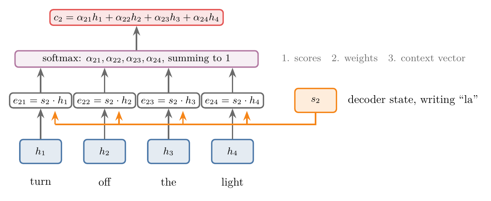
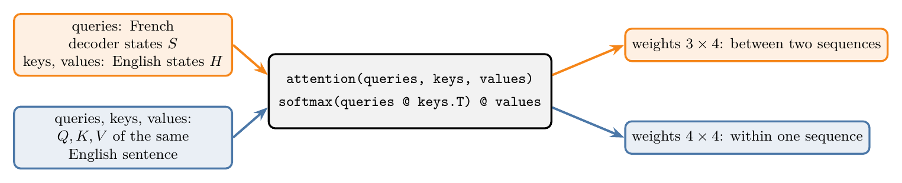

<!-- where-this-fits: generated by course_map/build_map.py; edit concepts.yaml, not this block -->
> **Where this fits:** Pipeline map step 8 (Model). See the [Course map](../../../00-course-map/00-course-map.md).
>
> 
>
> - **Builds on:** [Self-attention (query, key, value)](../../../DL/06-transformers/DL-074-self-attention-step-by-step/DL-074-self-attention-step-by-step.md#7-three-roles-query-key-and-value).
> - **Compare with:** [Cross-attention](../../../DL/06-transformers/DL-083-cross-attention/DL-083-cross-attention.md#5-processing-queries-from-one-side-keys-and-values-from-the-other).
<!-- /where-this-fits -->

## 1. Overview

> **Key point:** **Self-attention** (G-1763) is an attention mechanism because it uses the same three equations as Luong's attention in an encoder–decoder: dot-product scores between a query and keys, a softmax, and a weighted sum of values. Self-attention is called "self" because the queries, keys and values all come from one sentence, while Luong's attention relates two different sentences, the output and the input.

At first sight self-attention looks nothing like [the attention that gives the decoder a new context vector for every output word](../DL-069-attention-mechanism/DL-069-attention-mechanism.md#4-the-idea-look-back-at-the-input-while-writing). The earlier attention lived inside an encoder–decoder with two LSTMs, and it helped the decoder look back at the input sentence. Self-attention, as built in [self-attention step by step](../DL-074-self-attention-step-by-step/DL-074-self-attention-step-by-step.md#7-three-roles-query-key-and-value), has no encoder and no decoder: it takes one sentence and returns a **contextual embedding** for every word (a vector for the word that already mixes in the other words of the sentence).

This Note answers two questions:

1. Why is self-attention a kind of **attention**?
2. Why is it called **self**?

{width=100%}

## 2. Prerequisites

- [The attention mechanism](../DL-069-attention-mechanism/DL-069-attention-mechanism.md#5-the-context-vector-at-each-step): a new context vector for every output word, built from all encoder states.
- [Luong's simpler score](../DL-070-bahdanau-vs-luong-attention/DL-070-bahdanau-vs-luong-attention.md#51-a-simpler-score): Luong's dot-product score.
- [self-attention step by step](../DL-074-self-attention-step-by-step/DL-074-self-attention-step-by-step.md#7-three-roles-query-key-and-value): query, key and value vectors.
- [Scaled dot-product attention](../DL-075-scaled-dot-product-attention/DL-075-scaled-dot-product-attention.md#4-longer-vectors-give-more-spread-out-dot-products): dividing the scores by $\sqrt{d_k}$ ($d_k$ is the length of a key vector).

## 3. Attention in the encoder–decoder, in three equations

> **Key point:** For output step $i$, the decoder state $s_i$ is compared with every encoder state $h_j$ by a dot product; the softmax turns the scores into weights $\alpha_{ij}$; the context vector $c_i$ is the weighted sum of the encoder states.

Recall the setting of [the attention mechanism](../DL-069-attention-mechanism/DL-069-attention-mechanism.md#4-the-idea-look-back-at-the-input-while-writing). We translate the English sentence "Turn off the light." into French, "Éteins la lumière.", a pair taken from the English–French dataset used in these Notes. An **LSTM** (G-1123) encoder reads the 4 English words and keeps a hidden state after each: $h_1, h_2, h_3, h_4$. An LSTM decoder writes the 3 French words, with a hidden state $s_i$ at each step.

The plain encoder–decoder hands the decoder one context vector for the whole sentence. Attention gives the decoder a fresh context vector $c_i$ at every step, a weighted mix of all encoder states. With the dot-product score of **Luong attention** (G-1137; Luong et al. 2015), the context vector comes from three equations:

1. **Scores:** $e_{ij} = s_i \cdot h_j$, how well encoder state $j$ matches what the decoder needs at step $i$. The dot product $\cdot$ of two vectors multiplies matching entries and adds the results, so a larger value means more alike. For $[1, 2] \cdot [3, 4]$:
   $$1 \times 3 + 2 \times 4$$
   $$= 11$$
2. **Weights:** $\alpha_{ij} = \text{softmax} _j(e_{ij})$: the softmax over $j$ turns the scores of one step into positive numbers that sum to 1.
3. **Context vector:** $c_i = \sum_j \alpha_{ij}\thinspace h_j$, where $\sum_j$ adds the terms for $j = 1, \dots, 4$.

For example, the **context vector** (G-461) for writing "la" (Figure 2) is:

$$c_2 = \alpha_{21}h_1 + \alpha_{22}h_2$$

$$\qquad + \alpha_{23}h_3 + \alpha_{24}h_4$$

{width=95%}

With 3 output words and 4 input words there are 12 weights $\alpha_{ij}$:

$$3 \times 4 = 12$$

Luong et al. write the same equations with $h_t$ for the decoder state and $\bar h_s$ for an encoder state (Luong et al. 2015, section 3: eq. 7 for the weights, eq. 8 for the score); [The two compared](../DL-070-bahdanau-vs-luong-attention/DL-070-bahdanau-vs-luong-attention.md#6-the-two-compared) are compared there.

## 4. Self-attention in the same three equations

> **Key point:** Self-attention follows the same three steps: query·key scores, a softmax, a weighted sum of values. Only the source of the vectors differs.

Take now only the English sentence, "turn off the light". Self-attention gives every word a query $q_j$, a key $k_j$ and a value $v_j$, and builds the contextual embedding of "turn" like this:

1. **Scores,** for $j = 1, \dots, 4$:

   $$s_{1j} = q_1 \cdot k_j$$

2. **Weights:**

   $$w_{1j} = \text{softmax} _j(s_{1j})$$

3. **Output:**

   $$y_1 = w_{11}v_1 + w_{12}v_2$$

   $$\qquad + w_{13}v_3 + w_{14}v_4$$

Then the same for "off", "the" and "light". Written side by side (Figure 1), the two computations match role for role:

| Role | Luong attention | Self-attention |
|---|---|---|
| Query: the one asking "which words help me?" | decoder state $s_i$ | query $q_i$ of a word |
| Key: compared with the query | encoder state $h_j$ | key $k_j$ of a word |
| Value: mixed into the output | encoder state $h_j$ | value $v_j$ of a word |
| Similarity | $e_{ij} = s_i \cdot h_j$ | $s_{ij} = q_i \cdot k_j$ |
| Weights | $\alpha_{ij} = \text{softmax} _j(e_{ij})$ | $w_{ij} = \text{softmax} _j(s_{ij})$ |
| Output | context vector $c_i$ | contextual embedding $y_i$ |

The decoder state acts as the **query**: at step $i$ the decoder asks which input words will help it write the next word. The encoder states answer as **keys** (G-1011), and they are also the **values** (G-2068) that get mixed. In Luong attention the key and the value of a word are the same vector $h_j$; self-attention gives each word two different vectors for these two jobs.

{width=100%}

Figure 3 lines the equations up row by row. Everything in grey is the same on both sides; only the coloured vectors are swapped.

{height=50%}

Figure 4 plays the same substitution as a movement. Watch the top first: the French words that were asking leave, and a copy of the English sentence moves up to ask instead. Then watch the equations: only the names of the vectors change, and the three steps (scores, weights, output) stay where they are.

## 5. Why self-attention is attention

> **Key point:** The mathematics is the same. One function, and one Keras layer, computes both.

Since the three equations are the same, one function computes both kinds of attention (Figure 5). The Notebook writes it once:

{width=100%}


> **Python:** The three equations as one function.
>
> ```python
> def attention(queries, keys, values):
>     A = softmax(queries @ keys.T)      # scores, then weights
>     return A, A @ values               # weights, weighted sums
>
> A_luong, C = attention(S, H, H)        # decoder states ask the encoder states
> A_self, Y = attention(Q / np.sqrt(d), K, V)   # one sentence asks itself
> ```

The Notebook runs it on the sentence pair above, with an (untrained) LSTM encoder and decoder of 8 units:

- **Between two sequences:** `attention(S, H, H)` gives a $3 \times 4$ weight matrix, French words by English words. Keras' `keras.layers.Attention` (G-103), which its documentation calls "dot-product attention layer, a.k.a. Luong-style attention", returns exactly the same weights and context vectors.
- **Within one sequence:** the input is the matrix $X$ of English embeddings, one row per word. Three weight matrices $W_Q$, $W_K$, $W_V$ turn each embedding into a query, a key and a value:

  $$Q = XW_Q$$

  $$K = XW_K$$

  $$V = XW_V$$

  With the scores divided by $\sqrt{d_k}$, the same function gives a 4 by 4 weight matrix, English by English: 4 words, each scoring all 4 words, so 16 weights, and each row adds up to 1. The same Keras layer again returns the same numbers.

Self-attention is attention because it is the same computation: a query scores keys, the softmax turns the scores into weights, and the weights mix the values. Only the setting, an encoder–decoder or a single sentence, made the two look different.

## 6. Why it is called "self"

> **Key point:** Luong and Bahdanau attention work between two sequences (**inter-sequence attention**, G-958). Self-attention works within one sequence (intra-sequence): the sequence attends to itself.

In Luong's attention the queries come from one sequence, the French output, and the keys and values from another, the English input. The weights relate the words of two different sentences, so the weight matrix is rectangular: $3 \times 4$, output length by input length.

In self-attention the queries, keys and values all come from the same sentence. Every word is compared with every word of its own sentence, itself included, and the weight matrix is square: $4 \times 4$. Vaswani et al. (2017, section 2) define it this way: "Self-attention, sometimes called intra-attention is an attention mechanism relating different positions of a single sequence in order to compute a representation of the sequence."

{width=100%}

The "self" therefore describes where the inputs come from, not a different calculation. Keras' `MultiHeadAttention` layer shows this directly: it takes a `query` sequence and a `value` sequence. Called with the English sentence as both, it does self-attention and returns $4 \times 4$ weights; called with the French states as the query and the English sentence as the value, the same layer returns $3 \times 4$ weights (Notebook). The second use, between the decoder and the encoder of a transformer, is called **cross-attention** (G-507) and has its own section in [cross-attention](../DL-083-cross-attention/DL-083-cross-attention.md#5-processing-queries-from-one-side-keys-and-values-from-the-other).

> **Extra:** The middle panel of Figure 6 shows why self-attention needs its projection matrices. Without $W_Q$ and $W_K$, the query and the key of a word are the same vector, and the dot product of a vector with itself (its squared length) is usually the largest score: "off" and "the" put all their weight on themselves. Jurafsky and Martin (SLP3 draft, ch. 7, section on attention) note the same: in the simple version, "the softmax weight will likely be highest for $x_i$, since $x_i$ is very similar to itself". Separate query, key and value matrices, (see [self-attention step by step](../DL-074-self-attention-step-by-step/DL-074-self-attention-step-by-step.md#7-three-roles-query-key-and-value)), let a word look for something other than itself (right panel).

## 7. Summary

| | Luong attention | Self-attention |
|---|---|---|
| Sequences | two: output and input | one |
| Query | decoder state $s_i$ | $q_i = x_iW_Q$ |
| Keys and values | encoder states $h_j$ (same vector for both) | $k_j = x_jW_K$, $v_j = x_jW_V$ |
| Scaling | none | divide by $\sqrt{d_k}$ |
| Weight matrix | output length $\times$ input length ($3 \times 4$) | length $\times$ length ($4 \times 4$) |
| Output | context vector for the decoder | contextual embedding of every word |

- Self-attention is attention: scores from query·key dot products, a softmax, and a weighted sum of values, the same three equations as Luong's attention.
- It is "self" because one sequence supplies the queries, the keys and the values: attention within a sequence (intra-attention), not between two.
- Self-attention gives each word its own query, key and value through $W_Q$, $W_K$, $W_V$, because without them a word's query equals its key and most of its weight goes to itself.
- One function, or one Keras layer, computes both; only the inputs differ, so the same layer later serves as self-attention and as cross-attention in the transformer.

## 8. Sources

**Built from**

- CampusX, "Why is Self Attention called "Self"? | Self Attention Vs Luong Attention in Depth Lecture | CampusX", YouTube, https://www.youtube.com/watch?v=o4ZVA0TuDRg

**Other references**

- Luong, M.-T., Pham, H. and Manning, C. D. (2015). Effective Approaches to Attention-based Neural Machine Translation. *EMNLP 2015*. arXiv:1508.04025. Section 3, eq. 7 and 8 (the dot score, the weights $a_t(s)$, the context vector $c_t$).
- Vaswani, A. et al. (2017). Attention Is All You Need. *NeurIPS 2017*. arXiv:1706.03762. Section 2 (self-attention, "sometimes called intra-attention"); section 3.2.1 (scaled dot-product attention).
- Jurafsky, D. and Martin, J. H. *Speech and Language Processing*, 3rd ed. draft (19 August 2026). Chapter 14, section 14.8 (dot-product attention in the encoder–decoder); chapter 7, section on attention (the simple version weighs $x_i$ most).
- Tatoeba Project, English–French sentence pairs, distributed by manythings.org/anki (the Keras `fra-eng` example dataset).
- Keras API documentation: `Attention` layer ("Dot-product attention layer, a.k.a. Luong-style attention") and `MultiHeadAttention` layer, keras.io/api/layers/attention_layers.

## 9. Key terms

Terms taught in this Note come first; linked terms are recaps, taught in the Note the link opens.

| Term | Meaning |
|---|---|
| Self-attention (intra-attention) (G-1763) | Attention in which the words of one sequence attend to each other (the queries, keys and values all come from that sequence); it gives each word a new vector that depends on the words around it. |
| `keras.layers.Attention` (G-103) | Keras' layer that lets each item of one sequence look at another sequence: it scores queries from the first against keys from the second by dot product (Luong-style attention). It returns the attention weights and the weighted sums of the values (context vectors). |
| Inter-sequence attention (G-958) | Attention between two different sequences, such as an output and an input sentence. |
| [Long short-term memory (LSTM)](../../../DL/05-rnn/DL-061-lstm/DL-061-lstm.md#6-the-core-idea-a-second-path-for-long-term-memory) (G-1123) | A recurrent network (RNN) that carries two memories from one time step to the next, a long-term one (the cell state) and a short-term one (the hidden state), with gates that control what each memory keeps and passes on. |
| [Luong attention (multiplicative, dot)](../../../DL/06-transformers/DL-070-bahdanau-vs-luong-attention/DL-070-bahdanau-vs-luong-attention.md#5-luong-attention) (G-1137) | Attention between a decoder state and the encoder states, scored by multiplying them: $s_i^\top h_j$ (dot) or $s_i^\top W_a h_j$. |
| [Context vector](../../../DL/06-transformers/DL-067-history-of-llms/DL-067-history-of-llms.md#4-stage-1-the-encoderdecoder-2014) (G-461) | The summary of the input that the decoder works from; one fixed vector in the plain encoder–decoder, a new one per output word with attention. |
| [Key](../../../DL/06-transformers/DL-074-self-attention-step-by-step/DL-074-self-attention-step-by-step.md#7-three-roles-query-key-and-value) (G-1011) | In attention, the vector each word offers to be compared with a query; the dot product of the query with a key scores how much attention that word gets. |
| [Value](../../../DL/06-transformers/DL-074-self-attention-step-by-step/DL-074-self-attention-step-by-step.md#1-overview) (G-2068) | In self-attention, the vector each word contributes to the weighted sum that becomes a word's new vector; it comes from the word's embedding through a learned value matrix. |
| [Cross-attention](../../../DL/06-transformers/DL-083-cross-attention/DL-083-cross-attention.md#5-processing-queries-from-one-side-keys-and-values-from-the-other) (G-507) | Attention between the two halves of a transformer: the queries come from the decoder and the keys and values from the encoder's output, so each output word can use the input sentence. |
| [Query, key, value vectors](../../../DL/06-transformers/DL-078-multi-head-attention/DL-078-multi-head-attention.md#3-self-attention-in-one-paragraph) (G-1607) | Three vectors made from each word's embedding by learned matrices: a word's query is compared with every word's key by dot products to get attention weights, and those weights mix the value vectors into the word's new vector. |
