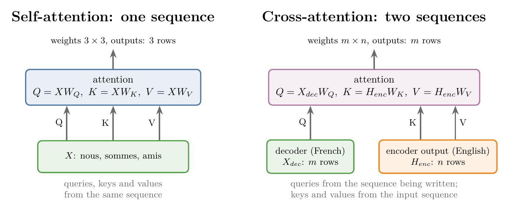
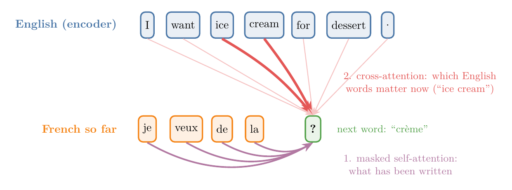
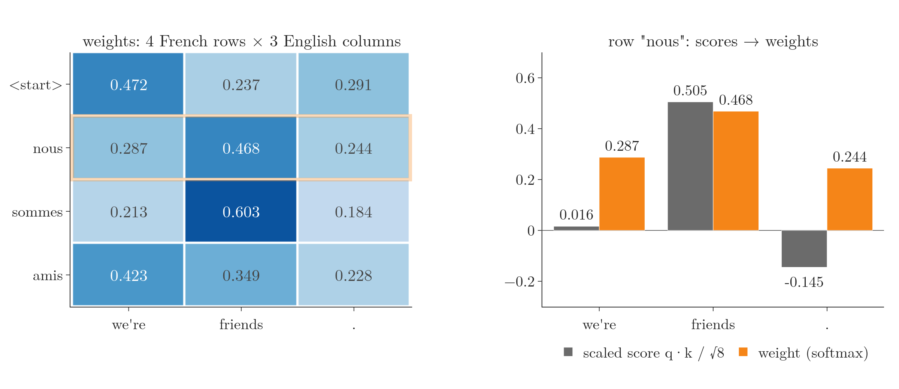
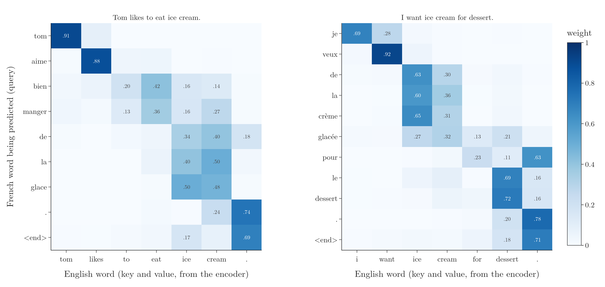
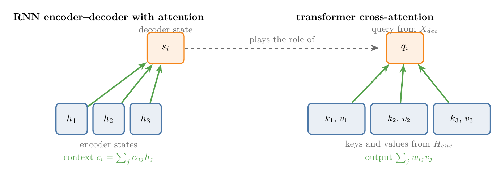

<!-- where-this-fits: generated by course_map/build_map.py; edit concepts.yaml, not this block -->
> **Where this fits:** Pipeline map step 8 (Model). See the [Course map](../../../00-course-map/00-course-map.md).
>
> 
>
> - **Leads to:** [Transformer decoder](../../../DL/06-transformers/DL-084-transformer-decoder/DL-084-transformer-decoder.md#6-inside-one-decoder-block).
> - **Compare with:** [Bahdanau (additive) attention](../../../DL/06-transformers/DL-070-bahdanau-vs-luong-attention/DL-070-bahdanau-vs-luong-attention.md#4-bahdanau-attention); [Self-attention (query, key, value)](../../../DL/06-transformers/DL-074-self-attention-step-by-step/DL-074-self-attention-step-by-step.md#7-three-roles-query-key-and-value).
<!-- /where-this-fits -->

## 1. Overview

> **Key point:** **Cross-attention** (G-507) is attention between two sequences: each word of the sentence being written gets a weighted mix of the words of the input sentence. The computation is the same as self-attention; only the inputs differ.

In the transformer decoder, the **queries** (G-1607) come from the output sentence being written (French), and the **keys** (G-1011) and **values** (G-2068) come from the encoder's output for the input sentence (English). The weights say how strongly each French position relates to each English word.

[Masked self-attention](../DL-082-masked-self-attention/DL-082-masked-self-attention.md#6-the-fix-mask-the-future) covered the decoder's first attention layer. Its second attention layer is different: in the paper's architecture diagram, two of its three inputs come from the encoder and one from the decoder (Vaswani et al. 2017, Figure 1). The paper calls it **encoder–decoder attention** (G-684); it is now usually called **cross-attention** (SLP3 §13.3).

Cross-attention is a mechanism used in sequence-to-sequence tasks such as translation and summarization. Cross-attention lets a model focus on different parts of the input sequence while it generates the output sequence. This Note compares it with self-attention in three respects (Figure 1):

- what goes in (section 4);
- what happens inside (section 5);
- what comes out (section 6).

The Note then shows the weights of a small trained translation model (section 7), and its link to the attention of the RNN encoder–decoder (section 8).

{width=100%}

## 2. Prerequisites

- [Self-attention step by step](../DL-074-self-attention-step-by-step/DL-074-self-attention-step-by-step.md#8-query-key-and-value-vectors-from-learned-matrices): query, key and value vectors, $W_Q$, $W_K$, $W_V$.
- [Scaled dot-product attention](../DL-075-scaled-dot-product-attention/DL-075-scaled-dot-product-attention.md#6-choosing-the-scaling-factor): $\text{softmax}(QK^T/\sqrt{d_k})\thinspace V$.
- [Multi-head attention](../DL-078-multi-head-attention/DL-078-multi-head-attention.md#6-multi-head-attention-in-the-transformer): heads, $W_O$, the parameter count $4d^2 + 4d$.
- [Attention mechanism](../DL-069-attention-mechanism/DL-069-attention-mechanism.md#5-the-context-vector-at-each-step) and [Bahdanau and Luong attention](../DL-070-bahdanau-vs-luong-attention/DL-070-bahdanau-vs-luong-attention.md#6-the-two-compared): attention in the RNN encoder–decoder.
- [Transformer encoder](../DL-081-transformer-encoder/DL-081-transformer-encoder.md#5-inside-one-encoder-block): the encoder's output, one vector per input word.
- [Masked self-attention](../DL-082-masked-self-attention/DL-082-masked-self-attention.md#6-the-fix-mask-the-future): the decoder's first attention layer.

## 3. What the decoder needs to know

> **Key point:** The next word depends on two things: the words written so far, and the input sentence. Self-attention handles the first; cross-attention handles the second.

Take a translation from English into French: "I want ice cream for dessert." becomes "Je veux de la crème glacée pour le dessert." The encoder reads the English sentence and produces one vector per word. The decoder writes the French sentence one word at a time.

Suppose the decoder has written "je veux de la" and must now write the next word. What does the choice depend on?

1. **What it has written so far.** After "je veux de la", only certain words fit. Relating a word to the other words of its own sentence is the job of self-attention; in the decoder it is the [masked self-attention](../DL-082-masked-self-attention/DL-082-masked-self-attention.md#6-the-fix-mask-the-future) layer.
2. **What the input sentence says.** "crème" is right because the English sentence says "ice cream". The decoder needs to know which English words matter for the word it is writing. Losing track of a single input word can reverse the meaning: in "Don't eat the delicious looking pizza", a translation that drops "don't" tells the reader to eat it (StatQuest, "Transformer Neural Networks", 28:30).

The second need is a relationship between two different sequences: for every French word, how strongly it relates to every English word. We can picture it as a table with one row per French word and one column per English word, with "crème" strongly tied to "ice" and "cream", and "veux" to "want".

{width=100%}

Figure 2 shows both needs for the next word after "je veux de la". The mechanism that computes the French-to-English table is cross-attention:

- **self-attention** (G-1763) relates the items of **one** sequence to each other;
- **cross-attention** relates the items of one sequence to the items of **another**.

## 4. Input: two sequences instead of one

> **Key point:** Self-attention receives one sequence. Cross-attention receives two: the output sequence and the encoder's output for the input sequence.

Self-attention receives one matrix $X$, with one row per word: the embeddings of a sentence, or the outputs of the previous layer. For "nous sommes amis" (French for "we are friends"), $X$ has 3 rows.

Cross-attention receives two matrices:

- $X_{dec}$: one row per position of the **output** sentence, coming from the decoder's previous sub-layer;
- $H_{enc}$: one row per word of the **input** sentence, the final output of the encoder.

A small instance: the English input "we are friends" has $n = 3$ words, so $H_{enc}$ has 3 rows. The French output so far, "nous sommes", has $m = 2$ positions, so $X_{dec}$ has 2 rows. Every output position will score every input word, so the table of scores has this size:

$$m \times n = 2 \times 3$$

In SLP3's notation, where self-attention takes $X$, "in cross attention the input is the final output of the encoder $H^{enc} = h_1, \dots, h_n$" (SLP3 §13.3). The input sentence has $n$ words and the output sentence $m$ positions; $n$ and $m$ need not be equal. (The "input" and "output" here are the two sentences, not the input and output of the layer.)

## 5. Processing: queries from one side, keys and values from the other

> **Key point:** The queries are computed from the output sentence; the keys and values from the input sentence. After that, every step is the same as in scaled dot-product attention.

### 5.1 The formula

> **Key point:** The decoder's vectors are turned into queries, the encoder's output into keys and values, and the usual attention formula does the rest: $Q = X_{dec}W_Q$, $K = H_{enc}W_K$, $V = H_{enc}W_V$, then $\text{softmax}(QK^T/\sqrt{d_k})\thinspace V$.

Cross-attention has its own three weight matrices $W_Q$, $W_K$, $W_V$, just like self-attention. The difference is which sequence each one multiplies:

$$Q = X_{dec}\thinspace W_Q$$

$$K = H_{enc}\thinspace W_K$$

$$V = H_{enc}\thinspace W_V$$

$$\text{CrossAttention}(Q, K, V) = \text{softmax}\negthinspace\left(\frac{QK^T}{\sqrt{d_k}}\right)V$$

(SLP3 eq. 13.11 and 13.12). Each French position gets a query vector; each English word gets a key vector and a value vector. The paper describes the same thing: "the queries come from the previous decoder layer, and the memory keys and values come from the output of the encoder" (Vaswani et al. 2017, §3.2.3).

From here on nothing is new. Every query is compared with every key by a dot product, the scores are scaled by $\sqrt{d_k}$, a softmax turns each row into **attention weights** (G-225), and each output is the weighted sum of the value vectors.

### 5.2 By hand

> **Key point:** With 4 French positions and 3 English words, the score matrix and the weight matrix are $4 \times 3$, and each row of weights sums to 1.

The Notebook takes the pair "we're friends ." and "nous sommes amis", with $n = 3$ English words and $m = 4$ decoder positions (`<start>`, "nous", "sommes", "amis"). Each word has 8 numbers. The numbers are random stand-ins for the encoder output and the decoder states, and $W_Q$, $W_K$, $W_V$ are random (untrained); only the shapes and the arithmetic matter here.

| | Shape |
|---|---|
| $Q = X_{dec}W_Q$ | $4 \times 8$ |
| $K = H_{enc}W_K$ and $V = H_{enc}W_V$ | $3 \times 8$ each |
| Scores $QK^T/\sqrt{8}$ and weights | $4 \times 3$ |
| Output | $4 \times 8$ |

1. **In words:** for the French position "nous", take the dot product of its query with each English key, divide by $\sqrt{8}$, and turn the three scores into weights with the softmax.
2. **Formula:** for French position $i$ and English word $j$,
   $$w_{ij} = \frac{e^{s_{ij}}}{\sum_{k=1}^{n} e^{s_{ik}}}$$
   $$s_{ij} = \frac{q_i \cdot k_j}{\sqrt{d_k}}$$
   $$y_i = \sum_{j=1}^{n} w_{ij}\thinspace v_j$$
3. **Example:** the scaled scores of "nous" against "we're", "friends" and "." are $0.016,\ 0.505,\ -0.145$ (Notebook). Their exponentials:
   $$e^{0.016} = 1.016$$
   $$e^{0.505} = 1.657$$
   $$e^{-0.145} = 0.865$$
   Their sum:
   $$1.016 + 1.657 + 0.865 = 3.538$$
   Each weight is one exponential divided by the sum:
   $$\frac{1.016}{3.538} = 0.287$$
   $$\frac{1.657}{3.538} = 0.468$$
   $$\frac{0.865}{3.538} = 0.244$$
   The output for "nous" is a mix of English value vectors:
   $$0.287\thinspace v_{\text{we're}} + 0.468\thinspace v_{\text{friends}}$$
   $$\quad + 0.244\thinspace v_{.}$$

The full weight matrix (rows: French positions; columns: English words):

| French position | we're | friends | . |
|---|---|---|---|
| `<start>` | 0.472 | 0.237 | 0.291 |
| nous | 0.287 | 0.468 | 0.244 |
| sommes | 0.213 | 0.603 | 0.184 |
| amis | 0.423 | 0.349 | 0.228 |

Every row sums to 1 (up to rounding in the last digit).

{width=100%}

In Figure 3, the matrix has 4 rows and 3 columns because the queries come from the 4 French positions and the keys from the 3 English words. On the right, the softmax keeps the order of the scores: "friends" has the largest score (0.505) and gets the largest weight (0.468).

### 5.3 The same in Keras

> **Key point:** Keras' `MultiHeadAttention` does cross-attention when the query and the value are different sequences.

Keras' `MultiHeadAttention` layer takes a `query`, a `value` and an optional `key` (the key defaults to the value) (Keras documentation). Passing the decoder states as the query and the encoder output as the key and value gives cross-attention. With one head, the same weights and the output matrix set to the identity, the layer returns the hand-computed weights and outputs; the largest difference is $9 \times 10^{-8}$ (Notebook).

> **Python:** Cross-attention by hand and with Keras.
>
> ```python
> Q = X_dec @ Wq                       # queries from the French side   (4 x 8)
> K = H_enc @ Wk                       # keys from the English side     (3 x 8)
> V = H_enc @ Wv                       # values from the English side   (3 x 8)
> A = softmax_rows(Q @ K.T / np.sqrt(8))
> Y = A @ V
>
> out, w = mha(query=X_dec, value=H_enc, key=H_enc, return_attention_scores=True)
> ```

The same layer, given `X_dec` as both query and value, does self-attention and returns a $4 \times 4$ weight matrix. The layer is identical; only its inputs decide which kind of attention it is. A cross-attention layer therefore also has the same parameters as a self-attention layer: at the paper's sizes ($d_{model} = 512$, 8 heads), 1,050,624 in both cases, the $4d^2 + 4d$ of the [multi-head attention](../DL-078-multi-head-attention/DL-078-multi-head-attention.md#6-multi-head-attention-in-the-transformer) (Notebook).

## 6. Output: one vector per output word

> **Key point:** Cross-attention returns as many vectors as the output sequence has positions, whatever the length of the input. Each is a weighted mix of the input words.

Self-attention on "nous sommes amis" returns 3 contextual embeddings, one per word. Each is a mix of the value vectors of the same 3 words: "nous" might be built 80% from "nous" and 10% each from "sommes" and "amis".

Cross-attention returns one vector per row of the query, that is, per output position. Each is a mix of the value vectors of the **input** words: the output for "amis" might be 30% "we're", 60% "friends" and 10% ".". The number of outputs follows the output sentence, never the input. In the Notebook, a 7-word English input gives a $4 \times 7$ weight matrix and still 4 outputs of 8 numbers.

| | Self-attention | Cross-attention |
|---|---|---|
| Input | one sequence $X$ ($m$ rows) | output sequence $X_{dec}$ ($m$ rows) and encoder output $H_{enc}$ ($n$ rows) |
| Queries from | $X$ | $X_{dec}$ |
| Keys and values from | $X$ | $H_{enc}$ |
| Weight matrix | $m \times m$ | $m \times n$ |
| Output | $m$ vectors, each a mix of the same sequence | $m$ vectors, each a mix of the input sequence |

{height=55%}

Figure 4 shows this with a trained model: each French position sends one query to the encoder's output and gets back its own mix of the 7 English words. The grid has 9 rows and 7 columns, output length by input length, and section 7 reads what the weights mean.

## 7. What a trained model's cross-attention looks like

> **Key point:** In a small English-to-French transformer trained in the Notebook, each French word puts most of its cross-attention weight on the English word or words it translates.

The weights in section 5 were random. To see what training produces, the Notebook trains a small English-to-French transformer on the English–French sentence pairs of the Keras examples (from the Tatoeba project): about 131,000 pairs of up to 10 words each. The model has one encoder block and one decoder block, $d_{model} = 128$ and 4 heads; the decoder block is explained in the [transformer decoder](../DL-084-transformer-decoder/DL-084-transformer-decoder.md#6-inside-one-decoder-block). After 6 epochs (about 4 minutes on a GPU) it predicts the correct next French word 78.4% of the time on 5,000 pairs it never saw, when given the correct previous words.

The two English sentences of Figure 5 were removed from the training data. The decoder is given the reference French translation, as in training, and the figure shows the cross-attention weights, averaged over the 4 heads.

{width=100%}

Most rows put their largest weight on the English word they translate:

| French word predicted | Largest weight on |
|---|---|
| tom | tom (0.91) |
| aime | likes (0.88) |
| glace | ice (0.50) and cream (0.48) |
| je | i (0.69) |
| veux | want (0.92) |
| crème | ice (0.65) |
| dessert | dessert (0.72) |

Nobody told the model which English word matches which French word; it was trained only to predict the next French word. The weights follow the word order where the languages differ, too: "crème glacée" looks at "ice cream", and the two French words before it ("de la"), which have no English counterpart, already look at "ice" and "cream". Not every row is that clean. The row predicting "pour" puts 0.63 on the full stop and only 0.23 on "for", and the rows for the final full stop and `<end>` look at the English full stop, as expected. A single picture of attention weights shows where a layer looks, not why (the [heads of a trained model](../DL-078-multi-head-attention/DL-078-multi-head-attention.md#8-the-heads-of-a-trained-model)).

## 8. Cross-attention and the attention of the RNN encoder–decoder

> **Key point:** Cross-attention does what Bahdanau and Luong attention did in the RNN encoder–decoder: at each output step, weigh every input position and mix them. The transformer simply computes it with queries, keys and values.

Cross-attention may look familiar. In the [attention mechanism](../DL-069-attention-mechanism/DL-069-attention-mechanism.md#5-the-context-vector-at-each-step), the RNN decoder received a fresh context vector at every step:

$$c_i = \sum_{j} \alpha_{ij}\thinspace h_j$$

where $h_j$ are the encoder's hidden states and $\alpha_{ij}$ measures how relevant input word $j$ is to output step $i$. Bahdanau attention computes the score with a small neural network, Luong attention with a dot product ([Bahdanau versus Luong attention](../DL-070-bahdanau-vs-luong-attention/DL-070-bahdanau-vs-luong-attention.md#6-the-two-compared)). In both, the decoder side asks and the encoder side answers, which is exactly the query–key–value split of cross-attention: the decoder state plays the query, the encoder states play the keys and the values ([why self-attention is attention](../DL-077-why-self-attention/DL-077-why-self-attention.md#5-why-self-attention-is-attention)).

{width=100%}

Figure 6 puts the two side by side: the decoder side asks, the encoder side answers, in both designs.

The paper says so directly: encoder–decoder attention "allows every position in the decoder to attend over all positions in the input sequence. This mimics the typical encoder-decoder attention mechanisms in sequence-to-sequence models", citing Bahdanau et al. among others (Vaswani et al. 2017, §3.2.3). What changed is the machinery around it: learned $W_Q$, $W_K$, $W_V$, scaling, several heads, and no RNN, so every output position is computed at once during training.

## 9. Where cross-attention is used

> **Key point:** Wherever one sequence is generated from another, including sequences of different kinds: text from text, text from sound, images from text.

Cross-attention is used wherever a model produces one sequence while looking at another:

- **Machine translation:** the decoder attends to the source sentence (SLP3 §13.3).
- **Speech recognition:** Whisper is an encoder–decoder transformer whose decoder writes text while cross-attending to the encoded audio (Radford et al. 2022, §2.2 and Figure 1).
- **Text-to-speech:** the Transformer TTS model of Li et al. (2019) generates speech features with a transformer decoder that attends to the encoded text.
- **Text-to-image generation:** latent diffusion models, the basis of Stable Diffusion, condition the image on the text through cross-attention layers (Rombach et al. 2022, §3.3).
- **Image captioning:** "Show, Attend and Tell" lets an RNN decoder attend to regions of the image while it writes the caption, the same idea before transformers (Xu et al. 2015).

Tasks whose input and output are of different kinds, such as audio and text, or text and images, are called **multimodal** (G-1274); cross-attention is the standard way to connect the two sides.

## 10. Summary

| | Self-attention | Cross-attention |
|---|---|---|
| Relates | the items of one sequence | the items of two sequences |
| Queries | from the sequence itself | from the output sequence (decoder) |
| Keys and values | from the sequence itself | from the input sequence (encoder output) |
| Weights | $m \times m$ | $m \times n$ |
| Outputs | $m$ | $m$, one per output position |
| Parameters | $4d^2 + 4d$ | the same |

- The decoder's next word depends on what it has written (masked self-attention) and on the input sentence (cross-attention), so the decoder needs both layers: losing one input word, such as "don't", can reverse the meaning.
- Cross-attention: $Q = X_{dec}W_Q$, $K = H_{enc}W_K$, $V = H_{enc}W_V$, then $\text{softmax}(QK^T/\sqrt{d_k})\thinspace V$. The queries come from the output side because each output position is the one asking which input words it needs.
- The weight matrix is $m \times n$ and there are $m$ outputs, so the output follows the length of the sentence being written, whatever the input length.
- The same Keras layer does self-attention or cross-attention, depending only on whether query and value are the same sequence, so the two cost the same parameters ($4d^2 + 4d$).
- In a small trained translation model, most French words put their largest cross-attention weight on the English words they translate, although it was trained only to predict the next French word; so the alignment between the two sentences is learned, not given.
- Cross-attention is the transformer form of the encoder–decoder attention of Bahdanau and Luong, and it connects the two sides of translation, speech recognition, text-to-speech and text-to-image models, because each of them writes one sequence while looking at another.

## 11. Sources

**Built from**

- CampusX, "Cross Attention in Transformers | 100 Days Of Deep Learning | CampusX", YouTube, https://www.youtube.com/watch?v=smOnJtCevoU
- StatQuest with Josh Starmer, "Transformer Neural Networks, ChatGPT's foundation, Clearly Explained!!!", YouTube, https://www.youtube.com/watch?v=zxQyTK8quyY. 28:30–29:00 (encoder–decoder attention keeps track of the significant input words; the "don't eat the delicious looking pizza" example).

**Other references**

- Vaswani, A. et al. (2017). Attention Is All You Need. *NeurIPS 2017*. arXiv:1706.03762. Figure 1; section 3.2.3 (encoder–decoder attention: queries from the decoder, keys and values from the encoder output; "mimics the typical encoder-decoder attention mechanisms").
- Jurafsky, D. and Martin, J. H. *Speech and Language Processing*, 3rd ed. draft (19 August 2026). Chapter 13, section 13.3 (cross-attention, also called encoder–decoder attention or source attention; eq. 13.11 and 13.12).
- Keras API documentation: `MultiHeadAttention` layer (`query`, `value`, `key` arguments), keras.io/api/layers/attention_layers/multi_head_attention.
- Radford, A. et al. (2022). Robust Speech Recognition via Large-Scale Weak Supervision. arXiv:2212.04356. Section 2.2 (encoder–decoder transformer) and Figure 1 (cross attention).
- Li, N., Liu, S., Liu, Y., Zhao, S. and Liu, M. (2019). Neural Speech Synthesis with Transformer Network. *AAAI 2019*. arXiv:1809.08895.
- Rombach, R. et al. (2022). High-Resolution Image Synthesis with Latent Diffusion Models. *CVPR 2022*. arXiv:2112.10752. Section 1 and section 3.3 (conditioning through cross-attention).
- Xu, K. et al. (2015). Show, Attend and Tell: Neural Image Caption Generation with Visual Attention. *ICML 2015*. arXiv:1502.03044.
- Tatoeba sentence pairs, distributed as the English–French dataset of the Keras examples (fra-eng.zip; manythings.org/anki).

## 12. Key terms

| Term | Meaning |
|---|---|
| Cross-attention | Attention in which the queries come from one sequence and the keys and values from another; in the transformer decoder, queries from the decoder and keys and values from the encoder output |
| Encoder–decoder attention | The paper's name for cross-attention, also called source attention: the decoder's attention layer whose queries come from the output sentence and whose keys and values come from the encoder, so each word being written can draw on the input sentence. |
| $X_{dec}$ | The decoder's numbers for the output sentence (its representation), one row per output position, which go into cross-attention. |
| $H_{enc}$ (G-30) | The encoder's final output, one row per input word |
| Query (G-1607) | The vector of the position that is looking: in cross-attention, an output position |
| Key and value | In attention, the vectors of the words being looked at: keys are compared with the query to get the weights, and values are mixed with those weights; in cross-attention both come from the encoder's input words. |
| Alignment | Which input words each output word relates to; read from the cross-attention weights |
| Multimodal | Involving more than one kind of data, such as text and images or text and sound |
