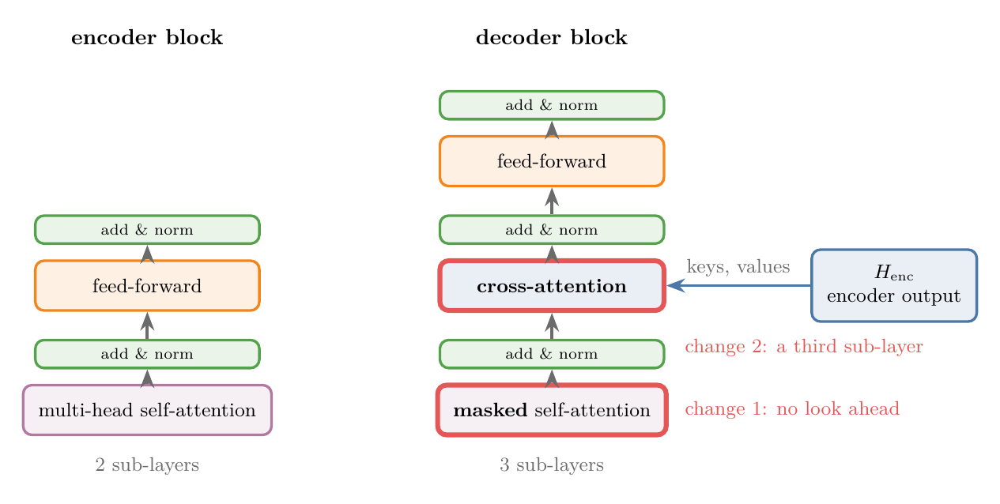
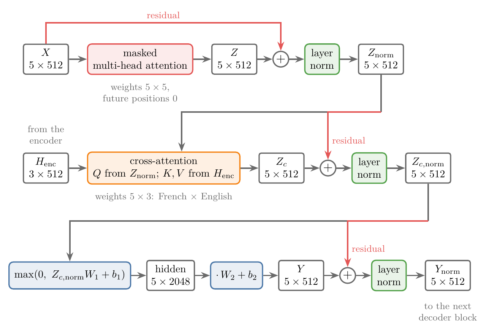
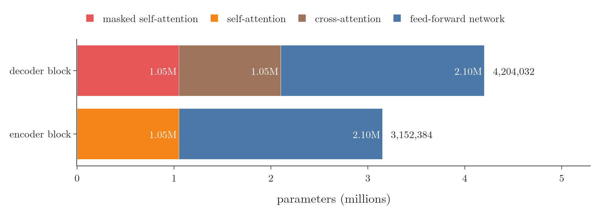
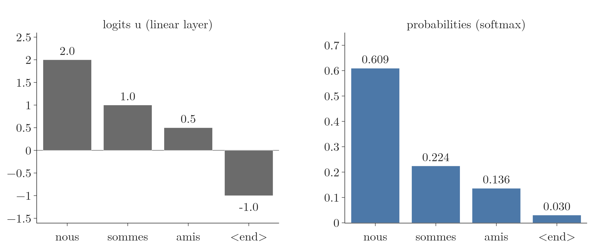
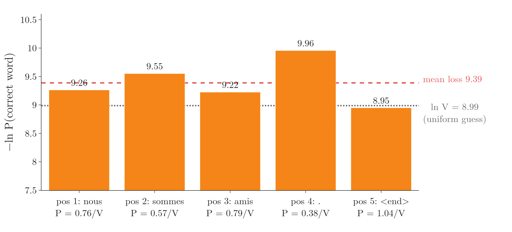

<!-- where-this-fits: generated by course_map/build_map.py; edit concepts.yaml, not this block -->
> **Where this fits:** Pipeline map step 8 (Model). See the [Course map](../../../00-course-map/00-course-map.md).
>
> 
>
> - **Builds on:** [Sequence-to-sequence (encoder-decoder)](../../../DL/05-rnn/DL-058-types-of-rnn/DL-058-types-of-rnn.md#5-many-to-many); [Transformer encoder](../../../DL/06-transformers/DL-081-transformer-encoder/DL-081-transformer-encoder.md#1-overview); [Masked self-attention](../../../DL/06-transformers/DL-082-masked-self-attention/DL-082-masked-self-attention.md#1-overview); [Cross-attention](../../../DL/06-transformers/DL-083-cross-attention/DL-083-cross-attention.md#7-what-a-trained-models-cross-attention-looks-like); [Learning-rate warm-up schedule](../../../DL/06-transformers/DL-086-transformer-end-to-end/DL-086-transformer-end-to-end.md#1-overview); [Label smoothing](../../../DL/06-transformers/DL-086-transformer-end-to-end/DL-086-transformer-end-to-end.md#74-regularisation-residual-dropout-and-label-smoothing).
> - **Leads to:** [Transformer inference (autoregressive decoding, KV cache, beam search)](../../../DL/06-transformers/DL-085-transformer-inference/DL-085-transformer-inference.md#9-sources); [The transformer end to end (capstone)](../../../DL/06-transformers/DL-086-transformer-end-to-end/DL-086-transformer-end-to-end.md#1-overview); [Decoder-only GPT](../../../DL/06-transformers/DL-087-decoder-only-gpt/DL-087-decoder-only-gpt.md#1-overview).
> - **Compare with:** [LSTM (long short-term memory)](../../../DL/05-rnn/DL-063-lstm-next-word-prediction/DL-063-lstm-next-word-prediction.md#6-the-model-embedding-lstm-dense).
<!-- /where-this-fits -->

## 1. Overview

> **Key point:** The **decoder** (G-564) writes the output sentence. It reads the output words so far and the encoder's output, and gives a probability for every word of the vocabulary at every position.

Its input is the target sentence **shifted right**: a start token in front, so that each position holds the word before the one it must predict. After embedding and positional encoding, the input passes through 6 identical **decoder blocks** (G-563). Each block has three sub-layers: **masked self-attention** (G-1172) over the output words so far, **cross-attention** (G-507) to the encoder's output, and a feed-forward network, each followed by add and norm. A final **linear layer** with one node per word of the vocabulary, and a **softmax**, turn every position's vector into a probability for every word. During training all positions are computed in one pass.

The [transformer encoder](../DL-081-transformer-encoder/DL-081-transformer-encoder.md#5-inside-one-encoder-block) built the left half of the transformer of "Attention Is All You Need" (Vaswani et al. 2017). This Note builds the right half: the decoder. Two of its parts have their own Notes: [masked self-attention](../DL-082-masked-self-attention/DL-082-masked-self-attention.md#6-the-fix-mask-the-future) and [cross-attention](../DL-083-cross-attention/DL-083-cross-attention.md#5-processing-queries-from-one-side-keys-and-values-from-the-other). Here they are put together with the rest into the full decoder (Figure 1).

{height=70%}

The decoder behaves differently during training and during prediction. During training the whole correct output sentence is known, so all its positions are processed at once. During prediction the output is written one word at a time. This Note follows the **training** (G-1255) case; prediction is the subject of the [transformer inference](../DL-085-transformer-inference/DL-085-transformer-inference.md#3-training-and-inference-side-by-side).

We follow one real sentence pair from the English–French corpus of the Keras examples through the decoder: "we're friends ." and its translation "nous sommes amis .". Along the way we count shapes and parameters and check the counts against Keras.

## 2. Prerequisites

- [Transformer encoder](../DL-081-transformer-encoder/DL-081-transformer-encoder.md#5-inside-one-encoder-block): the encoder block, add and norm, the residual connection and the position-wise feed-forward network.
- [Masked self-attention](../DL-082-masked-self-attention/DL-082-masked-self-attention.md#6-the-fix-mask-the-future): self-attention in which a word cannot attend to the words after it.
- [Cross-attention](../DL-083-cross-attention/DL-083-cross-attention.md#5-processing-queries-from-one-side-keys-and-values-from-the-other): attention with queries from one sequence and keys and values from another.
- [Encoder–decoder](../DL-068-encoder-decoder/DL-068-encoder-decoder.md#5-training): `<start>` and `<end>` tokens, teacher forcing and the cross-entropy loss over the output steps.
- [Positional encoding](../DL-079-positional-encoding/DL-079-positional-encoding.md#6-the-formula-of-attention-is-all-you-need) and [layer normalisation](../DL-080-layer-normalization/DL-080-layer-normalization.md#6-layer-normalisation).

## 3. From a black box to the decoder block

> **Key point:** The decoder is 6 identical blocks in a row. Each block has three sub-layers: masked multi-head self-attention, cross-attention, and a feed-forward network, with add and norm after each.

The decoder is built up in the same steps as the encoder.

1. **Two boxes.** A transformer is an encoder and a decoder. The encoder reads the input sentence; the decoder writes the output sentence.
2. **Six blocks.** "The decoder is also composed of a stack of $N = 6$ identical layers" (Vaswani et al. 2017, §3.1). We call each layer a **decoder block**. As in the encoder, the 6 blocks share a design and each has its own weights.
3. **Three sub-layers per block.** "In addition to the two sub-layers in each encoder layer, the decoder inserts a third sub-layer, which performs multi-head attention over the output of the encoder stack" (Vaswani et al. 2017, §3.1). In order, a decoder block holds:
   - **masked multi-head self-attention**: the output words attend to each other, each only to itself and the words before it;
   - **cross-attention** (also called encoder–decoder attention): the output words attend to the input words;
   - a **feed-forward network** (G-775), the same design as in the encoder.
4. **Add and norm.** Each sub-layer is wrapped in a residual connection followed by layer normalisation, as in the encoder.

Compared with an encoder block, the decoder block changes two things: its self-attention is masked, and it has one extra sub-layer, the cross-attention, which is the only place where the decoder reads the input sentence.

{width=90%}

Figure 2 lines the two blocks up: everything that is not outlined in red is the same design as in the encoder.

## 4. The setup: one training pair

> **Key point:** Training data are sentence pairs. The encoder has already turned the English sentence into one vector per word, $H_{\text{enc}}$; the decoder starts from the French sentence.

The data is a **parallel corpus** (G-1442): each **observation** (G-1374) (one record of the data) is an English sentence and its French translation, the **target** (G-1949) (the output we want the model to produce). The Notebook uses the same filtered corpus as the [encoder–decoder](../DL-068-encoder-decoder/DL-068-encoder-decoder.md#4-the-architecture): 40,000 training pairs, and a French vocabulary of the 8,000 most frequent words plus 4 special tokens, $V = 8{,}004$ in all. The pair we follow appears in the file as "We're friends." and "Nous sommes amis.".

Before the decoder starts, the encoder processes "we're friends ." exactly as in the [transformer encoder](../DL-081-transformer-encoder/DL-081-transformer-encoder.md#5-inside-one-encoder-block): 3 tokens, 6 encoder blocks, and out comes $H_{\text{enc}}$, a $3 \times 512$ matrix with one contextual vector per English word. The decoder now takes the French sentence.

## 5. The input: shift, tokenise, embed, add positions

> **Key point:** Four steps prepare the French sentence. Shifting right puts `<start>` in front, so that position $i$ holds the word before the one to be predicted at position $i$. Then tokenisation, a 512-number embedding per token, and the positional encoding, as in the encoder. The result is $X$, a $5 \times 512$ matrix.

### 5.1 Shifting right

> **Key point:** The decoder's input is the target sentence moved one place to the right, with `<start>` in the gap. Its target is the same sentence with `<end>` at the back.

The paper's figure labels the decoder's input "Outputs (shifted right)". The **shift right** (G-1790) inserts the start token in front of the target sentence. Each position's correct answer is then the next word:

| Position | 1 | 2 | 3 | 4 | 5 |
|---|---|---|---|---|---|
| Decoder input | `<start>` | nous | sommes | amis | . |
| Target at that position | nous | sommes | amis | . | `<end>` |

{width=100%}

In Figure 3, follow the dashed arrows: the target of one position is the input of the next, so no position is ever given the word it must predict.

This offset is the transformer's form of **teacher forcing** (G-1955): during training the decoder is fed the correct previous words, not its own predictions (the [encoder–decoder](../DL-068-encoder-decoder/DL-068-encoder-decoder.md#5-training), where the same shift appears). The paper states why the offset matters: the masking of the self-attention, "combined with fact that the output embeddings are offset by one position, ensures that the predictions for position $i$ can depend only on the known outputs at positions less than $i$" (Vaswani et al. 2017, §3.1). Without the shift, position 1 would see "nous" and simply copy it.

### 5.2 Tokenise, embed, add positions

> **Key point:** Exactly the encoder's three input steps, applied to the shifted French sentence.

1. **Tokenisation.** Each word and the full stop become a token: 5 tokens, with the ids 2, 21, 85, 250 and 4 in the French vocabulary.
2. **Embedding.** Each token becomes a learned vector of $d_{\text{model}} = 512$ numbers (the [word embeddings section](../../05-rnn/DL-057-rnn-sentiment-analysis/DL-057-rnn-sentiment-analysis.md#6-word-embeddings)). The French words have their own embedding table, $V \times 512$.
3. **Positional encoding.** The encoding of positions 1 to 5 is added to the embeddings (the [positional encoding](../DL-079-positional-encoding/DL-079-positional-encoding.md#6-the-formula-of-attention-is-all-you-need)).

The result is the input matrix $X$, $5 \times 512$: rows $x_1, \dots, x_5$.

> **Extra:** The paper adds two details at this step (Vaswani et al. 2017, §3.4). The embedding vectors are multiplied by $\sqrt{d_{\text{model}}}$ before the positional encoding is added:
>
> $$\sqrt{512} \approx 22.6$$
>
> And one weight matrix is shared by three layers: the encoder's embedding, the decoder's embedding and the final linear layer of section 8. The paper's English–German data used one shared source–target vocabulary of about 37,000 tokens (§5.1). The Notebook applies the $\sqrt{d_{\text{model}}}$ factor; it keeps separate English and French vocabularies, so it does not share weights.

## 6. Inside one decoder block

> **Key point:** A block does three things in order, each followed by add and norm: the French positions look at each other (masked), they look at the English sentence, and a feed-forward network transforms each position on its own.

In symbols, the three steps are:

1. $X \to$ masked attention $\to$ add & norm $\to Z_{\text{norm}}$;
2. cross-attention with $H_{\text{enc}}$ $\to$ add & norm $\to Z_{c,\text{norm}}$;
3. feed-forward $\to$ add & norm $\to Y_{\text{norm}}$.

Every one of these matrices is $5 \times 512$.

Figure 4 shows the path of the five French positions through one block, with every shape.

{width=100%}

Figure 5 follows a single position through a decoder block of a model that has been trained. It is the last decoder block of the small English-to-French transformer of the [transformer inference](../DL-085-transformer-inference/DL-085-transformer-inference.md#3-training-and-inference-side-by-side), with the decoder input `<start> nous sommes` and the English sentence "we're friends .". Watch what the position "sommes" may read at each sub-layer: earlier French words in the masked self-attention, the English words in the cross-attention (0.85 of its weight on "friends"), and nothing but itself in the feed-forward network. The output layer then predicts "amies" with probability 0.987. "Amies" is the feminine form of "amis", also a correct translation of "friends"; the training target here is "amis", which gets 0.011.

{height=55%}

### 6.1 Masked multi-head self-attention

> **Key point:** Multi-head attention among the French positions, with every weight on a later position set to exactly 0.

The first sub-layer is multi-head self-attention over $X$, with one change: a position may not look at the positions after it (the [masked self-attention](../DL-082-masked-self-attention/DL-082-masked-self-attention.md#6-the-fix-mask-the-future)). For each row $x_i$ it returns a contextual vector $z_i$:

- $z_1$ (for `<start>`) uses only `<start>`;
- $z_2$ (for "nous") uses `<start>` and "nous";
- $z_3$ uses the first three positions, and so on, up to $z_5$, which uses all five.

The output $Z$ is $5 \times 512$, and the attention weights form a $5 \times 5$ table per head. In the Notebook's untrained block, the weights averaged over the 8 heads are

| Query \\ key | `<start>` | nous | sommes | amis | . |
|---|---|---|---|---|---|
| `<start>` | 1 | 0 | 0 | 0 | 0 |
| nous | 0.485 | 0.515 | 0 | 0 | 0 |
| sommes | 0.360 | 0.288 | 0.352 | 0 | 0 |
| amis | 0.258 | 0.239 | 0.259 | 0.243 | 0 |
| . | 0.225 | 0.170 | 0.168 | 0.158 | 0.280 |

Every entry above the diagonal is exactly 0, in all 8 heads. The sizes of the other weights mean nothing yet, since the block is untrained.

### 6.2 Add and norm

> **Key point:** $Z_{\text{norm}} = \text{LayerNorm}(X + Z)$, as in the encoder.

The input $X$ also takes the residual path around the attention and is added to its output, then each row is normalised:

$$Z' = X + Z$$

$$Z_{\text{norm}} = \text{LayerNorm}(Z')$$

Both steps are exactly those of the [transformer encoder](../DL-081-transformer-encoder/DL-081-transformer-encoder.md#5-inside-one-encoder-block). $Z_{\text{norm}}$ is $5 \times 512$.

### 6.3 Cross-attention

> **Key point:** The queries come from the decoder ($Z_{\text{norm}}$); the keys and values come from the encoder's output $H_{\text{enc}}$. Each French position gets a weighted sum of the English words' value vectors.

The second sub-layer is where the two languages meet (the [cross-attention](../DL-083-cross-attention/DL-083-cross-attention.md#5-processing-queries-from-one-side-keys-and-values-from-the-other)). It is a multi-head attention with two inputs:

- **queries** from the decoder: $Q = Z_{\text{norm}}W_Q$, one per French position (5);
- **keys and values** from the encoder: $K = H_{\text{enc}}W_K$ and $V = H_{\text{enc}}W_V$, one per English word (3).

In the paper's words, "the queries come from the previous decoder layer, and the memory keys and values come from the output of the encoder" (Vaswani et al. 2017, §3.2.3). The weights form a $5 \times 3$ table per head, French positions by English words, and no mask is needed: the whole English sentence is known. The output $Z_c$ has one 512-number row per French position. In the untrained block of the Notebook every row of the averaged weights is close to $\tfrac13, \tfrac13, \tfrac13$; training is what makes "amis" look at "friends".

### 6.4 Add and norm

> **Key point:** $Z_{c,\text{norm}} = \text{LayerNorm}(Z_{\text{norm}} + Z_c)$.

The input of the cross-attention, $Z_{\text{norm}}$, is added back to its output, and the sum is normalised. Look at which matrix takes the residual path: the decoder's own $Z_{\text{norm}}$, not the encoder's $H_{\text{enc}}$. The shapes match, $5 \times 512$ plus $5 \times 512$; $H_{\text{enc}}$ ($3 \times 512$) could not be added.

### 6.5 Feed-forward network, add and norm

> **Key point:** The encoder's position-wise network, 512 → 2048 (ReLU) → 512, applied to each French position, then a third add and norm.

The third sub-layer is the same position-wise feed-forward network as in the encoder (the [transformer encoder](../DL-081-transformer-encoder/DL-081-transformer-encoder.md#5-inside-one-encoder-block)), with its own weights. The 5 rows of $Z_{c,\text{norm}}$ go in together:

| Step | Operation | Shape |
|---|---|---|
| hidden layer | $\max(0,\ Z_{c,\text{norm}}W_1 + b_1)$, $W_1$: $512 \times 2048$ | $5 \times 2048$ |
| output layer | $\text{hidden}\cdot W_2 + b_2$, $W_2$: $2048 \times 512$ | $5 \times 512$ |
| add and norm | $Y_{\text{norm}} = \text{LayerNorm}(Z_{c,\text{norm}} + Y)$ | $5 \times 512$ |

$Y_{\text{norm}}$ is the output of the block. The Notebook prints these shapes for the first of its 6 blocks: $(5, 512)$ everywhere, $(5, 2048)$ for the hidden layer, $(8, 5, 5)$ for the masked weights and $(8, 5, 3)$ for the cross-attention weights of the 8 heads.

> **Python:** One decoder block as a Keras layer (post-norm, as in the paper). `use_causal_mask=True` applies the mask of section 6.1.
>
> ```python
> class DecoderBlock(keras.layers.Layer):
>     def __init__(self, d_model, heads, d_ff):
>         super().__init__()
>         k = d_model // heads
>         self.self_mha = keras.layers.MultiHeadAttention(num_heads=heads, key_dim=k)
>         self.norm1 = keras.layers.LayerNormalization()
>         self.cross_mha = keras.layers.MultiHeadAttention(num_heads=heads, key_dim=k)
>         self.norm2 = keras.layers.LayerNormalization()
>         self.ffn1 = keras.layers.Dense(d_ff, activation="relu")
>         self.ffn2 = keras.layers.Dense(d_model)
>         self.norm3 = keras.layers.LayerNormalization()
>
>     def call(self, x, enc):
>         z = self.self_mha(x, x, use_causal_mask=True)       # masked self-attention
>         z_norm = self.norm1(x + z)
>         zc = self.cross_mha(z_norm, enc)                    # queries: decoder; keys, values: encoder
>         zc_norm = self.norm2(z_norm + zc)
>         y = self.ffn2(self.ffn1(zc_norm))                   # feed-forward network
>         return self.norm3(zc_norm + y)
> ```

## 7. Six blocks: shapes and parameters

> **Key point:** The shape stays $5 \times 512$ through all 6 blocks, and every block reads the same encoder output. One decoder block has 4,204,032 parameters, a third more than an encoder block because of the cross-attention; the 6 blocks have 25,224,192.

**Shapes.** The output of block 1 is the input $X$ of block 2, which runs the same steps with its own weights, and so on up to block 6. Every block's cross-attention receives the same $H_{\text{enc}}$, the output of the last encoder block (Vaswani et al. 2017, §3.1, "the output of the encoder stack"). The final output of the decoder is again $5 \times 512$: one vector per French position. We call its rows $y_1, \dots, y_5$.

**Parameters.** With $d = 512$ and $d_{\text{ff}} = 2048$:

| Part | Formula | Parameters |
|---|---|---|
| Masked multi-head attention | $4d^2 + 4d$ (the [multi-head attention](../DL-078-multi-head-attention/DL-078-multi-head-attention.md#6-multi-head-attention-in-the-transformer)) | 1,050,624 |
| Cross-attention | $4d^2 + 4d$ | 1,050,624 |
| Feed-forward network | $d \cdot d_{\text{ff}} + d_{\text{ff}} + d_{\text{ff}} \cdot d + d$ | 2,099,712 |
| Three layer normalisations | $3 \times 2d$ | 3,072 |
| **One decoder block** | | **4,204,032** |
| **6 decoder blocks** | | **25,224,192** |

Keras' `count_params()` gives exactly these numbers (Notebook). The cross-attention has the same parameter count as the self-attention: the encoder's vectors have the same 512 numbers as the decoder's, so $W_K$ and $W_V$ have the same shapes as before.

{width=95%}

**The whole base model.** Adding the encoder's 6 blocks (18,914,304, from the [transformer encoder](../DL-081-transformer-encoder/DL-081-transformer-encoder.md#5-inside-one-encoder-block)) and one shared $37{,}000 \times 512$ embedding matrix (section 5.2, Extra):

| Part | Parameters |
|---|---|
| 6 encoder blocks | 18,914,304 |
| 6 decoder blocks | 25,224,192 |
| Shared embedding, about $37{,}000 \times 512$ | 18,944,000 |
| **Total** | **about 63 million** |

The paper lists 65 million parameters for its base model (Vaswani et al. 2017, Table 3). The 2 million gap sits in the embedding: the paper gives its vocabulary only as "about 37000 tokens" (§5.1), so the exact size of its embedding table is not known.

## 8. The output layer: linear and softmax

> **Key point:** A dense layer with $V$ nodes, one per word of the target vocabulary, turns each 512-number vector into $V$ scores; the softmax turns the scores into probabilities that sum to 1.

After the sixth block, each French position has a 512-number vector, and we need a word. The output layer has two parts (the "Linear" and "Softmax" boxes at the top of Figure 1):

1. **Linear.** A dense layer with no activation, 512 inputs and $V$ nodes, one node per word of the French vocabulary. Its weights $W_3$ are $512 \times V$ plus $V$ biases. Its outputs, one unnormalised score per word, are called **logits** (G-1122).
2. **Softmax.** The **softmax function** (G-1830) turns the $V$ logits of each position into $V$ probabilities that sum to 1 (the [loss functions](../../01-basics/DL-014-dl-loss-functions/DL-014-dl-loss-functions.md#91-the-setup)).

The **vocabulary** (G-2092) is the list of all distinct words of the French side of the data. A larger vocabulary means more nodes: with the Notebook's $V = 8{,}004$, the layer has this many parameters:

$$512 \times 8{,}004 = 4{,}098{,}048$$

$$4{,}098{,}048 + 8{,}004 = 4{,}106{,}052$$

That is about as many as one decoder block.

1. **In words:** multiply each position's vector by $W_3$ and add the bias to get one score per word, then exponentiate each score and divide by the sum of the exponentials.
2. **Formula:** for the vector $y_i$ of position $i$,
   $$u_i = y_i W_3 + b_3 \quad (1 \times V)$$

   $$P(\text{word } k \text{ at position } i) = \frac{e^{u_{i,k}}}{\sum_{j=1}^{V} e^{u_{i,j}}}$$
3. **Example:** a toy vocabulary of 4 words, nous, sommes, amis, `<end>`, with logits $2.0, 1.0, 0.5, -1.0$ at position 1:
   $$e^{2.0} = 7.39$$

   $$e^{1.0} = 2.72$$

   $$e^{0.5} = 1.65$$

   $$e^{-1.0} = 0.37$$

   $$\text{sum} = 12.13$$

   Divide each by the sum:

   $$P(\text{nous}) = 7.39/12.13 = 0.609$$

   $$P(\text{sommes}) = 2.72/12.13 = 0.224$$

   $$P(\text{amis}) = 1.65/12.13 = 0.136$$

   $$P(\text{end}) = 0.37/12.13 = 0.030$$

   "nous" has the highest probability, which is correct for position 1.

{width=95%}

Figure 7 shows the softmax at work: the logit gap of 1 between "nous" and "sommes" becomes a probability ratio of $e^1 = 2.7$.

This layer is looked at more closely in [unembedding and sampling](../DL-088-unembedding-and-sampling/DL-088-unembedding-and-sampling.md#3-the-unembedding-one-dot-product-per-token): each logit is a dot product between the position's vector and one word's vector, and a word is then chosen from the probabilities.

All 5 positions go through the same layer together: $5 \times 512$ times $512 \times V$ gives a $5 \times V$ table of probabilities, one row per position. In the Notebook every row sums to 1.

## 9. Training: every position in one pass

> **Key point:** One forward pass produces a probability row for every position at once. The loss is the cross-entropy between each row and the target word of that position, averaged over the positions. No word is chosen during training.

Because the whole target sentence is known and shifted right, and the mask stops each position from seeing later ones, all 5 predictions can be made in the same pass (the [masked self-attention](../DL-082-masked-self-attention/DL-082-masked-self-attention.md#6-the-fix-mask-the-future)). The decoder is **non-autoregressive** (G-1331) during training: it does not wait for its own outputs.

The five rows are then compared with the five targets of section 5.1. As in the [encoder–decoder](../DL-068-encoder-decoder/DL-068-encoder-decoder.md#5-training), each position is a classification over the vocabulary, and the loss is the **categorical cross-entropy** (the [loss functions](../../01-basics/DL-014-dl-loss-functions/DL-014-dl-loss-functions.md#9-categorical-cross-entropy)), minus the log of the probability given to the correct word (SLP3 eq. 13.13):

$$L = -\frac{1}{5}\sum_{i=1}^{5} \ln P(t_i \text{ at position } i)$$

where $t_i$ is the target word of position $i$. A small case with 3 positions whose correct words get the probabilities $0.5$, $0.25$ and $0.8$:

$$-\ln 0.5 = 0.693$$

$$-\ln 0.25 = 1.386$$

$$-\ln 0.8 = 0.223$$

$$0.693 + 1.386 + 0.223 = 2.302$$

$$L = 2.302 / 3 = 0.767$$

Before training, the model has no preference: each correct word gets about $1/V$ of the probability. In the Notebook the 5 target words get $0.76/V$, $0.57/V$, $0.79/V$, $0.38/V$ and $1.04/V$, and the loss is 9.39, close to $\ln V = \ln 8{,}004 = 8.99$. Keras' `SparseCategoricalCrossentropy` gives the same 9.39. Backpropagation then updates every weight of the decoder, the cross-attention's $W_K$ and $W_V$, and through them the whole encoder, as one network.

{width=95%}

In Figure 8, every bar sits near the dotted line $\ln V$: before training, the model spreads its probability almost evenly over the vocabulary. Training lowers these bars.

The untrained decoder's most likely word is "mit" at all 5 positions. Picking the most likely word is not part of training: the loss uses the probability of the correct word, whatever word ranks first. Choosing words happens only during prediction, where the decoder works **autoregressively**, one word per step, each new word becoming part of the next input (the [transformer inference](../DL-085-transformer-inference/DL-085-transformer-inference.md#3-training-and-inference-side-by-side)).

## 10. Summary

| Step | Operation | Shape (3 English, 5 French tokens) |
|---|---|---|
| Encoder | 6 encoder blocks | $H_{\text{enc}}$: $3 \times 512$ |
| Input | shift right, tokens → embeddings + positional encodings | $X$: $5 \times 512$ |
| Sub-layer 1 | masked multi-head self-attention, then add & norm | $Z_{\text{norm}}$: $5 \times 512$ (weights $5 \times 5$) |
| Sub-layer 2 | cross-attention to $H_{\text{enc}}$, then add & norm | $Z_{c,\text{norm}}$: $5 \times 512$ (weights $5 \times 3$) |
| Sub-layer 3 | feed-forward network, then add & norm | $5 \times 2048$ inside, $Y_{\text{norm}}$: $5 \times 512$ |
| Repeat | 6 blocks, own weights, same $H_{\text{enc}}$ | $5 \times 512$ |
| Output | linear ($512 \to V$) and softmax | $5 \times V$ probabilities |

- The decoder's input is the target sentence shifted right: `<start>` in front, so position $i$ predicts word $i$ from the words before it; without the shift, position 1 would see "nous" and simply copy it.
- A decoder block is an encoder block with a masked self-attention and an extra cross-attention sub-layer, because the decoder must not see later French words and must read the English sentence; it has 4,204,032 parameters against 3,152,384, the extra third being the cross-attention.
- Cross-attention takes its queries from the decoder and its keys and values from the encoder's final output, in every block, so it is the only place where the decoder reads the input sentence.
- The output layer has one node per vocabulary word; the softmax gives a probability for every word at every position, so a larger vocabulary makes this layer larger (4,106,052 parameters for 8,004 words, about one decoder block).
- During training all positions are computed in one pass and the loss is the average cross-entropy, because the shifted target and the mask make every input known in advance; during prediction the decoder writes one word at a time, because each new word is the next input.
- So the decoder writes the output sentence by combining the French words so far with the encoder's English vectors, and turns each position into a probability for every word.

## 11. Sources

**Built from**

- CampusX, "Transformer Decoder Architecture | Deep Learning | CampusX", YouTube, https://www.youtube.com/watch?v=DI2_hrAulYo

**Other references**

- Vaswani, A. et al. (2017). Attention Is All You Need. *NeurIPS 2017*. arXiv:1706.03762. §3.1 (decoder: $N = 6$, the third sub-layer, the masking and the offset by one position); §3.2.3 (encoder–decoder attention: queries from the decoder, keys and values from the encoder); §3.4 (shared embedding and pre-softmax weights, the factor $\sqrt{d_{\text{model}}}$); §5.1 (shared vocabulary of about 37,000 tokens); Figure 1 ("Outputs (shifted right)"); Table 3 (base model, 65 million parameters; rows (C), totals for N = 2, 4 and 8).
- Jurafsky, D. and Martin, J. H. *Speech and Language Processing*, 3rd ed. draft (19 August 2026), ch. 13, §13.3 (the encoder–decoder transformer, cross-attention, eq. 13.11–13.13, teacher forcing).

## 12. Key terms

| Term | Meaning |
|---|---|
| Decoder | The part of the transformer that writes the output sentence, using the encoder's output |
| Decoder block | One layer of the decoder: masked self-attention, cross-attention and a feed-forward network, each followed by add and norm; the decoder stacks 6 |
| Observation | One record of the data; here, one English sentence and its French translation |
| Target | The output we want the model to produce; here, the French sentence |
| Shift right | Putting `<start>` in front of the target sentence to form the decoder's input, so each position predicts the next word |
| Teacher forcing | Feeding the decoder the correct previous words during training instead of its own predictions |
| Masked self-attention | Self-attention in which each position attends only to itself and earlier positions |
| Cross-attention | Attention with queries from the decoder and keys and values from the encoder's output; also called encoder–decoder attention |
| $H_{\text{enc}}$ | The output of the last encoder block: one vector per input word, read by every decoder block |
| Vocabulary ($V$) | The list of distinct words (tokens) of the target language; the output layer has one node per word |
| Logit | The unnormalised score the linear layer gives a word, before the softmax |
| Non-autoregressive | Producing all output positions at once, as the decoder does during training |
| Autoregressive (G-233) | Producing one output at a time, each fed back as input for the next, as the decoder does during prediction |
