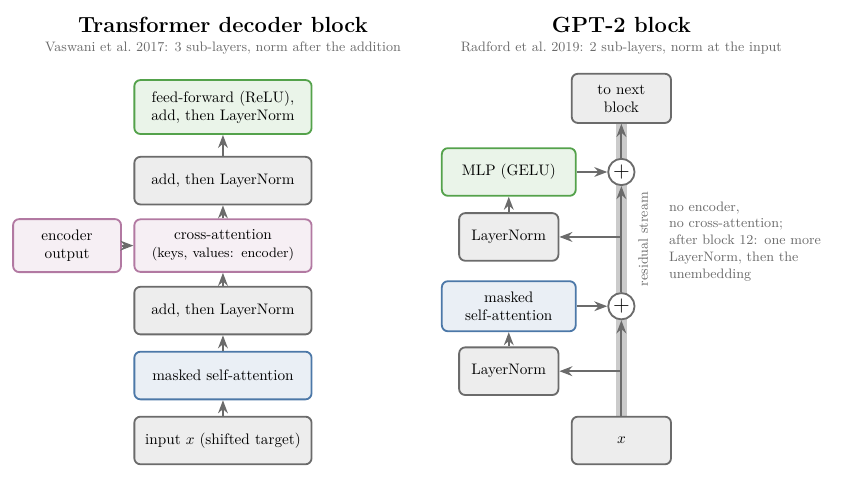
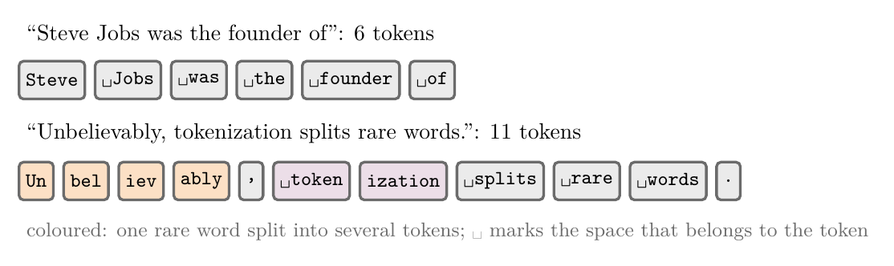
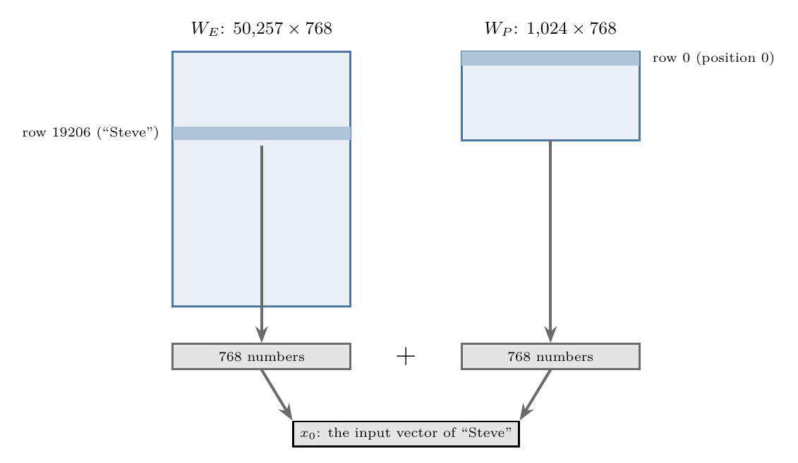
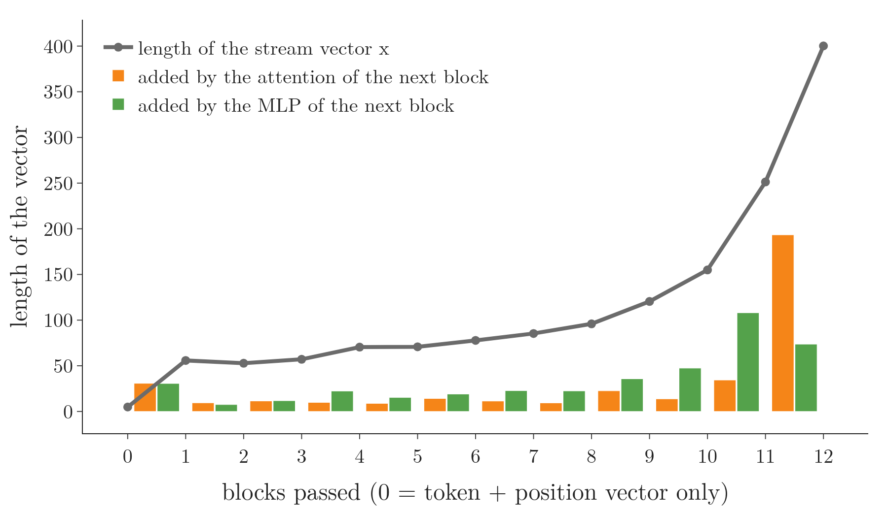
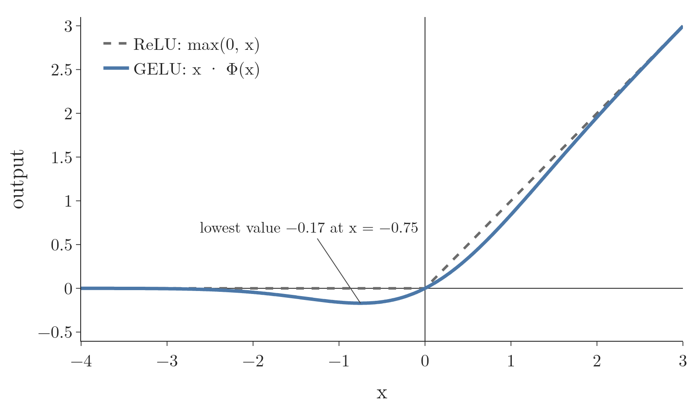
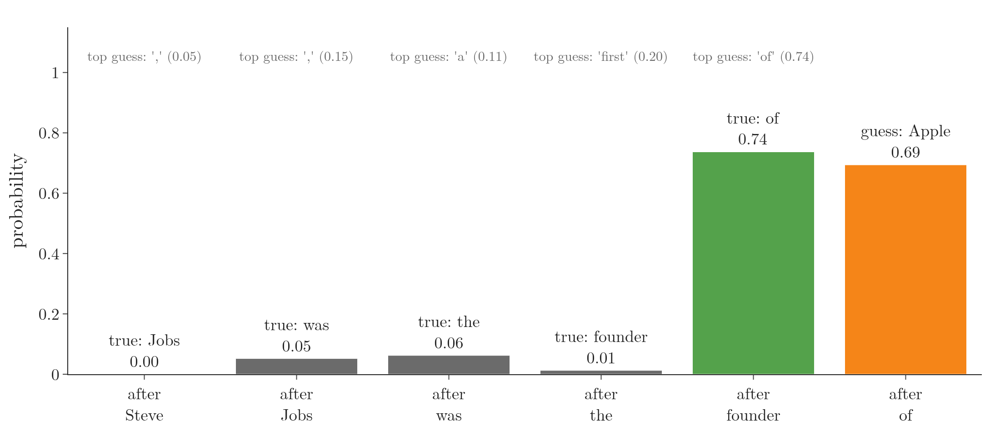
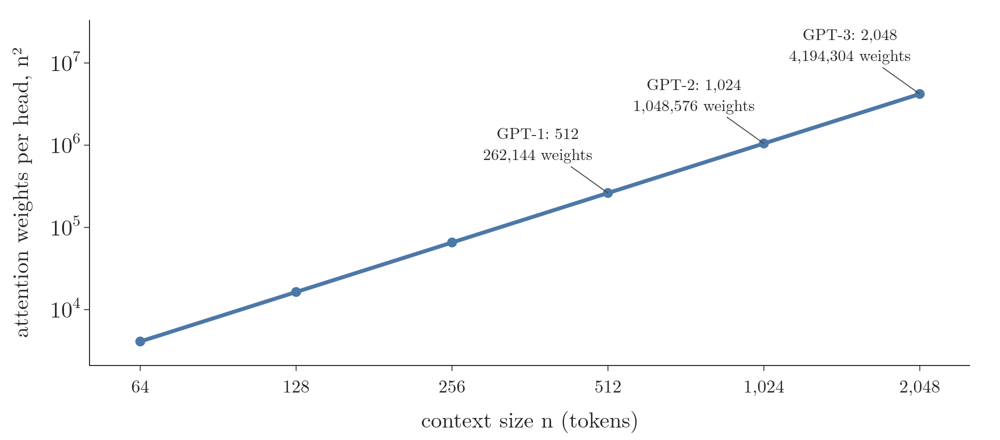
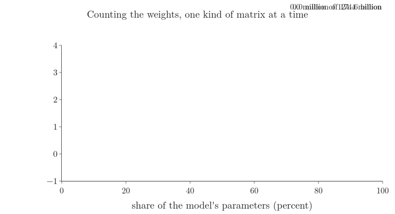

<!-- where-this-fits: generated by course_map/build_map.py; edit concepts.yaml, not this block -->
> **Where this fits:** Pipeline map step 8 (Model). See the [Course map](../../../00-course-map/00-course-map.md).
>
> 
>
> - **Builds on:** Activation functions ([Note DL-027](../../../DL/02-training/DL-027-activation-functions/DL-027-activation-functions.md)); Transformer ([Note DL-071](../../../DL/06-transformers/DL-071-introduction-to-transformers/DL-071-introduction-to-transformers.md)); Masked self-attention ([Note DL-082](../../../DL/06-transformers/DL-082-masked-self-attention/DL-082-masked-self-attention.md)); Transformer decoder ([Note DL-084](../../../DL/06-transformers/DL-084-transformer-decoder/DL-084-transformer-decoder.md)); Unembedding, logits, temperature and sampling ([Note DL-088](../../../DL/06-transformers/DL-088-unembedding-and-sampling/DL-088-unembedding-and-sampling.md)).
> - **Leads to:** MLP blocks as fact storage ([Note DL-089](../../../DL/06-transformers/DL-089-mlp-stores-facts/DL-089-mlp-stores-facts.md)).
<!-- /where-this-fits -->

## 1. Overview

> **Key point:** **GPT** (G-855) is a transformer with the encoder removed. What is left is a stack of identical blocks, each with two parts: masked self-attention, then an MLP. Each part adds its result to the token's vector. One pass reads a text and gives a guess for the next token at **every** position. Training improves all these guesses at once. Generation keeps only the last guess, appends it, and runs the pass again. We load the released GPT-2 small (124,439,808 parameters) and run it in plain NumPy to check every claim.

The [transformer decoder Note](../DL-084-transformer-decoder/DL-084-transformer-decoder.md) built the decoder of the translation transformer. It has three sub-layers: masked self-attention, cross-attention to the encoder, and a feed-forward network. GPT keeps the decoder and drops the encoder. With no encoder there is nothing to cross-attend to, so the cross-attention goes too. Radford et al. (2018, §4.1) describe their model, a **decoder-only transformer** (G-565), as a "12-layer decoder-only transformer with masked self-attention heads".

Figure 1 follows one real pass of GPT-2 small on "Steve Jobs was the founder of". Watch three things:

1. Each token takes its column from the embedding matrix.
2. In attention, arrows only point **right**: a token reads only the tokens before it.
3. At the top, a guess appears above **every** token, not just the last one. The last guess, " Apple", is the one used for generation.

The order of this Note follows the data through the model: tokens (section 4), vectors (section 5), the blocks (section 6), the guesses at every position (section 7), how much text fits (section 8), and finally where the parameters sit (section 9).

## 2. Prerequisites

- [Transformer decoder Note](../DL-084-transformer-decoder/DL-084-transformer-decoder.md): the decoder block, the output layer (linear and softmax), training on every position in one pass.
- [Masked self-attention Note](../DL-082-masked-self-attention/DL-082-masked-self-attention.md): the causal mask; why one pass equals many steps.
- [Transformer inference Note](../DL-085-transformer-inference/DL-085-transformer-inference.md): generation one token at a time.
- [Transformer encoder Note](../DL-081-transformer-encoder/DL-081-transformer-encoder.md): residual connections and the feed-forward network.
- [Layer normalisation Note](../DL-080-layer-normalization/DL-080-layer-normalization.md): LayerNorm, and the prenorm and postnorm placements.
- [Positional encoding Note](../DL-079-positional-encoding/DL-079-positional-encoding.md): why the model needs positions.
- [Multi-head attention Note](../DL-078-multi-head-attention/DL-078-multi-head-attention.md): heads, $W_Q$, $W_K$, $W_V$, $W_O$, and the $4d^2 + 4d$ count.
- [History of LLMs Note](../DL-067-history-of-llms/DL-067-history-of-llms.md): where GPT, GPT-2 and GPT-3 come from.

## 3. From the transformer decoder to GPT

> **Key point:** GPT keeps the decoder's masked self-attention and feed-forward network and removes the cross-attention, because there is no encoder to attend to. Each GPT block has two sub-layers instead of three.

The translation transformer needs two inputs: the source sentence (read by the encoder) and the target written so far (read by the decoder). A language model has only one input: the text so far. It predicts the next token of that same text. So one stack is enough. Radford et al. (2018, §3.1) train it to maximise the likelihood of each token given the $k$ tokens before it:

$$L_1(U) = \sum_i \log P(u_i \mid u_{i-k}, \dots, u_{i-1})$$

Here $u_i$ is the $i$-th token of the text, $k$ is how many earlier tokens the model sees, the bar $\mid$ reads "given", and $\sum_i$ adds over every position. For one position, say the model gives the token "sat" the probability 0.25 after seeing "the cat":

$$\log P(\text{sat} \mid \text{the cat}) = \log 0.25 = -1.39$$

Training raises this sum, so the probabilities of the true next tokens rise.

{width=100%}

| | Transformer decoder (Vaswani et al. 2017) | GPT-2 block (Radford et al. 2019) |
|---|---|---|
| Sub-layers | masked self-attention, cross-attention, feed-forward | masked self-attention, MLP (feed-forward) |
| Encoder | yes | none |
| Where LayerNorm sits | after each addition (postnorm) | at the input of each sub-layer (prenorm), plus one after the last block |
| Activation in the feed-forward network | ReLU | GELU |
| Positions | fixed sine–cosine vectors | a learned table |
| Output layer | its own matrix (tied to the embeddings in the paper, §3.4) | the token embedding matrix itself (tied) |

Figure 2 shows the two blocks side by side. The rest of this Note goes through the right-hand column, row by row, on the real GPT-2 small. The two names "MLP" and "feed-forward network" mean the same block; GPT-2's weights call it `mlp`.

## 4. Tokens

> **Key point:** GPT-2 reads text as **tokens** (G-1981), pieces of words from a fixed list of 50,257. Common words are one token; rare words are split into pieces.

A tokenizer cuts the text into pieces from a fixed vocabulary. GPT-2's vocabulary has 50,257 tokens (Radford et al. 2019, §2.3). It is built with **byte pair encoding** (G-335), which starts from single bytes and merges the most frequent pairs (Radford et al. 2019, §2.2). The Notebook runs GPT-2's own tokenizer:

| Text | Tokens |
|---|---|
| Steve Jobs was the founder of | `Steve`, ` Jobs`, ` was`, ` the`, ` founder`, ` of` (6 tokens) |
| Unbelievably, tokenization splits rare words. | `Un`, `bel`, `iev`, `ably`, `,`, ` token`, `ization`, ` splits`, ` rare`, ` words`, `.` (11 tokens) |

The space before a word belongs to the token: " Jobs" with a space and "Jobs" without one are different tokens (Figure 3). In the other figures we draw the word without its space.

{width=100%}

## 5. From tokens to vectors: token and position embeddings

> **Key point:** Each token's vector is its row of the **token embedding matrix** (G-1980) $W_E$ (50,257 × 768) plus the row of the **position embedding matrix** (G-1526) $W_P$ (1,024 × 768) for its place in the text. Both matrices are learned.

The first step is a lookup, as in the [what is self-attention Note](../DL-073-what-is-self-attention/DL-073-what-is-self-attention.md). Token number 19206, "Steve", takes row 19206 of $W_E$: 768 numbers. Then the vector for position 0 is added from $W_P$. For the token $t_i$ at position $i$:

$$x_i = W_E[t_i] + W_P[i]$$

{width=70%}

Figure 4 shows the lookup and the addition for the first token.

GPT uses **learned** positions: "We used learned position embeddings instead of the sinusoidal version proposed in the original work" (Radford et al. 2018, §4.1). $W_P$ is just another weight matrix, trained with the rest. The [positional encoding Note](../DL-079-positional-encoding/DL-079-positional-encoding.md) explains why positions are needed at all: attention by itself ignores word order.

## 6. Inside a GPT-2 block

> **Key point:** A block reads the token vector through a LayerNorm, computes a change, and **adds** the change back: $x \leftarrow x + \text{Attn}(\mathrm{LN_1}(x))$, then $x \leftarrow x + \text{MLP}(\mathrm{LN_2}(x))$. The vector that flows from block to block, never replaced, only added to, is called the **residual stream** (G-1683).

### 6.1 Prenorm: LayerNorm at the input

> **Key point:** GPT-2 moved each LayerNorm from after the addition to the input of the sub-layer, and added one more LayerNorm after the last block.

The paper states the change in one sentence: "Layer normalization (Ba et al., 2016) was moved to the input of each sub-block, similar to a pre-activation residual network (He et al., 2016) and an additional layer normalization was added after the final self-attention block" (Radford et al. 2019, §2.3). The released weights match: every block has `ln_1` (before attention) and `ln_2` (before the MLP), and there is one `ln_f` after block 12. The [layer normalisation Note](../DL-080-layer-normalization/DL-080-layer-normalization.md) calls this placement **prenorm**.

1. **In words:** normalise a copy of the vector, let the sub-layer compute a change from the copy, and add the change to the original.
2. **Formula:** for each block,
   $$x \leftarrow x + \text{Attn}\big(\mathrm{LN_1}(x)\big), \qquad x \leftarrow x + \text{MLP}\big(\mathrm{LN_2}(x)\big)$$
   After block 12: $h = \mathrm{LN_f}(x)$.
3. **Example:** the Notebook normalises the stream vector of " of" before block 6 and gets mean 0.000 and standard deviation 1.000, whatever the stream's own size.

### 6.2 The residual stream grows, and the final LayerNorm brings it back

> **Key point:** In GPT-2 small the stream vector of " of" grows from length 4.9 to 400 over the 12 blocks, because each block adds and nothing rescales. The final LayerNorm brings it back to a fixed scale; without it, the prediction is lost.

In the prenorm formula only the copies are normalised; the stream $x$ itself is never rescaled. Each block adds two vectors to it, so nothing stops its length from growing. Figure 5 measures this for the last token, " of":

{width=90%}

- The token-plus-position vector has length 4.9. Block 1 adds two vectors of length about 31 each, and the stream jumps to 56.
- From block 2 to block 10 each addition is short compared with the stream (lengths 8 to 48 against 53 to 155). The direction changes little: the cosine between the stream before and after a block is 0.94 to 0.97.
- Blocks 11 and 12 add the largest vectors (108 from the MLP of block 11, 193 from the attention of block 12). After block 12 the length is 400.

The last LayerNorm matters. With it, the top five next tokens after "Steve Jobs was the founder of" are " Apple", " Microsoft", " the", " IBM", " Intel". Unembedding the raw stream instead, without `ln_f`, gives " the", " a", ",", " and", ' "': the answer disappears (Notebook).

> **Extra:** Sanderson (2024, Ch 6) pictures attention as computing a change $\Delta e$ that is **added** to a token's vector, nudging it towards a more specific meaning. In a prenorm model this picture is exact: the stream after a sub-layer is the stream before plus the sub-layer's output, as the formula of section 6.1 says.

### 6.3 Masked self-attention and the MLP

> **Key point:** The attention sub-layer is the masked multi-head attention of the earlier Notes: 12 heads of 64 in GPT-2 small. The MLP maps each token's 768 numbers to 3,072 and back, the same for every token.

Both parts were built in earlier Notes, so here is only what GPT-2 small uses:

- **Masked multi-head self-attention:** 12 heads, each with queries, keys and values of 64 numbers, $12 \times 64 = 768$ (the [multi-head attention Note](../DL-078-multi-head-attention/DL-078-multi-head-attention.md)). The mask stops each token from reading later tokens (the [masked self-attention Note](../DL-082-masked-self-attention/DL-082-masked-self-attention.md)). In the Notebook, every attention weight above the diagonal, a future key, is exactly 0.
- **MLP:** $768 \to 3{,}072 \to 768$, applied to each token alone (the [transformer encoder Note](../DL-081-transformer-encoder/DL-081-transformer-encoder.md), §5.3). GPT-1 already used "3072 dimensional inner states" (Radford et al. 2018, §4.1): four times the width. The [MLP Note](../DL-089-mlp-stores-facts/DL-089-mlp-stores-facts.md) reads what the rows and columns of these two matrices do.

### 6.4 GELU

> **Key point:** GPT replaces the ReLU of the MLP with **GELU** (G-834), $x\thinspace\Phi(x)$, a smooth curve that lets small negative values through.

Radford et al. (2018, §4.1): "For the activation function, we used the Gaussian Error Linear Unit (GELU)". Hendrycks and Gimpel (2016, §2) define it as the input times the probability that a standard normal value is smaller than it:

$$\text{GELU}(x) = x\thinspace\Phi(x)$$

where $\Phi$ is the standard normal cumulative distribution function. They also give a faster approximation, $0.5x\big(1 + \tanh[\sqrt{2/\pi}\thinspace(x + 0.044715x^3)]\big)$, which is what GPT-2 uses (its configuration names it `gelu_new`). On $[-6, 6]$ the two differ by at most 0.0005 (Notebook).

{width=80%}

Figure 6 shows the difference. ReLU cuts every negative input to exactly 0 with a sharp corner. GELU passes small negative values as small negative outputs, down to −0.17 at $x = -0.75$, and its curve has no corner. In GPT-2, negative inputs are the common case: on the example prompt, 83.4 percent of the MLP's 3,072 hidden values are negative before GELU, and their outputs all lie between −0.17 and 0 (Notebook). In the words of Hendrycks and Gimpel (2016, abstract), the GELU "weights inputs by their value, rather than gates inputs by their sign as in ReLUs".

## 7. A guess at every position

> **Key point:** After the last block, every position's vector goes through the final LayerNorm and is multiplied by $W_E^T$: one score per vocabulary token. One pass therefore gives a next-token guess at every position. Training uses all the guesses; generation uses only the last.

### 7.1 The tied unembedding

> **Key point:** GPT-2 has no separate output matrix. The scores for the next token are the dot products of the final vector with every row of the token embedding matrix $W_E$.

GPT-1 wrote the output layer as $P(u) = \text{softmax}(h_n W_e^T)$, with $W_e$ the token embedding matrix (Radford et al. 2018, §3.1, eq. 2). The released GPT-2 file follows the same design: it contains `wte` and no separate output matrix (Notebook). Using one matrix for both jobs is called **tying** the weights (**tied weights**, G-1973), and the translation transformer did the same (Vaswani et al. 2017, §3.4). The [unembedding Note](../DL-088-unembedding-and-sampling/DL-088-unembedding-and-sampling.md) shows what these dot products mean and how a token is chosen from them.

### 7.2 Every position predicts

> **Key point:** On "Steve Jobs was the founder of", the same pass guesses the token after every word. After " founder" it guesses " of" (0.74, correct); after " of" it guesses " Apple" (0.69).

| After | Top guess | Probability | True next token | Its probability |
|---|---|---|---|---|
| Steve | , | 0.05 | Jobs | below 0.01 |
| Jobs | , | 0.15 | was | 0.05 |
| was | a | 0.11 | the | 0.06 |
| the | first | 0.20 | founder | 0.01 |
| founder | of | 0.74 | of | 0.74 |
| of | Apple | 0.69 | (not yet written) | |

{width=100%}

Figure 7 draws the table. The early guesses are reasonable but wrong: after "Steve" alone, many continuations are possible. Each position can only see the tokens before it, which is exactly what the mask enforces. The Notebook checks it: replacing the last token " of" by " in" changes the last position's scores by up to 42, and the scores at positions 0 to 4 by exactly 0.

### 7.3 Training: all positions at once

> **Key point:** The training loss is the average, over all positions, of minus the log of the probability given to the true next token. On a real paragraph GPT-2 small scores 3.69, against 10.83 for a uniform guess.

This is the same training as the [transformer decoder Note](../DL-084-transformer-decoder/DL-084-transformer-decoder.md), §9: one cross-entropy per position (the [loss functions Note](../../01-basics/DL-014-dl-loss-functions/DL-014-dl-loss-functions.md)), averaged. The Notebook measures it on the first two sentences of the GPT-2 paper's own abstract, text published after GPT-2's training data was collected (WebText holds no links created after December 2017; Radford et al. 2019, §2.1):

| Measure | Value |
|---|---|
| Tokens | 61, so 60 predictions, all from one pass |
| Mean cross-entropy | 3.69 (natural log) |
| Uniform guess over 50,257 tokens | $\ln 50{,}257 = 10.83$ |
| **Perplexity** (G-1492), $e^{3.69}$ | 40.1 |
| Top guess correct | 36.7 percent |

The easiest prediction was " as" after "tasks, such" (loss 0.006, probability 0.994). The hardest were content words the context does not force, such as " begin" in "language models begin to learn" (loss 9.44).

### 7.4 Generation: predict, pick, append, repeat

> **Key point:** To write text, GPT keeps only the last position's guess, picks a token, appends it, and runs the whole pass again on the longer text.

This is the loop of the [transformer inference Note](../DL-085-transformer-inference/DL-085-transformer-inference.md), without the encoder. Picking the most likely token each time (**greedy decoding**, G-870) on our prompt gives "Steve Jobs was the founder of Apple, and he …": " Apple" (0.69), then "," (0.31), then " and" (0.18), then " he" (0.16).

As a check of our NumPy model, we ran greedy decoding on the prompt of the Hugging Face guide to text generation, which uses the same GPT-2 small weights (von Platen 2020). Our 30 tokens are word for word the guide's: "I enjoy walking with my cute dog, but I'm not sure if I'll ever be able to walk with my dog. I'm not sure if I'll ever be able to walk". The repetition is a known weakness of always taking the top token; the [unembedding and sampling Note](../DL-088-unembedding-and-sampling/DL-088-unembedding-and-sampling.md) replaces it by sampling.

Sanderson (2024, Ch 5) frames a chatbot as this same loop run on a text that begins with a **system prompt** (G-1935), a few lines setting the scene of a user talking with a helpful assistant, followed by the user's question. The model then continues the text as the assistant would. Turning a pre-trained model into a good assistant needs further training, which the [history of LLMs Note](../DL-067-history-of-llms/DL-067-history-of-llms.md), §9, describes.

## 8. Context size

> **Key point:** A GPT model reads at most a fixed number of tokens, its **context size** (G-459): 512 for GPT-1, 1,024 for GPT-2, 2,048 for GPT-3. Anything earlier in a longer text cannot affect the prediction.

GPT-2 "increase[d] the context size from 512 to 1024 tokens" (Radford et al. 2019, §2.3); GPT-3 uses "a context window of $n_{\text{ctx}} = 2048$ tokens" (Brown et al. 2020, §2.1). In GPT-2 the limit is built into the weights: $W_P$ has exactly 1,024 rows, so there is no position vector for a 1,025th token, and our forward pass refuses such an input (Notebook). A longer text must be cut, and the cut-off tokens cannot influence the next guess at all.

The window also sets the cost. Each attention head computes one weight for every pair of positions, $n^2$ of them (the [introduction to transformers Note](../DL-071-introduction-to-transformers/DL-071-introduction-to-transformers.md) measures the cost):

| Context $n$ | Weights per head, $n^2$ | All 144 heads of GPT-2 small |
|---|---|---|
| 128 | 16,384 | 2,359,296 |
| 1,024 | 1,048,576 | 150,994,944 |
| 2,048 | 4,194,304 | 603,979,776 |

Doubling the context multiplies the attention weights by 4 (Figure 8).

{width=90%}

## 9. Counting the parameters

> **Key point:** GPT-2 small has 124,439,808 parameters: 31 percent in the token embedding, 23 percent in attention, 46 percent in the MLPs. In GPT-3 the embedding is a tiny share; attention holds a third and the MLPs two thirds of its 174.6 billion.

Sanderson (2024, Ch 5–7) counts GPT-3's weights one kind of matrix at a time, keeping a running tally. Figure 9 does the same for both models: GPT-2 small counted from the released file, and GPT-3 computed from the sizes in Brown et al. (2020, Table 2.1).

Watch the blue $W_E$: almost a third of GPT-2 small, a sliver of GPT-3. The vocabulary is the same 50,257 tokens in both, so $W_E$ grows only with the width $d$, while every block grows with $d^2$.

### 9.1 GPT-2 small, matrix by matrix

> **Key point:** Each block holds $12d^2$ weights plus $13d$ biases and norm values. With $d = 768$, 12 blocks, 50,257 tokens and 1,024 positions this gives exactly the 124,439,808 of the released file.

1. **In words:** per block, attention has four $d \times d$ matrices ($W_Q$, $W_K$, $W_V$, $W_O$), and the MLP has a $d \times 4d$ matrix up and a $4d \times d$ matrix down. Biases: $3d$ (Q, K, V) $+ d$ ($W_O$) $+ 4d$ (MLP up) $+ d$ (MLP down); two LayerNorms with a gain and a shift each: $4d$.
2. **Formula:**
   $$N = V d + n_{\text{ctx}}\thinspace d + L\big(4d^2 + 8d^2 + 13d\big) + 2d$$
   The terms, in order: $W_E$, $W_P$, then per block attention, MLP and the small vectors, then the final LayerNorm.
3. **Example:** $V = 50{,}257$, $n_{\text{ctx}} = 1{,}024$, $d = 768$, $L = 12$:

| Kind of matrix | Shape | Parameters | Share |
|---|---|---|---|
| Token embedding $W_E$ (also the unembedding) | $50{,}257 \times 768$ | 38,597,376 | 31.0 percent |
| Position embedding $W_P$ | $1{,}024 \times 768$ | 786,432 | 0.6 percent |
| $W_Q$, $W_K$, $W_V$, $W_O$ (12 blocks) | $768 \times 768$ each | 4 × 7,077,888 | 22.8 percent |
| MLP up (12 blocks) | $768 \times 3{,}072$ | 28,311,552 | 22.8 percent |
| MLP down (12 blocks) | $3{,}072 \times 768$ | 28,311,552 | 22.8 percent |
| Biases and LayerNorms | | 121,344 | 0.1 percent |
| **Total** | | **124,439,808** | |

The formula, term by term for $d = 768$, $L = 12$:

$$V d = 50{,}257 \times 768 = 38{,}597{,}376$$
$$n_{\text{ctx}}\thinspace d = 1{,}024 \times 768 = 786{,}432$$
$$L\left(12d^2 + 13d\right) = 12 \times (7{,}077{,}888 + 9{,}984) = 85{,}054{,}464$$
$$2d = 1{,}536$$
$$38{,}597{,}376 + 786{,}432 + 85{,}054{,}464 + 1{,}536 = 124{,}439{,}808$$

The formula gives the count of the file to the last parameter (Notebook). The 12 causal-mask buffers stored in the file (`h.N.attn.bias`, 1,024 × 1,024 each) are not learned, so they are not counted.

### 9.2 GPT-3

> **Key point:** With $d = 12{,}288$, 96 blocks and a 2,048-token context, the formula gives 174.6 billion. Attention holds 33 percent, the MLPs 66 percent, the embeddings 0.4 percent.

Brown et al. (2020, Table 2.1) give GPT-3: 96 layers, $d_{\text{model}} = 12{,}288$, 96 heads of 128, and "the feedforward layer four times the size of the bottleneck layer" (§2.1). They use "the same model and architecture as GPT-2" (§2.1), apart from "alternating dense and locally banded sparse attention patterns". The formula of section 9.1 gives the count below; it matches the paper's own count (below), so the attention patterns add no weights to the tally:

| Kind | Parameters | Share |
|---|---|---|
| Token embedding $W_E$ ($50{,}257 \times 12{,}288$) | 617,558,016 | 0.35 percent |
| Position embedding $W_P$ ($2{,}048 \times 12{,}288$) | 25,165,824 | 0.01 percent |
| Attention, 96 blocks | 57,982,058,496 | 33.2 percent |
| MLP, 96 blocks | 115,964,116,992 | 66.4 percent |
| Biases and LayerNorms | 15,360,000 | 0.01 percent |
| **Total (tied)** | **174,604,259,328** | |

The count takes the output matrix as tied to $W_E$, as in GPT-2. The paper's compute appendix lists GPT-3 175B at 174,600 million parameters (Brown et al. 2020, Table D.1), which matches; the "175B" of the paper's title is this number rounded.

## 10. Summary

| | Transformer decoder | GPT-2 small |
|---|---|---|
| Sub-layers per block | 3 (masked self-attention, cross-attention, feed-forward) | 2 (masked self-attention, MLP) |
| LayerNorm | after each addition | at each sub-layer's input, plus one after the last block |
| Activation | ReLU | GELU |
| Positions | sine–cosine | learned table, 1,024 rows |
| Output matrix | tied to the embeddings | tied: the token embedding matrix itself |
| Size | 6 blocks, $d = 512$ | 12 blocks, $d = 768$, 124,439,808 parameters |

- GPT is a transformer decoder without the encoder and without cross-attention.
- Each block adds two changes to the residual stream: attention's, then the MLP's. Prenorm: LayerNorm comes before each sub-layer.
- One pass gives a guess at every position. Training averages the cross-entropy of all positions; generation uses the last guess, appends it and repeats.
- The context size (1,024 for GPT-2) is the most text the model can read; the attention cost grows with its square.
- GPT-2 small: 124,439,808 parameters, a third of them in the token embedding. GPT-3: 174.6 billion, a third in attention and two thirds in the MLPs.

> **Extra:** Three ideas of this Note come from Sanderson's *Transformers, the tech behind LLMs* (3Blue1Brown, 2024, Ch 5): counting the parameters matrix by matrix as a running tally, the colour rule (learned weights in blue or red, data in grey), and generation as "predict, sample, append, repeat". The figures and animations are our own design, made with the released GPT-2 small weights.

## 11. Sources

**Built from**

- Sanderson, G. (3Blue1Brown), "Transformers, the tech behind LLMs | Deep Learning Chapter 5", 2024, 3blue1brown.com/lessons/gpt, https://www.youtube.com/watch?v=wjZofJX0v4M
- Sanderson, G. (3Blue1Brown), "Attention in transformers, step-by-step | Deep Learning Chapter 6", 2024, 3blue1brown.com/lessons/attention, https://www.youtube.com/watch?v=eMlx5fFNoYc
- Radford, A., Narasimhan, K., Salimans, T. and Sutskever, I. (2018). Improving Language Understanding by Generative Pre-Training. OpenAI. §3.1 (eq. 1, the language-model objective; eq. 2, $h_0 = UW_e + W_p$ and $P(u) = \text{softmax}(h_nW_e^T)$); §4.1 "Model specifications" (12-layer decoder-only transformer, 768 states, 12 heads, 3,072 inner states, 512-token sequences, 40,000 BPE merges, GELU, learned position embeddings).
- Radford, A., Wu, J., Child, R., Luan, D., Amodei, D. and Sutskever, I. (2019). Language Models are Unsupervised Multitask Learners. OpenAI. §2.1 (WebText, no links after December 2017); §2.2 (byte pair encoding); §2.3 (LayerNorm moved to the input of each sub-block, extra final LayerNorm, vocabulary 50,257, context 1,024).

**Other references**

- Brown, T. B. et al. (2020). Language Models are Few-Shot Learners. *NeurIPS 2020*. arXiv:2005.14165 (v4). §2.1 (same architecture as GPT-2, alternating sparse attention, $d_{\text{ff}} = 4d_{\text{model}}$, $n_{\text{ctx}} = 2048$); Table 2.1 (sizes of the 8 models); Appendix D, Table D.1 (parameter counts in millions).
- Vaswani, A. et al. (2017). Attention Is All You Need. *NeurIPS 2017*. arXiv:1706.03762. §3.1 (decoder block); §3.4 (shared weights between the embeddings and the pre-softmax layer).
- Hendrycks, D. and Gimpel, K. (2016). Gaussian Error Linear Units (GELUs). arXiv:1606.08415. Abstract and §2 ($x\Phi(x)$, the tanh approximation).
- von Platen, P. (2020). How to generate text: using different decoding methods for language generation with Transformers. Hugging Face blog, 1 March 2020, huggingface.co/blog/how-to-generate. Greedy search section (GPT-2 output for "I enjoy walking with my cute dog").
- Weights and tokenizer: `openai-community/gpt2` (`model.safetensors`, `tokenizer.json`), huggingface.co.

## 12. Key terms

| Term | Meaning |
|---|---|
| GPT | Generative Pre-trained Transformer: a decoder-only transformer trained to predict the next token |
| Decoder-only transformer | A transformer with no encoder and no cross-attention; each block has masked self-attention and an MLP |
| Token | A piece of text from a fixed vocabulary: a word, part of a word or a symbol; GPT-2 has 50,257 |
| Byte pair encoding (BPE) | A way to build a vocabulary by repeatedly merging the most frequent pair of symbols |
| Token embedding matrix $W_E$ | The learned table with one vector per token; in GPT-2 also used as the output matrix |
| Position embedding matrix $W_P$ | The learned table with one vector per position; 1,024 rows in GPT-2 |
| Residual stream | The token vector that passes from block to block, to which every sub-layer adds its output |
| Prenorm (G-1545) | Placing LayerNorm at the input of each sub-layer instead of after the addition |
| GELU | Gaussian Error Linear Unit, $x\thinspace\Phi(x)$: a smooth activation used in GPT's MLPs |
| Tied weights | Using the same matrix for the token embedding and the output layer |
| Context size | The largest number of tokens the model can read at once: 1,024 for GPT-2, 2,048 for GPT-3 |
| Greedy decoding | Always picking the most likely next token |
| Perplexity | The exponential of the mean cross-entropy per token; lower is better |
| System prompt | Text placed before the user's message that sets the scene for a chatbot |
