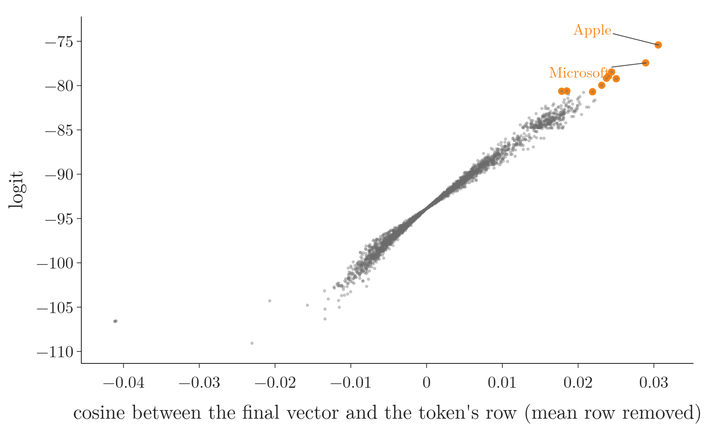
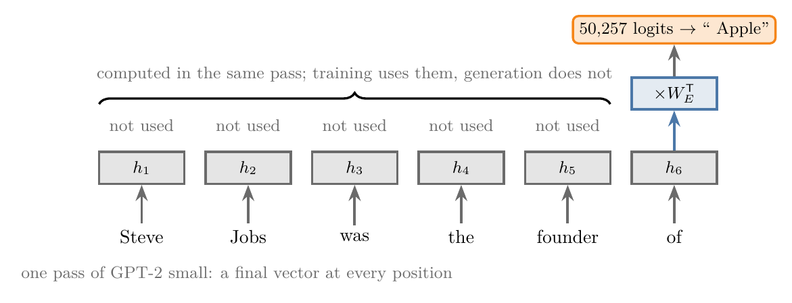
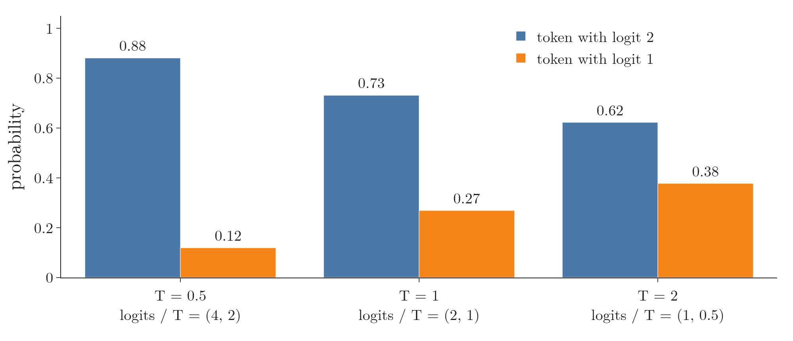
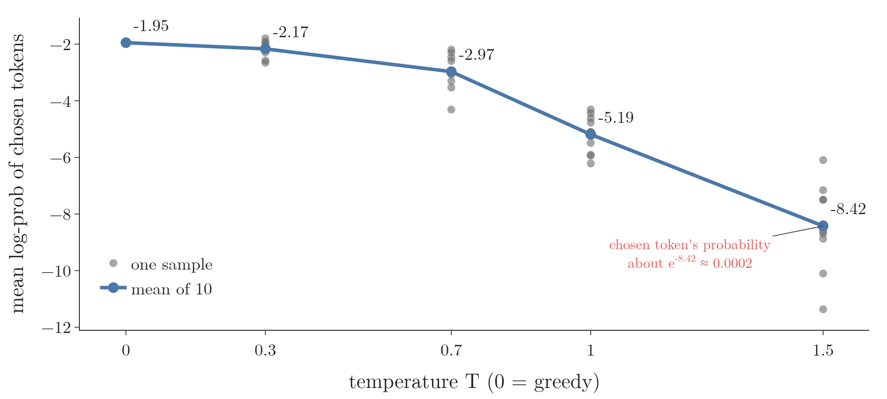
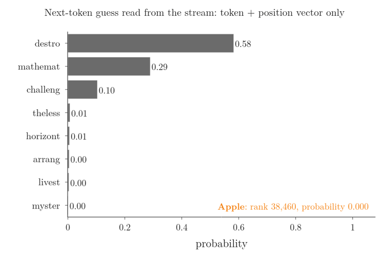
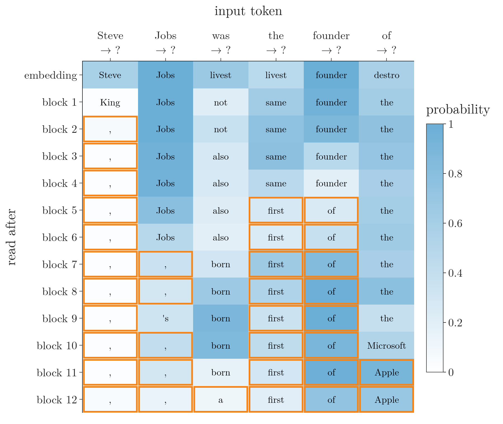

<!-- where-this-fits: generated by course_map/build_map.py; edit concepts.yaml, not this block -->
> **Where this fits:** Pipeline map steps 8 (Model), 9 (Evaluate). See the [Course map](../../../00-course-map/00-course-map.md).
>
> 
>
> - **Builds on:** [Softmax regression](../../../ML/07-classification/ML-078-softmax-regression/ML-078-softmax-regression.md#1-overview).
<!-- /where-this-fits -->

## 1. Overview

> **Key point:** After the last block, GPT turns the final vector into one score per vocabulary token by taking its dot product with every token's embedding row. This step is the **unembedding** (G-2040), and the scores are the **logits** (G-1122). A softmax with a **temperature** (G-1956) $T$ turns the logits into probabilities: low $T$ sharpens them towards the top token, high $T$ flattens them towards uniform. Generation then **samples** (G-1739) a token from these probabilities. Reading the same scores after every block, the **logit lens** (G-1121), shows the model's guess forming layer by layer.

The [GPT](../DL-087-decoder-only-gpt/DL-087-decoder-only-gpt.md#7-a-guess-at-every-position) followed one pass of GPT-2 small up to its last step: "multiply by $W_E^T$, then softmax". This Note opens that last step. It asks three questions:

1. What do the logits measure? (section 3)
2. How does one number, the temperature, change the choice of the next token? (sections 5 and 6)
3. Where in the 12 blocks does the answer appear? (section 7)

Figure 1 shows the temperature on GPT-2 small's real logits after "Once upon a time there was a". Watch the orange bar, the total probability of all tokens outside the top 10. At $T = 1$ it already holds 85 percent. Lower $T$ shrinks it, and two tokens, " great" and " man", take almost everything. Higher $T$ grows it, until the choice is close to a random pick from the whole vocabulary. Under the bars is a real continuation sampled at that temperature.

## 2. Prerequisites

- [GPT](../DL-087-decoder-only-gpt/DL-087-decoder-only-gpt.md#71-the-tied-unembedding): the decoder-only model, the residual stream, the final LayerNorm and the tied unembedding.
- [Transformer decoder](../DL-084-transformer-decoder/DL-084-transformer-decoder.md#8-the-output-layer-linear-and-softmax), §8: the output layer (linear and softmax) and the word "logits".
- [Softmax regression](../../../ML/07-classification/ML-078-softmax-regression/ML-078-softmax-regression.md#22-the-formula): the softmax function.
- [Dot product and cosine similarity](../../../MA/05-linear-algebra/MA-050-dot-product-and-cosine-similarity/MA-050-dot-product-and-cosine-similarity.md#5-the-geometric-meaning): a dot product is large when two vectors point the same way.
- [Transformer inference](../DL-085-transformer-inference/DL-085-transformer-inference.md#6-later-steps-the-input-grows-by-one-word): generation one token at a time, greedy decoding.
- [Loss functions](../../01-basics/DL-014-dl-loss-functions/DL-014-dl-loss-functions.md#9-categorical-cross-entropy): cross-entropy.

## 3. The unembedding: one dot product per token

> **Key point:** The logit of token $k$ is the dot product of the final vector $h$ with row $k$ of the token embedding matrix: $z_k = h \cdot w_k$. A token whose row points the same way as $h$ gets a high logit.

### 3.1 The formula

> **Key point:** For GPT-2 small, the final vector has 768 numbers and $W_E$ has 50,257 rows, so the unembedding gives 50,257 logits.

1. **In words:** after the final LayerNorm, the vector of the last position is compared with the embedding row of every token in the vocabulary by a dot product (multiply matching entries and add: large when two vectors point the same way). Each dot product is that token's score.
2. **Formula:** with $h$ the final vector and $w_k$ row $k$ of $W_E$,
   $$z_k = h \cdot w_k$$
   All 50,257 dot products at once are one matrix product:
   $$z = W_E\thinspace h$$
3. **Example:** after "Steve Jobs was the founder of", the largest logits are " Apple" $-75.4$, " Microsoft" $-77.4$, " the" $-78.5$, " IBM" $-78.9$ (Notebook).

GPT-2 has no separate output matrix: the same $W_E$ that turned tokens into vectors at the input turns the last vector back into token scores (the [GPT](../DL-087-decoder-only-gpt/DL-087-decoder-only-gpt.md#71-the-tied-unembedding), §7.1). Sanderson (2024, Ch 5) calls the output matrix the **unembedding matrix** (G-2039) $W_U$; in GPT-2, $W_U$ is $W_E$ itself. The raw outputs $z_k$ are the **logits** (Sanderson 2024, Ch 5; the [transformer decoder](../DL-084-transformer-decoder/DL-084-transformer-decoder.md#8-the-output-layer-linear-and-softmax), §8).

### 3.2 Logits measure alignment, once the shared direction is removed

> **Key point:** All rows of $W_E$ share one common direction, their mean row. Its part of every logit is the same number, $-93.9$ here, and the softmax ignores it. With that part removed, a token's logit follows the cosine between $h$ and its row almost exactly (correlation 0.98).

The logits above are all negative, between $-109$ and $-75$. The reason is a shared direction. Write each row as the mean row $\bar w$ plus the rest:

$$w_k = \bar w + (w_k - \bar w)$$

Then

$$z_k = h \cdot \bar w + h \cdot (w_k - \bar w)$$

The first term is the same for every token. In GPT-2 small it is $-93.9$, which is exactly the average logit (Notebook). The rows really do share this direction: on average, a row's cosine with the mean row is 0.52.

The softmax ignores a number added to every logit. (The symbol $\sum_j$ adds the terms for every token $j$.) Adding $c$ to every $z_j$ multiplies every $e^{z_j}$ by $e^c$, and the $e^c$ cancels between the top and the bottom of the fraction:

$$\frac{e^{z_k + c}}{\sum_j e^{z_j + c}} = \frac{e^c\thinspace e^{z_k}}{e^c \sum_j e^{z_j}}$$

$$= \frac{e^{z_k}}{\sum_j e^{z_j}}$$

So only the second term, $h \cdot (w_k - \bar w)$, decides the probabilities. A **cosine** is the cosine of the angle between two vectors: 1 for the same direction, 0 for perpendicular ([cosine similarity](../../../MA/05-linear-algebra/MA-050-dot-product-and-cosine-similarity/MA-050-dot-product-and-cosine-similarity.md#6-cosine-similarity)). Figure 2 plots the logit against that cosine:

{width=90%}

The points lie close to one line: the [correlation](../../../MA/01-descriptive-stats/MA-009-covariance-and-correlation/MA-009-covariance-and-correlation.md#4-correlation) is 0.98 (1 means the two lists rise and fall together perfectly). The top six tokens by this cosine are " Apple", " Microsoft", " Google", " the", " IBM" and " Intel", the same six as the top six logits. A logit is a measure of how well the final vector points towards a token, which is the dot-product idea of the [dot product and cosine similarity](../../../MA/05-linear-algebra/MA-050-dot-product-and-cosine-similarity/MA-050-dot-product-and-cosine-similarity.md#6-cosine-similarity).

Without removing the mean row, the raw cosine misleads: its correlation with the logits is $-0.29$, and " Apple" ranks 24,613th by raw cosine (Notebook).

## 4. Why only the last vector

> **Key point:** In generation, only the last position's logits are used. The last vector must therefore carry everything in the text that matters for the next token.

One pass gives logits at every position, and training uses all of them (the [GPT](../DL-087-decoder-only-gpt/DL-087-decoder-only-gpt.md#72-every-position-predicts), §7.2). When generating, though, the model needs only what comes after the last token, so it unembeds only the last vector (the [transformer inference](../DL-085-transformer-inference/DL-085-transformer-inference.md#6-later-steps-the-input-grows-by-one-word), §6). Sanderson (2024, Ch 6) gives a vivid case: a long mystery novel that ends "… therefore the murderer was". The last vector, the one for "was", must by then hold whatever in the whole story points to the murderer. Attention is how earlier tokens get their information into it (Figure 3).

{width=95%}

## 5. Softmax with a temperature

> **Key point:** Dividing every logit by a temperature $T$ before the softmax sharpens the distribution when $T < 1$ and flattens it when $T > 1$. As $T \to 0$ the top token gets all the probability; as $T \to \infty$ every token gets $1/V$, where $V$ is the number of tokens in the vocabulary.

### 5.1 The formula

1. **In words:** divide each logit by $T$, then take the ordinary softmax.
2. **Formula** (Holtzman et al. 2020, §3.3, eq. 4):
   $$p_k = \frac{e^{z_k / T}}{\sum_{j=1}^{V} e^{z_j / T}}$$
   $V$ is the number of tokens in the vocabulary (50,257 for GPT-2), and $T = 1$ gives the model's own probabilities.
3. **Example:** two logits $z = (2, 1)$, so $V = 2$. For each temperature, divide the logits by $T$, take $e$ to the power of each, and divide each result by the sum of the two (Figure 4):

   | $T$ | $z/T$ | $e^{z/T}$ | $p$ |
   |---|---|---|---|
   | 1 | $(2, 1)$ | $(7.39, 2.72)$ | $(0.73, 0.27)$ |
   | 0.5 | $(4, 2)$ | $(54.60, 7.39)$ | $(0.88, 0.12)$ |
   | 2 | $(1, 0.5)$ | $(2.72, 1.65)$ | $(0.62, 0.38)$ |

   {width=90%}

### 5.2 The two limits

> **Key point:** Low temperature magnifies the gaps between logits; high temperature shrinks them.

Divide the top and bottom of $p_k$ by $e^{z_{\max}/T}$, where $z_{\max}$ is the largest logit:

$$p_k = \frac{e^{(z_k - z_{\max})/T}}{\sum_j e^{(z_j - z_{\max})/T}}$$

The arrow $\to$ reads "gets closer and closer to".

- **$T \to 0$:** every exponent $(z_j - z_{\max})/T$ with $z_j < z_{\max}$ goes to $-\infty$, so its term goes to 0. Only the top token's term stays at $e^0 = 1$. Its probability goes to 1: picking with $T \to 0$ is **greedy decoding**. Greedy decoding takes the **argmax** (G-212; the position of the largest value) of the probabilities. In a classifier, argmax reads off the [predicted class](../../01-basics/DL-014-dl-loss-functions/DL-014-dl-loss-functions.md#91-the-setup) after training; here it reads off the next token.
- **$T \to \infty$:** every exponent goes to 0, every term to $e^0 = 1$, and every $p_k$ to $1/V$: a uniform pick from the vocabulary.

A check on the two logits $z = (2, 1)$, with $T = 0.1$ and $T = 100$:

For $T = 0.1$:

$$z/T = (20,\ 10)$$

$$p_1 = \frac{e^{20}}{e^{20} + e^{10}} = 0.99995$$

$$p_2 = \frac{e^{10}}{e^{20} + e^{10}} = 0.00005$$

For $T = 100$:

$$z/T = (0.02,\ 0.01)$$

$$p = (0.5025,\ 0.4975)$$

The first is almost all on the top token, the second almost uniform ($1/V = 0.5$ for $V = 2$).

On GPT-2 small's real logits the Notebook confirms both limits: at $T = 0.01$ the top token has 0.954 (its runner-up is only 0.04 logits behind, so $T$ must be this small); at $T = 10{,}000$ every token has the same probability, $1/50{,}257$, which is about 0.0000199.

### 5.3 How spread out is the distribution?

> **Key point:** On "Once upon a time there was a", GPT-2 small at $T = 1$ is as spread out as a fair pick among about 2,000 tokens. At $T = 0.3$ it is like a pick among 2.5; at $T = 2$, among 17,000.

A handy measure of spread is the **entropy** (G-691), in bits:

$$H = -\sum_k p_k \log_2 p_k$$

A fair pick among $n$ tokens has entropy $\log_2 n$. For example, a fair pick among 8 tokens gives

$$H = \log_2 8 = 3 \text{ bits}$$

Turning this round, $2^H$ reads as "as spread out as a fair pick among $2^H$ tokens". The uniform distribution over 50,257 tokens has 15.6 bits. The Notebook measures the distribution after "Once upon a time there was a" ("mass outside the top 10" is the total probability of all tokens except the 10 most likely):

| $T$ | Top token " great" | Mass outside the top 10 | Entropy (bits) | Like a fair pick among |
|---|---|---|---|---|
| 0.05 | 0.65 | 0.00 | 0.9 | 1.9 tokens |
| 0.3 | 0.50 | 0.01 | 1.3 | 2.5 tokens |
| 0.7 | 0.16 | 0.52 | 7.3 | 156 tokens |
| 1.0 | 0.04 | 0.85 | 10.9 | 1,966 tokens |
| 1.5 | 0.007 | 0.97 | 13.2 | 9,225 tokens |
| 2.0 | 0.002 | 0.99 | 14.1 | 17,171 tokens |

At $T = 0.05$ the top token has only 0.65, not 1, because " great" and " man" are almost tied ($-88.82$ and $-88.86$). This prompt is open: many continuations are reasonable. On "Steve Jobs was the founder of", by contrast, " Apple" alone has 0.69 at $T = 1$.

> **Extra:** Sanderson's *Transformers, the tech behind LLMs* (3Blue1Brown, 2024, Ch 5) animates the next-token distribution changing with the temperature, with GPT-3 stories from the seed "Once upon a time there was a"; his animation uses GPT-3's 20 most probable tokens. Figure 1 takes that idea and that prompt. Its design is our own, and it uses GPT-2 small's full set of 50,257 logits, which is why the orange "all others" bar can be shown.

## 6. Sampling: choosing the next token

> **Key point:** Sampling draws the next token at random with the softmax probabilities. Low temperatures give safe, repetitive text; high temperatures give varied text that soon stops making sense.

### 6.1 Greedy decoding repeats itself

> **Key point:** Always taking the top token gives the same text every time, and GPT-2 small's greedy text soon loops.

Greedy decoding on "Once upon a time there was a" gives (Notebook):

> "… a great deal of confusion about the meaning of the word "fool." The word "fool" was used in the Old Testament to mean a person who is not a good person, who is not"

The same happens in the published greedy example of the Hugging Face guide (von Platen 2020), which our model reproduces word for word (the [GPT](../DL-087-decoder-only-gpt/DL-087-decoder-only-gpt.md#74-generation-predict-pick-append-repeat), §7.4): "I'm not sure if I'll ever be able to walk with my dog. I'm not sure if I'll ever be able to walk". Holtzman et al. (2020, abstract) report the same for maximisation-based decoding in general: the text is "bland, incoherent, or gets stuck in repetitive loops". They also show why loops persist: "The probability of a repeated phrase increases with each repetition, creating a positive feedback loop" (Holtzman et al. 2020, Figure 4).

### 6.2 Sampling at different temperatures

> **Key point:** Ten samples at each temperature on the same prompt: all ten differ at every $T > 0$. As $T$ rises, the chosen tokens become less likely under the model and the text breaks down.

The Notebook draws 10 continuations of 12 tokens at each temperature (seeds 0 to 9):

| $T$ | A sample (the first seed) | Mean log-probability of the chosen tokens |
|---|---|---|
| 0 (greedy) | "great deal of confusion about the meaning of the word "f" | $-1.95$ |
| 0.3 | "great deal of interest in the idea of a 'black'" | $-2.17$ |
| 0.7 | "fire, a man led his horse into the woods and," | $-2.97$ |
| 1.0 | "tradition of the Ciphoner making copies of Bodhisatt" | $-5.19$ |
| 1.5 | "mutation that was an Xavier Upload Adventure Package 34997446)" | $-8.42$ |

The last column is the average, over the 12 tokens and the 10 samples, of the log of the probability the model (at $T = 1$) gave each chosen token. It falls steadily (Figure 5): at higher $T$ the sampler picks tokens the model itself finds unlikely.

{width=90%}

At $T = 1.5$ a chosen token has, on average, a probability of about

$$e^{-8.42} \approx 0.0002$$

Holtzman et al. (2020, §3.3) summarise the trade-off: "while lowering the temperature improves generation quality, it comes at the cost of decreasing diversity".

Sampling is why a chatbot can give a different answer each time to the same prompt, even though the model itself is deterministic (Sanderson 2024, *Large Language Models explained briefly*).

> **Extra:** Two other common rules cut off the unlikely tail before sampling. **Top $k$** (G-1985) keeps only the $k$ most likely tokens; **nucleus (top $p$)** sampling (G-1360) keeps the smallest set of tokens whose probabilities add up to at least $p$ (Holtzman et al. 2020, §3.1–3.2). Nucleus sampling adapts to the context. In GPT-2 small, 90 percent of the probability after "Steve Jobs was the founder of" sits in 15 tokens; after "Once upon a time there was a" it needs 4,122 (Notebook). A fixed $k$ cannot fit both.

## 7. The logit lens: watching the guess form

> **Key point:** Applying the final LayerNorm and the unembedding to the residual stream after each block, not just the last, shows the model's next-token guess at every depth. On "Steve Jobs was the founder of", " Apple" (ranked by probability among all 50,257 tokens) ranks 38,460th before block 1, 25th after block 8, 2nd after block 9 and 1st after block 11.

### 7.1 The idea

> **Key point:** The residual stream has the same 768 numbers at every depth, so the same unembedding can read it anywhere.

The unembedding is a fixed linear map applied to the last stream vector. Nothing stops us from applying it to the stream after block 1, 2, … 11 as well. nostalgebraist (2020), who named this the **logit lens**, found that the resulting distributions "gradually converge to the final distribution over the layers of the network, often getting close to that distribution long before the end". Our version passes each block's output through GPT-2's final LayerNorm `ln_f` and then through $W_E$, exactly as the real last step does.

### 7.2 One position, block by block

> **Key point:** For the last token, " the" is the top guess from block 1 to block 9. " Apple" climbs into the top 25 after block 8, reaches the top after block 11, and stays there.

Watch Figure 6 for the moment the guesses change kind. Before block 1 the stream is the token-plus-position vector, and its "guesses" are word fragments with no relation to the question. From block 1 to block 8 the top guess is " the": a safe, grammatical continuation of "founder of". After block 9, company names arrive together: " Apple" 0.15, " Microsoft" 0.12, " Silicon", " IBM". After block 10 " Microsoft" leads (0.53, " Apple" second at 0.29). After block 11 " Apple" has 0.92, and the final output gives it 0.69 (Notebook).

| Read after | Rank of " Apple" | Its probability | Top guess |
|---|---|---|---|
| embedding only | 38,460 | 0.000 | "destro" |
| block 4 | 1,088 | 0.000 | " the" |
| block 8 | 25 | 0.001 | " the" |
| block 9 | 2 | 0.149 | " the" |
| block 10 | 2 | 0.289 | " Microsoft" |
| block 11 | 1 | 0.920 | " Apple" |
| block 12 (output) | 1 | 0.694 | " Apple" |

### 7.3 All positions at once

> **Key point:** At most positions the guess settles before the end. Half the positions already show their final guess after block 5.

{width=88%}

Figure 7 reads each column from top to bottom:

- In the **first row**, three positions "guess" their own input token (" Jobs" after " Jobs", " founder" after " founder"). Before any block runs, the stream is the token's embedding row plus a position vector, and a row has a large dot product with itself.
- After **" founder"**, the guess becomes " of" at block 5, and stays.
- After **" the"**, the guess becomes " first" at block 5 ("the first …"), and stays.
- The share of positions whose guess already equals the final one rises from 0 (embedding, block 1) to 0.5 (blocks 5 and 6) and 0.67 (blocks 7 and 8), dips back to 0.5 at block 9 (after " Jobs" the guess briefly becomes "'s"), and reaches 1 at block 12. The position after " was" is the exception that settles last: its guess is " born" from block 7 to block 11 and becomes the final " a" only at block 12.

Facts can appear at different depths. The Notebook repeats the lens on three other prompts. " York" after "The Statue of Liberty is in New" is ranked first from block 1 on: the phrase "New York" is common. " golf" after "Tiger Woods plays the sport of" first ranks first after block 10, and " basketball" after "Michael Jordan plays the sport of" after block 9. Where in the network such facts come from is the topic of the [MLP](../DL-089-mlp-stores-facts/DL-089-mlp-stores-facts.md#4-rows-ask-questions-the-activation-makes-an-and-gate).

> **Extra:** nostalgebraist (2020) calls the logit lens "a simple (if partial) interpretability lens": it shows what the stream would predict if the network stopped there, not how each block computes its change.

## 8. Summary

| Step | What it does | GPT-2 small |
|---|---|---|
| Unembedding | dot product of the final vector with every token's row | $W_E$ itself (tied), 50,257 logits |
| Logits | the raw scores; their shared offset does not matter | e.g. " Apple" $-75.4$, mean $-93.9$ |
| Softmax with temperature | $p_k = e^{z_k/T} / \sum_j e^{z_j/T}$ | $T = 1$: the model's own probabilities |
| Greedy decoding | take the top token ($T \to 0$) | repeats itself |
| Sampling | draw a token with probabilities $p$ | varied; nonsense at high $T$ |
| Logit lens | unembed the stream after every block | " Apple" first after block 11 |

- A logit is an alignment score: the final vector's dot product with a token's row. A direction shared by all rows adds the same amount to every logit, and the softmax ignores it.
- Temperature divides the logits: $T \to 0$ is greedy, large $T$ is close to uniform.
- Greedy text loops; sampled text varies; the higher $T$, the less likely the chosen tokens and the less sense the text makes.
- The logit lens shows the guess forming over the blocks, often well before the end.

## 9. Sources

**Built from**

- Sanderson, G. (3Blue1Brown), "Large Language Models explained briefly", 2024, 3blue1brown.com/lessons/mini-llm, https://www.youtube.com/watch?v=LPZh9BOjkQs
- Sanderson, G. (3Blue1Brown), "Transformers, the tech behind LLMs | Deep Learning Chapter 5", 2024, 3blue1brown.com/lessons/gpt, https://www.youtube.com/watch?v=wjZofJX0v4M
- Sanderson, G. (3Blue1Brown), "Attention in transformers, step-by-step | Deep Learning Chapter 6", 2024, 3blue1brown.com/lessons/attention, https://www.youtube.com/watch?v=eMlx5fFNoYc
- Holtzman, A., Buys, J., Du, L., Forbes, M. and Choi, Y. (2020). The Curious Case of Neural Text Degeneration. *ICLR 2020*. arXiv:1904.09751 (v2). Abstract (maximisation-based decoding is "bland, incoherent, or gets stuck in repetitive loops"); §3.1 (nucleus sampling, eq. 2); §3.2 (top $k$ sampling); §3.3 (temperature, eq. 4, the quality–diversity quote); Figure 4 (repetition as a positive feedback loop).
- Radford, A., Narasimhan, K., Salimans, T. and Sutskever, I. (2018). Improving Language Understanding by Generative Pre-Training. OpenAI. §3.1, eq. 2 (output $\text{softmax}(h_nW_e^T)$).

**Other references**

- nostalgebraist (2020). interpreting GPT: the logit lens. LessWrong, 31 August 2020, lesswrong.com/posts/AcKRB8wDpdaN6v6ru. Overview section (the name, the convergence quote, "a simple (if partial) interpretability lens").
- von Platen, P. (2020). How to generate text: using different decoding methods for language generation with Transformers. Hugging Face blog, 1 March 2020, huggingface.co/blog/how-to-generate. Greedy search section.
- Weights and tokenizer: `openai-community/gpt2`, huggingface.co.

## 10. Key terms

| Term | Meaning |
|---|---|
| Unembedding | The last step of a language model: the final vector's dot product with every token's vector, one score per token |
| Unembedding matrix $W_U$ | The matrix of that step; in GPT-2 it is the token embedding matrix $W_E$ (tied) |
| Logit | A raw score before the softmax; one per vocabulary token |
| Temperature $T$ | The number every logit is divided by before the softmax; low $T$ sharpens, high $T$ flattens |
| Greedy decoding | Always choosing the top token; the limit $T \to 0$ |
| Sampling (G-1739) | Choosing the next token at random, with the softmax probabilities |
| Entropy | $-\sum_k p_k \log_2 p_k$, in bits: how spread out a distribution is |
| Top $k$ sampling | Sampling only among the $k$ most likely tokens |
| Nucleus (top $p$) sampling | Sampling only among the smallest set of tokens whose probabilities add up to at least $p$ |
| Logit lens | Applying the final LayerNorm and the unembedding to the residual stream after each block |
