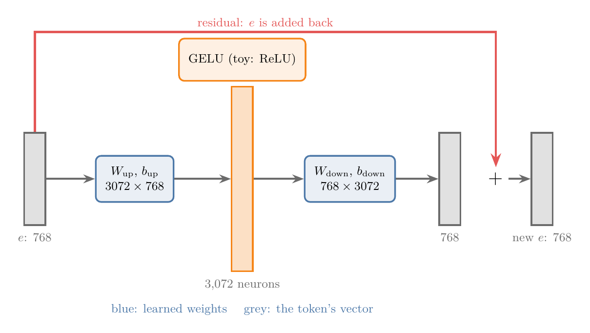
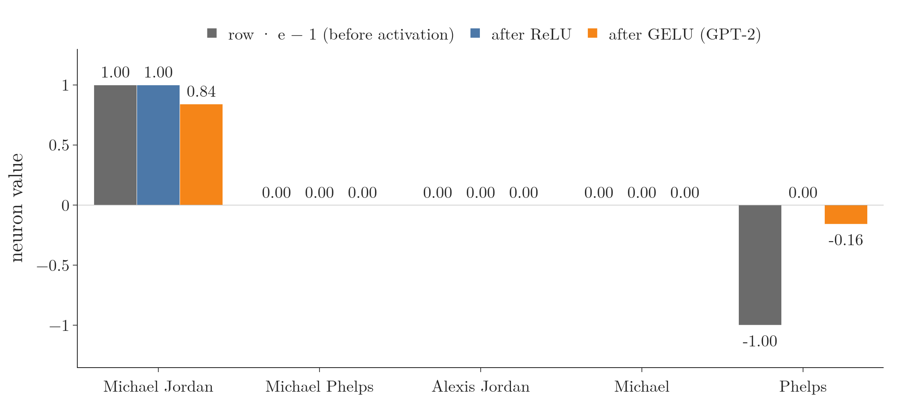
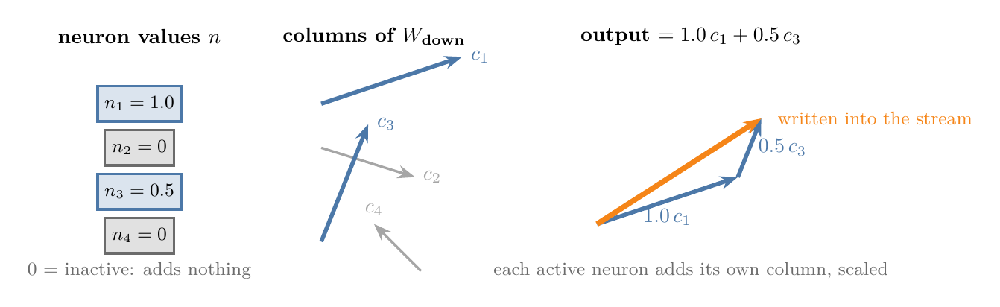
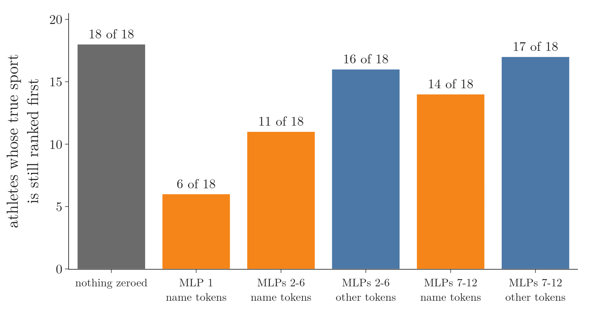
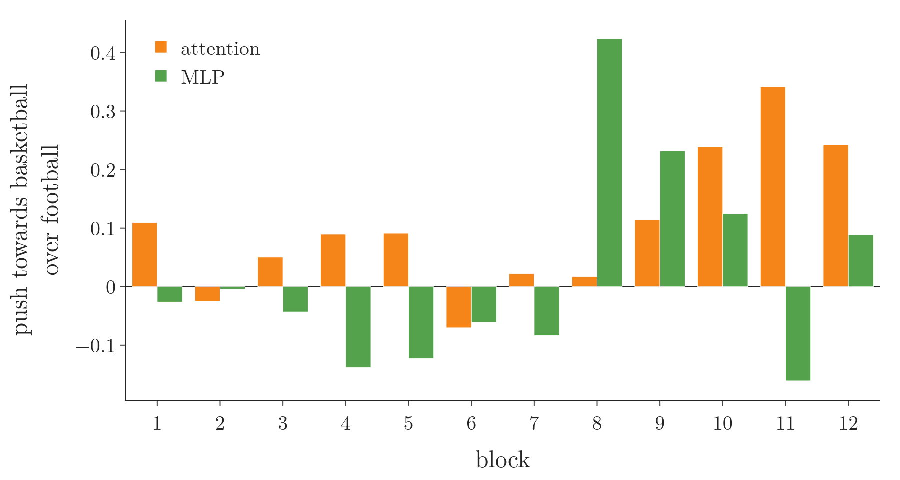

<!-- where-this-fits: generated by course_map/build_map.py; edit concepts.yaml, not this block -->
> **Where this fits:** Pipeline map step 8 (Model). See the [Course map](../../../00-course-map/00-course-map.md).
>
> 
>
> - **Builds on:** [Decoder-only GPT](../../../DL/06-transformers/DL-087-decoder-only-gpt/DL-087-decoder-only-gpt.md#1-overview).
<!-- /where-this-fits -->

## 1. Overview

> **Key point:** The MLP block of a transformer can be read as a long list of questions and answers: its first matrix asks, its second matrix writes the answer into the token's vector.

In more detail:

- The **MLP block** (multi-layer perceptron) is two dense layers, applied to one token's vector at a time.
- Each row of its first matrix asks a question about the token's vector (a dot product plus a bias).
- The activation function (a function applied to each number; ReLU sets negatives to 0) keeps only clear "yes" answers, which makes a neuron behave like an AND gate.
- Each column of its second matrix is a direction that gets added to the vector when its neuron says yes.
- On GPT-2 small, which knows the sport of 18 of 19 athletes we tested, zeroing the early MLPs (the first blocks' feed-forward layers) at the athlete's name loses the right sport far more often than zeroing them anywhere else.

Give a language model the text "Michael Jordan plays the sport of" and it continues with "basketball". Somewhere in its weights the model holds that fact. Where, and in what form?

[The feed-forward network](../DL-081-transformer-encoder/DL-081-transformer-encoder.md#53-the-feed-forward-network) (G-774), or MLP, was built from its shapes: two dense layers, applied to each token (a word or word piece) on its own. It holds about half of GPT-2 small's parameters (46 percent; [GPT-2 small, matrix by matrix](../DL-087-decoder-only-gpt/DL-087-decoder-only-gpt.md#91-gpt-2-small-matrix-by-matrix)) and two thirds of GPT-3's ([GPT-3](../DL-087-decoder-only-gpt/DL-087-decoder-only-gpt.md#92-gpt-3)), yet the shapes alone do not say what it does. This Note gives one reading of it, with a toy example and then a real model.

Figure 1 follows one toy neuron. Watch the number in the orange circle: it is 1 only when both names, Michael **and** Jordan, are in the input vector, and only then is the basketball direction added to the output.

The toy follows Sanderson (2024, Ch 7). The real-model part (sections 6 and 7) tests how much of the toy survives in GPT-2 small, and section 8 says what does not.

## 2. Prerequisites

- [The feed-forward network](../DL-081-transformer-encoder/DL-081-transformer-encoder.md#53-the-feed-forward-network): applied to each token separately, and its residual connection.
- [Inside a GPT-2 block](../DL-087-decoder-only-gpt/DL-087-decoder-only-gpt.md#6-inside-a-gpt-2-block): GPT-2 small, the residual stream, [GELU](../DL-087-decoder-only-gpt/DL-087-decoder-only-gpt.md#64-gelu) and [the parameter count](../DL-087-decoder-only-gpt/DL-087-decoder-only-gpt.md#9-counting-the-parameters).
- [The unembedding](../DL-088-unembedding-and-sampling/DL-088-unembedding-and-sampling.md#3-the-unembedding-one-dot-product-per-token): logits (the score for each token) as dot products with token vectors; [the logit lens](../DL-088-unembedding-and-sampling/DL-088-unembedding-and-sampling.md#7-the-logit-lens-watching-the-guess-form).
- [Arithmetic with directions](../DL-072-meaning-as-direction/DL-072-meaning-as-direction.md#5-arithmetic-with-directions) and [a dot product as a probe](../DL-072-meaning-as-direction/DL-072-meaning-as-direction.md#6-a-dot-product-reads-how-much-of-a-direction-a-word-has): directions in embedding space carry meaning; a dot product measures how much of a direction a vector has.
- [Matrix multiplication as composition](../../../MA/05-linear-algebra/MA-054-matrix-multiplication-as-composition/MA-054-matrix-multiplication-as-composition.md#4-computing-a-product-column-by-column): a matrix times a vector as dot products with the rows, or as a sum of scaled columns.
- [ReLU](../../02-training/DL-027-activation-functions/DL-027-activation-functions.md#8-relu): the activation that keeps positive values and sets negatives to 0.

## 3. The MLP block in one formula

> **Key point:** The **MLP block** (G-1245) takes one token's vector (a list of numbers), widens it, passes it through an activation function, narrows it back, and adds the result to the vector it started from.

We call the token's vector $e$, the widening matrix $W_{\text{up}}$ with its bias $b_{\text{up}}$, and the narrowing matrix $W_{\text{down}}$ with its bias $b_{\text{down}}$ (G-42).

1. **In words:** the vector goes up to a wider space (4 times wider), through an activation function, back down to its own size, and is added to itself.
2. **Formula:**
   $$u = W_{\text{up}}\thinspace e + b_{\text{up}} \quad \text{(widen)}$$
   $$a = f(u) \quad \text{(activation)}$$
   $$d = W_{\text{down}}\thinspace a + b_{\text{down}} \quad \text{(narrow)}$$
   $$e \leftarrow e + d \quad \text{(add back)}$$
   All four lines in one, with the change $d$ written out:
   $$d = W_{\text{down}}\thinspace f\big(W_{\text{up}}\thinspace e + b_{\text{up}}\big)$$
   $$\qquad + b_{\text{down}}$$
   $$e \leftarrow e + d$$
   where $f$ is ReLU in the toy and GELU in GPT-2. (In GPT-2 a LayerNorm, which rescales the numbers, comes first, see [prenorm](../DL-087-decoder-only-gpt/DL-087-decoder-only-gpt.md#61-prenorm-layernorm-at-the-input); we leave it out here.)
3. **Example:** GPT-2 small: $e$ has 768 numbers, $W_{\text{up}}$ is $3{,}072 \times 768$, so the middle has 3,072 numbers ($4 \times 768$), and $W_{\text{down}}$ is $768 \times 3{,}072$.

{width=100%}

Figure 2 shows the widths: the block widens each vector four times, then narrows it back so that it can be added to the stream.

The 3,072 middle values are the **neurons** (G-1317) of the block: "when you hear people refer to the neurons of a transformer, they're talking about these values" (Sanderson 2024, Ch 7). A neuron is **active** when its value is positive.

The block works on each token's vector alone, in parallel; tokens do not talk to each other here, only in attention (see [the feed-forward network](../DL-081-transformer-encoder/DL-081-transformer-encoder.md#53-the-feed-forward-network)).

## 4. Rows ask questions; the activation makes an AND gate

> **Key point:** Each row of $W_{\text{up}}$ is a direction, and its dot product with $e$ asks "how much of this direction does $e$ have?". With the row Michael + Jordan and the bias $-1$, the answer is positive only when both names are present. ReLU clips every other answer to 0.

### 4.1 Rows as questions

> **Key point:** Multiplying by a matrix computes one dot product per row.

A matrix times a vector can be read in two ways (see [computing a product column by column](../../../MA/05-linear-algebra/MA-054-matrix-multiplication-as-composition/MA-054-matrix-multiplication-as-composition.md#4-computing-a-product-column-by-column)). The first: entry $i$ of the result is the **dot product** (G-634) of row $i$ with the vector. Here each row of $W_{\text{up}}$ is a direction in the same 768-number space as $e$, so neuron $i$ measures how well $e$ points along row $i$. Sanderson (2024, Ch 7) calls each row a question asked about the vector.

### 4.2 A toy fact: Michael Jordan plays basketball

> **Key point:** With perpendicular directions $M$ (first name Michael), $J$ (last name Jordan) and $B$ (basketball), a neuron with row $M + J$, bias $-1$ and column $B$ adds basketball to "Michael Jordan" and to nothing else.

We follow Sanderson's toy (2024, Ch 7). Assume the vector space has perpendicular unit directions (arrows of length 1, at right angles to each other) for the ideas "first name Michael" ($M$), "last name Jordan" ($J$), "last name Phelps" ($P$), "first name Alexis" ($A$) and "basketball" ($B$). A vector "has" an idea when its dot product with that direction is 1. The vector at the token " Jordan" in "Michael Jordan" then contains both names, $e = M + J$; attention has already brought "Michael" over from the previous token (Sanderson 2024, Ch 7).

1. **In words:** one neuron with row $M + J$ and bias $-1$, then ReLU. Its column in $W_{\text{down}}$ is $B$.
2. **Formula:**
   $$n = \text{ReLU}\big((M + J)\cdot e - 1\big)$$
   $$e \leftarrow e + n\thinspace B$$
3. **Example:** for $e = M + J$, perpendicular unit vectors have dot product 0 and a unit vector with itself has 1:
   $$(M + J)\cdot(M + J)$$
   $$= M\cdot M + M\cdot J + J\cdot M + J\cdot J$$
   $$= 1 + 0 + 0 + 1$$
   $$= 2$$
   Subtract the bias and apply ReLU:
   $$2 - 1 = 1$$
   $$n = \text{ReLU}(1) = 1$$
   The output is $e + B = M + J + B$: it now also says "basketball".

The Notebook runs all the inputs of Figure 1:

| Input $e$ | Row $\cdot\thinspace e$ | $+$ bias $-1$ | After ReLU | Basketball added |
|---|---|---|---|---|
| Michael Jordan, $M + J$ | 2 | 1 | 1 | 1 |
| Michael Phelps, $M + P$ | 1 | 0 | 0 | 0 |
| Alexis Jordan, $A + J$ | 1 | 0 | 0 | 0 |
| Michael, $M$ | 1 | 0 | 0 | 0 |
| Phelps, $P$ | 0 | $-1$ | 0 | 0 (without ReLU: $-1$) |

The bias sets the threshold: one name alone gives 0, so only both names together make the neuron positive:

$$1 - 1 = 0$$

The ReLU then clips every negative answer to 0. Without it, the input "Phelps" would write $-1 \times B$, an "anti-basketball" signal, into the vector. With it, the neuron outputs 1 for Michael **and** Jordan and 0 otherwise: it behaves like an **AND gate** (G-198) (Sanderson 2024, Ch 7).

{width=95%}

Figure 3 puts the table's columns side by side. Grey shows the raw answer; ReLU removes the $-1$ of "Phelps"; GELU keeps a small negative value and lowers the "yes" to 0.84 (Extra below).

> **Extra:** GPT-2 uses GELU, $x\thinspace\Phi(x)$ (Hendrycks and Gimpel 2016), instead of ReLU ([GELU](../DL-087-decoder-only-gpt/DL-087-decoder-only-gpt.md#64-gelu)). GELU has the same overall shape but is smooth: the toy neuron would give 0.84 for Michael Jordan instead of 1, 0 for one name, and $-0.16$ instead of 0 for "Phelps" (Notebook). The gate is softer but still separates the full name from the rest.

## 5. Columns write directions

> **Key point:** The output of $W_{\text{down}}$ is a sum of its columns, each scaled by its neuron's value. A column is a direction in the token's space: it is what that neuron adds to the stream when it fires.

The second reading of a matrix times a vector, also in [the same section](../../../MA/05-linear-algebra/MA-054-matrix-multiplication-as-composition/MA-054-matrix-multiplication-as-composition.md#4-computing-a-product-column-by-column): the result is the sum of the columns, column $i$ scaled by entry $i$ of the vector. For $W_{\text{down}}$ this reads

$$W_{\text{down}}\thinspace n = n_1\thinspace c_1 + n_2\thinspace c_2$$

$$+ \dots + n_{3072}\thinspace c_{3072}$$

where $c_i$ is column $i$, a 768-number direction. An inactive neuron ($n_i = 0$) adds nothing; an active one adds its column, scaled. In the toy, column 1 is $B$, so firing writes "basketball" (Figure 1, right). A column can also carry several ideas at once, for example basketball plus other facts about the same person (Sanderson 2024, Ch 7).

{width=95%}

In Figure 4, follow the two blue arrows on the right: each active neuron adds its column, stretched by its value, and the orange sum is what the block writes into the stream.

Put together, the block is a store of question–answer pairs: 3,072 rows asking, 3,072 columns answering. Geva et al. (2021, §2, eq. 1) give the same reading and call the pairs **keys** (G-1011) and **values** (G-2068); in an MLP these are the **key and value** of G-1012. These keys and values are not the keys and values of attention; the names are reused. Geva et al. write the feed-forward layer, with $x$ the token's vector, $K$ the first matrix and $V$ the second, as:

$$\text{FF}(x) = f(x \cdot K^T) \cdot V$$

- **Key:** a row of the first matrix. It "captures a particular pattern (or set of patterns) in the input sequence" (§2).
- **Value:** the matching row of the second matrix in their notation, our column. It "represents the distribution of tokens that follows said pattern" (§2): which tokens are likely to come next.

Geva et al. tested this on a 16-layer language model trained on WikiText-103 (a dataset of Wikipedia articles). They found keys whose top triggering text shared human-readable patterns: shallow ones (e.g. ending with "substitutes") in lower layers and more semantic ones in upper layers (Geva et al. 2021, §3, Table 1).

> **Extra:** The toy (Michael Jordan and basketball, the bias of $-1$), the AND-gate reading of ReLU, the rows of $W_{\text{up}}$ as questions and the columns of $W_{\text{down}}$ as directions that get added follow Sanderson's *How might LLMs store facts* (3Blue1Brown, 2024, Ch 7). The Michael Phelps and Alexis Jordan inputs are his examples too. The animation's design and the numbers are our own.

## 6. A real model: does GPT-2 small know sports?

> **Key point:** Asked "⟨athlete⟩ plays the sport of", GPT-2 small ranks the right sport first for 18 of 19 athletes.

Before looking for a stored fact, we need a fact the model actually knows. Here a **fact** (G-745) is an athlete's sport, as the model's ranking of 10 sports after "⟨name⟩ plays the sport of". The Notebook asks GPT-2 small "⟨name⟩ plays the sport of" for 19 well-known athletes, the kind of fact studied by Nanda et al. (2023), and records the next-token probabilities:

| Athlete | True sport | GPT-2's top token | Its probability |
|---|---|---|---|
| Michael Jordan | basketball | basketball | 0.135 |
| Kobe Bryant | basketball | basketball | 0.617 |
| Tiger Woods | golf | golf | 0.615 |
| Phil Mickelson | golf | football | 0.071 (golf 0.049, second) |
| Wayne Gretzky | hockey | hockey | 0.378 |
| Roger Federer | tennis | tennis | 0.540 |
| Tom Brady | football | football | 0.544 |
| Michael Phelps | swimming | swimming | 0.105 |
| Sachin Tendulkar | cricket | cricket | 0.415 |

(9 of the 19 shown; Figure 5 shows all.)

![GPT-2 small's probability for each athlete's true sport as the next token after the prompt "[athlete] plays the sport of". Blue: the true sport is the top token; red: it is not](images/athletes.png){height=55%}

18 of 19 are right. Phil Mickelson is the one miss, so the experiments below use the other 18.

The probabilities can be low even when the answer is right: for Michael Jordan, " basketball" has 0.135, ahead of " football" at 0.086. Much of the probability goes to tokens that are not sports at all. The Notebook takes the 10 sports in the list (basketball, football, golf, hockey, tennis, baseball, soccer, cricket, boxing, swimming); for Michael Jordan, these 10 together get 0.415, so the rest goes elsewhere:

$$1 - 0.415 = 0.585$$

To measure only the fact, *which* sport, the Notebook asks whether the true sport is ranked first among the 10 sports, and computes its **share of the 10 sports**: its probability divided by the 10 sports' total. For Michael Jordan:

$$0.135 / 0.415 = 0.33$$

## 7. Where the sport comes from

> **Key point:** Zeroing the MLPs of the early blocks at the athlete's name tokens loses the right sport for many athletes; zeroing the same MLPs at the other tokens barely matters. The sport is then carried to the last position mainly by attention.

### 7.1 Switching MLPs off

> **Key point:** Zero MLP 1 at the name tokens and only 6 of 18 athletes keep the right sport first. Zero MLPs 2–6 there and 11 keep it; zero the same MLPs at the other tokens and 16 keep it.

To test what a group of MLPs does, we set their outputs to 0 at chosen positions and run the rest of the model unchanged (**zero-ablation** (G-2147)). The positions are either the **name tokens** (G-1299) (for example "Michael" and " Jordan") or the **other tokens** (" plays the sport of").

{width=90%}

| MLPs zeroed | Where | True sport still first | Its share of the 10 sports | Its probability |
|---|---|---|---|---|
| none | | 18 of 18 | 0.62 | 0.36 |
| block 1 | name tokens | 6 of 18 | 0.28 | 0.08 |
| blocks 2–6 | name tokens | 11 of 18 | 0.44 | 0.13 |
| blocks 2–6 | other tokens | 16 of 18 | 0.50 | 0.15 |
| blocks 7–12 | name tokens | 14 of 18 | 0.49 | 0.25 |
| blocks 7–12 | other tokens | 17 of 18 | 0.77 | 0.11 |

(Averages over the 18 athletes; Notebook.)

Three readings of Figure 6 and the table:

1. **The name tokens matter more than the rest.** For blocks 2–6, zeroing at the name tokens costs 7 athletes; zeroing at the other tokens costs 2. The same holds for blocks 7–12 (4 against 1).
2. **The early blocks matter more than the late ones** at the name tokens: block 1 alone costs 12 athletes, blocks 2–6 cost 7, blocks 7–12 cost 4.
3. **Late MLPs at the other tokens help with "a sport comes next", not with "which sport".** Zeroing them lowers the true sport's probability from 0.36 to 0.11, yet the right sport still ranks first for 17 of 18, and its share among the 10 sports even rises.

Nanda et al. (2023) found the same structure in a larger model, Pythia 2.8B (an open language model with 2.8 billion parameters), on athletes and their sports. Their circuit has three stages (Nanda et al. 2023, Post 1, summary of Post 2):

1. Attention layers "assemble the tokens of the athlete's name on the final name token": the last token of the name gathers all the name's tokens.
2. "MLPs 2 to 6 on the final name token map the concatenated tokens to a linear representation of the athlete's sport": these MLPs turn the gathered name into a direction in the vector that stands for the sport.
3. "A sparse set of mid to late attention heads extract the sport subspace and move it to the final token": a few attention heads in the middle and late blocks copy that sport direction to the last position. They describe the early MLPs as a "multi-token embedding": they turn a multi-token name into one vector from which attributes such as the sport can be read.

### 7.2 Who writes the answer at the last position?

> **Key point:** At the last token, the attention blocks together write most of the push towards basketball over football (1.22); the MLPs together add 0.23, with blocks 8 and 9 the largest.

The MLP works on each token alone, so whatever the MLPs wrote at the name tokens can reach the last position only through attention. We can measure what reached it. The final **residual stream** (G-1683; the token's vector that passes from block to block, each part adding its output) at the last token is a sum: the token-plus-position vector plus every attention and MLP output (see [the residual stream grows](../DL-087-decoder-only-gpt/DL-087-decoder-only-gpt.md#62-the-residual-stream-grows-and-the-final-layernorm-brings-it-back)). The measurement takes three steps (Notebook):

1. **The quantity.** The **logit difference** is the score of " basketball" minus the score of " football" at the last position: 0.454. A positive value means the model prefers basketball.
2. **Make it a sum.** The final LayerNorm divides the stream by its spread before the scores are computed. Freezing that divisor at its value in this run turns the step from stream to scores into plain multiply-and-add, so the score of a sum is the sum of the scores.
3. **Split it.** Each block's output then gets its own share of the logit difference, and the shares add up to 0.454 to three decimals.

For example, the two largest MLP shares (listed below) together push:

$$0.42 + 0.23 = 0.65$$

All shares together:

$$1.22 + 0.23 - 1.00 = 0.45$$

(attention, MLPs, and the final LayerNorm's shift).

{width=90%}

- The 12 attention outputs together add $+1.22$; the 12 MLP outputs together $+0.23$; the final LayerNorm's shift adds $-1.00$.
- The largest single shares are MLP 8 ($+0.42$), attention 11 ($+0.34$), attention 12 ($+0.24$), attention 10 ($+0.24$) and MLP 9 ($+0.23$).
- Several MLPs push the other way: MLP 4 ($-0.14$), MLP 5 ($-0.12$), MLP 11 ($-0.16$).

This matches the third stage of Nanda et al. (2023): the sport is moved to the final token by attention. It also shows that the final answer is a sum of many small pushes in both directions, not one clean write.

### 7.3 The neurons

> **Key point:** Of the neurons in the three MLP blocks that push hardest (8, 9, 10), the neuron that pushes hardest writes a direction whose closest tokens are "championships, competitions, tennis, tournament": sport in general, not basketball.

Geva et al. (2021, §4) read a value vector by multiplying it with the output embedding and listing the tokens it scores highest. We do the same for the neurons that push hardest towards basketball over football at the last position (Notebook). "Its value" is the neuron's value (how strongly it fires); "Its push" is its share of the logit difference, the value times what its column adds to the basketball-minus-football score. A neuron with a large value can still push little:

| Block | Neuron | Its value | Its push | Tokens its output direction scores highest |
|---|---|---|---|---|
| 9 | 1704 | 1.59 | 0.165 | championships, competitions, Championships, tennis, tournament, championship, tournaments, Olympic |
| 10 | 992 | 0.95 | 0.069 | calories, Exercise, Calories, workout, calorie, exercise, diet, diets |
| 8 | 2957 | 2.34 | 0.050 | poker, Dialogue, pond, rex, chess, vigil, rug, rel |

Neuron 1704 of block 9 writes "competitive sport". Neuron 992 of block 10 writes "exercise". Neither writes "basketball". In block 8, the 10 strongest neurons give 71 percent of the block's push; in blocks 9 and 10 the 10 strongest give more than the whole block's push (201 and 230 percent), because other neurons push back. The answer is spread over many neurons.

## 8. What the toy leaves out

> **Key point:** The toy is a clean picture of what an MLP *can* do. Real models do not store a fact in one neuron, and how they do store it is not fully known.

- **No single AND neuron.** Nanda et al. (2023) tested this directly: "We falsify the naive hypothesis that there's just a single step of detokenization, where the GELUs in specific neurons implement a Boolean AND on the raw tokens and directly output all known facts about the athlete." Our neuron table points the same way: the strongest neurons write broad ideas, and many neurons share the work.
- **Not solved.** Sanderson (2024, Ch 7) introduces the DeepMind work with the caveat that "a full mechanistic understanding of how facts are stored remains unsolved". Nanda et al. (2023) "consider ourselves to have fallen short of the main goal of a mechanistic understanding of computation in superposition".
- **Directions need not be neurons.** The toy gave each idea its own perpendicular direction and each fact its own neuron. A real model has far more ideas than neurons or dimensions. Far more nearly perpendicular directions than dimensions fit into a space (see [random directions are nearly perpendicular](../DL-090-superposition/DL-090-superposition.md#4-random-directions-are-nearly-perpendicular)), and the [superposition hypothesis](../DL-090-superposition/DL-090-superposition.md#8-the-superposition-hypothesis-and-a-toy-model) is that models use this.

What does survive from the toy: the MLP block works on each token alone and adds its output to the stream; the early MLPs at the name tokens are where the sport becomes available (section 7.1); and the reading of rows as pattern detectors and outputs as written directions is the one Geva et al. (2021) support with evidence.

## 9. Summary

| Part | Toy reading | What GPT-2 small shows |
|---|---|---|
| Row of $W_{\text{up}}$ + bias | a question: "Michael **and** Jordan?" | 3,072 rows per block |
| Activation | ReLU makes an AND gate | GELU, a softer gate |
| Column of $W_{\text{down}}$ | the direction written: basketball | strongest neurons write "competitive sport", "exercise" |
| Where the fact appears | in the MLP at the name token | zeroing MLPs 1–6 at the name tokens loses the sport far more often than elsewhere |
| How it reaches the answer | (not in the toy) | mostly attention at the last token |

- The MLP block widens each token's vector, applies the activation, narrows it back and adds the result to the vector (formula in section 3), for each token on its own, so tokens do not exchange information here, only in attention.
- Rows ask questions by dot products; the bias sets a threshold; the activation keeps only clear "yes" answers, so one neuron can fire for Michael **and** Jordan and stay at 0 for either name alone.
- Columns are directions added to the vector, scaled by their neuron, so an inactive neuron writes nothing and an active one writes its idea into the stream.
- GPT-2 small knows 18 of 19 athletes' sports; the early MLPs at the name tokens matter most for which sport (zeroing MLP 1 there leaves only 6 of 18 right); attention carries the answer to the last token, because the MLP works on each token alone.
- Real facts are spread over many neurons, and the full mechanism is still unknown, so the toy AND neuron is a picture of what an MLP can do, not of how GPT-2 stores a fact.
- So the answer to "where is the fact?" is: largely in the early MLPs at the name tokens, written as directions, and spread over many neurons rather than one.

## 10. Sources

**Built from**

- Sanderson, G. (3Blue1Brown), "How might LLMs store facts | Deep Learning Chapter 7", 2024, 3blue1brown.com/lessons/mlp, https://www.youtube.com/watch?v=9-Jl0dxWQs8
- Geva, M., Schuster, R., Berant, J. and Levy, O. (2021). Transformer Feed-Forward Layers Are Key-Value Memories. *EMNLP 2021*. arXiv:2012.14913 (v2). Abstract; §2 (eq. 1, $\text{FF}(x) = f(x \cdot K^T) \cdot V$; keys capture patterns, values represent the distribution of following tokens); §3 and Table 1 (human-readable key patterns; the 16-layer model of Baevski and Auli trained on WikiText-103); §4 (value vectors read through the output embedding, $p = \text{softmax}(v \cdot E)$).

**Other references**

- Nanda, N., Rajamanoharan, S., Kramár, J. and Shah, R. (2023). Fact Finding: Attempting to Reverse-Engineer Factual Recall on the Neuron Level (Post 1). AI Alignment Forum, 23 December 2023, alignmentforum.org/posts/iGuwZTHWb6DFY3sKB. Executive summary (Pythia 2.8B, athletes and 3 sports; the three-stage circuit; "multi-token embedding"; the falsified single-neuron AND hypothesis; "fallen short of the main goal").
- Hendrycks, D. and Gimpel, K. (2016). Gaussian Error Linear Units (GELUs). arXiv:1606.08415. §2 (GELU).
- Weights and tokenizer: `openai-community/gpt2`, huggingface.co.

## 11. Key terms

| Term | Meaning |
|---|---|
| MLP block | The feed-forward part of a transformer block: up-projection, activation, down-projection, added back to the token's vector |
| $W_{\text{up}}$, $W_{\text{down}}$ | The first (widening) and second (narrowing) matrices of the MLP block; in GPT-2, `c_fc` and `c_proj` |
| Neuron (G-1317) | One of the middle values of the MLP block (3,072 per block in GPT-2 small); active when positive |
| AND gate | A rule that outputs "yes" only when all its inputs are "yes" |
| Key, value (in an MLP) | Geva et al.'s names for a row of the first matrix (a pattern detector) and the matching direction of the second matrix (what gets written) |
| Zero-ablation | Setting a part's output to 0 and running the rest of the model unchanged, to see what that part does |
| Name tokens | The tokens of the athlete's name in the prompt |
| Fact (here) | An athlete's sport, as the model's ranking of 10 sports after "⟨name⟩ plays the sport of" |
