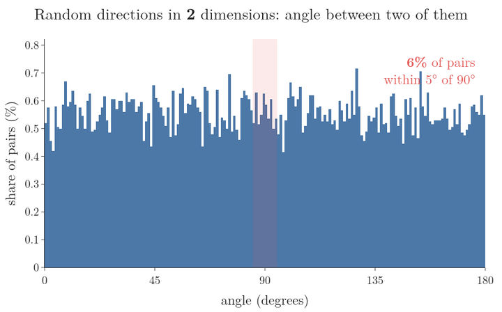
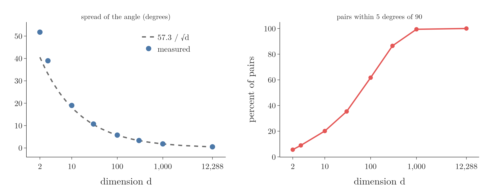
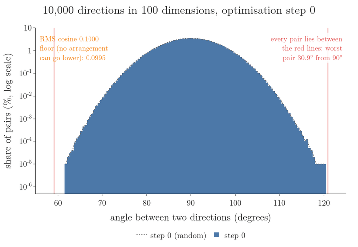
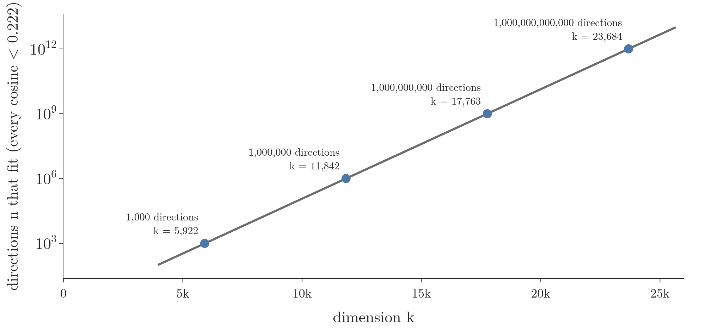
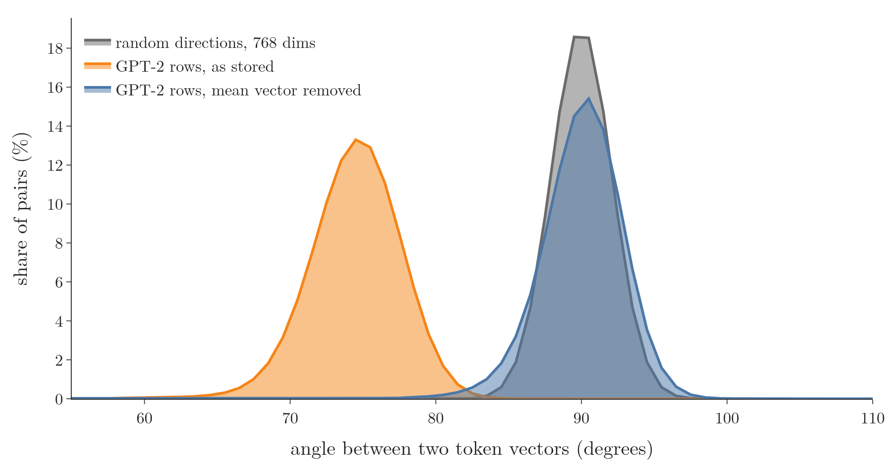
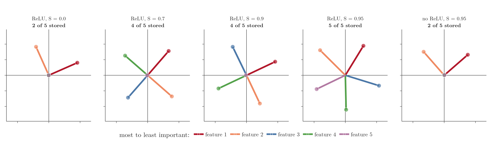
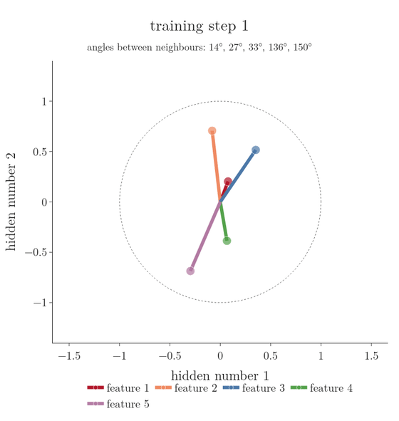

<!-- where-this-fits: generated by course_map/build_map.py; edit concepts.yaml, not this block -->
> **Where this fits:** Pipeline map step 8 (Model). See the [Course map](../../../00-course-map/00-course-map.md).
>
> 
>
> - **Builds on:** [Meaning as direction in embedding space](../../../DL/06-transformers/DL-072-meaning-as-direction/DL-072-meaning-as-direction.md#4-the-difference-between-two-words-is-a-direction).
> - **Compare with:** [Curse of dimensionality](../../../ML/05-dimensionality/ML-045-curse-of-dimensionality/ML-045-curse-of-dimensionality.md#2-what-the-curse-of-dimensionality-is).
<!-- /where-this-fits -->

## 1. Overview

> **Key point:** A space of $d$ dimensions holds only $d$ exactly perpendicular directions but far more **nearly** perpendicular ones, and the **superposition hypothesis** (G-1916) says neural networks use this room to store more features than they have dimensions, accepting a little interference between them.

[Differences between words are directions](../DL-072-meaning-as-direction/DL-072-meaning-as-direction.md#4-the-difference-between-two-words-is-a-direction) showed that an embedding (a word's list of numbers) stores ideas such as "female" or "plural" as directions. [Rows ask questions](../DL-089-mlp-stores-facts/DL-089-mlp-stores-facts.md#4-rows-ask-questions-the-activation-makes-an-and-gate) and [columns write directions](../DL-089-mlp-stores-facts/DL-089-mlp-stores-facts.md#5-columns-write-directions) showed that the feed-forward block reads directions with the rows of its first matrix and writes directions with the columns of its second. Both raise a question: how many such directions can a vector of 768 or 12,288 numbers hold without the ideas getting mixed up?

This Note answers it in four steps:

1. Random directions in high dimensions are almost always nearly perpendicular (section 4).
2. There is a hard limit on how perpendicular many directions can be, and a generous count of how many fit (sections 5 and 6).
3. The token vectors of a real transformer, GPT-2 small, spread out in the same way (section 7).
4. A small trained model shows superposition happening, and when it does not (section 8).

Figure 1 shows the first fact. It is a histogram: the horizontal axis is an angle in degrees, and the height of each bar is the share (in percent, vertical axis) of the 20,000 random pairs that have an angle in that range; the red band marks 85 to 95 degrees. Each frame uses one dimension. Watch the bars: the spread of angles shrinks towards 90 degrees as the dimension grows.

{width=100%}

**Symbols used in this Note.** Each comes with a small instance; later sections use them without repeating the explanation.

| Symbol | Plain meaning | Small instance |
|---|---|---|
| $\mathbb{R}$ | the real numbers: any number on the number line | $2.5$ and $-7$ are in $\mathbb{R}$ |
| $\mathbb{R}^2$ | all pairs of real numbers: a point on a flat page | $(2, 3)$ |
| $\mathbb{R}^D$ | all lists of $D$ real numbers: a point in $D$ dimensions | $D = 3$: $(2, 3, -1)$ is in $\mathbb{R}^3$ |
| $\in$ | "is a member of" | $(2, 3) \in \mathbb{R}^2$ |
| $d$ | the number of dimensions, the length of the lists | GPT-2 small: $d = 768$ |
| $f: \mathbb{R}^D \to \mathbb{R}^k$ | a rule $f$ that takes a list of $D$ numbers and returns a list of $k$ numbers | $D = 3$, $k = 2$: $f(x_1, x_2, x_3) = (x_1, x_2)$ drops the third number, so $f(2, 3, -1) = (2, 3)$ |
| $\lVert u \rVert$ | the length of the list $u$: square each number, add, take the square root | $u = (3, 4)$: $\sqrt{9 + 16} = 5$ |
| $\lVert u - v \rVert^2$ | the squared distance between two points | $u = (3, 4)$, $v = (0, 0)$: $9 + 16 = 25$ |
| $\varepsilon$ ("epsilon") | a small tolerance, the share by which a distance may change | $\varepsilon = 0.1$ allows a 10 percent change |
| $\ln n$ | the natural logarithm: the power of $e = 2.718$ that gives $n$ | $\ln 1000 = 6.91$ |
| $\sum$ | add up the terms | $x = (2, 3, 4)$: $\sum_{i=1}^{3} x_i = 2 + 3 + 4 = 9$ |
| $E[\cdot]$ | the average over many random draws | $E[\text{die roll}] = 3.5$ |

> **Extra:** Two ideas of this Note follow Sanderson's "How might LLMs store facts" (3Blue1Brown, Deep Learning Chapter 7, 2024): that a space with room for only $n$ perpendicular directions has room for far more nearly perpendicular ones, so it can hold more ideas than it has dimensions (18:03–20:43); and the experiment of nudging 10,000 random 100-dimensional vectors to be more perpendicular while watching the distribution of the angles between them (18:34–19:37). Our figures, the dimension sweep, the bound of section 5 and the toy model are our own; section 5 shows what the optimisation can and cannot reach.

## 2. Prerequisites

- [Columns write directions](../DL-089-mlp-stores-facts/DL-089-mlp-stores-facts.md#5-columns-write-directions): rows of the first matrix read directions, columns of the second write directions; a neuron is one hidden value of the MLP.
- [A dot product reads a direction](../DL-072-meaning-as-direction/DL-072-meaning-as-direction.md#6-a-dot-product-reads-how-much-of-a-direction-a-word-has): ideas stored as directions; a dot product with a direction reads how much of the idea a vector carries.
- [Perpendicular vectors have dot product 0](../../../MA/05-linear-algebra/MA-050-dot-product-and-cosine-similarity/MA-050-dot-product-and-cosine-similarity.md#52-perpendicular-vectors-have-dot-product-0) and [the cosine of the angle between two vectors](../../../MA/05-linear-algebra/MA-050-dot-product-and-cosine-similarity/MA-050-dot-product-and-cosine-similarity.md#6-cosine-similarity).
- [Why more dimensions cause trouble](../../../ML/05-dimensionality/ML-045-curse-of-dimensionality/ML-045-curse-of-dimensionality.md#4-why-more-dimensions-cause-trouble): high-dimensional spaces behave very differently from the 2-D and 3-D spaces we can picture.
- [ReLU](../../02-training/DL-027-activation-functions/DL-027-activation-functions.md#8-relu) (an activation function that outputs $\max(0, z)$ for an input $z$) and [Adam](../../03-optimizers/DL-038-adam/DL-038-adam.md#4-the-update-rule) (a way to update the weights during training), for the toy model of section 8.

## 3. Perpendicular directions do not interfere, but only $d$ of them fit

> **Key point:** If each feature is a direction and we read a feature with a dot product, every other active feature leaks into the reading in proportion to the cosine between their directions. Perpendicular directions leak nothing, but a $d$-dimensional space has room for only $d$ of them.

Suppose a vector $h$ stores several features, each as a unit direction $f_i$ (a vector of length 1) scaled by how strongly the feature is present, $x_i$:

$$h = x_1 f_1 + x_2 f_2 + \dots + x_n f_n$$

To read feature $j$ back, take the dot product with its direction:

$$h \cdot f_j = x_j + \sum_{i \neq j} x_i \thinspace(f_i \cdot f_j)$$

A small instance has $n = 2$ features in $d = 2$ dimensions:

- $f_1 = (1, 0)$ and $f_2 = (0.6, 0.8)$; both have length 1.
- Their dot product, the cosine of the angle between them, is 0.6.
- The strengths are $x_1 = 2$ and $x_2 = 3$.

The stored vector is:

$$h = 2 \times (1, 0) + 3 \times (0.6, 0.8)$$

$$h = (2, 0) + (1.8, 2.4)$$

$$h = (3.8, 2.4)$$

Reading feature 1:

$$h \cdot f_1 = 3.8 \times 1 + 2.4 \times 0$$

$$h \cdot f_1 = 3.8$$

The formula gives the same number:

$$x_1 + x_2 \times (f_2 \cdot f_1) = 2 + 3 \times 0.6$$

$$x_1 + x_2 \times (f_2 \cdot f_1) = 3.8$$

The reading is 3.8 instead of the stored 2. The extra 1.8 is the leak from feature 2.

The first term is what we want. The sum is **interference** (G-962): every other active feature leaks in, weighted by the cosine $f_i \cdot f_j$. If all the directions are perpendicular, every cosine is 0 and the reading is exact (Figure 2).

{width=100%}

The catch: non-zero vectors that are all perpendicular to each other are **linearly independent** (G-1102; none of them can be built from the others), and a $d$-dimensional space has at most $d$ independent vectors. So with exact perpendicularity, $d$ dimensions store at most $d$ features. GPT-2 small's vectors have $d = 768$ numbers. To store more than 768 features in them, the directions must be allowed to be only **nearly perpendicular** (G-1307), at the price of a little interference.

## 4. Random directions are nearly perpendicular

> **Key point:** Two random directions in $d$ dimensions have a cosine with mean 0 and mean square $1/d$, so their angle is spread about $57.3/\sqrt{d}$ degrees around 90. In 100 dimensions, 62 percent of random pairs lie within 5 degrees of perpendicular; in 1,000 dimensions, 99 percent.

1. **In words:** fix one unit vector $v$ and pick another, $u$, uniformly at random on the sphere. By symmetry no coordinate of $u$ is special, so each $u_k^2$ has the same average; the $d$ of them add up to $\lVert u \rVert^2 = 1$, so each averages $1/d$.
   A small instance first, $d = 3$: $u = (u_1, u_2, u_3)$ and $v = (1, 0, 0)$. The squares of $u$ add to 1:

   $$u_1^2 + u_2^2 + u_3^2 = 1$$

   Then $u \cdot v$ picks out the first number of $u$:

   $$u \cdot v = u_1$$

   $$(u \cdot v)^2 = u_1^2$$

   The three squares share a total of 1 and no coordinate is special, so each averages one third:

   $$E\left[(u \cdot v)^2\right] = E\left[u_1^2\right] = \frac{1}{3}$$

   The table below measures 0.331 for $d = 3$.
2. **Formula:** for a general unit vector $v$, the dot product is a sum over the coordinates $k = 1, \dots, d$:
   $$u \cdot v = \sum_k u_k v_k$$
   Squaring gives the squares $u_k^2 v_k^2$ plus cross terms $u_k u_l v_k v_l$ (for $k \ne l$). The cross terms average to zero (flipping the sign of $u_k$ is equally likely), leaving
   $$E\left[(u \cdot v)^2\right] = \sum_k v_k^2 \thinspace E\left[u_k^2\right]$$
   $$E\left[u_k^2\right] = \frac{1}{d}$$
   $$E\left[(u \cdot v)^2\right] = \frac{1}{d}\sum_k v_k^2 = \frac{1}{d}$$
   The last step uses $\sum_k v_k^2 = 1$ ($v$ is a unit vector). The cosine has mean 0 and a typical size of $1/\sqrt{d}$.

   Near 90 degrees a small cosine $c$ is an angle of about $c$ radians (a unit of angle) away from 90 degrees. One radian is 57.3 degrees:
   $$c \text{ radians} = 57.3 \thinspace c \text{ degrees}$$
   so the angle is spread about $57.3/\sqrt{d}$ degrees.
3. **Example:** $d = 100$ gives an angle spread of 5.7 degrees:
   $$\frac{57.3}{\sqrt{100}} = \frac{57.3}{10} = 5.7$$

The Notebook draws 20,000 random pairs for each dimension (Figure 1):

| Dimension $d$ | Mean of $\cos^2$ (theory $1/d$) | Spread of the angle, degrees (theory $57.3/\sqrt{d}$) | Pairs within 5 degrees of 90 |
|---|---|---|---|
| 3 | 0.331 (0.333) | 39.0 (33.1) | 9 percent |
| 10 | 0.0996 (0.1) | 19.0 (18.1) | 20 percent |
| 100 | 0.0100 (0.01) | 5.75 (5.73) | 62 percent |
| 1,000 | 0.0010 (0.001) | 1.82 (1.81) | 99 percent |
| 12,288 | 0.0001 (0.0001) | 0.52 (0.52) | 100 percent |

The mean square matches $1/d$ in every row. The spread matches $57.3/\sqrt{d}$ once angles stay close to 90 degrees ($d \ge 30$); in 3 dimensions the small-angle step does not hold (Figure 3).

{width=100%}

In 2 or 3 dimensions random directions point anywhere; in thousands of dimensions they are almost all nearly perpendicular. This is one more way in which high-dimensional space is unlike the space we can picture (see [why more dimensions cause trouble](../../../ML/05-dimensionality/ML-045-curse-of-dimensionality/ML-045-curse-of-dimensionality.md#4-why-more-dimensions-cause-trouble)).

## 5. How perpendicular can many directions be made?

> **Key point:** For $N$ unit directions in $d$ dimensions the mean squared cosine is at least $(N/d - 1)/(N - 1)$. For 10,000 directions in 100 dimensions that floor is 0.0099, almost exactly what random directions already have (0.0100). Optimisation can still trim the worst pairs, from 30.9 to 15.8 degrees away from perpendicular, but it cannot narrow the bulk of the histogram.

Random directions are a starting point. Can we nudge them to be *more* perpendicular? First, a limit.

1. **In words:** put the $N$ unit vectors as the rows of a table $U$ with $N$ rows and $d$ columns. The table $G$ of all their dot products has 1s on its diagonal and the cosines elsewhere. Because $U$ has only $d$ columns, $G$ has at most $d$ non-zero **eigenvalues** (the numbers that describe how $G$ stretches space; here they are a list of $d$ numbers that must add up to the diagonal sum, $N$). A list of numbers with a fixed sum has the smallest sum of squares when all the numbers are equal; the sum of squares is what bounds the cosines.
2. **Worked instance, $N = 3$ directions in $d = 2$ dimensions.** The best arrangement is three arrows 120 degrees apart, so every cosine is $\cos 120^\circ = -0.5$:
   $$G = \begin{pmatrix} 1 & -0.5 & -0.5 \cr-0.5 & 1 & -0.5 \cr-0.5 & -0.5 & 1 \end{pmatrix}$$
   Its eigenvalues are 1.5, 1.5 and 0: two non-zero ones (at most $d = 2$) adding to 3, which is $N$. The sum of their squares:
   $$1.5^2 + 1.5^2 = 4.5$$
   Any other split of 3 into two numbers gives more:
   $$2^2 + 1^2 = 5$$
   $$3^2 + 0^2 = 9$$
   The squared entries of $G$ add to the same 4.5:
   $$3 \times 1^2 + 6 \times (-0.5)^2$$
   $$= 3 + 1.5 = 4.5$$
   The diagonal contributes 3, so the 6 off-diagonal cosines share 1.5. Their mean of $\cos^2$ is:
   $$\frac{1.5}{6} = 0.25$$
   The formula below gives the same number:
   $$\frac{3/2 - 1}{3 - 1} = 0.25$$
3. **Formula:** with eigenvalues $\lambda_1, \dots, \lambda_d$ adding up to $N$, the squared entries of $G$ add to the squared eigenvalues, which are at least the equal-split value:
   $$\sum_{i,j} G_{ij}^2 = \sum_k \lambda_k^2 \ge d \times \left(\frac{N}{d}\right)^2 = \frac{N^2}{d}$$
   The diagonal contributes $N$, so the $N(N-1)$ off-diagonal cosines satisfy
   $$\sum_{i \neq j} G_{ij}^2 \ge \frac{N^2}{d} - N$$
   $$\text{mean of } \cos^2 \ge \frac{N^2/d - N}{N(N-1)} = \frac{N/d - 1}{N - 1}$$
4. **Example:** $N = 10{,}000$, $d = 100$:
   $$\frac{10{,}000/100 - 1}{10{,}000 - 1} = \frac{99}{9{,}999} = 0.0099$$
   The root-mean-square cosine is at least:
   $$\sqrt{0.0099} = 0.0995$$
   Since the mean square is at least that big, some pair must have a cosine of 0.0995 or more: at least 5.7 degrees away from perpendicular. No arrangement keeps every pair within 89 to 91 degrees, which would need every cosine below 0.0175.

Random directions have a mean of $\cos^2$ equal to $1/d = 0.0100$, a hair above the floor of 0.0099. So the bulk of the histogram cannot get narrower. What optimisation *can* do is pull in the rare pairs far from 90 degrees.

The Notebook takes 10,000 random directions in 100 dimensions and runs 60 steps of **gradient descent** (G-862) on the sum of $\cos^8$ over all pairs (the high power pushes hardest on the worst pairs), rescaling each vector to length 1 after every step. Figure 4 shows the histogram at every step, on a log scale so that the rare far-off pairs stay visible.

{width=100%}

| Step | Worst pair, degrees from 90 | Root-mean-square cosine | Pairs within 89–91 degrees |
|---|---|---|---|
| 0 (random) | 30.9 | 0.1000 | 13.8 percent |
| 10 | 18.8 | 0.0995 | 13.7 percent |
| 60 | 15.8 | 0.0995 | 13.1 percent |

Watch the red lines move in while the middle of the histogram stays put. The root-mean-square cosine drops to the floor, 0.0995, within 10 steps and cannot go lower; the share of pairs within 89–91 degrees stays near 13 percent.

## 6. The room grows exponentially with the dimension

> **Key point:** The Johnson–Lindenstrauss lemma implies that the dimension needed for $n$ nearly perpendicular directions grows only with $\log n$. Turned around, the number of directions that fit grows exponentially with the dimension: going from about 5,900 to 11,800 dimensions raises the guaranteed count from a thousand to a million.

Section 5 fixed the number of directions and the dimension and asked how perpendicular they can be. The opposite question is how many directions fit if we allow every angle to be a few degrees off 90, and how that count grows with the dimension. A classic result answers it.

The **Johnson–Lindenstrauss lemma** (G-984) says: a cloud of points in many dimensions can be copied into far fewer dimensions with every distance kept almost the same. Before the formula, one small instance of its two pieces (the symbols are in the table of section 1):

- **The points and the map.** $n = 2$ points in $\mathbb{R}^3$ ($D = 3$): $u = (3, 4, 0)$ and $v = (0, 0, 0)$. A map $f$ into $\mathbb{R}^2$ ($k = 2$) that drops the third number gives $f(u) = (3, 4)$ and $f(v) = (0, 0)$.
- **Distances kept within $\varepsilon$.** The squared distance before is 25, and after it is 25 too: kept exactly here.

  $$\lVert u - v \rVert^2 = 9 + 16 + 0 = 25$$

  $$\lVert f(u) - f(v) \rVert^2 = 9 + 16 = 25$$

  With $\varepsilon = 0.2$ the lemma would allow any value from 20 to 30:

  $$(1 - 0.2) \times 25 = 20$$

  $$(1 + 0.2) \times 25 = 30$$
- **How many dimensions $k$ are needed.** The lemma's bound grows with $\ln n$. Two instances follow, with the bound itself stated after them.

For $n = 3$ points and $\varepsilon = 0.5$, one step per line:

$$\varepsilon^2/2 - \varepsilon^3/3$$

$$= 0.125 - 0.0417 = 0.0833$$

$$4 \ln 3 = 4 \times 1.0986$$

$$= 4.394$$

$$k \ge \frac{4.394}{0.0833} = 52.7$$

So $k = 53$ dimensions suffice. For $n = 1{,}000$ and $\varepsilon = 0.1$:

$$\varepsilon^2/2 - \varepsilon^3/3$$

$$= 0.005 - 0.00033 = 0.00467$$

$$4 \ln 1000 = 4 \times 6.908 = 27.63$$

$$k \ge \frac{27.63}{0.00467} = 5{,}922$$

This is the first row of the table below. The bound is generous: it is a guarantee for every possible cloud, not what a typical cloud needs.

Now the statement, in the form proved by Dasgupta and Gupta (2003, Theorem 2.1): for any $0 < \varepsilon < 1$ and any $n$ points in $\mathbb{R}^D$, if

$$k \ge \frac{4 \ln n}{\varepsilon^2/2 - \varepsilon^3/3}$$

then there is a map $f$ into $\mathbb{R}^k$ that keeps every squared distance within a factor $1 \pm \varepsilon$:

$$(1 - \varepsilon)\lVert u - v \rVert^2 \le \lVert f(u) - f(v) \rVert^2$$

$$\lVert f(u) - f(v) \rVert^2 \le (1 + \varepsilon)\lVert u - v \rVert^2$$

Their map $f$ is a scaled projection onto a random $k$-dimensional subspace, so it is linear and sends the origin to the origin.

**From distances to angles.** Take the $n$ perpendicular unit vectors $e_1, \dots, e_n$ of $\mathbb{R}^n$, plus the origin: $n + 1$ points.

1. Distances to the origin are kept, so each image has $\lVert f(e_i) \rVert^2$ between $1 - \varepsilon$ and $1 + \varepsilon$.
2. $\lVert e_i - e_j \rVert^2 = 2$, so $\lVert f(e_i) - f(e_j) \rVert^2$ lies between $2(1 - \varepsilon)$ and $2(1 + \varepsilon)$.
3. Expanding a squared distance gives the dot product of the images:

   $$f(e_i) \cdot f(e_j) = \tfrac{1}{2}\big(\lVert f(e_i) \rVert^2 + \lVert f(e_j) \rVert^2$$

   $$- \lVert f(e_i) - f(e_j) \rVert^2\big)$$

   It therefore lies between $-2\varepsilon$ and $2\varepsilon$.
4. Dividing by the lengths, each cosine is at most $2\varepsilon/(1 - \varepsilon)$ in size.

So $n$ directions with every cosine below $2\varepsilon/(1 - \varepsilon)$ fit in $k$ dimensions. With $\varepsilon = 0.1$:

$$\frac{2 \times 0.1}{1 - 0.1} = 0.222$$

Every cosine is at most 0.222, so every angle is within 12.8 degrees of 90. The Notebook gives:

| Directions $n$ | Dimension $k$ that guarantees it |
|---|---|
| 1,000 | 5,922 |
| 1,000,000 | 11,842 |
| 1,000,000,000 | 17,763 |
| 1,000,000,000,000 | 23,684 |

Each extra 5,920 or so dimensions multiplies the guaranteed number of directions by 1,000 (Figure 5).

{width=90%}

The guarantee is cautious: in the Notebook, 10,000 *random* directions in 768 dimensions already have every pair within 12.1 degrees of perpendicular, and in 12,288 dimensions within 2.9 degrees. Elhage et al. (2022, "The Superposition Hypothesis") point to the same lemma: only $n$ orthogonal vectors fit in $n$ dimensions, but $\exp(n)$ many "almost orthogonal" ones do.

## 7. Real token vectors spread out the same way

> **Key point:** GPT-2 small stores 50,257 tokens in 768 dimensions, 65 times more tokens than dimensions. Apart from one shared mean vector, its token vectors sit at 90.0 degrees from each other on average, with a spread of 2.8 degrees, close to random directions (2.1 degrees).

The Notebook takes 3,000 random rows of GPT-2 small's token-embedding table (one list of 768 numbers for each **token**, a word or word piece; see [the same structure inside a transformer](../DL-072-meaning-as-direction/DL-072-meaning-as-direction.md#7-the-same-structure-inside-a-transformer)) and measures all 4.5 million angles between them (Figure 6).

{width=100%}

| | Mean angle | Spread | Pairs within 5 degrees of 90 |
|---|---|---|---|
| GPT-2 rows, as stored | 74.4 | 3.2 | 0 percent |
| GPT-2 rows, mean vector removed | 90.0 | 2.8 | 93 percent |
| Random directions, 768 dimensions | 90.0 | 2.1 | 98 percent |

As stored, every token vector shares a common component, the table's mean vector, so all pairs lean towards each other (74 degrees). Remove that one shared direction, and the 50,257 token vectors spread out almost like random directions: 93 percent of pairs lie within 5 degrees of perpendicular, although there are 65 times more tokens than dimensions.

## 8. The superposition hypothesis and a toy model

> **Key point:** The superposition hypothesis says networks represent more features than they have dimensions, as nearly perpendicular directions. In a toy model with 5 features and 2 hidden numbers, a ReLU model stores only the 2 most important features when features are always active, but all 5 when each is active only 5 percent of the time (as a regular pentagon when the 5 are equally important). Without the ReLU it never stores more than 2.

**The hypothesis.** Elhage et al. (2022) name the idea: "the superposition hypothesis". Neural networks "want to represent more features than they have neurons", so they exploit the room of section 6 to simulate a larger network. A **feature** (G-772) here is a property of the input the network represents, such as "this token refers to a specific famous person" or "this clause describes music" (the paper's examples). Superposition is offered as a *hypothesis*: it explains observations, and toy models show it can happen, but it is not proven for large models. It explains one observation in particular: many neurons are **polysemantic** (G-1517), responding to several unrelated features.

### 8.1 The toy model

> **Key point:** Squeeze 5 features into 2 numbers with a matrix $W$, unsqueeze with $W^T$, add a bias and apply ReLU. Training decides which features get a direction.

The setup follows Elhage et al. (2022, "Demonstrating Superposition"):

- **Data:** each observation has 5 features $x_1, \dots, x_5$. Each feature is 0 with probability $S$, the **sparsity**, and otherwise a random number between 0 and 1.
- **Model:** $W$ is a matrix with 2 rows and 5 columns. It squeezes the 5 numbers into 2:

  $$h = Wx$$

  The output unsqueezes $h$ back to 5 numbers, adds a bias $b$ (one number per feature) and applies ReLU:

  $$x' = \text{ReLU}(W^T h + b)$$

  $$x' = \text{ReLU}(W^T W x + b)$$

  Column $W_i$ is feature $i$'s direction in the 2-number space. A small instance: $W$ has 2 rows and 5 columns (10 numbers); for $x = (1, 0, 0, 0, 0)$, only feature 1 is active, so $h = Wx = W_1$, the first column: feature 1 lands exactly on its own direction. $W^T$ is $W$ turned on its side (5 rows, 2 columns), which reads $h$ back out into 5 numbers.
- **Loss:** the weighted squared error, where the **importance** (G-925) $I_i$ says how much each feature matters:

  $$L = \sum_i I_i\thinspace(x_i - x'_i)^2$$

  For example, with $I_1 = 1$, a stored $x_1 = 0.8$ read back as $x'_1 = 0.5$ adds to the loss:

  $$1 \times (0.8 - 0.5)^2 = 0.09$$
- **Training (Notebook):** Adam, 6,000 steps of 1,024 random observations, 5 random starts per setting; we keep the run with the lowest loss (for its 10-feature, 5-neuron figures the paper keeps the best of 1,000 runs).

### 8.2 Sparse features are stored in superposition

> **Key point:** As the features get sparser, the model stores 2, then 4, then all 5 of them in its 2 numbers.

Figure 7 shows the trained directions $W_i$ with importance falling as $I_i = 0.7^i$ (feature 1 matters most). Each panel is the plane of the 2 hidden numbers; each coloured line from the centre is one feature's direction $W_i$ (the legend gives the colour of each feature). A short or missing line means the feature is not stored. A feature counts as stored when its direction has length above 0.5.

{width=100%}

| Model | Sparsity $S$ | Features stored | What the directions look like |
|---|---|---|---|
| ReLU | 0 (always active) | 2 | features 1 and 2 at 90 degrees; 3, 4, 5 dropped |
| ReLU | 0.7 | 4 | two opposite pairs |
| ReLU | 0.9 | 4 | two opposite pairs |
| ReLU | 0.95 | 5 | all five, spread around the circle |
| no ReLU | 0.95 | 2 | features 1 and 2 at 90 degrees |

With dense features the model does what a linear method such as PCA would do: it keeps the two most important features on perpendicular directions and drops the rest (PCA, principal component analysis, keeps the directions along which the data varies most). Elhage et al. (2022) describe the same result: "With dense features, the model learns to represent an orthogonal basis of the most important two features". As features get sparser, more of them share the 2 numbers. Without the ReLU, the model keeps only 2 even when features are sparse: "the linear model always learns the top $m$ most important features" (Elhage et al. 2022).

With 5 equally important features ($I_i = 1$) at $S = 0.95$, the directions spread out evenly. Figure 8 shows the training. Watch the 5 arrows push apart until the angles between neighbours are all close to 72 degrees, the angles of a regular pentagon. The paper reports the same regular pentagon for this setting (Elhage et al. 2022, "Perturbing a Single Feature").

{width=80%}

### 8.3 Why sparsity and the ReLU make it work

> **Key point:** In the pentagon, one active feature leaks a little into its two near neighbours and a lot of negative into the two far ones; the negative bias and the ReLU cut most of it away. When two features are active at once, the leaks add up and the outputs go wrong, so superposition only pays when features are rarely active together.

From the trained pentagon (Notebook): every bias is about $-0.24$, and the cosine-like products $W_i \cdot W_j$ are about $1.28$ for a feature with itself, $0.39$ for its two neighbours, and $-1.04$ for the two far features. Feed in feature 1 alone, $x = (1, 0, 0, 0, 0)$:

| Output for feature | 1 | 2 (far) | 3 (near) | 4 (near) | 5 (far) |
|---|---|---|---|---|---|
| $W^TWx + b$ | 1.02 | −1.26 | 0.16 | 0.14 | −1.29 |
| After ReLU | **1.02** | 0 | 0.16 | 0.14 | 0 |

Feature 1 is read back almost exactly. The interference into the far features is negative, and the ReLU removes it entirely; the interference into the near features (0.39 before the bias) is reduced by the negative bias to about 0.15. Elhage et al. (2022) summarise this: superposition works "at the cost of 'interference' that requires nonlinear filtering". A linear output has no ReLU to remove the negative leaks, which is why the no-ReLU model never stores more than 2.

Now make features 1 and 2 active together, $x = (1, 1, 0, 0, 0)$: the outputs become $0.01, 0.04, 0.59, 0, 0$. Both active features are nearly lost, and feature 3, which is absent, reads 0.59. With $S = 0.95$ two features are active together only rarely, so the model accepts these rare errors in exchange for storing all 5. With dense features they would happen all the time, which is why the dense model stores only 2.

### 8.4 What this means for neurons

> **Key point:** If a model stores features in superposition, a feature is a direction across many neurons, not one neuron, and one neuron takes part in many features.

The MLP of GPT-2 has 4 times as many hidden neurons as the vector has numbers ([the MLP block in one formula](../DL-089-mlp-stores-facts/DL-089-mlp-stores-facts.md#3-the-mlp-block-in-one-formula)). Each neuron's activation measures how well the vector aligns with one row of the first matrix. If the model stores more features than it has neurons, as nearly perpendicular directions, then a feature cannot be one neuron lighting up: it is a particular combination of neurons, and each neuron is shared by several features. That is the polysemantic behaviour the superposition hypothesis sets out to explain (Elhage et al. 2022). It also makes models hard to read neuron by neuron.

## 9. Summary

| Fact | Evidence |
|---|---|
| Only $d$ exactly perpendicular directions fit in $d$ dimensions | perpendicular non-zero vectors are linearly independent |
| Random directions are nearly perpendicular; spread about $57.3/\sqrt{d}$ degrees | derivation; 62 percent within 5 degrees at $d = 100$, 99 percent at $d = 1{,}000$ |
| Mean squared cosine of $N$ directions is at least $(N/d - 1)/(N - 1)$ | derivation; optimising 10,000 directions in 100-d trims the worst pair from 30.9 to 15.8 degrees but stays at the floor |
| The number of nearly perpendicular directions grows exponentially with $d$ | Johnson–Lindenstrauss (Dasgupta and Gupta 2003); a million directions with every cosine below 0.222 in 11,842 dimensions |
| Real token vectors spread like random ones | GPT-2 small, mean vector removed: 90.0 ± 2.8 degrees |
| Sparse features are stored in superposition | toy model: 2 of 5 features stored when dense, all 5 (a pentagon) at 95 percent sparsity; never more than 2 without ReLU |

- Perpendicular directions never interfere, because every cosine between them is 0, but only $d$ of them fit, because perpendicular vectors are linearly independent.
- Nearly perpendicular directions interfere a little, because each leak is weighted by a small cosine, and exponentially many of them fit, so a 768-number vector has room for far more than 768 ideas.
- The superposition hypothesis: networks store more features than dimensions this way, filtering the interference with non-linearities such as ReLU; without the ReLU, the toy model never stored more than 2 features.
- It pays only when features are sparse, so that few of them are active at once, because two features active together add their leaks and the readings go wrong.
- If models work this way, a feature is a direction across many neurons, so reading a model neuron by neuron is hard (polysemantic neurons).
- So the answer to the opening question: a vector holds only $d$ ideas with no mixing, but far more with a little mixing, as long as the ideas are rarely active together.

## 10. Sources

**Built from**

- Sanderson, G. (3Blue1Brown), "How might LLMs store facts | Deep Learning Chapter 7", 2024, 3blue1brown.com/lessons/mlp, https://www.youtube.com/watch?v=9-Jl0dxWQs8. Superposition as a hypothesis, nearly perpendicular directions, the distribution of angles between 10,000 optimised 100-dimensional vectors, and Johnson–Lindenstrauss (16:59–21:14).
- Elhage, N., Hume, T., Olsson, C., Schiefer, N., Henighan, T., Kravec, S., Hatfield-Dodds, Z., Lasenby, R., Drain, D., Chen, C., Grosse, R., McCandlish, S., Kaplan, J., Amodei, D., Wattenberg, M. and Olah, C. (2022). Toy Models of Superposition. *Transformer Circuits Thread*, 14 September 2022. transformer-circuits.pub/2022/toy_model. Sections "Background and Motivation", subsection "The Superposition Hypothesis" (the hypothesis, polysemantic neurons, $\exp(n)$ almost-orthogonal vectors via Johnson–Lindenstrauss); "Demonstrating Superposition" (the data: sparsity $S_i$ and importance $I_i$; the linear and ReLU output models $x' = \text{ReLU}(W^TWx + b)$; the dense two-feature result; the linear model keeps the top $m$ features; best of 1,000 runs); "The Geometry of Superposition", "Perturbing a Single Feature" ($n = 5$, $m = 2$, $I = 1$, $1 - S = 0.05$ gives a regular pentagon); introduction ("interference that requires nonlinear filtering").

**Other references**

- Dasgupta, S. and Gupta, A. (2003). An Elementary Proof of a Theorem of Johnson and Lindenstrauss. *Random Structures and Algorithms*, 22(1), 60–65. Theorem 2.1 (the bound on $k$ and the $1 \pm \varepsilon$ distortion); proof of Theorem 2.1 (the map is $\sqrt{d/k}$ times the projection onto a random $k$-dimensional subspace).
- Radford, A., Wu, J., Child, R., Luan, D., Amodei, D. and Sutskever, I. (2019). Language Models are Unsupervised Multitask Learners. OpenAI. Weights: `openai-community/gpt2` (token-embedding table, 50,257 × 768), huggingface.co.

## 11. Key terms

Terms taught in this Note come first; linked terms are recaps, taught in the Note the link opens.

| Term | Meaning |
|---|---|
| Superposition hypothesis (G-1916) | The proposal that real neural networks store features in superposition (Elhage et al. 2022). |
| Interference (G-962) | The part of a feature's reading that comes from other active features, in proportion to the cosines between their directions. |
| Nearly perpendicular (G-1307) | Two directions whose angle is close to 90 degrees, so their cosine (and dot product) is close to 0; letting feature directions be only nearly perpendicular lets a vector of $d$ numbers store more than $d$ features, at the price of a little interference. |
| Johnson–Lindenstrauss lemma (G-984) | A cloud of $n$ points in many dimensions can be copied into far fewer dimensions, about $\log n/\varepsilon^2$, with every squared distance kept within a factor $1 \pm \varepsilon$. |
| Polysemantic neuron (G-1517) | A neuron that responds to several unrelated features. |
| Importance $I_i$ (G-925) | The weight of feature $i$ in the toy model's loss. |
| Sparsity $S$ (G-1848) | The probability that a feature is 0 in an observation; high sparsity means the feature is rarely active. |
| Superposition (G-1917) | A network storing more features than it has dimensions by giving each feature its own nearly perpendicular direction. |
| Toy model of superposition (G-1994) | A tiny network that squeezes more features than it has hidden numbers and is trained to rebuild its input, $x' = \text{ReLU}(W^TWx + b)$; it shows when a network stores more features than dimensions (superposition). |
| [Linearly independent](../../../MA/05-linear-algebra/MA-052-linear-combinations-span-and-basis/MA-052-linear-combinations-span-and-basis.md#7-linear-dependence-and-independence) (G-1102) | Said of a set of vectors in which none can be built from the others, so each one adds a new direction to the span. |
| [Gradient descent](../../../ML/06-regression/ML-056-gradient-descent/ML-056-gradient-descent.md#1-overview) (G-862) | Finding the lowest point of a function by repeated small steps downhill. |
| [Feature](../../../ML/01-foundations/ML-002-ai-vs-ml-vs-dl/ML-002-ai-vs-ml-vs-dl.md#52-features-chosen-by-us-or-learned) (G-772) | One piece of information about each example that a model uses (e.g. a student's CGPA). |
