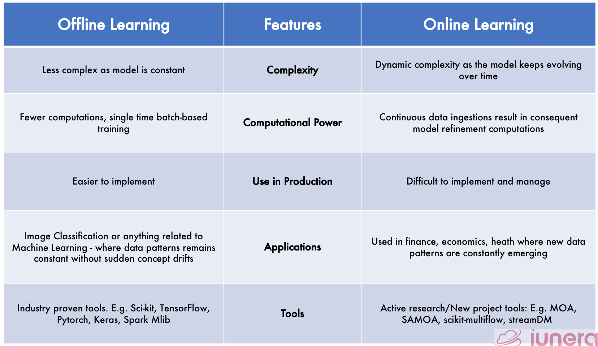

# Batch vs Online Machine Learning

## Batch (Offline) Machine Learning

Batch Machine Learning involves training a model on an entire dataset at once. The training process occurs offline, and the trained model is then deployed to a server. This method is ideal when all the data is available beforehand, and there is no need for real-time updates. The model is updated periodically when new data becomes available.

### Cons

* **Not Real-Time**: Unsuitable for scenarios requiring real-time data processing or updates.
* **Delayed Updates**: Model updates depend on the availability of new data, which may lead to outdated predictions.

## Online Machine Learning

Online Machine Learning is a method where the model learns incrementally, processing one data point (or a small batch of data points) at a time. Unlike batch learning, it does not require the entire dataset to be available upfront. Instead, the model dynamically updates itself as new data arrives, making it suitable for real-time applications. Since the training is done in small batches, it can be done on the deployment server

### How It Works

1. **Initial Training**: The model is initialized and trained on an initial dataset (if available).
2. **Prediction**: When new data arrives, the model makes predictions based on its current state.
3. **Dynamic Learning**: After making predictions, the model updates itself using the new data. This process is often done using algorithms like stochastic gradient descent (SGD).
4. **Continuous Updates**: The model continuously improves as more data is received, adapting to changes in the data distribution over time.

### Key Characteristics

* **Real-Time Learning**: The model learns and updates itself in real-time.
* **Adaptability**: It can adapt to changing data patterns (concept drift).
* **Efficiency**: Suitable for scenarios where storing or processing large datasets is impractical.

### When to use

* Concept drift (dynamic changes in scenarios)
* Cost effective
* Faster solution

### Examples

* **Spam Email Filtering**:

A spam filter learns from user feedback (e.g., marking emails as spam or not).
As new emails arrive, the filter updates its model to improve accuracy.

* **Stock Price Prediction**:

A model predicts stock prices based on real-time market data.
It updates itself with every new data point to adapt to market trends.

* **Recommendation Systems**:

Online learning is used in platforms like Netflix or Amazon to update recommendations based on user interactions (e.g., clicks, views, purchases).

* **Fraud Detection**:

A fraud detection system learns from new transaction data to identify fraudulent activities dynamically.

### How to implement 
* sklearn sdg partial fir 
* River library for streaming data
* vpoal wabbit

### Learning Rate
* If you train the model too frequently then it might not give accurate results so it advisable to set a proper learning rate i.e. learn only if you have n number of data points 

### Out-of-Core Learning

Out-of-core learning is a type of technique that enables models to learn from data that is too large to fit in memory. This is achieved by processing the data in chunks, using hard disk storage as an extension of memory. Out-of-core learning algorithms are designed to minimize the number of times the data needs to be read from disk, making them more efficient than traditional batch algorithms. So in essence it behaves like online learning

### Cons

* Tricky to use 
* Risky

