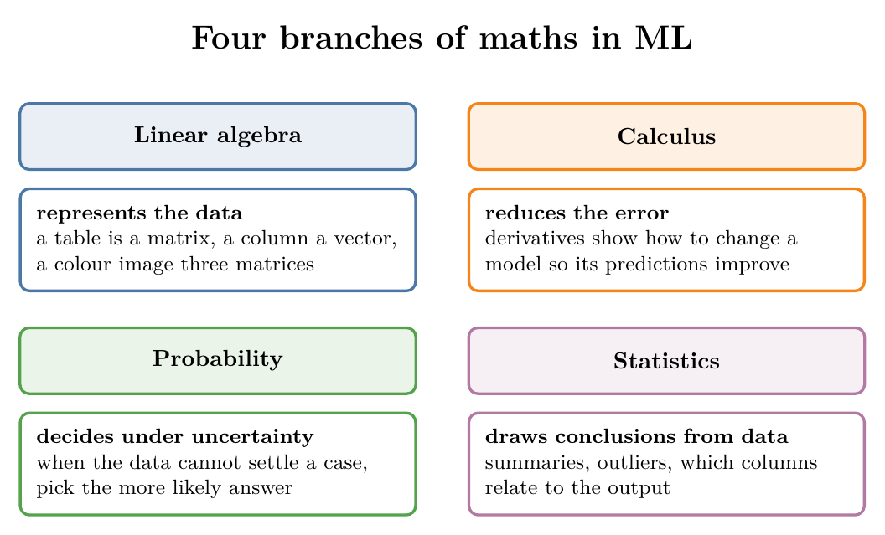
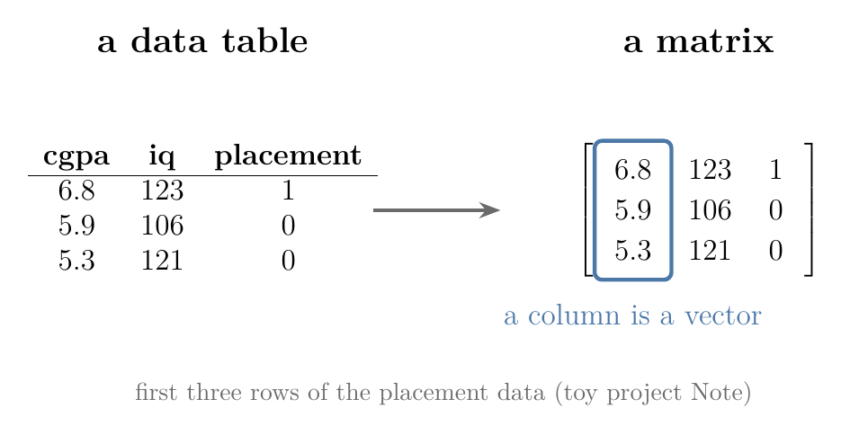
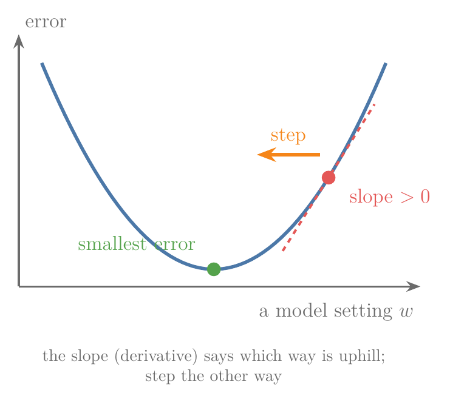
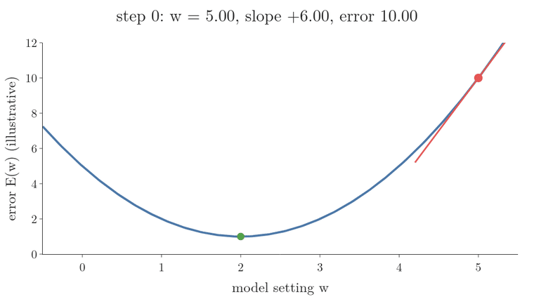
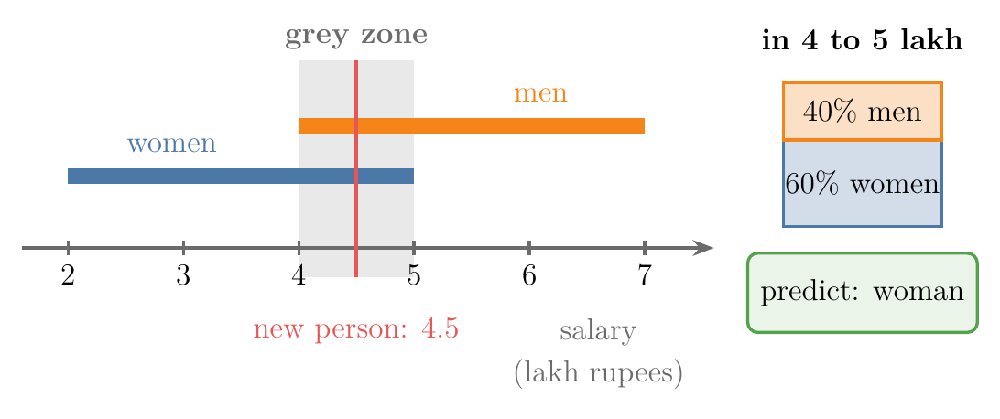
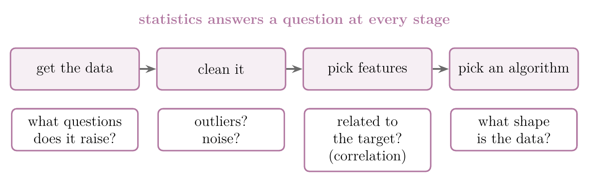

<!-- where-this-fits: generated by course_map/build_map.py; edit concepts.yaml, not this block -->
> **Where this fits:** Pipeline map step 0 (Foundations). See the [Course map](../../../00-course-map/00-course-map.md).
>
> 
>
> - **Leads to:** How to learn the maths for ML ([Note MA-002](../../../MA/00-why-maths/MA-002-learning-maths-for-ml/MA-002-learning-maths-for-ml.md)).
<!-- /where-this-fits -->

## 1. Overview

> **Key point:** Four branches of mathematics carry most of ML: linear algebra stores the data, calculus improves the model, probability decides when the data is unclear, and statistics draws conclusions from the data.

ML is not magic: every algorithm is mathematics running on data. To understand why an algorithm works, and to fix it when it does not, we need the mathematics underneath.

{height=55%}

Figure 1 shows the four branches and the job each one does. This Note gives a first feel for each job and points to the Notes where each branch is taught. The details come in those Notes.

## 2. Linear algebra: representing data

> **Key point:** Linear algebra gives us the containers for data (vectors, matrices and tensors) and the operations that act on a whole container at once.

**Linear algebra** (G-1090) stores every kind of data (tables, text, images, video) as vectors, **matrices** (G-1180) and **tensors** (G-1957), and acts on a whole container in one step; section 6 of the [vectors and feature vectors Note](../../05-linear-algebra/MA-048-vectors-and-feature-vectors/MA-048-vectors-and-feature-vectors.md) explains why ML needs it. How each kind of data becomes a tensor is shown in the [tensors Note](../../../ML/01-foundations/ML-010-tensors/ML-010-tensors.md).

{width=75%}

Figure 2 shows the first step of linear algebra in ML: the table we read becomes a matrix the computer can act on in one step.

The [linear algebra roadmap Note](../../05-linear-algebra/MA-047-linear-algebra-roadmap/MA-047-linear-algebra-roadmap.md) lists every linear algebra topic ML needs.

## 3. Calculus: reducing the error

> **Key point:** Predictions are never perfect; calculus tells us how to change a model so that its error shrinks.

**Calculus** (G-339) is the branch of mathematics about change: differentiation (slopes) and integration (areas). For beginners it is usually the hardest of the four.

An ML model predicts something, and its predictions are never exactly right. The gap between the prediction and the truth is the **error**. Training a model means changing it until the error is as small as we can get it, which is called **optimisation** (G-1400).

Most optimisation methods are built on calculus. The **derivative** (G-595) of the error tells us in which direction to change each part of the model so the error goes down. [Gradient descent](../../../ML/06-regression/ML-056-gradient-descent/ML-056-gradient-descent.md) (G-862) does exactly this, one small step at a time.

{width=60%}

Figure 3 shows the idea: the sign of the slope says which way the error rises, and the model steps the other way, towards the green minimum. Figure 4 repeats the step until the slope is flat: each step is the slope times a small number (here 0.3), so the steps shrink as the model nears the minimum. Starting at $w = 5$, the slope of the error curve is $2(w - 2)$, and each row below is one step (new $w$ = old $w$ minus $0.3 \times$ slope):

| Step | $w$ | Slope | Error |
|---|---|---|---|
| 0 | 5 | 6 | 10 |
| 1 | 3.2 | 2.4 | 2.44 |
| 2 | 2.48 | 0.96 | 1.23 |
| 3 | 2.19 | 0.38 | 1.04 |
| 4 | 2.08 | 0.15 | 1.01 |
| 5 | 2.03 | 0.06 | 1.00 |
| 6 | 2.01 | 0.02 | 1.00 |
| 7 | 2.00 | 0.01 | 1.00 |

For example, step 1: $5 - 0.3 \times 6 = 3.2$.

{height=34%}

> **Extra:** A model with 100% accuracy is a warning sign, not a success. Real outputs contain a random part that no model can predict, called the **irreducible error** (G-1327; ISLR §2.1.1). So a perfect score often signals a mistake, such as test data leaking into training (**data leakage** (G-535), see the [toy project Note](../../../ML/01-foundations/ML-012-toy-project/ML-012-toy-project.md); Kaufman et al. 2012).

Calculus first appears in the [linear regression maths Note](../../../ML/06-regression/ML-050-linear-regression-maths/ML-050-linear-regression-maths.md), where a derivative set to zero gives the best line. Differential calculus gets its own treatment in a later maths Note.

## 4. Probability: deciding in the grey zone

> **Key point:** When the data cannot settle a case for certain, probability tells us which answer is more likely, and we choose that one.

Often the data leaves a grey zone, where no answer is certain. Suppose we want to guess a person's gender from their salary alone. In the salary range 4 to 5 lakh rupees, there are both men and women, so salary cannot decide.

**Probability** (G-1574) still lets us decide. If 40% of the people in that range are men and 60% are women, then for a new person earning 4.5 lakh rupees the more likely answer is "woman", and that is what we predict. The chances inside one range add up to 100%.

{width=90%}

Figure 5 draws the grey zone: both groups overlap there, so we predict the class with the larger share.

Picking the most probable class is how probabilistic classifiers such as [Naive Bayes](../../../ML/07-classification/ML-081-naive-bayes-intuition/ML-081-naive-bayes-intuition.md) (G-1297) work: compute the probability of every class, then pick the largest. The rules of probability are taught from the [random experiments and events Note](../../02-probability/MA-010-events-and-types-of-events/MA-010-events-and-types-of-events.md) to the [joint, marginal and conditional probability Note](../../02-probability/MA-014-joint-marginal-conditional-probability/MA-014-joint-marginal-conditional-probability.md), and [Bayes' theorem](../../02-probability/MA-018-bayes-theorem/MA-018-bayes-theorem.md) builds on them.

## 5. Statistics: drawing conclusions from data

> **Key point:** Statistics is used the most of the four: from the moment we receive data to the moment we use the result.

**Statistics** (G-1884) is the branch of mathematics for collecting and analysing data so that we can draw conclusions from it (see the [what is statistics Note](../../01-descriptive-stats/MA-004-what-is-statistics/MA-004-what-is-statistics.md)). It appears at every stage of an ML project.

In real work, nobody hands us a dataset with a list of questions. We get the data and must find the meaningful questions ourselves, then answer them. Statistics supplies the tools:

- **Is there an outlier?** One value far from all the others can mislead a model (see the [outliers Note](../../../ML/04-missing-data-and-outliers/ML-040-what-are-outliers/ML-040-what-are-outliers.md)).
- **Is the data noisy?** Statistics helps us spot noisy data.
- **Which algorithm suits this data?** The shape of the data points to suitable algorithms.
- **Is this feature related to the target?** A **feature** (G-772) is an input variable (one column of the data table), and the **target** (G-1949) is the output we predict. If a feature is unrelated to the target, there is no reason to feed it to the algorithm. Measures such as [correlation](../../01-descriptive-stats/MA-009-covariance-and-correlation/MA-009-covariance-and-correlation.md) answer this.

{width=95%}

Figure 6 places the four questions along a project, from receiving the data to choosing the algorithm.

Data analysis, which ML depends on heavily, is built almost entirely on statistics (see the [understanding your data Note](../../../ML/02-getting-data/ML-018-understanding-your-data/ML-018-understanding-your-data.md)). The [statistics roadmap Note](../../01-descriptive-stats/MA-003-statistics-roadmap/MA-003-statistics-roadmap.md) maps the whole subject.

## 6. Summary

| Branch | Its job in ML | Example | Where it is taught |
|---|---|---|---|
| Linear algebra | Represent data and act on it | A table as a matrix | [Vectors Note](../../05-linear-algebra/MA-048-vectors-and-feature-vectors/MA-048-vectors-and-feature-vectors.md), [tensors Note](../../../ML/01-foundations/ML-010-tensors/ML-010-tensors.md) |
| Calculus | Reduce the error (optimisation) | Gradient descent | [Gradient descent Note](../../../ML/06-regression/ML-056-gradient-descent/ML-056-gradient-descent.md) |
| Probability | Decide under uncertainty | Pick the more likely class | [Events Note](../../02-probability/MA-010-events-and-types-of-events/MA-010-events-and-types-of-events.md) onward |
| Statistics | Draw conclusions from data | Find outliers, related features | [Roadmap Note](../../01-descriptive-stats/MA-003-statistics-roadmap/MA-003-statistics-roadmap.md) |

- ML is mathematics running on data; four branches carry most of it.
- Statistics is used the most; linear algebra does the heavy lifting of storing and transforming data.

## 7. Sources

**Built from**

- CampusX, "Role of Mathematics in Machine Learning", YouTube, https://www.youtube.com/watch?v=hIMzczMO_Yc

**Other references**

- James, G., Witten, D., Hastie, T. and Tibshirani, R. (2013). *An Introduction to Statistical Learning*. Springer. Section 2.1.1, reducible and irreducible error.
- Kaufman, S., Rosset, S. and Perlich, C. (2012). "Leakage in Data Mining: Formulation, Detection, and Avoidance". *ACM Transactions on Knowledge Discovery from Data* 6(4).

## 8. Key terms

| Term | Meaning |
|---|---|
| Calculus | The branch of mathematics about change: differentiation and integration |
| Error (G-705) | The gap between a model's prediction and the true value |
| Optimisation | Changing a model step by step until its error is as small as possible |
