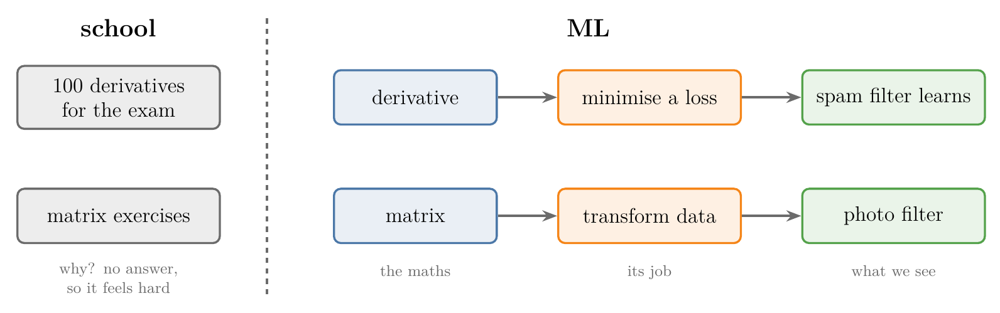
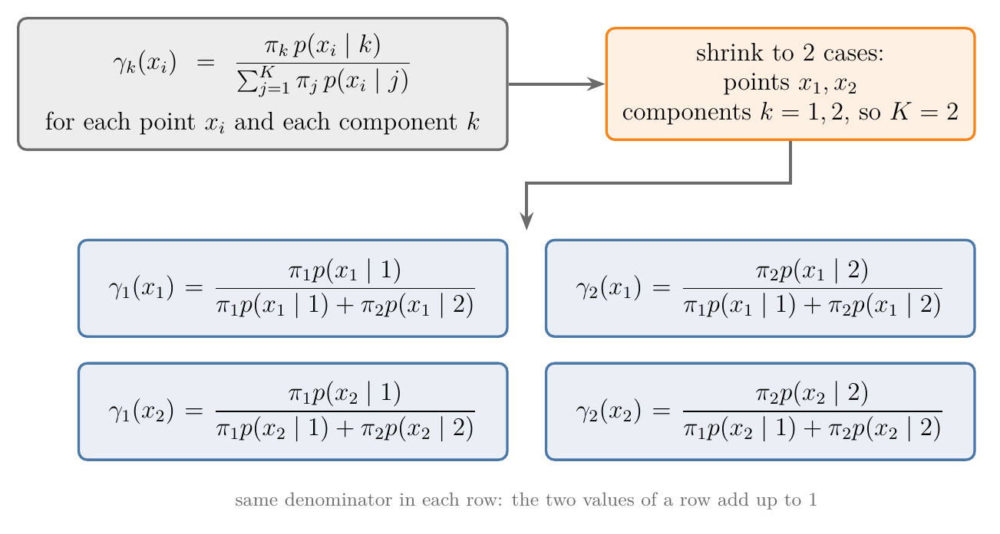
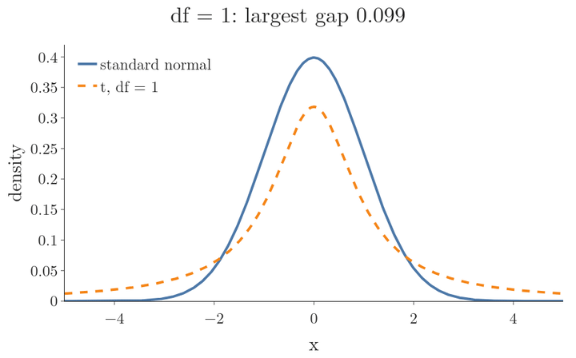
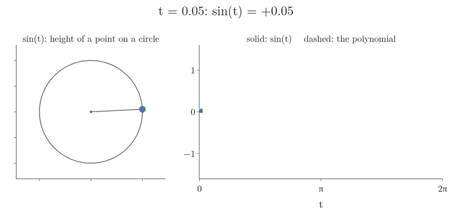
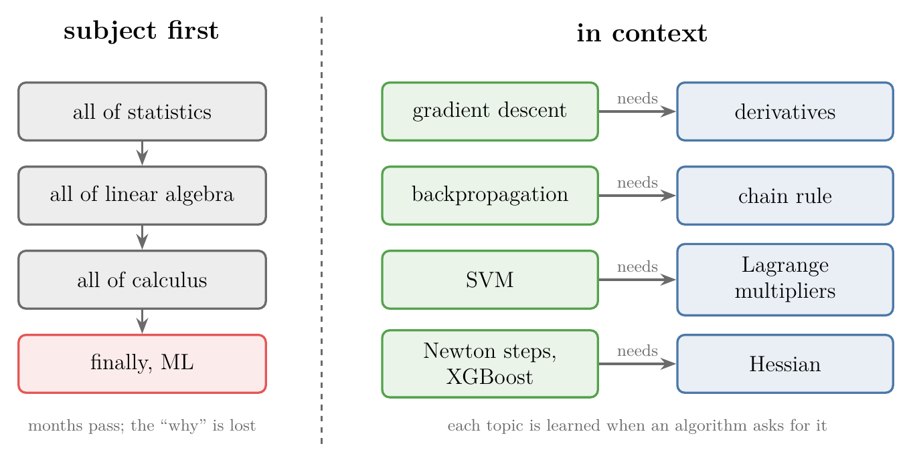

<!-- where-this-fits: generated by course_map/build_map.py; edit concepts.yaml, not this block -->
> **Where this fits:** Pipeline map step 0 (Foundations). See the [Course map](../../../00-course-map/00-course-map.md).
>
> 
>
> - **Builds on:** [Role of mathematics in ML](../../../MA/00-why-maths/MA-001-role-of-maths-in-ml/MA-001-role-of-maths-in-ml.md#1-overview).
<!-- /where-this-fits -->

## 1. Overview

> **Key point:** The fear of mathematics fades with five habits: expect maths to be useful, decode notation on small cases, check ideas with code, learn visually first, and study each topic in the context where ML needs it.

Many learners want to work in ML but stop at the first equation. The maths ML needs is smaller and easier than it looks, and the right way of studying it matters more than talent.

{height=40%}

Figure 1 shows the five habits. The first one, the attitude, comes first because the others only work once we are willing to spend time with the maths.

Earlier Notes already cover parts of this topic:

- [the job of each branch of maths in ML](../MA-001-role-of-maths-in-ml/MA-001-role-of-maths-in-ml.md#2-linear-algebra-representing-data) (linear algebra, calculus, probability, statistics);
- [the four modules of statistics](../../01-descriptive-stats/MA-003-statistics-roadmap/MA-003-statistics-roadmap.md#3-the-four-modules), a roadmap of its topics;
- [the eight modules of linear algebra](../../05-linear-algebra/MA-047-linear-algebra-roadmap/MA-047-linear-algebra-roadmap.md#4-the-eight-modules), a roadmap of its topics.

This Note adds how to study them, and the calculus part of the map.

## 2. Habit 1: change the attitude

> **Key point:** Instead of quitting at the first equation, we expect it to explain the algorithm; two facts make this realistic: in ML we always know why a piece of maths is there, and only a small, easy part of maths is needed.

The usual pattern is: open an algorithm, meet an equation, decide it is too hard, and stop. The habit to build is the opposite reaction: an equation is where the algorithm is actually explained.

A practical trick is to picture a future version of ourselves who reads equations comfortably. Aiming at that picture makes it easier to stay with a formula for ten minutes instead of five, and to work through it with pen and paper. After a month or so of this, the maths of ML turns out to be far less hard than its reputation.

### 2.1 Reason 1: we always know why

> **Key point:** School maths feels dry because we rarely know what it is for; in ML every piece of maths has a visible purpose.

At school we solve hundreds of derivatives and integrals for the exam, without knowing where they are used. Maths without a purpose is boring, and boring maths feels hard.

In ML the purpose is always visible:

- **Derivatives** (G-595; the slope of a curve, which tells how fast a value changes, see [the derivative](../../06-calculus/MA-061-derivatives-of-one-variable/MA-061-derivatives-of-one-variable.md#4-the-derivative-shrinking-the-step-to-zero)) are there to minimise a loss function (a number that says how wrong the model is), which is how a spam filter learns to separate spam from normal mail (see [the idea of gradient descent](../../../ML/06-regression/ML-056-gradient-descent/ML-056-gradient-descent.md#2-the-idea)).
- **Matrices** (tables of numbers) are there to transform data; a photo filter, for example, is a manipulation of the matrix of pixel values (see [the matrix of a transformation](../../05-linear-algebra/MA-053-linear-transformations-and-matrices/MA-053-linear-transformations-and-matrices.md#5-the-matrix-of-a-transformation)).



In Figure 2, watch the right-hand rows: each one runs from a piece of maths, through its job, to something we can see working. Because we know why each formula is there, it stays interesting, and interesting maths is easier to learn.

### 2.2 Reason 2: only a small subset is needed

> **Key point:** ML uses four topics: statistics, probability, linear algebra (mostly matrices) and a small part of calculus (differentiation, for optimisation).

We do not need all of mathematics. ML uses four topics, and only part of each:

| Topic | How much | Where the map of it is |
|---|---|---|
| Statistics | know it well | [the four modules of statistics](../../01-descriptive-stats/MA-003-statistics-roadmap/MA-003-statistics-roadmap.md#3-the-four-modules) |
| Probability | a fair idea | [the five basic terms of probability](../../02-probability/MA-010-events-and-types-of-events/MA-010-events-and-types-of-events.md#2-the-five-basic-terms) onward |
| Linear algebra | know it well, mostly matrices | [the eight modules of linear algebra](../../05-linear-algebra/MA-047-linear-algebra-roadmap/MA-047-linear-algebra-roadmap.md#4-the-eight-modules) |
| Calculus | a small part: differential calculus for optimisation | Section 6 of this Note |

Compared with a field such as theoretical physics, this maths is both smaller in scope and less abstract. Less to learn, easier to learn, and always with a reason: together these make the maths enjoyable, and enjoyment removes the fear.

## 3. Habit 2: decode the notation

> **Key point:** When a formula full of indices looks frightening, we shrink it to two or three cases and write every case out by hand.

The second source of fear is notation: Greek letters, indices (the small numbers written below a symbol, as in $x_1$ and $x_2$) and sums packed into one line. The notation will not go away, because it is the language of maths. What we can learn is to unpack it.

The method, called **decoding notation** (G-566):

1. Read the sentence around the formula ("for each point $x_i$ and each component $k$").
2. Replace every index range by a tiny one: two points, two components.
3. Write out every case the formula stands for, with the indices filled in.

Figure 3 applies it to a formula from an algorithm we have not met yet, [Gaussian mixture models](../../08-likelihood/MA-073-gaussian-mixture-models/MA-073-gaussian-mixture-models.md#43-another-way-to-see-it-shrink-the-formula). We do not need to know the algorithm; the point is the unpacking. The formula is:

$$\gamma_k(x_i) = \frac{\pi_k\thinspace p(x_i \mid k)}{\sum_{j=1}^{K} \pi_j\thinspace p(x_i \mid j)}$$

{height=40%}

Meaning of each symbol, with the numbers used below. Here a **component** is one of two groups that the data may come from, and a **point** is one data value; $x_i$ is point number $i$, and $k$ and $j$ count components.

- $K$ is the number of components. Here $K = 2$.
- $\pi_k$ is the share of the data that belongs to component $k$. Here $\pi_1 = 0.6$ and $\pi_2 = 0.4$: 60 percent of the data comes from component 1.
- $p(x_1 \mid k)$ is how well component $k$ explains point $x_1$ (read "given $k$"). Here $p(x_1 \mid 1) = 0.5$ and $p(x_1 \mid 2) = 0.2$.
- $\gamma_k(x_i)$ is the share of point $x_i$ that goes to component $k$. It is the answer we want.
- $\sum_{j=1}^{K}$ means "add the terms for $j = 1$, then $j = 2$, up to $j = K$".

"For each point and each component" means one value $\gamma_k(x_i)$ per pair: four values for two points and two components. The sum in the denominator becomes two terms, because $K = 2$. In Figure 3 each row holds one point's two values, and both share the same denominator, so the two values of a row add up to 1: the formula splits each point between the components.

Worked with the numbers above, one product per line, then the sum:

$$\pi_1 \times p(x_1 \mid 1) = 0.6 \times 0.5 = 0.30$$

$$\pi_2 \times p(x_1 \mid 2) = 0.4 \times 0.2 = 0.08$$

$$0.30 + 0.08 = 0.38$$

Each share is its product divided by this sum:

$$\gamma_1(x_1) = \frac{0.30}{0.38} = 0.79$$

$$\gamma_2(x_1) = \frac{0.08}{0.38} = 0.21$$

The two shares add to 1, as the written-out form predicted:

$$0.79 + 0.21 = 1$$

A line of compact notation became four plain fractions.

> **Python:** a loop is the same unpacking, done by the computer. Each line below is one box of Figure 3.
>
> ```python
> import numpy as np
>
> pi = np.array([0.6, 0.4])        # weight of each component
> p = np.array([0.5, 0.2])         # p(x1 | k) for k = 1, 2
> gamma = pi * p / (pi * p).sum()  # both gamma_k(x1) at once
> print(gamma.round(2))            # [0.79 0.21]
> ```

## 4. Habit 3: use code to see the maths

> **Key point:** A small simulation or interactive plot turns an abstract idea into something we can change and watch.

Once we can program a little, every concept can be checked by building a small tool around it: change an input, watch the output. Ideas that are hard to picture become concrete. Examples where this helps most:

- **Confidence intervals** (a range built from a sample that is meant to contain the true mean): simulate many samples and count how often the interval contains the true mean (see [seeing it by simulation](../../04-inference/MA-036-interpreting-confidence-intervals/MA-036-interpreting-confidence-intervals.md#21-seeing-it-by-simulation)).
- **Matrices as transformations:** type in a matrix and watch the grid move (see [reading a matrix as a picture](../../05-linear-algebra/MA-053-linear-transformations-and-matrices/MA-053-linear-transformations-and-matrices.md#6-reading-a-matrix-as-a-picture)).
- **The t distribution** (a bell curve with fatter tails, used when the spread is estimated from a small sample): plot it next to the normal curve and raise the **degrees of freedom** (df, a number that sets the shape of the t curve, see [degrees of freedom](../../04-inference/MA-037-t-procedure/MA-037-t-procedure.md#51-degrees-of-freedom)) until the two match.
- **Dividing by $n - 1$ in the sample variance** (the spread of a sample, see [the sample version](../../01-descriptive-stats/MA-006-measures-of-dispersion/MA-006-measures-of-dispersion.md#61-the-sample-version)): simulate many samples and compare the averages of both versions.

Figure 4 is the third example built this way: the t distribution (dashed) drawn over the standard normal while the degrees of freedom (df) rise from 1 to 30.



Watch the tails: at df = 1 the t curve is lower in the middle and much fatter in the tails, and by df = 30 the largest gap is 0.004, so the two curves overlap. A fact that reads as abstract in a book ("t tends to the normal") becomes something we watch happen.

We do not need to be strong programmers for this. Many such tools are shared on GitHub, and an AI assistant can write one from a prompt such as "write a Streamlit app that plots the normal and t distributions side by side, with a slider for the degrees of freedom". We run it, then fix and extend it step by step.

## 5. Habit 4: learn visually first

> **Key point:** First get the picture from a visual resource, then read the formal treatment in lectures or books.

University lectures and textbooks are accurate, but most of them write equations and solve them, with few pictures. Starting with a visual explanation (diagrams, animation) and only then turning to the formal version makes both easier.

### 5.1 Two halves of understanding

> **Key point:** Numeric understanding lets us carry out a computation; geometric understanding lets us choose the right tool, feel why it works and read the result. Computers now do most of the numeric half.

Any maths topic can be known in two ways:

- **Numeric understanding** (G-2247): knowing how to carry out the computation, such as a matrix product ([how it is computed](../../05-linear-algebra/MA-054-matrix-multiplication-as-composition/MA-054-matrix-multiplication-as-composition.md#4-computing-a-product-column-by-column)), a determinant or an eigenvalue ([the vectors that do not turn](../../../ML/05-dimensionality/ML-047-pca-step-by-step/ML-047-pca-step-by-step.md#42-the-vectors-that-do-not-turn)).
- **Geometric understanding** (G-2248): knowing what the computation means as a picture. It is what lets us judge which tool fits a problem, feel why it works, and interpret the result.

Both have their place. But many courses spend most of their time on the numeric half, while in practice a computer does that half and the human does the conceptual half.

The sine function shows the difference (Figure 5). A calculator evaluates $\sin t$ with a polynomial:

$$\sin t = t - \frac{t^3}{3!} + \frac{t^5}{5!} - \frac{t^7}{7!} + \cdots$$

The sign $!$ is the **factorial**: multiply the whole numbers from the given number down to 1.

$$3! = 3 \times 2 \times 1 = 6$$

$$5! = 5 \times 4 \times 3 \times 2 \times 1 = 120$$

$$7! = 5040$$

1. **Numeric only.** A learner who met sine only as this formula could compute values by plugging in numbers and stopping after a few terms. Asked for the sign of $\sin 4$, the learner would have to compute.
2. **Geometric.** A learner who knows sine as the height of a point turning around a circle sees at once that the height goes up, comes back down and goes negative after half a turn ($t = \pi \approx 3.14$). So $\sin 4$ is negative, with no computation.

{height=45%}

In Figure 5, first watch the point turn: its height draws the sine curve. Then watch the dashed polynomial: with 4 terms it is off by more than 0.1 from about $t = 3.2$ on (largest gap 30.16 on one full turn), and with 9 terms it lies on it (largest gap 0.01). The formula and the picture are the same function. The formula computes it; the picture explains it.

### 5.2 Visual resources first

> **Key point:** Khan Academy, 3Blue1Brown and StatQuest give the picture; university lectures and books then give the formal version.

Three visual resources cover most of what ML needs:

- **Khan Academy.** The school mathematics chapters ML uses: statistics, probability, limits and derivatives, and vector algebra.
- **3Blue1Brown** (Sanderson, G., 3blue1brown.com). Two animated series: *Essence of Linear Algebra* (worth studying several times before deep learning) and *Essence of Calculus*.
- **StatQuest** (Starmer, J., statquest.org). A statistics series of about 60 lessons, picture first and definitions after.

After the picture, the formal sources: university lectures (for example NPTEL or Stanford) and books. The roadmaps list books for [statistics](../../01-descriptive-stats/MA-003-statistics-roadmap/MA-003-statistics-roadmap.md#4-how-to-study-the-roadmap) and [linear algebra](../../05-linear-algebra/MA-047-linear-algebra-roadmap/MA-047-linear-algebra-roadmap.md#5-resources).

## 6. Habit 5: learn in context

> **Key point:** We do not study a whole subject before starting ML; we study each topic knowing where ML uses it, and leave the rest until an algorithm needs it.

The better habit is **contextual learning** (G-463): study each topic together with the ML algorithm that uses it. Even within four topics, a common mistake is to try to learn everything in each: all of statistics, then all of linear algebra. That takes months and loses the "why" of Habit 1.



In Figure 6, compare the two columns: on the left the ML only starts after every subject is finished; on the right each topic arrives together with its reason. A roadmap fixes this. For each topic it lists the parts ML uses and where each part is used, so we can find the best resource for exactly that part. The [statistics roadmap](../../01-descriptive-stats/MA-003-statistics-roadmap/MA-003-statistics-roadmap.md#3-the-four-modules) and the [linear algebra roadmap](../../05-linear-algebra/MA-047-linear-algebra-roadmap/MA-047-linear-algebra-roadmap.md#4-the-eight-modules) are such roadmaps. The calculus part is short.

> **Extra:** The calculus and optimisation part of the roadmap, in the order this project teaches it:
>
> | Topic | Where ML uses it | Where it is taught |
> |---|---|---|
> | Derivatives of one variable | the slope of a loss | [the derivative](../../06-calculus/MA-061-derivatives-of-one-variable/MA-061-derivatives-of-one-variable.md#4-the-derivative-shrinking-the-step-to-zero) |
> | Partial derivatives, gradients, chain rule | gradient descent, backpropagation | [the gradient](../../06-calculus/MA-062-partial-derivatives-and-gradients/MA-062-partial-derivatives-and-gradients.md#4-the-gradient) |
> | Jacobian and matrix gradients | the gradient of a least-squares loss | [the Jacobian](../../06-calculus/MA-063-jacobian-and-matrix-gradients/MA-063-jacobian-and-matrix-gradients.md#4-the-jacobian) |
> | Hessian and Taylor series | curvature, Newton steps, XGBoost | [the Hessian](../../06-calculus/MA-064-hessian-and-multivariate-taylor/MA-064-hessian-and-multivariate-taylor.md#5-the-hessian) |
> | Gradient descent | training almost every model | [the idea of gradient descent](../../../ML/06-regression/ML-056-gradient-descent/ML-056-gradient-descent.md#2-the-idea) |
> | Convex and non-convex cost functions | whether gradient descent finds the best answer | [the chord test](../../07-optimisation/MA-065-convex-and-non-convex-cost-functions/MA-065-convex-and-non-convex-cost-functions.md#3-the-chord-test) |
> | Constrained optimisation, Lagrange multipliers | SVM, the constraint view of Ridge and Lasso | [the Lagrangian](../../07-optimisation/MA-066-lagrange-multipliers/MA-066-lagrange-multipliers.md#4-the-lagrangian) |
> | Convex sets, functions and problems | knowing when a minimum is the global one | [convex sets](../../07-optimisation/MA-067-convex-sets-and-functions/MA-067-convex-sets-and-functions.md#2-convex-sets) |
> | Linear and quadratic programming | SVM training, resource planning | [linear programming](../../07-optimisation/MA-068-linear-and-quadratic-programming/MA-068-linear-and-quadratic-programming.md#2-linear-programming) |
>
> In these Notes, integration appears mainly as the area under a probability density (see [area under the curve is probability](../../03-distributions/MA-022-pdf-and-continuous-cdf/MA-022-pdf-and-continuous-cdf.md#3-area-under-the-curve-is-probability)).

## 7. Summary

| Habit | What we do | Why it works |
|---|---|---|
| 1. Attitude | treat an equation as the explanation, not an obstacle | ML maths is small, easy, and always has a purpose |
| 2. Decode | shrink indices to 2 cases and write each case out | compact notation becomes plain arithmetic |
| 3. Code | simulate and plot the idea | we can change inputs and watch |
| 4. See first | visual resources, then formal ones | the picture gives the geometric half; computers do the numeric half |
| 5. In context | study a topic when an algorithm needs it | saves months and keeps the purpose visible |

- ML needs four topics: statistics, probability, linear algebra (mostly matrices) and differential calculus for optimisation, so the maths to learn is smaller and easier than it first looks.
- The attitude comes first; without it the other four habits do not get used.

## 8. Sources

**Built from**

- CampusX, "How to Overcome the Fear of Maths in Data Science? | Maths Roadmap for Machine Learning", YouTube, https://www.youtube.com/watch?v=o4g4OTyCyDM
- Sanderson, G. (3Blue1Brown), "Essence of linear algebra preview", 2016, https://www.youtube.com/watch?v=kjBOesZCoqc

## 9. Key terms

| Term | Meaning |
|---|---|
| Decoding notation | Shrinking a formula's indices to two or three cases and writing every case out by hand |
| Numeric understanding (G-2247) | Knowing how to carry out a computation, such as a matrix product |
| Geometric understanding (G-2248) | Knowing what a computation means as a picture: which tool fits, why it works, how to read the result |
| Contextual learning | Studying a maths topic together with the ML algorithm that uses it, instead of the whole subject up front |
