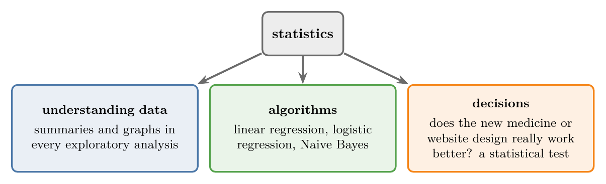
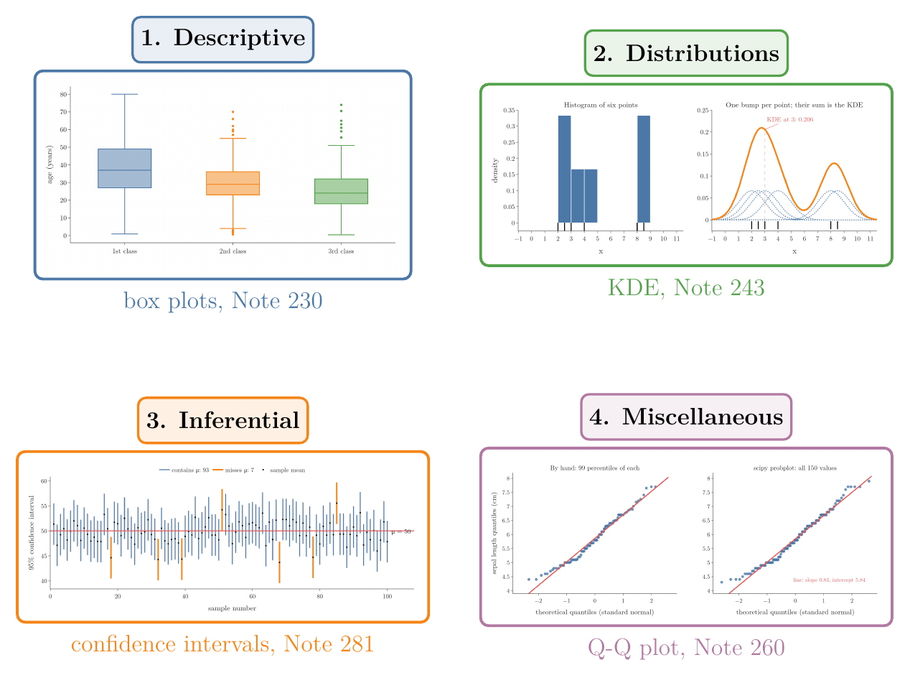

<!-- where-this-fits: generated by course_map/build_map.py; edit concepts.yaml, not this block -->
> **Where this fits:** Pipeline map steps 0 (Foundations), 3 (Understand data). See the [Course map](../../../00-course-map/00-course-map.md).
>
> 
>
> - **Leads to:** [Exploratory data analysis](../../../ML/01-foundations/ML-009-mldlc/ML-009-mldlc.md#6-exploratory-data-analysis-eda); [Univariate analysis](../../../ML/01-foundations/ML-009-mldlc/ML-009-mldlc.md#62-what-we-do-during-eda); [Standardization](../../../ML/01-foundations/ML-009-mldlc/ML-009-mldlc.md#52-common-preprocessing-tasks); [IQR outlier method](../../../ML/04-missing-data-and-outliers/ML-040-what-are-outliers/ML-040-what-are-outliers.md#1-overview); [Population, sample, parameter and statistic](../../../MA/01-descriptive-stats/MA-004-what-is-statistics/MA-004-what-is-statistics.md#2-what-statistics-is); [Measures of central tendency](../../../MA/01-descriptive-stats/MA-005-measures-of-central-tendency/MA-005-measures-of-central-tendency.md#1-overview).
<!-- /where-this-fits -->

## 1. Overview

> **Key point:** **Statistics** (G-1884) for ML splits into four modules: **descriptive statistics** (G-596), **probability distributions** (G-1571), **inferential statistics** (G-944), and a few miscellaneous tools.

{height=60%}

Figure 1 shows the whole map. Each coloured box is one module; the white box under it lists its topics. An arrow means "is needed by": descriptive statistics comes first, and probability distributions are needed by inferential statistics. Hypothesis testing, in the inferential module, depends on the probability distributions module. This Note says what each module covers, why ML needs it, and where each topic is taught.

## 2. Why ML needs statistics

> **Key point:** Statistics is how we summarise data and draw conclusions from it, and many ML algorithms are built on it.

Statistics turns raw data into summaries and decisions. In data work it shows up in three places (Figure 2):

- **Understanding data:** every exploratory analysis is built from statistical summaries and graphs.
- **Algorithms:** linear regression, logistic regression and Naive Bayes all come out of statistics (ISLR ch. 3, §4.3, §4.4.4).
- **Decisions:** checking whether a new medicine, or a new website design, really works better than the old one needs a statistical test (Bruce et al. 2020, ch. 3).

{width=90%}

## 3. The four modules

> **Key point:** Descriptive statistics summarises the data we have; probability distributions describe the shapes data can take; inferential statistics draws conclusions about data we do not have.

{width=95%}

Figure 3 previews what each module produces: summaries of the data in hand, a smooth shape for a distribution, a statement about a population with its uncertainty, and a diagnostic plot.

### 3.1 Descriptive statistics

> **Key point:** Summarise the data we have, with numbers and graphs.

This module describes data that is already in our hands. Its topics, and where each is taught:

| Topic | Where it is taught |
|---|---|
| Population and sample, types of data | [population and sample](../MA-004-what-is-statistics/MA-004-what-is-statistics.md#4-population-and-sample), [types of data](../MA-004-what-is-statistics/MA-004-what-is-statistics.md#6-types-of-data) |
| Central tendency (mean, median, mode, ...) | [what central tendency means](../MA-005-measures-of-central-tendency/MA-005-measures-of-central-tendency.md#2-what-central-tendency-means) |
| Dispersion (range, variance, standard deviation, ...) | [range](../MA-006-measures-of-dispersion/MA-006-measures-of-dispersion.md#3-range), [variance](../MA-006-measures-of-dispersion/MA-006-measures-of-dispersion.md#4-variance) |
| Quantiles, percentiles, box plots | [percentiles](../MA-008-percentiles-and-box-plots/MA-008-percentiles-and-box-plots.md#3-percentiles), [building a box plot](../MA-008-percentiles-and-box-plots/MA-008-percentiles-and-box-plots.md#5-building-a-box-plot-by-hand) |
| Skewness | [skewness as distance from the normal shape](../../03-distributions/MA-026-skewness/MA-026-skewness.md#2-skewness-as-distance-from-the-normal-shape) |
| Kurtosis | [kurtosis as tailedness](../../03-distributions/MA-028-kurtosis-and-qq-plots/MA-028-kurtosis-and-qq-plots.md#3-kurtosis-a-measure-of-tailedness) |
| Univariate analysis | [one feature at a time](../../../ML/02-getting-data/ML-019-univariate-analysis/ML-019-univariate-analysis.md#2-univariate-bivariate-and-multivariate-analysis) |
| Bivariate and multivariate analysis | [two features: scatter plot](../../../ML/02-getting-data/ML-020-bivariate-multivariate-analysis/ML-020-bivariate-multivariate-analysis.md#3-scatter-plot-two-numerical-columns), [graphs for two features](../MA-007-frequency-tables-and-graphs/MA-007-frequency-tables-and-graphs.md#4-graphs-for-two-features) |
| Covariance and correlation | [covariance](../MA-009-covariance-and-correlation/MA-009-covariance-and-correlation.md#3-covariance), [correlation](../MA-009-covariance-and-correlation/MA-009-covariance-and-correlation.md#4-correlation) |

### 3.2 Probability distributions

> **Key point:** A probability distribution describes how likely each value of a feature is; the hypothesis tests of the next module depend on it.

This module studies the shapes data can take. Here a **feature** (G-772) is an input variable, one column of the data table, and an **observation** (G-1374) is one record, one row of that table:

- **Random variables** (G-1620; a number decided by chance, such as the roll of a die), and the functions that describe them: the PMF (probability mass function, the probability of each count), the PDF (probability density function, the curve for measurements) and the CDF (cumulative distribution function, the running total of probability).
- **Kernel density estimation**, the smooth curve over a histogram (a bar chart of how many values fall in each range), met in [the density plot](../../../ML/02-getting-data/ML-019-univariate-analysis/ML-019-univariate-analysis.md#7-density-plot).
- **2D density plots**, the same idea for two features at once.
- **Named distributions**: normal, uniform, Bernoulli, binomial, log-normal and others. The normal distribution's 68-95-99.7 rule appears in [the 68-95-99.7 rule](../../../ML/04-missing-data-and-outliers/ML-041-outliers-zscore/ML-041-outliers-zscore.md#3-the-68-95-997-rule).

The basic rules of probability are in [the five basic terms](../../02-probability/MA-010-events-and-types-of-events/MA-010-events-and-types-of-events.md#2-the-five-basic-terms) and [the rules every probability follows](../../02-probability/MA-011-empirical-and-theoretical-probability/MA-011-empirical-and-theoretical-probability.md#6-the-rules-every-probability-follows); conditional probability (the probability of one event once another is known) is in [the definition](../../02-probability/MA-015-conditional-probability/MA-015-conditional-probability.md#2-the-definition).

### 3.3 Inferential statistics

> **Key point:** Use a sample to say something about the whole population, and say how sure we are.

This module draws conclusions about a **population** (G-1525) from a **sample** (G-1731):

- **Central limit theorem** (G-364): why averages of samples behave predictably.
- **Confidence intervals:** a range built by a method that captures the true population value in a stated share of repeated samples.
- **Hypothesis testing** (G-913): checking a claim about a population with a sample. The common tests are the z-test, t-test, chi-square test and ANOVA (Bruce et al. 2020, ch. 3), and the module ends with when to use which.

### 3.4 Miscellaneous topics

> **Key point:** A few tools do not fit one module; we study them when an algorithm needs them.

| Topic | Where it is taught |
|---|---|
| Chebyshev's inequality | a later maths Note |
| Q-Q plot | [how a Q-Q plot is built](../../03-distributions/MA-028-kurtosis-and-qq-plots/MA-028-kurtosis-and-qq-plots.md#7-building-a-q-q-plot), [checking whether a column is normal](../../../ML/03-feature-engineering/ML-029-function-transformer/ML-029-function-transformer.md#4-checking-whether-a-column-is-normal) |
| Sampling techniques | a later maths Note; sampling bias in [sampling noise and sampling bias](../../../ML/01-foundations/ML-007-challenges-in-ml/ML-007-challenges-in-ml.md#42-sampling-noise-and-sampling-bias) |
| Resampling (bootstrap) | [bootstrapping](../../../ML/08-trees-and-ensembles/ML-099-bagging-intuition/ML-099-bagging-intuition.md#21-bootstrapping) |
| Statistical moments | [statistical moments](../../03-distributions/MA-028-kurtosis-and-qq-plots/MA-028-kurtosis-and-qq-plots.md#21-statistical-moments) |
| Bayesian statistics | [Bayes' theorem](../../02-probability/MA-018-bayes-theorem/MA-018-bayes-theorem.md#3-the-names-of-the-four-parts) |

## 4. How to study the roadmap

> **Key point:** About 60 hours, or a month at 2 to 2.5 hours a day; some topics can wait until an algorithm needs them.

The whole roadmap takes roughly 60 hours. At 2 to 2.5 hours a day, that is about one month. Two habits help:

- **Know why each topic matters.** For every topic, note where ML or data analysis uses it.
- **Defer some topics.** A few topics, such as Chebyshev's inequality or Bayesian statistics, can wait until an algorithm needs them. The rest are worth covering now, in the order of the map.

> **Extra:** Good resources for this roadmap:
>
> - **Books:** *An Introduction to Statistical Learning* (James, Witten, Hastie, Tibshirani; statistics through ML), *Practical Statistics for Data Scientists* (Bruce, Bruce, Gedeck; practical, with Python and R), *Think Stats* (Downey; short, Python-based).
> - **Online lessons:** Starmer, J., StatQuest, *Statistics Fundamentals*, statquest.org.
> - **Revision:** a one-page statistics cheat sheet, once the topics are learned.

## 5. Summary

| Module | Question it answers | Main topics | Why ML needs it |
|---|---|---|---|
| Descriptive statistics | What does the data we have look like? | central tendency, dispersion, percentiles, graphs, correlation | every exploratory analysis is built from these summaries and graphs |
| Probability distributions | What shapes can data take? | PMF, PDF, CDF, normal and other distributions | the hypothesis tests of the inferential module depend on them |
| Inferential statistics | What can a sample tell us about the population? | central limit theorem, confidence intervals, hypothesis tests | deciding whether a new medicine or website design really works better needs a test |
| Miscellaneous | Extra tools | Q-Q plot, sampling, resampling, moments, Bayes | some are studied when an algorithm needs them |

- Descriptive statistics comes first; inferential statistics depends on probability distributions, so study the modules in the order of the map.
- About 60 hours covers the whole roadmap, so it fits in about a month at 2 to 2.5 hours a day.
- Together the four modules are what ML needs from statistics: summarise the data, describe its shape, and draw conclusions from it.

## 6. Sources

**Built from**

- CampusX, "Statistics Roadmap for Data Science and Data Analysis | Complete Guide | Full Resources | CampusX", YouTube, https://www.youtube.com/watch?v=2GV_ouHBw30

**Other references**

- ISLR: James, G., Witten, D., Hastie, T. and Tibshirani, R. (2021). *An Introduction to Statistical Learning*, 2nd ed. Springer. Chapter 3 (linear regression), sections 4.3 (logistic regression) and 4.4.4 (naive Bayes).
- Bruce, P., Bruce, A. and Gedeck, P. (2020). *Practical Statistics for Data Scientists*, 2nd ed. O'Reilly. Chapter 3, Statistical Experiments and Significance Testing.

## 7. Key terms

This roadmap adds no terms of its own: each term is defined in the Note that teaches it, and listed in the [glossary](../../../glossary.md).
