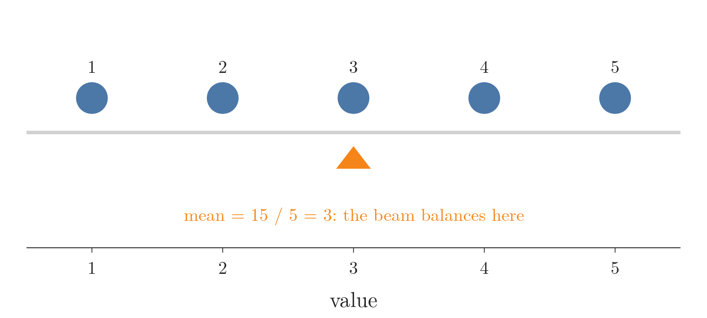
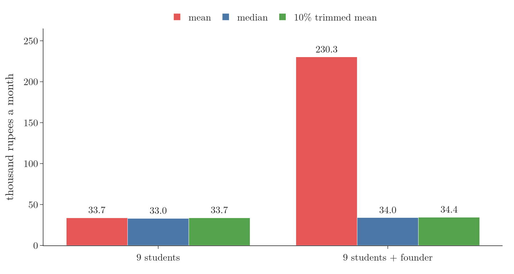
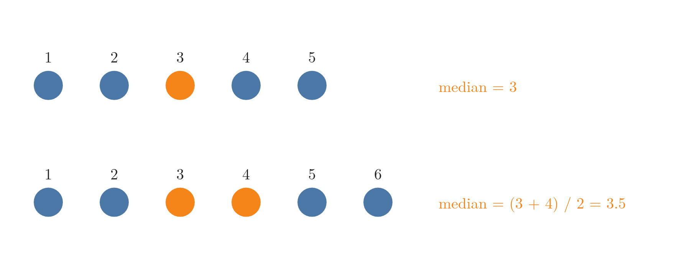
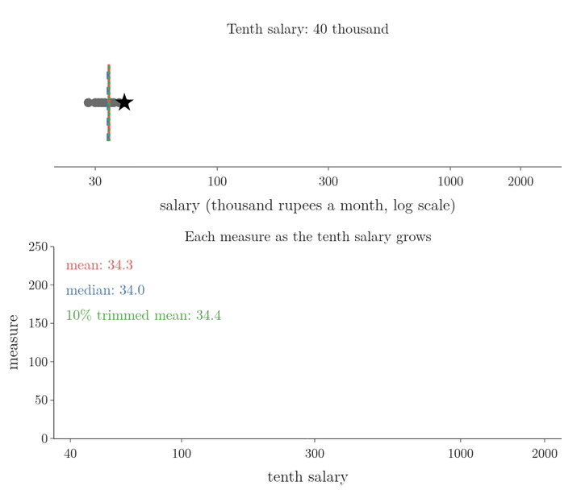
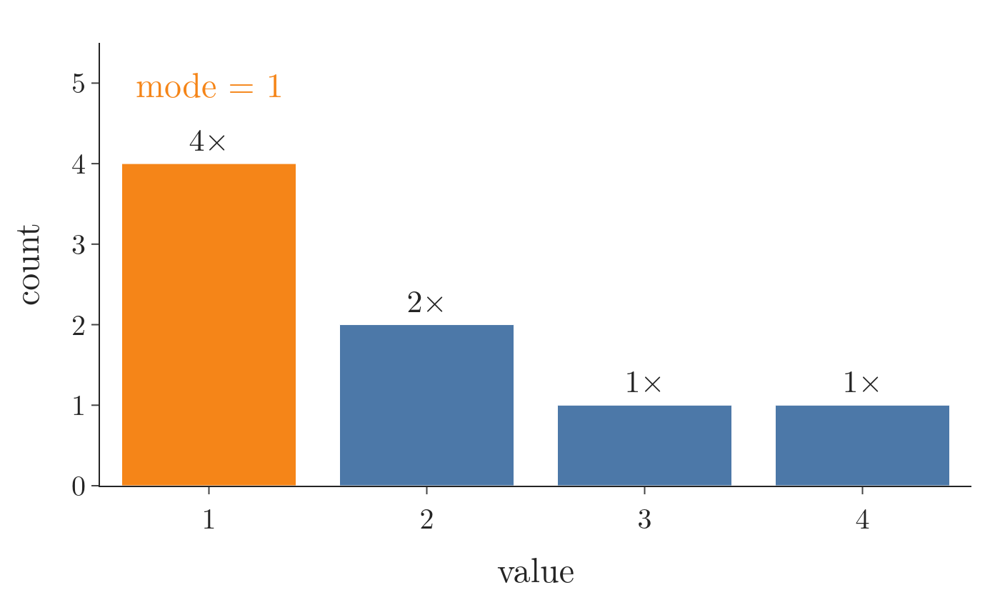
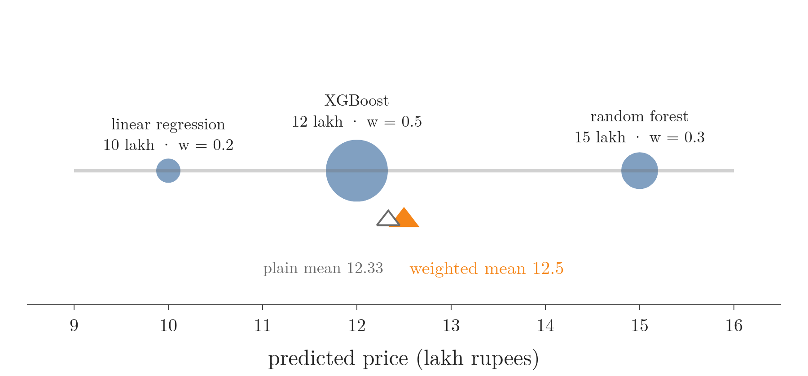
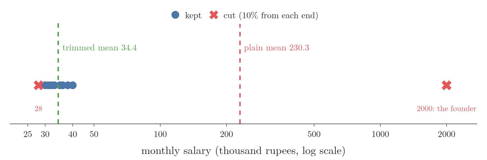

<!-- where-this-fits: generated by course_map/build_map.py; edit concepts.yaml, not this block -->
> **Where this fits:** Pipeline map step 3 (Understand data). See the [Course map](../../../00-course-map/00-course-map.md).
>
> 
>
> - **Builds on:** Exploratory data analysis ([Note ML-009](../../../ML/01-foundations/ML-009-mldlc/ML-009-mldlc.md)); Frequency tables ([Note MA-007](../../../MA/01-descriptive-stats/MA-007-frequency-tables-and-graphs/MA-007-frequency-tables-and-graphs.md)).
> - **Leads to:** Variance ([Note MA-006](../../../MA/01-descriptive-stats/MA-006-measures-of-dispersion/MA-006-measures-of-dispersion.md)); Percentiles, quartiles and box plots ([Note MA-008](../../../MA/01-descriptive-stats/MA-008-percentiles-and-box-plots/MA-008-percentiles-and-box-plots.md)); Correlation ([Note MA-009](../../../MA/01-descriptive-stats/MA-009-covariance-and-correlation/MA-009-covariance-and-correlation.md)); Z-score outlier method ([Note MA-025](../../../MA/03-distributions/MA-025-standard-normal-and-z-table/MA-025-standard-normal-and-z-table.md)); Skewness ([Note MA-026](../../../MA/03-distributions/MA-026-skewness/MA-026-skewness.md)); Standardization ([Note DL-023](../../../DL/02-training/DL-023-data-scaling-in-ann/DL-023-data-scaling-in-ann.md)).
> - **Compare with:** Inferential statistics ([Note MA-004](../../../MA/01-descriptive-stats/MA-004-what-is-statistics/MA-004-what-is-statistics.md)); Expected value and variance of a random variable ([Note MA-012](../../../MA/02-probability/MA-012-expected-value-and-variance/MA-012-expected-value-and-variance.md)).
<!-- /where-this-fits -->

## 1. Overview

> **Key point:** A measure of central tendency gives one number for the centre of a feature; the mean, median, mode, weighted mean and trimmed mean each suit different data.


Figure 1 shows which measure fits which kind of feature. This Note works through each measure, its formula and its weak spot, in that order.

## 2. What central tendency means

> **Key point:** One typical value that summarises where a feature's values sit.

A **measure of central tendency** (G-1205) is a statistical measure that represents a typical, central value of a dataset. A **feature** (G-772) is one variable of the data, one column of the table, and an **observation** (G-1374) is one record, one row. A measure of central tendency summarises a whole feature with the single value that best represents it.

Take the `Age` feature of 1,000 passengers. Reading 1,000 ages tells us little. One number for where the ages are centred tells us a lot: "the average salary", "the average package", "a batsman's average" are all such numbers.

There are several such measures. The main ones are the mean, median and mode; the weighted mean and trimmed mean are useful variants.

## 3. Mean

> **Key point:** The mean is the sum of the values divided by how many there are; it uses every value, so one extreme value can drag it far away.

Five students score 3, 4, 1, 2 and 5 marks in a quiz. Share the marks out so that everyone ends up with the same score: this equal share is the **mean** (G-1203). We find it in two steps, and the [understanding your data Note](../../../ML/02-getting-data/ML-018-understanding-your-data/ML-018-understanding-your-data.md) (section 7.1) covers it too.

Figure 2 draws the five scores as equal weights on a beam. The orange triangle marks the one place where the beam balances.

{height=28%}

The two steps, one per line:

| Step | Work | Result |
|---|---|---|
| 1. Add all the values | $3 + 4 + 1 + 2 + 5$ | 15 |
| 2. Divide by how many values there are | $15 / 5$ | 3 |

Now the formula, with every symbol named. Call the first score $x_1 = 3$, the second $x_2 = 4$, and so on up to $x_5 = 5$. The little number below $x$ is only the position of the score in the list, and the number of scores is $n = 5$. The sign $\sum$ ("sigma") means "add up", so $\sum_{i=1}^{5} x_i$ is $x_1 + x_2 + x_3 + x_4 + x_5$.

$$\sum_{i=1}^{5} x_i = 3 + 4 + 1 + 2 + 5 = 15$$

$$\bar{x} = \frac{1}{n}\sum_{i=1}^{n} x_i = \frac{1}{5} \times 15 = 3$$

The result matches the balance point in Figure 2. The bar over $x$ is read "x bar" and stands for the sample mean.

The same arithmetic has two names, depending on what the values are. The [what is statistics Note](../MA-004-what-is-statistics/MA-004-what-is-statistics.md) (section 4.2) explains why. A **population** is every value we care about, say all $N$ students of a college; a **sample** is the $n$ values we actually measured.

| | Values | Count | Symbol | Formula |
|---|---|---|---|---|
| **Population mean** (G-1524) | the whole population | $N$ | $\mu$ ("mu") | $\mu = \frac{1}{N}\sum_{i=1}^{N} x_i$ |
| **Sample mean** (G-1725) | one sample | $n$ | $\bar{x}$ | $\bar{x} = \frac{1}{n}\sum_{i=1}^{n} x_i$ |

$\mu$ is the true centre of the whole population; $\bar{x}$ is the centre of one sample. Nothing guarantees they are equal: they can be close, or very different.

### 3.1 The weak spot of the mean: outliers

> **Key point:** One very high or very low value pulls the mean towards it, so the mean stops describing anyone.

As the [what are outliers Note](../../../ML/04-missing-data-and-outliers/ML-040-what-are-outliers/ML-040-what-are-outliers.md) (section 2.1) shows, one billionaire in a classroom drags the mean salary into the crores. Here is the same effect on a class we will reuse below.

Nine students earn between 28 and 40 thousand rupees a month. A tenth classmate skipped placements, founded a start-up and now earns 20 lakh rupees (2,000 thousand) a month. Figure 3 shows what happens to the mean.



| Class | Sum of salaries | Divide by the count | Mean |
|---|---|---|---|
| Nine students | $28 + 30 + 31 + 32 + 33 + 35 + 36 + 38 + 40 = 303$ | $303 / 9$ | 33.7 thousand rupees, a fair summary |
| With the founder | $303 + 2000 = 2303$ | $2303 / 10$ | 230.3 thousand rupees: nobody in the class earns anything like that |

So before using the mean, we check whether the feature has outliers. If it does, the mean is not a good summary of that feature.

## 4. Median

> **Key point:** The median is the middle value of the sorted data; extreme values sit at the ends of the sorted list, so they cannot move it.

Line the students up in order of marks and pick the one standing in the middle. That student's mark is the **median** (G-1209), the middle value of the sorted data. The [understanding your data Note](../../../ML/02-getting-data/ML-018-understanding-your-data/ML-018-understanding-your-data.md) (section 7.2) covers it too.

Figure 4 shows two lists. The top row has 5 values, so one value sits in the middle. The bottom row has 6 values, so two values share the middle, and we take their mean.

{height=28%}

Worked steps for the top row, 1, 2, 3, 4, 5 (5 values):

| Step | Work | Result |
|---|---|---|
| 1. Sort the values | already in order | 1, 2, 3, 4, 5 |
| 2. Count them | five values | $n = 5$ |
| 3. Find the middle position | $(5 + 1)/2$ | position 3 |
| 4. Read the value there | third value | 3 |

Add a sixth value, 6. Now there is no single middle value:

| Step | Work | Result |
|---|---|---|
| 1. Sort the values | already in order | 1, 2, 3, 4, 5, 6 |
| 2. Count them | six values | $n = 6$ |
| 3. Find the two middle positions | $6/2$ and $6/2 + 1$ | positions 3 and 4 |
| 4. Read the values there | third and fourth | 3 and 4 |
| 5. Take their mean | $(3 + 4)/2$ | 3.5 |

The formal version names the sorted values $x_{(1)} \le x_{(2)} \le \dots \le x_{(n)}$. The bracket in $x_{(3)}$ means "the third value after sorting"; here $x_{(3)} = 3$. There are two cases:

For odd $n$:

$$\text{median} = x_{((n+1)/2)}$$

For even $n$:

$$\text{median} = \frac{x_{(n/2)} + x_{(n/2+1)}}{2}$$

For $n = 5$ (odd), the middle value is $x_{(3)} = 3$. For $n = 6$ (even), average the two middle values:

$$\frac{x_{(3)} + x_{(4)}}{2} = \frac{3 + 4}{2} = 3.5$$

Both reproduce the table rows.

Now replace the 6 by 60,000. The sorted list is 1, 2, 3, 4, 5, 60000, the middle positions are still 3 and 4, and

$$\text{median} = \frac{3 + 4}{2} = 3.5$$

The unchanged median of 3.5 shows why the median resists outliers. However large an extreme value is, sorting puts it at the end of the list, and the middle stays where it was. In Figure 3, the founder moves the median only from 33 to 34 thousand rupees.

Figure 5 drags the tenth salary up step by step, from 40 to 2,000 thousand rupees. Watch the red mean climb with it while the blue median and the green trimmed mean (section 7) stay flat at about 34.

{height=55%}

The same reasoning gives practical advice: when comparing colleges or companies, look at the median package, not the average one. One student with a package of 1 crore raises the average for everyone, but leaves the median almost untouched.

> **Python:** Mean and median.
>
> ```python
> import numpy as np
>
> x = np.array([1, 2, 3, 4, 5, 60000])
> np.mean(x)     # 10002.5
> np.median(x)   # 3.5
> ```
>
> On a pandas column we write `df["Age"].mean()` and `df["Age"].median()`.

## 5. Mode

> **Key point:** The mode is the most frequent value; it is the natural centre for categorical and discrete data.

Ask a class "which state are you from?" and count the hands. The state with the most hands is the **mode** (G-1251), the value that appears most often in the data. Counting is the only work, so the mode also suits data that are not numbers.

Take the values 1, 2, 1, 3, 1, 4, 2, 1. Figure 6 draws one bar per distinct value, as tall as its count. The tallest bar, in orange, is the mode.

{height=28%}

Worked steps, one per row:

| Value | Count (tally) | How many times |
|---|---|---|
| 1 | four times | 4 |
| 2 | twice | 2 |
| 3 | once | 1 |
| 4 | once | 1 |

The largest count is 4, so the mode is 1.

The formal version needs one new symbol. Let $f(v)$ be the number of times the value $v$ appears: here $f(1) = 4$, $f(2) = 2$, $f(3) = 1$ and $f(4) = 1$.

$$\text{mode} = \text{the value } v \text{ with the largest } f(v)$$

Here $f(1) = 4$ is the largest, so the mode is $v = 1$, as in the table.

The mode is most useful for:

- **Categorical features,** where the mean and median make no sense. Ask a class which state each student comes from and count; if Maharashtra comes up most often, it is the mode.
- **Discrete features with few values,** such as the number of siblings on board.

For a continuous feature, the mode is rarely useful: with values such as 32.17 and 32.18, almost every value appears only once.

If two values tie for the highest count, both are modes. Data with two modes is **bimodal** (G-296) (two peaks, as in the [power transformer Note](../../../ML/03-feature-engineering/ML-030-power-transformer/ML-030-power-transformer.md)); with more, it is **multimodal** (G-1275).

> **Python:** The mode.
>
> ```python
> import pandas as pd
>
> pd.Series([1, 2, 1, 3, 1, 4, 2, 1]).mode()   # 1
> pd.Series([1, 1, 2, 2, 3]).mode()            # 1 and 2: a tie
> ```
>
> `mode()` returns every value that ties for first place, so its result is a Series, not a single number.

## 6. Weighted mean

> **Key point:** The weighted mean multiplies each value by its importance before averaging, so more important values count more.

In the ordinary mean, every value counts equally. Sometimes one value deserves more say than another. We predict a house price with three models: linear regression says 10 lakh rupees, a random forest 15 lakh, and XGBoost 12 lakh. From past results, XGBoost has been right most often, so we trust it most. We give each prediction a **weight** (G-2111), a number that says how much it counts, and average with those weights: the **weighted mean** (G-2117).

Figure 7 shows the idea. Each prediction is a dot on a beam, and a heavier dot is a bigger weight. The weighted mean (orange) is the balance point, pulled towards the heaviest dot.

{height=28%}

The weights are 0.2 for linear regression, 0.3 for the random forest and 0.5 for XGBoost. Worked steps, one per row:

| Step | Work | Result |
|---|---|---|
| 1. Multiply each prediction by its weight | $0.2 \times 10$ | 2 |
| | $0.3 \times 15$ | 4.5 |
| | $0.5 \times 12$ | 6 |
| 2. Add these products | $2 + 4.5 + 6$ | 12.5 |
| 3. Add the weights | $0.2 + 0.3 + 0.5$ | 1 |
| 4. Divide the sum of products by the sum of weights | $12.5 / 1$ | 12.5 lakh rupees |

For comparison, the plain mean of the three values is:

$$\frac{10 + 15 + 12}{3} = 12.33 \text{ lakh}$$

The weighted mean leans towards XGBoost.

The formal version names the values $x_1 = 10$, $x_2 = 15$, $x_3 = 12$ and their weights $w_1 = 0.2$, $w_2 = 0.3$, $w_3 = 0.5$:

$$\bar x_w = \frac{\sum_{i=1}^{n} w_i\thinspace x_i}{\sum_{i=1}^{n} w_i}$$

The top is step 2 (12.5), the bottom is step 3 (1), so $\bar x_w = 12.5$, as in the table.

This weighting is exactly what a voting regressor with weights does (see the [voting regressor Note](../../../ML/08-trees-and-ensembles/ML-098-voting-regressor/ML-098-voting-regressor.md)). The ordinary mean is the special case where every weight is equal.

> **Python:** The weighted mean.
>
> ```python
> np.average([10, 15, 12], weights=[0.2, 0.3, 0.5])   # 12.5
> ```

## 7. Trimmed mean

> **Key point:** The trimmed mean drops a fixed share of the smallest and largest values, then averages the rest, so outliers cannot pull it.

In a diving contest, seven judges score a dive. One judge may be far too generous, or far too harsh. To stop that one judge deciding the result, we throw away the highest and the lowest scores and average the rest. This is the **trimmed mean** (G-2017): remove a chosen percentage of the smallest and of the largest values, then take the mean of what is left. The percentage removed from each end is the **trimming percentage** (G-2018).

We use the class from section 3.1: nine students and one founder. Sorted, the $n = 10$ salaries in thousand rupees are 28, 30, 31, 32, 33, 35, 36, 38, 40 and 2000. Figure 8 shows the trim: the lowest and highest salaries are cut, and the mean is taken of the 8 left.

{width=95%}

Worked steps for a 10% trim, one per row:

| Step | Work | Result |
|---|---|---|
| 1. Sort the values | already sorted | 28, 30, ..., 40, 2000 |
| 2. Work out how many to cut from each end | $0.1 \times 10$ | 1 value |
| 3. Cut the lowest and the highest | remove 28 and 2000 | 8 values left |
| 4. Add the values left | $30 + 31 + 32 + 33 + 35 + 36 + 38 + 40$ | 275 |
| 5. Divide by how many are left | $275 / 8$ | 34.375 |

The plain mean was 230.3; the trimmed mean, 34.4, describes the class again (Figure 3, and Figure 8).

The formal version uses the sorted values $x_{(1)} \le \dots \le x_{(n)}$ and the trimming percentage $p$ written as a fraction ($p = 0.1$ for 10%). The number of values cut from each end is $k = \lfloor p\thinspace n \rfloor$, where $\lfloor\ \rfloor$ means round down. For $n = 10$ and $p = 0.1$:

$$\lfloor 0.1 \times 10 \rfloor = \lfloor 1 \rfloor = 1$$

$$\bar x_{\text{trim}} = \frac{1}{n - 2k}\sum_{i=k+1}^{n-k} x_{(i)}$$

With $n = 10$ and $k = 1$ the sum runs from $x_{(2)} = 30$ to $x_{(9)} = 40$, which is 275. The count left is:

$$n - 2k = 10 - 2 = 8$$

$$\bar x_{\text{trim}} = \frac{275}{8} = 34.375$$

This is the value in the table.

The trimmed mean sits between the mean and the median: trimming nothing gives the plain mean, and trimming almost 50% from each end leaves only the middle, the median. In between, it uses more values than the median yet ignores the extremes.

How much to trim depends on the data. We look at its distribution first, for example with a box plot, see where the outliers are, and choose the trimming percentage from that.

> **Extra:** With 9 students, a 10% trim cuts $\lfloor 0.9 \rfloor = 0$ values, so in Figure 3 the trimmed mean of the nine equals their plain mean, 33.7. A common general-purpose choice is 20% from each end (Wilcox 2012). The median is the extreme case, a trim of almost 50% from each end.

> **Extra:** Judged sports use a trimmed mean, so one very generous or very harsh judge cannot decide the result. In diving, the two highest and two lowest of seven scores are dropped (USA Diving); in gymnastics, the highest and lowest execution scores are dropped (FIG Code of Points).

> **Python:** The trimmed mean.
>
> ```python
> from scipy import stats
>
> salaries = [28, 30, 31, 32, 33, 35, 36, 38, 40, 2000]
> stats.trim_mean(salaries, 0.1)   # 34.375
> ```
>
> `0.1` is the share cut from each end. `trim_mean` sorts the values itself.

## 8. Choosing a measure

> **Key point:** Use the mode for categories, the mean for numbers without outliers, and the median or trimmed mean when outliers are present.

| Measure | Uses | Affected by outliers? | Best for |
|---|---|---|---|
| Mean | every value | yes, strongly | numerical data without outliers |
| Median | the middle value(s) | almost not | numerical data with outliers or skew; ordinal data |
| Mode | the counts | no | categorical and discrete data |
| Weighted mean | every value and its weight | yes | values of unequal importance |
| Trimmed mean | the values left after trimming | only if trimming is too light | numerical data with a few outliers |

When there are no outliers, the mean is the better summary: it uses every value, while the median uses only one or two. No rule says one measure is always best; we look at the data first. For a skewed feature, the [univariate analysis Note](../../../ML/02-getting-data/ML-019-univariate-analysis/ML-019-univariate-analysis.md) (section 10) shows how the mean is pulled towards the long tail.

> **Extra:** Two more means appear in special cases.
>
> - **Geometric mean** (G-844) for growth rates: the $n$-th root of the product of the values.
>
>   $$\left(x_1 x_2 \cdots x_n\right)^{1/n}$$
>
>   An investment grows 10% one year (factor 1.1) and 50% the next (factor 1.5). One step per line:
>
>   $$1.1 \times 1.5 = 1.65$$
>
>   $$\sqrt{1.65} \approx 1.2845$$
>
>   The geometric mean factor, 1.2845, is an average growth of 28.45% a year. The ordinary mean, 30%, is wrong:
>
>   $$1.3 \times 1.3 = 1.69 \ne 1.65$$
> - **Harmonic mean** (G-880) for rates such as speeds: $n$ divided by the sum of the reciprocals of the values.
>
>   $$\frac{n}{1/x_1 + \dots + 1/x_n}$$
>
>   The F1 score is the harmonic mean of precision and recall (see the [precision, recall and F1 Note](../../../ML/07-classification/ML-076-precision-recall-f1/ML-076-precision-recall-f1.md)).

## 9. Summary

| Measure | Formula | Example (values) | Result |
|---|---|---|---|
| Mean | $\sum x_i / n$ | 3, 4, 1, 2, 5 | 3 |
| Median | middle of sorted values | 1, 2, 3, 4, 5, 60000 | 3.5 |
| Mode | most frequent value | 1, 2, 1, 3, 1, 4, 2, 1 | 1 |
| Weighted mean | $\sum w_i x_i / \sum w_i$ | 10, 15, 12 with weights 0.2, 0.3, 0.5 | 12.5 |
| Trimmed mean (10%) | mean after cutting each end | the 10 class salaries | 34.375 |

- Population mean $\mu$ and sample mean $\bar{x}$ use the same arithmetic but describe different things.
- The mean is pulled by outliers; the median and the trimmed mean are not.
- Ties give several modes: bimodal or multimodal data.

## 10. Sources

**Built from**

- CampusX, "Session 38 - Descriptive Statistics Part 1 | DSMP 2023", YouTube, https://www.youtube.com/watch?v=Uv3Blie7F3g

**Other references**

- Wilcox, R. R. (2012). *Introduction to Robust Estimation and Hypothesis Testing*, 3rd ed. Academic Press. Chapter 3, the trimmed mean (20% trimming as a general-purpose choice).
- FIG (Fédération Internationale de Gymnastique). *Rhythmic Gymnastics Code of Points 2022-2024*: section 3.6.1, Execution panel: the highest and lowest of four scores are eliminated.
- USA Diving. *Judging and Scoring*. usadiving.org, Diving 101.

## 11. Key terms

| Term | Meaning |
|---|---|
| Feature | One variable of the data, one column of the table |
| Observation | One record, one row of the table |
| Measure of central tendency | A single number for the typical, central value of a feature |
| Population mean ($\mu$) | The mean of every value in the population |
| Sample mean ($\bar{x}$) | The mean of the values in a sample |
| Multimodal | Having more than one mode (two modes: bimodal) |
| Weighted mean | A mean in which each value is multiplied by a weight saying how much it counts |
| Weight (G-2111) | A number saying how much a value counts in a weighted mean |
| Trimmed mean | The mean after removing a fixed share of the smallest and largest values |
| Trimming percentage | The share of values removed from each end for a trimmed mean |
| Geometric mean | The $n$-th root of the product of $n$ values; the average of growth factors |
