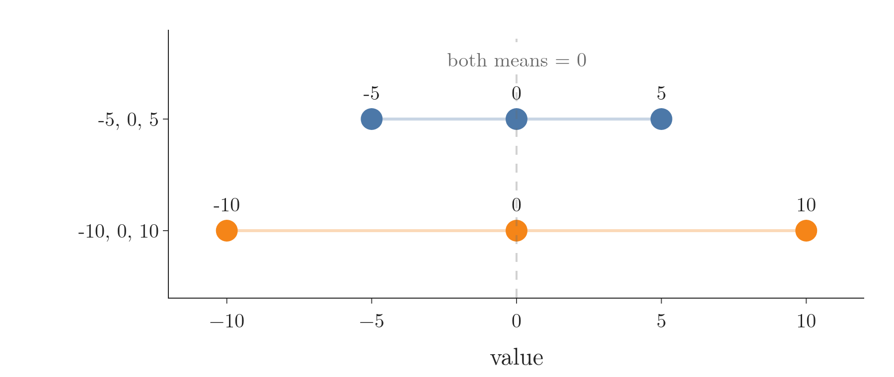
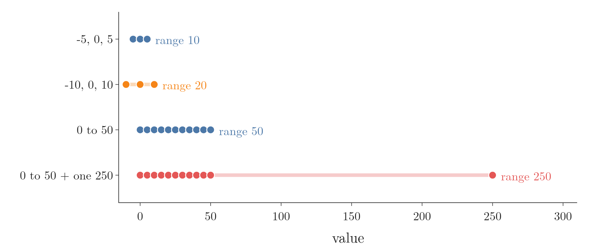
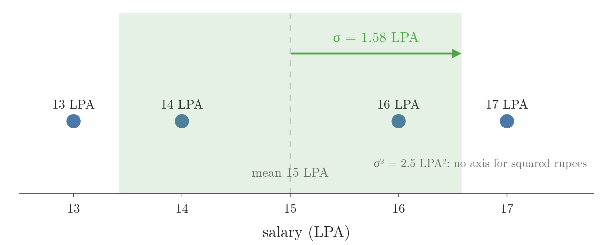
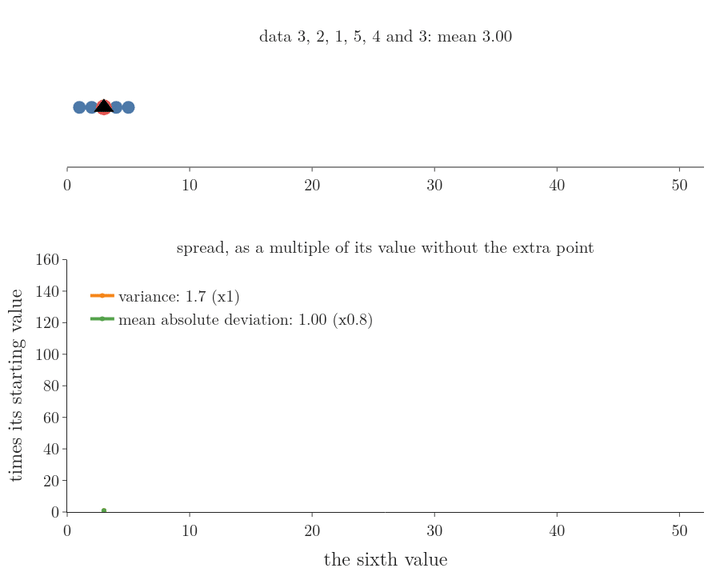

<!-- where-this-fits: generated by course_map/build_map.py; edit concepts.yaml, not this block -->
> **Where this fits:** Pipeline map step 3 (Understand data). See the [Course map](../../../00-course-map/00-course-map.md).
>
> 
>
> - **Builds on:** [Descriptive statistics](../../../MA/01-descriptive-stats/MA-004-what-is-statistics/MA-004-what-is-statistics.md#3-descriptive-and-inferential-statistics); [Population, sample, parameter and statistic](../../../MA/01-descriptive-stats/MA-004-what-is-statistics/MA-004-what-is-statistics.md#4-population-and-sample).
> - **Leads to:** [Covariance and covariance matrix](../../../MA/01-descriptive-stats/MA-009-covariance-and-correlation/MA-009-covariance-and-correlation.md#3-covariance); [One-way ANOVA](../../../MA/04-inference/MA-046-one-way-anova/MA-046-one-way-anova.md#3-splitting-the-variation); [PCA](../../../ML/05-dimensionality/ML-046-pca-geometric-intuition/ML-046-pca-geometric-intuition.md#1-what-pca-is); [Student's t-distribution](../../../MA/04-inference/MA-037-t-procedure/MA-037-t-procedure.md#5-students-t-distribution).
<!-- /where-this-fits -->


## 1. Overview

> **Key point:** A **measure of dispersion** (G-1206) says how spread out a feature is around its centre: range, **variance** (G-2074), **standard deviation** (G-1871), **mean absolute deviation** (G-1193) and **coefficient of variation** (G-408) each do this differently.


Figure 1 shows the idea behind the most used measure, the variance. This Note works five measures of spread with small numbers, and the sample version of the variance:

- range (section 3);
- variance, and why we square the distances (section 4);
- standard deviation, the variance brought back to the data's units (section 5);
- the sample variance, and why it divides by $n - 1$ (section 6);
- mean absolute deviation (section 7);
- coefficient of variation (section 8).

## 2. Why the centre is not enough

> **Key point:** Two features can share a mean and still be spread very differently.

A **feature** (G-772) is one variable of the data, one column of the table; an **observation** (G-1374) is one record, one row. Take two features of three observations each: $-5, 0, 5$ and $-10, 0, 10$. Both have mean 0 (the mean is the average, see [the mean](../MA-005-measures-of-central-tendency/MA-005-measures-of-central-tendency.md#3-mean)), yet the second is more spread out, as [mean is not enough](../../../ML/05-dimensionality/ML-046-pca-geometric-intuition/ML-046-pca-geometric-intuition.md#51-mean-is-not-enough) shows. A measure of centre alone cannot tell them apart. In Figure 2, both rows balance on the same dashed line; only their width differs.



A **measure of dispersion** is a statistical measure that describes the spread, or variability, of a dataset: how the data is distributed around its centre.

## 3. Range

> **Key point:** The range is the largest value minus the smallest; it is simple but ruined by a single **outlier** (G-1420; a value far from all the others).

The simplest way to measure spread is to look at the two extremes and measure the gap between them. That gap is the **range** (G-1626).

1. **In words:** subtract the smallest value from the largest.
2. **Example:** for $-5, 0, 5$:
   $$5 - (-5) = 10$$
   For $-10, 0, 10$:
   $$10 - (-10) = 20$$
   The range tells the two features apart where the mean could not.
3. **Formula:**
   $$\text{range} = \max(x) - \min(x)$$

The range uses only two values, the two extremes, so one outlier can blow it up. If a feature's values all lie between 0 and 50 except one at 250, the range jumps from about 50 to 250 because of that one point. Figure 3 shows both cases: the range is the length of each line, and the last line is set by a single value.



Salaries in India show the problem. Some of the richest people in the world live in India, and so do many people who earn very little. The range of Indian salaries is therefore huge, yet it says nothing about how most people earn. So the range is rarely used on its own.

## 4. Variance

> **Key point:** Variance is the average squared distance from the mean.

A better measure uses every value, not just the two extremes. We measure how far each value sits from the mean, and then average those distances. Squaring each distance first stops them cancelling (section 4.1). The result is the **variance** (G-2074).

When the data is the whole **population** (G-1525), every member of the group we care about, the mean is the **population mean** $\mu$ (G-1524) and the variance is written $\sigma^2$. When the data is a **sample** (G-1731), a small part of the population, the mean is the **sample mean** $\bar{x}$ (G-1725). [The mean](../MA-005-measures-of-central-tendency/MA-005-measures-of-central-tendency.md#3-mean) is taught in the previous Note; both means are computed the same way, from different data. This section works with the population version; section 6 changes it for a sample.

**Step by step**, for the five values 3, 2, 1, 5, 4 (Figure 1):

1. **Find the mean:**
   $$(3 + 2 + 1 + 5 + 4)/5 = 3$$
2. **Subtract the mean from each value:** $0, -1, -2, 2, 1$. Each number is a distance from the mean, with a sign.
3. **Square each distance:** $0, 1, 4, 4, 1$.
4. **Add the squares:**
   $$0 + 1 + 4 + 4 + 1 = 10$$
5. **Divide by the number of values:**
   $$10 / 5 = 2$$

So the variance of 3, 2, 1, 5, 4 is 2. The same steps give 16.7 for $-5, 0, 5$ and 66.7 for $-10, 0, 10$: the wider feature has the larger variance.

**Formula.** The five steps, written once for a population of $N$ values $x_1, \dots, x_N$ with mean $\mu$:
$$\sigma^2 = \frac{1}{N}\sum_{i=1}^{N} (x_i - \mu)^2$$

The $x_i - \mu$ is step 2, the square is step 3, the $\sum$ (sum) is step 4 and the $1/N$ is step 5.

Variance is in squared units, so doubling the spread multiplies it by four (worked in [the variance formula](../../../ML/05-dimensionality/ML-046-pca-geometric-intuition/ML-046-pca-geometric-intuition.md#52-the-variance-formula)).

### 4.1 Why we square the distances

> **Key point:** The plain distances from the mean always add up to zero, so we need squares (or absolute values) to stop them cancelling.

In Figure 1 the distances are $0, -1, -2, 2, 1$: the values below the mean give negative distances, those above give positive ones, and they add up to 0. Spread should add up, never cancel. Squaring makes every distance positive. The absolute value does the same, and gives the mean absolute deviation of section 7.

The zero total is not a coincidence.

> **Extra:** Proof that the distances from the mean always add up to zero.
>
> 1. **In words:** the mean is the balance point of the data, so the negative and positive distances cancel exactly.
> 2. **Formula:** since $\sum_{i=1}^{n} x_i = n\bar{x}$ by the definition of the mean,
>    $$\sum_{i=1}^{n} (x_i - \bar{x}) = \sum_{i=1}^{n} x_i - n\bar{x}$$
>    $$= n\bar{x} - n\bar{x}$$
>    $$= 0$$
> 3. **Example:** for 3, 2, 1, 5, 4:
>    $$0 + (-1) + (-2) + 2 + 1 = 0$$

### 4.2 Variance and outliers

> **Key point:** Squaring makes a far-away value count enormously, so variance is very sensitive to outliers.

A value far from the mean has a large distance, and its square is larger still. Add 50 to the five values above: the data becomes 3, 2, 1, 5, 4, 50, six values. One step per line:

$$\text{mean} = \frac{3 + 2 + 1 + 5 + 4 + 50}{6}$$
$$\text{mean} = \frac{65}{6} = 10.83$$

| Value | Distance from 10.83 | Squared distance |
|---|---|---|
| 3 | $-7.83$ | 61.4 |
| 2 | $-8.83$ | 78.0 |
| 1 | $-9.83$ | 96.7 |
| 5 | $-5.83$ | 34.0 |
| 4 | $-6.83$ | 46.7 |
| 50 | $39.17$ | 1534.0 |

$$61.4 + 78.0 + 96.7 + 34.0 + 46.7 + 1534.0$$
$$= 1850.8$$
$$\sigma^2 = \frac{1850.8}{6} = 308.5$$

The population variance jumps from 2 to 308.5. One value multiplied the variance by about 150.

## 5. Standard deviation

> **Key point:** The standard deviation is the square root of the variance; unlike the variance, it is in the same units as the data.

The variance has one annoying property: because every distance is squared, its units are squared too. Four people earn 16, 17, 13 and 14 LPA (lakh rupees per annum). The mean is 15 LPA, the distances are $1, 2, -2, -1$ LPA, and

$$\sigma^2 = \frac{1^2 + 2^2 + (-2)^2 + (-1)^2}{4}$$

$$\sigma^2 = \frac{10}{4} = 2.5 \text{ LPA}^2$$

"2.5 LPA squared" means nothing to anyone: nobody earns a squared rupee, and a squared length cannot be drawn on a salary axis. Taking the square root undoes the squaring of the units:

$$\sigma = \sqrt{2.5} = 1.58 \text{ LPA}$$

This square root is the **standard deviation** (G-1871). "1.58 LPA" means something: a typical salary here is about 1.58 lakh away from the mean of 15 lakh. Figure 4 draws the standard deviation on the salary axis itself, as the mean plus and minus one standard deviation, where the variance has no place.



**Formula:** the standard deviation is the square root of the variance, for a population (symbol $\sigma$) and for a sample (symbol $s$, section 6):
$$\sigma = \sqrt{\sigma^2}$$
$$s = \sqrt{s^2}$$

[Count, mean, standard deviation, minimum and maximum](../../../ML/02-getting-data/ML-018-understanding-your-data/ML-018-understanding-your-data.md#71-count-mean-standard-deviation-minimum-and-maximum) works another one through. For 3, 2, 1, 5, 4, the variance is 2, so the standard deviation is:

$$\sqrt{2} \approx 1.41$$

## 6. The sample variance: divide by n - 1

> **Key point:** Dividing by $n$ makes a sample's variance too small on average; dividing by $n - 1$ makes it right on average.

### 6.1 The sample version

We almost never have the whole population. We have a sample, and we use it to estimate the population's variance. Two things change in the formula:

1. we do not know $\mu$, so we measure the distances from the sample mean $\bar{x}$ instead;
2. we divide by $n - 1$ instead of $n$.

With both changes, the **sample variance** (G-2229) is

$$s^2 = \frac{1}{n - 1}\sum_{i=1}^{n} (x_i - \bar{x})^2$$

If 3, 2, 1, 5, 4 are a sample, the squared distances still add up to 10, and

$$s^2 = \frac{10}{5 - 1}$$

$$s^2 = 2.5$$

instead of the population version:

$$\frac{10}{5} = 2$$

The reason in one sentence: the values sit closer to their own sample mean than to the true mean $\mu$, so distances measured from $\bar{x}$ are too small, and dividing by the smaller $n - 1$ makes up for it. Dividing by $n - 1$ is called **Bessel's correction** (G-279). Sections 6.2 and 6.3 show both halves of that sentence.

### 6.2 The sample mean is the closest point to its sample

> **Key point:** The average squared distance to a point $v$ is smallest when $v$ is the sample mean, so it is always smaller around $\bar{x}$ than around $\mu$.

Take five Titanic ages, 53, 30, 19, 41 and 28, a random sample of the 714 known ages. Their sample mean is 34.2; the mean of all 714 ages is $\mu = 29.7$. Now pick any point $v$ on the age axis, and compute the **variance around $v$** (G-2228): square each value's distance to $v$, then divide by $n$. Then slide $v$ and repeat. In Figure 5, watch the orange line slide along the ages while the lower panel traces the result.


1. **The curve is a U.** Far from the data, every distance is large; near the middle, they are small.
2. **The bottom of the U is the sample mean.** At $v = \bar{x} = 34.2$, the squared distances of the ages 53, 30, 19, 41 and 28 are:
   $$18.8^2 = 353.4$$
   $$4.2^2 = 17.6$$
   $$15.2^2 = 231.0$$
   $$6.8^2 = 46.2$$
   $$6.2^2 = 38.4$$
   Their sum, then the average:
   $$353.4 + 17.6 + 231.0 + 46.2 + 38.4 = 686.8$$
   $$686.8 / 5 = 137.4$$
   This is the smallest value on the curve.
3. **The true mean sits up the wall.** At $v = \mu = 29.7$, the squared distances are:
   $$23.3^2 = 542.9$$
   $$0.3^2 = 0.1$$
   $$10.7^2 = 114.5$$
   $$11.3^2 = 127.7$$
   $$1.7^2 = 2.9$$
   Their sum, then the average:
   $$542.9 + 0.1 + 114.5 + 127.7 + 2.9 = 788.1$$
   $$788.1 / 5 = 157.6$$
   Dividing by $n$ around $\bar{x}$ gave 137.4, less than the 157.6 that the same five ages give around the true mean $\mu$.
4. **A new sample gives the same picture.** The second sample, 30, 40, 36, 28, 30, has its own U with its bottom at its own mean, 32.8 (20.2), while $\mu$ again gives more (29.8).

**Why the bottom is always at $\bar{x}$.** Write the variance around $v$ as a function of $v$:
$$f(v) = \frac{1}{n}\sum_{i=1}^{n} (x_i - v)^2$$

The lowest point of a smooth curve is where its slope, the **derivative** (G-595), is zero (see [what the sign of the derivative tells us](../../06-calculus/MA-061-derivatives-of-one-variable/MA-061-derivatives-of-one-variable.md#43-what-the-sign-of-the-derivative-tells-us)). By the [chain rule](../../06-calculus/MA-061-derivatives-of-one-variable/MA-061-derivatives-of-one-variable.md#53-the-chain-rule), the derivative of $(x_i - v)^2$ with respect to $v$ is $2(x_i - v) \times (-1)$, so

$$f'(v) = -\frac{2}{n}\sum_{i=1}^{n} (x_i - v)$$

Set it to zero:

$$-\frac{2}{n}\sum_{i=1}^{n} (x_i - v) = 0$$

Multiply both sides by $-n/2$:

$$\sum_{i=1}^{n} x_i - n v = 0$$

Solve for $v$:

$$v = \frac{1}{n}\sum_{i=1}^{n} x_i = \bar{x}$$

This holds for any $n$ values, so around the sample mean the average squared distance is always the smallest, and around $\mu$ it is larger, unless $\bar{x}$ happens to equal $\mu$ exactly.

### 6.3 How much too small

> **Key point:** Dividing by $n$ gives, on average, $(n-1)/n$ of the true variance; multiplying by $n/(n-1)$, which is the same as dividing by $n - 1$, removes the gap.

A tiny example shows the gap exactly. Take the population 1, 2, 3, 4. Its mean is 2.5 and its variance is

$$\sigma^2 = \frac{(-1.5)^2 + (-0.5)^2 + 0.5^2 + 1.5^2}{4}$$

$$\sigma^2 = \frac{5}{4} = 1.25$$

Now draw every possible sample of two values, picking with replacement: (1, 1), (1, 2), ..., (4, 4), 16 samples in all. For a sample $(a, b)$ the mean is $(a+b)/2$ and both values lie $|a - b|/2$ from it, so the squared distances add up to $(a-b)^2/2$. The table counts the 16 samples by their difference:

| Difference $\lvert a - b \rvert$ | Samples | Squared distances, summed | Divide by $n = 2$ | Divide by $n - 1 = 1$ |
|---|---|---|---|---|
| 0 | 4 | 0 | 0 | 0 |
| 1 | 6 | 0.5 | 0.25 | 0.5 |
| 2 | 4 | 2 | 1 | 2 |
| 3 | 2 | 4.5 | 2.25 | 4.5 |
| **Average over 16 samples** | | | **0.625** | **1.25** |

Dividing by $n$ gives 0.625 on average, half the true 1.25. Dividing by $n - 1$ gives exactly 1.25.

Figure 6 repeats the experiment on real data. We treat the 714 known Titanic ages as a population (variance 211) and draw 20,000 random samples of each size from 2 to 20.


Dividing by $n - 1$ (green) lands on the true variance at every sample size. Dividing by $n$ (red) is too small, and it follows a clear pattern, the dotted curve: on average it gives 0.495 of the true variance at $n = 2$, 0.666 at $n = 3$ and 0.747 at $n = 4$, close to $1/2$, $2/3$ and $3/4$. In general it gives $(n-1)/n$ of $\sigma^2$ (pattern after Khan Academy, "Simulation showing bias in sample variance"). Multiplying by $n/(n-1)$ cancels that factor:

$$\frac{n}{n-1} \times \frac{1}{n}\sum_{i=1}^{n}(x_i - \bar{x})^2$$

$$= \frac{1}{n-1}\sum_{i=1}^{n}(x_i - \bar{x})^2$$

$$= s^2$$

The gap shrinks as $n$ grows, because $n$ and $n - 1$ become almost equal. In the language of estimators, dividing by $n$ is a **biased estimator** (G-289) of $\sigma^2$ and $s^2$ is an **unbiased estimator** (G-2034): right on average.

> **Extra:** The exact size of the loss. For any point $\mu$, an identity of algebra splits the squared distances:
> $$\sum_{i=1}^{n}(x_i - \mu)^2$$
> $$= \sum_{i=1}^{n}(x_i - \bar{x})^2 + n(\bar{x} - \mu)^2$$
> So measuring distances from $\bar{x}$ instead of the true $\mu$ always loses the amount $n(\bar{x} - \mu)^2$. Divided by $n$, the loss is $(\bar{x} - \mu)^2$, the height of the U-wall in Figure 5. For the five ages:
> $$157.6 - 137.4 = 20.2$$
> $$(34.2 - 29.7)^2 = 4.5^2 = 20.25$$
> For 3, 2, 1, 5, 4 and $\mu = 2.5$, the left side is 11.25. The right side is:
> $$10 + 5 \times 0.5^2$$
> $$= 10 + 1.25 = 11.25$$
>
> Averaged over all samples, the lost amount equals exactly one $\sigma^2$, which leaves $(n-1)\sigma^2$: dividing by $n - 1$ gives back $\sigma^2$. The step "equals one $\sigma^2$" needs the variance of a sample mean, which [mean and variance of the sample means](../../04-inference/MA-033-sampling-distribution-and-clt/MA-033-sampling-distribution-and-clt.md#42-mean-and-variance-of-the-sample-means) gives.

> **Python:** Population and sample variance.
>
> ```python
> import numpy as np
>
> x = np.array([3, 2, 1, 5, 4])
> np.var(x)           # 2.0: divides by n (ddof=0)
> np.var(x, ddof=1)   # 2.5: divides by n - 1
> ```
>
> **ddof** (G-549) ("delta degrees of freedom") is the number subtracted from $n$. NumPy uses `ddof=0` by default; pandas' `.var()` and `.std()` use `ddof=1`. A spreadsheet offers both too, for example `VAR.P` (divide by $n$) and `VAR.S` (divide by $n - 1$).

## 7. Mean absolute deviation

> **Key point:** The mean absolute deviation averages the absolute distances from the mean; it is less sensitive to outliers than variance, but harder to work with mathematically.

Squaring is one way to stop the distances cancelling (section 4.1). The other is to drop their sign: take each distance's absolute value, then average. The result is the **mean absolute deviation** (G-1193) (see also [why squares, not absolute distances](../../../ML/05-dimensionality/ML-046-pca-geometric-intuition/ML-046-pca-geometric-intuition.md#54-why-squares-not-absolute-distances)).

1. **Example:** for 3, 2, 1, 5, 4 the mean is 3, and the absolute distances are $0, 1, 2, 2, 1$. The mean absolute deviation is:
   $$(0 + 1 + 2 + 2 + 1)/5$$
   $$= 6/5 = 1.2$$
2. **Formula:**
   $$\text{MAD} = \frac{1}{n}\sum_{i=1}^{n} \lvert x_i - \bar{x} \rvert$$

Its strength is that a far value counts in proportion to its distance, not its distance squared. So outliers inflate it less than they inflate variance. Figure 7 tests this on 3, 2, 1, 5, 4: a sixth value moves out from 3 to 50. Watch the two curves: the variance climbs as a curve to about 154 times its value without the sixth point, 2 (308.5, section 4.2), while the mean absolute deviation climbs in a straight line to about 11 times its 1.2.



Its weaknesses are mathematical.

- **Calculus.** The last panel of Figure 5 replaces the squares by absolute distances. The U becomes a V made of straight pieces, with a sharp corner at the bottom. A sharp corner has no derivative, so the trick of section 6.2, setting the slope to zero, does not work; the absolute value has no derivative at zero (see [why squares, not absolute distances](../../../ML/05-dimensionality/ML-046-pca-geometric-intuition/ML-046-pca-geometric-intuition.md#54-why-squares-not-absolute-distances)).
- **Inference.** A sample's variance lets us estimate the population's variance (section 6); a sample's mean absolute deviation is not used that way.

So inferential statistics is built on the variance, and the mean absolute deviation is rarely used.

> **Extra:** The abbreviation MAD is also used for the **median absolute deviation** (G-1207), a different, even more robust measure (see [a numerical column](../../../ML/02-getting-data/ML-021-pandas-profiling/ML-021-pandas-profiling.md#42-a-numerical-column-age)). Always check which one is meant.

## 8. Coefficient of variation

> **Key point:** The coefficient of variation divides the standard deviation by the mean, so we can compare the spread of features measured in different units.

Salary in lakhs and experience in years cannot be compared directly: their means and standard deviations are in different units, like apples and oranges. Dividing each feature's standard deviation by its own mean removes the units and leaves a pure number. That number is the **coefficient of variation** (CV) (G-408), the unit-free spread met in [a numerical column](../../../ML/02-getting-data/ML-021-pandas-profiling/ML-021-pandas-profiling.md#42-a-numerical-column-age); here we write it as a percentage, $\sigma / \mu \times 100$ percent.

For the 714 known Titanic ages, the mean is 29.70 years and the standard deviation 14.53 years; for the 891 fares, the mean is 32.20 and the standard deviation 49.69. (The computer finds each standard deviation by the steps of section 5: distances from the mean, squares, their average, square root.) Then

$$\text{CV of Age} = \frac{14.53}{29.70} \times 100$$
$$\text{CV of Age} \approx 48.9\ \text{percent}$$
$$\text{CV of Fare} = \frac{49.69}{32.20} \times 100$$
$$\text{CV of Fare} \approx 154.3\ \text{percent}$$

The fares vary about three times as much as the ages, relative to their means. Figure 8 shows why: dividing each feature by its own mean puts both on one scale, where 1 is the mean. The ages stay within about 0 to 2.7 times their mean; the fares run from 0 to 16 times theirs.


The bigger the CV, the further the data spreads from its mean; the smaller, the more it is concentrated near the mean. The same idea compares two people's scores on different exams, or the spread of the same quantity in different currencies.

> **Extra:** The CV only makes sense for data with a true zero and a positive mean, such as fares, ages or weights; near a mean of 0 it jumps wildly (NIST Dataplot). Celsius has no true zero, so the same days give different CVs in different units: 10, 20, 30 degrees Celsius give 50%, but the same days in Fahrenheit (50, 68, 86) give about 26.5%.

> **Python:** The coefficient of variation.
>
> ```python
> import pandas as pd
>
> df = pd.read_csv("data/titanic_train.csv")
> for col in ["Age", "Fare"]:
>     cv = df[col].std() / df[col].mean() * 100
>     print(col, round(cv, 1))   # Age 48.9, Fare 154.3
> ```
>
> The Notebook for this Note (`MA-006-measures-of-dispersion.ipynb`) computes every measure of this Note on the Titanic data and reruns the $n - 1$ experiments.

## 9. Summary

| Measure | Formula | Example (3, 2, 1, 5, 4) | Units | Outliers | Why it matters |
|---|---|---|---|---|---|
| Range | $\max - \min$ | 4 | data units | ruins it | uses only the two extremes, so it is rarely used alone |
| Variance | $\sum (x_i - \mu)^2 / N$; sample divides by $n - 1$ | 2 (sample: 2.5) | squared | very sensitive | uses every value; inferential statistics is built on it |
| Standard deviation | $\sqrt{\text{variance}}$ | 1.41 | data units | sensitive | in the data's units, so it reads as a typical distance from the mean |
| Mean absolute deviation | $\sum \lvert x_i - \bar{x} \rvert / n$ | 1.2 | data units | less sensitive | its V-shaped curve has a sharp corner with no derivative, so it is rarely used |
| Coefficient of variation | $\sigma / \mu \times 100$ percent | 47% | none | sensitive | has no units, so it compares features in different units |

- Distances from the mean always add up to 0, so variance squares them.
- The standard deviation is the variance brought back to the data's units, so it can be drawn on the data's own axis, where the variance cannot.
- The sample mean is the point closest to its own sample, so dividing by $n$ is too small on average, by the factor $(n-1)/n$; the sample variance divides by $n - 1$ (Bessel's correction).
- The CV compares the spread of features in different units, because dividing by the mean removes the units.
- Two features with the same mean can be spread very differently, so a measure of spread is needed beside the centre.

## 10. Sources

**Built from**

- CampusX, "Session 38 - Descriptive Statistics Part 1 | DSMP 2023", YouTube, https://www.youtube.com/watch?v=Uv3Blie7F3g
- StatQuest with Josh Starmer, "Calculating the Mean, Variance and Standard Deviation, Clearly Explained!!!", YouTube, https://www.youtube.com/watch?v=SzZ6GpcfoQY
- StatQuest with Josh Starmer, "Why Dividing By N Underestimates the Variance", YouTube, https://www.youtube.com/watch?v=sHRBg6BhKjI
- Khan Academy, "Simulation showing bias in sample variance", YouTube, https://www.youtube.com/watch?v=Cn0skMJ2F3c

**Other references**

- NIST/SEMATECH. *Dataplot Reference Manual*: Coefficient of Variation. itl.nist.gov, Dataplot refman2, coefvari.

## 11. Key terms

Terms taught in this Note come first; linked terms are recaps, taught in the Note the link opens.

| Term | Meaning |
|---|---|
| Measure of dispersion (G-1206) | A number that describes how spread out a column is around its centre. |
| Mean absolute deviation (G-1193) | The average absolute distance of the points from their mean. Sometimes also abbreviated MAD, which clashes with the median absolute deviation. |
| Coefficient of variation (CV) (G-408) | Standard deviation divided by mean: spread relative to the average. |
| Range (G-1626) | The simplest measure of spread: the largest value minus the smallest. |
| Sample variance $s^2$ (G-2229) | The variance computed from a sample, $s^2$: the squared distances from the sample mean, summed and divided by $n - 1$; dividing by $n - 1$ instead of $n$ makes it right on average as an estimate of the population variance. |
| Bessel's correction (G-279) | Dividing by $n - 1$ instead of $n$, so the sample variance is right on average. |
| Variance around a point $v$ (G-2228) | The average squared distance of the values to $v$; smallest when $v$ is the sample mean. |
| ddof (G-549) | The NumPy and pandas argument that sets the number subtracted from $n$ in the variance's denominator: `ddof=1` divides by $n - 1$ (sample variance), `ddof=0` by $n$. NumPy defaults to 0, pandas to 1. |
| [Variance (of data)](../../../ML/05-dimensionality/ML-046-pca-geometric-intuition/ML-046-pca-geometric-intuition.md#21-the-rule-keep-the-bigger-spread) (G-2074) | The average squared distance of the values from their mean; the square of the standard deviation; divide by $n$ for a population (NumPy default) or $n - 1$ for a sample (pandas default). |
| [Standard deviation](../../../ML/02-getting-data/ML-018-understanding-your-data/ML-018-understanding-your-data.md#71-count-mean-standard-deviation-minimum-and-maximum) (G-1871) | How far values typically lie from the mean; divide by $n - 1$ for a sample (pandas default) or by $n$ for a population (NumPy default). |
| [Feature](../../../ML/01-foundations/ML-002-ai-vs-ml-vs-dl/ML-002-ai-vs-ml-vs-dl.md#52-features-chosen-by-us-or-learned) (G-772) | One piece of information about each example that a model uses (e.g. a student's CGPA). |
| [Observation](../../../ML/01-foundations/ML-003-types-of-ml/ML-003-types-of-ml.md#21-learning-from-inputs-and-outputs) (G-1374) | One record of a dataset: one row of the data table. |
| [Outlier](../../../ML/02-getting-data/ML-019-univariate-analysis/ML-019-univariate-analysis.md#81-whiskers-and-outliers) (G-1420) | A value far from the rest of the data. |
| [Population](../../../MA/01-descriptive-stats/MA-004-what-is-statistics/MA-004-what-is-statistics.md#4-population-and-sample) (G-1525) | The entire group of individuals or objects we want to study. |
| [Population mean ($\mu$)](../../../MA/01-descriptive-stats/MA-005-measures-of-central-tendency/MA-005-measures-of-central-tendency.md#3-mean) (G-1524) | The mean of every value in the population. |
| [Sample](../../../ML/01-foundations/ML-007-challenges-in-ml/ML-007-challenges-in-ml.md#41-a-sample-that-tells-the-wrong-story) (G-1731) | The part of a population that we actually measure, such as 50,000 people asked about their salary instead of everyone in India; we study it because measuring the whole population is usually impossible, and use it to draw conclusions about the population. |
| [Sample mean ($\bar{x}$)](../../../MA/01-descriptive-stats/MA-005-measures-of-central-tendency/MA-005-measures-of-central-tendency.md#3-mean) (G-1725) | The average of the values in a sample, $\bar{x}$: add them up and divide by $n$; it is used as the estimate of the population mean $\mu$. |
| [Derivative](../../../MA/06-calculus/MA-061-derivatives-of-one-variable/MA-061-derivatives-of-one-variable.md#41-from-secant-to-tangent) (G-595) | The slope of a function at a point: how fast the output changes as the input changes there. It is zero at the lowest point of a smooth curve, which is how training finds a minimum. |
| [Biased estimator](../../../MA/08-likelihood/MA-071-mle-for-common-distributions/MA-071-mle-for-common-distributions.md#52-biased-but-consistent) (G-289) | A formula for estimating a value from data (an estimator) that is systematically too high or too low on average. |
| [Unbiased estimator](../../../MA/08-likelihood/MA-071-mle-for-common-distributions/MA-071-mle-for-common-distributions.md#52-biased-but-consistent) (G-2034) | A formula that guesses a true value from a sample (an estimator) and is right on average: its average over many samples equals the true value. |
| [Median absolute deviation (MAD)](../../../ML/02-getting-data/ML-021-pandas-profiling/ML-021-pandas-profiling.md#42-a-numerical-column-age) (G-1207) | The median distance of the values from their median. |
