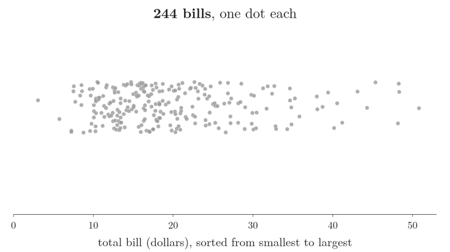
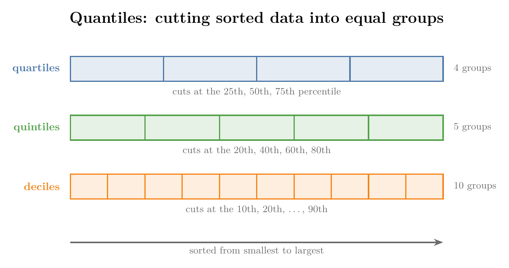
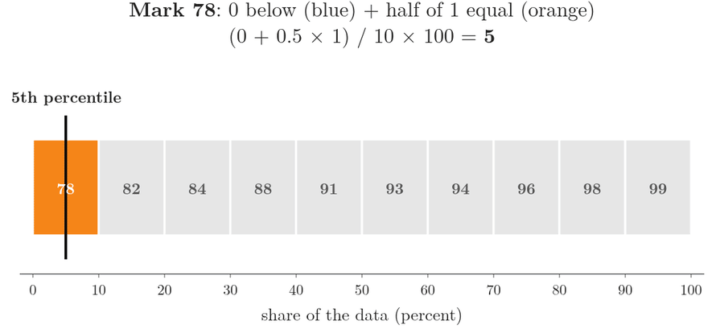
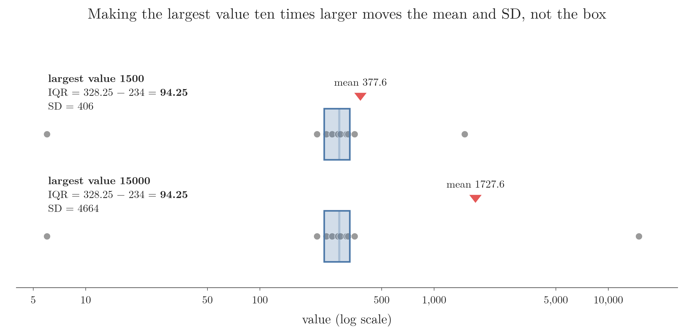

<!-- where-this-fits: generated by course_map/build_map.py; edit concepts.yaml, not this block -->
> **Where this fits:** Pipeline map step 3 (Understand data). See the [Course map](../../../00-course-map/00-course-map.md).
>
> 
>
> - **Builds on:** [Frequency tables](../../../MA/01-descriptive-stats/MA-007-frequency-tables-and-graphs/MA-007-frequency-tables-and-graphs.md#2-frequency-tables-for-a-categorical-feature).
> - **Leads to:** [Exploratory data analysis](../../../ML/01-foundations/ML-009-mldlc/ML-009-mldlc.md#6-exploratory-data-analysis-eda); [Univariate analysis](../../../ML/01-foundations/ML-009-mldlc/ML-009-mldlc.md#62-what-we-do-during-eda); [Standardization](../../../ML/01-foundations/ML-009-mldlc/ML-009-mldlc.md#52-common-preprocessing-tasks); [Variance](../../../ML/02-getting-data/ML-018-understanding-your-data/ML-018-understanding-your-data.md#71-count-mean-standard-deviation-minimum-and-maximum); [IQR outlier method](../../../ML/04-missing-data-and-outliers/ML-040-what-are-outliers/ML-040-what-are-outliers.md#1-overview); [Percentile outlier method](../../../ML/04-missing-data-and-outliers/ML-040-what-are-outliers/ML-040-what-are-outliers.md#1-overview).
> - **Compare with:** [Inferential statistics](../../../MA/01-descriptive-stats/MA-004-what-is-statistics/MA-004-what-is-statistics.md#3-descriptive-and-inferential-statistics).
<!-- /where-this-fits -->

## 1. Overview

> **Key point:** Percentiles locate values inside sorted data; five of them make the five-number summary, and the five-number summary draws the box plot.


Figure 1 shows where this Note ends: a box plot built by hand from ten numbers. A box plot draws a feature's values on one axis as a box with lines (whiskers) and dots; the frames add one part at a time, and sections 5 and 6 explain each part. The way there is a chain of ideas, each needing the one before:

1. quantiles (section 2);
2. percentiles and how to compute them (section 3);
3. the five-number summary and the IQR (section 4);
4. the box plot, built and read (sections 5 and 6).

## 2. Quantiles

> **Key point:** Quantiles cut sorted data into equal-sized groups; quartiles make 4 groups, quintiles 5, deciles 10 and percentiles 100.

**Quantiles** (G-1599) are values that divide sorted numerical data into groups of equal size, each holding the same number of observations. An **observation** (G-1374) is one record, one row of the data table; a **feature** (G-772) is one variable, one column of that table. Quantiles help us understand a distribution (how the values of a feature are spread), compare features and spot outliers (values far from the rest).

Figure 2 shows the idea on the 244 restaurant bills of the tips data, one dot per bill, sorted along a line:

1. **One cut in the middle** leaves 122 bills on each side. That cut, at 17.8 dollars, is the median.
2. **Cutting each half in the middle again** gives four groups of 61 bills. The three cuts, at 13.3, 17.8 and 24.2 dollars, are the quartiles.
3. **The two middle groups** lie between the first and third cuts. They hold half of the bills, 122, and they become the box of the box plot in section 5.



A quantile is the cut itself, a value on the line, and not the group between two cuts.

The names are confusing because they sound alike. "Quantile" is the general word; the others are kinds of quantile, named by the number of groups (Figure 3):

- **Quartiles** (G-1602) cut the data into 4 groups, at the 25th, 50th and 75th percentiles: $Q_1$, $Q_2$ (the **median**, G-1209) and $Q_3$. [Percentiles in `describe()`](../../../ML/02-getting-data/ML-018-understanding-your-data/ML-018-understanding-your-data.md#72-percentiles) meets them in code.
- **Quintiles** (G-1608) cut it into 5 groups, at the 20th, 40th, 60th and 80th percentiles.
- **Deciles** (G-554) cut it into 10 groups, at the 10th, 20th, ..., 90th percentiles.
- **Percentiles** (G-1483) cut it into 100 groups.



Four facts hold for all of them:

1. **The data must be sorted** from low to high first. Without sorting, no quantile can be found.
2. **A quantile is a location** in the sorted data: we find where the cut falls.
3. **The cut may not be a value in the data.** It can fall between two values, as Section 3 shows.
4. **Every quantile is a percentile.** Quartiles, quintiles and deciles are just particular percentiles, so knowing how to compute percentiles is enough.

## 3. Percentiles

> **Key point:** The $p$-th percentile is the value below which $p$ percent of the data lies; we find it at position $(p/100) \times (n+1)$ of the sorted data.

A **percentile** (see also [percentiles in code](../../../ML/02-getting-data/ML-018-understanding-your-data/ML-018-understanding-your-data.md#72-percentiles)) is the value below which a given percentage of the observations falls. The 75th percentile has 75% of the data below it and 25% above.

A percentile is not a percentage. A 90% score in a board exam means 90 marks out of 100. A 90th-percentile score, as in the CAT exam, means we did better than 90% of the candidates, whatever our marks were. At the 99th percentile, only 1% of candidates scored higher.

### 3.1 The value at a given percentile

> **Key point:** Compute the position $(p/100) \times (n+1)$; if it falls between two values, move the same fraction of the way from the lower to the upper one.

Ten students scored 78, 82, 84, 88, 91, 93, 94, 96, 98 and 99 (already sorted). How many marks put a student at the 75th percentile? Figure 4 shows the answer.


1. **In words:** sort the data. Compute the percentile's position. If the position is a whole number, the value there is the answer. If it falls between two positions, start at the lower value and add the same fraction of the gap to the next one.
2. **Formula:** for the $p$-th percentile of $n$ sorted values $x_{(1)} \le \dots \le x_{(n)}$, the location is
   $$L = \frac{p}{100}\thinspace(n + 1)$$
   Write $L = k + d$, with $k$ its whole part and $d$ its decimal part. Then
   $$P_p = x_{(k)} + d\thinspace\bigl(x_{(k+1)} - x_{(k)}\bigr)$$
3. **Example:** for the 75th percentile,
   $$L = \frac{75}{100} \times (10 + 1) = 8.25$$
   So $k = 8$ and $d = 0.25$. The 8th mark is 96 and the 9th is 98:
   $$P_{75} = 96 + 0.25 \times (98 - 96)$$

   $$= 96 + 0.5 = 96.5$$

So 96.5 marks puts a student at the 75th percentile, although nobody scored exactly 96.5 (fact 3 of Section 2).

The 50th percentile works the same way. The location is:

$$L = 0.5 \times 11 = 5.5$$

That is halfway between the 5th mark (91) and the 6th (93):

$$P_{50} = 91 + 0.5 \times (93 - 91)$$

$$= 91 + 1 = 92$$

This value, 92, is the median, as it should be.

> **Extra:** Software uses several percentile formulas, and they give slightly different answers on small data. The $(n+1)$ formula above is NumPy's `method="weibull"`. NumPy's and pandas' default, `"linear"`, uses this location instead:
>
> $$1 + (p/100) \times (n - 1)$$
>
> For the ten marks it gives location 7.75 and a 75th percentile of:
>
> $$94 + 0.75 \times 2 = 95.5$$
>
> That is 95.5, not 96.5. Both are correct conventions; on large data they agree closely. [Percentiles in code](../../../ML/02-getting-data/ML-018-understanding-your-data/ML-018-understanding-your-data.md#72-percentiles) uses pandas' default.

> **Python:** Percentiles.
>
> ```python
> import numpy as np
>
> marks = [78, 82, 84, 88, 91, 93, 94, 96, 98, 99]
> np.percentile(marks, 75, method="weibull")   # 96.5, the (n+1) rule
> np.percentile(marks, 75)                     # 95.5, the default rule
> ```
>
> In pandas, `df["marks"].quantile(0.75)` takes the percentile as a fraction.

### 3.2 The percentile of a given value

> **Key point:** The percentile rank of a value counts the values below it, plus half of those equal to it, as a share of all values.

The reverse question: a student scored 88. At which percentile is that score? The answer is the score's **percentile rank** (G-1482).

Figure 5 gives each of the ten marks one tenth of the scale, from 0 to 100. A mark's percentile rank is the middle of its own tenth: everything below it (blue) plus half of its own block (orange).

1. **In words:** count the values below the given value, add half the number of values equal to it, divide by the total, and multiply by 100.
2. **Formula:** with $X$ the number of values below the value, $Y$ the number equal to it, and $n$ the total,
   $$\text{percentile rank} = \frac{X + 0.5\thinspace Y}{n} \times 100$$
3. **Example:** three marks (78, 82, 84) lie below 88, and one mark equals it. So
   $$\text{rank of 88} = \frac{3 + 0.5 \times 1}{10} \times 100$$

   $$= \frac{3.5}{10} \times 100 = 35$$
   A score of 88 is at the 35th percentile. For 99, nine marks lie below it:
   $$\text{rank of 99} = \frac{9 + 0.5 \times 1}{10} \times 100$$

   $$= \frac{9.5}{10} \times 100 = 95$$



Counting half of the equal values puts a value in the middle of its own share of the data, as the black line in Figure 5 shows. Without the half, the lowest mark would be at the 0th percentile and the highest at the 90th, which is lopsided.

> **Python:** Percentile rank.
>
> ```python
> from scipy import stats
>
> stats.percentileofscore(marks, 88, kind="mean")   # 35.0
> ```
>
> `kind="mean"` is the formula above. Other `kind` values count the equal values fully or not at all.

## 4. The five-number summary and the IQR

> **Key point:** Minimum, Q1, median, Q3 and maximum split the data into four equal parts; the IQR, Q3 - Q1, is the width of the middle half.

The **five-number summary** (G-787: minimum, $Q_1$, median, $Q_3$, maximum) and the **interquartile range** (IQR, G-966) are met in [the box plot of one feature](../../../ML/02-getting-data/ML-019-univariate-analysis/ML-019-univariate-analysis.md#8-box-plot). In percentile terms they are the 0th, 25th, 50th, 75th and 100th percentiles, so the location formula of Section 3.1 computes every one of them.

The IQR uses only $Q_1$ and $Q_3$, so making the smallest or largest value more extreme does not change it. Take these ten sorted values, the running example of Section 5:

$$6,\ 213,\ 241,\ 260,\ 281,\ 290,\ 314,\ 321,\ 350,\ 1500$$

Their quartiles, with the location formula of Section 3.1, are $Q_1 = 234$, median $= 285.5$ and $Q_3 = 328.25$; Section 5 (step 2) works them out one step at a time. Figure 6 replaces the largest value, 1500, by 15000:

- **The box does not move.** $Q_1$ stays 234, the median 285.5 and $Q_3$ 328.25, so the IQR stays 94.25. Only the position of the last value changed, and the quartiles depend on the middle positions.
- **The mean and standard deviation move a lot.** Both add up every value, the extreme one included. The mean, one step per line:

  $$6 + 213 + 241 + 260 + 281 = 1001$$

  $$290 + 314 + 321 + 350 = 1275$$

  $$\text{sum} = 1001 + 1275 + 1500 = 3776$$

  $$\text{mean} = \frac{3776}{10} = 377.6$$

  With 15000 in place of 1500:

  $$\text{sum} = 1001 + 1275 + 15000 = 17276$$

  $$\text{mean} = \frac{17276}{10} = 1727.6$$

  The **standard deviation** (G-1871), found from the distances to the mean as in [standard deviation](../MA-006-measures-of-dispersion/MA-006-measures-of-dispersion.md#5-standard-deviation), jumps from 406 to 4664.



In Figure 6 the horizontal axis is the value on a log scale (equal distances along the axis mean equal factors, as the ticks 5, 10, 50, 100, 500, 1,000, 5,000, 10,000 show, so 6 and 15000 fit on one axis). There are two rows, one for each case (largest value 1500 and 15000): grey dots are the ten values, the blue box runs from $Q_1$ to $Q_3$, and the red triangle is the mean. Compare the box with the red mean in the two cases: the box stays where it is and the mean moves far right.

This property is **robustness** (G-1700): a statistic is robust when a few extreme values cannot pull it far. The IQR and the median are robust, the mean and the standard deviation are not. pandas' `describe()` prints all five numbers, along with the count, mean and standard deviation.

## 5. Building a box plot by hand

> **Key point:** Quartiles give the box, fences 1.5 IQR beyond it decide how far the whiskers reach, and any value beyond the fences is drawn as an outlier.

A **box plot** (G-329), or box-and-whisker plot, draws the five-number summary; [the box plot of one feature](../../../ML/02-getting-data/ML-019-univariate-analysis/ML-019-univariate-analysis.md#81-whiskers-and-outliers) labels its parts on the Titanic ages. Here we build one ourselves for ten values, step by step as in Figure 1:

$$6,\ 213,\ 241,\ 260,\ 281,\ 290,\ 314,\ 321,\ 350,\ 1500$$

**Step 1: sort.** The values are already in ascending order.

**Step 2: the box.** We need $Q_1$, $Q_2$ and $Q_3$, with the location formula of Section 3.1 and $n + 1 = 11$:

- $Q_2$: the location is
  $$L = 0.5 \times 11 = 5.5$$
  which is halfway between 281 and 290:
  $$Q_2 = 281 + 0.5 \times 9 = 285.5$$
- $Q_1$: the location is
  $$L = 0.25 \times 11 = 2.75$$
  which is between the 2nd value (213) and the 3rd (241):
  $$Q_1 = 213 + 0.75 \times (241 - 213)$$

  $$= 213 + 21 = 234$$
- $Q_3$: the location is
  $$L = 0.75 \times 11 = 8.25$$
  which is between the 8th value (321) and the 9th (350):
  $$Q_3 = 321 + 0.25 \times (350 - 321)$$

  $$= 321 + 7.25 = 328.25$$

The box runs from 234 to 328.25, with the median line at 285.5.

**Step 3: the fences.** The whiskers' limits are not the smallest and largest values. They are the **fences** (G-776), computed 1.5 IQR beyond the box (see [the fences](../../../ML/04-missing-data-and-outliers/ML-042-outliers-iqr/ML-042-outliers-iqr.md#3-the-fences)):
$$\text{IQR} = 328.25 - 234 = 94.25$$

$$1.5 \times \text{IQR} = 141.375$$

$$\text{lower fence} = 234 - 141.375 = 92.625$$

$$\text{upper fence} = 328.25 + 141.375 = 469.625$$

**Step 4: whiskers and outliers.** Each whisker stops at the last real value inside its fence:

- **Left:** the fence is at 92.625; the smallest value inside it is 213. So the whisker ends at 213, and 6, below the fence, is drawn as an **outlier** (G-1420) dot.
- **Right:** the fence is at 469.625; the last value inside it is 350. The whisker ends at 350, and 1500 is an outlier.

These four steps are the whole construction.

> **Extra:** Why 1.5 IQR? (The rule's origin is in [the fences](../../../ML/04-missing-data-and-outliers/ML-042-outliers-iqr/ML-042-outliers-iqr.md#3-the-fences).) For normally distributed data, $Q_1$ and $Q_3$ sit 0.674 standard deviations from the mean. The IQR is the distance between them:
>
> $$0.674 + 0.674 = 1.349$$
>
> So the IQR is 1.349 standard deviations, and the fence lies 1.5 IQRs beyond $Q_3$:
>
> $$1.5 \times 1.349 = 2.02$$
>
> $$0.674 + 2.02 = 2.70$$
>
> The fences sit 2.70 standard deviations out. Only about 0.7% of normal data falls outside them, so a dot beyond a fence is genuinely unusual.

> **Python:** The box plot of the ten values.
>
> ```python
> import plotly.express as px
>
> data = [6, 213, 241, 260, 281, 290, 314, 321, 350, 1500]
> px.box(x=data, points="outliers")
> ```
>
> Plotly's default quartile formula can differ slightly from the hand calculation. The Notebook (`MA-008-percentiles-and-box-plots.ipynb`) redoes every step in code.

## 6. Reading box plots

> **Key point:** A box plot shows the centre, the spread, the skew and the outliers of a feature at once, and side-by-side box plots compare groups.

One box plot answers four questions:

- **Where is the centre?** The median line.
- **How spread out is the data?** The width of the box (the IQR) and the reach of the whiskers.
- **Is it skewed?** A lopsided distribution has **skewness** (G-1817). If the median sits off-centre in the box, the middle half of the data is lopsided. If one whisker is much longer than the other, one tail of the data is longer.
- **Are there outliers?** The dots beyond the whiskers. The box plot is the standard outlier check for data that is not normally distributed (the IQR method, [the fences](../../../ML/04-missing-data-and-outliers/ML-042-outliers-iqr/ML-042-outliers-iqr.md#3-the-fences)). The fences are built from the quartiles, and section 4 showed that the outliers themselves cannot pull the quartiles, so the outliers cannot hide by stretching the fences. A rule built on the mean and standard deviation lacks this protection, because the outliers move both.

A box plot hides how many observations stand behind it: a box drawn from 10 values looks as solid as one drawn from 1,000. Drawing the raw points over the box, as in the last frame of Figure 2, shows the amount of data as well.

A fifth use is comparison. Splitting a numerical feature (numbers, such as age) by a categorical one (labels, such as ticket class) gives one box plot per category, side by side, as in [box plots across categories](../../../ML/02-getting-data/ML-020-bivariate-multivariate-analysis/ML-020-bivariate-multivariate-analysis.md#5-box-plot-spread-of-a-numerical-column-across-categories). In Figure 7 each box is one ticket class, and the vertical axis is age.


Comparing the three boxes:

- **Centre:** first-class passengers were older (median 37) than second (29) and third class (24).
- **Spread:** the first-class box is the widest (27 to 49), so their ages varied the most.
- **Outliers:** in second and third class, the oldest passengers are outliers, because those boxes are narrow. In second class the youngest children (under about 3.5 years, below its lower fence) are outliers too. In first class, every age from 0.92 to 80 fits inside the whiskers.

## 7. Summary

| Idea | Formula | Example | Why it matters |
|---|---|---|---|
| Percentile location | $L = (p/100) \times (n+1)$ | 75th of 10 values: 8.25 | every quantile is a percentile, so this one formula finds them all |
| Percentile value | $x_{(k)} + d\thinspace(x_{(k+1)} - x_{(k)})$ | $96 + 0.25 \times 2 = 96.5$ | the cut can fall between two values |
| Percentile rank | $(X + 0.5Y)/n \times 100$ | mark 88: 35th percentile | half of the equal values puts a value in the middle of its own share |
| IQR | $Q_3 - Q_1$ | $328.25 - 234 = 94.25$ | uses only $Q_1$ and $Q_3$, so an extreme value cannot change it |
| Fences | $Q_1 - 1.5\thinspace\text{IQR}$, $Q_3 + 1.5\thinspace\text{IQR}$ | 92.625 and 469.625 | decide where the whiskers stop and which values are outliers |

- Quantile is the general word; quartiles (4), quintiles (5), deciles (10) and percentiles (100) are kinds of it.
- A percentile need not be a value in the data, because the cut can fall between two values (96.5 marks, though nobody scored 96.5).
- Five-number summary: minimum, $Q_1$, median, $Q_3$, maximum. These split the data into four equal parts, so they are all a box plot needs.
- Whiskers stop at the last value inside the fences; values beyond are outliers, so a dot on a box plot flags a value far from the middle half.
- One box plot therefore shows a feature's centre, spread, skew and outliers at once, and side-by-side box plots compare groups.

## 8. Sources

**Built from**

- CampusX, "Session 39 - Descriptive Statistics Part 2 | DSMP 2023", YouTube, https://www.youtube.com/watch?v=1ndVC500-EU
- StatQuest with Josh Starmer, "Quantiles and Percentiles, Clearly Explained!!!", YouTube, https://www.youtube.com/watch?v=IFKQLDmRK0Y
- StatQuest with Josh Starmer, "Boxplots are Awesome!!!", YouTube, https://www.youtube.com/watch?v=fHLhBnmwUM0

## 9. Key terms

| Term | Meaning |
|---|---|
| Observation | One record, one row of the data table |
| Feature | One variable, one column of the data table |
| Quantiles | Values that cut sorted data into equal-sized groups |
| Quintiles | The 20th, 40th, 60th and 80th percentiles: cuts into 5 groups |
| Deciles | The 10th, 20th, ..., 90th percentiles: cuts into 10 groups |
| Percentile location | Where the $p$-th percentile sits in sorted data: position $(p/100) \times (n+1)$; if it falls between two values, the percentile lies the same fraction of the way between them. |
| Percentile rank | The percentile a given value falls at: the values below it plus half of those equal to it, as a share of all values, $(X + 0.5Y)/n \times 100$. |
| Box-and-whisker plot | Another name for a box plot: the graph of a column's five-number summary, drawn as a box with whiskers and outliers as dots. |
