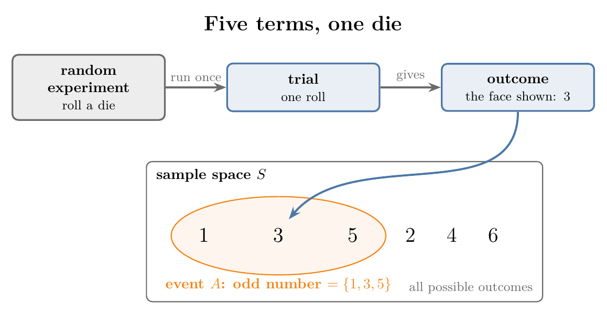
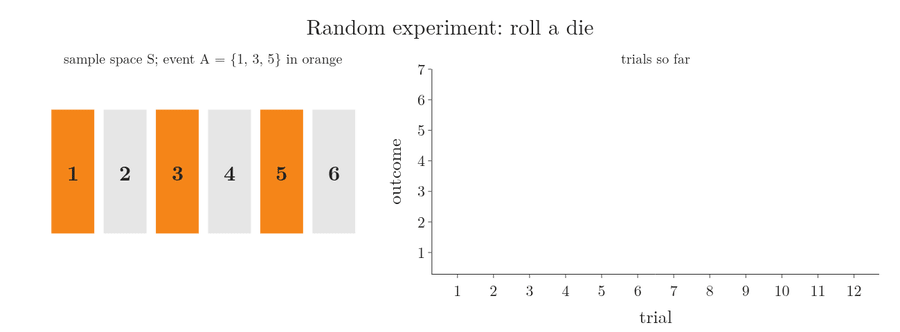
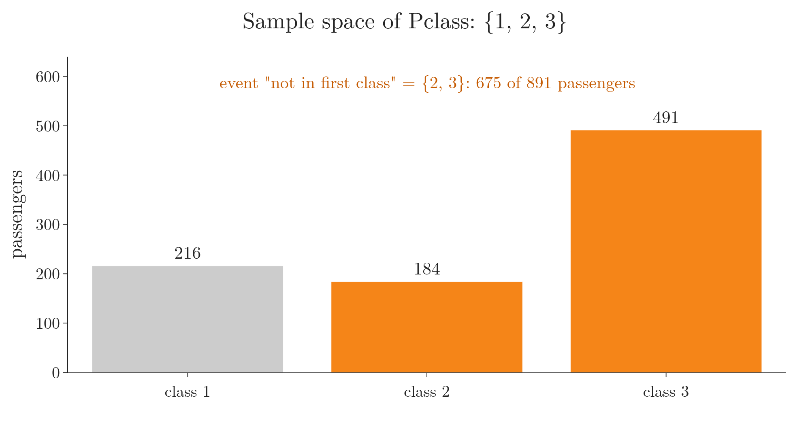
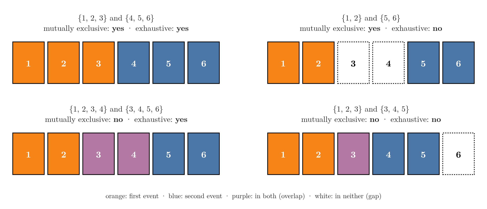

<!-- where-this-fits: generated by course_map/build_map.py; edit concepts.yaml, not this block -->
> **Where this fits:** Pipeline map step 0 (Foundations). See the [Course map](../../../00-course-map/00-course-map.md).
>
> 
>
> - **Leads to:** [Empirical vs theoretical probability, probability rules](../../../MA/02-probability/MA-011-empirical-and-theoretical-probability/MA-011-empirical-and-theoretical-probability.md#1-overview); [Venn diagrams and contingency tables](../../../MA/02-probability/MA-013-venn-diagrams-and-contingency-tables/MA-013-venn-diagrams-and-contingency-tables.md#2-venn-diagrams); [Conditional probability](../../../MA/02-probability/MA-014-joint-marginal-conditional-probability/MA-014-joint-marginal-conditional-probability.md#4-conditional-probability).
<!-- /where-this-fits -->

## 1. Overview

> **Key point:** Probability is always measured for an event; to name an event we first need the random experiment, its trials and outcomes, and the sample space the event is taken from.

Figure 1 places the five basic terms of probability on a single die roll. A random experiment is run once in a trial, which gives one outcome. Every outcome lies in the sample space $S$, and an event is any set of outcomes we care about, here "an odd number".

This Note:

- defines the five terms (section 2);
- applies them to three experiments (section 3);
- sorts events into types (section 4).

Every later probability topic, from conditional probability to Bayes' theorem, is phrased in these words.

## 2. The five basic terms

> **Key point:** Random experiment, trial, outcome, sample space and event: an experiment is run in trials, each trial gives one outcome, all possible outcomes form the sample space, and an event is a chosen part of it.

### 2.1 Random experiment

> **Key point:** An experiment is random when it has more than one possible outcome and we cannot predict which one will happen.

A **random experiment** (G-1610) is an experiment whose outcome is random, such as tossing a coin. Stated precisely, an experiment is a random experiment when it meets **both** conditions:

1. It has **more than one** possible outcome.
2. The outcome **cannot be predicted** in advance.

Tossing a coin meets both: it can land heads or tails, and before the toss nobody can say which. Rolling a die and drawing a card from a pack are random experiments for the same reasons.

> **Extra:** Each condition alone is not enough. A coin with heads on both sides fails the first condition: there is only one outcome. Dropping a stone fails the second: it has a known result, it falls.

### 2.2 Trial

> **Key point:** A trial is one run of the random experiment.

A **trial** (G-2015) is a single execution of a random experiment. Tossing the coin once is one trial; tossing it again is a second trial.

Every trial produces exactly one outcome. Repeating an experiment means running more trials of it.

Figure 2 runs the die experiment for 12 trials. Each trial gives one outcome (the boxed face); the event "an odd number" happens whenever that outcome is one of the orange faces. Here it happened in 4 of the 12 trials.

### 2.3 Outcome

> **Key point:** An outcome is the single result of one trial.

An **outcome** (G-1417) is one possible result of a trial. If the first toss lands heads, heads is the outcome of that trial; if the second lands tails, tails is the outcome of the second.

### 2.4 Sample space

> **Key point:** The sample space is the set of all possible outcomes of the experiment; whatever happens in a trial is always one of its members.

The **sample space** (G-1729) is the set of all possible outcomes of an experiment. The sample space is written in curly brackets, usually named $S$ (some books use $\Omega$):

- Toss a coin: $S = \lbrace H, T\rbrace$.
- Roll a die: $S = \lbrace1, 2, 3, 4, 5, 6\rbrace$.

One random experiment has one sample space. Every trial's outcome comes from inside it, never from outside.

### 2.5 Event

> **Key point:** An event is a set of outcomes we want the probability of: a subset of the sample space, with one outcome or several.

An **event** (G-717) is a set of outcomes: a specific set of outcomes of a random experiment. In set language it is a **subset** of the sample space: every outcome in the event also belongs to $S$.

Events are what probability is computed for. Two examples:

- Toss a coin; event "getting a head" $= \lbrace H\rbrace$. One outcome.
- Roll a die; event "getting a number less than 3" $= \lbrace1, 2\rbrace$. Two outcomes.

Events are named with capital letters. One experiment can have many events, all drawn from the same sample space. On one die roll:

- $A$ = "getting an odd number" $= \lbrace1, 3, 5\rbrace$
- $B$ = "getting an even number" $= \lbrace2, 4, 6\rbrace$

The event is chosen by the question we ask, not by the experiment. Figure 1 marks $A$ inside the sample space of the die.

## 3. The terms on three experiments

> **Key point:** Writing out all five terms for an experiment removes the confusion between them; the experiment and sample space stay fixed, while the outcome changes with each trial and the event changes with each question.

The five terms are easy to read and easy to mix up. Laying them out side by side for three experiments shows what stays fixed and what changes.

### 3.1 Rolling a die

> **Key point:** One roll gives one outcome from $\lbrace1, \dots, 6\rbrace$; the event can be one face or several.

| Term | Rolling a die |
|---|---|
| Random experiment | Rolling a die |
| Trial | Rolling the die once |
| Outcome | The face shown, for example 3 |
| Sample space | $\lbrace1, 2, 3, 4, 5, 6\rbrace$ |
| Event | "Getting a 3" $= \lbrace3\rbrace$; "a number greater than 4" $= \lbrace5, 6\rbrace$; "an odd number" $= \lbrace1, 3, 5\rbrace$ |

Each trial can give a different outcome (3, then 4, then 5), but every trial gives exactly one.

### 3.2 Tossing a coin twice

> **Key point:** When the experiment is "toss twice", one trial is two tosses, and each outcome is a pair such as $HT$.

Here the experiment is the whole double toss, not one toss. One trial means tossing the coin twice, and its outcome records both results in order.

| Term | Tossing a coin twice |
|---|---|
| Random experiment | Tossing a coin twice |
| Trial | One double toss |
| Outcome | For example $HT$: heads first, tails second |
| Sample space | $\lbrace HH, HT, TH, TT\rbrace$ |
| Event | "Two heads" $= \lbrace HH\rbrace$; "at least one head" $= \lbrace HH, HT, TH\rbrace$ |

However many times we repeat the double toss, each result is one of these four pairs. Figure 3 draws the sample space with the two events as subsets.

The pairs $HT$ and $TH$ are different outcomes: the order of the tosses is recorded. "Two heads" sits inside "at least one head", because every outcome with two heads also has at least one.

### 3.3 Drawing a Titanic passenger

> **Key point:** Picking a random observation of a dataset is a random experiment too; its sample space is the set of values the chosen feature can take.

The Titanic dataset (used in [frequency tables](../../01-descriptive-stats/MA-007-frequency-tables-and-graphs/MA-007-frequency-tables-and-graphs.md#2-frequency-tables-for-a-categorical-feature)) lists 891 passengers; each passenger is one **observation** (G-1374; one record, one row of the data table). The **feature** (G-772) `Pclass` (a feature is an input variable, one column of the data table) is the ticket class: 1, 2 or 3. Drawing one passenger at random and reading their class is a random experiment. Figure 4 shows its sample space with the number of passengers behind each outcome.

| Term | Drawing a Titanic passenger |
|---|---|
| Random experiment | Drawing one passenger at random and reading `Pclass` |
| Trial | One draw |
| Outcome | For example class 1 |
| Sample space | $\lbrace1, 2, 3\rbrace$ |
| Event | "The passenger is in class 2" $= \lbrace2\rbrace$; "not in first class" $= \lbrace2, 3\rbrace$ |

{height=34%}

Here probability meets machine learning: each observation of a dataset is the outcome of a trial, and a feature's possible values form a sample space. The probabilities of these events, from the counts in the data, are worked out in [Titanic passengers](../MA-011-empirical-and-theoretical-probability/MA-011-empirical-and-theoretical-probability.md#32-titanic-passengers).

## 4. Types of events

> **Key point:** Events are classified by how many outcomes they hold (simple, compound), by how two of them relate (independent, dependent, mutually exclusive, exhaustive), and by the two extremes (impossible, sure).

Since probability is always calculated for events, their types come up constantly. Figure 5 shows most of them on one die roll. Each panel is the sample space $\lbrace1, \dots, 6\rbrace$ as six numbers in a box; a coloured outline circles the outcomes of one event, and the caption under the panel says why it has that type.

{height=62%}

### 4.1 Simple events

> **Key point:** A simple event holds exactly one outcome.

A **simple event** (G-1806; also called an **elementary event**) consists of exactly one outcome. On a die, "getting a 3" $= \lbrace3\rbrace$ is simple (Figure 5, top left).

"Getting an odd number" is not simple: it holds three outcomes, 1, 3 and 5.

### 4.2 Compound events

> **Key point:** A compound event holds two or more outcomes, so it is made of two or more simple events.

A **compound event** (G-432) consists of two or more simple events. "Rolling a number greater than 4" $= \lbrace5, 6\rbrace$ is compound (Figure 5, top right): it is made of the simple events $\lbrace5\rbrace$ and $\lbrace6\rbrace$.

Events joined by "or" are usually compound. The sign $\cup$, the **union**, collects the outcomes that are in either part (see [the addition rule](../MA-017-mutually-exclusive-events/MA-017-mutually-exclusive-events.md#5-the-addition-rule-where-mutual-exclusivity-pays-off)). The event "rolling a number less than 2 or greater than 3" joins two parts:

$$\lbrace1\rbrace\cup \lbrace4, 5, 6\rbrace= \lbrace1, 4, 5, 6\rbrace$$

### 4.3 Independent events

> **Key point:** Two events are independent when one happening does not change the probability of the other.

**Independent events** (G-934) are taught in [the definition of independence](../MA-016-independent-events/MA-016-independent-events.md#2-the-definition): one event happening does not change the probability of the other. Flipping a coin and rolling a die together is the standard case: the coin's result has no effect on the die's.

### 4.4 Dependent events

> **Key point:** Two events are dependent when one happening changes the probability of the other, as when cards are drawn without being put back.

Two events are **dependent** (G-590) when the occurrence of one **does** affect the probability of the other. They are the opposite of independent events.

Drawing two cards from a pack **without replacement** (G-2126; the first card is not put back) is the standard example. A pack has 52 cards, 13 of them spades. Write $P(\text{spade})$ for the probability of the event "the card is a spade" (a number from 0 to 1):

- First card:

  $$P(\text{spade}) = 13/52$$

  $$P(\text{spade}) = 0.25$$

- Second card, if the first was a spade: 51 cards are left and 12 of them are spades.

  $$P(\text{spade on 2nd draw}) = 12/51$$

  $$12/51 \approx 0.235$$

- Second card, if the first was not a spade: 13 spades are left among 51.

  $$P(\text{spade on 2nd draw}) = 13/51$$

  $$13/51 \approx 0.255$$

Figure 6 shows the two branches. The chance of a spade on the second draw depends on what the first draw took out, so the two draws are dependent. With replacement (the first card goes back and the pack is shuffled), the second draw is again $13/52$ whatever happened first, and the draws are independent.

> **Extra:** The probability "spade second, given spade first" is a **conditional probability** (G-444); see [the definition of conditional probability](../MA-015-conditional-probability/MA-015-conditional-probability.md#2-the-definition). It is written (the bar $\mid$ reads "given"):
>
> $$P(\text{2nd spade} \mid \text{1st spade}) = 12/51$$
>
> Before we know the first card, the probability that the second card is a spade is still $1/4$. A spade second can happen two ways: first card a spade, then a spade; or first card not a spade, then a spade. One step per line:
>
> $$\frac{13}{52} \cdot \frac{12}{51} = \frac{156}{2652}$$
>
> $$\frac{39}{52} \cdot \frac{13}{51} = \frac{507}{2652}$$
>
> $$\frac{156}{2652} + \frac{507}{2652} = \frac{663}{2652}$$
>
> $$\frac{663}{2652} = \frac{1}{4}$$
>
> This is the same as the first card. Dependence shows only once the first card is known.

### 4.5 Mutually exclusive events

> **Key point:** Two events are mutually exclusive when they cannot both happen in the same trial.

**Mutually exclusive events** (G-1286) are taught in [the definition of mutually exclusive events](../MA-017-mutually-exclusive-events/MA-017-mutually-exclusive-events.md#2-the-definition): they cannot happen together in one trial, so they share no outcome. On a die, $\lbrace1, 2, 3\rbrace$ and $\lbrace4, 5, 6\rbrace$ are mutually exclusive (Figure 5, middle left).

$\lbrace1, 2, 3\rbrace$ and $\lbrace3, 4, 5\rbrace$ are not (Figure 5, middle right): a roll of 3 belongs to both.

### 4.6 Exhaustive events

> **Key point:** A set of events is exhaustive when together they cover the whole sample space, so at least one of them must happen in every trial.

A set of events is **exhaustive** (G-721) if at least one of them must occur whenever the experiment is performed. In set terms, their outcomes together make up the whole sample space.

On a die, "odd" $= \lbrace1, 3, 5\rbrace$ and "even" $= \lbrace2, 4, 6\rbrace$ are exhaustive: every roll is odd or even. $\lbrace1, 2, 3\rbrace$ and $\lbrace3, 4, 5\rbrace$ are not exhaustive, because a roll of 6 lies in neither (Figure 5, middle right).

Exhaustive and mutually exclusive are separate properties. A set of events can have both, either one or neither (Figure 7: an overlap breaks "mutually exclusive", a gap breaks "exhaustive"):

| Events on a die | Mutually exclusive? | Exhaustive? |
|---|---|---|
| $\lbrace1, 2, 3\rbrace$, $\lbrace4, 5, 6\rbrace$ | yes | yes |
| $\lbrace1, 2\rbrace$, $\lbrace5, 6\rbrace$ | yes | no (3 and 4 missing) |
| $\lbrace1, 2, 3, 4\rbrace$, $\lbrace3, 4, 5, 6\rbrace$ | no (share 3, 4) | yes |
| $\lbrace1, 2, 3\rbrace$, $\lbrace3, 4, 5\rbrace$ | no (share 3) | no (6 missing) |

> **Extra:** Events that are both mutually exclusive and exhaustive split the sample space into separate pieces with no gaps and no overlaps. Such a set is called a **partition** (G-1459) of the sample space: in every trial **exactly one** of them happens. Spam and not spam, or the classes of a classifier, form a partition. The **law of total probability** (G-1053) needs exactly this: if $B_1, B_2, \dots$ partition the sample space, then (Blitzstein and Hwang 2019, §2.3):
>
> $$P(A) = \sum_i P(A \mid B_i)\thinspace P(B_i)$$
>
> Here $\sum_i$ means: add the terms for $i = 1, 2, \dots$ (one per piece $B_i$). For a die with $A$ = "odd" and the pieces $B_1 = \lbrace1, 2, 3\rbrace$, $B_2 = \lbrace4, 5, 6\rbrace$, each value is a count:
>
> - $B_1$ holds 3 of the 6 faces, and so does $B_2$:
>
>   $$P(B_1) = P(B_2) = 3/6 = 1/2$$
>
> - $B_1$ holds two odd faces, 1 and 3, out of 3:
>
>   $$P(A \mid B_1) = 2/3$$
>
> - $B_2$ holds one odd face, 5, out of 3:
>
>   $$P(A \mid B_2) = 1/3$$
>
> The formula adds two terms:
>
> $$\frac{2}{3} \cdot \frac{1}{2} + \frac{1}{3} \cdot \frac{1}{2}$$
>
> $$= \frac{1}{3} + \frac{1}{6}$$
>
> $$= \frac{1}{2}$$
>
> The law of total probability is why Bayes' theorem can split a probability into one term per class (see [the evidence as a total probability](../MA-019-bayes-problem/MA-019-bayes-problem.md#4-the-evidence-total-probability)). The card calculation of section 4.4 is one case: "spade first" and "not spade first" partition the first draw, and the two terms add to $\frac{1}{4}$ (the lines above).

### 4.7 Impossible and sure events

> **Key point:** The impossible event contains no outcome and has probability 0; the sure event is the whole sample space and has probability 1.

The two extreme events:

- An **impossible event** (G-926) contains no outcome of the sample space. "Rolling a 7" with one die can never happen. The impossible event is the empty set, written $\varnothing$, and its probability is 0.
- A **sure event** (G-1925; or **certain event**) contains every outcome. "Rolling a number from 1 to 6" always happens. The sure event is the whole sample space $S$, and its probability is 1.

All other events lie between these two, with probabilities between 0 and 1 (Figure 5, bottom).

## 5. Summary

| Term | Meaning | Die example |
|---|---|---|
| Random experiment | More than one outcome, none predictable | Rolling a die |
| Trial | One run of the experiment | One roll |
| Outcome | The result of one trial | 3 |
| Sample space | All possible outcomes | $\lbrace1, 2, 3, 4, 5, 6\rbrace$ |
| Event | A subset of the sample space | Odd $= \lbrace1, 3, 5\rbrace$ |

- The experiment and the sample space stay fixed, the outcome changes with each trial, and the event changes with each question, so writing all five out for an experiment removes the confusion between them.

| Type of event | Test | Die example |
|---|---|---|
| Simple | Exactly one outcome | $\lbrace3\rbrace$ |
| Compound | Two or more outcomes | $\lbrace5, 6\rbrace$ |
| Independent | One does not change the other's probability | Coin and die together |
| Dependent | One changes the other's probability | Two cards without replacement |
| Mutually exclusive | No shared outcome | $\lbrace1, 2, 3\rbrace$, $\lbrace4, 5, 6\rbrace$ |
| Exhaustive | Together they cover $S$ | Odd, even |
| Impossible | No outcome; probability 0 | Rolling a 7 |
| Sure | All of $S$; probability 1 | Rolling 1 to 6 |

- Probability is always calculated for events, so these types come up constantly.
- An experiment has one sample space but can have many events: the event is set by the question, so name the event from the question before computing a probability.
- An outcome is one result; an event is a set of results, possibly just one. Probability is computed for events, so a single result is written as the event $\lbrace3\rbrace$.
- Mutually exclusive and exhaustive are separate properties; both together make a partition, in which exactly one event happens in every trial, which is what the law of total probability (and so Bayes' theorem) needs.
- Every later probability topic, from conditional probability to Bayes' theorem, is phrased in these terms, so they are the words to learn first.

## 6. Sources

**Built from**

- CampusX, "Master Probability in Data Science: The Ultimate Crash Course! | Part 1 | CampusX", YouTube, https://www.youtube.com/watch?v=DUT4WEUngt0

**Other references**

- Blitzstein, J. K. and Hwang, J. (2019). *Introduction to Probability*, 2nd ed. CRC Press. §2.3 "Bayes' rule and the law of total probability".

## 7. Key terms

| Term | Meaning |
|---|---|
| Random experiment (G-1610) | An experiment with more than one possible outcome, none of which can be predicted, such as a coin toss |
| Trial (G-2015) | One run of a random experiment; it gives exactly one outcome |
| Outcome | The single result of one trial, such as heads or a 3 |
| Sample space (G-1729) | The set of all possible outcomes of an experiment, such as $\lbrace1, \dots, 6\rbrace$ for a die |
| Event (G-717) | A set of outcomes, a subset of the sample space, such as "odd" $= \lbrace1, 3, 5\rbrace$ |
| Simple (elementary) event | An event with exactly one outcome |
| Compound event | An event with two or more outcomes |
| Without replacement | Drawing items without putting them back, so later draws depend on earlier ones |
| Exhaustive events | Events that together cover the whole sample space, so at least one always happens |
| Partition | Events that are mutually exclusive and exhaustive: exactly one of them happens in every trial |
| Impossible event | The empty event $\varnothing$; probability 0 |
| Sure (certain) event | The whole sample space; probability 1 |
