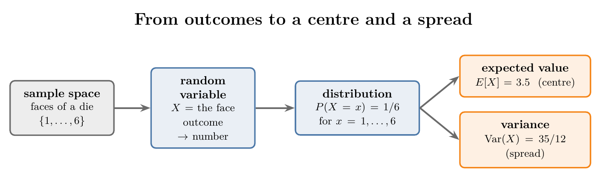
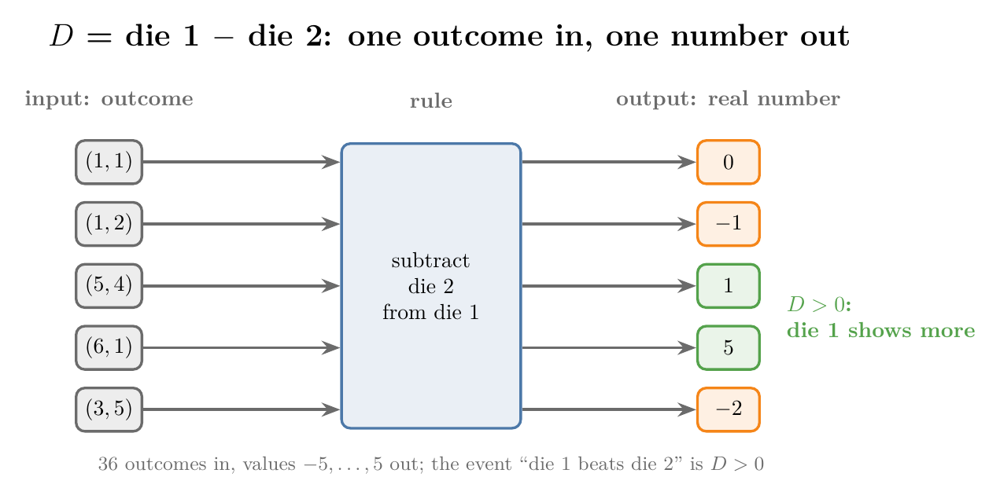
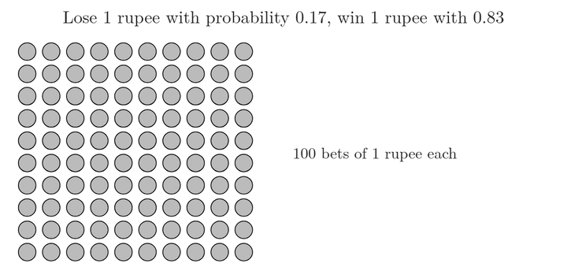
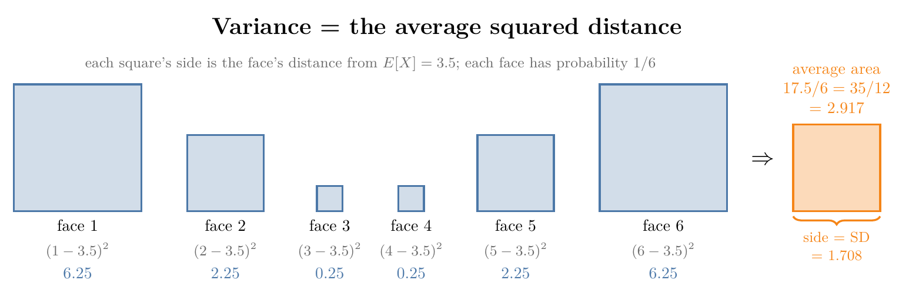
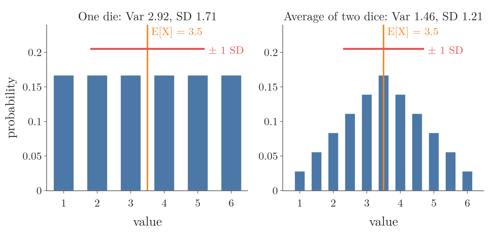

<!-- where-this-fits: generated by course_map/build_map.py; edit concepts.yaml, not this block -->
> **Where this fits:** Pipeline map step 0 (Foundations). See the [Course map](../../../00-course-map/00-course-map.md).
>
> 
>
> - **Used here, taught in full later:** [Random variables](../../../MA/03-distributions/MA-020-random-variables-and-distributions/MA-020-random-variables-and-distributions.md#2-random-variables).
> - **Leads to:** [Bagging](../../../ML/08-trees-and-ensembles/ML-099-bagging-intuition/ML-099-bagging-intuition.md#3-why-bagging-works); [Poisson distribution](../../../MA/03-distributions/MA-022-pdf-and-continuous-cdf/MA-022-pdf-and-continuous-cdf.md#6-famous-pdfs).
> - **Compare with:** [Measures of central tendency](../../../MA/01-descriptive-stats/MA-005-measures-of-central-tendency/MA-005-measures-of-central-tendency.md#1-overview).
<!-- /where-this-fits -->

## 1. Overview

> **Key point:** A random variable turns each outcome into a number; its distribution then gives two summary numbers: the expected value (where the values centre) and the variance (how far they spread).



Figure 1 shows the path this Note follows for one die:

1. the faces form the sample space;
2. a random variable $X$ writes each face as a number;
3. the distribution gives each number's probability;
4. from the distribution we compute the **expected value** $E[X]$, the centre (3.5 for one die), and the **variance** $\mathrm{Var}(X)$, the spread (35/12 for one die).

Random variables, discrete and continuous ones, and probability distributions are introduced in [random variables](../../03-distributions/MA-020-random-variables-and-distributions/MA-020-random-variables-and-distributions.md#2-random-variables) and [probability distributions as tables](../../03-distributions/MA-020-random-variables-and-distributions/MA-020-random-variables-and-distributions.md#3-probability-distributions-as-tables). Here we look closer at what a random variable is, then compute its mean and variance.

## 2. A random variable is a function

> **Key point:** Despite its name, a random variable is not a variable but a function: its input is an outcome from the sample space, its output is a real number, and the rule in between is set by the event we want to study.

The name "random variable" is misleading. A random variable (G-1620) is a **function**: a rule that takes an input and turns it into an output, like a vending machine that turns a button press into a snack.

Stated as a definition: a random variable is a function that maps each outcome of a random experiment (each member of the sample space) to a real number.

To understand any function we need three things: its input, its output and its rule.

- **Input:** one outcome from the sample space. Every outcome is fed in, one at a time.
- **Output:** a real number, one for each outcome.
- **Rule:** decided by the event we want to study (section 2.2).

Random variables get capital letters such as $X$ or $Y$; [random variables vs algebra variables](../../03-distributions/MA-020-random-variables-and-distributions/MA-020-random-variables-and-distributions.md#21-algebra-variables-and-random-variables) gives this convention, and "the set of possible values" view used there is the list of this function's outputs.

### 2.1 Simple rules: coin and die

> **Key point:** For a coin we can map head to 1 and tail to 0; for a die we can map each face to its own number.

**Tossing a coin.** The sample space is $\lbrace H, T\rbrace$. A random variable $X$ can map head to 1 and tail to 0:
$$X(H) = 1$$
$$X(T) = 0$$

**Rolling a die.** The sample space is $\lbrace1, 2, 3, 4, 5, 6\rbrace$. A random variable $Y$ can map each face to itself: $Y(1) = 1$, $Y(2) = 2$, and so on up to $Y(6) = 6$.

These rules look like a change of names and nothing more. Their use shows once the experiment has more complex outcomes, such as pairs.

### 2.2 The rule comes from the event

> **Key point:** Rolling two dice gives 36 pairs; the event "sum is 7" calls for the rule "add the dice", and the event "die 1 beats die 2" calls for "subtract die 2 from die 1".

Roll two dice together. The sample space has 36 outcomes, the pairs $(1, 1), (1, 2), \dots, (6, 6)$ (laid out as a grid in [an example with two dice](../MA-015-conditional-probability/MA-015-conditional-probability.md#3-an-example-with-two-dice)). What number we attach to each pair depends on the question.

**Event: "the sum is 7".** The natural rule is to add the two dice:
$$X(d_1, d_2) = d_1 + d_2$$

So $(3, 4) \to 7$, $(1, 3) \to 4$, $(6, 6) \to 12$. The event is now simply $X = 7$, which happens for 6 of the 36 pairs. The full distribution of $X$, from 2 to 12, is the table in the [sum of two dice](../../03-distributions/MA-020-random-variables-and-distributions/MA-020-random-variables-and-distributions.md#31-the-sum-of-two-dice).

**Event: "die 1 shows more than die 2".** Now the useful rule is the difference:
$$D(d_1, d_2) = d_1 - d_2$$

Figure 2 feeds five pairs through this rule. The output is positive when die 1 is higher, 0 when they are equal and negative when die 2 is higher. So the event "die 1 beats die 2" is $D > 0$.

{height=45%}

Counting the 36 pairs for each value of $D$ gives its distribution ($P$ is $P(D = d)$):

| $d$ | $-5$ | $-4$ | $-3$ | $-2$ | $-1$ | 0 | 1 | 2 | 3 | 4 | 5 |
|---|---|---|---|---|---|---|---|---|---|---|---|
| pairs | 1 | 2 | 3 | 4 | 5 | 6 | 5 | 4 | 3 | 2 | 1 |
| $P$ | $\frac{1}{36}$ | $\frac{2}{36}$ | $\frac{3}{36}$ | $\frac{4}{36}$ | $\frac{5}{36}$ | $\frac{6}{36}$ | $\frac{5}{36}$ | $\frac{4}{36}$ | $\frac{3}{36}$ | $\frac{2}{36}$ | $\frac{1}{36}$ |

$$P(D > 0) = \frac{5 + 4 + 3 + 2 + 1}{36}$$

$$P(D > 0) = \frac{15}{36} = \frac{5}{12}$$

$$P(D > 0) \approx 0.417$$

The same sample space gave two different random variables, because we asked two different questions. Turning outcomes into numbers is what lets us tabulate, plot and calculate with them: the distribution tables, PMFs and PDFs (see [PMF, PDF and CDF](../../03-distributions/MA-020-random-variables-and-distributions/MA-020-random-variables-and-distributions.md#51-pmf-pdf-and-cdf)) all start here.

> **Python:** A random variable as a Python function.
>
> ```python
> import itertools
> from collections import Counter
>
> # the 36 pairs of two dice
> S = list(itertools.product(range(1, 7), repeat=2))
>
> def difference(outcome):      # the random variable D
>     return outcome[0] - outcome[1]
>
> # count the pairs for each value of D
> counts = Counter(difference(o) for o in S)
> ```
>
> `itertools.product(range(1, 7), repeat=2)` lists every ordered pair of faces. `Counter` counts how often each output appears; dividing by 36 gives the table above. The Notebook (`MA-012-expected-value-and-variance.ipynb`) runs every calculation in this Note.

A random variable whose outputs are separate values, as here, is discrete; one whose outputs fill a range, such as a student's CGPA, is continuous. Both kinds are covered in [discrete and continuous random variables](../../03-distributions/MA-020-random-variables-and-distributions/MA-020-random-variables-and-distributions.md#23-discrete-and-continuous-random-variables). This Note works with discrete random variables.

## 3. Expected value

> **Key point:** The expected value $E[X]$ is the long-run average of a random variable: each possible value times its probability, summed. For a die it is 3.5.

The **mean of a random variable** (G-1199), usually called its **expected value** (G-725), is the average outcome of a random process repeated many times. More technically, it is a weighted average of the possible values, each weighted by its probability.

### 3.1 A bet repeated many times

> **Key point:** If a bet is repeated many times, the average gain per bet is each outcome times its probability, added up: here 0.66 rupees.

**The story.** In a small town of 213 people, 37 have heard of a certain old film and 176 have not. A friend offers a bet: "I bet you 1 rupee that the next person we meet has heard of the film." So we lose 1 rupee if they have, and win 1 rupee if they have not.

**Counts to probabilities.** A randomly met person has heard of the film with this probability:

$$37/213 = 0.17$$

and has not with this probability:

$$176/213 = 0.83$$

Write the outcome of one bet as a number: $-1$ (lose) with probability 0.17, $+1$ (win) with probability 0.83.

**Make the bet 100 times.** We will win some and lose some:

1. losses: about 17 bets, each $-1$, so $-17$ rupees;

   $$0.17 \times 100 = 17$$

2. wins: about 83 bets, each $+1$, so $+83$ rupees;

   $$0.83 \times 100 = 83$$

3. total after 100 bets, in rupees:

   $$-17 + 83 = +66$$

4. per bet, in rupees:

   $$66/100 = 0.66$$


{height=42%}

In Figure 3, watch the last step: we multiplied by 100 and then divided by 100, so the 100s cancel. What is left is each outcome times its probability:

$$(-1)(0.17) + (+1)(0.83) = 0.66$$

This number, the average gain per bet over many bets, is the **expected value** of the bet, written $E[X] = 0.66$. Each single bet still wins or loses a whole rupee; 0.66 is what we gain per bet *on average*.

**A second bet.** Now the friend pays us 10 rupees if the next person has heard of the film, and we pay 1 rupee if not. The outcomes change, the probabilities do not:

$$E[X] = 10 \times 0.17 + (-1) \times 0.83 = 0.87$$

On average we gain 0.87 rupees per bet, so in the long run the bet is worth taking.

### 3.2 Another way to see it: the mean as a weighted average

> **Key point:** The ordinary mean can be rewritten as each distinct value times its share of the data; the expected value uses probabilities in place of shares.

Take the six numbers 5, 3, 4, 5, 3, 3. Their mean (see [the mean](../../01-descriptive-stats/MA-005-measures-of-central-tendency/MA-005-measures-of-central-tendency.md#3-mean)) is

$$\bar{x} = \frac{5 + 3 + 4 + 5 + 3 + 3}{6} = \frac{23}{6} \approx 3.833$$

Here $\bar{x}$ ("x bar") is the mean of the data.

The same sum can be grouped by value: 5 appears twice, 4 once and 3 three times.

$$\bar{x} = \frac{2 \times 5 + 1 \times 4 + 3 \times 3}{6}$$

$$\bar{x} = \frac{2}{6} \times 5 + \frac{1}{6} \times 4 + \frac{3}{6} \times 3$$

$$\bar{x} = \frac{23}{6}$$

The second form says: take each **distinct** value and multiply it by the share of the data it makes up. A share of the data is an empirical probability (see [empirical probability](../MA-011-empirical-and-theoretical-probability/MA-011-empirical-and-theoretical-probability.md#3-empirical-probability)). Replacing the shares by true probabilities gives the expected value.

### 3.3 The formula

> **Key point:** $E[X] = \sum x_i \thinspace P(X = x_i)$, summed over the possible values.

1. **In words:** multiply every possible value of the random variable by its probability, and add the products.
2. **Formula:** for a random variable with $n$ possible values $x_1, \dots, x_n$,
   $$E[X] = \sum_{i=1}^{n} x_i \thinspace P(X = x_i)$$
   The expected value is also written $\mu$ (mu). The symbol $\sum_{i=1}^{n}$ means: add the terms for $i = 1, 2, \dots, n$.
3. **Example:** one die, each face with probability $1/6$:
   $$E[X] = 1 \cdot \tfrac{1}{6} + 2 \cdot \tfrac{1}{6} + 3 \cdot \tfrac{1}{6}$$
   $$\quad + 4 \cdot \tfrac{1}{6} + 5 \cdot \tfrac{1}{6} + 6 \cdot \tfrac{1}{6}$$
   $$E[X] = \frac{21}{6} = 3.5$$

So if we roll a die many times and average the faces, the average will be close to 3.5. No single roll can show 3.5: the expected value is a long-run average, not a value we expect to see on any one trial.

More examples with the same formula:

| Random variable | Values and probabilities | $E[X]$ |
|---|---|---|
| Coin, head = 1 | 1 and 0, each $1/2$ | $1 \cdot \frac{1}{2} + 0 \cdot \frac{1}{2} = 0.5$ |
| Sum of two dice | 2 to 12 (table in section 2.2) | $252/36 = 7$ |
| Difference $D$ | $-5$ to 5 (table in section 2.2) | 0 |

The difference has expected value 0 because the table is symmetric: each positive value is balanced by a negative one with the same probability. Neither die is favoured.

> **Extra:** For a coin with head = 1, $E[X] = P(\text{head})$. The same holds for any Bernoulli variable (a variable that is 1 with probability $p$ and 0 otherwise; see [the Bernoulli distribution](../../03-distributions/MA-021-pmf-and-discrete-cdf/MA-021-pmf-and-discrete-cdf.md#71-bernoulli-distribution)):
>
> $$E[X] = 1 \cdot p + 0 \cdot (1 - p)$$
>
> $$E[X] = p$$
>
> The average of 0/1 values is the share of 1s, which is why `tosses.mean()` gave the share of heads in [empirical probability](../MA-011-empirical-and-theoretical-probability/MA-011-empirical-and-theoretical-probability.md#3-empirical-probability).

### 3.4 Checking by simulation

> **Key point:** The average of 100,000 simulated die rolls is 3.4998, within 0.0002 of the expected value 3.5.

> **Python:** The long-run average of a die.
>
> ```python
> import numpy as np
>
> rng = np.random.default_rng(42)         # fixed seed
> rolls = rng.integers(1, 7, 100_000)     # 100,000 rolls, 1 to 6
> rolls.mean()                            # 3.49982
> ```
>
> The more rolls, the closer the average gets to 3.5, for the same reason empirical probabilities settle on theoretical ones. The Notebook also plots the running average after each roll.

The result is not a coincidence: the expected value is exactly the number such averages settle on.

![The running average of the same 100,000 die rolls (seed 42), on a log axis: wide swings early, then it settles on $E[X] = 3.5$](images/running_mean.gif){height=40%}

Figure 4 replays those rolls one average at a time. Its horizontal axis is a log scale: each labelled tick is ten times the one before (1, 10, 100, …), so the first few rolls get as much room as the last 90,000. Watch the early frames: after 3 rolls the average is 3.33 and after 30 it is 3.80; only after thousands of rolls does it stay on the dashed line.

> **Extra:** For a continuous random variable, the sum becomes an integral over the PDF $f(x)$ (see [area under the curve is probability](../../03-distributions/MA-022-pdf-and-continuous-cdf/MA-022-pdf-and-continuous-cdf.md#3-area-under-the-curve-is-probability)). The expected value is
>
> $$E[X] = \int x \thinspace f(x)\thinspace dx$$
>
> where $\int$ adds up (as an area under a curve) each value $x$ times its density $f(x)$. The idea is the same: each value weighted by how likely it is.

## 4. Variance of a random variable

> **Key point:** The **variance of a random variable** (G-2076), $\mathrm{Var}(X)$, is the expected squared distance of the random variable from its expected value; for a die it is $35/12 \approx 2.92$.

The variance of a set of data values is the average squared distance of the values from their mean (see [variance](../../01-descriptive-stats/MA-006-measures-of-dispersion/MA-006-measures-of-dispersion.md#4-variance)). The variance of a random variable is built the same way, with the expected value taking the place of every average.

### 4.1 Variance term by term

> **Key point:** For each possible value, take its distance from the mean, square it, weight it by the value's probability, and add: for the workouts example this gives 1.19.

**The example.** Let $X$ be the number of workouts a person does in a week. Its distribution is:

| $x$ | 0 | 1 | 2 | 3 | 4 |
|---|---|---|---|---|---|
| $P(X = x)$ | 0.1 | 0.15 | 0.4 | 0.25 | 0.1 |

Its expected value, each value times its probability, one per line:

| $x$ | $P(X = x)$ | $x \times P(X = x)$ |
|---|---|---|
| 0 | 0.1 | 0 |
| 1 | 0.15 | 0.15 |
| 2 | 0.4 | 0.8 |
| 3 | 0.25 | 0.75 |
| 4 | 0.1 | 0.4 |
| **Sum** | | $E[X] = 2.1$ workouts |

**The mechanism.** For each value:

1. the distance from the mean, $x - 2.1$;
2. squared, so that distances below and above the mean both count as positive;
3. weighted by the probability of that value.

| $x$ | $(x - 2.1)^2$ | $\times P$ | term |
|---|---|---|---|
| 0 | 4.41 | 0.1 | 0.4410 |
| 1 | 1.21 | 0.15 | 0.1815 |
| 2 | 0.01 | 0.4 | 0.0040 |
| 3 | 0.81 | 0.25 | 0.2025 |
| 4 | 3.61 | 0.1 | 0.3610 |
| | | **sum** | **1.19** |

The variance is $\mathrm{Var}(X) = 1.19$, and the **standard deviation** (G-1870) is its square root:

$$\sqrt{1.19} = 1.09 \text{ workouts}$$

{height=42%}

In Figure 5, watch which terms are large: the bars at 0 and 4 are far from 2.1, so even with probability 0.1 they contribute most. The tall bar at 2 sits almost on the mean and adds only 0.004. In the last frame, one standard deviation either side of the mean runs from about 1 to about 3.2, which covers the bulk of the probability: a quick check that 1.09 is a sensible measure of spread (notebook, section 4a).

### 4.2 From the data formula to the random-variable formula

> **Key point:** In the data formula, replace the mean by $E[X]$ and the averaging by another expected value: $\mathrm{Var}(X) = E[(X - E[X])^2]$.

For data, the (population) variance is

$$\sigma^2 = \frac{1}{n} \sum_{i=1}^{n} (x_i - \bar{x})^2$$

The data formula does three things:

1. subtract the mean from each value;
2. square each distance;
3. average the squares.

For a random variable:

- the mean $\bar{x}$ becomes the expected value $E[X]$;
- each value $x_i$ becomes the random variable $X$ itself, so the squared distance is the random quantity $(X - E[X])^2$;
- "average the squares" becomes "take the expected value of the squares".

1. **In words:** the variance is the expected value of the squared distance between $X$ and its expected value.
2. **Formula:**
   $$\mathrm{Var}(X) = E\big[(X - E[X])^2\big]$$
   $$\mathrm{Var}(X) = \sum_{i=1}^{n} (x_i - \mu)^2 \thinspace P(X = x_i)$$
3. **Example:** one die, $\mu = 3.5$. The squared distances of the six faces are
   $$(1 - 3.5)^2 = 6.25$$

   $$(2 - 3.5)^2 = 2.25$$

   $$(3 - 3.5)^2 = 0.25$$

   Faces 4, 5 and 6 mirror these: $0.25$, $2.25$, $6.25$.
   Each has probability $1/6$:
   $$\mathrm{Var}(X) = \frac{6.25 + 2.25 + 0.25 + 0.25 + 2.25 + 6.25}{6}$$

   $$\mathrm{Var}(X) = \frac{17.5}{6}$$

   $$\mathrm{Var}(X) = \frac{35}{12} \approx 2.917$$

The standard deviation of $X$ is the square root, $\sqrt{35/12} \approx 1.708$, back in the units of $X$.



Figure 6 draws the example. Watch the two outer faces: their squares (6.25 each) hold 12.5 of the total area 17.5, so the faces far from the centre decide most of the variance.

Weighting by probabilities matches the data formula that divides by $n$, not by $n - 1$. The $n - 1$ version estimates a population's variance from a sample; a random variable's distribution already describes the whole population.

### 4.3 The shortcut formula

> **Key point:** $\mathrm{Var}(X) = E[X^2] - (E[X])^2$: the expected value of the square minus the square of the expected value.

Expanding the square gives a second formula that is often quicker.

1. **In words:** take the expected value of $X^2$, then subtract the square of the expected value of $X$.
2. **Formula:**
   $$\mathrm{Var}(X) = E[X^2] - (E[X])^2$$
3. **Example:** one die.
   $$E[X^2] = \frac{1 + 4 + 9 + 16 + 25 + 36}{6}$$
   $$E[X^2] = \frac{91}{6} \approx 15.167$$
   $$\mathrm{Var}(X) = \frac{91}{6} - 3.5^2$$
   $$\mathrm{Var}(X) = \frac{91}{6} - \frac{49}{4}$$
   $$\mathrm{Var}(X) = \frac{182 - 147}{12} = \frac{35}{12}$$
   The same value as the definition.

The derivation uses three rules for expected values. They hold for any random variables, and need no independence (Grinstead and Snell 1997, §6.1, Theorem 6.2, which notes that expectations add whether or not the summands are independent):

- **Constants:** a constant $c$ has $E[c] = c$. A constant takes one value with probability 1, so its average is itself. $E[X]$ is a constant too, a single number such as 3.5.
- **Scaling:** $E[cX] = c\thinspace E[X]$. Multiplying every value by $c$ multiplies the weighted average by $c$.
- **Sums:** $E[X + Y] = E[X] + E[Y]$, the **linearity of expectation** (G-1100).

Write $\mu = E[X]$ and expand the square:

$$(X - \mu)^2 = X^2 - 2\mu X + \mu^2$$

Then:

$$\mathrm{Var}(X) = E[X^2 - 2\mu X + \mu^2]$$

Split the sum (sums rule) and take the constants $2\mu$ and $\mu^2$ out (scaling and constants rules):

$$\mathrm{Var}(X) = E[X^2] - 2\mu\thinspace E[X] + \mu^2$$

Since $E[X] = \mu$, the middle term is $2\mu^2$:

$$\mathrm{Var}(X) = E[X^2] - 2\mu^2 + \mu^2$$

$$\mathrm{Var}(X) = E[X^2] - \mu^2$$

Both formulas are used constantly, for discrete and continuous random variables alike.

> **Python:** Both formulas, and the simulated rolls.
>
> ```python
> faces = np.arange(1, 7)
> p = np.full(6, 1 / 6)
> mu = (faces * p).sum()                       # 3.5
> var_def = ((faces - mu) ** 2 * p).sum()      # 2.9167
> var_short = (faces ** 2 * p).sum() - mu ** 2 # 2.9167
> rolls.var()                                  # 2.9173
> ```
>
> `rolls.var()` divides by $n$ (NumPy's default); on 100,000 rolls it lands within 0.001 of $35/12$.

### 4.4 Same mean, different spread

> **Key point:** Two random variables can share an expected value and differ in variance; the variance tells how far single outcomes stray from the centre.

Figure 7 compares one die with the **average** of two dice, $(d_1 + d_2)/2$. Both have expected value 3.5. The single die is equally likely to land anywhere from 1 to 6, while the average piles up near 3.5: extreme values need both dice to be extreme.



| Random variable | $E[X]$ | $\mathrm{Var}(X)$ | Standard deviation |
|---|---|---|---|
| One die | 3.5 | $35/12 \approx 2.917$ | 1.708 |
| Average of two dice | 3.5 | $35/24 \approx 1.458$ | 1.208 |

The expected value says where the outcomes centre; the variance says how much a single outcome can be trusted to land near it.

> **Extra:** Averaging two independent dice halved the variance, from 35/12 to 35/24. In general, the average of $n$ independent copies has this variance (Grinstead and Snell, Theorem 6.9):
>
> $$\sigma^2 / n$$
>
> With $n = 2$ and the die's variance 35/12 this gives 35/24, as in the table. The models averaged in [bagging](../../../ML/08-trees-and-ensembles/ML-099-bagging-intuition/ML-099-bagging-intuition.md#32-how-bagging-lowers-variance) are not independent, since they are trained on overlapping data. If each pair has correlation $\rho$ (a number from $-1$ to 1 for how strongly two models' errors move together), the average of $B$ of them has this variance (ESL §15.2, eq. 15.1):
>
> $$\rho\sigma^2 + \frac{1 - \rho}{B}\sigma^2$$
>
> Averaging still lowers the variance, but only the second term shrinks as $B$ grows.

## 5. Summary

| Quantity | Formula | One die | Coin (head = 1) | Why it matters |
|---|---|---|---|---|
| Random variable | outcome $\to$ real number | face $\to$ face | $H \to 1$, $T \to 0$ | numbers can be tabulated, plotted and calculated with |
| Expected value | $E[X] = \sum x_i P(X = x_i)$ | 3.5 | 0.5 | the average per trial in the long run, so it says whether a bet is worth taking |
| Variance (definition) | $E[(X - E[X])^2]$ | $35/12 \approx 2.917$ | 0.25 | says how far a single outcome strays from the centre |
| Variance (shortcut) | $E[X^2] - (E[X])^2$ | $91/6 - 49/4 = 35/12$ | $0.5 - 0.25 = 0.25$ | often quicker, with the same result |
| Standard deviation | $\sqrt{\mathrm{Var}(X)}$ | 1.708 | 0.5 | back in the units of $X$ |

- A random variable is a function from outcomes to real numbers; the event we study decides its rule, so decide the event first, then write the rule.
- One sample space can carry many random variables: the sum and the difference of two dice, because each answers a different question.
- The expected value is a probability-weighted average, the long-run mean of many trials; it need not be a possible value, because no single trial has to land on the long-run average.
- The variance is the expected squared distance from the expected value; the shortcut $E[X^2] - (E[X])^2$ gives the same number, because expanding the square with the rules of expected values turns one into the other.
- Expected values are linear: constants come out, sums split. No independence is needed for this, so the shortcut holds for any random variable.
- The expected value says where the outcomes centre and the variance how far a single outcome strays from it, so two random variables with the same expected value can still differ (one die against the average of two).

## 6. Sources

**Built from**

- CampusX, "Master Probability in Data Science: The Ultimate Crash Course! | Part 1 | CampusX", YouTube, https://www.youtube.com/watch?v=DUT4WEUngt0. The random variable as a function, the mean as a weighted average, the die examples and the variance derivation (sections 2, 3.2 to 3.4, 4.2 and 4.3).
- Starmer, J. (StatQuest), "Expected Values, Main Ideas!!!", YouTube, https://www.youtube.com/watch?v=KLs_7b7SKi4. The bet repeated 100 times (section 3.1).
- Khan Academy, "Variance and standard deviation of a discrete random variable", YouTube, https://www.youtube.com/watch?v=2egl_5c8i-g. The workouts example, term by term (section 4.1).

**Other references**

- Grinstead, C. M. and Snell, J. L. (1997). *Introduction to Probability*, 2nd ed. American Mathematical Society. §6.1 (Theorem 6.2) and §6.2 (Theorem 6.9).
- Hastie, T., Tibshirani, R. and Friedman, J. (2009). *The Elements of Statistical Learning* (ESL), 2nd ed. Springer. §15.2, eq. 15.1.

## 7. Key terms

| Term | Meaning |
|---|---|
| Expected value $E[X]$ | The average value we would get over many repeats: each possible value times its probability, added up (the probability-weighted average of a random variable). Also called the long-run mean and written $\mu$. |
| Mean of a random variable | Another name for its expected value: the probability-weighted average of its possible values, the average outcome over many repeats. |
| Variance of a random variable | How spread out a random variable's values are: the expected squared distance from its expected value, $\mathrm{Var}(X) = E[(X - E[X])^2]$. |
| Shortcut variance formula | A quicker way to compute a variance: the mean of the squares minus the square of the mean, $\mathrm{Var}(X) = E[X^2] - (E[X])^2$; it gives the same number as the definition. |
| Standard deviation of a random variable | The square root of a random variable's variance, in the units of $X$; it says how far values typically fall from the expected value. |
| Linearity of expectation | $E[aX + bY + c] = a\thinspace E[X] + b\thinspace E[Y] + c$, for any random variables |
