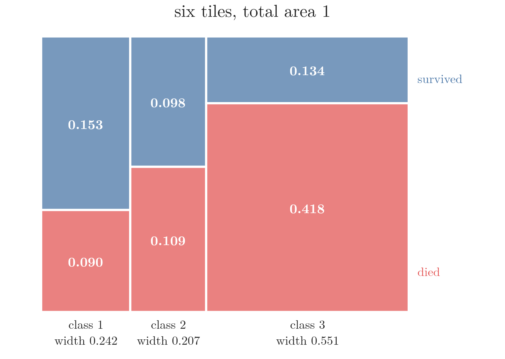
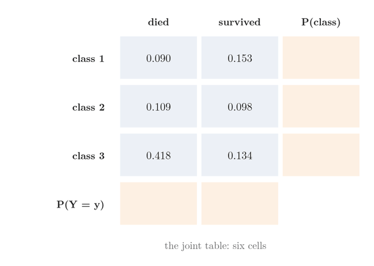
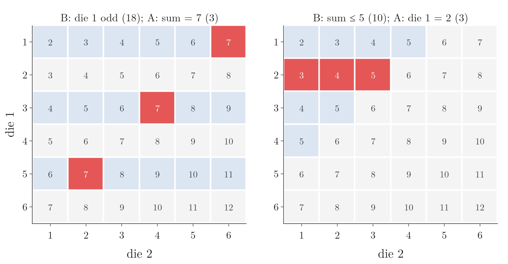
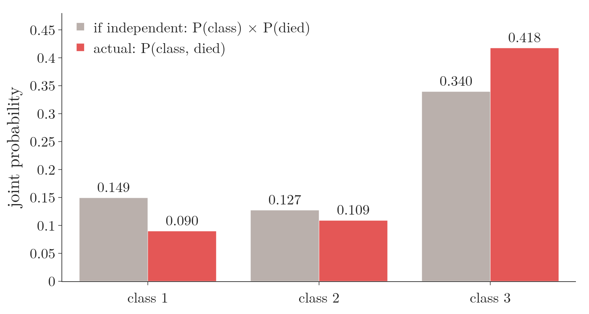

<!-- where-this-fits: generated by course_map/build_map.py; edit concepts.yaml, not this block -->
> **Where this fits:** Pipeline map step 0 (Foundations). See the [Course map](../../../00-course-map/00-course-map.md).
>
> 
>
> - **Builds on:** [Events and sample spaces](../../../MA/02-probability/MA-010-events-and-types-of-events/MA-010-events-and-types-of-events.md#2-the-five-basic-terms); [Venn diagrams and contingency tables](../../../MA/02-probability/MA-013-venn-diagrams-and-contingency-tables/MA-013-venn-diagrams-and-contingency-tables.md#2-venn-diagrams).
> - **Leads to:** [Chi-square tests](../../../MA/04-inference/MA-045-chi-square-tests/MA-045-chi-square-tests.md#2-the-chi-square-statistic); [Conditional probability](../../../MA/02-probability/MA-015-conditional-probability/MA-015-conditional-probability.md#32-a-conditional-probability-by-counting); [Independent and mutually exclusive events](../../../MA/02-probability/MA-017-mutually-exclusive-events/MA-017-mutually-exclusive-events.md#3-conditional-probability-for-mutually-exclusive-events); [Bayes' theorem](../../../MA/02-probability/MA-019-bayes-problem/MA-019-bayes-problem.md#3-writing-down-what-we-know).
<!-- /where-this-fits -->

## 1. Overview

> **Key point:** One contingency table of probabilities (a table that shows how often two things happen together) holds three kinds of probability: joint (the inner cells), marginal (the row and column sums in the margins) and conditional (a cell divided by its row or column sum).

{height=45%}

Figure 1 is the Titanic data as a table of probabilities. The class of a passenger is the **random variable** $X$ (a quantity whose value depends on which passenger we pick; here 1, 2 or 3, see [random variables](../../03-distributions/MA-020-random-variables-and-distributions/MA-020-random-variables-and-distributions.md#2-random-variables)); survival is $Y$ (0 = died, 1 = survived). The blue inner cells are joint probabilities, the orange margins are marginal probabilities, and dividing a cell by its margin gives a conditional probability.

This Note:

- reads all three kinds of probability from the table (sections 2 to 4);
- derives the conditional probability formula from counts, then works more problems by counting (section 4);
- revisits independent, dependent and mutually exclusive events in formulas (section 5);
- ends with Bayes' theorem as a tiny classifier (section 6).

Contingency tables are introduced in [contingency tables](../MA-013-venn-diagrams-and-contingency-tables/MA-013-venn-diagrams-and-contingency-tables.md#3-contingency-tables). Conditional probability is defined in [the definition of conditional probability](../MA-015-conditional-probability/MA-015-conditional-probability.md#2-the-definition).

## 2. Joint probability

> **Key point:** A joint probability is the probability that two things happen together: $P(X = x, Y = y)$, the same as $P(A \cap B)$ for events ($\cap$ means "and": both events happen).

**The idea on 14 people.** We ask 14 people two questions: do you love candy, and do you love soda? Two love both, four love only candy, five love only soda and three love neither. Each person lands in one cell of a 2-by-2 table (Figure 2, first frame). Divide each cell's count by 14 and it becomes the probability that a randomly chosen person has **both** properties of that cell. For the five who love only soda:
$$P(\text{no candy and loves soda}) = 5/14$$
$$P(\text{no candy and loves soda}) = 0.36$$

That is a joint probability.

{height=42%}

The **joint probability** (G-986) is the probability that two events happen together, $P(A \cap B)$. With random variables, which machine learning uses more, it is written:

$$P(X = x, Y = y)$$

The expression reads "the probability that $X$ takes the value $x$ **and** $Y$ takes the value $y$ at the same time". The comma means "and", the same as $\cap$.

### 2.1 Joint probabilities from the Titanic table

> **Key point:** Divide each count of the contingency table by the total number of observations; each cell becomes a joint probability.

The class-by-survival contingency table of the 891 Titanic passengers (built in [crosstab and heatmap](../../../ML/02-getting-data/ML-020-bivariate-multivariate-analysis/ML-020-bivariate-multivariate-analysis.md#71-crosstab-and-heatmap)) gives the counts:

| | died ($Y = 0$) | survived ($Y = 1$) |
|---|---|---|
| class 1 ($X = 1$) | 80 | 136 |
| class 2 ($X = 2$) | 97 | 87 |
| class 3 ($X = 3$) | 372 | 119 |

Each passenger is one **observation** (one record, one row of the data table). Each count is a number of passengers, not a probability. Dividing by the 891 passengers turns it into one.

1. **In words:** the joint probability of a cell is the number of observations in that cell divided by the total number of observations.
2. **Formula:**
   $$P(X = x, Y = y) = \frac{\text{count}(X = x, Y = y)}{\text{total count}}$$
   Here $\text{count}(X = x, Y = y)$ is the number of observations with $X = x$ and $Y = y$.
3. **Example:** a passenger who was in first class **and** died:
   $$P(X = 1, Y = 0) = \frac{80}{891} \approx 0.090$$
   In third class and died:
   $$P(X = 3, Y = 0) = \frac{372}{891} \approx 0.418$$

### 2.2 The joint probability distribution

> **Key point:** The joint probabilities of every combination of values form the joint probability distribution; together they add up to 1.

Doing this for all six cells gives the blue part of Figure 1:

| | died ($Y = 0$) | survived ($Y = 1$) |
|---|---|---|
| class 1 | 0.090 | 0.153 |
| class 2 | 0.109 | 0.098 |
| class 3 | 0.418 | 0.134 |

One cell is **a** joint probability. The whole table, every combination of $X$ and $Y$ with its probability, is the **joint probability distribution** of $X$ and $Y$ (G-985).

The joint distribution is the two-variable version of a probability distribution (see [probability distributions as tables](../../03-distributions/MA-020-random-variables-and-distributions/MA-020-random-variables-and-distributions.md#3-probability-distributions-as-tables)): every possible outcome, now a pair $(x, y)$, with its probability. Because the six pairs cover every passenger exactly once, the six probabilities add up to 1.

{height=36%}

Figure 3 draws the six joint probabilities as tiles of one square of area 1. Watch the class 3 column: it is the widest, because 55% of passengers were in third class, and its red "died" tile, 0.418, is the largest single area.

> **Python:** Joint probabilities with pandas.
>
> ```python
> import pandas as pd
>
> df = pd.read_csv("data/titanic_train.csv")
> # every cell divided by the 891 rows
> pd.crosstab(df["Pclass"], df["Survived"],
>             normalize="all")
> ```
>
> Without `normalize`, `pd.crosstab` returns the counts; `normalize="all"` divides every cell by the grand total. The Notebook (`MA-014-joint-marginal-conditional-probability.ipynb`) runs every table in this Note.

## 3. Marginal probability

> **Key point:** A marginal probability is the probability of one variable's value whatever the other variable does; it is the row or column sum of the joint table, written in its margin.

**Marginal probability** (G-1164) is the probability of an event occurring irrespective of the outcome of some other event. Marginal probability is also called **simple probability** or **unconditional probability**, because no condition is placed on the other event.

For random variables, the marginal probability of $X = x$ is the probability that $X$ takes the value $x$, regardless of the value of $Y$.

### 3.1 Reading the margins

> **Key point:** Add a row of the joint table to get a marginal probability of $X$; add a column to get one of $Y$.

Add totals to the count table:

| | died | survived | total |
|---|---|---|---|
| class 1 | 80 | 136 | 216 |
| class 2 | 97 | 87 | 184 |
| class 3 | 372 | 119 | 491 |
| total | 549 | 342 | 891 |

- 549 passengers died, whatever their class; 342 survived.
- 216 travelled in class 1, whether they died or survived; 184 in class 2; 491 in class 3.

The row totals add to 891, and so do the column totals. (On the 14 people of Figure 2, the second frame does the same: 7 of 14 love soda, 6 of 14 love candy.) These totals sit in the **margins** of the table (G-1167), which gives marginal probability its name. Dividing them by 891 gives the orange cells of Figure 1.

1. **In words:** the marginal probability of a value of $Y$ is the sum of the joint probabilities in its column, over every value of $X$ (and the same with rows for $X$).
2. **Formula:**
   $$P(Y = y) = \sum_{x} P(X = x, Y = y)$$
   Here $\sum_x$ means "add over every value of $x$" (here $x = 1, 2, 3$).
3. **Example:** the probability that a passenger died, whatever their class:
   $$P(Y = 0) = 0.0898 + 0.1089 + 0.4175$$
   $$P(Y = 0) = 0.6162$$
   The same from the counts:
   $$549 / 891 = 0.6162$$
   About 62% of the passengers died.

{height=55%}

Figure 4 builds the margins one sum at a time. Watch the died column: 0.090, 0.109 and 0.418 drop into one cell and become 0.616; the class does not matter any more. The frame adds the unrounded four-decimal values, as in the sum above; the three-decimal cells can be off by 0.001 when added.

Adding up over the other variable to get rid of it is called **marginalising** (G-1166) (or summing it out). Marginalising is the total probability rule of [the evidence](../MA-019-bayes-problem/MA-019-bayes-problem.md#4-the-evidence-total-probability), applied to a table.

### 3.2 Marginal probability distributions

> **Key point:** All the marginal probabilities of one variable form its marginal distribution, which sums to 1.

Taking the margins for every value gives one distribution per variable:

| Marginal distribution of $Y$ | $Y = 0$ | $Y = 1$ | sum |
|---|---|---|---|
| $P(Y = y)$ | 0.616 | 0.384 | 1 |

| Marginal distribution of $X$ | $X = 1$ | $X = 2$ | $X = 3$ | sum |
|---|---|---|---|---|
| $P(X = x)$ | 0.242 | 0.207 | 0.551 | 1 |

Each is the **marginal probability distribution** of its variable: the ordinary distribution of $X$ (or $Y$) alone, read from the joint table. The marginal distribution of $X$ is exactly the empirical class probabilities of [empirical probability](../MA-011-empirical-and-theoretical-probability/MA-011-empirical-and-theoretical-probability.md#3-empirical-probability).

> **Python:** Joint and marginal probabilities together.
>
> ```python
> pd.crosstab(df["Pclass"], df["Survived"],
>             normalize="all", margins=True)
> ```
>
> `margins=True` adds an `All` row and column holding the sums: the marginal probabilities. With `normalize="all"` as well, the table is Figure 1.

## 4. Conditional probability

> **Key point:** A conditional probability $P(A \mid B)$ is the probability of $A$ once $B$ is known to have happened: reduce the sample space to $B$ and count $A$ inside it, or divide the joint probability by the marginal probability of $B$.

Conditional probability (G-444) is taught in [the definition](../MA-015-conditional-probability/MA-015-conditional-probability.md#2-the-definition): $P(A \mid B)$, "the probability of $A$ given $B$", is the probability of $A$ once $B$ has already happened. There are two ways to compute it:

- **By counting:** shrink the sample space (the set of all possible outcomes, see [sample space](../MA-010-events-and-types-of-events/MA-010-events-and-types-of-events.md#24-sample-space)) to the outcomes of $B$ (the **reduced sample space**), then take the share of them that are also in $A$.
- **By formula:**
  $$P(A \mid B) = \frac{P(A \cap B)}{P(B)}$$

The formula is a definition, not a result derived from something else: since $B$ happened, $B$ becomes the whole world, and we ask what share of it is also $A$. This section first shows on 14 people why counting and the formula agree, then adds more problems for the counting method, then reads conditional probabilities from the Titanic table.

### 4.1 Counting first, then the formula

> **Key point:** 5 of the 7 soda lovers do not love candy, so the conditional probability is $5/7$, about 0.71. Dividing top and bottom by 14 turns the same fraction into joint over marginal.

**Counting.** Among the 14 people of Figure 2, suppose we already know the person loves soda. Only the soda column is still possible: 7 people (third frame, the other column dims). Of those 7, five do not love candy:

$$P(\text{no candy and soda} \mid \text{soda}) = \frac{5}{7} = 0.71$$

**The same fraction as a formula.** Divide the top and the bottom by 14. The value does not change, but now each piece is a probability we already know:

$$\frac{5}{7} = \frac{5/14}{7/14}$$
$$\frac{5/14}{7/14} = \frac{P(\text{no candy and soda})}{P(\text{soda})}$$
$$\frac{5}{7} = 0.71$$

The top is the joint probability of the cell, and the bottom is the marginal probability of the condition. That is the conditional probability formula, $P(A \mid B) = P(A \cap B)/P(B)$.

**Change the condition.** Now suppose we know instead that the person does **not** love candy (last frame). The same cell, 5 people, is the event of interest, but the reduced sample space is the no-candy row, 8 people:

$$P(\text{no candy and soda} \mid \text{no candy}) = \frac{5}{8} = 0.625$$

Same top, different bottom: what we already know decides which total we divide by.

### 4.2 Three coins

> **Key point:** Of the 7 outcomes with at least one head, 4 have at least two heads, so the answer is $4/7$.

Three fair coins are tossed. What is the probability of at least two heads, given at least one head?

Write the sample space first. Three tosses give $2^3 = 8$ equally likely outcomes:

$$HHH, \thickspace HHT, \thickspace HTH, \thickspace THH, \thickspace HTT, \thickspace THT, \thickspace TTH, \thickspace TTT$$

The two events:

- $A$ = "at least two heads"
- $B$ = "at least one head", which is given.

1. **Reduce to $B$.** Only $TTT$ has no head, so it drops out. The reduced sample space has 7 outcomes.
2. **Count $A$ inside it.** $HHH$, $HHT$, $HTH$ and $THH$ have at least two heads: 4 outcomes.
3. **Divide:**
   $$P(A \mid B) = \frac{4}{7} \approx 0.571$$

The formula gives the same. Every outcome of $A$ is also in $B$, so:

$$P(A \cap B) = 4/8$$
$$P(B) = 7/8$$
$$\frac{4/8}{7/8} = \frac{4}{7}$$

Without the condition:

$$P(A) = 4/8 = 0.5$$

Knowing there is at least one head raises the chance of two.

### 4.3 Two dice, two questions

> **Key point:** Sum 7 given an odd first die: 3 of 18 outcomes, $1/6$. First die 2 given a sum of at most 5: 3 of 10 outcomes, $3/10$.

Two fair dice give 36 equally likely pairs. Figure 5 marks two conditional probabilities on the grid of sums: blue cells are the reduced sample space $B$, red cells are the outcomes of $A$ inside it.

{height=45%}

**The sum is 7, given that die 1 shows an odd number** (Figure 5, left).

1. **Reduce to $B$:** die 1 shows 1, 3 or 5, three full rows of 6, so 18 outcomes.
2. **Count $A$ inside it:** the sum is 7 for $(1, 6)$, $(3, 4)$ and $(5, 2)$: 3 outcomes.
3. **Divide:**
   $$P(\text{sum } 7 \mid \text{die 1 odd}) = \frac{3}{18} = \frac{1}{6}$$

**Die 1 shows 2, given that the sum is at most 5** (Figure 5, right).

1. **Reduce to $B$:** the pairs with sum 2, 3, 4 or 5 number:
   $$1 + 2 + 3 + 4 = 10$$
2. **Count $A$ inside it:** die 1 is 2 in $(2, 1)$, $(2, 2)$ and $(2, 3)$: 3 outcomes.
3. **Divide:**
   $$P(\text{die 1} = 2 \mid \text{sum} \le 5) = \frac{3}{10}$$

In the first problem the condition changed nothing. Without it:

$$P(\text{sum } 7) = 6/36 = 1/6$$

In the second it did. Without the condition:

$$P(\text{die 1} = 2) = 1/6 \approx 0.167$$

Given a small sum it rises to 0.3, because a small sum rules out the large faces.

### 4.4 Conditional probabilities from the Titanic table

> **Key point:** the conditional probability is the joint probability divided by the marginal probability of the condition:
>
> $$P(\text{died} \mid \text{class 3}) = 0.4175 / 0.5511$$
> $$P(\text{died} \mid \text{class 3}) \approx 0.758$$

On data with 891 observations we do not list outcomes by hand. The formula does the work, and every piece of it is already in Figure 1:

1. **In words:** the conditional probability is the joint probability divided by the marginal probability of the condition.
2. **Formula:**
   $$P(Y = y \mid X = x) = \frac{P(X = x, Y = y)}{P(X = x)}$$
3. **Example:** the probability that a third-class passenger died. The joint probability is the red cell, the marginal is its row total:
   $$P(Y = 0 \mid X = 3) = \frac{0.4175}{0.5511} \approx 0.758$$
   In counts the 891s cancel:
   $$\frac{372}{491} \approx 0.758$$

The same for every class:

| Class | Joint $P(X = x, Y = 0)$ | Marginal $P(X = x)$ | $P(\text{died} \mid \text{class})$ |
|---|---|---|---|
| 1 | $80/891 = 0.090$ | $216/891 = 0.242$ | $80/216 = 0.370$ |
| 2 | $97/891 = 0.109$ | $184/891 = 0.207$ | $97/184 = 0.527$ |
| 3 | $372/891 = 0.418$ | $491/891 = 0.551$ | $372/491 = 0.758$ |

About 76% of third-class passengers died, against 53% in second class and 37% in first. Figure 6 (left) draws these against the marginal $P(\text{died}) = 0.616$: class 3 lies above it and classes 1 and 2 below.

### 4.5 The other direction

> **Key point:** $P(\text{class 3} \mid \text{died}) \approx 0.678$ is a different question from $P(\text{died} \mid \text{class 3}) \approx 0.758$: the condition sets which total we divide by.

Swapping the roles asks: of the passengers who died, what share were in third class? Now the condition is $Y = 0$, so we divide by the column total:

$$P(X = 3 \mid Y = 0) = \frac{372}{549} \approx 0.678$$

Of all who died, 67.8% were in third class, 17.7% in second and 14.6% in first. These three add up to 1, because every passenger who died was in one of the classes.


Figure 6 shows the two directions side by side. The left bars do not add up to 1: each is a share of a different row. The right bars do: they split one column. As in [$P(A \mid B)$ is not $P(B \mid A)$](../MA-015-conditional-probability/MA-015-conditional-probability.md#4-pa--b-is-not-pb--a), $P(A \mid B)$ and $P(B \mid A)$ answer different questions.

> **Python:** Conditional probabilities with pandas.
>
> ```python
> # each row divided by its row total: P(Survived | Pclass)
> pd.crosstab(df["Pclass"], df["Survived"],
>             normalize="index")
> # each column divided by its column total: P(Pclass | Survived)
> pd.crosstab(df["Pclass"], df["Survived"],
>             normalize="columns")
> ```
>
> `normalize="index"` makes every row sum to 1; `normalize="columns"` makes every column sum to 1. The variable we divide along is the one we condition on. Which option gives which conditional depends on which variable is in the rows.

| `pd.crosstab` option | Divides by | Gives |
|---|---|---|
| none | nothing | counts |
| `normalize="all"` | grand total | joint probabilities |
| `margins=True` (with `"all"`) | grand total, plus sums | joint and marginal probabilities |
| `normalize="index"` | each row total | $P(\text{column} \mid \text{row})$ |
| `normalize="columns"` | each column total | $P(\text{row} \mid \text{column})$ |

## 5. Independent, dependent and mutually exclusive events in formulas

> **Key point:** Independent: $P(A \mid B) = P(A)$ and $P(A \cap B) = P(A)\thinspace P(B)$. Dependent: $P(A \mid B) \ne P(A)$. Mutually exclusive: $P(A \cap B) = 0$, so $P(A \mid B) = 0$.

The three relations between two events were described in words in [types of events](../MA-010-events-and-types-of-events/MA-010-events-and-types-of-events.md#4-types-of-events). In terms of joint, marginal and conditional probability:

| Relation | Conditional | Joint | Taught in |
|---|---|---|---|
| Independent | $P(A \mid B) = P(A)$ | $P(A \cap B) = P(A)\thinspace P(B)$ | [independent events](../MA-016-independent-events/MA-016-independent-events.md#2-the-definition) |
| Dependent | $P(A \mid B) \ne P(A)$ | $P(A \cap B) = P(A \mid B)\thinspace P(B)$ | [conditional probability](../MA-015-conditional-probability/MA-015-conditional-probability.md#2-the-definition) |
| Mutually exclusive | $P(A \mid B) = 0$ | $P(A \cap B) = 0$ | [mutually exclusive events](../MA-017-mutually-exclusive-events/MA-017-mutually-exclusive-events.md#2-the-definition) |

For independent events the conditional probability equals the marginal one; the joint probability is the product of the marginals. The general rule $P(A \cap B) = P(A \mid B)\thinspace P(B)$ holds for every pair of events; independence is the special case $P(A \mid B) = P(A)$.

Mutually exclusive events have no outcome in common: their **intersection** is empty, $P(A \cap B) = 0$. Heads and tails on one toss, or odd and even on one die, are mutually exclusive.

Drawing cards with replacement gives independent draws; without replacement the first draw changes the second, so the draws are dependent (worked with spades in [dependent events](../MA-010-events-and-types-of-events/MA-010-events-and-types-of-events.md#44-dependent-events)).

### 5.1 Are class and survival independent?

> **Key point:** $P(\text{died} \mid \text{class 3}) = 0.758$ differs from $P(\text{died}) = 0.616$, so class and survival are dependent.

The Titanic table answers this with either test:

- **Conditional test:** $P(\text{died} \mid \text{class 3}) = 0.758$, but $P(\text{died}) = 0.616$. Knowing the class changes the chance.
- **Joint test:** if they were independent, $P(\text{died}, \text{class 1})$ would be the product of the two marginals:
  $$P(\text{died})\thinspace P(\text{class 1}) = 0.616 \times 0.242 \approx 0.149$$
  The table says $0.090$.

{height=30%}

Figure 7 runs the joint test for all three classes. Watch the pairs of bars: first class has fewer deaths than independence predicts (0.090 against 0.149), third class has more (0.418 against 0.340).

Both tests fail, so class and survival are dependent. Knowing the class moves the chance of dying from 0.616 to anywhere between 0.370 (class 1) and 0.758 (class 3), so class carries information about survival.

## 6. Bayes' theorem as a one-feature classifier

> **Key point:** To predict whether a new male passenger died, Bayes' theorem turns $P(\text{male} \mid \text{died})$, which the data gives directly, into $P(\text{died} \mid \text{male})$, which we want.

Bayes' theorem, its four named parts (posterior, likelihood, prior, evidence) and its two-line proof from the conditional probability formula are in [the names of the four parts](../MA-018-bayes-theorem/MA-018-bayes-theorem.md#3-the-names-of-the-four-parts):

$$P(A \mid B) = \frac{P(B \mid A)\thinspace P(A)}{P(B)}$$

Here we use it once on a tiny dataset, to see how it predicts. Five passengers:

| Passenger | Sex | Died |
|---|---|---|
| 1 | male | yes |
| 2 | male | yes |
| 3 | female | yes |
| 4 | male | no |
| 5 | female | no |

A new passenger is male. Did he die? We compare $P(\text{died} \mid \text{male})$ with $P(\text{survived} \mid \text{male})$ and predict the larger.

The three pieces each come from the data:

- **Prior:** three of the five died.
  $$P(\text{died}) = 3/5$$
  $$P(\text{survived}) = 2/5$$
- **Evidence:** three of the five are male.
  $$P(\text{male}) = 3/5$$
- **Likelihood:** reduce to the three who died; two are male.
  $$P(\text{male} \mid \text{died}) = 2/3$$
  Of the two survivors, one is male.
  $$P(\text{male} \mid \text{survived}) = 1/2$$

Bayes' theorem:

$$\text{posterior} = \frac{\text{likelihood} \cdot \text{prior}}{\text{evidence}}$$
$$P(\text{died} \mid \text{male}) = \frac{\frac{2}{3} \cdot \frac{3}{5}}{\frac{3}{5}} = \frac{2}{3}$$
$$P(\text{survived} \mid \text{male}) = \frac{\frac{1}{2} \cdot \frac{2}{5}}{\frac{3}{5}} = \frac{1}{3}$$

Since $2/3 > 1/3$, we predict that the male passenger died. The two answers add up to 1, as they must.

**The same calculation as areas.** Draw every possibility as a square of area 1 (Figure 8). Split it into a "died" strip of width $3/5$ and a "survived" strip of width $2/5$. Inside each strip, shade the males: $2/3$ of the height on the left, $1/2$ on the right. The shaded areas are joint probabilities. Male and died:
$$3/5 \times 2/3 = 2/5$$

Male and survived:

$$2/5 \times 1/2 = 1/5$$

Learning that the passenger is male rules out everything unshaded. The posterior is the red share of what is left:

$$P(\text{died} \mid \text{male}) = \frac{2/5}{2/5 + 1/5} = \frac{2}{3}$$

{height=45%}

In Figure 8, watch the third frame: the evidence "male" keeps only the shaded parts. The prior and the likelihood together set how big each part is, so the evidence updates the prior rather than replacing it. If both strips were shaded to the same height, the red share would stay 3/5: evidence that is equally likely either way changes nothing.

With one input **feature** (an input variable, one column of the data table) we could have counted directly: of the three males, two died, $2/3$. With many input features, direct counting breaks down. Ten yes/no features already give

$$2^{10} = 1024$$

combinations, more than the 891 Titanic passengers, so many combinations never appear in the data and have no count. Bayes' theorem alone does not fix this, since $P(\text{combination} \mid \text{died})$ would need the same counts. The Naive Bayes classifier, built on [the naive assumption](../../../ML/07-classification/ML-081-naive-bayes-intuition/ML-081-naive-bayes-intuition.md#7-the-naive-assumption), adds the assumption that the features are independent given the class, so each feature's likelihood is counted on its own.

## 7. Summary

| Kind | Question | Formula | Titanic example | Why it matters |
|---|---|---|---|---|
| Joint | both together? | $P(X = x, Y = y)$ | $P(\text{class 3, died}) = 0.418$ | the other two kinds are read from the joint table |
| Marginal | one, whatever the other? | $P(Y = y) = \sum_x P(X = x, Y = y)$ | $P(\text{died}) = 0.616$ | gives one variable's own distribution, with the other summed out |
| Conditional | one, given the other? | $P(X = x, Y = y) \thinspace/\thinspace P(X = x)$ | $P(\text{died} \mid \text{class 3}) = 0.758$ | uses what we already know, as a prediction does |

- The joint probabilities of every combination form the joint distribution; they sum to 1, because every observation lands in exactly one cell.
- Marginal probabilities are the row and column sums of the joint table; each marginal distribution sums to 1, so it is the ordinary distribution of that variable alone.
- A conditional probability divides a joint probability by the marginal of the condition; reversing the condition changes the answer, because the condition sets which total we divide by.
- By counting: reduce the sample space to the condition, then count the event inside it, so small problems need no formula.
- Independent events have $P(A \mid B) = P(A)$; class and survival on the Titanic are dependent, so knowing the class carries information about survival.
- Bayes' theorem uses these pieces together to turn what the data gives directly, $P(\text{male} \mid \text{died})$, into what we want to predict, $P(\text{died} \mid \text{male})$.

## 8. Sources

**Built from**

- CampusX, "Mastering Probability for ML: Joint | Marginal | Conditional Probability and Bayes' Theorem", YouTube, https://www.youtube.com/watch?v=ndHDsvqmbuI. The Titanic tables, the coins and dice problems by the reduced sample space, independence and the five-passenger classifier (sections 2 to 6).
- Starmer, J. (StatQuest), "Bayes' Theorem, Clearly Explained!!!!", YouTube, https://www.youtube.com/watch?v=9wCnvr7Xw4E. The 14 people and the conditional formula from counts (sections 2 and 4.1).
- Sanderson, G. (3Blue1Brown), "Bayes theorem, the geometry of changing beliefs", YouTube, https://www.youtube.com/watch?v=HZGCoVF3YvM. Bayes' theorem as areas in a unit square (section 6).

## 9. Key terms

Terms taught in this Note come first; linked terms are recaps, taught in the Note the link opens.

| Term | Meaning |
|---|---|
| Joint probability (G-986) | The probability that two events happen together, $P(A \cap B)$. |
| Joint probability distribution (G-985) | The joint probabilities of every combination of values of two variables; they sum to 1. |
| Marginal (simple, unconditional) probability (G-1164) | The probability of one variable's value whatever the other variable does. |
| Margins (G-1167) | The row and column totals of a contingency table, where marginal probabilities are read. |
| Marginalising (G-1166) | Adding up a table of probabilities of two variables (a joint distribution) over every value of one variable, which removes that variable and leaves the other's probabilities. |
| $P(X = x, Y = y)$ (G-35) | The joint probability that $X$ takes the value $x$ and $Y$ the value $y$ together. |
| `normalize` (`pd.crosstab`) (G-123) | Turns counts into probabilities: `"all"` joint, `"index"` per row, `"columns"` per column. |
| Marginal probability distribution (G-1165) | All the marginal probabilities of one variable, read from a joint table. |
| [Conditional probability](../../../MA/02-probability/MA-015-conditional-probability/MA-015-conditional-probability.md#2-the-definition) (G-444) | The probability of an event given that another event has happened: $P(A \mid B)$. |
