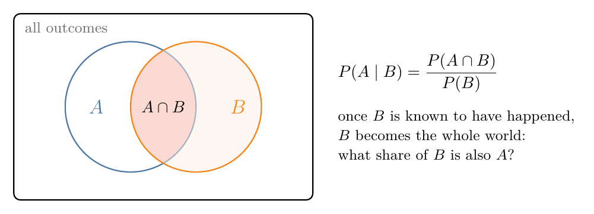
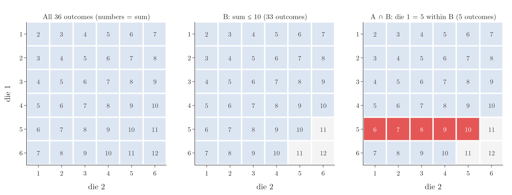
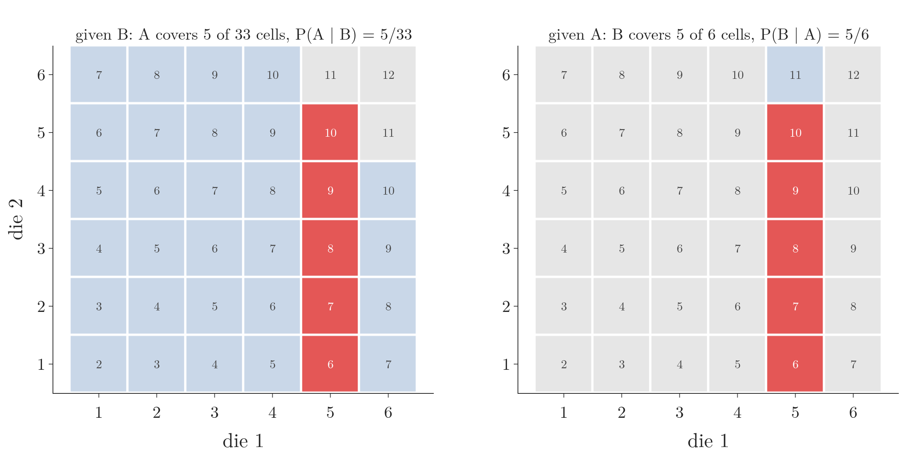
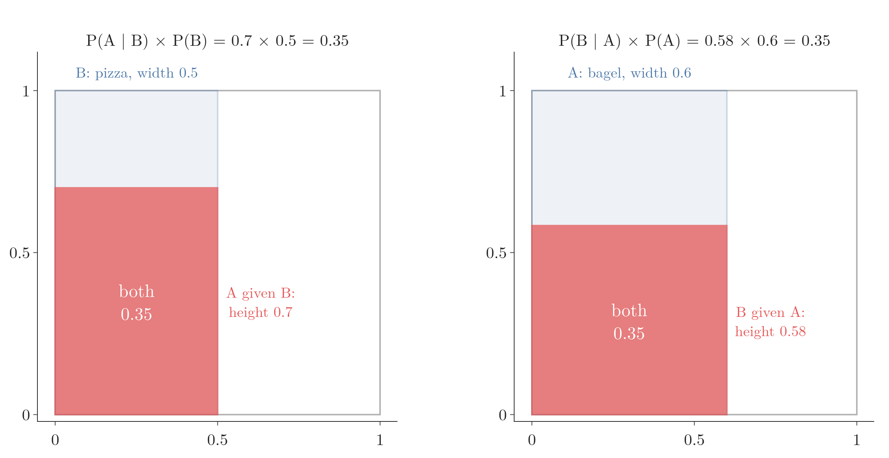

<!-- where-this-fits: generated by course_map/build_map.py; edit concepts.yaml, not this block -->
> **Where this fits:** Pipeline map step 0 (Foundations). See the [Course map](../../../00-course-map/00-course-map.md).
>
> 
>
> - **Builds on:** [Events and sample spaces](../../../MA/02-probability/MA-010-events-and-types-of-events/MA-010-events-and-types-of-events.md#24-sample-space); [Joint and marginal probability](../../../MA/02-probability/MA-014-joint-marginal-conditional-probability/MA-014-joint-marginal-conditional-probability.md#2-joint-probability).
> - **Leads to:** [Independent and mutually exclusive events](../../../MA/02-probability/MA-016-independent-events/MA-016-independent-events.md#5-independent-or-not); [Bayes' theorem](../../../MA/02-probability/MA-018-bayes-theorem/MA-018-bayes-theorem.md#1-overview).
<!-- /where-this-fits -->

## 1. Overview

> **Key point:** The probability of A given B, P(A | B), is the probability of A once we know B has happened. P(A | B) equals P(A ∩ B) / P(B).

Later, these ideas build the [Naive Bayes](../../../ML/07-classification/ML-081-naive-bayes-intuition/ML-081-naive-bayes-intuition.md#2-the-method-on-one-picture) (G-1297) classifier, a very fast classification algorithm that works well on text, famously for document classification and spam filtering (scikit-learn user guide §1.9). It rests on a few ideas from probability: conditional probability, independent events, and Bayes' theorem. This Note covers the first.

**Conditional probability** (G-444) answers questions of the form "how likely is A, now that we know B is true?". Conditional probability is used throughout probability and machine learning, and Bayes' theorem is built directly on it.

## 2. The definition

> **Key point:** P(A | B) = P(A ∩ B) / P(B), as long as P(B) is not zero.

An everyday picture: a friend draws a card from a deck and says "it is red". We stop thinking about all 52 cards and look only at the 26 red ones. The chance that the card is a heart is now 13 out of 26, one half, instead of one quarter.

{height=32%}

The idea (Figure 1): once we know $B$ has happened, every outcome outside $B$ is ruled out. $B$ becomes the whole world, and the question is what share of it also belongs to $A$.

Written as a formula, for two [events](../MA-010-events-and-types-of-events/MA-010-events-and-types-of-events.md#25-event) (G-717; things that can happen, such as "the card is a heart") $A$ and $B$, as long as $P(B)$ is not zero:

$$P(A \mid B) = \frac{P(A \cap B)}{P(B)}$$

- $P(A \mid B)$ is read "the probability of A given B".
- $A \cap B$ (A **intersection**, G-967) means "both A and B happen".
- The top is the part of $B$ that also belongs to $A$; the bottom is all of $B$. For the card:

  $$P(\text{heart and red}) = \frac{13}{52}$$

  $$P(\text{red}) = \frac{26}{52}$$

  $$P(\text{heart} \mid \text{red}) = \frac{13/52}{26/52}$$

  $$= \frac{13}{26} = \frac{1}{2}$$

The condition that $P(B)$ is not zero is there because $P(B)$ sits in the bottom of the fraction, and division by zero has no value. An event with probability 0 never happens, so there is no "world of $B$" to look inside.

## 3. An example with two dice

> **Key point:** Rolling two dice has 36 equally likely outcomes. Conditioning on "sum ≤ 10" shrinks the space to 33 outcomes.

Roll two dice together. Each outcome is a pair, (die 1, die 2): (1, 1), (1, 2), ..., (6, 6). There are 36 outcomes, all equally likely:

$$6 \times 6 = 36$$

This set of all outcomes is the [sample space](../MA-010-events-and-types-of-events/MA-010-events-and-types-of-events.md#24-sample-space) (G-1729).

{height=48%}

Figure 2 lays the sample space out as a grid, with the sum of the two dice in each cell.

### 3.1 Two ordinary probabilities

> **Key point:** P(die 1 = 5) = 6/36; P(sum ≤ 10) = 33/36.

With equally likely outcomes, a probability is the number of favourable outcomes divided by the total.

- **A: die 1 shows 5.** Event A is the whole fifth row of the grid: 6 outcomes.

  $$P(A) = \frac{6}{36} = \frac{1}{6}$$

- **B: the sum is at most 10.** Only three outcomes break it: (5, 6), (6, 5) and (6, 6), with sums 11, 11 and 12. So 33 outcomes are left (Figure 2, middle).

  $$P(B) = \frac{33}{36} = \frac{11}{12}$$


### 3.2 A conditional probability by counting

> **Key point:** Count only inside B: 5 of its 33 outcomes have die 1 = 5, so P(A | B) = 5/33.

Now ask: **what is the probability that die 1 shows 5, given that the sum is at most 10?**

Since B is known to have happened, only its 33 outcomes are possible. These 33 outcomes form the **reduced sample space** (G-1649). Inside it, die 1 shows 5 in the outcomes (5, 1), (5, 2), (5, 3), (5, 4) and (5, 5); the sixth, (5, 6), has sum 11 and is ruled out (Figure 2, right). So

$$P(A \mid B) = \frac{5}{33} \approx 0.152$$

Knowing B has lowered the chance of A slightly, because B ruled out one of A's outcomes. Without B, the chance was

$$P(A) = \frac{6}{36} \approx 0.167$$

Figure 3 shows the shrinking as motion, after the geometric picture of Bayes' rule by Sanderson (3Blue1Brown). Watch the three cells outside B disappear; the 33 cells left are then laid out again to fill the same area as the original 36, because B is now the whole world. A's 5 cells (red) take $5/33$ of it. The last scene swaps the roles, as in section 4.


### 3.3 The same answer from the formula

> **Key point:** P(A ∩ B) = 5/36 and P(B) = 33/36; dividing gives 5/33.

Using the formula instead, with the full sample space of 36:

- $P(A \cap B)$: die 1 is 5 **and** the sum is at most 10. These are the same 5 outcomes.

  $$P(A \cap B) = \frac{5}{36}$$

- The sum is at most 10 in 33 outcomes.

  $$P(B) = \frac{33}{36}$$


  $$P(A \mid B) = \frac{5/36}{33/36} = \frac{5}{33}$$

The 36s cancel, leaving exactly the count in the reduced sample space. The formula and the counting say the same thing.

> **Python:** Counting all 36 outcomes.
>
> ```python
> from fractions import Fraction
> from itertools import product
>
> outcomes = list(product(range(1, 7), repeat=2))
> B = [o for o in outcomes if sum(o) <= 10]          # 33 outcomes
> A_and_B = [o for o in B if o[0] == 5]              # 5 outcomes
> Fraction(len(A_and_B), len(B))                     # 5/33
> ```
>
> A simulation of a million rolls gives 0.1512, close to the exact 0.1515, which is 5 divided by 33.

## 4. P(A | B) is not P(B | A)

> **Key point:** Swapping the roles changes the answer: P(sum ≤ 10 | die 1 = 5) = 5/6, not 5/33.

The order matters. Given that die 1 shows 5, the reduced space is its 6 outcomes, of which 5 have a sum of at most 10:

$$P(B \mid A) = \frac{P(A \cap B)}{P(A)} = \frac{5/36}{6/36} = \frac{5}{6}$$

So the two conditional probabilities differ (Figure 3, last scene):

$$P(B \mid A) = \frac{5}{6}$$

$$P(A \mid B) = \frac{5}{33}$$

Figure 4 sets the two side by side on the grid. The overlap is the same 5 red cells in both panels; what changes is the world we divide by: B's 33 cells on the left, A's 6 cells on the right.



Confusing the two is a classic mistake. [Bayes' theorem](../MA-018-bayes-theorem/MA-018-bayes-theorem.md#4-the-formula-and-its-proof) is exactly the rule that converts one into the other.

## 5. The multiplication rule

> **Key point:** P(A ∩ B) = P(A | B) × P(B) = P(B | A) × P(A). The chance that both happen can be built from either side.

Multiply both sides of the definition by $P(B)$:

$$P(A \cap B) = P(A \mid B) \times P(B)$$

In words: for both to happen, B must happen, and then A must happen given B. This is the **multiplication rule** (G-2212). The same event can be built from the other side, starting with A:

$$P(A \cap B) = P(B \mid A) \times P(A)$$

An everyday example. Rahul likes bagels and pizza.

- A: he eats a bagel for breakfast. $P(A) = 0.6$.
- B: he eats pizza for lunch. $P(B) = 0.5$.
- On the days he has pizza for lunch, he had a bagel for breakfast 7 times out of 10: $P(A \mid B) = 0.7$.

What is $P(B \mid A)$, the chance of pizza for lunch given a bagel for breakfast?

1. Build "both" from the B side:

   $$P(A \cap B) = 0.7 \times 0.5 = 0.35$$

2. The A side must give the same number:

   $$P(B \mid A) \times 0.6 = 0.35$$

3. Divide:

   $$P(B \mid A) = \frac{0.35}{0.6} \approx 0.58$$

{height=38%}

Figure 5 shows the rule as an area. The whole square is every day, with area 1. On the left, the strip for B is 0.5 wide and A fills 0.7 of it, so the red rectangle has area 0.35. On the right, the strip for A is 0.6 wide and B fills 0.58 of it: the same area, 0.35.

Two things to take from the example:

- **The order matters again:** $P(A \mid B) = 0.7$ but $P(B \mid A) = 0.58$, as in Section 4.
- **The events affect each other:** $P(A \mid B) = 0.7$ is not $P(A) = 0.6$, so knowing B changes the chance of A. Such events are [dependent events](../MA-016-independent-events/MA-016-independent-events.md#5-independent-or-not) (G-590). When knowing B changes nothing, the events are [independent](../MA-016-independent-events/MA-016-independent-events.md#2-the-definition) (the probability of one does not change when the other is known).

Setting the two forms of the rule equal and dividing, as in steps 2 and 3, is [Bayes' theorem](../MA-018-bayes-theorem/MA-018-bayes-theorem.md#4-the-formula-and-its-proof).

## 6. Summary

- Conditional probability: $P(A \mid B) = P(A \cap B) / P(B)$, because once $B$ has happened, $B$ is the whole world and we ask what share of it is also $A$.
- Knowing B shrinks the sample space to B; count A's share inside it. The formula gives the same answer, because the full total cancels.
- Multiplication rule: $P(A \cap B) = P(A \mid B) \times P(B) = P(B \mid A) \times P(A)$, so the chance of both can be built from either side; setting the two sides equal gives Bayes' theorem.
- Two dice: the chance of a 5 on die 1 given a sum of at most 10 is 5 in 33; the chance of a sum of at most 10 given a 5 on die 1 is 5 in 6. Swapping the condition changes the world we divide by, so $P(A \mid B)$ is not $P(B \mid A)$; Bayes' theorem converts one into the other.
- Conditional probability answers "how likely is A, now that we know B?", and Bayes' theorem, and through it Naive Bayes, is built directly on it.

## 7. Sources

**Built from**

- CampusX, "Naive Bayes Classifier | Part 1 | Conditional Probability", YouTube, https://www.youtube.com/watch?v=Ty7knppVo9E
- Khan Academy, "Calculating conditional probability | Probability and Statistics", YouTube, https://www.youtube.com/watch?v=6xPkG2pA-TU (the breakfast-and-lunch example and the multiplication rule read both ways)
- **Sanderson, G. (3Blue1Brown):** "Bayes' theorem", 3blue1brown.com/lessons/bayes-theorem. The picture of conditioning as shrinking the space of possibilities; Figure 3 recreates it with our own dice example.

**Other references**

- **scikit-learn user guide:** Section 1.9, "Naive Bayes", scikit-learn 1.9.

## 8. Key terms

| Term | Meaning |
|---|---|
| Sample space | The set of all possible outcomes of an experiment, such as $\lbrace1, \dots, 6\rbrace$ for a die; every event is a subset of it, so probabilities are worked out inside it. |
| Event | A set of outcomes, such as "the sum is at most 10" |
| Intersection (A ∩ B) | The event that both A and B happen |
| Conditional probability | The probability of an event given that another event has happened: $P(A \mid B)$ |
| Multiplication rule (G-2212) | The chance that both A and B happen is the chance of B times the chance of A given B: $P(A \cap B) = P(A \mid B) \times P(B)$. |
| Dependent events | Events where knowing one changes the probability of the other |
| Reduced sample space | The outcomes that remain possible once the condition is known |
| Naive Bayes (G-1297) | A classification algorithm based on Bayes' theorem (later Notes) |
