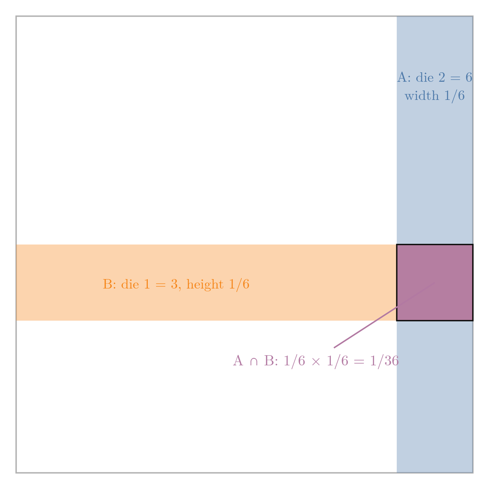
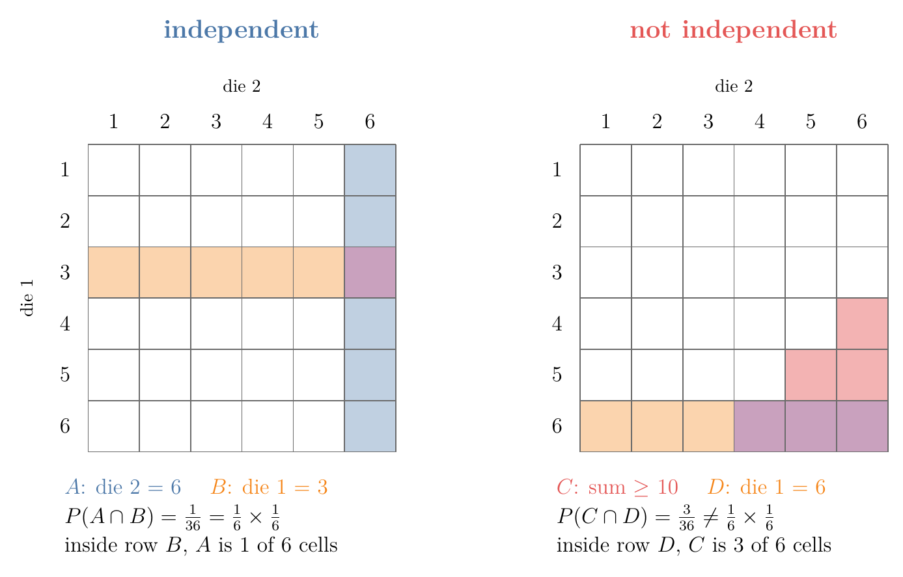
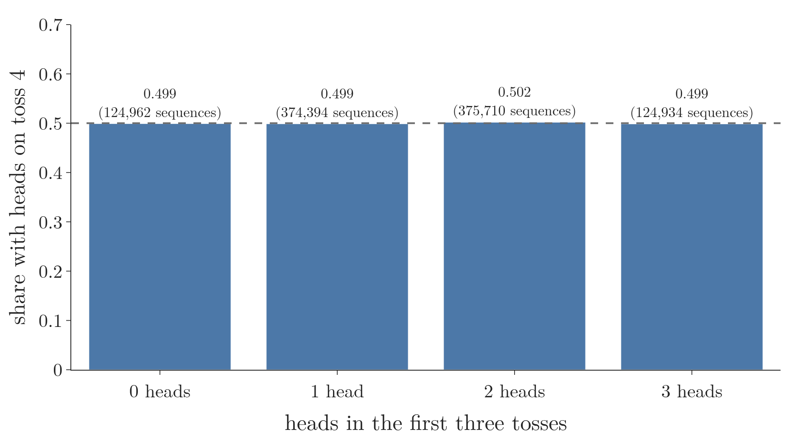
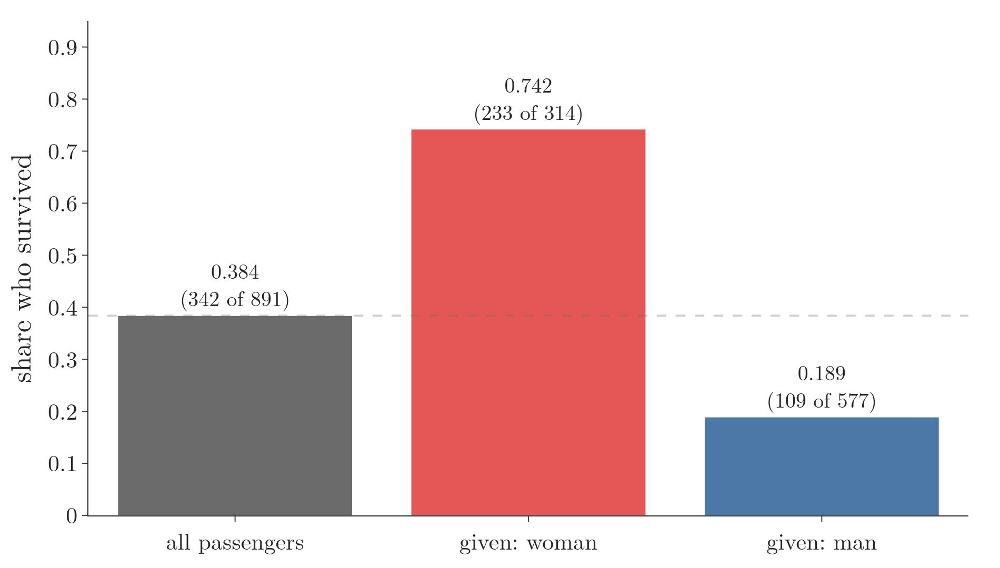
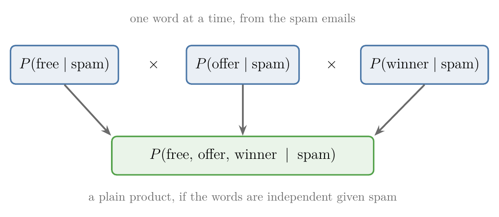

<!-- where-this-fits: generated by course_map/build_map.py; edit concepts.yaml, not this block -->
> **Where this fits:** Pipeline map step 0 (Foundations). See the [Course map](../../../00-course-map/00-course-map.md).
>
> 
>
> - **Builds on:** [Conditional probability](../../../MA/02-probability/MA-014-joint-marginal-conditional-probability/MA-014-joint-marginal-conditional-probability.md#4-conditional-probability).
> - **Leads to:** [Naive Bayes](../../../ML/07-classification/ML-081-naive-bayes-intuition/ML-081-naive-bayes-intuition.md#2-the-method-on-one-picture); [Voting ensembles](../../../ML/08-trees-and-ensembles/ML-096-voting-ensemble/ML-096-voting-ensemble.md#2-the-core-idea).
<!-- /where-this-fits -->

## 1. Overview

> **Key point:** Two events are independent when knowing one happened does not change the probability of the other: P(A | B) = P(A). Equivalently, P(A ∩ B) = P(A) × P(B).

Notation used throughout: an **event** ([something that can happen, such as "a die shows 6"](../MA-010-events-and-types-of-events/MA-010-events-and-types-of-events.md#25-event)) is named by a capital letter such as $A$. $P(A)$ is the probability of $A$; for $A$ = "a fair die shows 6", it is one in six. $A \cap B$ means "both $A$ and $B$ happen", and $P(A \mid B)$ means "the probability of $A$ once we know $B$ happened" ([conditional probability](../MA-015-conditional-probability/MA-015-conditional-probability.md#2-the-definition)).

This Note and [the next](../MA-017-mutually-exclusive-events/MA-017-mutually-exclusive-events.md#2-the-definition) cover two ideas that are often confused: **independent events** and **mutually exclusive events**. Naive Bayes relies on the first: its "naive" assumption is that the **features** (G-772; the input variables, one column each of the data table) are independent of each other within each class (for example, among spam emails only). Knowing exactly what independence means makes that assumption easy to understand.

## 2. The definition

> **Key point:** A and B are independent if P(A ∩ B) = P(A) × P(B).

Toss a coin and roll a die. Both can happen, and what the coin shows makes no difference to what the die shows. Events like these, where one happening does not change the chance of the other, are **independent events** (G-934).

The formal definition: two events $A$ and $B$ are independent if

$$P(A \cap B) = P(A) \times P(B)$$

In words: the probability that both happen is the product of their separate probabilities. This is the **product rule for independent events** (G-1576). Section 4 shows that the product rule and "makes no difference" say the same thing.

Figure 1 draws the rule as areas for the dice example of the next section. The whole square is the **sample space** ([the set of all possible outcomes](../MA-010-events-and-types-of-events/MA-010-events-and-types-of-events.md#24-sample-space)), with area 1. Event $A$ is a band of width $1/6$, event $B$ a band of height $1/6$. Because $A$ takes the same share inside $B$ as everywhere else, their overlap is a rectangle with this area:

$$1/6 \times 1/6 = 1/36$$

{width=60%}

Independent events **can** happen together. What makes them independent is that one happening makes no difference to the chance of the other.

## 3. Examples

> **Key point:** A coin has no memory; two dice do not influence each other.

- **Coin tosses.** A fair coin has come up heads three times in a row. The probability of heads on the next toss is still $1/2$: the coin has no memory of earlier tosses. Believing that tails is now "due" is a common mistake called the **gambler's fallacy** (G-2213). In a simulation of a million sequences of four tosses, the fourth toss was heads in 49.9% of the cases that started with three heads.
- **Two dice.** Die 1 shows 3. The probability that die 2 shows 6 is still $1/6$: what one die shows does not affect the other.

Check the definition with the dice. Let $A$ be "die 2 shows 6" and $B$ be "die 1 shows 3". Of the 36 equally likely outcomes, only (3, 6) is in both, so

$$P(A \cap B) = \frac{1}{36}$$

$$P(A) \times P(B) = \frac{1}{6} \times \frac{1}{6} = \frac{1}{36}$$

Both sides agree, so $P(A \cap B) = P(A) \times P(B)$.

The two events are independent.

{width=95%}

Figure 2 draws this check on the grid of outcomes, next to a pair of events that fails it. In the left grid, the shaded column takes 1 of the 6 cells inside row $B$, the same share it takes of the whole grid (6 of 36). The right grid uses two new events: $C$ = "the sum of the two dice is at least 10" and $D$ = "die 1 shows 6" (section 5 checks them with the formula). There, the cells of $C$ (red, and purple where they fall in row $D$) take 3 of the 6 cells inside row $D$ but only 6 of 36 overall: knowing $D$ makes $C$ three times as likely.

## 4. Why this means "no difference"

> **Key point:** Substituting P(A ∩ B) = P(A) P(B) into the conditional probability formula gives P(A | B) = P(A).

From the [definition of conditional probability](../MA-015-conditional-probability/MA-015-conditional-probability.md#2-the-definition), $P(A \mid B) = P(A \cap B) / P(B)$. If $A$ and $B$ are independent, the top is $P(A) \times P(B)$, so

$$P(A \mid B) = \frac{P(A) \times P(B)}{P(B)}$$

$$P(A \mid B) = P(A)$$

Knowing $B$ happened leaves the probability of $A$ exactly as it was. Figure 3 checks this on a million simulated coin sequences: whatever the first three tosses showed, the fourth comes up heads about half the time.

The same argument gives $P(B \mid A) = P(B)$. An unchanged probability is the intuition behind the definition: independence means information about one event tells us nothing about the other.

> **Extra:** The same result can be seen by counting. For independent events, the share of $B$'s outcomes that also belong to $A$ (that is, $n(A \cap B) / n(B)$, the conditional probability) equals the share of the whole sample space that belongs to $A$ ($n(A) / n$). In the dice example, 1 of die 1's six "3" outcomes has die 2 = 6, and 6 of all 36 outcomes do: both $1/6$.

## 5. Independent or not?

> **Key point:** If the conditional probability changes with the condition, the events are not independent.

{height=50%}

Figure 4 conditions two different events on what die 1 shows:

- **Left:** "die 2 shows 6" has probability $1/6$ whatever die 1 shows. Independent.
- **Right:** "the sum is at least 10" has probability $1/6$ overall, but given die 1 it ranges from 0 (die 1 shows 1, 2 or 3) to $1/2$ (die 1 shows 6). Knowing die 1 changes it a lot, so these events are **not** independent: they are **dependent events** (G-590).

Checking with the definition for $C$ = "sum at least 10" and $D$ = "die 1 shows 6". The probability of both:

$$P(C \cap D) = 3/36 = 1/12$$

The product of the two probabilities:

$$P(C) \times P(D) = 1/6 \times 1/6 = 1/36$$

The two are different, so the product rule fails.

### 5.1 The same test on real data

> **Key point:** On a data table, compare the share of A overall with the share of A inside the rows where B is true.

With dice we know the exact probabilities. With data we only have counts, so we estimate each probability as a share of rows and run the same test. Take the 891 passengers of the Titanic training data, with $A$ = "survived" and $B$ = "is a woman".

1. **The share of A overall:** 342 of the 891 passengers survived.

   $$P(A) \approx 342/891 = 0.384$$

2. **The share of A inside B:** of the 314 women, 233 survived.

   $$P(A \mid B) \approx 233/314 = 0.742$$

3. **Compare:** 0.742 is almost twice 0.384. Knowing that a passenger is a woman changes the chance of survival a lot, so the two events are not independent.

{height=40%}

Figure 5 shows the three shares. If survival were independent of sex, all three bars would sit near the dashed line.

Shares from data are estimates, not exact probabilities. A large gap like this one is clear evidence of dependence. When the two shares are close, the data only suggests independence, and more rows give a more reliable answer.

## 6. Why Naive Bayes cares

> **Key point:** Naive Bayes assumes the features are independent given the class, so that their probabilities can simply be multiplied.

With independent events, the probability of several things happening together is just a product of separate probabilities. Naive Bayes uses the product rule to combine evidence, applied inside each class: it assumes the features are independent once the class is known. The **target** (G-1949; the output we predict) is the class, such as spam or not spam; the features are the words. For an email, the probabilities of the words "free", "offer" and "winner" given "spam" are multiplied together. Real words are not truly independent, which is why the method is called "naive", but the simplification often works well in practice: the assumption introduces some bias but reduces variance (the extra error and the extra sensitivity to the data, [bias and variance](../../../ML/06-regression/ML-061-bias-variance/ML-061-bias-variance.md#1-overview); ISL §4.4.4; [the naive assumption](../../../ML/07-classification/ML-081-naive-bayes-intuition/ML-081-naive-bayes-intuition.md#7-the-naive-assumption)).

{width=85%}

Figure 6 shows the product: each word's probability is estimated on its own, then the three are multiplied.

## 7. Summary

- Independent: $P(A \cap B) = P(A) \times P(B)$, equivalently $P(A \mid B) = P(A)$, because putting the product into the conditional probability formula cancels $P(B)$.
- Independent events can happen together; one just does not affect the other, so a coin that showed three heads still has a chance of one half for heads next (the gambler's fallacy).
- On data: compare the share of A overall with the share of A inside B. Titanic: 0.384 overall against 0.742 for women, so not independent: knowing a passenger is a woman changes the chance of survival a lot.
- Coins and separate dice are independent, because one does not influence the other; "die 1 = 6" and "sum ≥ 10" are not, because a 6 on die 1 makes a large sum more likely.
- Naive Bayes assumes the features are independent given the class, so their probabilities can simply be multiplied; real words are not truly independent, which is why the method is called "naive".

## 8. Sources

**Built from**

- CampusX, "Naive Bayes Classifier | Part 2 | Independent Events in Probability", YouTube, https://www.youtube.com/watch?v=0GD480CnrO4

- Khan Academy, "Conditional probability and independence | Probability | AP Statistics", YouTube, https://www.youtube.com/watch?v=pIfpHdGVwLU (testing independence on a table of counts; our own check uses the Titanic data)

**Other references**

- **ISL:** James, G., Witten, D., Hastie, T. and Tibshirani, R. *An Introduction to Statistical Learning*, 2nd ed. Springer, 2021. Section 4.4.4, p. 155.

## 9. Key terms

Terms taught in this Note come first; linked terms are recaps, taught in the Note the link opens.

| Term | Meaning |
|---|---|
| Independent events (G-934) | Events where one happening does not change the probability of the other. |
| Product rule for independent events (G-1576) | For independent events, the probability that both happen is the product of their separate probabilities: $P(A \cap B) = P(A) \times P(B)$. |
| Gambler's fallacy (G-2213) | The mistaken belief that after a run of heads, tails is "due"; independent tosses have no memory. |
| Dependent events (G-590) | Events that are not independent: knowing one changes the probability of the other. |
| [Feature](../../../ML/01-foundations/ML-002-ai-vs-ml-vs-dl/ML-002-ai-vs-ml-vs-dl.md#52-features-chosen-by-us-or-learned) (G-772) | One piece of information about each example that a model uses (e.g. a student's CGPA). |
| [Target](../../../ML/01-foundations/ML-003-types-of-ml/ML-003-types-of-ml.md#21-learning-from-inputs-and-outputs) (G-1949) | The output column we predict, such as the class; also called the label. |
