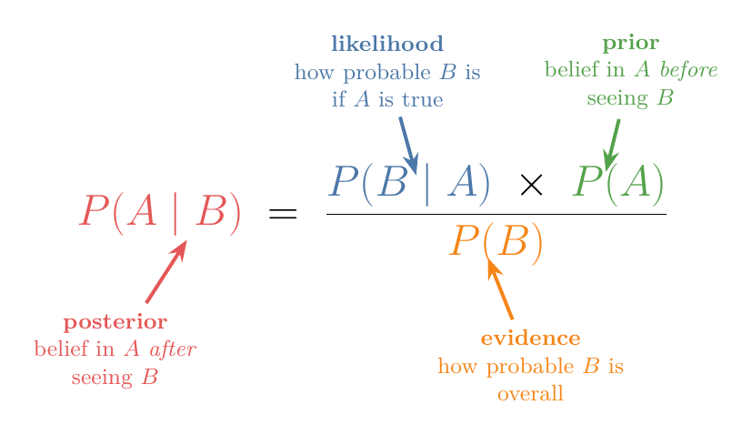
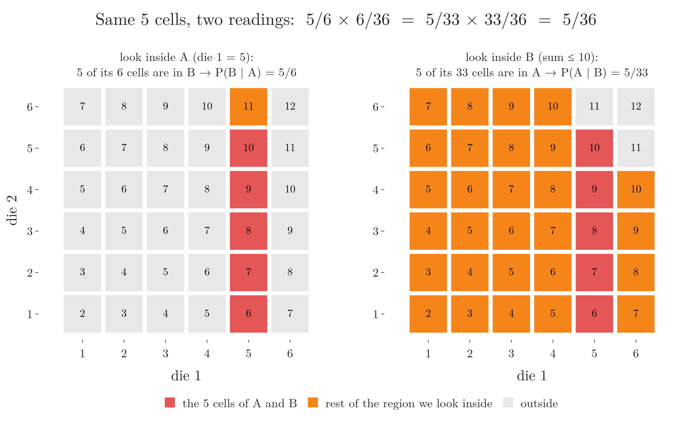

<!-- where-this-fits: generated by course_map/build_map.py; edit concepts.yaml, not this block -->
> **Where this fits:** Pipeline map step 0 (Foundations). See the [Course map](../../../00-course-map/00-course-map.md).
>
> 
>
> - **Builds on:** Conditional probability ([Note MA-015](../../../MA/02-probability/MA-015-conditional-probability/MA-015-conditional-probability.md)); Joint and marginal probability ([Note MA-014](../../../MA/02-probability/MA-014-joint-marginal-conditional-probability/MA-014-joint-marginal-conditional-probability.md)).
> - **Leads to:** Naive Bayes ([Note ML-081](../../../ML/07-classification/ML-081-naive-bayes-intuition/ML-081-naive-bayes-intuition.md)); MAP estimation ([Note MA-072](../../../MA/08-likelihood/MA-072-mle-in-machine-learning/MA-072-mle-in-machine-learning.md)); Gaussian mixture model (GMM) ([Note MA-073](../../../MA/08-likelihood/MA-073-gaussian-mixture-models/MA-073-gaussian-mixture-models.md)).
<!-- /where-this-fits -->

## 1. Overview

> **Key point:** Evidence does not decide a belief on its own; evidence updates the belief we held before. Bayes' theorem is the formula for that update: P(A | B) = P(B | A) × P(A) / P(B). Naive Bayes is this theorem plus one simplifying assumption.

This Note builds the theorem from a puzzle with counts of people, and only then writes the formula:

- a puzzle solved by counting (section 2);
- the names of the four parts: prior, likelihood, evidence, posterior (section 3);
- the formula and its two-line proof (section 4);
- the picture to draw instead of memorising the formula (section 5);
- two worked examples, dice and spam (section 6);
- why the theorem matters for machine learning (section 7).

**Bayes' theorem** (G-269) was published in 1763, after Thomas Bayes's death, by his friend Richard Price (Bayes 1763). A whole branch of statistics, **Bayesian statistics** (G-271), is built on it (Gelman et al. 2013, §1.3).

## 2. A puzzle before any formula

> **Key point:** Librarians are 4 times as likely as farmers to fit the description, yet a person who fits is a librarian only 4 times in 24 (16.7%), because farmers outnumber librarians 20 to 1.

Steve is described as "a meek and tidy soul" with "a need for order and structure". Is Steve more likely to be a librarian or a farmer?

Most people answer "librarian", because the description sounds like one. In the study where this puzzle comes from (Kahneman and Tversky), almost nobody stopped to ask how many librarians and farmers there are. There are about 20 farmers for every librarian.

We can solve the puzzle by counting people, step by step (Figure 1):

1. **Picture a sample of 210 people** in the right ratio: 10 librarians and 200 farmers.
2. **Ask who fits the description.** Suppose 40% of librarians fit and 10% of farmers fit. Then 4 librarians fit and 20 farmers fit.
3. **Keep only the people who fit.** The description rules out everyone else. 4 + 20 = 24 people are left.
4. **Read the answer among those who are left.** 4 of the 24 are librarians.

The answer to the puzzle is the fraction of step 4:

$$P(\text{librarian} \mid \text{description}) = \frac{4}{24} \approx 16.7 \text{ percent}$$

{height=50%}

In Figure 1, watch frame 2: the description picks a larger share of the librarians' column (4 of 10) than of any farmers' column (1 of 10). But there are 20 farmers' columns, so the farmers who fit still outnumber the librarians who fit, 20 to 4.

Two things changed between the start and the end:

- Before the description, a random person from the sample is a librarian with probability 10/210 = 1/21, about 4.8%.
- After the description, the probability is 4/24, about 16.7%.

The description raised the belief (from 4.8% to 16.7%), but did not decide it. The starting ratio still matters. New evidence **updates** an earlier belief; the evidence does not replace it.

## 3. The names of the four parts

> **Key point:** Posterior = likelihood × prior / evidence. The prior is the belief before the evidence, the posterior the belief after it.

Every step of the puzzle has a standard name. The statement we want to judge, "Steve is a librarian", is the **hypothesis** (G-2214) $H$. The thing we observed, the description, is the **evidence** $E$. The bar in $P(H \mid E)$ reads "given": we look only at the cases where $E$ holds (**conditional probability**, G-444, [Note MA-015](../MA-015-conditional-probability/MA-015-conditional-probability.md)).

| Step of the puzzle | Number | Name | Symbol |
|---|---|---|---|
| Share of librarians before the description | 10/210 = 1/21 | **prior** (G-1565) | $P(H)$ |
| Share of librarians who fit the description | 0.4 | **likelihood** (G-1086) | $P(E \mid H)$ |
| Share of farmers who fit the description | 0.1 | likelihood of the other case | $P(E \mid \text{not } H)$ |
| Share of all people who fit the description | 24/210 | **evidence** (G-718) | $P(E)$ |
| Share of librarians among those who fit | 4/24 | **posterior** (G-1536) | $P(H \mid E)$ |

Figure 2 places the four names on the formula of section 4, written with the usual letters $A$ (the hypothesis) and $B$ (the evidence).

{height=40%}

The likelihood here is the same idea as in the [log loss Note](../../../ML/07-classification/ML-072-log-loss/ML-072-log-loss.md) (section three): the probability of what we observed, given a hypothesis (there, a model's coefficients; here, an event).

An everyday picture of the same update: a doctor first guesses how common a disease is among all patients (the prior). A test result arrives (the evidence), and the doctor revises the guess for this one patient (the posterior).

In classification, the hypothesis will be a class, the **target** (the output we predict, such as "spam"). The evidence will be the observed **features** (the input variables, such as the words in an email). The posterior is what the classifier wants.

## 4. The formula and its proof

> **Key point:** P(A | B) = P(B | A) × P(A) / P(B), for P(B) ≠ 0. The proof writes P(A ∩ B) in two ways using conditional probability and sets them equal.

### 4.1 From the counts to the formula

> **Key point:** The 210 cancels. What is left is likelihood × prior, divided by the evidence.

The 4 librarians who fit came from three numbers multiplied together: 210 people × the prior 1/21 × the likelihood 0.4. The 20 farmers who fit came from 210 × 20/21 × 0.1. So

$$P(H \mid E) = \frac{4}{4 + 20}$$
$$= \frac{210 \times \frac{1}{21} \times 0.4}{210 \times \frac{1}{21} \times 0.4 + 210 \times \frac{20}{21} \times 0.1}$$

The 210 appears in every term and cancels. The sample size was only a convenience. What remains uses probabilities alone:

$$P(H \mid E) = \frac{P(E \mid H) \times P(H)}{P(E \mid H) \times P(H) + P(E \mid \text{not } H) \times P(\text{not } H)}$$

The denominator adds the two ways the evidence can appear: with the hypothesis true, and with the hypothesis false. Together they are the evidence $P(E)$, here 24/210. Splitting the evidence into cases in this way is the **law of total probability** (G-1053), taught in the [next Note](../MA-019-bayes-problem/MA-019-bayes-problem.md).

For any two events $A$ and $B$ with $P(B) \neq 0$, the same statement is Bayes' theorem:

$$P(A \mid B) = \frac{P(B \mid A) \times P(A)}{P(B)}$$

The conditional probability Note showed that $P(A \mid B)$ and $P(B \mid A)$ are usually different. Bayes' theorem is the rule for getting one from the other.

### 4.2 The proof

> **Key point:** Both P(A | B) × P(B) and P(B | A) × P(A) equal P(A ∩ B).

Start from the definition of conditional probability:

$$P(A \mid B) = \frac{P(A \cap B)}{P(B)} \qquad (1)$$

The same definition with the roles swapped gives

$$P(B \mid A) = \frac{P(B \cap A)}{P(A)}$$

"Both $B$ and $A$" is the same event as "both $A$ and $B$", so $P(B \cap A) = P(A \cap B)$, the **joint probability** (G-986). Multiplying both sides by $P(A)$:

$$P(A \cap B) = P(B \mid A) \times P(A) \qquad (2)$$

Substituting (2) into (1) gives Bayes' theorem:

$$P(A \mid B) = \frac{P(B \mid A) \times P(A)}{P(B)}$$

### 4.3 The proof on a picture: one event, two kinds of knowledge

> **Key point:** P(A | B) and P(B | A) talk about the same cells. They differ only in what is given, so they divide by different totals.

Figure 3 runs the proof on the two dice of section 6.1, with $A$ = "die 1 shows 5" and $B$ = "the sum is at most 10". Watch the same five red cells in both panels:

- Given $A$ (left), the five cells are $5/6$ of the six cells of $A$.
- Given $B$ (right), the same five cells are $5/33$ of the 33 cells of $B$.
- Either way, the five cells are $5/36$ of the whole table:
  $$5/6 \times 6/36 = 5/36$$
  $$5/33 \times 33/36 = 5/36$$

{height=42%}

The event "both $A$ and $B$" is the same in both panels. Only the given knowledge changes, and with it the total we divide by. Setting the two products equal is the whole proof.

When the full table is in front of us, as with the dice, we can simply count and the theorem adds nothing. The theorem earns its place when the table is not available: for a large population we usually know, or can estimate, one conditional probability and the two overall probabilities, and Bayes' theorem gives the other conditional from them.

## 5. The picture to draw

> **Key point:** Draw a 1 × 1 square. The hypothesis is a strip of width P(H). The evidence keeps a piece of height P(E | H) on its side and P(E | not H) on the other. The posterior is the hypothesis piece's share of what is kept.

The formula does not need to be memorised. The same reasoning can be drawn with areas instead of counts (Figure 4):

1. **Draw a square of side 1.** The square is every possibility, and the area of a region is its probability.
2. **Prior.** Give the hypothesis a strip on the left of width $P(H)$. For the librarians the width is 1/21.
3. **Likelihood.** Inside the left strip, shade a piece of height $P(E \mid H) = 0.4$. Inside the right strip, shade a piece of height $P(E \mid \text{not } H) = 0.1$. Each shaded area is width × height, which is equation (2): $P(H \cap E) = P(E \mid H) \times P(H)$.
4. **Evidence.** We saw the evidence, so only the two shaded pieces remain. Their total area is $P(E)$.
5. **Posterior.** The left piece's share of the shaded area is $P(H \mid E)$: 16.7%.

{height=45%}

In Figure 4, watch the last step. The farmers' piece grows until both pieces have the same height, 0.4. The posterior then equals the prior, 1/21. The formula agrees: with $P(E \mid H) = P(E \mid \text{not } H)$, the height cancels from the numerator and the denominator, leaving $P(H) / (P(H) + P(\text{not } H)) = P(H)$. Evidence that is equally likely under both cases is irrelevant, and irrelevant evidence leaves the belief unchanged. The belief moves most when the two heights are very different.

## 6. Two worked examples

> **Key point:** Bayes recovers P(die 1 = 5 | sum ≤ 10) = 5/33 from P(sum ≤ 10 | die 1 = 5) = 5/6; and the word "free" raises the chance of spam from 20% to 75%.

### 6.1 The dice again

> **Key point:** The theorem gives the same 5/33 found by counting.

From the conditional probability Note, with $A$ = "die 1 shows 5" and $B$ = "the sum is at most 10": the three pieces are:

$$P(B \mid A) = 5/6$$
$$P(A) = 1/6$$
$$P(B) = 11/12$$

Then

$$P(A \mid B) = \frac{\frac{5}{6} \times \frac{1}{6}}{\frac{11}{12}}$$
$$P(A \mid B) = \frac{5/36}{33/36} = \frac{5}{33}$$

exactly the value found by counting in Figure 3.

### 6.2 A first look at spam

> **Key point:** Prior 0.2, likelihoods 0.6 and 0.05: seeing "free" makes spam 75% likely.

Suppose 20% of emails are spam. The word "free" appears in 60% of spam emails and in 5% of normal ones. An email contains "free": how likely is it to be spam?

- Prior: $P(\text{spam}) = 0.20$.
- Likelihood: $P(\text{free} \mid \text{spam}) = 0.60$.
- Evidence: "free" can appear in spam or in normal email, so we add the two ways:
  $$P(\text{free}) = 0.60 \times 0.20 + 0.05 \times 0.80$$
  $$P(\text{free}) = 0.12 + 0.04 = 0.16$$

  $$P(\text{spam} \mid \text{free}) = \frac{0.60 \times 0.20}{0.16} = 0.75$$

Figure 5 draws the same sum on the square of section 5. The square is all emails. Watch the two dark pieces in step 4: they are all that is left once we know the email says "free". The spam piece has width 0.2 and height 0.6, so its area is $P(\text{spam} \cap \text{free}) = 0.12$, three times the normal piece's 0.04.

The two examples of sections 2 and 6.2 point in opposite directions, and the square shows why:

| | Prior | Likelihoods | Posterior | What happened |
|---|---|---|---|---|
| Librarian | 1/21 ≈ 0.048 | 0.4 against 0.1 (4 times) | 0.167 | a very thin strip stays the smaller piece |
| Spam | 0.20 | 0.6 against 0.05 (12 times) | 0.75 | a wider strip with a much taller piece becomes the larger piece |

A strong likelihood cannot overcome a very small prior on its own. Both numbers enter the product.

## 7. Why the theorem matters here

> **Key point:** A classifier wants P(class | features). The data gives P(features | class) by counting. Bayes' theorem connects the two.

Seeing one word moved the belief about an email from 20% to 75%. A spam filter does the same with every word of the email. The **Naive Bayes** classifier is Bayes' theorem combined with the independence assumption of [Note MA-016](../MA-016-independent-events/MA-016-independent-events.md):

- the way the evidence splits into "spam" and "not spam" cases is worked through in the [next Note](../MA-019-bayes-problem/MA-019-bayes-problem.md);
- combining many features is the subject of [Note ML-081](../../../ML/07-classification/ML-081-naive-bayes-intuition/ML-081-naive-bayes-intuition.md).

> **Extra: counts are easier than percentages.** The puzzle of section 2 was easy because it used counts of people. In a related experiment, 85% of people judged "a bank teller who is active in the feminist movement" to be more likely than "a bank teller", although the first group is a part of the second. When the same question was asked about 100 people fitting the description ("how many of the 100 are…?"), nobody made the mistake (Kahneman and Tversky). When a probability question is confusing, rewrite it as "40 out of 100" or draw the square.

## 8. Summary

- Evidence updates a prior belief; the evidence does not replace it. A librarian-like description lifts "librarian" from 4.8% to only 16.7%, because farmers are 20 times as common.
- Bayes' theorem: $P(A \mid B) = P(B \mid A) P(A) / P(B)$.
- Posterior = likelihood × prior / evidence.
- The proof writes $P(A \cap B)$ two ways using conditional probability.
- The picture: a unit square, a strip of width $P(H)$, pieces of height $P(E \mid H)$ and $P(E \mid \text{not } H)$; the posterior is the hypothesis piece's share of the two pieces.
- Equal likelihoods leave the belief unchanged.
- Naive Bayes applies the theorem with A = class and B = the observed features.

## 9. Sources

**Built from**

- CampusX, "Naive Bayes Classifier | Part 4 | Bayes Theorem in Probability", YouTube, https://www.youtube.com/watch?v=Oqw-v-Z7PuU
- 3Blue1Brown, "Bayes theorem, the geometry of changing beliefs", YouTube, https://www.youtube.com/watch?v=HZGCoVF3YvM (the librarian puzzle, the sample of 210 people, the unit-square diagram, equal likelihoods, counts against percentages; Figures 1, 4 and 5 are redrawn from these ideas with our own code)
- StatQuest with Josh Starmer, "Bayes' Theorem, Clearly Explained!!!!", YouTube, https://www.youtube.com/watch?v=9wCnvr7Xw4E (one event under two kinds of given knowledge; the theorem is useful when the full table is not available)

**Other references**

- **Gelman et al. 2013:** Gelman, A., Carlin, J. B., Stern, H. S., Dunson, D. B., Vehtari, A. and Rubin, D. B. *Bayesian Data Analysis*, 3rd ed. CRC Press, 2013. Section 1.3, pp. 6–7.
- **Bayes 1763:** Bayes, T. "An Essay towards Solving a Problem in the Doctrine of Chances." Communicated by R. Price. *Philosophical Transactions of the Royal Society of London* 53, 370–418, 1763.

## 10. Key terms

| Term | Meaning |
|---|---|
| Bayes' theorem (G-269) | $P(A \mid B) = P(B \mid A) P(A) / P(B)$: the rule that reverses a conditional probability |
| Hypothesis (G-2214) | The statement whose probability we want, such as "Steve is a librarian" or "the email is spam" |
| Prior (G-1565) | The probability of an event before any evidence is seen |
| Likelihood (G-1086) | The probability of the observed evidence if a given event is true |
| Evidence (G-718) | The overall probability of the observed evidence |
| Posterior (G-1536) | The probability of an event after the evidence is taken into account |
| Bayesian statistics (G-271) | The branch of statistics that treats probabilities as beliefs updated by Bayes' theorem |
