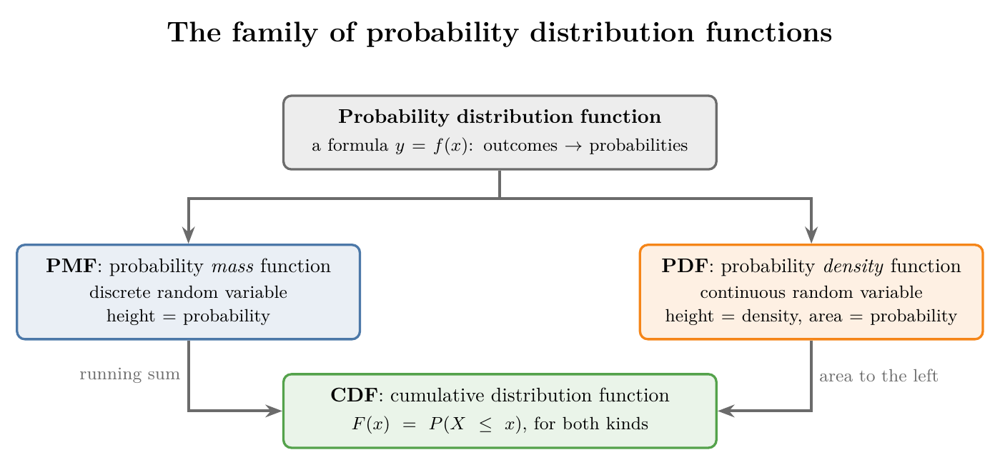
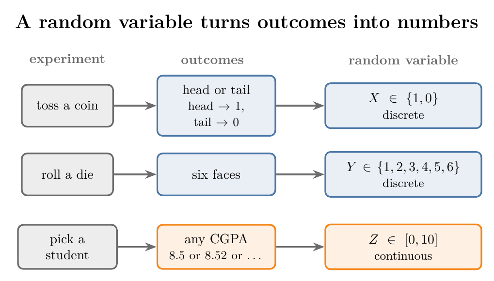
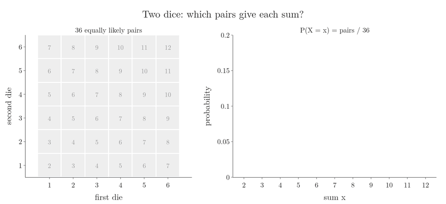
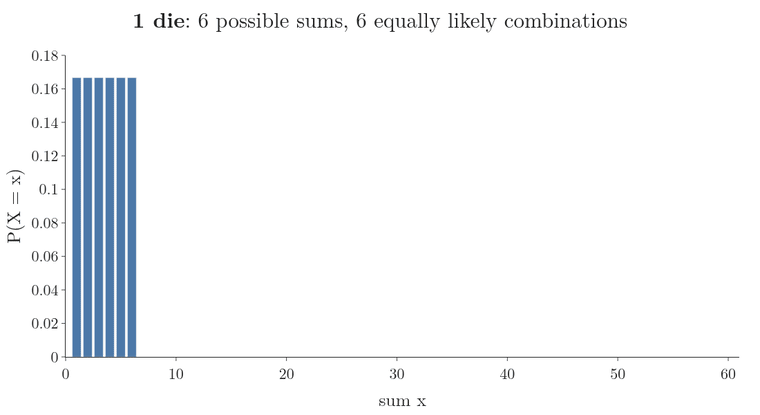
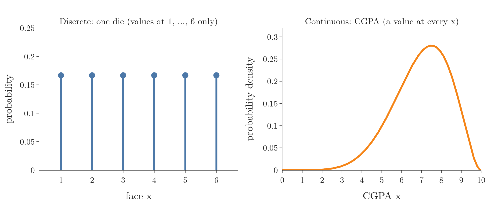
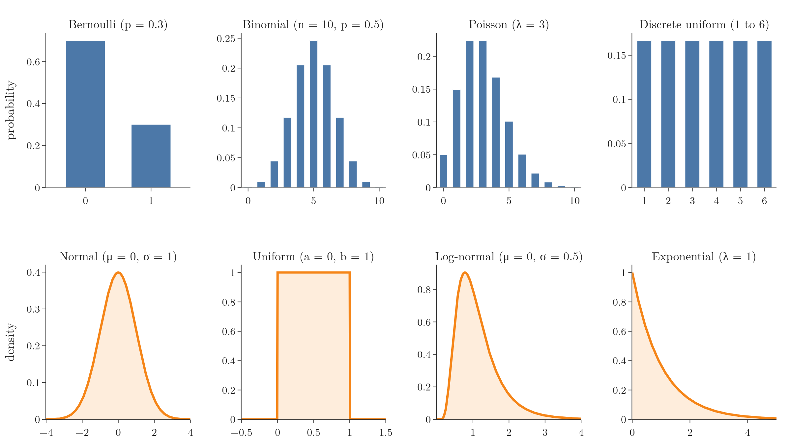
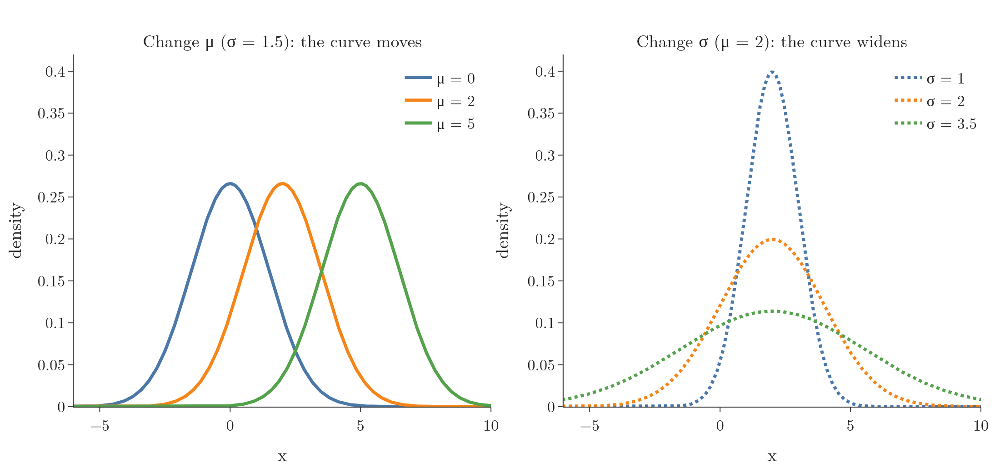

<!-- where-this-fits: generated by course_map/build_map.py; edit concepts.yaml, not this block -->
> **Where this fits:** Pipeline map step 0 (Foundations). See the [Course map](../../../00-course-map/00-course-map.md).
>
> 
>
> - **Builds on:** [Probability density function (PDF)](../../../ML/02-getting-data/ML-019-univariate-analysis/ML-019-univariate-analysis.md#7-density-plot); [Discrete and continuous data](../../../MA/01-descriptive-stats/MA-004-what-is-statistics/MA-004-what-is-statistics.md#62-discrete-and-continuous-data).
> - **Leads to:** [Probability mass function (PMF)](../../../MA/03-distributions/MA-021-pmf-and-discrete-cdf/MA-021-pmf-and-discrete-cdf.md#3-the-probability-mass-function); [Bernoulli and binomial distributions](../../../MA/03-distributions/MA-021-pmf-and-discrete-cdf/MA-021-pmf-and-discrete-cdf.md#71-bernoulli-distribution); [Uniform distribution](../../../MA/03-distributions/MA-021-pmf-and-discrete-cdf/MA-021-pmf-and-discrete-cdf.md#4-the-pmf-of-one-die); [Probability density function (PDF)](../../../MA/03-distributions/MA-022-pdf-and-continuous-cdf/MA-022-pdf-and-continuous-cdf.md#4-bars-whose-area-is-probability-the-pdf); [Log-normal distribution](../../../MA/03-distributions/MA-022-pdf-and-continuous-cdf/MA-022-pdf-and-continuous-cdf.md#6-famous-pdfs); [Z-score outlier method](../../../MA/03-distributions/MA-025-standard-normal-and-z-table/MA-025-standard-normal-and-z-table.md#1-overview).
> - **Compare with:** [Student's t-distribution](../../../MA/04-inference/MA-037-t-procedure/MA-037-t-procedure.md#5-students-t-distribution).
<!-- /where-this-fits -->

## 1. Overview

> **Key point:** A random variable turns the outcomes of a random experiment into numbers; a probability distribution says how likely each number is, and it comes as a PMF, a PDF or a CDF.

Figure 1 is the map of this Note and the three after it. A **probability distribution function** (G-1570) is a formula that links every outcome to its probability. The function has two kinds, one for each kind of random variable, and both lead to a third function, the CDF.

This Note builds the base:

- random variables (section 2);
- distributions as tables (section 3);
- why we want a formula instead (sections 4 and 5);
- the famous distributions and why they matter (sections 6 and 7);
- their parameters (section 8).

The three functions themselves are taught in the [probability mass function](../MA-021-pmf-and-discrete-cdf/MA-021-pmf-and-discrete-cdf.md#3-the-probability-mass-function), the [probability density function](../MA-022-pdf-and-continuous-cdf/MA-022-pdf-and-continuous-cdf.md#2-the-probability-of-one-exact-value-is-0) and the cumulative distribution function, for a [discrete variable](../MA-021-pmf-and-discrete-cdf/MA-021-pmf-and-discrete-cdf.md#8-the-cumulative-distribution-function-of-a-discrete-variable) and for a [continuous variable](../MA-022-pdf-and-continuous-cdf/MA-022-pdf-and-continuous-cdf.md#7-the-cdf-of-a-continuous-variable).

## 2. Random variables

> **Key point:** An algebra variable holds one unknown value; a random variable can take several values, and which one appears is decided by chance.

### 2.1 Algebra variables and random variables

> **Key point:** We solve for an algebra variable; we cannot solve for a random variable, only describe how likely each of its values is.

In algebra, a variable stands for one unknown value. In $x + 5 = 10$ we simplify and get $x = 5$: there is exactly one answer.

Statistics and probability use a different kind of variable. A **random variable** (G-1620) is the set of possible numerical values of a random experiment. A random variable differs from an algebra variable in two ways:

- **A random variable holds many values.** A die can show any of 1 to 6.
- **The value that appears is random.** We cannot solve for it; we can only say how likely each value is.

### 2.2 Random experiments

> **Key point:** A random experiment has an outcome we cannot predict; the random variable writes its outcomes as numbers.

A **random experiment** (G-1610) is any experiment whose outcome is random: tossing a coin, rolling a die, picking a student and asking their CGPA. Figure 2 turns three such experiments into random variables.

- **Coin toss:** writing head as 1 and tail as 0 gives $X = \lbrace1, 0\rbrace$ (curly braces list the values of a set), assuming a fair (unbiased) coin.
- **Die roll:** $Y = \lbrace1, 2, 3, 4, 5, 6\rbrace$.
- **CGPA of a random student:** $Z$ can be any number from 0 to 10.

By convention, a random variable gets a **capital letter** ($X$, $Y$) and an algebra variable a small one ($x$). A particular value of $X$ is written with the small letter: the statement $X = x$ reads as "the random variable $X$ takes the value $x$". The set of all possible outcomes is the **sample space** (G-1729; see [an example with two dice](../../02-probability/MA-015-conditional-probability/MA-015-conditional-probability.md#3-an-example-with-two-dice)).

Turning outcomes into numbers pays off in the notation. Instead of the sentence "the probability that the two dice add up to 7", we write $P(X = 7)$; "the probability that the sum is at most 4" becomes $P(X \le 4)$. Every question about the experiment becomes a short statement about $X$.

> **Extra:** Strictly, a random variable is a **function**: it assigns a number to each outcome of the sample space (MML §6.1.2). Head $\to 1$ and tail $\to 0$ is such a function. The numbers are our choice: head $\to 100$ and tail $\to 703$ would also be a valid random variable, only a less convenient one. "The set of possible values" describes what the function can output. Thinking of it as a function explains why the same experiment can have several random variables: rolling two dice can give "the sum", "the larger face" or "the number of sixes".

### 2.3 Discrete and continuous random variables

> **Key point:** A discrete random variable takes separate values (a die never shows 1.5); a continuous one can take any value in a range (a CGPA can be 8.527).

Random variables come in the same two kinds as numerical data (see [discrete and continuous data](../../01-descriptive-stats/MA-004-what-is-statistics/MA-004-what-is-statistics.md#62-discrete-and-continuous-data)):

- A **discrete random variable** (G-617) takes separate values. The coin gives 0 or 1, the die 1 to 6; a value of 1.5 or 1.6 can never appear.
- A **continuous random variable** (G-466) can take any value in a range. A CGPA can be 8.5, 8.52, 8.527 or 6.532: every decimal between 0 and 10 is possible.

The difference decides which function describes the variable (Figure 1): a PMF for a discrete variable, a PDF for a continuous one.

## 3. Probability distributions as tables

> **Key point:** A probability distribution lists every possible outcome of a random variable with its probability, like a frequency table with probabilities in place of counts.

A **probability distribution** (G-1571) is a list of all the possible outcomes of a random variable, each with its probability. The list looks like the [frequency distribution table](../../01-descriptive-stats/MA-007-frequency-tables-and-graphs/MA-007-frequency-tables-and-graphs.md#21-frequency-distribution-table), with probabilities instead of counts.

**Coin toss.** Two outcomes, equally likely:

| $x$ | 1 (head) | 0 (tail) |
|---|---|---|
| $P(X = x)$ | 1/2 | 1/2 |

**One die.** Six outcomes, all **equiprobable** (G-704), meaning equally likely:

| $x$ | 1 | 2 | 3 | 4 | 5 | 6 |
|---|---|---|---|---|---|---|
| $P(X = x)$ | 1/6 | 1/6 | 1/6 | 1/6 | 1/6 | 1/6 |

### 3.1 The sum of two dice

> **Key point:** Two dice give 36 equally likely pairs; counting the pairs for each sum gives probabilities from 1/36 (sums 2 and 12) up to 6/36 (sum 7).

When we roll two dice and add the faces, the sum can be anything from 2 (a 1 and a 1) to 12 (a 6 and a 6). The 36 pairs of faces are equally likely; [an example with two dice](../../02-probability/MA-015-conditional-probability/MA-015-conditional-probability.md#3-an-example-with-two-dice) (Figure 2 there) draws them as a 6 by 6 grid with the sum in each cell. Here the sums are not equally likely, because some sums can be made in more ways than others. Figure 3 counts them. Watch the orange cells of the grid: each sum lights up a diagonal, and the diagonal through 7 is the longest.

1. **In words:** the probability of a sum is the number of pairs that give it, divided by the 36 pairs.
2. **Formula:**
   $$P(X = x) = \frac{\text{number of pairs with sum } x}{36}$$
3. **Example:** the sum 7 comes from (1, 6), (2, 5), (3, 4), (4, 3), (5, 2) and (6, 1), six pairs:
   $$P(X = 7) = \frac{6}{36} \approx 0.167$$
   The sum 2 comes only from (1, 1):
   $$P(X = 2) = \frac{1}{36} \approx 0.028$$

Counting every sum gives the whole distribution:

| Sum $x$ | Pairs | $P(X = x)$ |
|---|---|---|
| 2 | 1 | 1/36 |
| 3 | 2 | 2/36 |
| 4 | 3 | 3/36 |
| 5 | 4 | 4/36 |
| 6 | 5 | 5/36 |
| 7 | 6 | 6/36 |
| 8 | 5 | 5/36 |
| 9 | 4 | 4/36 |
| 10 | 3 | 3/36 |
| 11 | 2 | 2/36 |
| 12 | 1 | 1/36 |

The most likely sum is 7; the least likely are 2 and 12. The counts rise by one up to 7 and fall by one after it.

## 4. From a table to a function

> **Key point:** A table fails when there are too many outcomes or infinitely many; a formula $y = f(x)$ from outcome to probability works in both cases, and it can be graphed.

A table works for a coin or two dice. A table breaks down in two situations:

- **Too many outcomes.** With 10 dice the sum runs from 10 to 60: 51 sums. Each die has 6 faces, so the number of equally likely combinations is:

  $$6^{10} = 60{,}466{,}176$$

  Writing that table by hand is tedious (Figure 4).
- **A continuous random variable.** A CGPA can be any number between 0 and 10, so the outcomes cannot even be listed.

Figure 4 also shows the way out. The table for 10 dice would have 51 rows, but its graph is one simple hump, and a simple shape can be described by a formula. The way out is a function. Call the outcome $x$ and its probability $y$. Instead of a table, we look for a formula $y = f(x)$ that **models** the relationship between them. A formula has two benefits:

1. **Any outcome at once:** we plug in any $x$ and the formula returns its $y$.
2. **A graph:** a formula can be plotted, and the graph shows the shape of the distribution at a glance.

The formula $y = f(x)$ is the probability distribution function: a mathematical function that links every possible outcome of a random variable to its probability. For one die:

$$f(x) = 1/6 \quad \text{for } x = 1, \dots, 6$$

$$f(x) = 0 \quad \text{for any other } x$$

> **Extra:** "Probability distribution" (the table, or the idea) and "probability distribution function" (the formula) are used interchangeably in most books. Both mean the description of how likely each value is; the table and the formula are two ways of writing it down.

## 5. Discrete and continuous graphs

> **Key point:** The graph of a discrete distribution has values only at separate points; the graph of a continuous one is an unbroken curve.

The two kinds of random variable give two kinds of graph (Figure 5):

- **Discrete:** a die has values only at 1, 2, ..., 6. At 1.5 there is nothing, because 1.5 is not in the sample space. The graph is a set of separate bars or sticks with gaps between them.
- **Continuous:** a CGPA has a value at every point from 0 to 10, so the graph is an unbroken curve. We can pick any $x$ and read off its $y$.

The unbroken curve is what a histogram turns into. Measure many students and stack their CGPAs in bins, as in [histograms for a numerical feature](../../01-descriptive-stats/MA-007-frequency-tables-and-graphs/MA-007-frequency-tables-and-graphs.md#3-histograms-for-a-numerical-feature); with more students and narrower bins, the tops of the bars settle onto a smooth curve. [Bars whose area is probability](../MA-022-pdf-and-continuous-cdf/MA-022-pdf-and-continuous-cdf.md#4-bars-whose-area-is-probability-the-pdf) (Figure 1 there) animates this step. The histogram and the curve are both distributions of the same feature, and the curve has three advantages:

- **No empty bins.** A bin in which we happened to measure nobody does not mean such a student is impossible. The curve still gives that range a small probability.
- **Any range.** The curve gives the probability of a CGPA between 7.021 and 7.317 as easily as between 7 and 8; a histogram can answer only for whole bins.
- **Little data is enough.** A curve needs only a few numbers, such as a mean (the average) and a standard deviation (how far values typically lie from the mean; see [standard deviation](../../02-probability/MA-012-expected-value-and-variance/MA-012-expected-value-and-variance.md#41-variance-term-by-term)), which are the parameters of section 8, and those can be estimated from a small sample.

The two graphs also differ in what the height means. For the die, the height is a probability. For the CGPA curve the y axis is labelled **probability density** (G-1569), which is not a probability; [what the density at a point means](../MA-022-pdf-and-continuous-cdf/MA-022-pdf-and-continuous-cdf.md#5-what-the-density-at-a-point-means) explains why.

### 5.1 PMF, PDF and CDF

> **Key point:** For a discrete variable the function is a PMF (mass); for a continuous one it is a PDF (density); either can be turned into a CDF (cumulative).

The probability distribution function is the umbrella term for three functions (Figure 1):

- **Probability mass function (PMF)** (G-1572): the probability distribution function of a **discrete** random variable, such as the die.
- **Probability density function (PDF)** (G-1568): the probability distribution function of a **continuous** random variable, such as the CGPA.
- **Cumulative distribution function (CDF)** (G-515): built from either of them; it gives the probability that the variable is **at most** $x$.

"PDF" is ambiguous: both "probability **distribution** function" and "probability **density** function" shorten to it. In these Notes, **PDF always means the density function**; the distribution function is always written in full.

## 6. Famous distributions

> **Key point:** Data from very different fields often follows one of a few common shapes; these famous distributions have names, known formulas and known parameters.

When people in many fields (science, medicine, engineering, economics) plotted the distributions of their data, the same few shapes kept appearing. These are the **famous probability distributions** (G-753). Figure 6 shows eight of them: discrete ones as bars, continuous ones as curves.

- **Discrete:** Bernoulli, binomial, Poisson, discrete uniform.
- **Continuous:** normal, uniform, log-normal, exponential.
- **Others** we will meet later: beta, chi-square, Pareto.

When we plot the distribution of a real **feature** (G-772; one variable of the data, one column of the table), there is a good chance it resembles one of these. The **normal distribution** (G-1343) is the most famous; the [68-95-99.7 rule](../../../ML/04-missing-data-and-outliers/ML-041-outliers-zscore/ML-041-outliers-zscore.md#3-the-68-95-997-rule) was already used to find outliers. The binomial distribution appeared in [why voting works](../../../ML/08-trees-and-ensembles/ML-096-voting-ensemble/ML-096-voting-ensemble.md#5-why-voting-works-the-probability). Each named distribution gets its own Note later.

## 7. Why distributions matter

> **Key point:** A distribution shows the shape of the data, and if that shape matches a famous distribution, everything already known about it applies to our data.

The graph of a distribution is only $x$ (outcomes) against $y$ (their probabilities), yet it gives us two things.

**1. The shape of the data.** The graph shows where the values lie, which are common and which are rare:

- If most marks in a class (out of 10) sit around 5 to 6, the class has many weak students.
- If most marks sit around 8, with few below 7, most of the class is strong.
- If a country's salary distribution has a big mass of high earners, it is probably a developed country; if most of the mass sits at low salaries, poverty is likely widespread.

**2. Ready-made knowledge.** If our data's shape matches a famous distribution, we can apply everything known about that distribution to our data. The normal distribution has been studied for a long time and its mathematics is fully worked out. Knowing that a feature is normal, we immediately know, for example, that about 95% of its values lie within two standard deviations of the mean.

## 8. Parameters of a distribution

> **Key point:** Parameters are the tuning knobs of a distribution: numbers such as $\mu$ and $\sigma$ that set its location, scale and shape.

Every famous distribution comes with a few numbers written next to its name in Figure 6: $\mu$ and $\sigma$, $a$ and $b$, $n$ and $p$, $\lambda$. These are its **parameters** (G-1449): numerical values that determine the shape, location and scale of the distribution. Changing them changes the graph, like turning a knob on a radio.

Figure 7 turns the two knobs of the normal distribution:

- **$\mu$, the location (mean):** moves the curve left or right without changing its shape.
- **$\sigma$, the scale (standard deviation):** widens or narrows the curve. A wider curve is lower, because the total area under it stays the same (see [area under the curve is probability](../MA-022-pdf-and-continuous-cdf/MA-022-pdf-and-continuous-cdf.md#3-area-under-the-curve-is-probability)).

Different distributions have different sets of parameters. Whenever we study a distribution, we study what each of its parameters does.

The word "parameter" is the same as in [parameters and statistics](../../01-descriptive-stats/MA-004-what-is-statistics/MA-004-what-is-statistics.md#42-parameters-and-statistics), where a parameter is a number that describes the population. The two meanings meet: if a population is normal, its mean $\mu$ and standard deviation $\sigma$ are exactly the knobs of its normal curve. Estimating those knobs from a sample is the idea behind [density estimation](../MA-023-density-estimation-kde/MA-023-density-estimation-kde.md#2-what-density-estimation-is).

## 9. Summary

| Idea | Meaning | Example | Why it matters |
|---|---|---|---|
| Random variable | The numerical outcomes of a random experiment | die: $Y = \lbrace1, \dots, 6\rbrace$ | a question becomes a short statement such as $P(X = 7)$ |
| Discrete random variable | Takes separate values | coin, die, sum of two dice | described by a PMF |
| Continuous random variable | Takes any value in a range | CGPA from 0 to 10 | described by a PDF |
| Probability distribution | Every outcome with its probability | two dice: $P(X = 7) = 6/36$ | shows which values are common and which are rare |
| Probability distribution function | A formula $y = f(x)$ from outcome to probability | $f(x) = 1/6$ for $x = 1, \dots, 6$ | gives any outcome at once and can be graphed |
| PMF / PDF / CDF | Discrete / continuous / cumulative | die / CGPA / $P(X \le x)$ | the kind of variable decides which function to use |
| Parameters | Knobs that set location, scale and shape | normal: $\mu$, $\sigma$ | a few numbers, estimated from a sample, describe the whole curve |

- Random variables get capital letters; their values get small letters, so $X = x$ reads "the random variable $X$ takes the value $x$".
- A table cannot list too many outcomes or a continuous range; a function can, and it can be plotted.
- In these Notes, PDF means probability density function, because "probability distribution function" shortens to PDF too.
- A distribution shows the shape of the data; matching a famous one lets us reuse its known mathematics (for a normal feature, about 95% of values lie within two standard deviations of the mean).

## 10. Sources

**Built from**

- CampusX, "Session 40 - Probability Distribution Functions - PDF, PMF & CDF | DSMP 2023", YouTube, https://www.youtube.com/watch?v=C_QAURbgBqY
- Khan Academy, "Random variables", YouTube, https://www.youtube.com/watch?v=3v9w79NhsfI
- StatQuest with Josh Starmer, "The Main Ideas behind Probability Distributions", YouTube, https://www.youtube.com/watch?v=oI3hZJqXJuc

**Other references**

- Deisenroth, M. P., Faisal, A. A. and Ong, C. S. (2020). *Mathematics for Machine Learning*. Cambridge University Press. Section 6.1.2 (random variable as a function).

## 11. Key terms

| Term | Meaning |
|---|---|
| Feature | One variable of the data, one column of the table |
| Random experiment | An experiment whose outcome cannot be predicted, such as a coin toss |
| Random variable | The possible numerical outcomes of a random experiment; strictly, a function from outcomes to numbers |
| Discrete random variable | A random variable that takes separate values, such as a die's face |
| Continuous random variable | A random variable that can take any value in a range, such as a CGPA |
| Equiprobable | Equally likely: every outcome has the same probability, as the six faces of a fair die, so each has probability 1 divided by the number of outcomes. |
| Probability distribution | A list of every possible outcome of a random variable with its probability |
| Probability distribution function | A formula $y = f(x)$ giving the probability of each outcome; the umbrella term for PMF and PDF |
| Probability mass function (PMF) | The function that gives the probability of each exact value of a discrete random variable, such as $P(X = 3) = 1/6$ for a fair die; its probabilities add up to 1. |
| Cumulative distribution function (CDF) | The function giving $P(X \le x)$, the probability of a value at most $x$ |
| Famous probability distributions | Common named shapes such as normal, uniform, binomial and Poisson |
| Parameters (of a distribution) | The numbers, such as $\mu$ and $\sigma$, that set a distribution's location, scale and shape |
