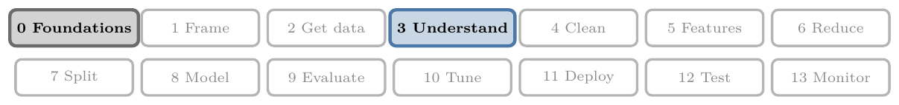
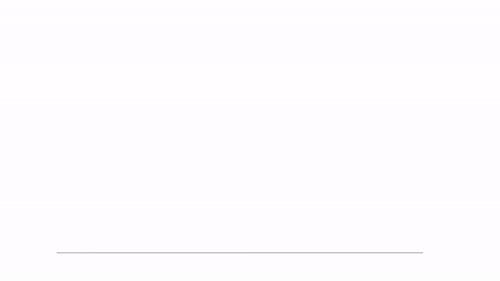
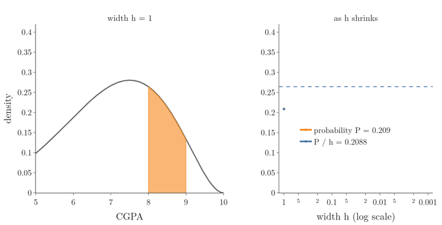
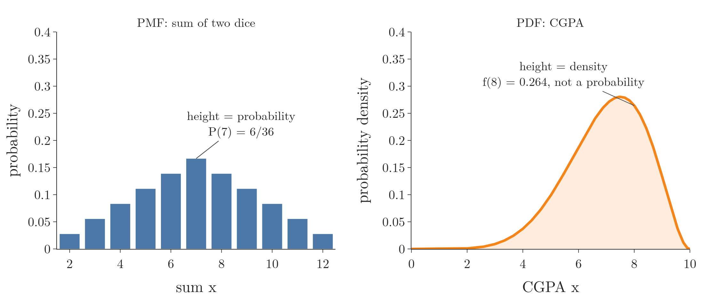
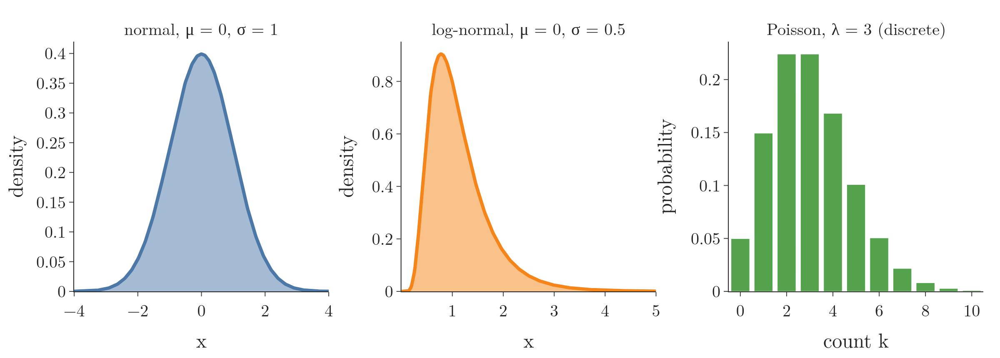
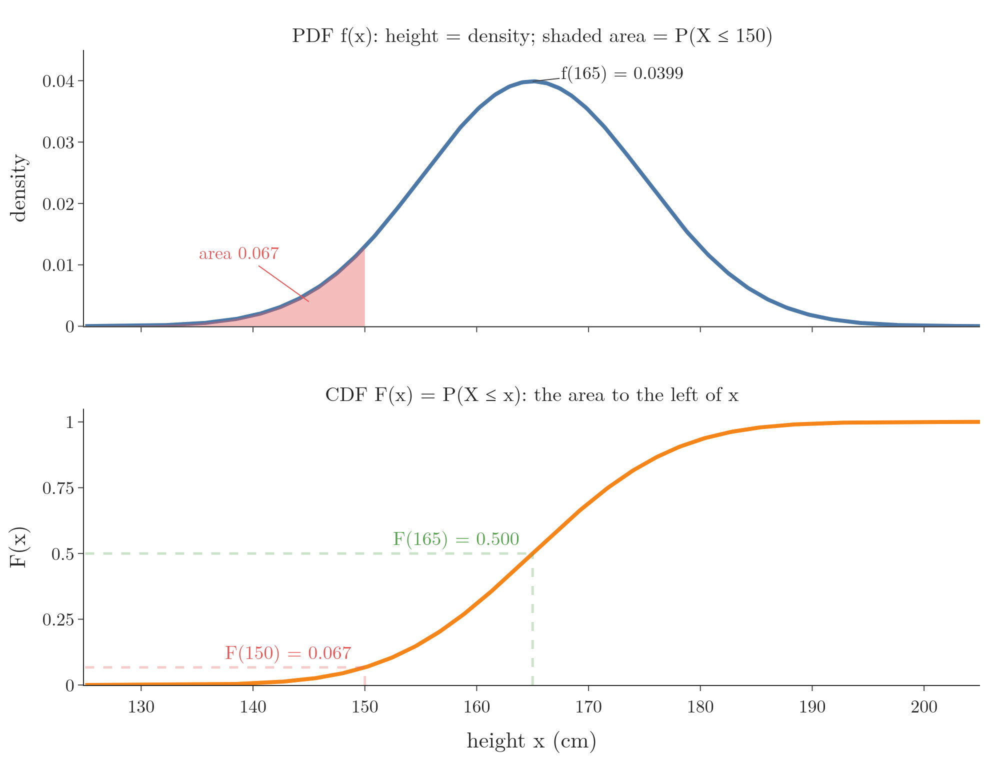
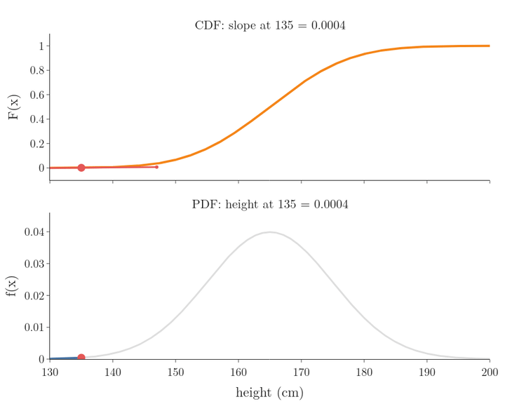

<!-- where-this-fits: generated by course_map/build_map.py; edit concepts.yaml, not this block -->
> **Where this fits:** Pipeline map steps 0 (Foundations), 3 (Understand data). See the [Course map](../../../00-course-map/00-course-map.md).
>
> 
>
> - **Builds on:** [Probability distributions](../../../MA/03-distributions/MA-020-random-variables-and-distributions/MA-020-random-variables-and-distributions.md#3-probability-distributions-as-tables); [Probability mass function (PMF)](../../../MA/03-distributions/MA-021-pmf-and-discrete-cdf/MA-021-pmf-and-discrete-cdf.md#3-the-probability-mass-function); [Expected value and variance of a random variable](../../../MA/02-probability/MA-012-expected-value-and-variance/MA-012-expected-value-and-variance.md#3-expected-value).
> - **Leads to:** [Function transformer](../../../ML/03-feature-engineering/ML-029-function-transformer/ML-029-function-transformer.md#7-function-transformer-on-the-titanic-data); [Naive Bayes](../../../ML/07-classification/ML-081-naive-bayes-intuition/ML-081-naive-bayes-intuition.md#1-overview); [Density estimation](../../../MA/03-distributions/MA-023-density-estimation-kde/MA-023-density-estimation-kde.md#2-what-density-estimation-is); [Normal distribution](../../../MA/03-distributions/MA-024-normal-distribution/MA-024-normal-distribution.md#2-what-the-normal-distribution-is); [Standard normal and the z-table](../../../MA/03-distributions/MA-025-standard-normal-and-z-table/MA-025-standard-normal-and-z-table.md#2-the-standard-normal-distribution); [P-values](../../../MA/04-inference/MA-041-p-values/MA-041-p-values.md#33-the-p-value-for-53-heads).
> - **Compare with:** [Frequency tables](../../../MA/01-descriptive-stats/MA-007-frequency-tables-and-graphs/MA-007-frequency-tables-and-graphs.md#2-frequency-tables-for-a-categorical-feature); [Bernoulli and binomial distributions](../../../MA/03-distributions/MA-021-pmf-and-discrete-cdf/MA-021-pmf-and-discrete-cdf.md#71-bernoulli-distribution); [Pareto distribution and power laws](../../../MA/03-distributions/MA-030-pareto-and-power-law/MA-030-pareto-and-power-law.md#2-power-laws); [Likelihood](../../../MA/08-likelihood/MA-069-probability-vs-likelihood/MA-069-probability-vs-likelihood.md#22-likelihood-from-the-event-back-to-the-parameter).
<!-- /where-this-fits -->

## 1. Overview

> **Key point:** For a continuous random variable the probability of any single exact value is 0, so the height of the PDF (probability density function) is a density, and probabilities are areas under it; the CDF (cumulative distribution function) is the area to the left of $x$.

{height=45%}

Figure 1 shows where the PDF comes from. We take 100,000 CGPAs and draw a density histogram, in which each bar's **area** is the share of students in its bin. As the bins get narrower, the bars hug a smooth curve: the probability density function.

We met this curve in [the density plot](../../../ML/02-getting-data/ML-019-univariate-analysis/ML-019-univariate-analysis.md#7-density-plot) as the KDE (kernel density estimate, a smooth curve fitted to the data) drawn over a histogram, where we noted that its height is a density, not a probability. This Note goes step by step:

- why the probability of one exact value is 0 (section 2);
- why probabilities are areas under the curve (section 3);
- why the height is a density, and what a PDF is (sections 4 and 5);
- the CDF of a continuous variable, and its link to the PDF (sections 7 and 8).

How the curve is estimated from data is the topic of [density estimation](../MA-023-density-estimation-kde/MA-023-density-estimation-kde.md#2-what-density-estimation-is).

## 2. The probability of one exact value is 0

> **Key point:** A continuous variable has infinitely many possible values, so the probability of any one exact value is 0; probabilities only exist for ranges.

The curve in Figure 1 describes the CGPAs of students, a **continuous random variable** (G-466): it can take any value from 0 to 10, with every decimal in between (see [discrete and continuous random variables](../MA-020-random-variables-and-distributions/MA-020-random-variables-and-distributions.md#23-discrete-and-continuous-random-variables)). The curve peaks at a CGPA of 7.5, where its height is 0.280. Is 0.280 the probability that a student's CGPA is exactly 7.5? It is tempting to read it that way, as we read a bar chart of a PMF (probability mass function: the bar chart of a discrete variable, whose bar heights are probabilities; see [the probability mass function](../MA-021-pmf-and-discrete-cdf/MA-021-pmf-and-discrete-cdf.md#3-the-probability-mass-function)). The answer is no.

Pick one student and ask the probability that their CGPA is exactly 7.912. Not 7.9121, not 7.91199: exactly 7.912, to the last of infinitely many decimals. Between 0 and 10 there are infinitely many possible values. Spreading a total probability of 1 over infinitely many values leaves 0 for each one:

$$P(X = 7.912) = 0$$

The same shows up in real data. Among 100 students, perhaps one has a CGPA of 7.912 to three decimals. Ask for 7.912959 and almost certainly nobody has it; the finer we ask, the closer the share gets to 0.

Shrinking a range shows it with numbers. For the CGPA curve, the probability of a CGPA between 8 and $8 + h$ falls to 0 as the width $h$ shrinks:

| Width $h$ | $P(8 \le X \le 8 + h)$ | $P(8 \le X \le 8 + h)\thinspace/\thinspace h$ |
|---|---|---|
| 1 | 0.2088 | 0.2088 |
| 0.1 | 0.0261 | 0.2607 |
| 0.01 | 0.00264 | 0.2639 |
| 0.001 | 0.000264 | 0.2642 |

So a graph of "probability at each $x$" would be flat at 0 everywhere and tell us nothing. The last column, however, settles on a number: 0.264. The settled value, 0.264, is the density at 8 (section 5). Figure 2 animates the table: as the strip at 8 narrows, watch the orange probability sink to 0 while the blue ratio flattens onto the dashed line at 0.264.



## 3. Area under the curve is probability

> **Key point:** The total area under a PDF is 1; the area between two values $a$ and $b$ is the probability that the variable falls between them.

A single value has probability 0, so we ask about a range instead. "A CGPA of about 8" becomes "a CGPA between 7.9 and 8.1". A range has a width, so the curve above it encloses an area, and that area is the probability: 0.0528 for 7.9 to 8.1 (computed in the Python box of this section). A single value is a line with no width, so its area, and its probability, is 0.

The whole area under the CGPA curve stands for the probability that a student's CGPA is somewhere between 0 and 10. A CGPA somewhere in that range is certain, so the **total area under every PDF is 1**, just as the bars of a PMF add up to 1.

A wider slice gives a larger probability. The area between 8 and 9 is the probability of a CGPA between 8 and 9 (Figure 3, left). Since the curve is not a rectangle, the area is found by **integration** (G-957), which adds up the area of infinitely many infinitely thin strips under the curve.

1. **In words:** the probability that $X$ falls between $a$ and $b$ is the area under the PDF from $a$ to $b$.
2. **Example:** for the CGPA curve, the area from 8 to 9 is 0.209 (the Python box below finds it by adding up thin strips: `integrate.quad`). About 21% of students have a CGPA between 8 and 9.
3. **Formula:**
   $$P(a \le X \le b) = \int_a^b f(x)\thinspace dx$$
   The symbol $\int_a^b$ reads "the area from $a$ to $b$ under", and $dx$ marks $x$ as the variable along the horizontal axis. For the CGPA curve:
   $$P(8 \le X \le 9) = \int_8^9 f(x)\thinspace dx$$
   $$= 0.209$$


Because a single point has zero width, it has zero area. So for a continuous variable it makes no difference whether the ends are included:

$$P(8 \le X \le 9) = P(8 < X < 9)$$

> **Python:** The area from a known PDF, two ways.
>
> ```python
> from scipy import stats, integrate
>
> # CGPA curve used in this Note: 10 x Beta(7, 3)
> cgpa = stats.beta(7, 3, scale=10)
> # area by numerical integration
> integrate.quad(cgpa.pdf, 8, 9)[0]   # 0.2088
> # the same area from the CDF (section 7)
> cgpa.cdf(9) - cgpa.cdf(8)           # 0.2088
> cgpa.cdf(8.1) - cgpa.cdf(7.9)       # 0.0528
> cgpa.pdf(7.5)                       # 0.280, the peak height
> ```
>
> The curve is a scaled beta distribution, chosen because it lives exactly on 0 to 10; any smooth curve with area 1 would do.

## 4. Bars whose area is probability: the PDF

> **Key point:** If each bar's area, not its height, is the probability of its bin, the heights stay put as the bins narrow and trace a curve; that height is a probability density, and the curve is the PDF.

Where does the curve come from, and what is its height? Start from data: the 100,000 CGPAs, cut into bins. There are two ways to draw a bar for each bin, and Figure 4 draws both side by side as the bins get narrower.


1. **Height = probability (right panel).** Each bar's height is the share of students in its bin. Halve the bin width and each bin holds about half as many students, so every bar roughly halves: the tallest bar falls from 0.507 at width 2 to 0.015 at width 0.05. In the limit, all bars sink to a flat line at 0, the "probability at each $x$" of section 2, which tells us nothing about the shape.
2. **Area = probability (left panel).** Each bar's height is the share divided by the bin width, so its **area**, height times width, is the share. Halve the width and the share roughly halves too, so the height stays about the same: the tallest bar stays between 0.25 and 0.29 at every width. The bars keep the shape and settle onto a smooth curve. At every width, the total area of the bars is 1.

The height on the left is "probability divided by width": a probability **per unit** of CGPA. It is called a **probability density** (G-1569). The curve the bars settle onto is the **probability density function (PDF)** (G-1568): the probability distribution function of a continuous random variable. Its graph is an unbroken curve, and the probability of any range is the area under it, as in section 3.

The x axis works as for a PMF: it holds the values of the variable. The difference is the y axis:

| | PMF | PDF |
|---|---|---|
| Random variable | discrete | continuous |
| y axis | probability | probability density |
| Probability of a range | sum of the bar heights | area under the curve |

The second row is the one to remember. On a PMF we read probabilities straight off the graph. On a PDF the height is a density. Figure 5 puts the two side by side: bars we can read as probabilities, and a curve whose height we cannot. The [density plot](../../../ML/02-getting-data/ML-019-univariate-analysis/ML-019-univariate-analysis.md#7-density-plot) already met this: its curve's height is a density, and probability is the area under it.



## 5. What the density at a point means

> **Key point:** The density at $x$ is the probability per unit of $x$ near $x$: over a narrow width $h$, the probability is about $f(x) \times h$.

The density $f(x)$ is what probability turns into when we divide by the width of a narrow range (the last column of the table in section 2). Turned around, a thin strip under the curve is almost a rectangle of height $f(x)$ and width $h$ (Figure 3, right).

1. **In words:** the probability of landing in a narrow range is about the density times the width of the range.
2. **Formula:**
   for a small width $h$:
   $$P(x \le X \le x + h) \approx f(x) \times h$$
3. **Example:** the density at 8 is $f(8) = 0.264$. For the range 8 to 8.01:
   $$P(8 \le X \le 8.01) \approx 0.264 \times 0.01$$
   $$= 0.00264$$
   The exact area is 0.002639; the smaller $h$, the better the match.

So for practical purposes a higher curve still means "more likely around here", and we can compare densities at two points the way we compare probabilities. Strictly, though, the height is never a probability itself.

The density histogram of Figure 1 rests on the same idea. A density bar has height "share of the data in the bin divided by the bin width", so its area is the share. As the bins narrow, those heights become $f(x)$.

> **Extra:** Because a density is probability **per unit**, it can be larger than 1 (see [the normal densities in Gaussian Naive Bayes](../../../ML/07-classification/ML-084-gaussian-naive-bayes/ML-084-gaussian-naive-bayes.md#3-the-assumption-normal-distributions)). A uniform distribution on 0 to 0.5 has height 2 everywhere: width 0.5 times height 2 gives the required area of 1. A probability can never exceed 1; a density can.

## 6. Famous PDFs

> **Key point:** The normal and log-normal distributions are famous continuous distributions with known PDF formulas; Poisson, often listed with them, is discrete.

The famous continuous distributions of [the list of famous distributions](../MA-020-random-variables-and-distributions/MA-020-random-variables-and-distributions.md#6-famous-distributions) (Figure 6) each have a PDF formula:

- **Normal distribution** (G-1343): parameters $\mu$ (mean, location) and $\sigma$ (standard deviation, scale). Much natural data follows it. Its PDF, worked through in [Gaussian Naive Bayes](../../../ML/07-classification/ML-084-gaussian-naive-bayes/ML-084-gaussian-naive-bayes.md#4-the-numbers), is
  $$f(x) = \frac{1}{\sigma\sqrt{2\pi}}\thinspace e^{-\frac{1}{2}\left(\frac{x-\mu}{\sigma}\right)^2}$$
  where $\pi \approx 3.14$ and $e \approx 2.718$. For $\mu = 0$ and $\sigma = 1$ at $x = 0$, the exponent is 0 and $e^0 = 1$:
  $$f(0) = \frac{1}{\sqrt{2\pi}}$$
  $$= 0.399$$
  This is the peak of the normal curve in Figure 6, left.
- **Log-normal distribution** (G-1115): takes only positive values, with a hump near the left and a long right tail (Figure 6, middle). A variable $X$ is log-normal when its logarithm is normal: take a normal $Z$ and set $X = e^Z$. For example, $Z = 0$ gives $X = 1$ and $Z = -1$ gives $X = 0.37$; any $Z$ gives a positive $X$. Its parameters are also $\mu$ and $\sigma$, those of the normal $Z = \log X$ (SciPy `lognorm` docs).

The **Poisson distribution** (G-1509), with parameter $\lambda$, is often listed beside them, but it counts events (0, 1, 2, ...), so it is discrete and has a PMF, not a PDF. SciPy, for example, gives `poisson` a `pmf` and no `pdf`. Each of these distributions gets its own Note later. Figure 6 shows one member of each family, with parameters picked only for illustration: two smooth curves, and one set of bars.



## 7. The CDF of a continuous variable

> **Key point:** The CDF $F(x) = P(X \le x)$ is the area under the PDF to the left of $x$; it rises smoothly from 0 to 1.

The **cumulative distribution function** (CDF, G-515) has the same definition as for a discrete variable (see [the CDF of a discrete variable](../MA-021-pmf-and-discrete-cdf/MA-021-pmf-and-discrete-cdf.md#8-the-cumulative-distribution-function-of-a-discrete-variable)): the probability of a value at most $x$. For a continuous variable, "at most $x$" is the area under the PDF from the far left up to $x$.

1. **In words:** the CDF at $x$ is the whole area under the PDF to the left of $x$.
2. **Formula:**
   $$F(x) = P(X \le x) = \int_{-\infty}^{x} f(t)\thinspace dt$$
   The letter $t$ runs along the axis up to $x$; $-\infty$ means "from the far left".
3. **Example:** adult heights in a group follow a normal distribution with mean 165 cm and standard deviation 10 cm. Half the area lies left of the mean, so $F(165) = 0.5$: half the people are 165 cm or shorter. The area left of 150 is $F(150) = 0.067$: about 7% are 150 cm or shorter.

Figure 7 puts the two functions one above the other. The same point means different things on each:

- **On the PDF at 165:** the height $f(165) = 0.0399$ is a density. Roughly, heights near 165 cm are the most common ones.
- **On the CDF at 165:** the height $F(165) = 0.5$ is a probability: the chance of 165 cm **or less**.

{height=55%}

The CDF of a continuous variable has no steps: it rises smoothly, steepest where the PDF is highest.

> **Python:** PDF and CDF values.
>
> ```python
> height = stats.norm(165, 10)
> height.pdf(165)    # 0.0399, a density
> height.cdf(165)    # 0.5, a probability
> height.cdf(150)    # 0.067
> ```

> **Extra:** The CDF turns any range into a subtraction:
>
> $$P(a < X \le b) = F(b) - F(a)$$
>
> Heights between 155 and 175 cm, one standard deviation either side of the mean:
>
> $$P(155 < X \le 175) = F(175) - F(155)$$
>
> $$P(155 < X \le 175) = 0.841 - 0.159$$
>
> $$P(155 < X \le 175) = 0.683$$
>
> The result, 0.683, is the 68% of the 68-95-99.7 rule (see [the 68-95-99.7 rule](../../../ML/04-missing-data-and-outliers/ML-041-outliers-zscore/ML-041-outliers-zscore.md#3-the-68-95-997-rule)).

## 8. How the PDF and CDF are linked

> **Key point:** The area under the PDF gives the CDF, and the slope (G-1823) of the CDF gives the PDF; in calculus terms, integration goes one way and differentiation (G-608) the other.

The two curves of Figure 7 carry the same information:

- **PDF to CDF:** the CDF at $x$ is the area under the PDF up to $x$ (section 7). Collecting area is integration.
- **CDF to PDF:** where the CDF climbs steeply, much probability is packed into a short range, so the density is high. The slope of the CDF at $x$ is the PDF at $x$. Taking a slope is differentiation.

1. **In words:** the steepness of the CDF at a point equals the height of the PDF there.
2. **Formula:**
   $$f(x) = \frac{dF(x)}{dx}$$
   $$\frac{dF(x)}{dx} \approx \frac{F(x + 0.5) - F(x - 0.5)}{1}$$
   The term $dF(x)/dx$ is the **derivative** (G-595), the exact slope of the CDF at $x$. The last fraction measures the rise of the CDF over a step of 1 around $x$.
3. **Example:** for the heights at 165,
   $$\frac{F(165.5) - F(164.5)}{1} = 0.0399 = f(165)$$
   At 150 the same rise is 0.0130, and $f(150) = 0.0130$: the CDF is flatter there, and the PDF lower.

Figure 8 slides a tangent line along the heights CDF. Watch its slope, printed in the top title: it equals the PDF's height in the bottom panel at every point, largest at 165 and small in both tails.

{height=45%}

Calculus is not needed to use these ideas: libraries compute both functions. The link returns later: the [z-table](../MA-025-standard-normal-and-z-table/MA-025-standard-normal-and-z-table.md#4-the-z-table) is a table of areas under the normal PDF, that is, of its CDF.

## 9. Summary

| Idea | Formula | Example | Why it matters |
|---|---|---|---|
| Probability of one exact value | $P(X = x) = 0$ | $P(X = 7.912) = 0$ | infinitely many values share a total of 1, so we ask about ranges |
| Probability of a range | $\int_a^b f(x)\thinspace dx$ | $P(8 \le X \le 9) = 0.209$ | a range has a width, so the curve above it encloses an area |
| Total area | $\int f(x)\thinspace dx = 1$ | whole CGPA curve | some value in the range is certain |
| Density as probability per unit | $P(x \le X \le x + h) \approx f(x)\thinspace h$ | $0.264 \times 0.01 = 0.00264$ | a higher curve still means "more likely around here" |
| CDF | $F(x) = \int_{-\infty}^x f(t)\thinspace dt$ | $F(150) = 0.067$ | turns any range into a subtraction of two values |
| PDF from CDF | $f(x) = dF/dx$ | slope at 165 = 0.0399 | a steep CDF packs much probability into a short range |

- PMF: discrete, height is probability. PDF: continuous, height is density, area is probability, so never read a PDF's height as a probability.
- A density can exceed 1; a probability cannot, because a density is probability per unit of $x$ (a uniform distribution on 0 to 0.5 has height 2).
- Poisson is discrete (PMF), because it counts events (0, 1, 2, ...); normal and log-normal are continuous (PDF).
- The CDF of a continuous variable rises smoothly from 0 to 1, with no steps, because a single point adds no area; it is steepest where the PDF is highest.

## 10. Sources

**Built from**

- CampusX, "Session 40 - Probability Distribution Functions - PDF, PMF & CDF | DSMP 2023", YouTube, https://www.youtube.com/watch?v=C_QAURbgBqY
- Khan Academy, "Probability density functions", YouTube, https://www.youtube.com/watch?v=Fvi9A_tEmXQ
- 3Blue1Brown, "Why 'probability of 0' does not mean 'impossible' | Probabilities of probabilities, part 2", YouTube, https://www.youtube.com/watch?v=ZA4JkHKZM50

**Other references**

- SciPy documentation, `scipy.stats.lognorm` and `scipy.stats.poisson`.

## 11. Key terms

| Term | Meaning |
|---|---|
| Continuous random variable | A random variable that can take any value in a range, with every decimal, such as a CGPA |
| Probability density function (PDF) | The curve of a continuous random variable whose area over a range is the probability of that range; total area 1 |
| Probability density | Probability per unit of $x$: the height of a PDF, whose area over a range is a probability |
| Integration | Finding the area under a curve by adding up infinitely many thin strips |
| $\int_a^b f(x)\thinspace dx$ (G-13) | The area under $f$ from $a$ to $b$; for a PDF, $P(a \le X \le b)$ |
| Log-normal distribution | A distribution with a long tail to the right (right-skewed, continuous) whose values follow a normal distribution once you take their logarithm. |
| CDF of a continuous variable | $F(x) = P(X \le x)$, the area under the PDF to the left of $x$; rises smoothly from 0 to 1 |
| Slope | How steeply a curve rises at a point: rise divided by run |
| Derivative | The exact slope of a curve at each point, written $dF/dx$ |
| Differentiation | Finding the slope of a curve at each point; the derivative of the CDF is the PDF |
