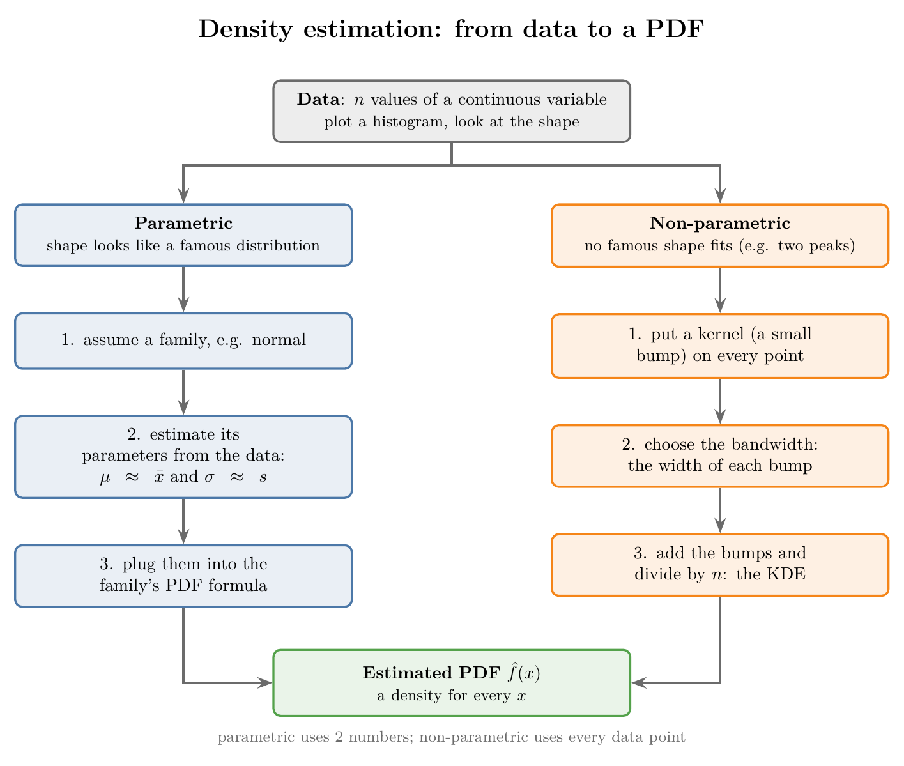
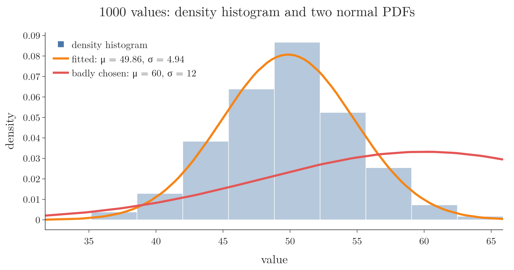
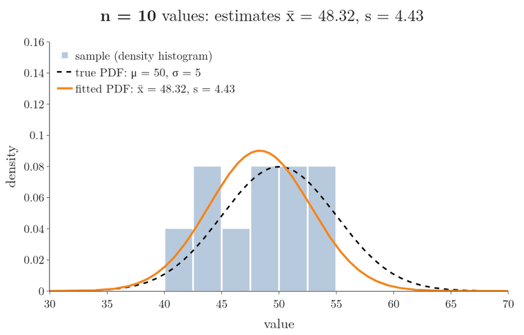
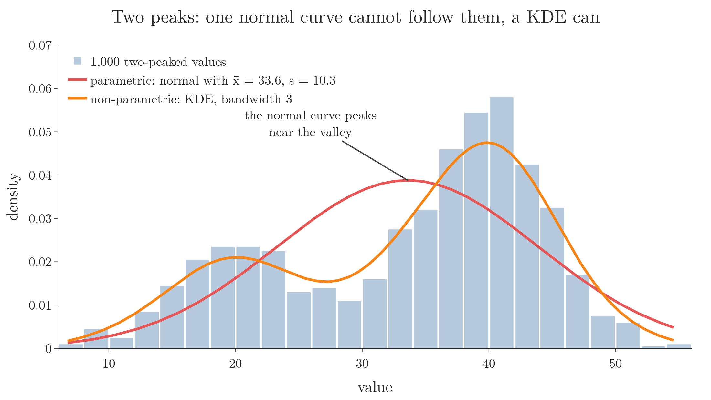
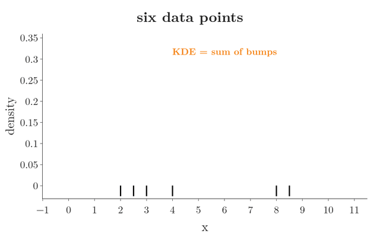
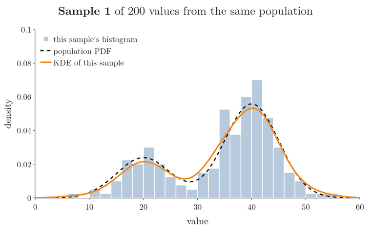

<!-- where-this-fits: generated by course_map/build_map.py; edit concepts.yaml, not this block -->
> **Where this fits:** Pipeline map step 3 (Understand data). See the [Course map](../../../00-course-map/00-course-map.md).
>
> 
>
> - **Builds on:** [Population, sample, parameter and statistic](../../../MA/01-descriptive-stats/MA-004-what-is-statistics/MA-004-what-is-statistics.md#4-population-and-sample); [Probability density function (PDF)](../../../MA/03-distributions/MA-022-pdf-and-continuous-cdf/MA-022-pdf-and-continuous-cdf.md#4-bars-whose-area-is-probability-the-pdf).
> - **Leads to:** [Feature selection](../../../ML/03-feature-engineering/ML-022-what-is-feature-engineering/ML-022-what-is-feature-engineering.md#8-feature-selection); [Kernel density estimation (KDE)](../../../MA/03-distributions/MA-027-pdf-and-cdf-in-practice/MA-027-pdf-and-cdf-in-practice.md#1-overview).
> - **Compare with:** [Gaussian mixture model (GMM)](../../../MA/08-likelihood/MA-073-gaussian-mixture-models/MA-073-gaussian-mixture-models.md#6-the-mixture-density).
<!-- /where-this-fits -->

## 1. Overview

> **Key point:** Density estimation builds a PDF from data: either assume a famous distribution and estimate its parameters, or build the curve from every data point with a kernel density estimate.

{height=55%}

A **PDF** (probability density function) is the curve whose area under it gives probabilities. For a discrete variable (one with countable values, such as a die roll), the PMF (probability mass function, a probability for each value) comes straight from counting ([the probability mass function](../MA-021-pmf-and-discrete-cdf/MA-021-pmf-and-discrete-cdf.md#3-the-probability-mass-function)). For a continuous variable (any value in a range, such as a height), the vertical axis of the PDF is a density, not a probability ([the density at a point](../MA-022-pdf-and-continuous-cdf/MA-022-pdf-and-continuous-cdf.md#5-what-the-density-at-a-point-means)), and densities cannot be counted. They have to be estimated.

Figure 1 is a flow chart: start at the top box and follow an arrow down one of two columns. The left column (parametric) assumes the data follows a famous distribution; the right column (non-parametric) makes no assumption. Both end at the green box, the estimated PDF. This Note follows both, with code.

## 2. What density estimation is

> **Key point:** Density estimation is the family of techniques that estimate the PDF of a random variable from a set of observations.

**Density estimation** (G-586) is a statistical technique for estimating the probability density function of a random variable from a set of observations (data). An **observation** (G-1374) is one record, one row of the data table; a **feature** (G-772) is one variable, one column of that table. In simpler terms, it estimates the **underlying distribution** (G-2037): the distribution that produced the data points.

Density estimation is used in:

- **Data analysis and visualisation:** plotting the PDF shows the shape of the data.
- **Hypothesis testing:** some tests compare data against a distribution, such as the Kolmogorov-Smirnov test, which measures how far the data's cumulative curve is from the distribution's (SciPy `kstest` docs).
- **Machine learning:** to estimate the distribution of the input data, or how likely certain events or outcomes are. Gaussian Naive Bayes, for example, estimates one normal density per class and feature (see [the assumption of normal distributions](../../../ML/07-classification/ML-084-gaussian-naive-bayes/ML-084-gaussian-naive-bayes.md#3-the-assumption-normal-distributions)).

The methods come in two families, the two routes of Figure 1:

- **Parametric methods** assume the data follows a specific distribution, such as the normal distribution, and estimate its parameters.
- **Non-parametric methods** make no such assumption and estimate the density directly from the data.

Common techniques include kernel density estimation (Section 5), histogram-based estimation, and the Gaussian mixture model. The choice depends on the data and on what the estimate is for.

> **Extra:** A **Gaussian mixture model** (G-829) assumes the density is a weighted sum of a few normal curves (say two, for data with two peaks) and estimates each curve's mean, standard deviation and weight. A mixture model has a fixed set of parameters, like a parametric method, yet it can describe data with several peaks, which one normal curve cannot. Gaussian mixture models are also closely related to k-means clustering (a method that groups points around centres; MML §11.1, §11.5).

## 3. Parametric density estimation

> **Key point:** Look at the histogram, pick the famous distribution it resembles, estimate that distribution's parameters from the sample, and plug them into its PDF formula.

**Parametric density estimation** (G-1451) estimates the PDF by assuming that the data comes from a specific parametric family of distributions (normal, exponential, and so on). Once the family is chosen, only its parameters are unknown, and the data is used to estimate them.

### 3.1 The steps

> **Key point:** Histogram, then assumption, then parameters, then the PDF formula evaluated at many points.

Take the CGPAs of 1,000 students, or any 1,000 measurements of a continuous variable. To build their PDF:

1. **Look at the shape.** Plot a histogram. If it looks like a bell curve, assume the data is normal.
2. **Estimate the parameters.** The normal distribution has two, $\mu$ and $\sigma$. We estimate them with the sample mean $\bar{x}$ and the sample standard deviation $s$ (statistics standing in for parameters, see [parameters and statistics](../../01-descriptive-stats/MA-004-what-is-statistics/MA-004-what-is-statistics.md#42-parameters-and-statistics)).
3. **Plug them into the PDF formula.** With $\mu$ and $\sigma$ fixed, the normal PDF has only $x$ left unknown. Feeding it any $x$ returns a density.
4. **Draw the curve.** Evaluate the PDF at many points, say 100 evenly spaced values from the smallest to the largest data value, and join them.

### 3.2 An example

> **Key point:** 1,000 values from a normal distribution with mean 50 and standard deviation 5 give estimates of 49.86 and 4.94; the fitted curve follows the histogram.

We generate 1,000 values from a normal distribution with $\mu = 50$ and $\sigma = 5$, then pretend we do not know where they came from. The values run from 31.76 to 65.89, and the histogram looks like a bell, so we assume a normal distribution.

1. **In words:** estimate $\mu$ and $\sigma$ by the sample's mean and standard deviation, then compute the normal PDF with those values.
2. **Formula:** the hat in $\hat{f}$ means "estimated from the data", and $e^{(\cdot)}$ is the exponential function ($e = 2.718$ raised to a power):
   $$\hat{f}(x) = \frac{1}{s\sqrt{2\pi}}\thinspace e^{-\frac{1}{2}\left(\frac{x - \bar{x}}{s}\right)^2}$$
3. **Example:** the sample gives $\bar{x} = 49.86$ and $s = 4.94$, close to the true 50 and 5 but not equal, because a sample is not the population. At $x = 50$:
   $$\frac{1}{4.94\sqrt{2\pi}} = \frac{1}{4.94 \times 2.507}$$
   $$\frac{1}{4.94 \times 2.507} = \frac{1}{12.38} = 0.0808$$
   $$\frac{50 - 49.86}{4.94} = 0.0283$$
   $$0.0283^2 = 0.0008$$
   $$e^{-\frac{1}{2} \times 0.0008} = e^{-0.0004} = 0.9996$$
   $$\hat{f}(50) = 0.0808 \times 0.9996 = 0.0807$$
   The true density at 50 is 0.0798.

Figure 2 shows the fitted curve (orange) over the histogram. The fitted curve follows the bars closely.



The histogram must be drawn on the **density** scale (bar area = share of the data, as in [bars whose area is probability](../MA-022-pdf-and-continuous-cdf/MA-022-pdf-and-continuous-cdf.md#4-bars-whose-area-is-probability-the-pdf)). A histogram of counts would have much taller bars than the curve, and the two could not be compared. A count bar is taller than a density bar by the factor (number of values × bin width); in Figure 2 the bins are about 3.4 wide:

$$\text{count} = \text{density} \times 1{,}000 \times 3.4$$
$$1{,}000 \times 3.4 = 3{,}400 \text{ times taller}$$

> **Python:** Fitting a normal distribution.
>
> ```python
> import numpy as np
> from scipy import stats
>
> rng = np.random.default_rng(42)
> sample = rng.normal(loc=50, scale=5, size=1000)
> # estimate the two parameters
> mu, sigma = sample.mean(), sample.std()
> dist = stats.norm(mu, sigma)
> # 100 points from min to max, one density each
> values = np.linspace(sample.min(), sample.max(), 100)
> densities = dist.pdf(values)
> ```
>
> `dist.pdf` takes a whole array at once, so no loop is needed. To compare with the histogram in Plotly, use `histnorm="probability density"`; in seaborn, `stat="density"`. The Notebook (`MA-023-density-estimation-kde.ipynb`) draws both.

### 3.3 Why it is called parametric

> **Key point:** The whole curve depends on two estimated numbers; bad estimates give a bad curve, and more data gives better estimates.

The curve depends only on the two parameters. Change them and the curve changes completely. Figure 2's red curve uses $\mu = 60$ and $\sigma = 12$, far from the data: its peak is in the wrong place and it is much too flat. At $x = 50$ it gives 0.0235 instead of about 0.08.

So the whole game is estimating the parameters well. The more data we have, the closer the sample's mean and standard deviation get to the population's, and the better the PDF. With little data, the estimates, and so the curve, can be poor.

Figure 3 fits the same normal curve to the first 10, 30, 100 and all 1,000 values of our sample:

- **10 values:** $\bar{x} = 48.32$, so the fitted peak sits too far left.
- **30 and 100 values:** the mean is close (50.08 and 49.75), but $s$ is about 3.8, so the fitted curve is too narrow and too tall.
- **1,000 values:** $\bar{x} = 49.86$ and $s = 4.94$; the orange curve lies almost on the dashed true curve.

The 100 values look worse than the 10 here ($s = 3.86$ against 4.43), which seems to break "more data, better estimates". That is luck of this one sample. Over 10,000 fresh samples, the average error of $s$ shrinks steadily: 0.94 with 10 values, 0.53 with 30, 0.28 with 100 and 0.09 with 1,000. A value of $s$ as low as 3.86 from 100 values happens in fewer than 1 sample in 1,000 (Notebook). "More data, better estimates" holds on average, not for every single sample.



> **Extra:** Older code draws this kind of plot with `sns.distplot`, which seaborn has deprecated (seaborn 0.13 docs). Today we use `sns.histplot(x, stat="density", kde=True)` for a histogram with a KDE, and compute a fitted normal with `scipy.stats.norm` as above.

## 4. Non-parametric density estimation

> **Key point:** When no famous distribution fits, non-parametric methods estimate the PDF from the data points themselves, with no assumption about the shape.

Parametric estimation needs the data to resemble a famous distribution. Sometimes it does not: the histogram is not normal, not uniform, not log-normal, not anything with a name. Data with two peaks is a common example. Then the assumption of step 1 fails, and the method cannot be used.

Figure 4 shows the failure on the two-peaked data of section 5.2 (300 values around 20, 700 around 40). A normal curve has one peak, so the fitted normal ($\bar{x} = 33.6$, $s = 10.3$) puts its highest point near the valley between the groups, where there is little data. The KDE of section 5 follows both peaks.



**Non-parametric density estimation** (G-1338) estimates the PDF of a random variable without assuming any underlying distribution. The method needs no predefined distribution function. Instead of summarising the data by a few parameters (a mean and a standard deviation), it uses **every data point** to build the curve.

- **Advantage:** no assumption about the shape, so it works for any data.
- **Disadvantages:** it is **computationally intensive**, since every point takes part in every density value, and it needs **more data** to give an accurate estimate. With no assumed shape to lean on, every rise and dip of the curve comes from where the points happen to fall, so with few points the gaps between them show up as false dips and peaks (the Extra of section 5.4 counts them).

The most common non-parametric method is the kernel density estimate.

## 5. Kernel density estimation (KDE)

> **Key point:** KDE places a small bump (a kernel) on every data point and adds the bumps up; the sum, divided by the number of points, is the estimated PDF.

The **kernel density estimate** (KDE, G-1005) is the smooth curve drawn over a histogram (a bar chart of how many values fall in each range) in [the density plot](../../../ML/02-getting-data/ML-019-univariate-analysis/ML-019-univariate-analysis.md#7-density-plot). **Kernel density estimation** is the technique behind it: it uses a kernel function to smooth out the data into a continuous estimate of the density.

### 5.1 How a KDE is built

> **Key point:** One Gaussian bump centred on each point, all of the same width; at every $x$, add the bumps' heights.

Take six data points: 2, 2.5, 3, 4, 8 and 8.5. Their histogram (Figure 5, left) shows two groups with nothing in between. No famous distribution has that shape, so we use a KDE.

1. **Choose a kernel.** A **kernel** (G-2273) is a small, symmetric bump with area 1. The most used one is the **Gaussian kernel** (G-828): the normal curve.
2. **Put one kernel on every point.** Each data point becomes the centre (mean) of its own normal curve (Figure 5, right, dotted).
3. **Give all kernels the same width.** The standard deviation of each bump is the **bandwidth** (G-257), $h$. The bandwidth is a setting we choose.
4. **Add up.** At every $x$, add the heights of all the bumps at that $x$. Where many points sit close together, many bumps overlap and the sum is high. Dividing by the number of points keeps the total area at 1.


In Figure 5 (right) each dotted bump is drawn already divided by the 6 points, so its peak is lower than 0.399:

$$0.399 / 6 = 0.066$$

The orange curve is then simply the sum of the six dotted bumps.

1. **In words:** the KDE at $x$ is the average, over all data points, of a normal curve centred on that point and evaluated at $x$.
2. **Formula:** for $n$ points $x_1, \dots, x_n$ and bandwidth $h$, with the standard normal curve (the normal curve with mean 0 and standard deviation 1, which takes a distance $u$ in units of $h$)
   $$\phi(u) = \frac{1}{\sqrt{2\pi}}\thinspace e^{-u^2/2}$$
   the KDE is
   $$\hat{f}(x) = \frac{1}{n h} \sum_{i=1}^{n} \phi\negthinspace\left(\frac{x - x_i}{h}\right)$$
   The sign $\sum_{i=1}^{n}$ means "add up the terms for $i = 1, \dots, n$": one bump height $\phi(\cdot)$ per data point.
3. **Example:** at $x = 3$ with $h = 1$, the six bumps have heights
   $$\phi(1) = 0.242$$
   $$\phi(0.5) = 0.352$$
   $$\phi(0) = 0.399$$
   $$\phi(-1) = 0.242$$
   $$\phi(-5) \approx 0$$
   $$\phi(-5.5) \approx 0$$
   Their sum:
   $$0.242 + 0.352 + 0.399 + 0.242 + 0 + 0 = 1.235$$
   Divide by $n h$, which is $6 \times 1$:
   $$\hat{f}(3) = \frac{1.235}{6} = 0.206$$
   The points 8 and 8.5 are too far away to contribute.

The result has two peaks, matching the two groups. No formula was assumed anywhere: the shape came from the points.

> **Extra:** Why divide by $n h$? Each bump
> $$\frac{1}{h}\thinspace\phi\negthinspace\left(\frac{x - x_i}{h}\right)$$
> is a normal PDF with standard deviation $h$, so it has area 1. Adding $n$ of them gives area $n$; dividing by $n$ brings the total back to 1, as every PDF needs.

### 5.2 The bandwidth

> **Key point:** A small bandwidth gives thin bumps and a spiky curve; a large one gives wide bumps and a smooth curve that can blur real features. The right value is found by trying.

Figure 6 first builds the KDE of the six points one bump at a time, then turns the bandwidth. Watch the orange sum: with thin bumps it becomes six separate spikes, and with wide bumps the two groups melt into one hill.

{height=55%}

The bandwidth sets how wide each bump is, and so how smooth the KDE is:

- **Small bandwidth:** thin, tall bumps. Each point shows up as its own spike, and the curve is irregular. The curve follows the noise of this particular sample.
- **Large bandwidth:** wide, low bumps that overlap a lot. The curve is smooth, but too much smoothing hides real features.

Figure 7 shows this on 1,000 values with two peaks: 300 values around 20 and 700 around 40.


- **Bandwidth 0.5:** a jagged curve with many small peaks that are only noise.
- **Bandwidth 3:** two clear peaks and a valley between them.
- **Bandwidth 5:** smooth, but the valley is filled in and the left peak turns into a shoulder. The density at 30 rises from 0.0126 (bandwidth 0.5) to 0.0224, now higher than the density at 20 (0.018).

There is no single correct bandwidth. We try a few values and keep the one that shows the shape without the noise, as with the number of bins of a histogram.

> **Extra:** The Gaussian is not the only kernel. scikit-learn also offers `"tophat"` (a flat box), `"epanechnikov"` (a downward parabola), `"exponential"`, `"linear"` (a triangle) and `"cosine"`. The choice of kernel matters much less than the bandwidth: the common kernels are all close in quality, the Gaussian reaching about 95% of the best one, Epanechnikov (Silverman 1986, Table 3.1). The Gaussian is scikit-learn's default.

### 5.3 KDE in scikit-learn

> **Key point:** `KernelDensity(bandwidth=...)` is fitted on a 2D array; `score_samples` returns the log of the density, so we apply `np.exp`.

> **Python:** KDE with scikit-learn.
>
> ```python
> from sklearn.neighbors import KernelDensity
>
> model = KernelDensity(kernel="gaussian", bandwidth=3)
> # scikit-learn wants a 2D array: one row per value
> model.fit(data.reshape(-1, 1))
> grid = np.linspace(data.min(), data.max(), 100)
> grid = grid.reshape(-1, 1)
> # score_samples gives log densities; exp undoes the log
> densities = np.exp(model.score_samples(grid))
> ```

Three details matter:

- **Two settings:** the `kernel` (default `"gaussian"`) and the `bandwidth` (default 1.0).
- **2D input:** scikit-learn models expect a table, one row per sample and one column per feature, so a single column must be reshaped with `reshape(-1, 1)`.
- **Log densities:** `score_samples` returns the **logarithm** of the density, not the density. Far from the data a density can be too small for the computer to store, while its log stays an ordinary number: for the six points, the log density at 60 is $-1328.8$, but $e^{-1328.8}$ comes back as exactly 0 (the Notebook shows it). Applying `np.exp`, which undoes a logarithm, gives the densities. For the six points, the KDE at 3 comes back as $\log(0.206) = -1.58$, and $e^{-1.58} = 0.206$.

### 5.4 KDE in seaborn

> **Key point:** seaborn's `bw_adjust` multiplies a bandwidth seaborn chooses itself; it is not the bandwidth.

seaborn draws a KDE with `sns.kdeplot(x=data)`, or `so.KDE()` in the objects interface. Its smoothness setting is `bw_adjust`, with default 1.

`bw_adjust` is a **multiplier**, not a bandwidth. seaborn first picks a bandwidth with a rule of thumb (Scott's rule, based on the standard deviation and the number of points), then multiplies it by `bw_adjust` (seaborn `kdeplot` docs). For the two-peaked data the rule gives a bandwidth of 2.58. So:

- `bw_adjust=1` means a bandwidth of 2.58, close to scikit-learn's 3.
- `bw_adjust=2` means 5.17; `bw_adjust=5` means 12.9, far smoother than scikit-learn's `bandwidth=5`.
- `bw_adjust=0.02` means 0.05: an extremely spiky curve.

The multiplier explains why the same number gives different curves in the two libraries.

> **Extra:** Scott's rule sets the bandwidth from the sample's standard deviation $s$ and size $n$:
> $$h = s \times n^{-1/5}$$
> For the two-peaked data, $s = 10.29$ and $n = 1000$:
> $$h = 10.29 \times 1000^{-1/5}$$
> $$h = 10.29 \times 0.251 = 2.58$$
> (SciPy `gaussian_kde` docs.) More data gives a smaller bandwidth: with many points, neighbouring thin bumps overlap and fill the gaps, so the curve is no longer spiky. The Notebook checks this with the bandwidth fixed at 0.5: the KDE has about 16 local peaks with 1,000 points but only 3 with 100,000 (the true density has 2).

## 6. PDF, histogram and the population

> **Key point:** A histogram shows only the sample and depends on the bins; a density estimate aims at the population's shape, but it is only as good as its assumption, its settings and its data.

Why estimate a PDF when a histogram already shows the data? A histogram describes the **sample** we happen to have, and its picture changes with the number of bins. The goal of statistics is to learn about the **population**. A density estimate tries to describe the population's distribution, from which the sample came.

Figure 8 draws four samples of 200 values from the same two-peaked population. Watch the bars: each sample's histogram has different spikes and gaps. The orange KDE changes much less from sample to sample and stays close to the dashed population PDF.



A good estimate needs the right ingredients:

- **Parametric:** a correct assumption about the family, and enough data to estimate the parameters well. The bin count of the histogram plays no part in the fitted curve.
- **KDE:** a sensible bandwidth, which plays the role the bins play in a histogram, and enough data.
- **Both:** outliers affect the estimate. In a parametric fit an outlier pulls the mean and inflates the standard deviation; in a KDE it adds a small bump of its own.

If the sample does not represent the population, for example because of **sampling bias** (G-1734; see [sampling noise and sampling bias](../../../ML/01-foundations/ML-007-challenges-in-ml/ML-007-challenges-in-ml.md#42-sampling-noise-and-sampling-bias)), no density estimate can repair that.

## 7. Summary

| | Parametric | Non-parametric (KDE) |
|---|---|---|
| Assumption | data follows a named family | none |
| Uses | a few parameters ($\bar{x}$, $s$) | every data point |
| Setting to choose | the family | kernel and bandwidth |
| Works on two-peaked data | no (with one normal) | yes |
| Cost | cheap | computationally intensive |
| Example | $\hat{f}(50) = 0.0807$ | $\hat{f}(3) = 0.206$ |

- Use the table to choose: parametric when the histogram looks like a named family, because two estimated numbers then give the whole curve cheaply; KDE when it does not, because one normal curve puts its peak in the empty valley of two-peaked data.
- Density estimation turns data into an estimated PDF $\hat{f}(x)$, because the goal is the population's shape, while a histogram shows only this sample and changes with the bins.
- Parametric: histogram, assume a family, estimate its parameters, plug them into the PDF formula, so the curve is only as good as the assumed family and the estimates (more data, better estimates).
- KDE: a kernel on every point, bandwidth = kernel width, add and divide by $n$, because dividing by $n$ keeps the total area at 1, as every PDF needs.
- Small bandwidth: spiky; large bandwidth: smooth, may hide peaks, so try a few bandwidths and keep the one that shows the shape without the noise.
- scikit-learn: `score_samples` returns log densities, so apply `np.exp`; seaborn: `bw_adjust` multiplies a default bandwidth, so the same number gives different curves in the two libraries.
- Either route answers the opening question: it builds a PDF from data, by assuming a famous distribution or by adding a bump on every point.

## 8. Sources

**Built from**

- CampusX, "Session 40 - Probability Distribution Functions - PDF, PMF & CDF | DSMP 2023", YouTube, https://www.youtube.com/watch?v=C_QAURbgBqY

**Other references**

- Deisenroth, M. P., Faisal, A. A. and Ong, C. S. (2020). *Mathematics for Machine Learning*. Cambridge University Press. Sections 11.1 and 11.5 (Gaussian mixture models).
- Silverman, B. W. (1986). *Density Estimation for Statistics and Data Analysis*. Chapman and Hall. Section 3.3.2, Table 3.1 (kernel efficiencies).
- seaborn documentation, `distplot` (deprecated in 0.13) and `kdeplot` (`bw_method`, `bw_adjust`).
- SciPy documentation, `scipy.stats.kstest` and `scipy.stats.gaussian_kde` (Scott's rule).

## 9. Key terms

Terms taught in this Note come first; linked terms are recaps, taught in the Note the link opens.

| Term | Meaning |
|---|---|
| Density estimation (G-586) | Working out, from observed data, how likely each value of a random variable is: estimating its probability density function (PDF). |
| Underlying distribution (G-2037) | The distribution that produced the data points. |
| Parametric density estimation (G-1451) | Estimating how the data is spread (its probability density) by assuming it follows a named distribution and estimating that distribution's parameters from the data. |
| Non-parametric density estimation (G-1338) | Estimating the shape of the data's distribution (its PDF) straight from the data, without first assuming a shape such as the normal curve. |
| Gaussian kernel (G-828) | In kernel density estimation, a bump shaped like the normal curve placed on every data point; adding the bumps gives a smooth estimate of the density. It is the usual default kernel. |
| Bandwidth (G-257) | How wide each kernel is in a KDE (for a Gaussian kernel, its standard deviation); it sets how smooth the estimated curve is. |
| `bw_adjust` (G-69) | seaborn's multiplier on the KDE bandwidth it picks itself (not the bandwidth): values above 1 give a smoother curve, values below 1 a bumpier one. |
| `KernelDensity` (G-107) | scikit-learn's class that estimates a smooth density curve from data, using a chosen kernel and bandwidth (kernel density estimation). `score_samples` returns the log of the density, so apply `np.exp`. |
| Scott's rule (G-1754) | A rule of thumb that picks a KDE's bandwidth from the data's standard deviation $s$ and size $n$, $s \times n^{-1/5}$, so more data gives a narrower bandwidth; seaborn and SciPy use it by default. |
| [Observation](../../../ML/01-foundations/ML-003-types-of-ml/ML-003-types-of-ml.md#21-learning-from-inputs-and-outputs) (G-1374) | One record of a dataset: one row of the data table. |
| [Feature](../../../ML/01-foundations/ML-002-ai-vs-ml-vs-dl/ML-002-ai-vs-ml-vs-dl.md#52-features-chosen-by-us-or-learned) (G-772) | One piece of information about each example that a model uses (e.g. a student's CGPA). |
| [Gaussian mixture model (GMM)](../../../MA/08-likelihood/MA-073-gaussian-mixture-models/MA-073-gaussian-mixture-models.md#32-the-standard-terms) (G-829) | A model for data made of several overlapping groups: one normal curve per group, combined as a weighted sum $\sum_k \pi_k N(x \mid \mu_k, \sigma_k^2)$. Each point is shared among the curves by probabilities instead of being given to one group. |
| [Kernel density estimate (KDE)](../../../ML/02-getting-data/ML-019-univariate-analysis/ML-019-univariate-analysis.md#7-density-plot) (G-1005) | A smooth curve that estimates a column's PDF from its values, built by adding a kernel centred on every data point; a KDE plot draws it. |
| [Kernel (KDE)](../../../ML/02-getting-data/ML-019-univariate-analysis/ML-019-univariate-analysis.md#7-density-plot) (G-2273) | A small symmetric bump with area 1, placed on each point to build a KDE curve. |
| [Sampling bias](../../../ML/01-foundations/ML-007-challenges-in-ml/ML-007-challenges-in-ml.md#42-sampling-noise-and-sampling-bias) (G-1734) | A sample that misrepresents the population because of how the data was collected, such as asking only Indian fans who should win a cricket match; a larger sample does not fix it. |
