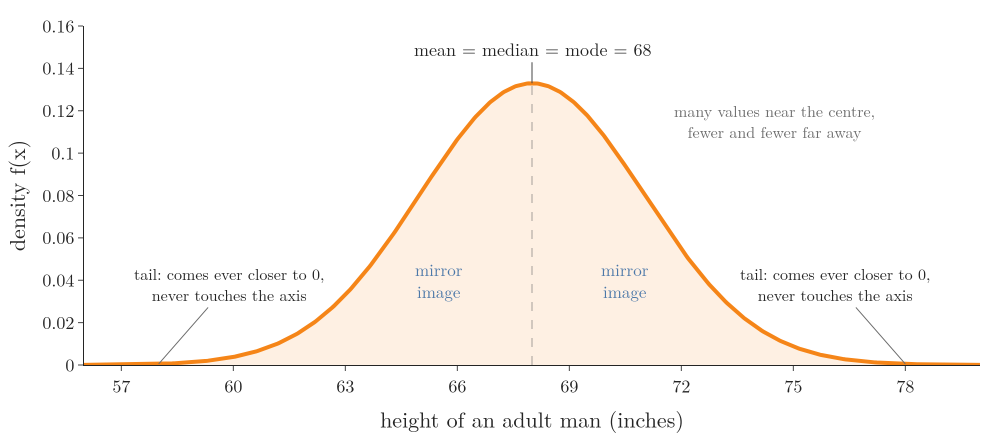
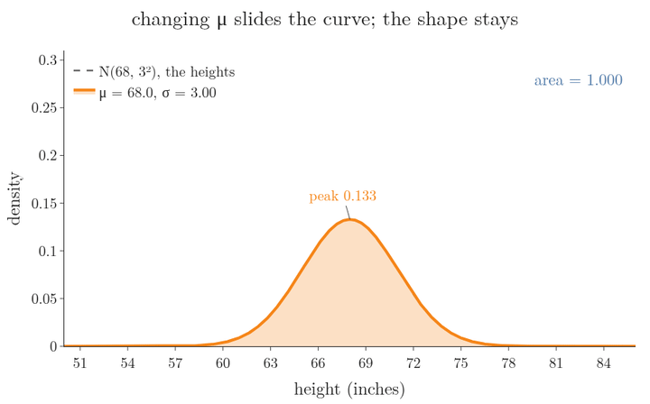
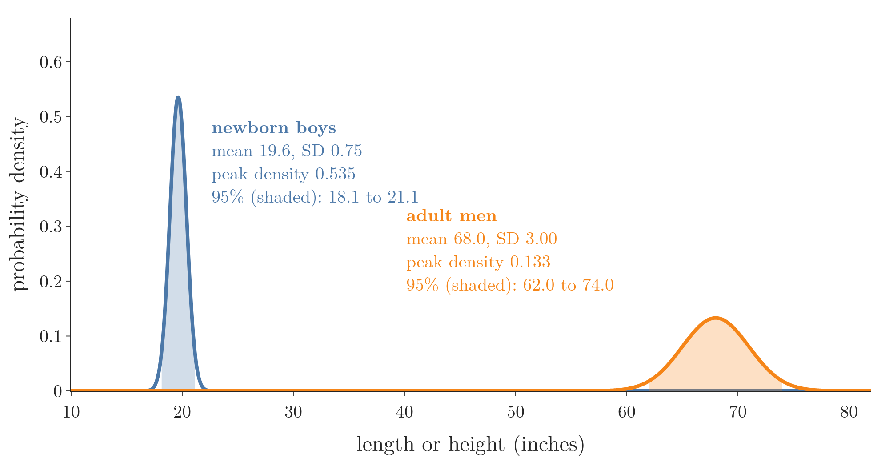
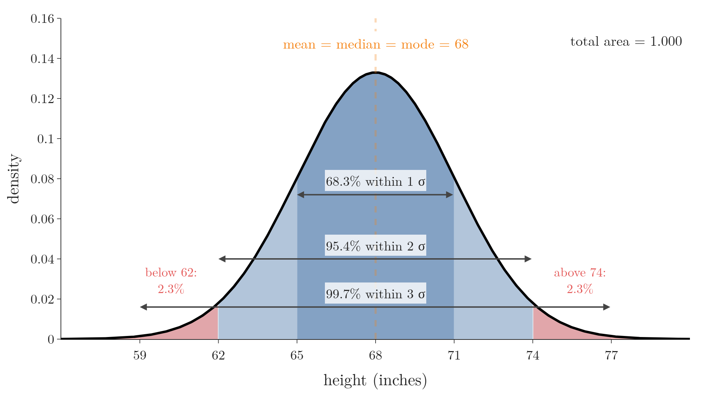
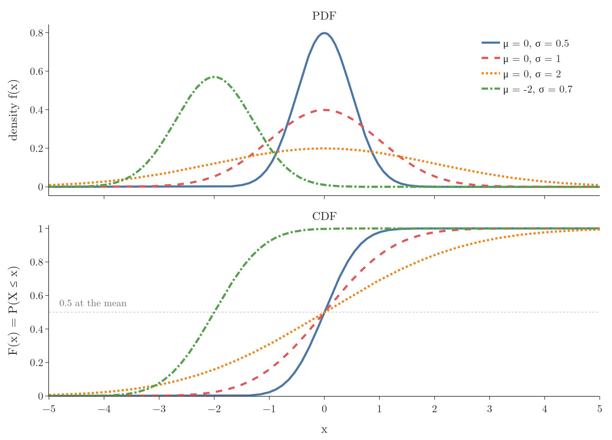

<!-- where-this-fits: generated by course_map/build_map.py; edit concepts.yaml, not this block -->
> **Where this fits:** Pipeline map step 0 (Foundations). See the [Course map](../../../00-course-map/00-course-map.md).
>
> 
>
> - **Builds on:** [Probability distributions](../../../MA/01-descriptive-stats/MA-003-statistics-roadmap/MA-003-statistics-roadmap.md#32-probability-distributions).
> - **Leads to:** [Probability density function (PDF)](../../../ML/02-getting-data/ML-019-univariate-analysis/ML-019-univariate-analysis.md#7-density-plot); [Naive Bayes](../../../ML/07-classification/ML-081-naive-bayes-intuition/ML-081-naive-bayes-intuition.md#1-overview); [Z-score outlier method](../../../MA/03-distributions/MA-025-standard-normal-and-z-table/MA-025-standard-normal-and-z-table.md#1-overview); [Standard normal and the z-table](../../../MA/03-distributions/MA-025-standard-normal-and-z-table/MA-025-standard-normal-and-z-table.md#2-the-standard-normal-distribution); [Q-Q plot](../../../MA/03-distributions/MA-028-kurtosis-and-qq-plots/MA-028-kurtosis-and-qq-plots.md#7-building-a-q-q-plot); [Central limit theorem](../../../MA/04-inference/MA-033-sampling-distribution-and-clt/MA-033-sampling-distribution-and-clt.md#4-the-central-limit-theorem).
> - **Compare with:** [Student's t-distribution](../../../MA/04-inference/MA-037-t-procedure/MA-037-t-procedure.md#5-students-t-distribution).
<!-- /where-this-fits -->

## 1. Overview

> **Key point:** The normal distribution is the symmetric, bell-shaped continuous distribution set by two parameters, the mean $\mu$ and the standard deviation $\sigma$; most values sit near the mean and fewer and fewer lie far from it.



Figure 1 shows the most famous probability distribution: the heights of adult men in a population, with mean 68 inches and standard deviation 3 inches. The normal distribution was met briefly in earlier Notes:

- its 68-95-99.7 rule, in [the 68-95-99.7 rule](../../../ML/04-missing-data-and-outliers/ML-041-outliers-zscore/ML-041-outliers-zscore.md#3-the-68-95-997-rule);
- its formula, in [the assumption of normal distributions](../../../ML/07-classification/ML-084-gaussian-naive-bayes/ML-084-gaussian-naive-bayes.md#3-the-assumption-normal-distributions);
- its parameters, in [parameters of a distribution](../MA-020-random-variables-and-distributions/MA-020-random-variables-and-distributions.md#8-parameters-of-a-distribution).

This Note studies it properly:

- what it is (section 2) and its parameters (section 3);
- why it matters (section 4);
- its formula and where the formula comes from (section 5);
- its properties (section 6);
- its CDF (section 7).

[The z-table](../MA-025-standard-normal-and-z-table/MA-025-standard-normal-and-z-table.md#4-the-z-table) then turns it into probabilities, and [skewness](../MA-026-skewness/MA-026-skewness.md#2-skewness-as-distance-from-the-normal-shape) measures how far real data departs from its symmetry.

## 2. What the normal distribution is

> **Key point:** A continuous distribution, symmetric around its mean, with a bell-shaped PDF whose tails never quite reach zero.

The **normal distribution** (G-1343), also called the **Gaussian distribution** (G-827) or the bell curve, is a continuous probability distribution that is commonly used in statistical analysis. Its PDF is symmetric around the mean and shaped like a bell. Figure 1 points out its parts:

- **The centre:** the peak sits at the mean, here 68 inches.
- **The tails:** the two ends where the curve flattens out. They come closer and closer to the x axis without ever touching it: the curve is **asymptotic** (G-221) to the axis. Any value, however extreme, has some tiny density.
- **The shape:** many values lie near the centre, some lie far below it and some far above it, fewer and fewer the further out we go.

The shape point is the whole summary of the normal distribution. The y axis is probability density (see [what the density at a point means](../MA-022-pdf-and-continuous-cdf/MA-022-pdf-and-continuous-cdf.md#5-what-the-density-at-a-point-means)): high near 68 because many men have heights around there, low at 59 or 77 because few do.

## 3. Parameters and notation

> **Key point:** Two numbers describe a normal distribution completely: the mean $\mu$ (its centre) and the standard deviation $\sigma$ (its spread); we write $X \sim N(\mu, \sigma^2)$.

A normal distribution has two parameters:

- **$\mu$, the mean:** the centre of the distribution. Changing it slides the curve left or right without changing its shape.
- **$\sigma$, the standard deviation:** the spread. A larger $\sigma$ makes the curve wider and lower; a smaller one makes it narrower and taller (the area stays 1).

Figure 2 shows both effects on the heights. Watch the peak height and the area: moving $\mu$ changes neither, while changing $\sigma$ changes the peak and keeps the area at 1. [Parameters of a distribution](../MA-020-random-variables-and-distributions/MA-020-random-variables-and-distributions.md#8-parameters-of-a-distribution) shows the same effects, and the Notebook (`MA-024-normal-distribution.ipynb`) has two sliders to try them.

{height=45%}

In books the normal distribution is written as

$$X \sim N(\mu, \sigma^2)$$

read as: $X$ follows a normal distribution with mean $\mu$ and variance $\sigma^2$ (the square of the standard deviation). The heights of Figure 1 are $X \sim N(68, 3^2)$. Some books write $N(\mu, \sigma)$ instead: the same curve, written with the standard deviation.

So once we know that a variable is normal, its mean and standard deviation are all we need to draw its exact curve and compute any probability about it.

### 3.1 A narrow curve is a tall curve

> **Key point:** The area under every normal curve is 1, so a small standard deviation makes the curve narrow **and** tall; a large one makes it wide and low.

Figure 3 compares two real groups on one axis. Newborn boys are about 19.6 inches long, with a standard deviation of only 0.75 inches (WHO Child Growth Standards). Adult men, our running example, are about 68 inches tall, with a standard deviation of 3 inches.



1. **Each curve is centred on its own mean,** 19.6 and 68.
2. **The newborn curve is narrow.** Newborn lengths vary far less: 95% of them lie within 2 standard deviations of the mean, between 18.1 and 21.1 inches. For adults the same 95% range is 62 to 74 inches.
3. **So the newborn curve is tall.** Both curves enclose an area of 1. The newborn curve spreads that area over a range 4 times narrower, so it must be about 4 times taller: its peak density is 0.535 (computed from the unrounded $\sigma = 0.745$; the rounded 0.75 gives 0.532), the adult peak 0.133. The ratio is 4, because the peak height is the factor in front of the exponent in section 5.1, which falls as $\sigma$ grows (the next two lines).

The peak height, and the ratio of the two peaks:

$$\text{peak height} = \frac{1}{\sigma\sqrt{2\pi}}$$

$$\text{newborn peak} \div \text{adult peak} = 3 \div 0.75 = 4$$

The recipe for drawing any normal curve is therefore: put the centre at the mean, and let the standard deviation set the width; the width then sets the height (idea after StatQuest, "The Normal Distribution, Clearly Explained!!!").

## 4. Why the normal distribution matters

> **Key point:** The normal shape appears again and again in nature and in man-made data, and it has been studied so thoroughly that everything about it is known.

The name says it: the shape is **normal**, meaning common. Many natural phenomena follow it, for example:

- heights of people;
- weights of objects of the same kind;
- IQ scores of a population;
- measurement errors in repeated measurements (Taylor 1997, ch. 5).

For many years, people in many fields collected data and drew its PDF, and this same bell kept appearing. There is a reason for it, the **central limit theorem** (G-364): a sum or average of many independent random effects comes out roughly normal, whatever the shape of each effect (see [the central limit theorem](../../04-inference/MA-033-sampling-distribution-and-clt/MA-033-sampling-distribution-and-clt.md#4-the-central-limit-theorem)).

So it was studied in great depth, and today its mathematics is completely worked out. Because of this complete theory, given new data, we are pleased when it turns out to be roughly normal: everything known about the normal distribution then applies to it. Its uses in data science are listed in [where the normal distribution is used](../MA-025-standard-normal-and-z-table/MA-025-standard-normal-and-z-table.md#7-where-the-normal-distribution-is-used-in-data-science).

## 5. The PDF of the normal distribution

> **Key point:** Start from the bell $e^{-x^2}$; subtract $\mu$ to move it, divide the exponent by $2\sigma^2$ to widen it, and divide by $\sigma\sqrt{2\pi}$ to make its area 1. The result is the normal PDF.

The bell is a graph, so it has an equation $y = f(x)$, where $y$ is the probability density at the value $x$. The idea in plain words: start from the simplest bell-shaped curve, slide it so its peak is at the mean, stretch it to the right width, and scale it so the area is 1. Each of those four changes adds one piece of the formula. We build the curve first and then read the formula off it.

Figure 4 builds the curve one change at a time. Each step is a plain change to the picture; the steps are:

1. **$y = e^{x}$** is exponential growth: it climbs faster and faster.
2. **$y = e^{-x}$** puts a minus sign in front: exponential decay.
3. **$y = e^{-|x|}$** uses the distance from 0, so it decays on both sides. But it has a sharp point at 0, where its slope jumps from up to down.
4. **$y = e^{-x^2}$** squares $x$ instead. Now $x = 2$ and $x = -2$ give the same value, so the curve decays on **both** sides of 0, and it is smooth at the top: a bell. The bell $e^{-x^2}$ is the heart of the normal distribution. However far $x$ moves from 0, in either direction, $y$ gets smaller but never reaches 0.
5. **$y = e^{-(x - \mu)^2}$** moves the bell so that its peak sits at $\mu$ instead of 0. The shift lets the formula describe a normal distribution centred anywhere: at 68 inches, at $-2$, anywhere.
6. **Divide the exponent by $2\sigma^2$,** giving this curve:
   $$y = e^{-(x - \mu)^2/(2\sigma^2)}$$
   The division stretches the bell sideways: a larger $\sigma$, a wider bell.
7. **Divide by $\sigma\sqrt{2\pi}$.** The area under every PDF must be 1. The area under the curve of step 6 turns out to be exactly $\sigma\sqrt{2\pi}$ (3.76 for $\sigma = 1.5$), so dividing by it brings the area to 1.

{height=55%}

> **Extra:** Why $2\sigma^2$ and not just $\sigma^2$? With the 2, the parameter $\sigma$ comes out as exactly the standard deviation of the curve (MML §6.5), and the bell's two **inflection points** (G-945) (where it switches from bending down to bending up) sit exactly at $\mu - \sigma$ and $\mu + \sigma$. The inflection points follow from two derivatives of $f$ ($f'$ is the slope of the curve, and $f''$ is the slope of that slope, which tells whether the curve bends up or down):
> $$f'(x) = -\frac{x - \mu}{\sigma^2}\thinspace f(x)$$
>
> $$f''(x) = \frac{f(x)}{\sigma^2}\left[\frac{(x - \mu)^2}{\sigma^2} - 1\right]$$
> $f''$ changes sign where $(x - \mu)^2 = \sigma^2$, that is at $x = \mu \pm \sigma$. Without the 2 the same steps would give $\mu \pm \sigma/\sqrt{2}$.


### 5.1 The formula and a worked example

> **Key point:** The normal PDF is a formula in $x$ with only two parameters, $\mu$ and $\sigma$; plug them in and it gives the density at any value.

Take the heights, with $\mu = 68$ and $\sigma = 3$. We apply the pieces from the build-up to one value at a time. At the mean, $x = 68$:

$$\frac{x - \mu}{\sigma} = \frac{68 - 68}{3} = 0$$

$$\text{exponent} = -\frac{1}{2} \times 0^2 = 0$$

$$e^{0} = 1$$

$$\sigma\sqrt{2\pi} = 3 \times 2.5066 = 7.520$$

$$f(68) = \frac{1}{7.520} \times 1 = 0.1330$$

At $x = 72$, which is 4 inches above the mean:

$$\frac{x - \mu}{\sigma} = \frac{72 - 68}{3} = 1.333 \quad \text{standard deviations}$$

$$\text{exponent} = -\frac{1}{2} \times 1.333^2 = -0.889$$

$$e^{-0.889} = 0.411$$

$$f(72) = 0.1330 \times 0.411 = 0.0547$$

Those lines, written once for any $x$, are the **normal PDF**:

$$f(x) = \frac{1}{\sigma\sqrt{2\pi}}\thickspace e^{-\frac{1}{2}\left(\frac{x - \mu}{\sigma}\right)^2}$$

Here $\pi = 3.1416$ and $e = 2.7183$ are constants, $x$ is the variable, and $\mu$ and $\sigma$ are the only parameters. The factor in front is step 7 of the build-up, the exponent is steps 5 and 6, and the two worked values above (0.1330 and 0.0547) are what the formula gives.

> **Python:** The normal PDF in scipy.
>
> ```python
> from scipy import stats
>
> heights = stats.norm(loc=68, scale=3)  # mu, sigma
> heights.pdf(68)    # 0.1330
> heights.pdf(72)    # 0.0547
> ```

### 5.2 Where the square root of pi comes from

> **Key point:** The area under the bell $e^{-x^2}$ is $\sqrt{\pi}$: lift the bell to a round surface, and compute its volume in two ways.

Step 7 divides by $\sigma\sqrt{2\pi}$. Why does $\pi$, a number about circles, appear in a formula about heights? Call the unknown area under the plain bell $C$:

$$C = \int_{-\infty}^{\infty} e^{-x^2}\thinspace dx$$

The sign $\int$ means "add up the area of thin strips of width $dx$" from far left ($-\infty$) to far right ($\infty$).

The usual way to find an area is an antiderivative: a formula $G(x)$ whose slope is $e^{-x^2}$. Here no formula made of powers, logs and exponentials has that slope (section 7, Extra), so the usual way fails. The trick is to go up one dimension. Figure 5 follows the steps.


1. **Lift the bell to a surface.** Take $z = e^{-(x^2 + y^2)}$. By Pythagoras, $x^2 + y^2 = r^2$, the squared distance from the centre, so $z = e^{-r^2}$: the same bell, spun around the vertical axis. Every point on a circle of radius $r$ has the same height.
2. **Volume by shells.** Cut the volume into thin hollow cylinders, like the labels of soup cans. The shell at radius $r$ unrolls into a thin slab $2\pi r$ long, $e^{-r^2}$ tall and $dr$ thick. The extra factor $r$ makes the total easy, because $2r\thinspace e^{-r^2}$ is the derivative of $-e^{-r^2}$:
   $$V = \int_0^\infty 2\pi r\thinspace e^{-r^2}\thinspace dr$$
   $$V = \pi \times \left(\lim_{r \to \infty}(-e^{-r^2}) - (-e^{0})\right)$$
   $$V = \pi(0 + 1) = \pi$$
   Here $\lim_{r \to \infty}$ means "the value as $r$ grows without limit", and $e^{-r^2}$ goes to 0 then.
3. **Volume by slices.** Now cut the same volume into slices parallel to the x axis. Since $e^{-(x^2 + y^2)} = e^{-x^2}\thinspace e^{-y^2}$, the slice at a fixed $y$ is the plain bell multiplied by the number $e^{-y^2}$, so its area is $C\thinspace e^{-y^2}$. Adding all the slices:
   $$V = \int_{-\infty}^{\infty} C\thinspace e^{-y^2}\thinspace dy = C \times C = C^2$$
4. **Same volume, two answers.** The two results match, so:
   $$C^2 = \pi$$
   $$C = \sqrt{\pi} = 1.7725$$

From there to the normal PDF is a stretch. The bell $e^{-x^2/2}$ is $e^{-x^2}$ stretched sideways by $\sqrt{2}$, so its area is $\sqrt{2}$ times $\sqrt{\pi}$:

$$\sqrt{2}\times\sqrt{\pi} = \sqrt{2\pi}$$

$$\sqrt{2\pi} = 2.5066$$

Stretching again by $\sigma$ gives the area $\sigma\sqrt{2\pi}$ of step 7. The Notebook (`MA-024-normal-distribution.ipynb`) checks these areas numerically.

## 6. Properties of the normal distribution

> **Key point:** Symmetric around the mean; mean, median and mode are equal; 68%, 95% and 99.7% of values lie within 1, 2 and 3 standard deviations; total area 1.

Four properties make the normal distribution so convenient. Figure 6 shows all four on the heights; watch the two red tails, which hold the same 2.3% on each side.



1. **Symmetry.** The curve is symmetric around the mean: the left half is a mirror image of the right half (Figure 1). So a probability computed on one side gives the matching probability on the other side for free.
2. **Mean = median = mode.** For a true normal distribution the three measures of central tendency (see [what central tendency means](../../01-descriptive-stats/MA-005-measures-of-central-tendency/MA-005-measures-of-central-tendency.md#2-what-central-tendency-means)) are exactly equal: the peak (mode) is also the middle value (median) and the average (mean).
3. **The empirical rule** (G-53). About 68% of values lie within 1 standard deviation of the mean, 95% within 2 and 99.7% within 3 (see [the 68-95-99.7 rule](../../../ML/04-missing-data-and-outliers/ML-041-outliers-zscore/ML-041-outliers-zscore.md#3-the-68-95-997-rule)). [Deriving the rule](../MA-025-standard-normal-and-z-table/MA-025-standard-normal-and-z-table.md#6-deriving-the-68-95-997-rule) obtains these numbers from the z-table.
4. **Total area 1.** The area under the curve is exactly 1, as for every PDF.

## 7. The CDF of the normal distribution

> **Key point:** The normal CDF is an S-shaped curve that passes 0.5 at the mean; the smaller $\sigma$, the steeper the S.

Every PDF has a CDF, $F(x) = P(X \le x)$: the area under the PDF from the far left up to $x$ (see [the CDF of a continuous variable](../MA-022-pdf-and-continuous-cdf/MA-022-pdf-and-continuous-cdf.md#7-the-cdf-of-a-continuous-variable)). Figure 7 shows the PDFs of four normal distributions (top) and their CDFs (bottom).

{height=55%}

Reading Figure 7:

- **Every CDF passes 0.5 at its mean.** By symmetry, half the area lies left of the mean. For the green curve, with $\mu = -2$, $P(X \le -2) = 0.5$; for the heights, $P(X \le 68) = 0.5$.
- **The standard deviation sets the steepness.** With $\sigma = 0.5$ (blue) the S rises sharply near 0; with $\sigma = 2$ (orange) it rises slowly and reaches 1 far from the centre.
- **The shape is an S.** The S looks like [the sigmoid function](../../../ML/07-classification/ML-071-sigmoid-function/ML-071-sigmoid-function.md#4-the-sigmoid-function), though the two are different functions.

For the heights, the area up to 72 inches answers "what share of men are 72 inches or shorter?":

$$F(72) = P(X \le 72) = 0.909$$

So about 91% of men are 72 inches or shorter, and the other 9% are taller. The same idea for any $x$ is the **CDF**: the area under the normal PDF from minus infinity up to $x$, where $t$ is a dummy variable that sweeps from the far left to $x$:

$$F(x) = \int_{-\infty}^{x} \frac{1}{\sigma\sqrt{2\pi}}\thickspace e^{-\frac{(t - \mu)^2}{2\sigma^2}}\thinspace dt$$

The symbol $\int$ means "add up the area of the thin strips". The check: the formula at $x = 72$, $\mu = 68$, $\sigma = 3$ is the 0.909 above.

> **Extra:** The normal CDF integral has no formula in elementary functions: no combination of powers, logs and exponentials gives the normal CDF exactly (Rosenlicht 1972). So the normal CDF is computed numerically, either by software or, in the past, by printed tables. Those tables are [the z-table](../MA-025-standard-normal-and-z-table/MA-025-standard-normal-and-z-table.md#4-the-z-table).

> **Python:** The CDF in scipy.
>
> ```python
> heights.cdf(68)    # 0.5
> heights.cdf(72)    # 0.909
> heights.sf(72)     # 0.091 = 1 - cdf, P(X > 72)
> ```

## 8. Summary

| Idea | Meaning | Heights $N(68, 3^2)$ | Why it matters |
|---|---|---|---|
| Normal distribution | Symmetric bell-shaped continuous distribution | heights of adult men | it appears again and again in real data, so its fully worked-out maths applies to them |
| Parameters | $\mu$ (centre), $\sigma$ (spread) | 68 and 3 inches | these two numbers describe the whole curve |
| PDF | formula of Section 5 | $f(72) = 0.0547$ | gives the density at any value from $\mu$ and $\sigma$ alone |
| CDF | area under the PDF up to $x$ | $F(72) = 0.909$ | answers "what share lies at or below $x$": about 91% of men are 72 inches or shorter |
| Centre | mean = median = mode | 68 | because the curve is symmetric, one number marks the peak, the middle and the average |

- Other names: Gaussian distribution, bell curve, so all three names point to the same curve.
- The tails approach the x axis but never touch it, so any value, however extreme, has some tiny density.
- The formula is a bell $e^{-x^2}$, shifted by $\mu$, widened by $\sigma$, scaled to area 1, because every PDF must have total area 1.
- The CDF is an S-curve through 0.5 at the mean, because by symmetry half the area lies left of the mean.
- Together these answer the opening question: the normal distribution is the bell set by $\mu$ and $\sigma$, with most values near the mean and fewer far from it.

## 9. Sources

**Built from**

- CampusX, "Session 41 - Normal Distribution | DSMP 2023", YouTube, https://www.youtube.com/watch?v=ADqYqSdtyW8
- StatQuest with Josh Starmer, "The Normal Distribution, Clearly Explained!!!", YouTube, https://www.youtube.com/watch?v=rzFX5NWojp0
- 3Blue1Brown, "But what is the Central Limit Theorem?", YouTube, https://www.youtube.com/watch?v=zeJD6dqJ5lo
- 3Blue1Brown, "Why π is in the normal distribution (beyond integral tricks)", YouTube, https://www.youtube.com/watch?v=cy8r7WSuT1I

**Other references**

- Taylor, J. R. (1997). *An Introduction to Error Analysis*, 2nd ed. University Science Books. Chapter 5, "The Normal Distribution".
- Deisenroth, M. P., Faisal, A. A. and Ong, C. S. (2020). *Mathematics for Machine Learning*. Cambridge University Press. Section 6.5 (Gaussian distribution).
- World Health Organization (2006). *WHO Child Growth Standards*: length-for-age, boys, birth to 2 years (z-score expanded tables). At birth: median 49.88 cm, coefficient of variation 0.03795, so the standard deviation is 1.89 cm (0.75 inches).
- Rosenlicht, M. (1972). Integration in finite terms. *American Mathematical Monthly*, 79(9), 963-972. Shows that $e^{-x^2}$ has no elementary antiderivative.

## 10. Key terms

| Term | Meaning |
|---|---|
| Gaussian distribution | Another name for the normal distribution: the symmetric, bell-shaped continuous distribution set by its mean and standard deviation, used to model many measurements. |
| $N(\mu, \sigma^2)$ | Notation for a normal distribution, the symmetric bell curve, with mean $\mu$ (its centre) and variance $\sigma^2$ (its spread squared); $X \sim N(68, 3^2)$ reads: $X$ is normal with mean 68 and standard deviation 3. |
| Tail (of a distribution) | The part of the curve far from the centre, where values are rare |
| Asymptotic | Coming ever closer to a line without touching it, like the normal curve's tails and the x axis |
| Inflection point | A point where a curve switches between bending down and bending up; for the normal curve, at $\mu \pm \sigma$ |
