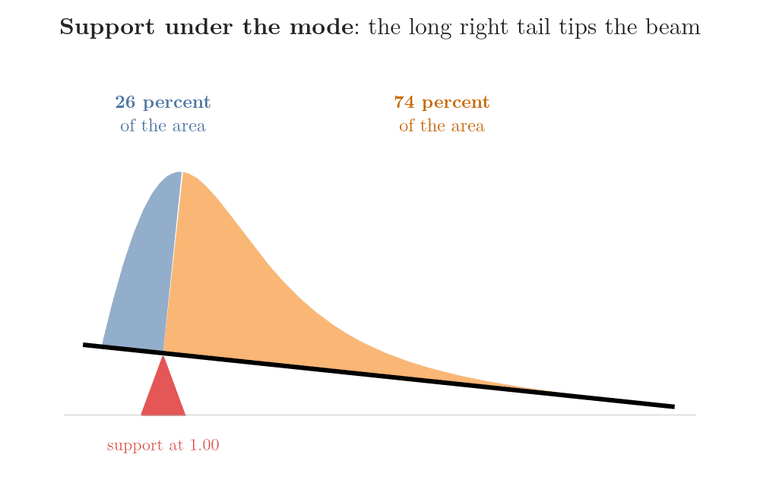
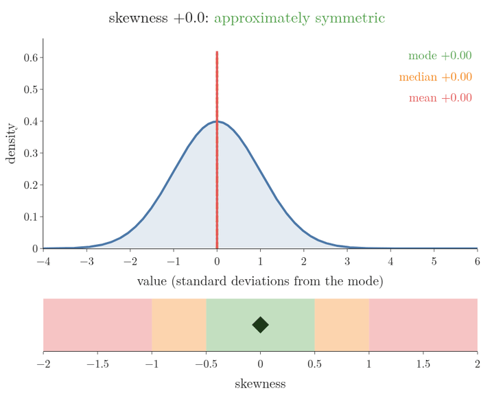
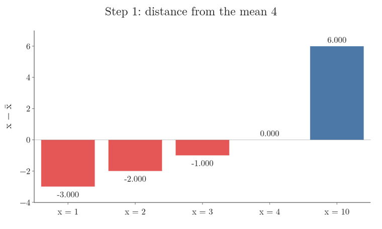
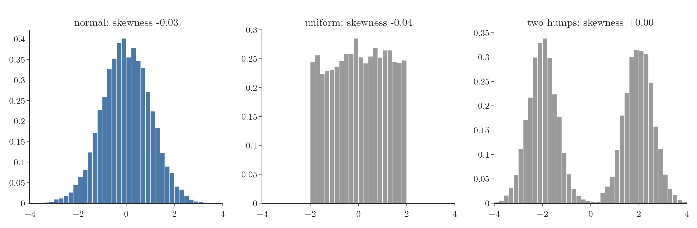

<!-- where-this-fits: generated by course_map/build_map.py; edit concepts.yaml, not this block -->
> **Where this fits:** Pipeline map step 3 (Understand data). See the [Course map](../../../00-course-map/00-course-map.md).
>
> 
>
> - **Builds on:** [Descriptive statistics](../../../ML/02-getting-data/ML-018-understanding-your-data/ML-018-understanding-your-data.md#7-what-does-the-data-look-like-in-numbers).
> - **Compare with:** [Kurtosis and moments](../../../ML/02-getting-data/ML-021-pandas-profiling/ML-021-pandas-profiling.md#42-a-numerical-column-age).
<!-- /where-this-fits -->

## 1. Overview

> **Key point:** Skewness measures how far a distribution is from symmetric. It shows in the long tail, in the order of mode, median and mean, and in one number: a **feature** (G-772; one variable of the data, one column of the table) can be treated as normal only if that number is near 0, and even then only if its shape is also a bell (section 6.1).


In Figure 1, each panel is a histogram: the bars count how many observations fall in each range of values, so a tall bar marks a common range. The **tail** is the long thin stretch of bars on one side of the peak. The left panel has a long tail to the left, the middle panel has no long tail, and the right panel has a long tail to the right; the vertical lines mark the mode, median and mean (section 4).

Skewness was introduced in the [univariate analysis](../../../ML/02-getting-data/ML-019-univariate-analysis/ML-019-univariate-analysis.md#10-skewness) (section 10): 0 for a symmetric feature, positive for a long right tail, negative for a long left tail, with the formula worked by hand. This Note goes deeper:

- it links skewness to the [normal distribution](../MA-024-normal-distribution/MA-024-normal-distribution.md#2-what-the-normal-distribution-is) (section 2);
- it explains why the tail matters (section 3);
- it shows how the mean, median and mode separate, and why (section 4, Figures 1 and 3);
- it gives the sample formula that pandas uses (section 5);
- it gives a scale for reading the number (section 6).

## 2. Skewness as distance from the normal shape

> **Key point:** A normal distribution is perfectly symmetric; skewness measures the asymmetry, so the larger it is, the less we can treat the data as normal.

A normal distribution is a symmetric bell with a specific formula (see the [normal distribution](../MA-024-normal-distribution/MA-024-normal-distribution.md#2-what-the-normal-distribution-is)). **Skewness** (G-1817) is a measure of the asymmetry of a probability distribution: the degree to which a dataset deviates from that symmetric shape.

- In a **symmetric** distribution with one peak, the mean, median and mode are equal, and the two tails are equally long.
- In a **skewed** distribution the mean, median and mode differ, and one tail is longer than the other.

So skewness is a warning light. The more it grows, the less the data looks like a normal distribution, and the less we can rely on the normal distribution's properties (such as the [68-95-99.7 rule](../../../ML/04-missing-data-and-outliers/ML-041-outliers-zscore/ML-041-outliers-zscore.md#3-the-68-95-997-rule): about 68, 95 and 99.7 percent of the values lie within 1, 2 and 3 standard deviations of the mean) for that data.

## 3. The tail and tail events

> **Key point:** The skew is named after the long tail; a tail event has a very low probability but a very large effect.

**Positive skew** (G-1533), or right skew, has a long right tail and **negative skew** (G-1312), or left skew, a long left tail, as the [univariate analysis](../../../ML/02-getting-data/ML-019-univariate-analysis/ML-019-univariate-analysis.md#10-skewness) (section 10) shows. The tail is where the outliers are, and in finance it gets special attention.

A **tail event** (G-1943) is an event with a very low probability of happening that has a huge impact when it does. Investors who fund start-ups are an example. Out of 50 companies they invest in, perhaps 45 to 48 fail and the money is lost.

But one or two succeed so spectacularly that they repay all the losses and more. The returns form a heavily right-skewed distribution, and the whole strategy rests on its long right tail.

The Titanic fares show the same pattern on real data (Figure 2). Most passengers paid less than 100, but a few paid far more:

- the 45 highest fares, 5 percent of the 891 passengers, start at 113.28;
- those 45 passengers paid 31.5 percent of all the money;
- the single largest fare, 512.33, is more than 35 times the median fare of 14.45.


## 4. The order of mode, median and mean

> **Key point:** Right skew: mode < median < mean. Left skew: mean < median < mode. The stronger the skew, the further apart they are.

The three **measures of central tendency** (G-1205; see the [measures of central tendency](../../01-descriptive-stats/MA-005-measures-of-central-tendency/MA-005-measures-of-central-tendency.md#2-what-central-tendency-means)) react differently to a tail:

- the **mode** (G-1251) stays at the peak, where most values are;
- the **median** moves a little towards the tail, since it only counts values;
- the **mean** (G-1203) moves furthest, because every extreme value in the tail pulls it.

Two pictures explain why the median and the mean part ways (Figure 3):

- **The median is the equal-area line.** Half of the area under the curve lies on each side of it. In a lopsided curve the median is not at the peak: the tail side holds more area than its low height suggests, so the line has to move towards the tail.
- **The mean is the balance point.** Picture the shape cut out of wood and resting on a beam. The mean is where a support must stand for the beam to stay level. A small piece far out in the tail has a long lever arm, so it counts for more than its area.

Figure 3 moves the support under a right-skewed shape. Under the mode, 74 percent of the area is on the right and the beam tips right. Under the median the areas are equal, 50 and 50, yet the beam still tips right, because the right half reaches much further out. The beam is level only under the mean, with 59 percent of the area on the left and 41 percent on the right. So a long right tail puts the mean to the right of the median, and a long left tail puts it to the left.



So the order depends on the side of the tail (Figure 1):

| Shape | Order | Example from Figure 1 |
|---|---|---|
| Right skew | mode < median < mean | fares: 8.05 < 14.45 < 32.20 |
| Symmetric | mode = median = mean | all close to 50 |
| Left skew | mean < median < mode | simulated easy-exam marks (skewness $-0.90$): 76.7 < 80.0 < 86.3 |

The stronger the skew, the further the mean is from the median and the mode. With little skew the three almost coincide; for a perfect normal distribution they are equal.

Figure 4 shows this as the skewness changes smoothly. Each shape keeps its peak (the mode) at 0 and its standard deviation at 1; only the tail grows, first to the right, then to the left. Watch the mean (red) run ahead into the tail, the median (orange) follow less far, and the marker on the bar below cross from "approximately symmetric" into "highly skewed" (section 6).

{height=50%}

## 5. The sample skewness formula

> **Key point:** Sample skewness is the third moment of the standardized values, with a small correction for sample size; pandas and Excel use this version.

Skewness is the third **statistical moment** (G-1882): where the mean uses the values themselves and the variance their squared distances, skewness uses **cubed** distances (moments are explained in the [kurtosis and Q-Q plots](../MA-028-kurtosis-and-qq-plots/MA-028-kurtosis-and-qq-plots.md#21-statistical-moments)). Cubing keeps the sign, so values far above the mean push the total up and values far below push it down.

We worked the population version, $g_1$, by hand in the [univariate analysis](../../../ML/02-getting-data/ML-019-univariate-analysis/ML-019-univariate-analysis.md#10-skewness). The version in pandas' `skew()` and Excel's `SKEW` is the **sample skewness** (G-1728):

1. **In words:** standardize every value with the sample mean and sample standard deviation, cube, add up, and multiply by a factor that corrects for small samples.
2. **Formula:** for $n$ values with sample mean $\bar{x}$ and sample standard deviation $s$ (divided by $n - 1$),
   $$G_1 = \frac{n}{(n - 1)(n - 2)} \sum_{i=1}^{n} \left(\frac{x_i - \bar{x}}{s}\right)^3$$
3. **Example:** the values 1, 2, 3, 4, 10. The mean and standard deviation, one step per line:
   $$\bar{x} = \frac{1 + 2 + 3 + 4 + 10}{5} = 4$$
   The squared distances from the mean 4 are 9, 4, 1, 0 and 36, one per value; for the value 1 the distance is $-3$, and its square is 9.
   $$s = \sqrt{\frac{9 + 4 + 1 + 0 + 36}{4}}$$
   $$s = \sqrt{12.5} = 3.536$$
   Each value is standardized, then cubed:

   | $x$ | $(x - 4)/3.536$ | cube |
   |---|---|---|
   | 1 | $-0.849$ | $-0.611$ |
   | 2 | $-0.566$ | $-0.181$ |
   | 3 | $-0.283$ | $-0.023$ |
   | 4 | 0 | 0 |
   | 10 | 1.697 | 4.888 |
   | **Sum** | | 4.073 |

   So
   $$\frac{n}{(n-1)(n-2)} = \frac{5}{4 \times 3} = 0.4167$$
   $$G_1 = 0.4167 \times 4.073 = 1.70$$
   The result, 1.70, is what pandas gives. The population version $g_1$ (which divides by $n$ and has no correction) gives 1.14 on the same values.

Figure 5 plays the four steps. Watch step 3: cubing shrinks the small distances (the cube of $-0.283$ is only $-0.023$) and blows up the large one ($1.697^3 = 4.888$). The one far value, 10, outweighs the other four together, so the sum, and the skewness, is positive.



The $n - 1$ inside $s$ is **Bessel's correction** (G-279; see the [measures of dispersion](../../01-descriptive-stats/MA-006-measures-of-dispersion/MA-006-measures-of-dispersion.md#6-the-sample-variance-divide-by-n---1)). The two versions differ by a factor that depends only on the number of values $n$ (Joanes and Gill 1998):

$$G_1 = g_1 \sqrt{n(n - 1)}/(n - 2)$$

Why correct at all: the plain averages inside $g_1$ are not unbiased estimates, the same problem the $n - 1$ fixes for the variance. $G_1$ is built from the unbiased estimate of the spread (the sample variance $s^2$) and the unbiased estimate of the average cubed distance, which is where the extra factor comes from (Wikipedia, "Skewness", Sample skewness). Joanes and Gill found that $G_1$ has small error in samples from skewed populations (as reported by Doane and Seward 2011).

The factor is 1.49 for our 5 values, but only 1.002 for the 891 Titanic observations (records, or rows of the table). So the correction matters for small samples; with hundreds of observations $G_1$ and $g_1$ are almost equal (NIST/SEMATECH e-Handbook §1.3.5.11).

In practice nobody computes this by hand: `df["Fare"].skew()` returns 4.79 at once. What matters is interpreting the number.

> **Extra:** A simpler measure is **Pearson's skewness coefficient** (G-1475) (Doane and Seward 2011):
>
> $$\frac{3(\bar{x} - \text{median})}{s}$$
>
> Pearson's coefficient uses the fact from Section 4 that skew pulls the mean away from the median. For 1, 2, 3, 4, 10 the mean is 4, the median 3 and $s = 3.536$:
>
> $$\frac{3 \times (4 - 3)}{3.536} = 0.85$$
>
> The sign is the same, the size different. The coefficient is quick to compute but less used than the moment version.

## 6. Reading a skewness value

> **Key point:** Between $-0.5$ and 0.5, approximately symmetric; between 0.5 and 1 in size, moderately skewed; beyond 1 in size, highly skewed.

Real data almost never has a skewness of exactly 0, so we need a scale (Figure 6):

{height=30%}

| Skewness | Reading | What we may assume |
|---|---|---|
| $-0.5$ to $0.5$ | approximately symmetric | if the plot also looks bell-shaped, treat it as normal |
| $0.5$ to $1$ (or $-1$ to $-0.5$) | moderately skewed | do not assume normality |
| above 1 (or below $-1$) | highly skewed | clearly not normal |

Two Titanic features show the two ends of the scale:

- **Age**, skewness 0.39: approximately symmetric. Together with its roughly bell-shaped histogram, we may treat it as normal for practical purposes, as the [standard normal distribution](../MA-025-standard-normal-and-z-table/MA-025-standard-normal-and-z-table.md#7-where-the-normal-distribution-is-used-in-data-science) did.
- **Fare**, skewness 4.79: highly skewed, far from normal. A feature like this is a candidate for a **log transform** (G-1112; see the [function transformer](../../../ML/03-feature-engineering/ML-029-function-transformer/ML-029-function-transformer.md#5-log-transform)).

These cut-offs are a rule of thumb, not a law; they come from Bulmer (1979).

> **Python:** Skewness of every numerical feature.
>
> ```python
> import pandas as pd
>
> df = pd.read_csv("data/titanic_train.csv")
> df["Age"].skew()     # 0.39
> df["Fare"].skew()    # 4.79
> df.skew(numeric_only=True)   # all columns at once
> ```

### 6.1 Symmetric does not mean normal

> **Key point:** Zero skewness only says "symmetric"; a flat or two-humped distribution can be symmetric too.

Skewness applies to every distribution, not only to the normal one, and a skewness near 0 does not prove normality. The **uniform distribution** (G-2043; see the [uniform and log-normal distributions](../MA-029-uniform-and-log-normal/MA-029-uniform-and-log-normal.md#2-the-uniform-distribution)) and a symmetric distribution with two humps both have skewness 0, and neither is normal. Figure 7 draws 10,000 values from each: all three skewness values round to 0, but only the first histogram is a bell.



So skewness is one check among several. We look at the shape as well (histogram, density plot) and, best of all, at a **Q-Q plot** (G-1596; see the [kurtosis and Q-Q plots](../MA-028-kurtosis-and-qq-plots/MA-028-kurtosis-and-qq-plots.md#7-building-a-q-q-plot)).

## 7. Summary

| Skewness | Tail | Order | Example | Why it matters |
|---|---|---|---|---|
| Positive | long right tail | mode < median < mean | Titanic fare, 4.79 | far from normal, so a candidate for a log transform |
| About 0 | balanced | mode $\approx$ median $\approx$ mean | Titanic age, 0.39 | with its bell-shaped histogram, may be treated as normal |
| Negative | long left tail | mean < median < mode | easy-exam marks, $-0.90$ | moderately skewed, so do not assume normality |

- Skewness measures asymmetry, the departure from the normal distribution's symmetric shape, so the larger it is, the less we can rely on normal properties such as the 68-95-99.7 rule.
- The skew is named after the tail, not the hump, because the tail holds the rare, large values (the 45 highest Titanic fares paid 31.5 percent of the money).
- Sample skewness (pandas, Excel) adds a small-sample correction to the third moment, because it is built from unbiased estimates, like the $n - 1$ variance, so pandas' number differs from the hand formula on a few values but almost equals it on hundreds.
- $|\text{skew}| < 0.5$: about symmetric; 0.5 to 1: moderate; above 1: high, so the number tells whether normality may be assumed.
- Symmetric is not the same as normal, because a flat or two-humped shape can also have skewness 0, so check the plot too.
- This answers the opening question: skewness measures how far a distribution is from symmetric, through its tail, the order of mode, median and mean, and one number.

## 8. Sources

**Built from**

- CampusX, "Session 41 - Normal Distribution | DSMP 2023", YouTube, https://www.youtube.com/watch?v=ADqYqSdtyW8
- Khan Academy, "Median, mean and skew from density curves", YouTube, https://www.youtube.com/watch?v=JFesFhraX2M

**Other references**

- Bulmer, M. G. (1979). *Principles of Statistics*. Dover. (The three skewness bands.)
- Doane, D. P. and Seward, L. E. (2011). "Measuring Skewness: A Forgotten Statistic?" *Journal of Statistics Education* 19(2).
- NIST/SEMATECH *e-Handbook of Statistical Methods*, §1.3.5.11 "Measures of Skewness and Kurtosis". itl.nist.gov/div898/handbook (the adjusted Fisher–Pearson coefficient; the adjustment for sample size approaches 1 as N grows: 1.49 for N = 5, 1.02 for N = 100).
- Wikipedia, "Skewness", section Sample skewness. en.wikipedia.org/wiki/Skewness ($G_1$ is the ratio of the unbiased estimates of the third and second cumulants; $s^2$ is the unbiased estimate of the second).
- Joanes, D. N. and Gill, C. A. (1998). "Comparing measures of sample skewness and kurtosis." *The Statistician* 47(1).

## 9. Key terms

| Term | Meaning |
|---|---|
| Feature | One variable of the data, one column of the table |
| Observation | One record, one row of the table |
| Tail event | An event with a very low probability but a very large effect |
| Sample skewness $G_1$ | The skewness formula used on a sample, $G_1$: the average cubed standardized distance from the mean, with a small-sample correction; it measures how lopsided the data is, and it is what pandas' `skew()` returns. |
| Pearson's skewness coefficient | A simple measure of skew: three times the gap between the mean and the median, divided by the standard deviation, $3(\bar{x} - \text{median})/s$; positive for right skew, negative for left. |

