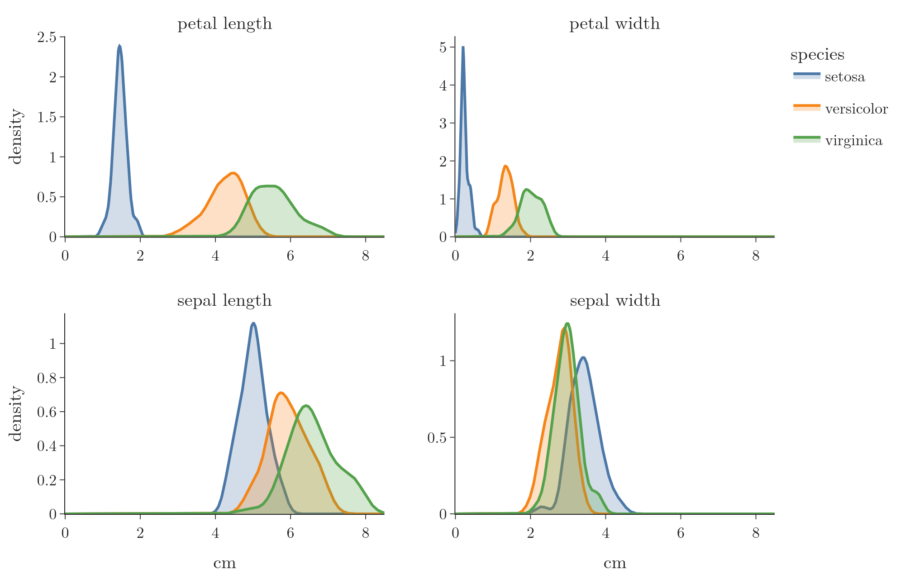
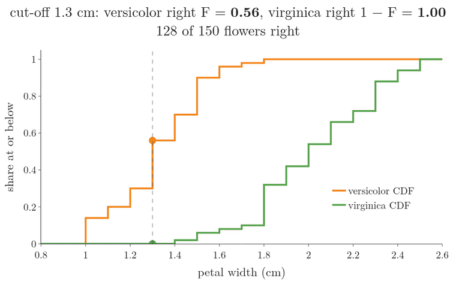
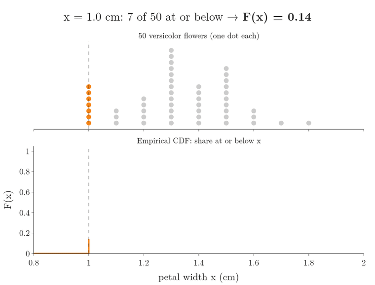
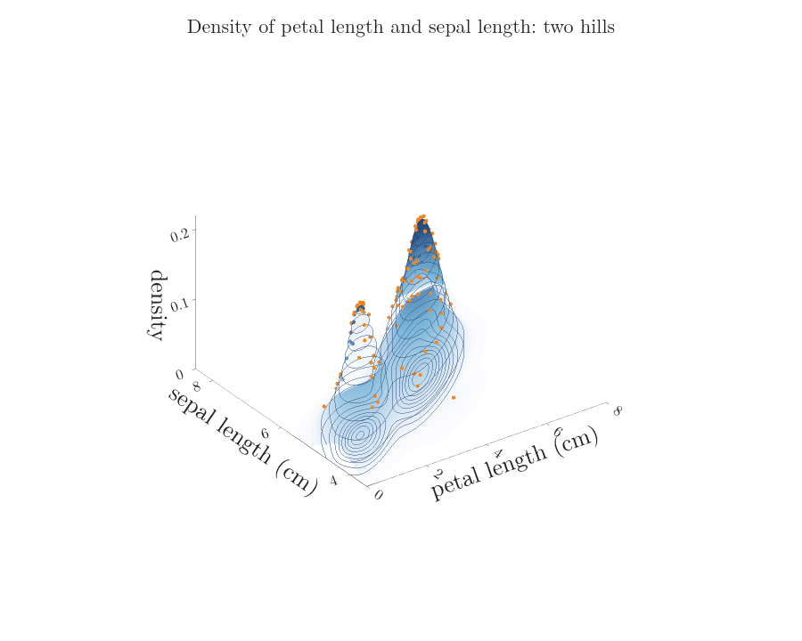
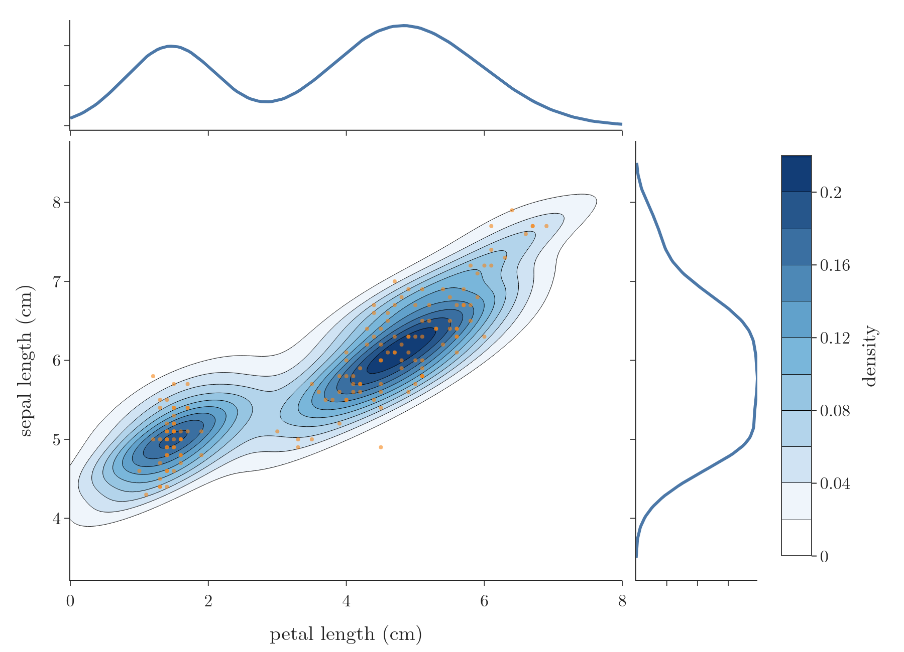

<!-- where-this-fits: generated by course_map/build_map.py; edit concepts.yaml, not this block -->
> **Where this fits:** Pipeline map step 3 (Understand data). See the [Course map](../../../00-course-map/00-course-map.md).
>
> 
>
> - **Builds on:** [Kernel density estimation (KDE)](../../../MA/03-distributions/MA-023-density-estimation-kde/MA-023-density-estimation-kde.md#5-kernel-density-estimation-kde); [Cumulative distribution function (CDF)](../../../MA/03-distributions/MA-021-pmf-and-discrete-cdf/MA-021-pmf-and-discrete-cdf.md#8-the-cumulative-distribution-function-of-a-discrete-variable).
> - **Compare with:** [Frequency tables](../../../MA/01-descriptive-stats/MA-007-frequency-tables-and-graphs/MA-007-frequency-tables-and-graphs.md#21-frequency-distribution-table); [Gaussian mixture model (GMM)](../../../MA/08-likelihood/MA-073-gaussian-mixture-models/MA-073-gaussian-mixture-models.md#6-the-mixture-density).
<!-- /where-this-fits -->

## 1. Overview

> **Key point:** Comparing the PDFs of one feature across classes shows which features separate the classes; the CDF then puts a number on how often a rule based on those PDFs is right; 2D density plots extend the idea to two features.

[The area under a curve as probability](../MA-022-pdf-and-continuous-cdf/MA-022-pdf-and-continuous-cdf.md#3-area-under-the-curve-is-probability) and [the CDF of a continuous variable](../MA-022-pdf-and-continuous-cdf/MA-022-pdf-and-continuous-cdf.md#7-the-cdf-of-a-continuous-variable) explained what PDFs (density curves) and CDFs (the share of values at or below $x$) are, and [kernel density estimation](../MA-023-density-estimation-kde/MA-023-density-estimation-kde.md#5-kernel-density-estimation-kde) showed how to estimate them. This Note shows three ways a data analyst uses them. Here a **feature** (G-772) is an input variable, one column of the data table; an **observation** (G-1374) is one record, one row; the **target** (G-1949) is the output we predict.

1. **Feature selection:** which features help to tell the classes apart (Figure 1).
2. **Measuring a rule:** how often a decision rule read off the PDFs is right, using the CDF.
3. **2D density plots:** the joint density of two features.

## 2. PDFs for feature selection

> **Key point:** Draw one PDF per class for each feature; a feature whose class curves do not overlap separates the classes well, a feature whose curves overlap does not.

### 2.1 The iris data

> **Key point:** 150 flowers of three species, four measurements each; the task is to predict the species from the measurements.

The **iris dataset** (G-973) describes 150 iris flowers, 50 of each of three species: setosa, versicolor and virginica. For every flower it gives four measurements in centimetres: sepal length, sepal width, petal length and petal width. The classic machine learning task is to predict the species from these four numbers.

Each of the four measurements is a feature, an input used for the prediction, and the species is the target. **Feature selection** (G-768) keeps the features that help to predict and removes the ones that do not (see [feature selection](../../../ML/03-feature-engineering/ML-022-what-is-feature-engineering/ML-022-what-is-feature-engineering.md#8-feature-selection)). Suppose we may keep only two of the four. Which two?

### 2.2 Reading the class PDFs

> **Key point:** The petal measurements separate the three species; the sepal measurements overlap, so the petal features are the ones to keep.

For each feature we draw three density curves, one **kernel density estimate** (KDE, G-1005) per species, on the same axes (Figure 1), as in [KDE plots](../../../ML/02-getting-data/ML-020-bivariate-multivariate-analysis/ML-020-bivariate-multivariate-analysis.md#6-kde-plot-comparing-distributions-of-groups). Each curve shows where that species' values are concentrated.

How to read one panel (Figure 1): the horizontal axis is the measurement in centimetres, one curve is drawn per species, and the height of a curve above a value tells how common that value is for the species. A tall peak is a measurement that many flowers share; a curve close to 0 means almost no flower has that value. The area under each curve is 1, so a narrow curve is tall and a wide curve is low. Where two curves lie on top of each other, the measurement cannot tell those species apart.

{height=48%}


- **Petal length (top left):** the setosa curve sits alone, far left, below about 2.3 cm. Versicolor and virginica overlap only a little.
- **Petal width (top right):** the same picture.
- **Sepal length (bottom left):** all three curves overlap heavily; setosa stands out a little.
- **Sepal width (bottom right):** versicolor and virginica lie almost on top of each other.

So the petal measurements are the useful features, and the sepal measurements can go. A machine learning model would struggle to separate the species with the sepal measurements alone, for the same reason we do: the curves are mixed.

The class PDFs even suggest a decision rule. From petal length:

| Petal length | Predicted species | Why |
|---|---|---|
| below 2.3 cm | setosa | only the setosa curve is above 0 there |
| 2.3 to 5 cm | versicolor | the versicolor curve is higher |
| above 5 cm | virginica | the virginica curve is higher |

Picking the higher curve works because every species has the same number of flowers, 50. Near a given petal length, the higher curve then means more flowers of that species, so guessing that species is right more often than guessing the other.

The same idea with two classes appears in the [KDE plot of Titanic ages](../../../ML/02-getting-data/ML-020-bivariate-multivariate-analysis/ML-020-bivariate-multivariate-analysis.md#6-kde-plot-comparing-distributions-of-groups): young passengers were more likely to survive than to die.

> **Python:** One KDE per class.
>
> ```python
> import seaborn as sns
>
> iris = sns.load_dataset("iris")
> sns.kdeplot(data=iris, x="petal_length",
>             hue="species", common_norm=False)
> ```
>
> `hue` draws one curve per species; `common_norm=False` gives each curve area 1. The Notebook (`MA-027-pdf-and-cdf-in-practice.ipynb`) loads the data from scikit-learn, which works offline.

## 3. The CDF measures how good a rule is

> **Key point:** At the rule's cut-off, each class's CDF gives the share of that class on each side, so we can say how often the rule is right for each class.

The PDFs gave us a rule, but not how reliable it is. The CDF answers the reliability question. Take petal width (Figure 2, top), where the KDEs suggest:

- petal width up to 0.7 cm: setosa;
- above 0.7 and up to 1.7 cm: versicolor (the orange curve is higher there);
- above 1.7 cm: virginica (the green curve is higher).

Now draw the CDF of each species (Figure 2, bottom). The CDF at a value $x$ is the share of the species' flowers with a petal width of $x$ or less, so each curve climbs from 0 on the left to 1 on the right; the earlier the climb, the smaller the flowers. At 1.7 cm:

- the **versicolor** CDF is 0.98: 98% of versicolor flowers have petal width 1.7 or less;
- the **virginica** CDF is 0.10: only 10% of virginica flowers have petal width 1.7 or less.

{height=55%}

So the rule is right for 98% of versicolor flowers (no versicolor is 0.7 or below) and wrong for the other 2%, which it calls virginica. The rule is right for 90% of virginica flowers and wrong for 10%, which it calls versicolor. The PDF found the rule; the CDF put a number on its reliability.

1. **In words:** the share of a class that a "below the cut-off" rule catches is that class's CDF at the cut-off; for an "above" rule it is 1 minus the CDF.
2. **Formula:**
   Here $F_{\text{versicolor}}(x)$ is the CDF of versicolor at $x$, and $P(\text{right} \mid \text{versicolor})$ reads "the probability that the rule is right, given that the flower is versicolor".
   $$P(\text{right} \mid \text{versicolor})$$
   $$\quad = F_{\text{versicolor}}(1.7)$$
   $$\qquad - F_{\text{versicolor}}(0.7)$$
   $$P(\text{right} \mid \text{virginica}) = 1 - F_{\text{virginica}}(1.7)$$
3. **Example:** with $F_{\text{versicolor}}(0.7) = 0$:
   $$P(\text{right} \mid \text{versicolor}) = 0.98 - 0 = 0.98$$
   $$P(\text{right} \mid \text{virginica}) = 1 - 0.10 = 0.90$$

> **Extra:** All 50 setosa flowers have petal width 0.6 or less, so the full rule gets 50 setosa, 49 versicolor and 45 virginica right:
>
> $$50 + 49 + 45 = 144$$
>
> That is 144 of the 150 flowers, an **accuracy** (G-162; the share of flowers the rule gets right) of 96%, from one feature and two cut-offs.

Why 1.7 and not another cut-off? Figure 3 slides the cut-off between the two CDF curves. Moving it right catches more versicolor flowers (the orange dot climbs) but loses virginica flowers (the green dot climbs too, so $1 - F$ falls):

- at 1.3 cm: 0.56 of versicolor right, all virginica right, 128 of 150 in total;
- at 1.6 and 1.7 cm: 144 of 150, the best of the cut-offs tried;
- at 1.9 cm: all versicolor right, but only 0.58 of virginica, 129 in total.



### 3.1 The empirical CDF

> **Key point:** The empirical CDF of a sample is the share of its values at or below $x$; it is a step function that estimates the true CDF.

The CDFs in Figure 2 are computed from the data, so they are **empirical CDFs** (ECDFs, G-679): for each $x$, the share of the sample's values that are at or below $x$. Figure 4 builds the versicolor ECDF: a cut-off slides right, each flower at or below it turns orange, and the curve's height is the orange share. With 50 flowers per species, each flower adds a step of one fiftieth:

$$1/50 = 0.02$$

So the curve climbs in steps, like the CDF of a discrete variable (see [the CDF of a discrete variable](../MA-021-pmf-and-discrete-cdf/MA-021-pmf-and-discrete-cdf.md#8-the-cumulative-distribution-function-of-a-discrete-variable)). The ECDF is the standard estimate of the true CDF (Wasserman 2004, ch. 7), good enough for all practical purposes.



> **Python:** An ECDF per class.
>
> ```python
> sns.ecdfplot(data=iris, x="petal_width",
>              hue="species")
> # by hand, for one class
> (v <= 1.7).mean()      # share at or below 1.7
> ```

## 4. 2D density plots

> **Key point:** A 2D density plot shows the joint density of two numerical features as contours: darker means more flowers with that combination of values.

Every density so far described **one** feature. A density can also describe two features together: then it gives, for every pair of values, how densely the data is packed around that combination. Three features would also work, but such plots are hard to read, so in practice 2D is the limit.

Take the density of petal length $x$ and sepal length $y$, written $f(x, y)$. It is a number for every pair: for the pair (1.5, 5.0) cm the estimate is

$$f(1.5, 5.0) = 0.19$$

Figure 5 draws this density as a surface: the two lengths run along the floor and the density is the height above each pair. The surface has two hills, a narrow one over the small flowers (setosa) and a broader one over the other two species, with a low valley between them. The orange dots are the 150 flowers, sitting on the surface above their own pair of values: the hills stand where the flowers crowd together.



The animation then tilts the camera down to the top view. Seen from above, the surface is the **2D density plot** (G-49) of Figure 6. It is a **contour map** (see [reading a contour map](../../06-calculus/MA-062-partial-derivatives-and-gradients/MA-062-partial-derivatives-and-gradients.md#11-reading-a-contour-map)): the same surface from above, with the same colours and the same orange dots, plus the 1D density of each feature along its edge. Read it as a map of a mountain range:

- the colour is the height: the darker the blue, the higher the density;
- each line joins points of equal density, like the height lines of the **contour plot** (G-468) in [reading a contour map](../../06-calculus/MA-062-partial-derivatives-and-gradients/MA-062-partial-derivatives-and-gradients.md#11-reading-a-contour-map);
- lines close together mean a steep slope; the dark centre of each ring is the top of a hill, the most common combination of the two measurements.

{height=55%}

The small peak (petal length about 1.5 cm, sepal length about 5 cm) is the setosa flowers; the large one (petal length about 4.5 to 5 cm, sepal length about 6 cm) is the other two species together. Between them the density is low: almost no flower has a petal length of about 3 cm.

Strictly, the colour is a probability density, so the plot shows where the probability of finding a flower is highest, not a probability itself (see [what the density at a point means](../MA-022-pdf-and-continuous-cdf/MA-022-pdf-and-continuous-cdf.md#5-what-the-density-at-a-point-means)).

> **Python:** A 2D density plot.
>
> ```python
> sns.kdeplot(data=iris, x="petal_length",
>             y="sepal_length", fill=True, cbar=True)
> # or with the edge densities:
> sns.jointplot(data=iris, x="petal_length",
>               y="sepal_length", kind="kde", fill=True)
> ```
>
> The Notebook computes the 2D KDE with `scipy.stats.gaussian_kde` and draws it with Plotly.

## 5. Summary

| Tool | Question it answers | Iris example |
|---|---|---|
| PDF per class | Which features separate the classes? | petal length and width, not sepal |
| CDF per class | How often is a cut-off rule right? | 98% of versicolor, 90% of virginica |
| Empirical CDF | What is the CDF when only a sample is known? (the share of the sample at or below $x$) | steps of 1/50 per flower |
| 2D density plot | Which combinations of two features are common? | two peaks: setosa, and the rest |

- Overlapping class curves mean a weak feature; separated curves mean a strong one, so keep the petal features and drop the sepal ones.
- A rule from the PDFs, checked with the CDFs, comes with its error rate, because each class's CDF at the cut-off is the share of that class the rule catches.
- In a 2D density plot, colour is density: dark centres are the most common combinations, so it shows where the data crowds for two features at once (setosa apart from the rest).
- This answers the opening question: class PDFs show which features separate the classes, CDFs say how often a rule built on them is right, and 2D density plots extend this to two features.

## 6. Sources

**Built from**

- CampusX, "Session 41 - Normal Distribution | DSMP 2023", YouTube, https://www.youtube.com/watch?v=ADqYqSdtyW8

**Other references**

- Wasserman, L. (2004). *All of Statistics*. Springer. Chapter 7, "Estimating the CDF and Statistical Functionals".

## 7. Key terms

Terms taught in this Note come first; linked terms are recaps, taught in the Note the link opens.

| Term | Meaning |
|---|---|
| Iris dataset (G-973) | 150 iris flowers of three species, with four measurements each; a classic classification dataset. |
| Empirical CDF (ECDF) (G-679) | The share of a sample's values at or below $x$; a step-function estimate of the CDF. |
| 2D density plot (G-49) | A plot that shows which pairs of values of two numerical features are common and which are rare (their joint density), usually as filled contours seen from above. |
| [Feature](../../../ML/01-foundations/ML-002-ai-vs-ml-vs-dl/ML-002-ai-vs-ml-vs-dl.md#52-features-chosen-by-us-or-learned) (G-772) | One piece of information about each example that a model uses (e.g. a student's CGPA). |
| [Observation](../../../ML/01-foundations/ML-003-types-of-ml/ML-003-types-of-ml.md#21-learning-from-inputs-and-outputs) (G-1374) | One record of a dataset: one row of the data table. |
| [Target](../../../ML/01-foundations/ML-003-types-of-ml/ML-003-types-of-ml.md#21-learning-from-inputs-and-outputs) (G-1949) | The output column we predict, such as the class; also called the label. |
| [Feature selection](../../../ML/03-feature-engineering/ML-022-what-is-feature-engineering/ML-022-what-is-feature-engineering.md#5-the-four-parts-of-feature-engineering) (G-768) | Keeping only the useful input columns and dropping the rest. |
| [Kernel density estimate (KDE)](../../../ML/02-getting-data/ML-019-univariate-analysis/ML-019-univariate-analysis.md#7-density-plot) (G-1005) | A smooth curve that estimates a column's PDF from its values, built by adding a kernel centred on every data point; a KDE plot draws it. |
| [Accuracy](../../../ML/01-foundations/ML-012-toy-project/ML-012-toy-project.md#9-evaluating-the-model) (G-162) | The fraction of predictions that are correct. |
| [Contour plot](../../../MA/06-calculus/MA-062-partial-derivatives-and-gradients/MA-062-partial-derivatives-and-gradients.md#11-reading-a-contour-map) (G-468) | A map of a surface seen from above, with lines joining points of equal height, so a 3D shape such as a loss bowl can be drawn and read on flat paper. |
