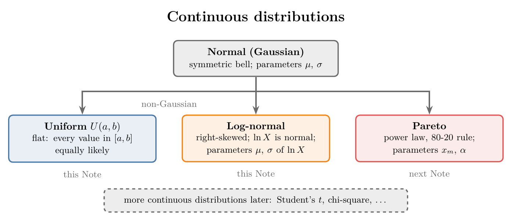
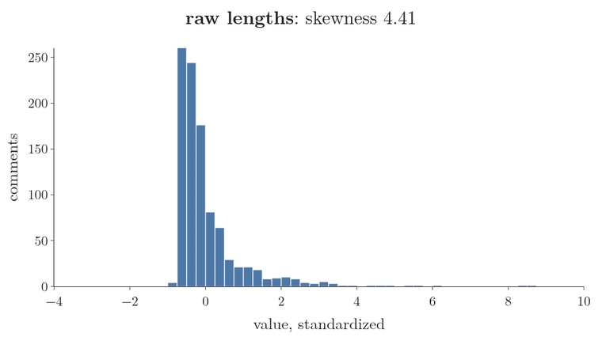
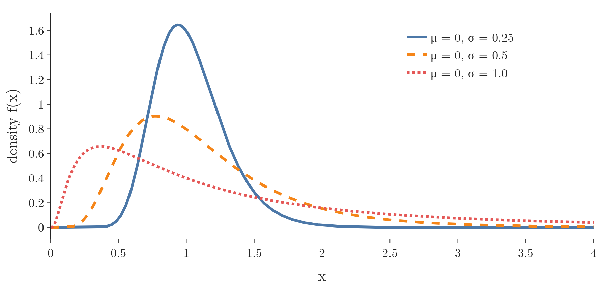
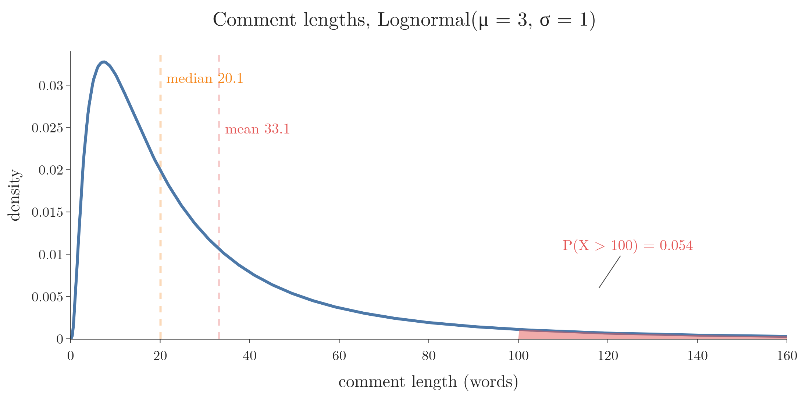

<!-- where-this-fits: generated by course_map/build_map.py; edit concepts.yaml, not this block -->
> **Where this fits:** Pipeline map step 0 (Foundations). See the [Course map](../../../00-course-map/00-course-map.md).
>
> 
>
> - **Builds on:** [Probability distributions](../../../MA/01-descriptive-stats/MA-003-statistics-roadmap/MA-003-statistics-roadmap.md#32-probability-distributions).
> - **Compare with:** [Pareto distribution and power laws](../../../MA/03-distributions/MA-030-pareto-and-power-law/MA-030-pareto-and-power-law.md#2-power-laws).
<!-- /where-this-fits -->

## 1. Overview

> **Key point:** Beyond the normal distribution, three continuous distributions appear constantly: the flat uniform, the right-skewed log-normal, and the power-law Pareto; this Note covers the first two.

{height=40%}

The normal distribution (see [what the normal distribution is](../MA-024-normal-distribution/MA-024-normal-distribution.md#2-what-the-normal-distribution-is)) is the best studied distribution, but there are hundreds of others. Distributions that are not normal are called **non-Gaussian** (G-1334). Figure 1 shows the three famous continuous ones of this Note and the next (they were first listed in [famous distributions](../MA-020-random-variables-and-distributions/MA-020-random-variables-and-distributions.md#6-famous-distributions)).

For each one we look at:

- its definition;
- its PDF and parameters;
- where it shows up;
- how to recognise it in data. Recognising uses the [Q-Q plot](../MA-028-kurtosis-and-qq-plots/MA-028-kurtosis-and-qq-plots.md#7-building-a-q-q-plot) (a plot that compares the sorted data with the values a chosen distribution would give).

## 2. The uniform distribution

> **Key point:** In a uniform distribution every outcome in a given range is equally likely; it comes in a discrete and a continuous version.

The **uniform distribution** (G-2043) is a probability distribution in which all outcomes are equally likely within a given range. If we pick a random value from that range, any value is as likely as any other.

The uniform distribution comes in two kinds, one for each kind of random variable:

- **Discrete uniform** (G-618): a fair die. Each face from 1 to 6 has probability $1/6$, so the PMF (the probability of each value) is six bars of equal height (see [the PMF of one die](../MA-021-pmf-and-discrete-cdf/MA-021-pmf-and-discrete-cdf.md#4-the-pmf-of-one-die)).
- **Continuous uniform** (G-467): a continuous random variable spread evenly over a range, such as a production time anywhere between 5 and 6 hours. This Note is about this kind.

### 2.1 Notation and parameters

> **Key point:** $X \sim U(a, b)$: the two parameters are the lower end $a$ and the upper end $b$ of the range.

The idea in plain words: a machine takes anywhere between 5 and 6 hours to make one product, and every time in that range is equally likely. Only two numbers describe it: the shortest time, 5, and the longest time, 6.

Those two numbers are the **parameters** of the continuous uniform distribution. The short way to write the machine's time $X$ is:

$$X \sim U(5, 6)$$

The symbol $\sim$ reads "follows the distribution", and $U(5, 6)$ is the uniform distribution from 5 to 6. In general we write:

$$X \sim U(a, b)$$

Here $a$ is the lowest possible value (5 for the machine) and $b$ the highest (6 for the machine), with $b > a$.

### 2.2 The PDF of the continuous uniform

> **Key point:** The PDF is a flat line at height $1/(b - a)$ between $a$ and $b$, and 0 everywhere else.

The graph of the PDF is a rectangle (Figure 2, left). The rule that fixes its height: the total area under every PDF (probability density function) is 1 (see [area under the curve is probability](../MA-022-pdf-and-continuous-cdf/MA-022-pdf-and-continuous-cdf.md#3-area-under-the-curve-is-probability)).

For the machine, $X \sim U(5, 6)$:

$$\text{width} = 6 - 5 = 1 \text{ hour}$$

$$\text{area} = \text{width} \times \text{height} = 1$$

$$\text{height} = \frac{1}{1} = 1 \text{ per hour}$$

The probability that a product takes between 5.2 and 5.5 hours is the area of the part of the rectangle between those two times:

$$\text{width} = 5.5 - 5.2 = 0.3$$

$$P(5.2 \le X \le 5.5) = 0.3 \times 1 = 0.3$$

Figure 2 (left) shades exactly this rectangle; Figure 2 (right) shows the CDF (the share of products finished by each time). The same steps for any range give the **PDF** of the continuous uniform. The rectangle is $b - a$ wide, so its height must be $1/(b - a)$:

$$f(x) = \begin{cases} \dfrac{1}{b - a} & \text{if } a \le x \le b \cr0 & \text{otherwise} \end{cases}$$

For $a = 5$ and $b = 6$ the height is 1, as in the steps above:

$$1/(6 - 5) = 1$$


The continuous uniform distribution is **symmetric**, like the normal distribution: its skewness is 0. Its excess kurtosis is $-1.2$, as it has no tails at all (see [excess kurtosis](../MA-028-kurtosis-and-qq-plots/MA-028-kurtosis-and-qq-plots.md#4-excess-kurtosis-and-the-three-types)).

> **Extra:** The CDF, mean and variance of $U(a, b)$.
>
> The idea: area builds up at a constant rate, so the share finished is a straight ramp; the mean is the midpoint; the variance grows with the square of the width. For $U(5, 6)$, in steps:
>
> $$F(5.75) = \frac{5.75 - 5}{6 - 5}$$
>
> $$F(5.75) = 0.75$$
>
> (the dotted lines of Figure 2, right).
>
> $$\text{mean} = \frac{5 + 6}{2} = 5.5 \text{ hours}$$
>
> $$\text{variance} = \frac{(6 - 5)^2}{12} = 0.0833$$
>
> $$\text{standard deviation} = \sqrt{0.0833} = 0.289 \text{ hours}$$
>
> The general formulas behind those lines, for $a \le x \le b$:
>
> $$F(x) = \frac{x - a}{b - a}$$
>
> $$\text{mean} = \frac{a + b}{2}$$
>
> $$\text{variance} = \frac{(b - a)^2}{12}$$
>
> The CDF is a straight ramp from 0 at $a$ to 1 at $b$.

### 2.3 Where the continuous uniform appears

> **Key point:** The continuous uniform appears when a quantity is equally likely anywhere in a fixed range, and it works behind the scenes in many ML techniques.

Everyday examples are quantities that are equally likely anywhere within fixed limits:

- the time a machine takes to produce a product, when it ranges evenly from 5 to 6 hours;
- the waiting time for a bus that comes exactly every 10 minutes, for someone arriving at a random moment: anywhere from 0 to 10 minutes.

In machine learning, the uniform distribution mostly works behind the scenes:

- **Random initialization** (G-1612). Neural networks and k-means clustering (see [k-means](../../../ML/09-clustering-and-more/ML-122-kmeans-intuition/ML-122-kmeans-intuition.md#42-step-2-pick-the-starting-centroids)) start from random parameter values and improve them step by step. The start strongly affects the final result. Drawing the start from a uniform distribution gives every value in the range the same chance.
- **Sampling.** Splitting data into training and test sets, or drawing a random subset, picks each **observation** (G-1374; one record, one row of the data table) with equal probability ([the train-test split](../../../ML/01-foundations/ML-012-toy-project/ML-012-toy-project.md#6-training-and-test-sets)).
- **Data augmentation** (G-531). In deep learning with images, a small dataset is enlarged by making new images from old ones: zoomed in a little, shrunk, shifted, rotated. The amounts are drawn at random, often uniformly.
- **Hyperparameter tuning** (G-909). Random search tries hyperparameter values drawn from ranges, often uniformly (scikit-learn `RandomizedSearchCV` docs; see [randomized search](../../../ML/08-trees-and-ensembles/ML-106-random-forest-tuning/ML-106-random-forest-tuning.md#7-randomized-search)).
- **Pseudo-random number generators.** Computers first produce uniform random numbers and turn them into samples from other distributions (MML §6.7.1).

> **Python:** Uniform values and the uniform distribution.
>
> ```python
> import numpy as np
> from scipy import stats
>
> rng = np.random.default_rng(42)
> times = rng.uniform(5, 6, size=1000)   # from 5 to 6
> # scipy uses loc = a and scale = b - a
> u = stats.uniform(loc=5, scale=1)
> u.pdf(5.3)                  # 1.0
> u.cdf(5.5) - u.cdf(5.2)     # 0.3
> ```
>
> A common slip: `stats.uniform(5, 6)` means $U(5, 11)$, because the second number is the width, not the upper end.

## 3. The log-normal distribution

> **Key point:** A random variable is log-normal when its logarithm is normally distributed; the variable itself is right-skewed with a long tail.

The idea in plain words: some quantities grow by multiplying, not by adding. A forum comment is not "20 words more" than a short one; it is "8 times longer". Such quantities are bunched at small values with a long tail of big ones. The log measures a value by how many times it was multiplied, so "8 times longer" and "8 times shorter" become steps of the same size (see [the log transform](../../../ML/03-feature-engineering/ML-029-function-transformer/ML-029-function-transformer.md#5-log-transform)).

Take the comment lengths of section 3.4, with a median of about 20 words. Compare a comment 8 times longer and one 8 times shorter:

| | words | distance from 20 words | $\ln$ of words | distance from $\ln 20 = 2.996$ |
|---|---|---|---|---|
| 8 times shorter | 2.5 | 17.5 | 0.916 | 2.080 below |
| median | 20 | 0 | 2.996 | 0 |
| 8 times longer | 160 | 140 | 5.075 | 2.079 above |

In words the two comments sit very unequal distances from the median (17.5 and 140); after the log they sit the same distance (about 2.08) on either side. That is why the long right tail becomes a symmetric bell.

Quantities like this follow a **log-normal distribution** (G-1115): a heavy-tailed continuous distribution of a random variable whose logarithm is normally distributed. Two things define it:

1. **The data is right-skewed:** many small values and a long tail of large ones.
2. **The log of the data is normal:** take the natural log ($\ln$, the logarithm to base $e \approx 2.718$) of every value and plot the new values; they form a bell curve.

The second condition is the test. Not every right-skewed distribution is log-normal, only one whose logs come out normal. In symbols, with $\iff$ reading "if and only if":

$$X \text{ is log-normal} \iff \ln X \text{ is normal}$$

Figure 3 applies the log gradually to 1,000 simulated comment lengths (the data of section 3.4). It uses the power $(x^{\lambda} - 1)/\lambda$, which leaves the shape of the raw data unchanged at $\lambda = 1$ and becomes $\ln x$ as $\lambda$ shrinks to 0. Watch the long right tail pull in: the skewness falls from 4.41 to 1.09, then 0.59, and the logs form a bell with skewness $-0.02$.



### 3.1 Notation and parameters

> **Key point:** The two parameters $\mu$ and $\sigma$ are the mean and standard deviation of $\ln X$, not of $X$.

For the comment lengths, the logged values are bell-shaped around 3 with a spread of 1. So the numbers that describe the logged values are $\mu = 3$ (their mean) and $\sigma = 1$ (their standard deviation); the word counts themselves have a median of $e^3 = 20.1$ words.

We write this as

$$X \sim \text{Lognormal}(\mu, \sigma^2)$$

which means

$$\ln X \sim N(\mu, \sigma^2)$$

where $N(\mu, \sigma^2)$ is the normal distribution with mean $\mu$ and variance $\sigma^2$ (for the comments, $N(3, 1)$). The parameters $\mu$ and $\sigma$ look like those of the normal distribution, and they are: but they belong to the logged values. The mean and standard deviation of $X$ itself are different numbers.

Figure 4 keeps $\mu = 0$ and increases $\sigma$. A larger $\sigma$ spreads the curve out and stretches the right tail. All three curves start at 0: a log-normal variable is always positive.

{height=38%}

### 3.2 The log-normal PDF

> **Key point:** The log-normal PDF is the normal PDF with $\ln x$ in place of $x$, divided by an extra $x$.

The idea: take the normal PDF, put $\ln x$ where $x$ was, and divide by $x$. The extra $x$ comes from the log transformation: the log squeezes large values together, and the factor $1/x$ keeps the total area at 1 (the change-of-variables rule, MML §6.7.2).

Worked case: comment lengths on a forum with $\mu = 3$ and $\sigma = 1$ (in log-words), at $x = 20$ words:

$$\ln 20 = 2.996$$

$$\ln 20 - \mu = 2.996 - 3 = -0.004 \approx 0$$

$$\text{exponent} = -\frac{(-0.004)^2}{2 \times 1^2} \approx 0$$

$$e^{0} = 1$$

$$x\thinspace\sigma\sqrt{2\pi} = 20 \times 1 \times 2.5066 = 50.13$$

$$f(20) = \frac{1}{50.13} \times 1 = 0.0199$$

The same recipe for any $x > 0$ is the **log-normal PDF**:

$$f(x) = \frac{1}{x\thinspace\sigma\sqrt{2\pi}}\thickspace e^{-\frac{(\ln x - \mu)^2}{2\sigma^2}}$$

Each line of the worked case is one piece of this formula: the exponent, the factor $x\sigma\sqrt{2\pi}$, and their combination.

The curve looks like a normal curve pushed to the left with its right side stretched out (Figure 4). The CDF behaves like the normal CDF too: a larger $\sigma$ makes it rise more slowly.

The resemblance is only in the formulas. The log-normal variable itself is skewed and not symmetric; it is $\ln X$ that is normal and gets all the benefits of normality.

> **Extra:** Because $\ln X$ is normal, every log-normal probability is a normal probability in disguise.
>
> The idea: take the log of the cut-off, standardize it with $\mu$ and $\sigma$, and read the normal CDF $\Phi$ ($\Phi(z)$ is the share of a standard normal at or below $z$, for example $\Phi(0) = 0.5$). For the comments, the share longer than 100 words:
>
> $$\ln 100 = 4.605$$
>
> $$z = \frac{4.605 - 3}{1} = 1.605$$
>
> $$\Phi(1.605) = 0.946$$
>
> $$P(X > 100) = 1 - 0.946 = 0.054$$
>
> The median comment has $e^3 = 20.1$ words, and the mean is $e^{3.5} = 33.1$: the long right tail pulls the mean above the median. The general formulas behind these lines:
>
> $$P(X \le x) = \Phi\negthinspace\left(\frac{\ln x - \mu}{\sigma}\right)$$
>
> $$\text{median} = e^{\mu}$$
>
> $$\text{mean} = e^{\mu + \sigma^2/2}$$
>
> {height=34%}

### 3.3 Where the log-normal appears

> **Key point:** Log-normal data is common in internet applications: comment lengths, time spent on articles, and many human behaviours.

The log-normal distribution appears in biology, medicine, chemistry, hydrology and economics, and it is especially common in internet applications:

- **Length of comments** in online discussion forums: most comments are a few words; a few are very long.
- **Time spent reading online articles:** many readers leave quickly; a few stay to the end and read the other comments too.
- **Length of chess games:** many games end quickly, and a few go on for a very long time.
- **Income:** there is evidence that the income of about 97 to 99% of the population is log-normally distributed: many people earn little, few earn a lot. The richest 1 to 3% follow a [Pareto distribution](../MA-030-pareto-and-power-law/MA-030-pareto-and-power-law.md#1-overview) (Clementi and Gallegati 2005).

### 3.4 How to check whether data is log-normal

> **Key point:** Take the log of every value and check the logs for normality with a Q-Q plot; if the logs are normal, the data is log-normal.

Checking for log-normality is a common interview question, and the answer follows from the definition:

1. Take the natural log of every value of $X$; call the result $Y = \ln X$.
2. Draw a Q-Q plot of $Y$ against the normal distribution (see [building a Q-Q plot](../MA-028-kurtosis-and-qq-plots/MA-028-kurtosis-and-qq-plots.md#7-building-a-q-q-plot)).
3. If the points lie on a straight line, $Y$ is normal, so $X$ is log-normal.

Figure 6 does this for 1,000 comment lengths simulated with $\mu = 3$ and $\sigma = 1$. The raw lengths are strongly right-skewed (skewness 4.4). Their logs form a bell (skewness $-0.02$), and the Q-Q plot of the logs is a straight line.


The same check shows the payoff of knowing a **feature** (G-772; one variable of the data, one column of the table) is log-normal: the log transform turns it into a normal feature, and everything that works on normal data then applies. That transform, and how it helps models such as linear and logistic regression, is in [the function transformer](../../../ML/03-feature-engineering/ML-029-function-transformer/ML-029-function-transformer.md#75-checking-with-cross-validation).

> **Python:** Log-normal values, and the scipy parameters.
>
> ```python
> # mean and sigma here are mu and sigma of ln X
> words = rng.lognormal(mean=3, sigma=1, size=1000)
> logs = np.log(words)
> stats.probplot(logs, dist="norm")      # Q-Q plot data
> # scipy: s = sigma, scale = e^mu
> ln = stats.lognorm(s=1, scale=np.exp(3))
> ln.pdf(20)       # 0.0199
> ln.sf(100)       # 0.054, P(X > 100)
> ```
>
> The Notebook (`MA-029-uniform-and-log-normal.ipynb`) rounds the simulated lengths to whole words and draws Figure 6 with Plotly.

## 4. Summary

| | Uniform $U(a, b)$ | Log-normal |
|---|---|---|
| Shape | flat between $a$ and $b$ | right-skewed, long right tail |
| Parameters | $a$, $b$ (ends of the range) | $\mu$, $\sigma$ of $\ln X$ |
| PDF | $1/(b - a)$ on $[a, b]$ (Section 2.2) | normal PDF of $\ln x$, divided by $x$ (Section 3.2) |
| Skewness | 0 (symmetric) | positive |
| Example | production time 5 to 6 hours | comment length, income |
| Check | Q-Q plot against uniform | Q-Q plot of $\ln X$ against normal |
| scipy | `uniform(loc=a, scale=b-a)` | `lognorm(s=σ, scale=exp(μ))` |

- Read the table's scipy row with care, because scipy takes the width $b - a$ (not $b$) for the uniform and $e^{\mu}$ for the log-normal, so `uniform(5, 6)` means $U(5, 11)$.
- Non-Gaussian simply means not normal, so the normal distribution's rules do not carry over to it.
- The uniform distribution works behind the scenes in ML: initialization, sampling, augmentation, random search, because each needs every value in a range, or every row, to have the same chance.
- A right-skewed feature is log-normal only if its logs are normal, so check with a Q-Q plot of the logs, not the skew alone.
- Log-normal data becomes normal with a log transform, so everything that works on normal data then applies to it.
- This answers the opening question for two of the three common non-normal distributions: the uniform is flat, the log-normal is right-skewed with normal logs.

## 5. Sources

**Built from**

- CampusX, "Session 42 - Non-Gaussian Probability Distributions | DSMP 2023", YouTube, https://www.youtube.com/watch?v=U6QCc_3zgUk

**Other references**

- Clementi, F. and Gallegati, M. (2005). "Pareto's Law of Income Distribution: Evidence for Germany, the United Kingdom, and the United States." In *Econophysics of Wealth Distributions*, Springer.
- Deisenroth, M. P., Faisal, A. A. and Ong, C. S. (2020). *Mathematics for Machine Learning*. Cambridge University Press. Sections 6.7.1 (sampling with the inverse CDF) and 6.7.2 (change of variables).
- scikit-learn documentation, `RandomizedSearchCV`.

## 6. Key terms

| Term | Meaning |
|---|---|
| Observation | One record, one row of the data table |
| Feature | One variable of the data, one column of the table |
| Non-Gaussian distribution | Any distribution that is not normal |
| Uniform distribution | A distribution in which every outcome in a range is equally likely |
| Continuous uniform distribution $U(a, b)$ | A continuous variable spread evenly between $a$ and $b$, with density $1/(b - a)$ |
| Random initialization | Starting a model's parameters at random values, often drawn from a uniform distribution |
| Data augmentation | Enlarging a dataset by making changed copies of its examples, such as zoomed or shifted images |
| $\text{Lognormal}(\mu, \sigma^2)$ | The distribution of $X$ when $\ln X \sim N(\mu, \sigma^2)$ |
