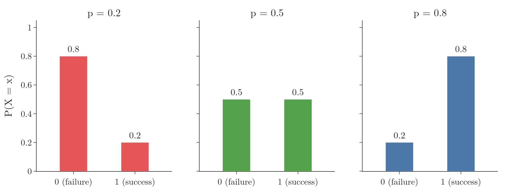
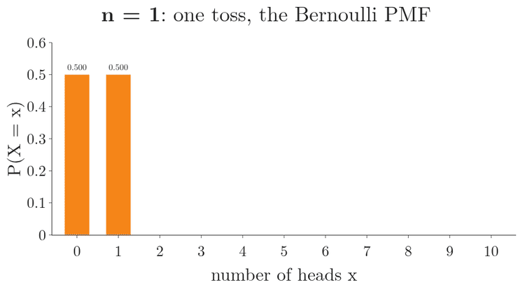
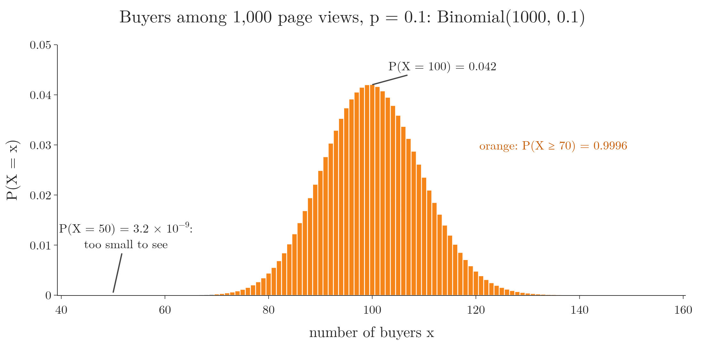
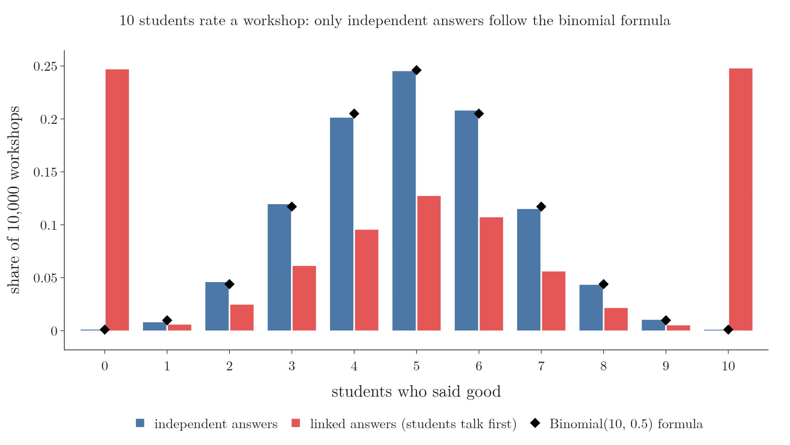

<!-- where-this-fits: generated by course_map/build_map.py; edit concepts.yaml, not this block -->
> **Where this fits:** Pipeline map step 0 (Foundations). See the [Course map](../../../00-course-map/00-course-map.md).
>
> 
>
> - **Builds on:** [Probability distributions](../../../MA/03-distributions/MA-020-random-variables-and-distributions/MA-020-random-variables-and-distributions.md#3-probability-distributions-as-tables).
> - **Leads to:** [Voting ensembles](../../../ML/08-trees-and-ensembles/ML-098-voting-regressor/ML-098-voting-regressor.md#1-overview).
> - **Compare with:** [Poisson distribution](../../../MA/03-distributions/MA-032-poisson-distribution/MA-032-poisson-distribution.md#2-what-the-poisson-distribution-describes).
<!-- /where-this-fits -->

## 1. Overview

> **Key point:** A Bernoulli trial is one yes/no experiment; repeating it $n$ independent times and counting the successes gives a binomial variable.


Figure 1 shows the whole idea, read from left to right: one trial, then $n = 5$ of them in a row (each box holds a 1 or a 0), then their count. One yes/no experiment, such as one coin toss, is a **Bernoulli trial** (G-276). Repeat it $n$ times under the same conditions and count the 1s: that count follows a binomial distribution.

Both distributions were defined in [two famous discrete distributions](../MA-021-pmf-and-discrete-cdf/MA-021-pmf-and-discrete-cdf.md#7-two-famous-discrete-distributions). A **PMF** (probability mass function) gives the probability of each possible value of a discrete variable. This Note adds what is new:

- the Bernoulli PMF as one formula;
- the binomial formula built from a tree of outcomes;
- the four conditions a binomial experiment must meet;
- how the success probability $p$ moves the shape;
- where both distributions appear in machine learning.

Both are discrete distributions. The distributions of the last few Notes (normal, uniform, log-normal, Pareto) were continuous.

## 2. The Bernoulli distribution

> **Key point:** Any random experiment with exactly two outcomes, coded 1 (success) and 0 (failure), follows a Bernoulli distribution with one parameter $p$.

Recap: the **Bernoulli distribution** (G-275) describes one trial with two outcomes, 1 with probability $p$ and 0 with probability $1 - p$; its only parameter is $p$ (see [the Bernoulli distribution](../MA-021-pmf-and-discrete-cdf/MA-021-pmf-and-discrete-cdf.md#71-bernoulli-distribution)). The distribution is named after the Swiss mathematician Jacob Bernoulli, whose book *Ars Conjectandi* (Bernoulli 1713) studied it.

Three experiments with a binary outcome:

| Experiment | Success (1) | Failure (0) | $p$ |
|---|---|---|---|
| Toss a coin | head | tail | 1/2 |
| Read a new email | spam | not spam | depends on the inbox |
| Roll a die | the die shows 5 | anything else (1, 2, 3, 4, 6) | 1/6 |

"Success" is only a label for the outcome coded 1. The success need not be a good thing: in a spam filter, finding spam is the success.

### 2.1 The PMF as one formula

> **Key point:** $P(X = x) = p^x (1 - p)^{1 - x}$ gives $p$ for $x = 1$ and $1 - p$ for $x = 0$.

[The Bernoulli distribution](../MA-021-pmf-and-discrete-cdf/MA-021-pmf-and-discrete-cdf.md#71-bernoulli-distribution) wrote the Bernoulli PMF as two cases. The same two cases fit into one line.

1. **In words:** raise the success probability to the power $x$ and the failure probability to the power $1 - x$; one of the two powers is always 0, so that factor becomes 1.
2. **Formula:**
   $$P(X = x) = p^{x}\thinspace(1 - p)^{1 - x}$$
   $$x \in \lbrace0, 1\rbrace$$
   The second line reads: $x$ is one of 0 or 1. The sign $\in$ means "is one of", and $\lbrace0, 1\rbrace$ is the set of the two allowed values: tails is 0 and heads is 1. For example, $1 \in \lbrace0, 1\rbrace$ is true, and $2 \in \lbrace0, 1\rbrace$ is false.
3. **Example:** for a fair coin, $p$ is one half:
   $$P(X = 1) = \left(\tfrac{1}{2}\right)^{1}\left(\tfrac{1}{2}\right)^{0}$$
   $$P(X = 1) = \tfrac{1}{2} \times 1 = \tfrac{1}{2}$$
   $$P(X = 0) = \left(\tfrac{1}{2}\right)^{0}\left(\tfrac{1}{2}\right)^{1} = \tfrac{1}{2}$$
   For "the die shows 5", $p$ is one sixth:
   $$P(X = 0) = (1/6)^0 (5/6)^1$$
   $$P(X = 0) = 5/6 \approx 0.833$$

The one-line form matters later: the same pattern of powers of $p$ and $1 - p$ is the core of the binomial formula, and of the log loss of logistic regression (see [one formula for both classes](../../../ML/07-classification/ML-072-log-loss/ML-072-log-loss.md#6-one-formula-for-both-classes)).

### 2.2 The graph of a Bernoulli PMF

> **Key point:** Every Bernoulli PMF is just two bars, at 0 and at 1, with heights $1 - p$ and $p$.



Figure 2 shows three Bernoulli distributions. With $p = 0.2$ the bar at 0 is 0.8 and the bar at 1 is 0.2; with $p = 0.8$ the bars swap. Whatever $p$ is, the picture never has more than these two bars.

### 2.3 Bernoulli in machine learning

> **Key point:** The target of a binary classification problem is a Bernoulli variable.

Many ML problems predict a yes/no outcome:

- will a customer make a purchase or not;
- is an email spam or not;
- does a patient have a certain disease or not.

The **target** (G-1949; the output we predict) of each **observation** (G-1374; one record, one row of the data table) is a Bernoulli variable, and a **binary classifier** (G-302) such as **logistic regression** (G-1120) estimates its $p$ for every observation. The Bernoulli variant of **Naive Bayes** (G-1297) assumes that each **feature** (G-772; an input variable, one column of the data table) is a Bernoulli variable, such as "this word is present or not": each feature "is assumed to be a binary-valued (Bernoulli, boolean) variable" (scikit-learn §1.9.4; see also [the assumption of normal distributions](../../../ML/07-classification/ML-084-gaussian-naive-bayes/ML-084-gaussian-naive-bayes.md#3-the-assumption-normal-distributions)).

> **Extra:** Only a two-class target is Bernoulli. A target with three or more classes (Delhi, Mumbai, Chennai) follows the **categorical distribution** (G-352), the many-outcome version of Bernoulli (Murphy 2012, §2.3.2, which calls it the multinoulli distribution).

> **Extra:** The mean of a Bernoulli variable is $p$ (the expected value $E[X]$, the long-run average; see [expected value](../../02-probability/MA-012-expected-value-and-variance/MA-012-expected-value-and-variance.md#3-expected-value)). Its variance is $p(1 - p)$: by [the shortcut formula](../../02-probability/MA-012-expected-value-and-variance/MA-012-expected-value-and-variance.md#43-the-shortcut-formula) $E[X^2] - (E[X])^2$, and since $X^2 = X$ for 0 and 1, the variance is:
>
> $$p - p^2 = p(1 - p)$$
>
> For a fair coin ($p = 0.5$):
>
> $$0.5 \times 0.5 = 0.25$$
>
> This is the largest possible. For $p = 0.2$:
>
> $$0.2 \times 0.8 = 0.16$$

## 3. The binomial distribution

> **Key point:** The binomial distribution counts the successes in $n$ independent Bernoulli trials with the same $p$; its parameters are $n$ and $p$, and with $n = 1$ it is the Bernoulli distribution.

Recap: the **binomial distribution** (G-308) is the distribution of the number of successes in $n$ independent trials with the same success probability (see [the binomial distribution](../MA-021-pmf-and-discrete-cdf/MA-021-pmf-and-discrete-cdf.md#72-binomial-distribution)). The step from Bernoulli to binomial is only "do it $n$ times":

| One trial (Bernoulli) | $n$ trials (binomial) |
|---|---|
| toss a coin once | toss it 5 times and count the heads |
| check one email for spam | check 5 emails and count the spam |
| test one patient | test 5 patients and count the sick |

With $n = 1$ there is only one trial, so the binomial distribution becomes the Bernoulli distribution: Bernoulli is a special case of binomial. Figure 3 grows $n$ for a fair coin: one toss gives the two Bernoulli bars, three tosses give the 1/8, 3/8, 3/8, 1/8 of section 4, and ten tosses give a hump centred on 5.



The trials must be independent (**independent events**, G-934): the result of one must not change another (see [the definition of independence](../../02-probability/MA-016-independent-events/MA-016-independent-events.md#2-the-definition)). Suppose we ask 10 students whether a workshop was good. If they talk before answering and one convinces the others, the answers are linked, and the count no longer follows a binomial distribution. Coin tosses are independent: a head on the first toss says nothing about the second.

## 4. Counting the outcomes by hand

> **Key point:** For a few trials we can list every outcome, count those with $k$ successes, and divide by the total.

The binomial distribution answers questions such as this one. Every viewer of an online post presses "like" with probability 0.5. If 3 people watch it, what is the probability that none of them likes it? That one does? Two? All three?

Each viewer either likes (L) or does not (N). Three viewers give this many equally likely outcomes, the branches of the tree in Figure 4:

$$2 \times 2 \times 2 = 8$$

{height=50%}

Counting the leaves with each number of likes answers all four questions:

| Likes $k$ | Outcomes | Probability |
|---|---|---|
| 0 | NNN | 1/8 |
| 1 | LNN, NLN, NNL | 3/8 |
| 2 | LLN, LNL, NLL | 3/8 |
| 3 | LLL | 1/8 |

The four probabilities add up to 1, as every PMF must:

$$\frac{1}{8} + \frac{3}{8} + \frac{3}{8} + \frac{1}{8} = \frac{8}{8} = 1$$

Listing outcomes stops working fast. With 10,000 viewers there are $2^{10{,}000}$ outcomes, a number with over 3,000 digits. The question "what is the probability that exactly 500 of them like it?" needs a formula.

## 5. The binomial formula

> **Key point:** $P(X = x) = \binom{n}{x} p^x (1 - p)^{n - x}$: the probability of one arrangement of $x$ successes, times the number of arrangements.

Recap: the binomial PMF is

$$P(X = x) = \binom{n}{x} p^x (1-p)^{n-x}$$

where $\binom{n}{x}$, read as "n choose x", counts the ways to choose $x$ trials out of $n$ (see [the binomial distribution](../MA-021-pmf-and-discrete-cdf/MA-021-pmf-and-discrete-cdf.md#72-binomial-distribution)). The tree shows where each part comes from:

- $n$ is the number of trials (3 viewers), $p$ the success probability (0.5), $x$ the number of successes we ask about.
- $p^x (1-p)^{n-x}$ is the probability of **one** path with $x$ successes, such as LLN. This path probability is the Bernoulli formula, repeated over $n$ trials.
- $\binom{n}{x}$ is the number of such paths: the leaves of Figure 4 with $x$ likes.

1. **In words:** multiply the number of arrangements of 2 likes among 3 viewers by the probability of one such arrangement.
2. **Formula:**
   $$P(X = 2) = \binom{3}{2}\thinspace p^{2}\thinspace(1 - p)^{3 - 2}$$
   $$\binom{3}{2} = \frac{3!}{2!\thinspace(3 - 2)!}$$
3. **Example:** with $p$ equal to one half,
   $$\binom{3}{2} = \frac{3!}{2!\thinspace1!}$$
   $$\binom{3}{2} = \frac{6}{2 \times 1} = 3$$
   $$P(X = 2) = 3 \times \left(\tfrac{1}{2}\right)^2 \times \tfrac{1}{2}$$
   $$P(X = 2) = 3 \times \tfrac{1}{8} = \tfrac{3}{8}$$
   The same 3/8 as counting the tree.

Figure 5 plays this count. Each row is one order in which 2 of the 3 viewers like the post. Along a row we multiply, because the viewers are independent:

$$0.5 \times 0.5 \times 0.5 = 0.125$$

Moving the no-like to another viewer only changes the order of the multiplication, so every row has the same product. The three rows are different outcomes, so we add them:

$$3 \times 0.125 = 0.375 = 3/8$$

{height=45%}

With $p = 0.5$ every tile is 0.5, so the two powers look alike. The last frame of Figure 5 sets $p = 0.1$. A like tile is now 0.1 and a no-like tile is 0.9, so one row is:

$$0.1^2 \times 0.9^1 = 0.009$$

The three rows give:

$$3 \times 0.009 = 0.027$$

The number of rows did not change; only the tiles did.

The formula scales where the tree cannot. Suppose 1 in 10 people who see a product page buys the product ($p = 0.1$) and the page is shown to $n = 1000$ people:

| Question | Probability |
|---|---|
| exactly 50 buy | $3.2 \times 10^{-9}$, practically never |
| exactly 100 buy | 0.042 |
| at least 70 buy | 0.9996, almost certain |

With $p = 0.1$, about 100 purchases are expected, so 50 is extremely unlikely and "at least 70" almost sure. Figure 6 draws the whole PMF: the bars are tallest at 100, the bar at 50 is far too small to see, and almost all the area (orange) lies at 70 or above.



> **Python:** Binomial probabilities with scipy.
>
> ```python
> from scipy import stats
>
> buyers = stats.binom(n=1000, p=0.1)
> buyers.pmf(50)     # 3.2e-09: exactly 50
> buyers.pmf(100)    # 0.042: exactly 100
> buyers.sf(69)      # 0.9996: more than 69
> ```
>
> `sf` is the **survival function** (G-1928), one minus the CDF. "At least 70" is "more than 69", hence `sf(69)`.

## 6. When a count is binomial

> **Key point:** Four conditions: a fixed number of trials, two outcomes per trial, the same $p$ in every trial, and independent trials.

A process that meets all four is a **binomial experiment** (G-309). The formula holds only when all four conditions are met:

1. **Fixed number of trials.** The process has $n$ trials, decided in advance.
2. **Two outcomes.** Each trial ends in exactly one of two outcomes, success or failure.
3. **Same probability.** The success probability $p$, and so the failure probability $1 - p$, stays fixed from trial to trial. A coin whose head probability changes from 0.5 to 0.6 halfway breaks it.
4. **Independent trials.** No trial affects another.

If one condition fails, the count may still be a useful number, but the binomial formula no longer gives its probabilities.

Figure 7 breaks condition 4 in a simulation of the workshop example of section 3. Ten students each say "good" with probability 0.5. In 10,000 workshops with independent answers, the counts follow the binomial formula (the diamonds). In 10,000 workshops where, half of the time, the students talk first and all copy one student, the counts 0 and 10 each happen in about a quarter of the workshops, against 0.1 percent under the formula. Each student still says "good" half the time; only the independence is gone.



## 7. Simulating binomial experiments

> **Key point:** Each simulated number is the number of heads in one run of 10 tosses; repeating the run 1000 times shows the binomial shape.

One binomial **experiment** here is "toss a coin 10 times and count the heads". We repeat the whole experiment 1000 times. The result is 1000 numbers between 0 and 10, each the head count of one run.

> **Python:** 1000 runs of 10 tosses.
>
> ```python
> import numpy as np
>
> rng = np.random.default_rng(42)     # fixed seed
> heads = rng.binomial(n=10, p=0.5, size=1000)
> heads[:10]       # [6 5 7 6 3 8 6 6 3 5]
> ```
>
> The first run gave 6 heads, the second 5, the third 7.

Most runs give 4, 5 or 6 heads, because each toss is a head half the time. Runs with 2 or 8 heads are rarer, and 0 or 10 almost never happen: 5 heads appeared 244 times, 8 heads 42 times, 0 heads never.

Figure 8 plays the same 1000 runs as a Galton board (a board of pegs: a ball falls through rows of pegs, going left or right at each peg). Each run is one ball: every head steps it right, every tail steps it left, so after 10 tosses it lands in the bin of its head count. Watch the bins: a few balls land almost anywhere, but as the runs pile up the bars take the binomial shape, and the exact PMF dots sit on top of them.

{height=60%}

### 7.1 How $p$ moves the shape

> **Key point:** A large $p$ pushes the distribution to the right, a small $p$ to the left; around $p = 0.5$ it is symmetric and looks like a bell.


Figure 9 repeats the simulation for three coins. The bars are the share of the 1000 runs with each head count; the dots are the exact PMF.

- **$p = 0.1$:** heads are rare, so small counts dominate. The distribution sits on the left with a long tail to the right: it is right-skewed (a long tail on the right; see [the tail](../MA-026-skewness/MA-026-skewness.md#3-the-tail-and-tail-events)).
- **$p = 0.5$:** the distribution is centred at 5 and symmetric, close to a normal curve.
- **$p = 0.8$:** a biased coin; counts of 7 to 10 dominate, and the tail points left.

The simulated bars sit close to the exact dots, and they get closer with more runs. The Notebook measures the largest gap between a bar and its dot: for $p = 0.5$ it is 0.095 with 100 runs, 0.015 with 1000 runs and 0.0015 with 100,000 runs (the other two coins behave the same way).

> **Extra:** The centre of a binomial distribution is $np$ and its variance is $np(1 - p)$: the Bernoulli mean and variance, added over $n$ independent trials. For $n = 10$, $p = 0.5$: mean 5, variance 2.5; the simulation gave 4.97 and 2.58. For the product page:
>
> $$\text{mean} = 1000 \times 0.1 = 100 \text{ purchases}$$
>
> $$\text{standard deviation} = \sqrt{1000 \times 0.1 \times 0.9} = 9.49$$
>
> The skewness is the following (Johnson, Kemp and Kotz 2005, ch. 3):
>
> $$\frac{1 - 2p}{\sqrt{np(1-p)}}$$
>
> It is 0.84 for $p = 0.1$, 0 for $p = 0.5$, and $-0.47$ for $p = 0.8$. scipy's `binom(10, p).stats(moments='s')` gives the same three numbers in the Notebook.

## 8. Where the binomial distribution is used

> **Key point:** Binary classification, Naive Bayes, majority voting, hypothesis tests, logistic regression and A/B tests all use the binomial distribution.

- **Binary classification.** The number of positive cases among $n$ independent observations is binomial; for example, the number of spam emails among the next 100.
- **Naive Bayes.** Its variants assume a distribution for the features: Bernoulli, multinomial (the many-category version of binomial) or Gaussian (see [the assumption of normal distributions](../../../ML/07-classification/ML-084-gaussian-naive-bayes/ML-084-gaussian-naive-bayes.md#3-the-assumption-normal-distributions)).
- **Majority voting.** The number of correct models in a voting ensemble is binomial (see [why voting works](../../../ML/08-trees-and-ensembles/ML-096-voting-ensemble/ML-096-voting-ensemble.md#5-why-voting-works-the-probability)).
- **Hypothesis testing.** Tests compute the probability of a number of successes in $n$ trials, assuming a claim (the **null hypothesis**, G-1361) is true.
- **Logistic regression and A/B testing** (G-157). Logistic regression models the success probability of each observation; an A/B test compares the success counts of two versions of a page, such as two button colours.

## 9. Summary

| | Bernoulli | Binomial |
|---|---|---|
| Experiment | one yes/no trial | $n$ independent yes/no trials |
| Variable | 1 or 0 | number of successes, $0$ to $n$ |
| Parameters | $p$ | $n$, $p$ |
| PMF | $p^x (1 - p)^{1 - x}$ | $\binom{n}{x} p^x (1 - p)^{n - x}$ |
| Mean, variance | $p$, $p(1 - p)$ | $np$, $np(1 - p)$ |
| Example | one coin: $P(\text{head}) = 1/2$ | 2 likes out of 3: $3/8$ |

- The table matters for ML because the target of a binary classifier is a Bernoulli variable, and counts of yes/no outcomes (buyers among page views, likes) are binomial.
- Binomial with $n = 1$ is Bernoulli, because one trial can give only 0 or 1 successes.
- The binomial formula needs a fixed $n$, two outcomes, a constant $p$ and independent trials, so check all four before using it: linked answers pile up at 0 and 10, far from the formula.
- $\binom{n}{x}$ counts the paths in the outcome tree; $p^x (1 - p)^{n - x}$ is the probability of one path, so their product gives the answer when listing outcomes is impossible (10,000 viewers).
- A large $p$ shifts the distribution right, a small $p$ left; near $p = 0.5$ it is symmetric and bell-shaped, because the centre of the distribution is $np$.
- This answers the opening question: one yes/no trial is Bernoulli, and counting the successes in $n$ independent trials gives a binomial variable.

## 10. Sources

**Built from**

- CampusX, "Session 43 - Central Limit Theorem | DSMP 2023", YouTube, https://www.youtube.com/watch?v=-WmJDYBor7c
- StatQuest with Josh Starmer, "The Binomial Distribution and Test, Clearly Explained!!!", YouTube, https://www.youtube.com/watch?v=J8jNoF-K8E8
- Sanderson, G. (3Blue1Brown), lesson at 3blue1brown.com/lessons/clt: *But what is the Central Limit Theorem?* The lesson starts from a Galton board (video section "A simplified Galton Board"); Figure 8 redraws that picture with our simulation.

**Other references**

- Bernoulli, J. (1713). *Ars Conjectandi*. Basel: Thurneysen.
- scikit-learn developers. *User Guide*, §1.9.4 "Bernoulli Naive Bayes". scikit-learn.org, naive_bayes.html.
- Murphy, K. P. (2012). *Machine Learning: A Probabilistic Perspective*. MIT Press. §2.3.2.
- Galton, F. (1889). *Natural Inheritance*. Macmillan. Chapter V, pp. 63–64 and Fig. 7: describes the board, with its pins "disposed in a quincunx fashion".
- Johnson, N. L., Kemp, A. W. and Kotz, S. (2005). *Univariate Discrete Distributions*, 3rd ed. Wiley. Chapter 3.

## 11. Key terms

Terms taught in this Note come first; linked terms are recaps, taught in the Note the link opens.

| Term | Meaning |
|---|---|
| Bernoulli trial (G-276) | One random experiment with exactly two outcomes, success (1) and failure (0). |
| Categorical distribution (G-352) | The distribution of one trial with more than two outcomes; Bernoulli is its two-outcome case. |
| Binomial distribution (G-308) | The distribution of the number of successes in $n$ independent trials with the same success probability. |
| Survival function (G-1928) | The probability of a value above $x$: one minus the CDF; `sf` in scipy. |
| Binomial experiment (G-309) | A fixed number $n$ of independent Bernoulli trials with the same success probability $p$. |
| [Bernoulli distribution](../../../MA/03-distributions/MA-021-pmf-and-discrete-cdf/MA-021-pmf-and-discrete-cdf.md#71-bernoulli-distribution) (G-275) | The distribution of a single trial with two outcomes, such as one coin toss: 1 (success) with probability $p$, 0 (failure) with probability $1 - p$. |
| [Target](../../../ML/01-foundations/ML-003-types-of-ml/ML-003-types-of-ml.md#21-learning-from-inputs-and-outputs) (G-1949) | The output column we predict, such as the class; also called the label. |
| [Observation](../../../ML/01-foundations/ML-003-types-of-ml/ML-003-types-of-ml.md#21-learning-from-inputs-and-outputs) (G-1374) | One record of a dataset: one row of the data table. |
| [Binary classifier](../../../DL/01-basics/DL-004-perceptron/DL-004-perceptron.md#7-what-a-perceptron-does-geometrically) (G-302) | A model that separates exactly two classes. |
| [Logistic regression](../../../ML/07-classification/ML-069-perceptron-trick/ML-069-perceptron-trick.md#1-overview) (G-1120) | A classification algorithm that passes a weighted sum of the inputs through the sigmoid to give the probability of a class; the line (or plane) where that probability is 0.5 is the boundary it learns between the classes. |
| [Naive Bayes classifier (Naive Bayes)](../../../ML/07-classification/ML-081-naive-bayes-intuition/ML-081-naive-bayes-intuition.md#1-overview) (G-1297) | A classifier that applies Bayes' theorem with the assumption that inputs are independent within each class. |
| [Feature](../../../ML/01-foundations/ML-002-ai-vs-ml-vs-dl/ML-002-ai-vs-ml-vs-dl.md#52-features-chosen-by-us-or-learned) (G-772) | One piece of information about each example that a model uses (e.g. a student's CGPA). |
| [Independent events](../../../MA/02-probability/MA-016-independent-events/MA-016-independent-events.md#2-the-definition) (G-934) | Events where one happening does not change the probability of the other. |
| [Null hypothesis ($H_0$)](../../../MA/04-inference/MA-038-null-and-alternative-hypotheses/MA-038-null-and-alternative-hypotheses.md#3-the-null-hypothesis) (G-1361) | The statement of no effect, no difference or no relationship; assumed true until the data gives strong evidence against it. |
| [A/B testing](../../../ML/01-foundations/ML-009-mldlc/ML-009-mldlc.md#102-ab-testing) (G-157) | Comparing an old and a new version, of a model or a web page, by showing each to a random half of the users at the same time, to see which one does better. |
