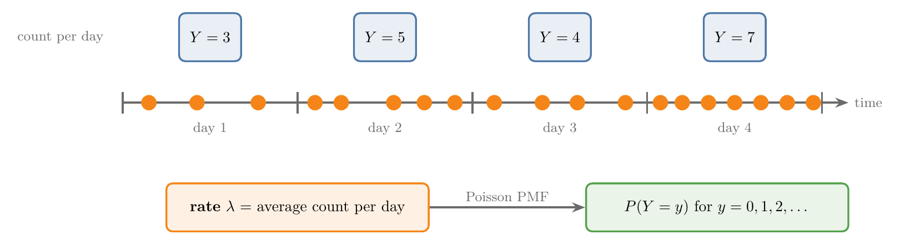
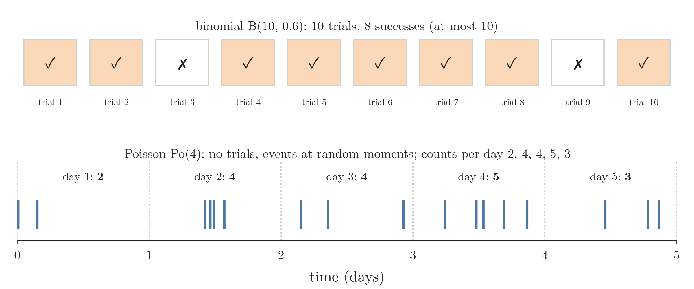
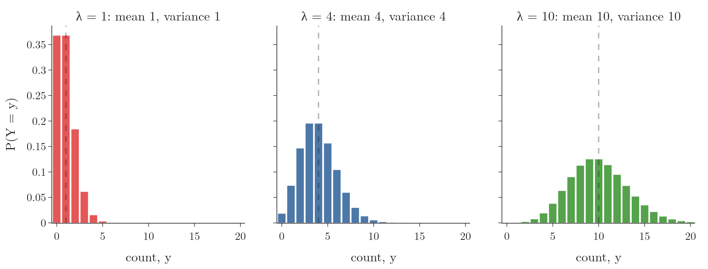
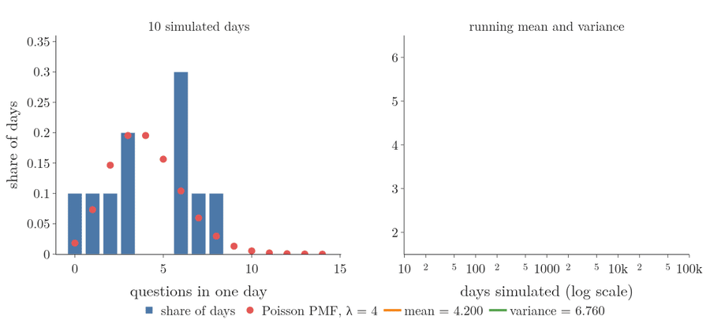
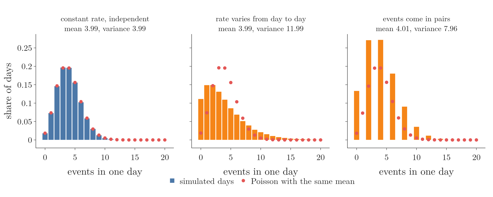
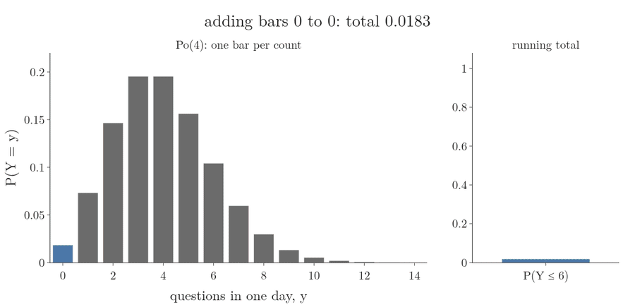
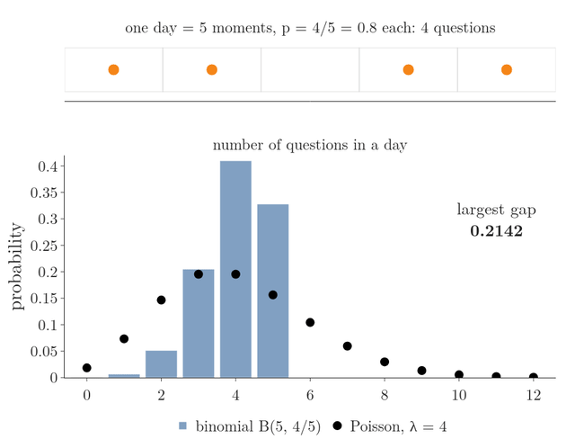

<!-- where-this-fits: generated by course_map/build_map.py; edit concepts.yaml, not this block -->
> **Where this fits:** Pipeline map step 0 (Foundations). See the [Course map](../../../00-course-map/00-course-map.md).
>
> 
>
> - **Builds on:** [Expected value and variance of a random variable](../../../MA/02-probability/MA-012-expected-value-and-variance/MA-012-expected-value-and-variance.md#3-expected-value); [Probability mass function (PMF)](../../../MA/03-distributions/MA-021-pmf-and-discrete-cdf/MA-021-pmf-and-discrete-cdf.md#3-the-probability-mass-function).
> - **Compare with:** [Bernoulli and binomial distributions](../../../MA/03-distributions/MA-031-bernoulli-and-binomial/MA-031-bernoulli-and-binomial.md#2-the-bernoulli-distribution).
<!-- /where-this-fits -->

## 1. Overview

> **Key point:** The Poisson distribution gives the probability of each count of events (0, 1, 2, ...) in a fixed interval of time or space, when we know only the average count $\lambda$.



Figure 1 shows the kind of data the Poisson distribution describes. Events (here, questions from students) arrive at random moments; we cut time into equal intervals (days) and count the events in each. The counts vary from day to day, but their average, the **rate** $\lambda$ (G-1633), stays about the same.

The Poisson distribution was named in one line in [famous PDFs](../MA-022-pdf-and-continuous-cdf/MA-022-pdf-and-continuous-cdf.md#6-famous-pdfs): a discrete distribution of counts, with parameter $\lambda$. This Note teaches it in full:

- what kind of question it answers, and its notation;
- its PMF, with a worked example;
- the shape of its graph and how $\lambda$ moves it;
- its mean and variance, which are both $\lambda$;
- probabilities of a range of counts;
- its link to the binomial distribution, and where it is used.

## 2. What the Poisson distribution describes

> **Key point:** A Poisson variable counts how often an event happens in one interval; instead of a success probability, we need the average count per interval.

### 2.1 Counts in an interval

> **Key point:** The binomial distribution needs a number of trials and a probability; the Poisson distribution needs only a rate.

The **binomial distribution** (G-308) counts successes in a fixed number $n$ of trials, each with success probability $p$ (see [the binomial distribution](../MA-031-bernoulli-and-binomial/MA-031-bernoulli-and-binomial.md#3-the-binomial-distribution)). Many counts have no trials to count:

- the questions students send in one day;
- the flashes of a firefly in 10 seconds;
- customers entering a shop in one hour;
- typing errors on one page of a book.

For these we know how **often** the event happens on average, its frequency in a standard interval of time or distance. The **Poisson distribution** (G-1509) turns that average into a probability for every possible count.

Figure 2 sets the two side by side. A binomial count is built from boxes we can number: 10 trials, each a success or not, so the count can never pass 10. A Poisson count has no boxes: events land at random moments on a time line, and we simply count how many fall in each day.



For example, a firefly lights up 3 times in 10 seconds on average. The Poisson distribution answers questions such as: how likely is it that it lights up 8 times in 20 seconds?

### 2.2 Notation

> **Key point:** $Y \sim \text{Po}(\lambda)$ reads: $Y$ follows a Poisson distribution with rate $\lambda$.

A distribution is often written as a short name with its **parameters** (G-1448) in brackets. The symbol $\sim$ reads "follows":

| Notation | Read as | Parameters |
|---|---|---|
| $X \sim \text{Bern}(p)$ | Bernoulli with success probability $p$ | $p$ |
| $X \sim B(n, p)$ | binomial with $n$ trials and success probability $p$ | $n$, $p$ |
| $Y \sim \text{Po}(\lambda)$ | Poisson with rate $\lambda$ | $\lambda$ |

For example, $X \sim B(10, 0.6)$ means 10 trials with success probability 0.6 each, and $Y \sim \text{Po}(4)$ means a count that is 4 on average. The Poisson distribution has a single parameter, $\lambda$ (lambda), the average number of events per interval.

### 2.3 The values a Poisson variable can take

> **Key point:** The count starts at 0 and has no upper limit.

A count can never be negative, so the possible values start at 0. Unlike the binomial count, which stops at $n$, a Poisson count has no cap: in principle the students could send 50 questions in one day. Such large counts are possible, only extremely unlikely.

## 3. The Poisson PMF

> **Key point:** $P(Y = y) = \dfrac{\lambda^{y} e^{-\lambda}}{y!}$, for $y = 0, 1, 2, \dots$

### 3.1 The example: a spike in questions

> **Key point:** Students usually ask 4 questions a day; yesterday they asked 7. How likely was exactly 7?

Suppose we run an online help forum on probability. Students usually ask around 4 questions per day, but yesterday they asked 7. To judge whether this spike is unusual, we want the probability of exactly 7 questions in one day.

The three ingredients:

- the interval is one working day;
- the average count per interval is 4, so $\lambda = 4$;
- the count we ask about is 7, so $y = 7$.

### 3.2 Two pieces of the formula

> **Key point:** $e \approx 2.718$ is a fixed number, and $e^{-\lambda}$ means $1 / e^{\lambda}$.

The formula uses two pieces of notation:

- **Euler's number** $e$ (G-716), also called Napier's constant, is a fixed number, $e \approx 2.71828$. It turns up across mathematics, physics and nature; here we only need its value.
- A **negative power** (G-1311) means one over the positive power:

  $$a^{-n} = 1 / a^{n}$$

  So for $e^{-4}$:

  $$e^{-4} = 1 / e^{4}$$

  $$e^{-4} = 1 / 54.6 = 0.0183$$

The factorial $y!$ is the product $1 \times 2 \times \dots \times y$, with $0! = 1$ (as in the binomial coefficient of [the binomial formula](../MA-031-bernoulli-and-binomial/MA-031-bernoulli-and-binomial.md#5-the-binomial-formula)).

### 3.3 Exactly 7 questions

> **Key point:** $P(Y = 7) = 0.060$: about one day in 17 brings exactly 7 questions.

1. **In words:** raise the rate to the power of the count, multiply by $e$ to the power of minus the rate, and divide by the factorial of the count.
2. **Formula:**
   $$P(Y = y) = \frac{\lambda^{y}\thinspace e^{-\lambda}}{y!}$$

   for every count $y = 0, 1, 2, \dots$
3. **Example:** with $\lambda = 4$ and $y = 7$:

   $$P(Y = 7) = \frac{4^{7}\thinspace e^{-4}}{7!}$$

   $$P(Y = 7) = \frac{16384 \times 0.0183}{5040}$$

   $$P(Y = 7) = \frac{300.1}{5040} = 0.0595$$


So there was only about a 6% chance of exactly 7 questions. The bar at 7 in the left panel of Figure 3 has this height.

> **Python:** `stats.poisson` gives the PMF in one call.
>
> ```python
> import math
> from scipy import stats
>
> 4 ** 7 * math.exp(-4) / math.factorial(7)   # 0.0595, by hand
> # scipy: pmf(y, lambda)
> stats.poisson.pmf(7, 4)                     # 0.0595
> ```


### 3.4 Scaling the rate to the interval

> **Key point:** $\lambda$ belongs to one interval length; for a longer or shorter interval, scale it in proportion.

The firefly flashes 3 times in 10 seconds on average, and we ask about 20 seconds. Twice the interval means twice the average:

$$\lambda = 3 \times 20 / 10 = 6$$

1. **In words:** the probability of 8 flashes when 6 are expected.
2. **Formula:**
   $$P(Y = 8) = \frac{6^{8}\thinspace e^{-6}}{8!}$$
3. **Example:**

   $$P(Y = 8) = \frac{1679616 \times 0.002479}{40320}$$

   $$P(Y = 8) = \frac{4163.4}{40320}$$

   $$P(Y = 8) = 0.103$$


> **Extra:** Using $\lambda = 3$ (the rate for 10 seconds) with a 20-second question is a common mistake. The rate and the interval must always match.

## 4. The graph of the Poisson distribution

> **Key point:** One bar per count, starting at 0 and running on to the right without end; the bars are tallest near $\lambda$.

The graph of a Poisson distribution plots each count $y$ against its probability. Figure 3 shows it for $\lambda = 4$:

- it starts at 0, since no event can happen a negative number of times;
- it peaks at 3 and 4 (both have probability 0.195);
- it has a tail to the right that never ends, though after about 12 the bars are too small to see.

The bars add to 1, as in every **probability mass function (PMF)** (G-1572; see [the probability mass function](../MA-021-pmf-and-discrete-cdf/MA-021-pmf-and-discrete-cdf.md#3-the-probability-mass-function)).



Figure 4 shows how $\lambda$ changes the shape:

- **$\lambda = 1$:** most days have 0 or 1 events; the distribution is strongly right-skewed (**skewness**, G-1817; see [skewness](../MA-026-skewness/MA-026-skewness.md#2-skewness-as-distance-from-the-normal-shape)).
- **$\lambda = 4$:** the peak moves right and the bars spread out; a mild right skew remains.
- **$\lambda = 10$:** the peak sits at 9 and 10, the spread is wider, and the shape is close to a symmetric bell.

> **Extra:** The skewness of a Poisson distribution is $1/\sqrt{\lambda}$ (NIST Handbook §1.3.6.6.19): 1 for $\lambda = 1$, 0.5 for $\lambda = 4$, 0.32 for $\lambda = 10$. It shrinks towards 0 as $\lambda$ grows, which matches Figure 4: the shape gets closer to a symmetric bell, a normal distribution with mean $\lambda$ and variance $\lambda$ (see [what the normal distribution is](../MA-024-normal-distribution/MA-024-normal-distribution.md#2-what-the-normal-distribution-is)).

## 5. Mean and variance

> **Key point:** A Poisson variable has mean $\lambda$ and variance $\lambda$: one number fixes both its centre and its spread.

The **expected value** (G-725) is the sum of every value times its probability (see [expected value](../../02-probability/MA-012-expected-value-and-variance/MA-012-expected-value-and-variance.md#3-expected-value)). Applied to the Poisson PMF, this long sum simplifies to $\lambda$. The variance, from the same shortcut formula $E[Y^2] - (E[Y])^2$, is also $\lambda$.

1. **In words:** the average count is the rate, and so is the variance; the **standard deviation** (G-1871) is the square root of the rate.
2. **Formula:**

   $$E[Y] = \lambda$$

   $$\mathrm{Var}(Y) = \lambda$$

   $$\sigma = \sqrt{\lambda}$$

3. **Example:** for the questions, $\lambda = 4$: on average 4 questions per day, variance 4.

   $$\sigma = \sqrt{4} = 2$$

   So 7 questions is this many standard deviations above the mean:

   $$(7 - 4)/2 = 1.5$$

A simulation of 100,000 days with `rng.poisson(lam=4)` gives an average of 3.994 and a variance of 3.987, both close to 4. Figure 5 shows the simulation growing. With 10 days the bars are ragged and the variance is 6.76; as days are added, the bars settle onto the Poisson dots, and the running mean and variance both settle on 4.



> **Extra:** Why the mean is $\lambda$. Writing out the sum and cancelling one $y$ against $y!$:
>
> $$E[Y] = \sum_{y=0}^{\infty} y\thinspace\frac{\lambda^{y} e^{-\lambda}}{y!}$$
>
> $$E[Y] = \lambda \sum_{y=1}^{\infty} \frac{\lambda^{y-1} e^{-\lambda}}{(y-1)!}$$
>
> $$E[Y] = \lambda \times 1 = \lambda$$
>
> The remaining sum is the Poisson PMF summed over all counts, which is 1. The same trick, cancelling $y(y-1)$ against $y!$, gives:
>
> $$E[Y(Y-1)] = \lambda^2$$
>
> $$E[Y^2] = E[Y(Y-1)] + E[Y] = \lambda^2 + \lambda$$
>
> $$\mathrm{Var}(Y) = \lambda^2 + \lambda - \lambda^2 = \lambda$$

> **Extra:** Mean equal to variance is a quick check on real count data. A variance clearly larger than the mean is called **overdispersion** (G-1428). The notebook tests two causes by breaking one Poisson condition at a time while keeping the mean near 4:
>
> | Simulated days (100,000) | Mean | Variance | $P(Y \ge 12)$ seen | Poisson with the same mean says |
> |---|---|---|---|---|
> | constant rate, independent events | 3.99 | 3.99 | 0.0008 | 0.0009 |
> | rate varies from day to day | 3.99 | 11.99 | 0.0382 | 0.0009 |
> | events come in pairs (not independent) | 4.01 | 7.96 | 0.0163 | 0.0009 |
>
> Each broken condition raises the variance above the mean, and the Poisson model then underestimates days with 12 or more events by a factor of about 20 to 40. With both conditions kept, mean, variance and tail all match.



Figure 6 draws the table. The first panel sits on the Poisson dots. When the rate changes from day to day, the bars spread out in both directions, with more empty days and a longer tail. When events come in pairs, only even counts occur, and their bars are taller and wider than the Poisson dots.

## 6. Probability of a range of counts

> **Key point:** For "at least", "at most" or "between", add the probabilities of the single counts in the range.

The counts $0, 1, 2, \dots$ are separate outcomes: one day cannot have both exactly 6 and exactly 7 questions. So the probability of a range is the **sum** of the bars in it, as for any discrete distribution (see [the CDF of a discrete variable](../MA-021-pmf-and-discrete-cdf/MA-021-pmf-and-discrete-cdf.md#8-the-cumulative-distribution-function-of-a-discrete-variable)).

1. **In words:** the probability of 7 or more questions is everything except 0 to 6.
2. **Formula:**
   $$P(Y \ge 7) = 1 - P(Y \le 6)$$

   $$P(Y \le 6) = \sum_{y=0}^{6} \frac{4^{y}\thinspace e^{-4}}{y!}$$
   The symbol $\sum_{y=0}^{6}$ means "add the terms for $y = 0, 1, 2, \dots, 6$".
3. **Example:** the bars for 0 to 6 are 0.0183, 0.0733, 0.1465, 0.1954, 0.1954, 0.1563 and 0.1042:

   $$P(Y \le 6) = 0.0183 + 0.0733 + 0.1465$$

   $$\qquad + 0.1954 + 0.1954 + 0.1563$$

   $$\qquad + 0.1042$$

   $$P(Y \le 6) = 0.8894$$

   The sum of the unrounded bars is 0.8893, the value the Figure 7 column reaches. Then
   $$P(Y \ge 7) = 1 - 0.8893 = 0.111$$

The right panel of Figure 3 shows these red bars. A day with 7 or more questions happens about once in 9 days: unusual, but not rare. Figure 7 does the sum one bar at a time: the bars for 0 to 6 stack up into a column of height 0.8893, and the gap left to 1 is $P(Y \ge 7)$.



More examples with $\lambda = 4$:

| Question | Probability |
|---|---|
| no questions at all, $P(Y = 0)$ | 0.018 |
| at most 2, $P(Y \le 2)$ | 0.238 |
| between 2 and 6, $P(2 \le Y \le 6)$ | 0.798 |

> **Python:** `cdf`, the **cumulative distribution function** (G-515), adds the bars up to a count; `sf` adds the bars above it.
>
> ```python
> questions = stats.poisson(4)
> questions.sf(6)                          # 0.111: P(Y >= 7)
> questions.cdf(2)                         # 0.238: P(Y <= 2)
> questions.cdf(6) - questions.cdf(1)      # 0.798: P(2 <= Y <= 6)
> ```

## 7. The Poisson distribution as a limit of the binomial

> **Key point:** A binomial count with many trials and a small success probability is close to a Poisson count with $\lambda = np$. This is a **limit**: the Poisson PMF is the value the binomial PMF settles on as $n$ grows without end.

A website has 1000 visitors a day, and each visitor buys with probability 0.004. The number of buyers is binomial, $B(1000, 0.004)$, with mean $np = 4$. The count is also, very nearly, $\text{Po}(4)$.

{height=45%}

Figure 8 keeps $np = 4$ and lets $n$ grow. The top strip shows one simulated day cut into $n$ moments, with a dot where a question arrived. Watch the bars: at $n = 5$ they are bunched around 4, and as the moments get finer they spread out and sit on the Poisson dots.

| $n$ | $p$ | Largest gap between the two PMFs |
|---|---|---|
| 10 | 0.4 | 0.055 |
| 40 | 0.1 | 0.011 |
| 1000 | 0.004 | 0.0004 |

With 10 trials the binomial is narrower than the Poisson: its variance is below 4.

$$np(1-p) = 10 \times 0.4 \times 0.6 = 2.4$$

With 1000 trials $1 - p$ is almost 1, the variance is almost $\lambda$, and the bars sit on the dots:

$$np(1-p) = 1000 \times 0.004 \times 0.996 = 3.98$$

The binomial limit is where the Poisson distribution comes from. Cut a day into many tiny moments; in each, a question arrives or not, with a tiny probability. The count is binomial with huge $n$ and tiny $p$, and in the limit it becomes Poisson. The approximation needs $n$ large and $p$ small (Ross §4.7). For example, at $n = 20$ and $p = 0.05$ the notebook finds a largest gap of about 0.01, and the gap grows when $p$ is larger.

### 7.1 Cutting the day finer

> **Key point:** Treating each hour as one trial misses hours with two questions; cutting the day into ever smaller moments removes that flaw, and the binomial count becomes the Poisson count.

The forum of section 3 gets 4 questions a day on average. We can try to count them with a binomial distribution, in three steps.

1. **Hours as trials.** Cut the day into 24 hours and call each hour a trial: a question arrives in it or not. The mean must stay 4, so $p$ is 4 shared over 24 hours:

   $$np = 4$$

   $$p = 4/24$$

   The count is $B(24, 4/24)$, which gives:

   $$P(7) = 0.0557$$

2. **The flaw.** Two questions can arrive in the same hour, and a trial can only count one success. The hour is too coarse.
3. **Finer moments.** Cut the day into 1440 minutes, with $p$ now 4 shared over 1440 minutes:

   $$p = 4/1440$$

   Two questions in one minute are rare, and:

   $$P(7) = 0.0595$$

   Seconds are better still. Letting the number of moments $n$ grow without limit removes the flaw completely, and $P(7)$ settles at the Poisson value 0.0595 of section 3.3.

The top strip of Figure 8 is this cutting: the same day, in more and more cells.

### 7.2 Deriving the PMF

> **Key point:** Write the binomial PMF with $p = \lambda / n$, split it into four factors, and let $n$ grow: two factors go to 1, one goes to $e^{-\lambda}$, and $\lambda^k / k!$ is left unchanged.

The derivation needs one fact about $e$: for any number $a$, the value of $(1 + a/n)^n$ gets closer and closer to $e^{a}$ as $n$ grows. With $a = -4$ and $n = 1000$:

$$(1 - 4/1000)^{1000} = 0.0182$$

$$e^{-4} = 0.0183$$

The two are close.

1. **Start from the binomial PMF** for $k$ successes in $n$ trials, with $p = \lambda/n$:
   $$P(Y = k) = \frac{n!}{k!\thinspace(n-k)!}$$

   $$\qquad \times \left(\frac{\lambda}{n}\right)^{k} \left(1 - \frac{\lambda}{n}\right)^{n-k}$$
2. **Simplify the factorials.** $n!/(n-k)!$ is the product of the top $k$ numbers, $n(n-1)\cdots(n-k+1)$. For example:

   $$7!/5! = 7 \times 6$$

3. **Regroup into four factors:**
   $$P(Y = k) = \frac{n(n-1)\cdots(n-k+1)}{n^{k}}$$

   $$\qquad \times \frac{\lambda^{k}}{k!}$$

   $$\qquad \times \left(1 - \frac{\lambda}{n}\right)^{n}$$

   $$\qquad \times \left(1 - \frac{\lambda}{n}\right)^{-k}$$
4. **Let $n$ grow**, one factor at a time:
   - The first factor is a product of $k$ fractions, $\frac{n}{n} \times \frac{n-1}{n} \times \cdots$, each close to 1. It goes to 1. At $n = 1000$ and $k = 7$ it is 0.979.
   - The second factor has no $n$ in it and stays $\lambda^{k}/k!$.
   - The third factor goes to $e^{-\lambda}$, by the fact about $e$ above.
   - The fourth factor is a number close to 1 raised to a fixed power. It goes to 1. At $n = 1000$, $\lambda = 4$ and $k = 7$ it is 1.028.
5. **Result:**
   $$P(Y = k) = \frac{\lambda^{k}\thinspace e^{-\lambda}}{k!}$$

The result is the Poisson PMF of section 3, with $k$ in place of $y$. The $e^{-\lambda}$ in it is what is left of "no question in almost every moment", and the $k!$ comes from the binomial coefficient.

## 8. When a count is Poisson, and where it is used

> **Key point:** Events must happen one at a time, independently, at a constant average rate; then counts of arrivals, calls, clicks or defects are Poisson.

A count follows a Poisson distribution when these three conditions hold (Ross §4.7):

1. **Events are independent** (G-934; see [independent events](../../02-probability/MA-016-independent-events/MA-016-independent-events.md#2-the-definition)). One question does not make the next more or less likely.
2. **The rate is constant.** The average count is the same for every interval of the same length; an exam week with more questions breaks this.
3. **Events happen one at a time.** Two events never happen at exactly the same moment.

Typical Poisson counts:

- customers arriving at a shop or a website per hour;
- calls to a support centre per minute;
- defects per metre of cable, typos per page;
- goals in a football match (Maher 1982);
- rare-event counts, such as accidents at a crossing per month.

In machine learning, a **target** (G-1949; the output we predict) that is a count, such as bike rentals per hour or insurance claims per year, is often modelled with **Poisson regression** (G-1510). The model predicts $\lambda$ for each **observation** (G-1374; one record, a row of the data table) from its **features** (G-772; the input variables); scikit-learn has it as `PoissonRegressor` (scikit-learn docs). Counts of words in a document also appear in text models.

## 9. Summary

| | Binomial | Poisson |
|---|---|---|
| Counts | successes in $n$ trials | events in one interval |
| Notation | $B(n, p)$ | $\text{Po}(\lambda)$ |
| Parameters | $n$, $p$ | $\lambda$ |
| Values | $0$ to $n$ | $0, 1, 2, \dots$ without limit |
| PMF | $\binom{n}{y} p^y (1-p)^{n-y}$ | $\lambda^{y} e^{-\lambda} / y!$ |
| Mean, variance | $np$, $np(1-p)$ | $\lambda$, $\lambda$ |
| Example | 2 likes out of 3 viewers, $p = 0.5$: 3/8 | 7 questions when 4 are usual: 0.060 |

- Use the table to choose: Poisson when only the average count per interval is known, binomial when the number of trials and the success probability are known.
- The Poisson distribution needs only the average count per interval, $\lambda$; scale $\lambda$ when the interval changes, because $\lambda$ belongs to one interval length (3 flashes in 10 seconds means 6 in 20).
- Its graph starts at 0, peaks near $\lambda$ and has an endless right tail; a larger $\lambda$ moves it right and spreads it out, because $\lambda$ is both the mean and the variance.
- Mean and variance are both $\lambda$, so a variance clearly larger than the mean in real count data warns that the Poisson model underestimates big counts.
- A range of counts has the sum of the single-count probabilities, because one interval cannot hold two different counts at once.
- A binomial with large $n$ and small $p$ is approximately Poisson with $\lambda = np$, because cutting the interval into ever finer moments turns the binomial PMF into the Poisson PMF.
- This answers the opening question: knowing only the average count $\lambda$, the Poisson PMF gives the probability of each count in an interval.

## 10. Sources

**Built from**

- 365 Data Science, "Data Science & Statistics Tutorial: The Poisson Distribution", YouTube, https://www.youtube.com/watch?v=BbLfV0wOeyc
- Khan Academy, "Poisson process 1 | Probability and Statistics | Khan Academy", YouTube, https://www.youtube.com/watch?v=3z-M6sbGIZ0
- Khan Academy, "Poisson process 2 | Probability and Statistics | Khan Academy", YouTube, https://www.youtube.com/watch?v=Jkr4FSrNEVY

**Other references**

- Maher, M. J. (1982). "Modelling Association Football Scores". *Statistica Neerlandica* 36(3).
- NIST/SEMATECH (2012). *e-Handbook of Statistical Methods*. itl.nist.gov/div898/handbook. Section 1.3.6.6.19, Poisson distribution.
- Ross, S. (2010). *A First Course in Probability*, 8th ed. Pearson. Section 4.7, the Poisson random variable.
- scikit-learn documentation. `sklearn.linear_model.PoissonRegressor`.

## 11. Key terms

| Term | Meaning |
|---|---|
| Poisson distribution | The distribution of the number of events in a fixed interval, given their average count $\lambda$ |
| Rate $\lambda$ | The average number of events per interval; the only parameter of the Poisson distribution |
| $Y \sim \text{Po}(\lambda)$ | Notation: $Y$ follows a Poisson distribution with rate $\lambda$; likewise $\text{Bern}(p)$ and $B(n, p)$ |
| Euler's number $e$ | A fixed number, about 2.71828, that appears in the Poisson PMF |
| Negative power | A power with a minus sign, which means one over the positive power: $a^{-n} = 1/a^{n}$, so $2^{-3} = 1/8$. |
| Overdispersion | Counts that are much more spread out than their mean suggests (variance clearly larger than the mean), a sign that a Poisson model does not fit. |
| Poisson regression | A model for a count target, such as bike rentals per hour: it predicts the average count $\lambda$ for each row from its features, and the Poisson distribution then gives the probability of each count. |
