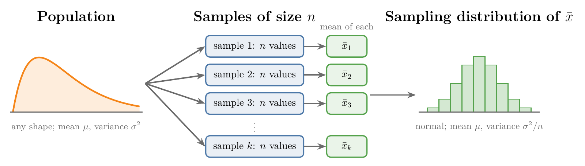
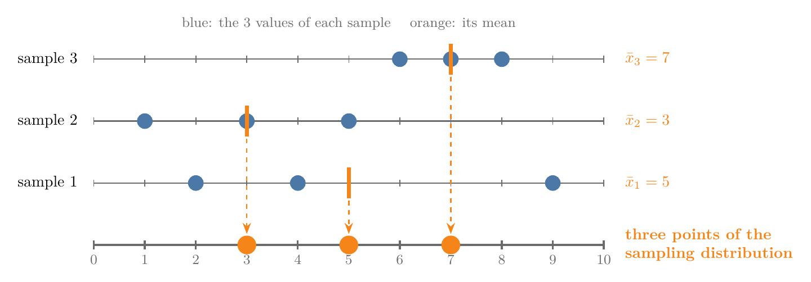
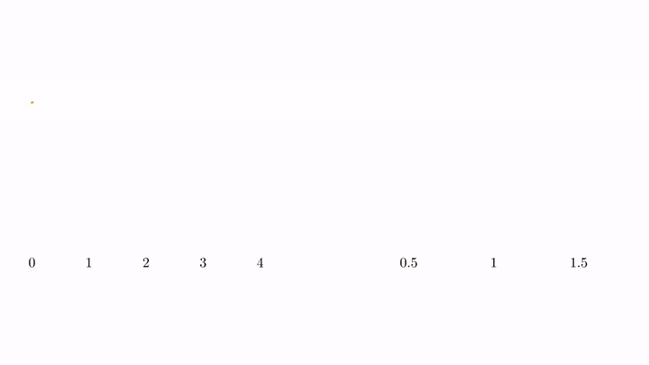
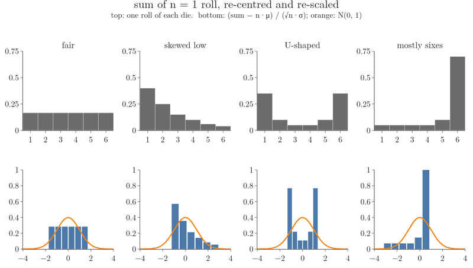
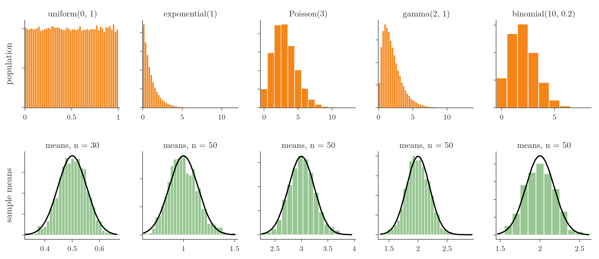
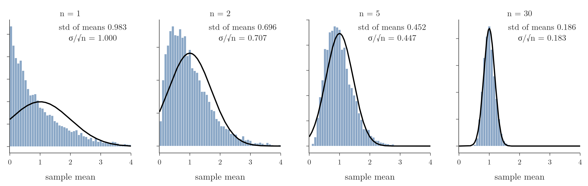
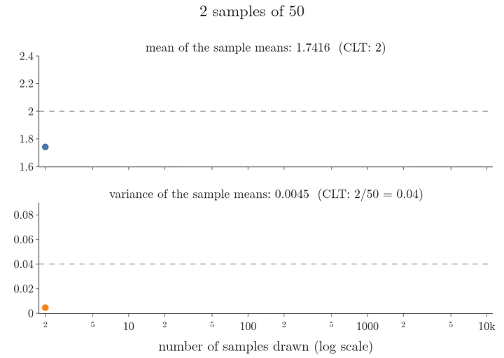

<!-- where-this-fits: generated by course_map/build_map.py; edit concepts.yaml, not this block -->
> **Where this fits:** Pipeline map step 0 (Foundations). See the [Course map](../../../00-course-map/00-course-map.md).
>
> 
>
> - **Builds on:** Population, sample, parameter and statistic ([Note MA-004](../../../MA/01-descriptive-stats/MA-004-what-is-statistics/MA-004-what-is-statistics.md)); Normal distribution ([Note MA-020](../../../MA/03-distributions/MA-020-random-variables-and-distributions/MA-020-random-variables-and-distributions.md)).
> - **Leads to:** Confidence intervals ([Note MA-035](../../../MA/04-inference/MA-035-confidence-intervals-z-procedure/MA-035-confidence-intervals-z-procedure.md)); Hypothesis testing: null and alternative ([Note MA-038](../../../MA/04-inference/MA-038-null-and-alternative-hypotheses/MA-038-null-and-alternative-hypotheses.md)); Z-test and rejection regions ([Note MA-039](../../../MA/04-inference/MA-039-rejection-region-and-z-test/MA-039-rejection-region-and-z-test.md)).
<!-- /where-this-fits -->

## 1. Overview

> **Key point:** Take many samples of the same size, compute each sample's mean, and the means form a normal distribution centred on the population mean, whatever the shape of the population.



Figure 1 shows the process this Note is built on. We draw many samples of size $n$ from a population, compute one number per sample (here the mean), and look at the distribution of those numbers. That distribution is a **sampling distribution** (G-1736).

The **central limit theorem (CLT)** (G-364) says what this distribution looks like for the mean: a normal curve with the population's mean and a spread that shrinks as $n$ grows. Here $n$ is the number of values in one sample (50 people, in the salary example below), $\mu$ is the population mean, and $\sigma^2$ is the population variance, the average squared distance of a value from $\mu$. The CLT holds for skewed, flat and even discrete populations, and it is the base of the next topics, confidence intervals and hypothesis testing.

This Note covers:

- the sampling distribution of a statistic;
- the statement of the CLT and its conditions;
- the mean $\mu$ and variance $\sigma^2/n$ of the sample means, and the standard error;
- simulations from five non-normal populations;
- why the CLT matters.

## 2. Population and sample, in brief

> **Key point:** We want a number about the whole population, but we can only measure samples.

Recap (see the [what is statistics Note](../../01-descriptive-stats/MA-004-what-is-statistics/MA-004-what-is-statistics.md)): the **population** (G-1525) is the entire group we want to study; a **sample** (G-1731) is the part we actually measure. A number computed from the population, such as $\mu$, is a **parameter** (G-1448); the same number computed from a sample, such as $\bar{x}$, is a **statistic** (G-1880).

Our running example is the average monthly salary in India. The population is the salary of all 140 crore people. Asking all of them is impossible, so we ask, say, 50,000 people chosen at random from every state and district, and infer the national average from them.

## 3. Sampling distributions

> **Key point:** A sampling distribution is the distribution of a statistic (a mean, a variance, a proportion) computed from many independent samples of the same size from one population.

The salaries of the whole population are a set of numbers, so they follow some distribution. Most likely a skewed one: many people earn little and a few earn a lot, like the orange curve of Figure 1. We do not know its exact shape.

Now we build a sampling distribution in four steps:

1. Choose a **sample size** (G-1727), say $n = 50$ people.
2. Draw 50 people at random and record their salaries: sample 1.
3. Repeat, drawing a new random sample of 50 each time, until we have, say, 100 samples: 100 sets of 50 numbers.
4. Compute the mean of every sample: $\bar x_1, \bar x_2, \dots, \bar x_{100}$.

These 100 sample means form the **sampling distribution of the sample mean**. Two sizes must not be confused: the sample size is $n = 50$ (people per sample); the number of samples is 100.

The statistic need not be the mean. If we compute the variance of each of the 100 samples instead, the 100 sample variances form the **sampling distribution of the sample variance**. The same works for the standard deviation, the coefficient of variation or a proportion.

A small case with three samples of size $n = 3$ shows the idea in numbers. Each sample gets one mean:

$$\bar x_1 = \frac{2 + 4 + 9}{3} = \frac{15}{3} = 5$$

$$\bar x_2 = \frac{1 + 3 + 5}{3} = \frac{9}{3} = 3$$

$$\bar x_3 = \frac{6 + 7 + 8}{3} = \frac{21}{3} = 7$$

The numbers 5, 3 and 7 are three points of the sampling distribution of the mean. The formal version, for $k$ samples of size $n$, names the values $x_{ij}$ (the $i$-th value of sample $j$; above, $x_{21} = 4$ is the second value of sample 1):

$$\bar x_j = \frac{1}{n}\sum_{i=1}^{n} x_{ij}, \qquad j = 1, \dots, k$$

The symbol $\sum_{i=1}^{n}$ means "add the values for $i = 1$ up to $i = n$". For sample 1 it is:

$$2 + 4 + 9 = 15$$

The sampling distribution is the distribution of $\bar x_1, \dots, \bar x_k$; here $k = 3$.

Figure 2 draws this example. Watch each orange mark: it sits at the balance point of its sample's three blue values, and only the marks drop to the bottom line, where the sampling distribution is built.



### 3.1 Why sampling distributions matter

> **Key point:** A sampling distribution shows how much a statistic varies from sample to sample, and that variability is what inference needs.

Every sample of 50 people gives a slightly different mean. The sampling distribution measures exactly how different: it shows the **variability of a sample statistic**. Knowing that variability lets us:

- compute confidence intervals for a population parameter;
- perform hypothesis tests;
- predict a population parameter, such as the mean, from sample data.

The first two are the topics of later Notes. The third is the subject of this Note and the next one.

## 4. The central limit theorem

> **Key point:** The sample means of large independent samples follow a normal distribution, regardless of the distribution of the population.

The idea in plain words, on dice. One die is flat: every face from 1 to 6 is equally likely, and the mean of one die is 3.5. Now roll 30 dice and take the average. The average almost never lands near 1 or 6, because that needs nearly every die to be low, or nearly every die to be high. Most averages land near 3.5, and the further from 3.5, the rarer they get: a bell. Figure 4, further down, tests this with four very different dice.

This is the **central limit theorem** (CLT, G-364). In plain words: the distribution of the sample means of many independent and identically distributed values approaches a normal distribution, regardless of the distribution of the values themselves.

A worked case on a skewed population. An exponential population (most values near 0, a few large) has mean 1 and variance 1. For samples of $n = 30$:

$$\text{variance of the sample means} = \frac{1}{30} = 0.0333$$

$$\text{standard deviation} = \sqrt{0.0333} = 0.183$$

So the CLT predicts that the 30-value sample means pile up in a bell centred at 1 with standard deviation 0.183.



Figure 3 runs this experiment, with the numbers above. The population on the left is strongly skewed: most values are near 0 and a few are large. Each sample of 30 values gives one mean, which drops into the histogram on the right. After 2000 samples, the histogram is close to the bell of $N(1, 1/30)$.

The formal version of the prediction, for samples of size $n$ from a population with mean $\mu$ and variance $\sigma^2$, is:

$$\bar{X} \thickspace\approx\thickspace N\negthinspace\left(\mu,\thickspace\frac{\sigma^2}{n}\right) \quad \text{for large } n$$

Here $\bar X$ is the sample mean, and $N(\mu, \sigma^2/n)$ is the normal distribution with mean $\mu$ and variance $\sigma^2/n$. Check against the worked case, with $\mu = 1$ and $\sigma^2 = 1$:

$$N\negthinspace\left(1,\thickspace\frac{1}{30}\right) = N(1,\thickspace0.0333)$$

In the salary example: draw 100 people, record the mean salary, repeat 1000 times, and plot the 1000 means. The CLT says the plot is a normal curve. The shape of the salaries themselves does not matter. They may be:

- log-normal;
- uniform (every salary in a range equally likely);
- Pareto;
- binomial;
- or no named distribution at all.

Figure 4 tests this with four very different dice: a fair one, one that mostly rolls low, a U-shaped one that mostly rolls 1 or 6, and one that mostly rolls 6. For each die we compute the exact distribution of the sum of $n$ rolls. The sums drift to the right and spread out as $n$ grows, so to compare their shapes we re-centre and re-scale each one: subtract its mean $n\mu$ and divide by its standard deviation $\sqrt{n}\thinspace\sigma$ (section 4.2). For a fair die $\mu = 3.5$ and $\sigma = 1.71$, so the sum of 30 rolls has this mean and standard deviation:

$$30 \times 3.5 = 105$$

$$\sqrt{30} \times 1.71 = 9.4$$

Watch the bottom row: at $n = 1$ the four shapes are as different as the dice; by $n = 10$ they are close to one bell; at $n = 50$ all four sit on the same curve, the **standard normal distribution** $N(0, 1)$ (G-1873). Re-scaling the mean instead of the sum gives exactly the same picture, since the mean is the sum divided by $n$.



The CLT makes no claim about the shape of the population or of a single sample. A sample of 100 salaries still looks skewed; only the **means** of many samples form a bell.

> **Extra:** The CLT is a proved theorem, not just an observed fact of nature: Laplace proved a first version in 1810 and Lyapunov a general one in 1901 (Fischer 2011). The intuition: a sample mean adds up many independent pieces, so unusually large and unusually small values tend to cancel, and the sum forgets the shape of each piece. Among shapes with a finite variance, the normal curve is the only one that stays the same when we add copies and rescale (Feller 1971, §VI.1).

### 4.1 Conditions

> **Key point:** The CLT needs a large enough sample (usually $n \ge 30$), a population with finite variance, and independent, identically distributed values.

1. **Large enough sample size.** The usual rule is $n \ge 30$, a rule of thumb rather than a sharp limit. How many values are enough depends on the population's shape: a symmetric population gives bell-shaped means already at small $n$, while a very skewed one needs more (see the Extra box on how fast the means become normal, and section 5.1).
2. **Finite variance.** The population must have a finite variance. Every finite population has one; a theoretical infinite population, such as a Pareto distribution with a small $\alpha$, may not (see the Extra box on infinite variance below).
3. **Independent and identically distributed (i.i.d.) values.** **Independent**: one value does not affect another. **Identically distributed**: every value comes from the same population, so each has the same distribution. Drawing at random from one population gives both.

> **Extra:** How fast the means become normal. For independent values the cumulants of a sum add up, just like the variance (the second cumulant). The $r$-th cumulant of $\bar{X}$ is therefore $n\kappa_r/n^r$, and dividing the third by $\sigma_{\bar{x}}^3$ and the fourth by $\sigma_{\bar{x}}^4$ gives:
>
> $$\sigma_{\bar{x}}^3 = \sigma^3/n^{3/2}$$
>
> $$\sigma_{\bar{x}}^4 = \sigma^4/n^2$$
>
> $$\text{skewness of } \bar{X} = \frac{\gamma_1}{\sqrt{n}}$$
>
> $$\text{excess kurtosis of } \bar{X} = \frac{\gamma_2}{n}$$
>
> where $\gamma_1$ and $\gamma_2$ are the population's skewness and excess kurtosis. A symmetric population ($\gamma_1 = 0$) gives symmetric means at every $n$. For the uniform population ($\gamma_2 = -1.2$), $n = 5$ already gives skewness 0.02 and excess kurtosis $-0.24$ in the Notebook, matching:
>
> $$-1.2/5 = -0.24$$
>
> A very skewed population needs more. The exponential ($\gamma_1 = 2$) still has this skewness at $n = 30$ (section 5.1):
>
> $$2/\sqrt{30} = 0.37$$

> **Extra:** When the variance is infinite, the CLT fails. A Pareto distribution with $\alpha = 1.5$ has mean 3 but infinite variance (see the [Pareto Note](../../03-distributions/MA-030-pareto-and-power-law/MA-030-pareto-and-power-law.md)). In 5000 simulated samples, the skewness of the sample means is 17.8 for $n = 30$ and still 19.5 for $n = 300$: no bell appears. For such tails the generalised CLT says the scaled sums approach a skewed "stable" distribution, not a normal one (Gnedenko and Kolmogorov 1954). The Notebook also shows how one value can dominate: in samples of 300, the largest single value makes up at least 55% of the sample's total in 1% of the Pareto samples, against 3.4% at the same point for the exponential population.

### 4.2 Mean and variance of the sample means

> **Key point:** The sample means are centred on the population mean $\mu$, and their variance is $\sigma^2/n$; their standard deviation, $\sigma/\sqrt{n}$, is the standard error.

The CLT gives more than the shape. If the population has mean $\mu$ and variance $\sigma^2$:

- the mean of the sampling distribution is exactly $\mu$;
- its variance is $\sigma^2/n$, where $n$ is the **sample size** (not the number of samples).

The standard deviation of the sampling distribution has its own name, the **standard error** (G-1872) of the mean.

**The idea in plain words: bigger samples, tighter means.** One die has mean $\mu = 3.5$ and standard deviation $\sigma = 1.71$. Take the average of 100 dice and ask how far it can wander from 3.5:

**Step 1.** The sum of 100 dice has this mean and standard deviation:

$$\text{mean of the sum} = 100 \times 3.5 = 350$$

$$\text{standard deviation of the sum}$$

$$= \sqrt{100} \times 1.71$$

$$= 10 \times 1.71 = 17.1$$

**Step 2.** By the CLT the sum is about normal, so 95% of sums land within 2 standard deviations:

$$350 - 2 \times 17.1 = 316, \qquad 350 + 2 \times 17.1 = 384$$

**Step 3.** Dividing the sum by 100 gives the average of the 100 dice. The mean divides too, and the spread divides by 100:

$$\text{mean of the average} = \frac{350}{100} = 3.5$$

$$\text{standard error} = 17.1 \div 100 = 0.171$$

$$\text{check: } \sigma \div \sqrt{n} = 1.71 \div 10 = 0.171$$

$$3.5 - 2 \times 0.171 = 3.16$$

$$3.5 + 2 \times 0.171 = 3.84$$

A single die wanders over the whole range 1 to 6; the average of 100 dice stays within about 0.34 of 3.5. A larger sample gives a smaller standard error: four times the sample size halves it. So sample means from big samples cluster tightly around $\mu$.

**Why the square root.** When we add $n$ independent values, the **variances add**, not the standard deviations. So the sum has variance $n\sigma^2$ and standard deviation $\sqrt{n}\thinspace\sigma$: the spread of a sum grows, but only as $\sqrt{n}$. Dividing the sum by $n$ to get the mean divides that spread by $n$:

$$\frac{\sqrt{n}\thinspace\sigma}{n} = \frac{\sigma}{\sqrt{n}}$$

The Extra below writes the variance version out.

**A second worked case: a gamma population** with mean 2 and variance 2, samples of $n = 50$. The standard deviation is:

$$\sigma = \sqrt{2} = 1.414$$

The variance of the sample means is:

$$\sigma^2_{\bar{x}} = \frac{2}{50} = 0.04$$

$$\sqrt{50} = 7.071$$

$$SE = \frac{1.414}{7.071} = 0.2$$

The sample means vary around 2 with a standard deviation of only 0.2, while single values vary with a standard deviation of 1.414.

The formal version, which both cases follow, is the **standard error** of the mean (the standard deviation $\sigma_{\bar x}$ of the sample means):

$$SE = \sigma_{\bar{x}} = \sqrt{\frac{\sigma^2}{n}} = \frac{\sigma}{\sqrt{n}}$$

The population standard deviation is divided by the square root of the sample size. For the dice the standard error is 0.171 and for the gamma 0.2, as computed above.

> **Extra:** Why the variance is $\sigma^2/n$. For independent values, the variance of a sum is the sum of the variances, so $x_1 + \dots + x_n$ has variance $n\sigma^2$. Dividing by $n$ to get the mean divides the variance by $n^2$:
> $$\operatorname{Var}(\bar{X}) = \frac{n\sigma^2}{n^2} = \frac{\sigma^2}{n}$$
> This completes the argument of the [measures of dispersion Note](../../01-descriptive-stats/MA-006-measures-of-dispersion/MA-006-measures-of-dispersion.md) for Bessel's correction. There, measuring distances from $\bar{x}$ instead of $\mu$ lost the amount $n(\bar{x} - \mu)^2$. Its average is $n$ times the average of $(\bar{x} - \mu)^2$, which is the variance of $\bar x$:
>
> $$n \times \frac{\sigma^2}{n} = \sigma^2$$
>
> That is exactly one $\sigma^2$. So the sum of squared distances from $\bar{x}$ averages $(n-1)\sigma^2$, and dividing by $n - 1$ is right on average.

## 5. Simulating the CLT

> **Key point:** Simulations from uniform, exponential, Poisson, gamma and binomial populations all give bell-shaped sample means with the mean and spread the CLT predicts.

We test the theorem by simulation. We pretend a known distribution is the population, draw many samples from it, and plot the sample means.

> **Python:** A sampling distribution in three lines.
>
> ```python
> import numpy as np
>
> rng = np.random.default_rng(42)     # fixed seed
> samples = rng.uniform(0, 1, size=(1000, 30))
> sample_means = samples.mean(axis=1)
> ```
>
> `samples` has shape `(1000, 30)`: 1000 samples (rows) of size 30 (columns). `.mean(axis=1)` takes the mean of each row, giving 1000 sample means.

For a **uniform** population on $[0, 1]$ (see the [uniform and log-normal Note](../../03-distributions/MA-029-uniform-and-log-normal/MA-029-uniform-and-log-normal.md)), every value is equally likely: the population is flat, not bell-shaped. Yet the 1000 sample means of size 30 form a bell centred at 0.50, with standard deviation 0.052, matching the CLT's prediction:

$$\sqrt{(1/12)/30} = 0.053$$

With $n = 300$ the bell is narrower: 0.0166, against the predicted 0.0167.

The other populations behave the same way (Figure 5):

- **Exponential**: waiting times between random events; strongly right-skewed, $\mu = \sigma = 1$.
- **Poisson**: counts of events in a fixed interval (see the [PDF Note](../../03-distributions/MA-022-pdf-and-continuous-cdf/MA-022-pdf-and-continuous-cdf.md)); here with mean 3.
- **Gamma**: a right-skewed continuous distribution; here with mean 2 and variance 2.
- **Binomial**: successes in 10 trials with $p = 0.2$ (see the [Bernoulli and binomial Note](../../03-distributions/MA-031-bernoulli-and-binomial/MA-031-bernoulli-and-binomial.md)).



Every population in the top row has a different shape: flat, skewed, discrete. Every histogram in the bottom row is a bell that follows the black normal curve $N(\mu, \sigma^2/n)$.

| Population | Skewness of population | Mean of sample means | Std of sample means | CLT: $\sigma/\sqrt{50}$ | Skewness of means |
|---|---|---|---|---|---|
| exponential(1) | 2.00 | 0.998 | 0.143 | 0.141 | 0.26 |
| Poisson(3) | 0.58 | 2.993 | 0.249 | 0.245 | 0.06 |
| gamma(2, 1) | 1.41 | 2.002 | 0.195 | 0.200 | 0.13 |
| binomial(10, 0.2) | 0.47 | 1.996 | 0.183 | 0.179 | 0.05 |

The skewness drops from up to 2.00 in the populations to at most 0.26 in the sample means (see the [skewness Note](../../03-distributions/MA-026-skewness/MA-026-skewness.md)).

### 5.1 The effect of the sample size

> **Key point:** As $n$ grows, the sampling distribution becomes more normal and narrower; its standard deviation follows $\sigma/\sqrt{n}$.



Figure 6 uses the exponential population, the most skewed one:

| $n$ | Std of sample means | $\sigma/\sqrt{n}$ | Skewness of means |
|---|---|---|---|
| 1 | 0.983 | 1.000 | 1.93 |
| 2 | 0.696 | 0.707 | 1.34 |
| 5 | 0.452 | 0.447 | 0.90 |
| 30 | 0.186 | 0.183 | 0.38 |

With $n = 1$, each "mean" is a single value, so the histogram is the population itself. As $n$ grows, the histogram narrows as $\sigma/\sqrt{n}$ predicts, and the skewness falls as $2/\sqrt{n}$ predicts (section 4.1): 2.00, 1.41, 0.89 and 0.37. At $n = 30$ a small skew of 0.38 remains: for very skewed populations, the rule $n \ge 30$ gives a shape that is close to normal, not perfectly normal.

## 6. Checking the mean and variance

> **Key point:** For a gamma population with $\mu = 2$ and $\sigma^2 = 2$, 10,000 sample means of size 50 have mean 1.997 and variance 0.0405, against the predicted 2 and 0.04.

To check the second part of the CLT, we use a population whose mean and variance we know exactly: gamma with shape 2 and scale 1, so $\mu = 2$ and $\sigma^2 = 2$. We draw 10,000 samples of size 50.

| Quantity | CLT prediction | Simulation |
|---|---|---|
| Mean of the sample means | $\mu = 2$ | 1.9974 |
| Variance of the sample means | $\sigma^2/n = 2/50 = 0.04$ | 0.0405 |
| Standard error | $\sigma/\sqrt{n} = 0.2$ | 0.2012 |

Both properties hold: the sample means are centred on the population mean, and their variance is the population variance divided by $n$.

Figure 7 replays the check as the samples come in. Watch both curves: after a few samples they swing widely, and after a few hundred they settle on the dashed lines the CLT predicts, 2 and 0.04.

{height=50%}

> **Python:** The check in code.
>
> ```python
> from scipy import stats
>
> gamma = stats.gamma(2)          # shape 2, scale 1
> gamma.mean(), gamma.var()      # 2.0, 2.0
> rng = np.random.default_rng(7)
> means = rng.gamma(2, 1, size=(10_000, 50)).mean(axis=1)
> means.mean(), means.var()      # 1.9974, 0.0405
> ```

## 7. Why the CLT matters

> **Key point:** The CLT lets us infer a population mean from samples without knowing the population's distribution, and it justifies confidence intervals, hypothesis tests, t-tests, ANOVA and linear regression.

The two parts of the theorem turn into a method. We do not know the salary distribution of 140 crore people, but we know that sample means are normal around the true mean $\mu$, with standard error $\sigma/\sqrt{n}$. So a normal curve built from sample data tells us where $\mu$ must lie (see the [standard normal Note](../../03-distributions/MA-025-standard-normal-and-z-table/MA-025-standard-normal-and-z-table.md)). In principle, the variance of the sample means also reveals the population variance:

$$\sigma^2 = n \times \operatorname{Var}(\bar{X})$$

The same works anywhere. A t-shirt company that does not know the heights of all its customers can sample a few thousand of them and estimate the average height of all of them. The [next Note](../MA-034-estimating-a-mean-with-the-clt/MA-034-estimating-a-mean-with-the-clt.md) does this on real data.

The CLT also justifies many standard techniques:

- **confidence intervals**: a range for a population parameter;
- **hypothesis tests**, such as the t-test and ANOVA;
- **linear regression**: its tests on the coefficients rely on normality, which the CLT provides for large samples (Wooldridge, ch. 5).

The CLT has one big condition hidden in the word "random": the samples must be random and representative (see sampling bias in the [challenges in ML Note](../../../ML/01-foundations/ML-007-challenges-in-ml/ML-007-challenges-in-ml.md)). Salaries collected only in cities give a sampling distribution centred on the average city salary, not on India's average. The CLT cannot fix a biased sample.

## 8. Summary

| Idea | Formula | Example |
|---|---|---|
| Sampling distribution of the mean | distribution of $\bar x_1, \dots, \bar x_k$ | 100 means of samples of 50 salaries |
| CLT, shape | $\bar{X} \approx N(\mu, \sigma^2/n)$ | exponential, $n = 30$: $N(1, 1/30)$ |
| Mean of the sample means | $\mu$ | gamma: 1.9974 against 2 |
| Variance of the sample means | $\sigma^2/n$ | $2/50 = 0.04$; simulated 0.0405 |
| Standard error | $\sigma/\sqrt{n}$ | $1.414/\sqrt{50} = 0.2$ |

- A sampling distribution comes from many samples of the **same size**; do not confuse the sample size $n$ with the number of samples.
- The CLT holds for any population with finite variance, given i.i.d. values and a large enough $n$ (usually $n \ge 30$).
- Larger samples give narrower, more normal sampling distributions.
- The CLT does not fix biased samples: they must be random and representative.

## 9. Sources

**Built from**

- CampusX, "Session 43 - Central Limit Theorem | DSMP 2023", YouTube, https://www.youtube.com/watch?v=-WmJDYBor7c
- StatQuest with Josh Starmer, "The Central Limit Theorem, Clearly Explained!!!", YouTube, https://www.youtube.com/watch?v=YAlJCEDH2uY
- Khan Academy, "Sampling distribution of the sample mean", YouTube, https://www.youtube.com/watch?v=FXZ2O1Lv-KE
- 3Blue1Brown, "But what is the Central Limit Theorem?", YouTube, https://www.youtube.com/watch?v=zeJD6dqJ5lo

**Other references**

- Feller, W. (1971). *An Introduction to Probability Theory and Its Applications*, Vol. II, 2nd ed. Wiley. §VI.1.
- Fischer, H. (2011). *A History of the Central Limit Theorem: From Classical to Modern Probability Theory*. Springer.
- Gnedenko, B. V. and Kolmogorov, A. N. (1954). *Limit Distributions for Sums of Independent Random Variables*. Addison-Wesley.
- Wooldridge, J. M. *Introductory Econometrics: A Modern Approach*. Cengage. Chapter 5, "Multiple Regression Analysis: OLS Asymptotics".

## 10. Key terms

| Term | Meaning |
|---|---|
| Sampling distribution | The distribution of a statistic computed from many independent samples of the same size from one population |
| Sampling distribution of the sample mean | The distribution of the means of many samples of size $n$ |
| Sample size ($n$) | The number of values in one sample |
| Central limit theorem | Averages of samples follow a normal distribution, whatever the distribution of the data; their mean is $\mu$ and their variance $\sigma^2/n$ |
| Standard error | The standard deviation of a sampling distribution; for the mean, $\sigma/\sqrt{n}$ |
| Independent and identically distributed (i.i.d.) | Values that do not affect each other and all come from the same distribution |
| Exponential distribution | A right-skewed continuous distribution of waiting times between random events |
| Gamma distribution | A family of right-skewed continuous distributions with a shape and a scale parameter |
